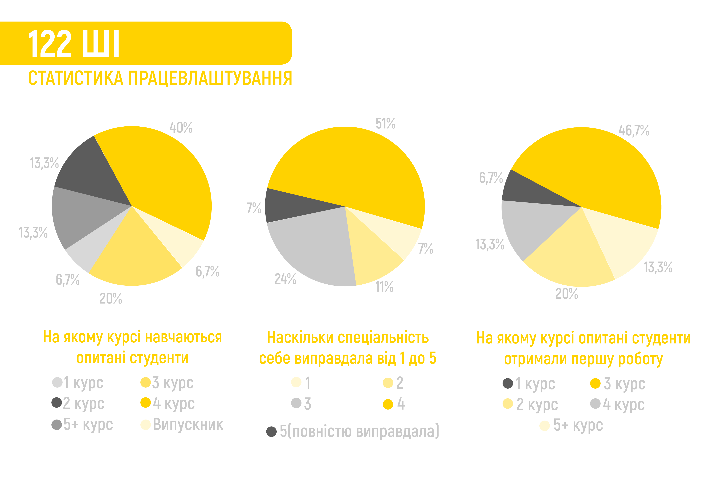

### База

«Системи і методи штучного інтелекту». Звучить досить круто, солідно й актуально, але не дай себе обманути. Якщо попросити студента ШІ розказати, що саме вивчається на цій спеціальності, ти почуєш щось на кшталт «на ММСА — математика, на СП — програмування, а ШІ — монстр Франкенштейна, зліплений із цих двох катедр». Якась штучна інтелектуальність у цьому є, проте все ще далеко від Вілла Сміта й Сонні.

<!--truncate-->

### Дисципліни

Математичний аналіз, лінійна алгебра та аналітична геометрія, дискретна математика, теорія ймовірностей — це лише вершина освітнього айсберга. Якщо порівнювати математичну підготовку двох освітніх програм, які надає 122 спеціальність в ІПСА, то катедра штучного інтелекту пропонує більш глибоке вивчення перелічених дисциплін. Ці предмети, як і математика в цілому, є основою основ у розробці та важливими для схемотехніки, машинного навчання, аналізу даних тощо.

Як і на інших катедрах, на першому курсі ти вивчатимеш мови С/С++, зможеш пізнати базові принципи алгоритмів та структур даних, аби далі мати змогу заглибитися в будь-які сфери програмування завдяки вибірковим предметам. Зазвичай саме IT-дисципліни студенти вважають найцікавішими, адже викладачі намагаються постійно оновлювати й актуалізовувати свої матеріали.

Перелік усіх предметів наведено нижче.

Тут ти можеш ознайомитися із [ЗУ-каталогом](https://osvita.kpi.ua/sites/default/files/downloads/zu-katalog-2024.pdf), а також [Ф-каталогом](https://ai.kpi.ua/ua/bachelors/28343_fkat_122kn_oppb_smai.pdf).

**P.S.** Список вибіркових дисциплін може змінюватися.

### Якщо не McDonalds, то що?

#### Data Scientist

Навчаючись на спеціальності «Комп’ютерні науки», не дивно стати науковцем. Багато предметів на катедрі ШІ спрямовані саме до такого світлого майбутнього, як Data Science. Фахівці в цій сфері займаються аналізом великого обсягу даних і застосовують різні методи для виділення цінної інформації з нього. Цю професію можна описати наступною формулою:

Data Science = «Системи й методи баз даних» (для збору та очищення даних) + «Інтелектуальний аналіз даних» (для дослідницького аналізу) + «Системи та методи штучного інтелекту» (для моделювання та прогнозування) + «Візуалізація даних» (як не дивно, для візуалізації даних).

Але для кожної з цих дисциплін варто пройти шлях воїна — перший курс, без якого розуміння цієї галузі неможливе.

> _«Основною роботою є Data Scientist. Працюю здебільшого з маркетинговими даними, дашбордами, автоматизацією, дослідженнями ефективності реклами, впровадження machine learning у предиктивний аналіз. ІПСА дав усю базу й фундамент для опанування машинного навчання. Без математики продовжувати було б досить важко, бо основні концепції — що в аналітиці, що в ML — будуються саме на ній. На самостійному вивченні було заглиблення в теми, які цікаві та необхідні: штучний інтелект, продуктова аналітика, софт для візуалізації даних»._

> _«В обов'язки входять збір даних, EDA (exploratory data analysis), preprocessing, написання й презентації моделей і обгорток, а також їхнє введення та перенавчання»._

#### Data Analyst

Відійдемо трішки від теми штучного інтелекту, але не від баз даних. Data Analyst також збирає та формує великі дані в зручний для роботи формат, також застосовує статистичні та візуальні методи для аналізу, але ключовими аспектами його обовʼязків вважається дослідження поточної діяльності компанії, виявлення недоліків та пропозиції щодо їхнього усунення.

> _«Тривіальний аналітик даних розрахує для вас багато метрик і намалює кольорові діаграми. Хороший аналітик даних переконається, що ви розумієте ці метрики та діаграми. Відмінний аналітик даних розповість вам про бізнес-проблеми, які він бачить за цими метриками й діаграмами, і також запропонує їхнє розв’язання»._

#### Data Engineer

Головне завдання дата інженера — створити максимально зрозумілу «архітектуру інфраструктури даних» з урахуванням надійності та продуктивності роботи з ними.

> _«Data Engineer відповідає за проєктування, будівництво, встановлення, тестування та підтримку великомасштабних систем управління даними. Вони зосереджені на створенні інфраструктури для генерації, зберігання й обробки інформації»._

Аби візуально схожі назви не збивали з пантелику, пропонуємо ознайомитися з діаграмою, що наведе необхідні скіли для Data Analyst, Data Scientist і Data Engineer.

#### ML Engineer

Посада ML Engineer передбачає розробку та налаштування моделей машинного навчання, створення алгоритмів для аналізу даних та побудови прогностичних моделей, а також впровадження їх у продуктивні системи. Спеціалісти цієї галузі відповідають за оцінку та вдосконалення якості й ефективності розв’язання поставлених задач.

> _«Запроваджую AI в customer care департамент (тобто в роботу з клієнтами)»._

> _«Займаюся прогнозуванням продажів товарів. Знання з пройдених математичних дисциплін застосовуються для розуміння роботи моделей, простих та складних особливо. Без матана (прим. ред. Математичного аналізу) ніяк»._

### Думки чемпіонів 

_«Я вступала на цю спеціальність, знаючи про себе точно два факти: люблю програмування, люблю математику. Думала писати сайтики або круті додатки, що людям принесуть користь, а мені, звичайно, гроші. Але згодом зрозуміла, скільки різних напрямів відкриває таке глибинне вивчення математики та програмування, які не так помітні, коли ти знаходишся ще за бортом IT-комʼюніті. Ця освітня програма є дуже обширною. Рано чи пізно починаєш забивати на одні предмети й приділяти більшу увагу вже необхідним для карʼєрного шляху — і це нормально. Як і будь-де, є викладачі, віддані своїй дисципліні всією душею, а є ті, кому не так подобається їхнє місце роботи, що не є чимось незвичним для державних університетів. Тому самонавчанням також рано чи пізно доведеться зайнятися. Підсумовуючи все це, можна сказати, що навчання на катедрі ШІ зможе принести базові знання з безлічі предметів та відкриє в тобі нові інтереси, але все залежить тільки від власного бажання»._

_«Як на мене, було забагато гуманітарних дисциплін (але так на всіх факультетах в КПІ). Також були не дуже цікаві предмети (або не дуже адекватні викладачі)»._

_«По десятибальній шкалі я поставив би 6 чи 7. Я знав, що, як і в кожному іншому універі, будуть неприємні викладачі, тому сподівання не були завищеними. Навіть значною мірою отримав те, що очікував»._

_«Почнемо з того, що хороший освітній заклад має навчити тебе вчитися, шукати інформацію, збільшувати кругозір, а також надати нові можливості. Університет — не виняток. Це місце, в якому дитина перетворюється на дорослого, набуває досвіду та звикає до соціуму. Дуже важливі роки життя, які закладають вектор подальшого розвитку._

_Є декілька об'єктивних метрик, які показують «престиж» вишу:_

+ _Кількість працевлаштованих за спеціальністю або суміжною з нею (наприклад, у сфері IT це як розробник, так і бізнес-аналітик, проджект менеджер тощо)._

+ _Середній бал ЗНО/НМТ вступників._

+ _Актуальність матеріалів та їхня достатність._

_Також є суб'єктивні метрики:_

+ _Люди: рівень студентського самоврядування, івентів, ком'юніті в цілому._

+ _Якість викладання._

+ _Кількість відрахованих._

_Важливий дисклеймер: спочатку ковід, а потім війна дуже сильно вплинули на навчальні процеси. Закрити будь-яку дисципліну стало простіше, легше списати. Менша залученість і увага, як студентів, так і викладачів. Майже немає взаємодії в реальному житті._

_Коротше, дистанційка — круто для того, щоб працювати й навчатись одночасно, але абсолютне зло для якості навчального процесу._

_Пройдемося по кожному пункту щодо ІПСА:_

_1. Дуже великий відсоток працевлаштованих, ще й на нормальні роботи (якщо тільки галери можна так називати... Та таке життя сучасних айтішників). Без дистанційки більшість починала працювати на 4 курсі або навіть після закінчення. У наші часи масово влаштовуються на півтора року раніше. Можете глянути графіки Студради, вони збирали статистику (прим.ред. Дивись вище)._

_2. Середній бал вступників високий -> розумніші студенти -> інший рівень конкуренції, глибше вивчення матеріалу, взаємодопомога -> цікавіше навчатися та спілкуватися. З цих людей обирати друзів, вони будуть колегами на роботі, тому краще, щоб це були «розумняшки», медалісти, ліцеїсти з усієї України. Найкращі. Бо саме такі люди обійматимуть високі посади, зароблятимуть багато грошей та змінюватимуть країну, сферу праці._

_3. Актуальність і достатність матеріалів. Математичні дисципліни не можуть бути не актуальними, а їх не те щоб недостатньо. Їх забагато. Математика — це як тренажерка, але для мізків. Викладачі топ, муштрують, задають непристойно багато домашки._

_Прога нормальна для штучного інтелекту, комп'ютерного зору, нейронок, моделей і т.д. Але починається лише з третього курсу щось більш-менш профільоване. Інших напрямів: фронтенду, бекенду, геймдеву, девопса — дуже мало й дуже поверхньо. Хоча, а що ви очікували від спеціалізації «Методи і системи штучного інтелекту»? Пайтон стане тобі другою мовою після української. Але можливо провчитися 6 років і не написати жодної лаби самостійно. Перевірено особисто. Також існує відсотків 30-35 взагалі непотрібних, нудних, застарілих речей. Без них ніяк. Так усюди._

_4. Люди. Дивись пункт про середній бал ЗНО. Та розумій, що читаєш цей відгук, бо Студрада париться і робить якісний контент. Без перебільшень, найкраще студентське самоврядування в КПІ (і в Україні, певно) на рівні факультетів. У добуремні часи кількість офлайн івентів сягала близько 25 за рік. Тому ІПСАшники не лише навчаються, а й розважаються. І це дуже круто._

_5. Якість викладання. Нефахівців одиниці. Нецікавих відсотків 30. Але кожен сам обирає, куди йому рухатись і які предмети вчити більш прискіпливо, ґрунтовно. Є викладачі, для яких універ — це, скоріше, хобі, а самі вони працюють в компаніях або керують ними. Цим можна користуватися, щоб отримувати більш актуальні знання та спробувати потрапити на роботу._

_6. Кількість відрахованих. Зараз не знаю, але в мої часи з 32 людей в групі залишалось 18. Навчатись тут складно, матеріалу дуже багато, домашок теж, не всі предмети цікаві та зрозумілі. Але це добре, оскільки залишаються найсильніші (та ті, хто зрозумів, що ІПСА не для нього, і це нормально)»._

Наступний [відгук](https://telegra.ph/Toj-samij-v%D1%96dguk-05-16) — спадщина минулих років, без якої ця стаття не буде досконалою.

### Висновок

Будемо максимально відвертими: якщо твоя душа лежить до дизайну чи розробки, де математика не так потрібна, як програмування чи креативність, катедра ШІ не найкращий вибір для тебе. Ця освітня програма створена для тих, хто бачить себе у світі «big data», хто готовий іти в майбутнє й автоматизовувати обробку даних (це ж той самий «штучний інтелект»), хто готовий писати код на більш глибинному рівні, ніж це робиться на більшості популярних IT-курсах, і хто впевнений, що це йому не набридне.