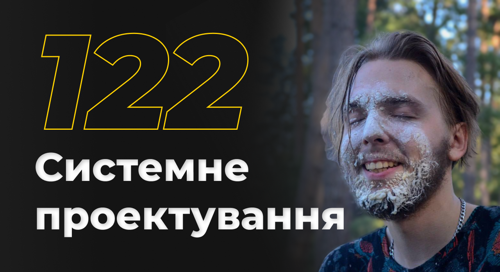
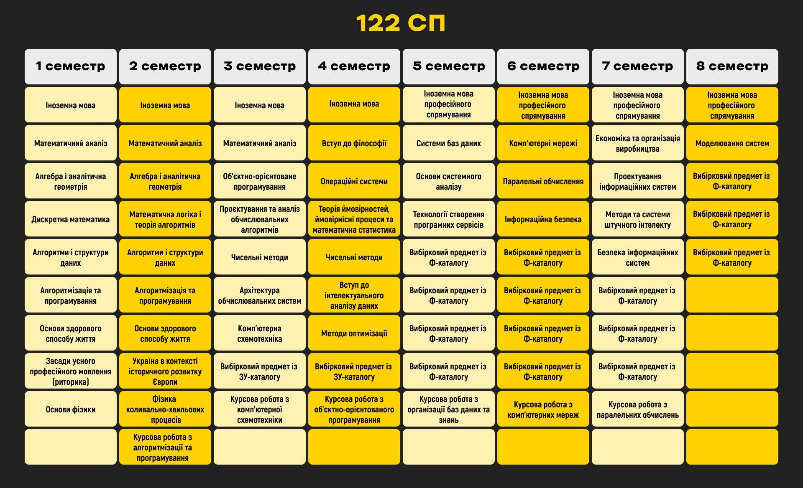
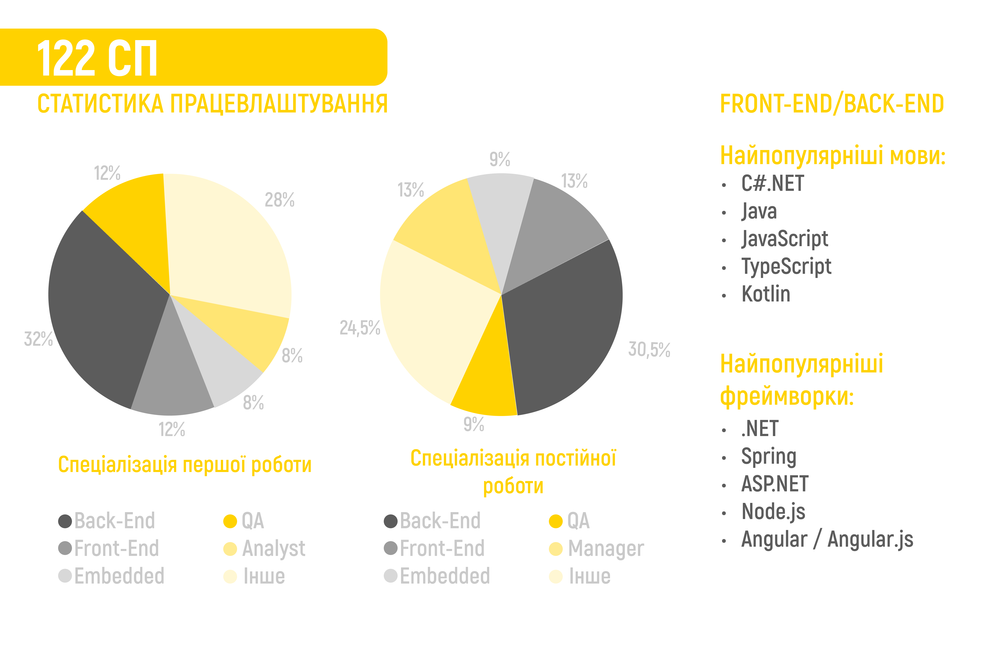

<!--truncate-->

Освітня програма цієї катедри має назву «Інтелектуальні сервіс-орієнтовані розподілені обчислювання». Звучить досить незрозуміло та складно. Якщо ж попросити студента катедри СП озвучити у двох словах, що тут вивчають, дуже велика ймовірність почути у відповідь щось на кшталт «залізо» чи «солянка» і заплутатися ще більше. Та істина криється в різноманітності й обширності 122-ої спеціальності. Випускники «Комп’ютерних наук» працюють майже в усіх сферах IT: від embedded до менеджменту. На катедрі Системного Проектування після засвоєння математичної бази й основ програмування студент має змогу отримати знання, необхідні для роботи в багатьох напрямах, і визначити, що йому більш цікаво, щоб продовжити розвиватися в обраній галузі.

### Questions & answers:

#### Наскільки актуальні знання дає спеціальність?

_Математичні дисципліни._ Незважаючи на те, що математична підготовка на Системному Проектуванні може не бути настільки поглибленою, як на інших катедрах ІПСА, вона є фундаментом для майбутнього навчання та працевлаштування. Зокрема, знання алгебри та аналітичної геометрії можуть знадобитися при розробці ігор, а математичний аналіз відчиняє двері для розуміння предметів, пов'язаних із архітектурою комп'ютера, та багатьох інших застосувань.

_Програмування._ На першому курсі студентам пропонуються основні структури й алгоритми мов С / С++. Далі, залежно від предмету, можна обирати певні спеціалізовані напрями, що відповідають інтересам кожного. Але все ж таки, деякі викладачі можуть вимагати написання коду на С++, це робиться для забезпечення глибшого розуміння будови комп’ютера, організації пам'яті й інших важливих аспектів.

_Архітектура комп’ютера._  Розуміння мікроархітектури є важливим елементом у побудові ефективних програм і систем. Це дає змогу розробникам писати якісний код, використовуючи можливості апаратного забезпечення, та оптимізувати роботу програм та систем. Окрім цього, знання архітектури комп'ютера є важливим у багатьох галузях, таких як: Веб-розробка, створення мобільних додатків, штучний інтелект та багатьох інших.

[ЗУ](https://osvita.kpi.ua/sites/default/files/downloads/ZU-Katalog-2022.pdf), а також [Ф](https://cad.kpi.ua/wp-content/uploads/2023/03/fkat_122_oppb_isoro_2023.pdf) каталоги*

P.S. Список вибіркових предметів може змінюватися.

#### Ким ти станеш, закінчивши спеціальність?

Основні сфери працевлаштування випускників — розробка та менеджмент (зокрема клінінг). Найпоширеніші професії:

Software developer — розробник програмного забезпечення.

Quality Assurance engineer — спеціаліст, обов’язками якого є тестування програмних продуктів.

Embedded developer — розробник вбудованого ПЗ.

Project manager — фахівець, головним завданням якого є управління проєктами.

Web-developer — розробник інтернет-ПЗ.

Цей список невичерпний, адже випускники та випускниці працюють як у великих корпораціях, так і в амбітних стартапах.

### Student feedback

 

#### Кому порадиш цю спеціальність?

_«Людям, котрі не знають, чого хочуть від ІТ-освіти, прагнуть до отримання широкого спектру знань у цій сфері з акцентом на теоретичних засадах вищої математики (у широкому сенсі), а також можливості вибору доменної сфери: від веб-розробника до інженера в галузі машинного навчання.»_

_«Людям, яким подобається одночасно й математика, і низькорівневе програмування, і програмування високого рівня, і схемотехніка, але які ще не визначилися, що саме подобається найбільше. Тим, хто не знає, що їм подобається, але хоче спробувати якнайбільше різноманітних сфер. Тут дуже широкий огляд.»_

_«Людям, які хочуть займатись CS, водночас ще не визначившись із спеціалізацією. Тим, хто вміє багато працювати та хоче розвиватись, хто може витримати серйозну напругу через навчання.»_

_«Я б сказала, що цільова аудиторія – любителі математики, нескінченного ресерчу, розв'язання «загадок», структурування інформації. Це люди, які хочуть працювати у сфері IT. Після закінчення бакалаврату в студента є чітке розуміння базових понять із різних («суміжних») галузей в IT. Йому показали все – далі тільки власний вибір і глибше розуміння своєї сфери для співбесід.»_

Студенти застерігають про велике навантаження та не найкращу якість викладання деяких предметів, пов'язаних із hardware-напрямом.

#### Як ІПСА вплинув на пошук / вибір першої роботи?

_«Вплинув опосередковано. ІПСА, як факультет, або ж КПІ загалом, як університет, — ніяк. Але допомогли навички швидко та якісно вчитися, що були набуті під час здобування знань в ІПСА, стресостійкість, а також отримані знайомства з іншими студентами.»_

_«До карантину та війни активна спільнота постійно стимулювала тебе до досягнення більших висот у самореалізації як спеціаліста, а навчання надавало широкі можливості для вибору необхідної доменної області, забезпечуючи водночас гнучкими варіантами здобування освіти, котрі дозволяють реалізувати проєктні та лабораторні роботи в цікавій вам сфері ІТ.»_

Багато респондентів зазначають користь інфосфери ІПСА та мотивації від ком'юніті, а також упізнаваність інституту серед деяких роботодавців, близько половини опитаних не помічали впливу з боку катедри на пошук роботи.

#### Ким працюють ІПСАшники?

#### Back-End Developer

##### Докладніше про посаду

#### _Стек: Java, SQL, Spring, Hibernate_
#### _Посада: Junior Java Developer_
_Розробка велетенської та немолодої системи, її підтримка, частковий рефакторинг. Незважаючи на посаду молодшого розробника, маю ідентичні із співкомандниками обов‘язки._

#### _Стек: Java, Kotlin, Spring_
#### _Посада: Junior Java/Kotlin Developer_
_Анбординг (випробування) тривав 3 місяці, на другому вже почали давати завдання, які безпосередньо впливають на продукт. Дуже стрімке зростання в знаннях і досвіді, задачі з кожним разом усе складніші. На 8-9 місяці надали роль розробника пристрою в команді. (Компанія продуктова, якщо що, і робота всіх команд над спільними цілями)._

#### _Стек: C#/.NET, Python, Revit API_
_Розробка та підтримка додатку для Revit згідно з вимогами інженерів. Робота з 3D моделями, з інформаційними моделями будівель і все таке._

#### СЕО

##### Докладніше про посаду

_Засновник стартапу з лідогенерації, автоматизуємо збір даних, що використовуються в холодних розсилках._

_**Обов'язки:** code review, hiring, marketing, strategy, business development, project management_

#### Project Manager

##### Докладніше про посаду

_**Обов'язки:** керування командою, планування задач проєкту, планування бюджету, формування документації, підтримка якості проєкту, менеджмент ризиків та інші._

#### Software developer

##### Докладніше про посаду

_Розробка програмних продуктів у сфері Artificial Intelligence під системи мобільних телефонів, телевізори тощо, у якій використовуються різні технології та мови програмування, однак найбільше С++. Робота з продуктами, які комерціалізуються та застосовуються користувачами в усьому світі._

#### Mobile developer
##### Докладніше про посаду

_Розробка Android-додатків у сфері Health&Fitness із щомісячною юзер-базою в декілька мільйонів користувачів з орієнтацією на ринок Америки та Японії._
_**Обов'язки:** розробка нового функціоналу (фічей), рефакторинг коду на останні актуальні технології у сфері, виявлення та виправлення наявних помилок (багів) у системі. Оскільки компанія продуктова, то досить часто необхідно обговорювати, критикувати чи пропонувати зміни до розроблюваного функціоналу._

#### No-code developer

##### Докладніше про посаду
_**Обов'язки:** побудова чат-ботів для автоматизації процесів компанії / компаній засобами low-code / no-code платформи._

#### Цікаві запитання з інтерв'ю

_«Чому це працює? (запитання на код рев'ю тестового).»_

_«На одній із співбесід я обговорював з інтерв'юерами сорти пива та плюси й мінуси капіталізму та соціалізму.»_

_«Цікаве тестове завдання:
є хмара з точок, розташованих на регулярній сітці. Задана певна дискретна функція руху сфери фіксованого радіуса в цій хмарі. Усі точки, з якими сфера стикається, видалити з хмари. Треба розробити програму, яка повертає верхній шар цієї хмари.»_

#### Дисклеймер
Рецензії написані студентами старших курсів спеціальності катедри СП. У відгуках збережена автентична лексика, тому вони можуть сприйматися суб'єктивними та не зовсім делікатними. Читайте на свій страх і ризик…

#### Нотатки солдатів

#### _Чим із гарної сторони запам'яталося навчання?_
_«Цікаві лабораторні з АСД (Алгоритмів і структур даних), івенти»_

_«Важко відповісти, напевне, найкраще в навчані (та єдине, що тримає не відрахуватися) — це круті одногрупники»_

_«Студрада крутишки.»_

_«Велика кількість випробувань та «відкриттів», що зрештою допомагають у пошуці роботи.»_

_«Наданням інформації про комп'ютерні науки в ширину: від бидлокодинга на вебі до машинного навчання, проєктування транзисторів та роботи з юнікс-системами. 
Навантаження з природничих дисциплін так само вважаю надмірними, проте, з точки зору того, що воно дало в подальшому житті, це однозначно те, що необхідно хоча б на Е-шку закрити
Студрада та час, відданий альтруїстичним цілям. З ними пов'язаний один із найкращих періодів у моєму житті (особливо доковідний).»_

_«Враховуючи те, що більшість викладачів — професіонали своєї справи, які намагаються донести матеріал, пояснити, роз'яснити помилки в контрольних, то мені дійсно подобається вчити матеріал, ну і плюс полюбила фізику, яку зі школи ненавиділа»_

#### _Чим із поганої сторони запам’яталося навчання?_

_«У перший день на першій парі на нас накричали (досі не зрозуміло за що), і це дало зрозуміти, що навчання буде «веселим».»_

_«Деякі викладачі проводять лекції та навіть практики просто читаючи матеріал із документу на екрані, що не дуже сприяє гарному засвоєнню інформації.»_

_«Дуже навантажують.»_

_«Половина всіх дисциплін потребувала винятково самостійного пошуку та вивчення матеріалу . Рівень вимог при цьому високий. На другому курсі є декілька неприємних (або дуже неприємних) викладачів»_

_«Надмірним навантаженням на першому курсі, некомпетенцією, байдужістю та нарцисизмом деяких викладачів (загалом типовий пересічний колега в реальному житті).»_

#### _Які твої загальні враження від навчання?_

_«Взагалі непогано, але велику увагу на першому курсі приділяють математичним предметам. На саме програмування виділяють не так багато часу. Проте, звісно, математика дуже потрібна для деяких галузей.»_

_«КПІ – місце, де збуваються мрії або ламається психіка»_

_«Вступила би в інше місце, аби мати змогу спокійно працювати паралельно з навчанням і не втрачати останні нервові клітини. Хоча диплом, мабуть, тут все-таки гарний :»_

_«Важкувато, але загалом більш-менш нормально. Однак при вступі думав, що враження після першого семестру першого курсу будуть кращі.»_

_«Замітка для абітурієнта: уявіть, що вас кидають у величезне болото під назвою «Українська ІТ освіта». Ваша ціль — вигрести з цього болота до моря «Українська ІТ індустрія», а звідти в океан «Світова ІТ індустрія». На початку шляху ваша альма-матер надає декілька предметів в інвентар, котрі мають допомогти у вашій подорожі. На якомусь факультеті це весло, на якомусь дошки та цвяхи. У випадку ІПСА — це мотузка і мило. Перший час із цими речами вам хочеться вкоротити собі віку, але зробити це ніде, ви ж посеред болота, тут навіть дерев нема. Тому згодом починаєте думати, яким чином їх можна застосувати. Через певний час за допомогою мотузки ви робите лассо, збираєте ним собі гілочки. Зрештою, у вас є певний засіб, за допомогою якого  пересуваєтеся по болоту швидше, ніж пішки, і ви дістаєтеся до моря, де використовуєте мило, щоб помитися та представити себе світу.»_

#### _Яким ти бачиш ідеального випускника спеціальності?_

_«Любитель математичних наук, програмування, який іноді готовий викластись на 110% задля того, щоб встигнути за дедлайном.»_

_«Це вузьконаправлений спеціаліст (бекенд / девопс / мл інженер / мобільний інженер тощо), котрий має компетенцію технічних знань у ширину.»_

_«Сеньйор у будь-якій IT-галузі з оффером від Google.»_

_«Універсальний солдат в ІТ, який може витримати й незрозумілі вимоги, і сучасні практики»_

_«Живим»_

#### Нотатки ветеранів
«
_Якщо подивитися на всю програму 122 (а я вже пройшов весь бакалаврат + проф. магістратуру), то назва «Комп'ютерні науки», на мою думку, повністю себе виправдовує. Перші два курси були пов'язані більше з математичними дисциплінами (матан, лінал, дм, фізика, теорія ймовірності, тощо) і з азами програмування (основи програмування, алгоритми і структури даних, ооп тощо). Далі суто математичних предметів майже не було, а пішли дисципліни, в яких математика з програмуванням ідуть пліч-о-пліч (дослідження операцій, теорія прийняття рішень тощо), а також стає все більше предметів, які можна назвати «чистим програмуванням», тих, що пов'язані зі штучним інтелектом.
Також не слід забувати, що є багато предметів, які пов'язані з низькорівневим програмуванням та «залізом», проте, насправді, мізерний відсоток студентів іде в цьому напрямі, тому ця інформація в більшості проходилася й забувалася, а згадувалася, коли щось зустрічалося в іншому предметі, який був із цієї ж опери. Але, якщо дійсно цікаво отримати ці знання, то вони будуть надані на досить високому рівні, адже викладачі з цих предметі досить професійні та розбираються в них.
Великим плюсом комп. наук вважаю предмети, що пов'язані з менеджментом. Звісно, вони не без недбальства, але зрозуміти, що і як працює при організації роботи допоможуть, що є дуже важливим потім для роботи в будь-якій сфері ІТ і не тільки.
Звісно, є предмети, які або просто не потрібні, або «в принципі ок» чи навіть дуже важливі (як бази даних), але на них викладачі не відповідають хоча б якомусь рівню викладання, навіть мінімальному, тому, якщо вам цікаві ці предмети, будете дуже розчаровані. Але з появою вибірковості предметів можна минути викладачів і дисципліни, які тобі не цікаві — це дуже сильно допоможе зробити програму під себе і вибрати те, що хочеш, але іноді це перетворюється на не вступи в «міну», щоб не отримати абсолютно зайвий геморой. Також з'явилася можливість обрати деякі предмети з інших факультетів й іноді студенти цим користуються, бо на одному факультеті важко помістити все потрібне, і щось може ігноруватися, але тепер це теж можна виправити.»_

#### _«Чи не шкодую я про вибір універу, факультету і спеціальності?_

_Однозначно НІ._
_Якби це не було не так, я б уже у вересні повернулася би до Дніпра і вчилася би в Нобеля. Математика завжди була моїм фаворитом серед предметів, і в цьому ІПСА немає рівних. Відразу поясню, попри те, що спеціальність – Computer Science, мій факультет ніколи не зліпить готового IT-фахівця. Вони дають трохи більше: навчать ПРАВИЛЬНО вчити, фільтрувати і розбирати матеріал, решта – справа бажання.
ІПСА дарує можливості – головне вхопитися._
_З можливостей хочу виділити:
- Ком'юніті – студенти (зазвичай старших курсів) часто кидають вакансії / стажування своїх компаній у чати або можуть запропонувати фріланс.
- Викладачі – можуть сприяти працевлаштуванню (як це було зі мною обидва рази), якщо бачать, що студент дуже зацікавлений їхнім предметом, найчастіше це рекомендації в компанію викладача.
- IASA Student Council (TG канал) – канал, де розміщуються вакансії, що надходять нашій Студраді.
Я скористалася 2/3._

#### _Складно вчитися?_

_Так, і доходило до того, що на годиннику 4:30 (ночі), а я зі сльозами на очах вивчаю фізику (контрольна, кінець семестру), а все це через невміння списувати й совість, що гризе, але я не пишаюся цим.
Але незважаючи на це, навчання буває цікавим і корисним. Хоча українську систему освіти ніхто ще не відміняв і не змінював, тому не складно здогадатися, що якась частина вичитаної інформації просто-напросто зайва (не актуальна).
Однак, хочеться відзначити, що на СП дуже багато молодих IT-фахівців, які практикують. Здача лабораторних більше нагадує цікаву дискусію і мозковий brainstorm для студента, навіть якщо десь щось не прошарив – після здачі все стане на свої місця й інформація засвоїться ще краще._

#### _Порада_

_Не шукайте себе, а створюйте.»_

