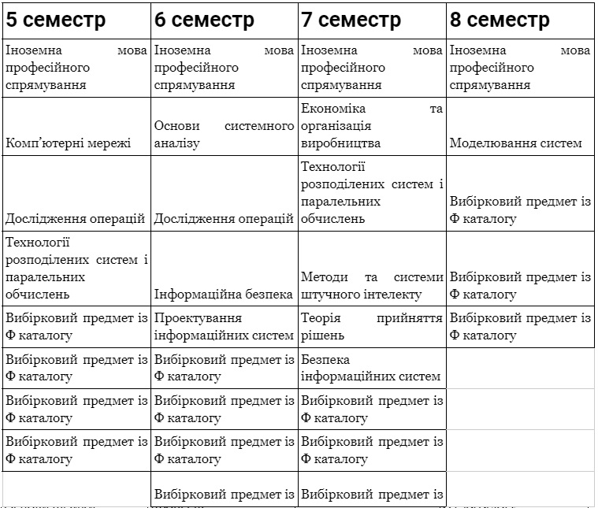
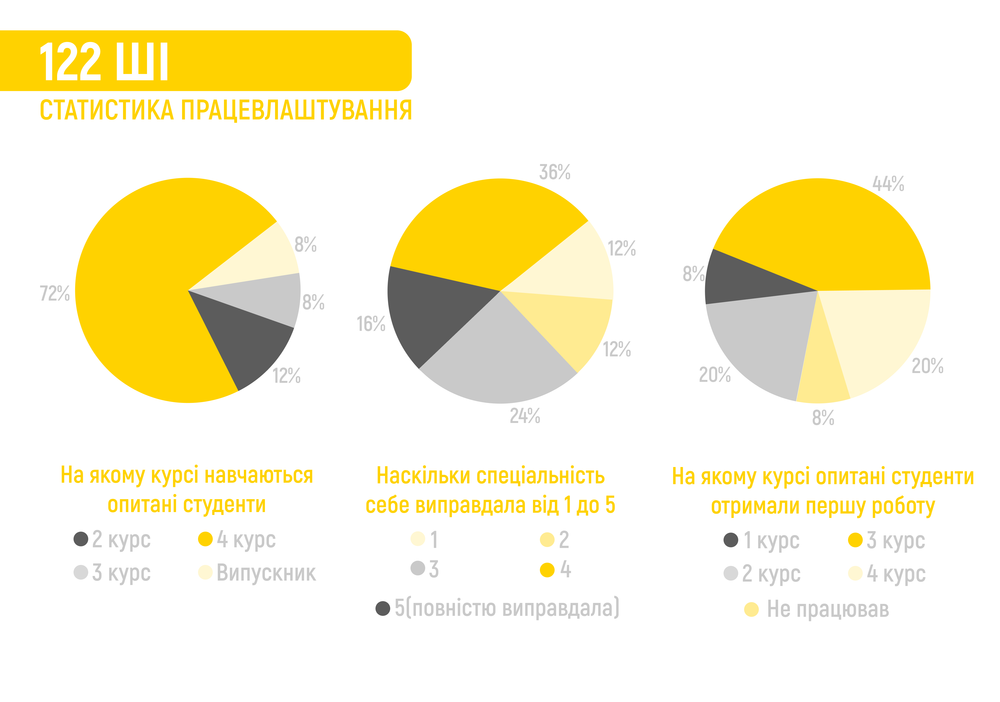

<!--truncate-->

«Системи і методи  штучного інтелекту». Звучить досить круто, солідно й актуально, але не дайте себе обманути. Якщо попросити студента ШІ розказати, що саме вивчається на цій спеціальності, ви почуєте щось на кшталт «На ММСА — математика, на СП — програмування, а ШІ — Франкенштейн, зліплений із попередньо названих катедр». Якась штучна інтелектуальність у цьому є, проте все ще далеко від Вілла Сміта і Сонні.

*Подколзін Г. Б. (викладач) про назву катедри*
### Questions & answers:

#### Наскільки актуальні знання дає спеціальність?

*Математичні дисципліни.* Якщо порівнювати математичну підготовку двох освітніх програм, які пропонує 122 спеціальність в ІПСА, то катедра «Штучного інтелекту» практикує більш поглиблене вивчення цих дисциплін. Математичний аналіз, лінійна алгебра та геометрія, дискретна математика, теорія ймовірностей і це лише вершина айсбергу. Усі вони створюють базу для подальшого занурення в такі предмети як схемотехніка, машинне навчання, аналіз даних і багато інших.

*Програмування.* Як і на інших катедрах, на перших двох курсах ви зануритеся детально у вивчення мов С та С++. Зможете пізнати базові принципи алгоритмів та структур даних, аби далі мати змогу поглибитися в будь-якій сфері програмування за рахунок вибіркових предметів. Зазвичай, саме ці дисципліни студенти вважають найцікавішими, адже викладачі намагаються постійно оновлювати та актуалізовувати свій матеріал.

[ЗУ](https://osvita.kpi.ua/sites/default/files/downloads/ZU-Katalog-2022.pdf), а також [Ф](https://cad.kpi.ua/wp-content/uploads/2023/03/fkat_122_oppb_isoro_2023.pdf) каталоги*

P.S. Список вибіркових предметів може змінюватися.

#### Ким ти станеш закінчивши спеціальність?

Основні сфери працевлаштування випускників... Ем, вони відсутні (життя жорстоке). 

*Автор попереднього речення вирішив додати трохи комедіантства у статтю, не звертай уваги.*

Ось перелік **найпопулярніших професій:**

Machine learning engineer — фахівець із машинного навчання, що займається створенням штучних нейронних мереж.

Computer Vision Engineer — фахівець у галузі комп'ютерного зору, який розробляє алгоритми для аналізу зображень та відео.

ERP System Support Specialist — фахівець із підтримки та адміністрування систем ERP, який забезпечує їхнє ефективне використання в організації.

Data scientist — спеціаліст, що вивчає проблеми аналізу, обробки та представлення різноманітних даних у цифровій формі.

Big data engineer — спеціаліст, що працює з великими наборами даних із застосуванням спеціальних методів обробки та аналізу.

Front-End Developer — фахівець із розробки вебінтерфейсів користувача, який створює зручні та ефективні інтерфейси для вебсайтів та додатків.

Це далеко не весь перелік, адже кожен знаходить нішу відповідно до вподобань ~~своїх батьків~~.

### Student feedback

#### Кому порадиш цю спеціальність?

_«Людям, яким цікаво не тільки розробляти програмне забезпечення, але й проектувати його. Людям, яким цікаво проектувати і створювати складні системи, зокрема системи прийняття рішень. Людям, яким цікаво як влаштовані криптовалюти та як з ними працювати. Людям, яким цікавий штучний інтелект та його підзадачі, оптимізації процесів, аналіз даних та створення прогнозів на майбутнє за допомогою математики та програмування. Людям, хто може сприймати сам процес програмування як творчість.»_

Студенти часто акцентують увагу на активному ком’юніті та складності деяких математичних дисциплін.

#### Як ІПСА вплинув на пошук / вибір першої роботи?

_«Вивчив базу з першого курсу, цього було достатньо для першого стажування, надалі вчив тільки більше, як в університеті, так і на роботі.»_
_«Завдяки ІПСА я усвідомив, що університет не дасть тобі абсолютно ніяких корисних знань і почав вчити самостійно необхідні для роботи речі. Так і знайшов роботу.»_

Опитані також згадують корисність інфосфери ІПСА та вплив деяких окремих предметів. Більша частина респондентів впливу на пошук роботи не помічала.

#### Ким працюють ІПСАшники?

#### Data Scientist (Data / Big Data / ML / Computer Vision Engineer, Data Scientist)

**Докладніше про посаду**

#### _Machine Learning Engineer_

_«Займаються прогнозуванням продажів товарів. Знання з пройдених математичних дисциплін застосовуються для розуміння роботи моделей, простих та складних особливо. Без матана ніяк.»_

#### _Computer Vision Engineer_

_«Research and Development (RnD). Математична основа знадобилась для прочитання наукових статей, проектування моделей, їх навчання та оцінки. Математика та відповідне програмування буквально всюди і кожен день.»_

#### Front-End Developer

**Докладніше про посаду**

#### _Стек: TypeScript, React.js_

_«Окрім притаманному джунам перефарбовуванню кнопок, отримання даних з бека та створення адаптивного оптимізованого інтерфейсу для користувачів.»_

#### ERP System Support Specialist

**Докладніше про посаду**

_«Підтримка та зміна налаштувань системи CRM, створення та надання доступу користувачам, відповіді на запити та допомога в роботі з системою, тестування та поліпшення функціоналу.»_

#### Дисклеймер

_Рецензії написані магістрами та бакалаврами 122 спеціальності катедри ШІ. У відгуках збережена автентична лексика, тому вони можуть сприйматися суб'єктивними та не зовсім делікатними. Читайте на свій страх і ризик..._

#### Нотатки новачків

**Чим із гарної сторони запам'яталося навчання?**

_«Круто викладається математика, все зрозуміло. Рекомендую завжди питати викладача, якщо щось не зрозуміло. Та також рекомендую розуміти доведення кожної теореми, особливо її сенс та як її використовують на практиці, оскільки, на жаль, сенс та навіщо це треба часто пропускаються, але завжди можна запитати це у викладача. Впринципі далі будуть викладатися такі предмети, де вже буде зрозуміло навіщо вчилася ця математика та як її використовувати на практиці. І це дуже круто, хоча для мене було б легше це пояснювати паралельно викладанню (теорія ймовірності та частина мат. логіки винятки).»_
_«Цікавим студентством; деякими викладачами, які продовжують якісно виконувати свою роботу незважаючи на свої проблеми, вік і ставлення практики.»_
_«На перших двох курсах багато цікавих математичних дисциплін. Також було декілька дисциплін з програмування, які викладалися на дуже високому рівні.»_
_«Дружнім колективом, як одногрупники, так і люди з інших груп та курсів — всі просто нереально круті!»_

**Чим із поганої сторони запам'яталося навчання?**

_«Є викладачі, які із року в рік не дають студентам нормально жити, з постійно новими високими (надто високими) вимогами та необ'єктивним оцінюванням.»_
_«Є предмети, в яких потрібно розбиратися виключно самому, оскільки отриманої інфи замало для вирішення поставлених задач.»_
_«Дистанційне навчання, деякі дисципліни існують «для галочки».»_
_«Як на мене, було забагато гуманітарних дисциплін(але так на всіх факультетах в КПІ). Також були не дуже цікаві предмети (або не дуже адекватні викладачі).»_

**Які твої загальні враження від навчання?**

_«По 10-бальній шкалі я б поставив 6 чи 7. Я знав, що як і в кожному іншому універі будуть неприємні викладачі, тому очікування не були завищеними. Навіть значною мірою я отримав те, що очікував.»_
_«Відчувається важкість через надзвичайну навантаженість предметами, але в ТОП-1 Університеті України так і має бути. Мені дуже подобається колектив групи, в якому ти вільно себе відчуваєш і можеш завжди запитати про допомогу, чудові івенти КПІ, які варто відвідувати кожному.»_
_«Цікаво, але місцями досить складно, раджу ретельно подумати перед тим, як вступати, перш за все, впевнитися, що у вас міцна нервова система.»_

**Яким ти бачиш ідеального випускника спеціальності?**

_«Кращий дата саєнтист у місті.»_

_«Всесторонній геній, що вміє програмувати, знає фізику, вміє вирішувати логічні задачі.»_
_«З міцними нервами та стабільною психікою.»_
_«Соціально активна людина з розумінням багатьох сфер ІТ і баченням свого майбутнього розвитку.»_

#### Замітки динозаврів

#### _ІПСА — іноді потрібна склянка алкоголю._

_«Почнемо з того, що гарне місце для навчання має навчити вас навчатися, шукати інформацію, збільшувати кругозір, давати нові можливості. Університет — не виключення. Це місце, в якому дитина перетворюється на дорослого, отримує досвід та вчиться знаходитися в соціумі. Дуже важливі роки життя, які закладають вектор подальшого розвитку._

_Є декілька об'єктивних метрик, які показують «престиж» вишу:_

_• Кількість працевлаштованих за спеціальністю або суміжною спеціальністю (для айті — не розробник, а бізнес аналітик, проджект менеджер та інші)_

_• Середній бал ЗНО вступників._

_• Актуальність матеріалів та їх достатність._

_Також є суб'єктивні метрики:_

_• Люди — якість студентського самоврядування, івентів, ком'юніті в цілому._

_• Якість викладання._

_• Кількість відрахованих._

_Важливий дисклеймер: спочатку ковід, а потім війна дуже сильно вплинули на навчальні процеси. Скласти будь-яку дисципліну стало простіше, легше списати. Менша залученість і увага як студентів, так і викладачів. Менша взаємодія у реальному житті._

_Короче, дистанційка — круто для того, щоб працювати і навчатись одночасно (бо можна не навчатись). Але абсолютно погано для якості навчального процесу. Тому наступні кілька років отримаємо фігових спеціалістів, які провчилися на дистанційці._

_Пройдемося по кожному пункту щодо ІПСА:_

_1. Працевлаштованих дуже великий відсоток, ще й на нормальні роботи (якщо тільки галери можна називати нормальною роботою... Та таке життя сучасних айтівців). Без дистанційки починала працювати більшість на 4-му курсі, або навіть після закінчення. З дистанційкою починають масово працювати на роки півтора раніше. Можете глянути графіки студради, вони збирали статистику._

_2. Середній бал вступників високий -> розумніші люди з тобою навчаються -> вище рівень конкуренції, глибше вивчення матеріалу, взаємодопомога -> цікавіше навчатись, цікавіше спілкуватись. З цих людей вам обирати друзів, ці люди будуть вашими колегами на роботі. Це ваші «собутильники» (вибач, що відкрив очі на правду — люди п'ють алкогольні напої). Це філософи за своєю сутністю. Тому краще, щоб це були розумняшки, медалісти, ліцеїсти з усієї України. Кращі. Бо саме такі люди будуть обіймати високі посади, заробляти багато грошей та змінювати країну, сферу праці._

_3. Актуальність і достатність матеріалів. Математичні дисципліни не можуть бути не актуальними, а їх не те що недостатньо. Їх забагато Математика топ — це як тренажерка, але для мізків. Викладачі топ, муштрують, задають непристойно багато домашки._

_Прога нормальна для штучного інтелекту, комп'ютерного зору, нейронок, моделей і т.д. Але починається лише з третього курсу щось більш-менш профільоване. Для інших напрямів типу фронтенду, бекенду, геймдеву, девопса — дуже мало й дуже поверхньо. Хоча, а що ви очікували від спеціалізації «Штучний Інтелект»? Пайтон стане вам другою мовою після української. Але можливо провчитися 6 років і не написати жодної лаби на пайтоні самостійно. Перевірено особисто._

_Також існує відсотків 30-35 взагалі непотрібних, нудних, застарілих речей. Без них ніяк. Так усюди._

_4. Люди. Дивись пункт про середній бал ЗНО. Та розумій, що читаєш цей відгук, бо СтудРада париться і робить якісний контент. Без перебільшень, найкраща студрада в КПІ (і в Україні, певно) на рівні факультетів. В добуремні часи кількість офлайн івентів сягала близько 25 за рік. Тому іпсашники не лише навчаються, а й розважаються. І це дуже круто._

_5. Якість викладання. Нефахівців одиниці. Нецікавих відсотків 30. Але кожен сам обирає, куди йому рухатись і які предмети вчити більш прискіпливо, ґрунтовно. Є викладачі, для яких універ — це, скоріше, хобі, а самі вони працюють в компаніях або керують ними. Цим можна користуватися, щоб отримувати більш актуальні знання та спробувати потрапити на роботу.__6. Кількість відрахованих. Зараз не знаю, але в мої часи з 32 людей в групі залишалось 18. Навчатись тут складно, матеріалу дуже багато, домашок багато, не всі предмети цікаві та зрозумілі. Але це добре, оскільки залишаються найсильніші (та ті, хто зрозумів, що ІПСА не для нього, і це нормально).»_

Наступний [відгук](https://www.hashtap.com/redirect?url=https%3A%2F%2Ftelegra.ph%2FKatedra-to-hark%D1%96vskij-pravopis-%D1%96di-nahuj-pan-perev%D1%96ryayuchij-07-02&strict=0&redirect_token=0070635a98a5529993a373856c99eb0d5f835cb7d26f2786f902e5ca085d57da41d35b558a7ebcdf30c925a789896fb99fe11a60cd3c4bbf6fbfe7fbb8b817dc) не пройшов цензуру, тому ви матимете можливість прочитати його окремо. Але обережно, це може бути небезпечно для вашого здоров'я.

