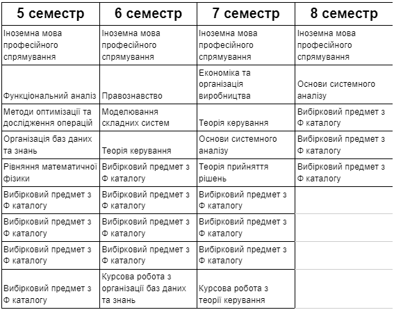

<!--truncate-->

Системний аналіз – методологія, яка передбачає сукупність інструментів для розвʼязання задач різних сфер досліджень: від аналізу фондових ринків та ризиків на біржі до оцінки стану здоров’я людини по відео. Також пояснює, як працювати в умовах невизначених / протирічних вхідних даних, і надає можливості прогнозування та передбачення поведінки системи.
На 124 спеціальності вивчають формалізацію та побудову моделей з розумінням необхідності їхнього впровадження в комп'ютерне середовище. Тобто для моделювання необхідна математика, а для реалізації потрібно володіти базовими навичками програмування.

### Questions & answers:

#### Наскільки актуальні знання дає спеціальність?

_Математичні дисципліни._ Актуальність базових дисциплін є риторичним питанням. Сучасні предмети, на зразок теорії ігор чи статистики, викладачі адаптують під сьогодення та знайомлять із новітніми досягненнями цих наук.
Більшість опитаних студентів вважає лінійну алгебру й аналітичну геометрію (синки), дискретну математику (півні/чорти) та математичну статистику (мужики) найцікавішими дисциплінами.
**Програмування.** На першому курсі вивчаються базові принципи програмування на прикладі мов C/C++. На старших курсах можна обирати предмети в цікавому для тебе напрямі. Викладачі дисциплін намагаються підтримувати актуальність свого матеріалу.
Програмування та алгоритмічні мови (шерсть) й об’єктно-орієнтоване програмування (пахани) за даними опитування виявилися найцікавішими дисциплінами.
Із переліком усіх предметів можна ознайомитися нижче.

[ЗУ](https://osvita.kpi.ua/sites/default/files/downloads/ZU-Katalog-2022.pdf), а також [Ф](http://mmsa.kpi.ua/sites/default/files/fkat_124_oppb_sau_2023.pdf) каталоги

#### Ким ти станеш, закінчивши спеціальність?

Основні сфери працевлаштування випускників — ІТ , аналітика та вільна каса. Найпоширеніші професії:
Software developer — розробник програмного забезпечення.
Machine learning engineer — фахівець із машинного навчання, що займається створенням штучних нейронних мереж.
Data scientist — спеціаліст, що вивчає проблеми аналізу, обробки та представлення різноманітних даних у цифровій формі.
Project manager — фахівець, головним завданням якого є управління проєктами.
Business analyst — людина, яка виявляє проблеми бізнесу замовника та знаходить їх вирішення.
Big data engineer — спеціаліст, що працює з великими наборами даних із застосуванням спеціальних методів обробки та аналізу.
Випускники й випускниці працюють не лише в українських компаніях, а й у закордонних корпораціях.

### Student feedback

#### Кому порадиш цю спеціальність?

_«Тим, хто готовий самостійно багато працювати над опануванням спеціальності, але хоче отримати непогану базу.»
«Людям, які не вирішили чим конкретно вони хочуть займатися, але впевнені, що щось пов'язане з ІТ. Спеціальність надає прекрасну математичну базу, теоретичне забезпечення для подальшого розвитку у сфері, яка вам цікава. Але не розраховуйте, що дійсно будете працювати системним аналітиком. Якщо роботодавці й публікують оголошення на таку позицію, то мають на увазі зовсім не те, чому нас навчають.»
«Тим, хто хоче себе розвивати в Data Science та системному аналізі. Через достатньо сильну як математичну базу, так і навички програмування, обробки даних, запросто можна влаштуватися аналітиком даних, розробником, тестувальником, тобто на ту роботу, яку твоя мама називає «айтішною».»_

#### Як ІПСА вплинув на пошук / вибір першої роботи?

_«Майже ніяк... Усі знання з ML отримав з онлайн-курсів. Звісно, ІПСА варто подякувати за нормальні знання з теорії ймовірностей, статистики, оптимізації, лінійної алгебри й матана, але важко сказати, чи можна було б обійтися без такої кількості матеріалу.»
«Допомогли курси АСД, КМ, ТіК. За роки навчання зрозумів, що мені більше подобається створювати складні системи, аніж їх «аналізувати».»
«Статус «студента ІПСА» посприяв працевлаштуванню перед іншими джунами.
ІПСА допоміг визначитись із напрямом, дав фундамент, із яким легше заглиблюватись у професію. Саме ІПСА в резюмешці — не принципово, але такий невеликий плюсик до першого враження.»_
Часто важливим фактором також називали комунікацію з людьми, такі як порада курсів від одногрупника, знайомство з засновниками компанії, використання попереднього досвіду інших чи просто корисна реклама. Більшість респондентів відмічають вплив інституту на працевлаштування.

#### Ким працюють ІПСАшники?

### Analyst (Business / Data / System / BI / Product Analyst)\*\*

**Докладніше про посаду**

#### Business Analyst

_«Збір вимог, спілкування зі стейкхолдерами, аналіз конкурентів тощо.»_

#### System Analyst

_«Працюємо за Scrum, в обов'язки входить пошук рішення як бізнесового (дотримання бізнес-вимог, продумання UX), так і системного (які сервіси використати, написати нові АПІ / використати існуючі, обробка даних в БД), написання задач розробникам, документація вимог.»_

#### Analyst

_«Консолідація даних з різних джерел, аналіз якості даних, аналіз бізнес-процесів на підставі звітів, оптимізація/покращення цих бізнес-процесів та звітності за ними, частково розробка нових звітів (технічна реалізація).»_

### Data Scientist (Data / Big Data / ML / Computer Vision Engineer, Data Scientist)

**Докладніше про посаду**

#### Data Scientist

_«У обов'язки входять збір даних, EDA, preprocessing, написання моделей, обгорток. Презентації моделей на всіх рівнях, а також їх введення та перенавчання.»_

#### Data Scientist

_«Пайплайни трансформації даних, missing data problems, пошук відповідностей в датасетах як з табличними фічами, так і з ембеддінгам (в т.ч. і комп. віжн моделей). Підготовка і викат алгоритмів і моделей в продакшн.»_

#### Machine Learning Engineer

_«Дослідження, побудова на їхній основі POC. Побудова системи для захисту від атак у соцмережах, емейлі, корпоративних каналах (slack, Microsoft teams), дата майнінг, очистка даних, імплементація системи / моделей, перетренування моделей на нових даних.»_

#### Machine Learning Engineer

_«Аналіз трафіку на фрод, оптимізація певних параметрів.»_

#### Senior DL / Lead в Respeecher

_«Робимо Voice Conversion повністю на нейронках. Обов'язки: розробляти, покращувати нейронки, адаптувати їх для роботи на Проді; трохи менеджити роботу команди.»_

### Дисклеймер

Рецензії написані випускниками та студентами 124 спеціальності. У відгуках збережена автентична лексика, тому вони можуть сприйматися суб'єктивними та не зовсім делікатними. Читай на свій страх і ризик…

### Нотатки солдатів

#### _Чим із поганої сторони запам'яталося навчання?_

_«Ставлення професорів до студентів: те що фактично нормально не вчать і не пояснюють матеріал. На пальцях можна перерахувати викладачів, які дійсно намагаються пояснити та зробити так, щоб студенти зрозуміли. Занадто багато всього студенти вимушені вчити самі, коли на практиках викладачі розбирають елементарні приклади, а в індивідуальному завданні дають курсовий проект. Ставлення до студентів таке, наче всі забули, що вони теж люди, фактично ще діти, яким теж потрібен відпочинок, а не сидіти за уроками 24/7, навіть на такі свята, як новий рік.»😿
«Що воно було в колі 4 домашніх стін.»
«Некомпетентністю деяких викладачів у силу їх віку (багатьом >70 років). Ні нормальної програми, ні викладання. Також мені не подобається організація освітнього процесу. Але це питання не до ІПСА, а до мін освіти.»
«Сісан і бабка.
(вступай на 124, не бійся, на 4 курсі дізнаєшся)»_

#### _Чим із гарної сторони запам'яталося навчання?_

_«Розумним ком'юніті, від якого черпаєш більшість інформації і яке не дає піти до дна»
«Якщо щось незрозуміло, завжди пояснять і допоможуть. Швидка реакція на ситуацію з обстрілами та відключеннями світла: перевели в асинхронний режим.»
«Складно та цікаво, викладачі готові йти на зустріч, і якщо ти хочеш додаткових знань, то тобі не відмовлять.»
«Півроку очного навчання були незабутні. Все — від екзаменів до пар і пива.»
«Цікаві предмети оздоблені чудовими викладачами, такі все ж існують. З математичних предметів — лінійна алгебра, непрофільних — історія.»
«Інші студенти, з якими проходите разом через пекельні страждання та стаєте найкращими друзями — це чи не єдина причина вступати в ІПСА. Якщо через рік не з'явиться розуміння, що воно тобі не треба, то можливо ще навчишся самостійно розбиратися у величезних масивах інформації з усіх можливих ресурсів (навіть даркнету), але не з пар свого викладача.»
«Відчуваєш себе людиною розумною після того, як подолаєш це все.»
«Враховуючи те, що більшість викладачів — професіонали своєї справи, що реально намагаються донести матеріал, пояснити, роз'яснити помилки в контрольних, то мені дійсно подобається вчити матеріал, ну і плюс полюбила фізику, яку зі школи ненавиділа»_

#### _Які твої загальні враження від навчання?_

_«Складно, іноді хочеться відрахуватися, але загалом цікаво, тому все подобається.»
«Дякую за друзів!»
«Іноді хочеться вистрибнути у вікно, але це бажання зникає, коли код нарешті починає працювати. Буває важко, буває дуже-дуже важко, але потім все стає нормально і можна жити.»_

#### _Яким ти бачиш ідеального випускника спеціальності?_

_«Людина з кілометровими мішками під очима, але задоволена, як слон!»
«Мерчендайзер.»
«Живим та без гемороя.»
«Той, що не вмер.»
«Пацієнт психлікарні.»_

### Нотатки ветеранів

_ІПСА — неймовірно сильний старт для AI / ML (мабуть ІПСА, ФІОТ, ФТІ, ПМ, УКУ (тут під питанням) — породжують «реальних» спеціалістів у цій сфері, які відчувають і хочуть відчувати чому, як і коли працює модель, а коли — ні. Тому що 90% інших «спеців» у цій сфері щось тренують, а що — не зрозуміло, із досвіду інтерв'ю, які проводив сам). Проте важливо зрозуміти, що ти реально хочеш робити. Якщо Інженерія / Research — твій вибір, то вчи КОЖЕН предмет (крім СІСАНа)._

_А стосовно рівня освіти то, звичайно, мало сучасної практики. Не знайдеш норм додатковий курс — буде дуже складно самотужки входити в тему (проте повністю реально)._

_Складно сказати, кому насправді потрібна 124 спеціальність. На момент мого буття абітурою (2017-2018) СА виглядала як спеціальність із купою сильної математики і «якимось» програмуванням. Насправді ж виявилося, що сильна математика дається досить вибірково, а її застосування мало кому зрозуміло. Спочатку на 2 курсі ти вивчаєш строго математичну теорію стійкості і гармонічний аналіз. Пізніше, на 3 курсі, теорію керування (між іншим, це те саме «управління» в назві САУ), а там використовують теми з цих дисциплін, але в примітивно-тупому вигляді, наче предмет викладають студентам якогось ПТУ. А про предмет, на честь якого названо всю спеціальність, я промовчу — таку шизофренію навіть не хочеться коментувати... :_

_**Але!**_

_Зі змін, що почалися з розформуванням САФРа та введенням вибіркових предметів, є надія, що зі 124 вдасться зліпити щось путнє: нормальна математика нікуди не зникає, але також з'являються ML-орієнтовані предмети (як-от ІСППР або Reinforcement Learning), на яких видно, куди цю математику можна застосувати. Тому, якщо таке «переформатування» дійсно вдасться, то 124 можна радити тим, хто хоче займатися ML / DS, але при цьому знати математику не на рівні «вишмату» 1 курсу якогось не математичного факультету._
