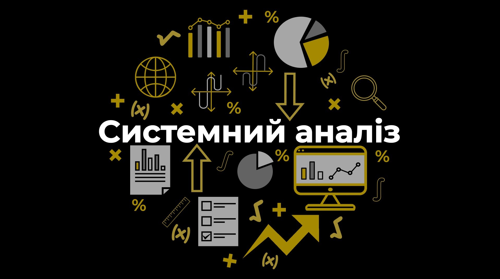
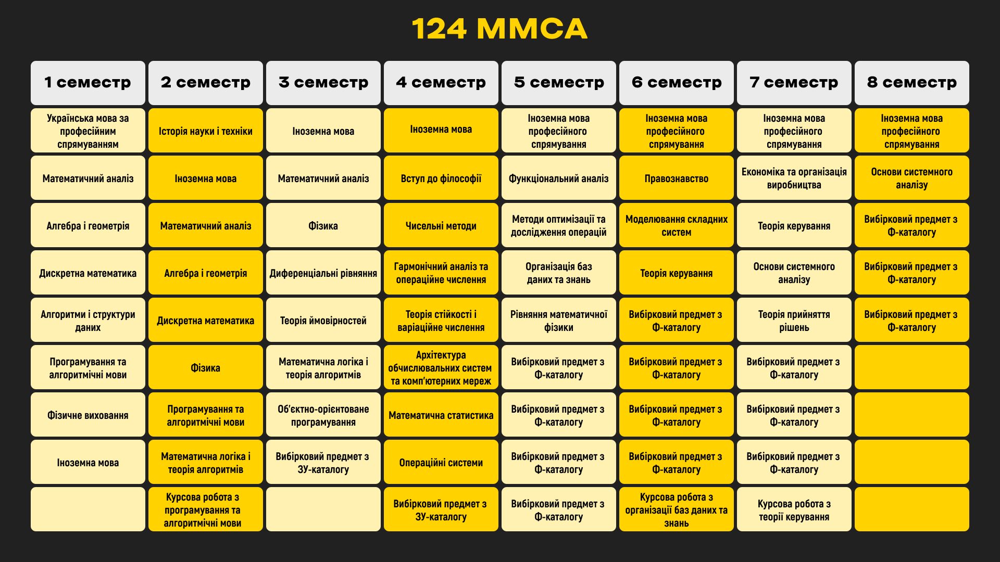
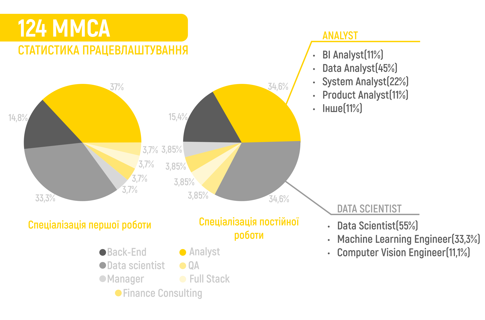

<!--truncate-->

Що таке «Сисан» і з чим його їдять?

### База

Системний аналіз — дуже гарна назва й надзвичайно страшна дефініція. Ця методологія використовується для прогнозування в різних сферах, наприклад: виявлення тенденцій у продажах або визначення чинників, які впливають на рівень виконання вимог замовників, і надає можливості для передбачення поведінки системи. На 124 спеціальності вивчають формалізацію та побудову моделей із розумінням необхідності їхнього впровадження в комп'ютерне середовище. 

На жаль, навчання тут не допомогло нам проаналізувати, чи зміниться назва в цьому році, тому запитання «Системний аналіз й управління» чи «Системний аналіз та наука про дані» залишається відкритим. 

#### Дисципліни (Нудна назва, бо, ну, і предмети не те щоб цікаво називаються)**

Під час навчання на Системному аналізі багато уваги приділяється дискретній математиці, лінійній алгебрі й аналітичній геометрії, математичній статистиці та, звісно, математичному аналізу. Багато студентів вважають, що це так звана база, на якій усе тримається. Ці предмети є основою для розуміння багатьох наступних і допомагають у практичних застосуваннях у найрізноманітніших сферах.

Програмування ж у свою чергу теж є одним із ключових напрямів у цій сфері та сучасній освіті загалом. На перших курсах студенти ознайомлюються з базовими принципами С та C++, а потім у них є можливість вибирати більш спеціалізовані й вузьконаправлені дисципліни, викладачі яких прагнуть забезпечити актуальність свого матеріалу та впроваджувати новітні методи.

Найцікавішим предметом, пов'язаним із написанням коду, студенти вважають об’єктно-орієнтоване програмування.

Перелік усіх дисциплін наведений нижче.

Тут ти можеш ознайомитися із [ЗУ-каталогом](https://osvita.kpi.ua/sites/default/files/downloads/zu-katalog-2024.pdf), а також [Ф-каталогом](http://mmsa.kpi.ua/sites/default/files/fkat_124_oppb_sau_2024_2.pdf).

**P.S.** Список вибіркових дисциплін може змінюватися.

### Трохи (ні) про професії та відгуки роботяг

> _«Посада, узагалі, в мене джуніор аналіст. А щодо обов'язків, я, напевно, виступаю зараз як тип, роботу якого загалом ніхто в команді більше виконувати не може, тому що в нас концепція така трохи заст-... Ой, ну це краще, мабуть, не вставляти, бо забув, що там моє ім'я буде»._

Не розраховуйте, що дійсно будете працювати системним аналітиком. Якщо роботодавці й публікують оголошення на таку позицію, то мають на увазі зовсім не те, чому нас навчають.

Загалом, знання, які можна здобути на спеціальності «Системний аналіз», знаходять своє застосування в ІТ-сфері. Крім того, вони можуть знадобитися в будь-якому секторі бізнесу, зокрема у фінансах, біржовій торгівлі та навіть військовій справі. Далі ми докладніше розповімо про їхнє використання в галузі ІТ.

**Data Analyst**

Розділяє дані на складові, щоб знайти відповіді на актуальні бізнес-питання. Аналітик відрізняється від інших спеціалістів тим, що може знайти більше інформації та підказок.

_«Збір даних із різних джерел, аналіз їх якості. Оптимізація / покращення бізнес-процесів та звітності за ними, частково розробка нових звітів (технічна реалізація)»._

_«Я займаюсь якимись приколами через те, що я ботанікс. Мені цікаво помацати та потикати щось нове, або ж вибудувати якусь математику навколо аналітики, а не сидіти дивитися на циферки. Саме через це мені намагаються давати такі завдання»._

_«Дата-аналітик — це дуже розмита історія. Займається всім і, згідно з визначенням, мають більше працювати з числами. Тобто є посередники, які відповідають за бізнес-процеси, а аналітики зацікавлені лише в математичних моделях»._

**Product Analyst**

Вивчає сервіс або послугу компанії за критеріями їхньої виконавчої спроможності, ефективності й відповідності вимогам користувачів. Використовує дані та аналітичні методи для збору, аналізу й подачі інформації. Мета: розробка стратегій покращення проєкту, визначення пріоритетних функцій і розуміння поведінки користувачів. Product Analyst співпрацює з різними командами, до прикладу, із розробниками, маркетологами й менеджерами, аби покращити результати в розробці та підтримці продукту.

_«Обіймаю посаду продуктового / маркетингового аналітика в Howly від венчур білдера SKELAR. В обовʼязки входить овнершіпство над зонами маркетингової та воронка продажі. (**прим. ред.** автор має на увазі аналіз процесів залучення нових клієнтів чи користувачів)._

_Щодо обовʼязків:_

_1. Частково займаюся дата інжинірингом: підтримую та покращую наявну структуру даних, інтегрую нові СУБД (прим. ред. система керування базами даних)._

_2. Роблю постійні оновлення, сетап систем автоматизованого моніторингу й алертингу. Наприклад: дашборди в Tableau Cloud, Telegram / Slack боти._

_3. Регулярно займаюся організацією та аналізом A/B тестів. Сетап — це розвішування івентів на експерименти (прим. ред., бо ми знаємо, що ви теж не зрозуміли: процедура налаштування середовища для готовності до запуску необхідних програм). Аналіз — це дослідження складної залежності змін на сайті та поведінки користувача, але це не просто метрика до й після._

_4. Здійснюю пошук неприбуткових сегментів юзерів, здебільшого повʼязаних зі специфікою роботи Search реклами Google / Bing»._

**Business Analyst**

Вивчає процеси діяльності підприємства, структуру та потреби, з метою виявлення проблем і можливостей для покращення бізнесу. Фахівець аналізує дані, визначає вимоги до систем та процесів, розробляє рекомендації для удосконалення ефективності та прибутковості компанії. 

_«Робота полягає в зборі запитів, спілкуванні зі стейкхолдерами, аналізі конкурентів тощо»._

**Data Scientist**

Використовує різноманітні методи й алгоритми для аналізу великих обсягів даних з метою виявлення закономірностей, трендів і кореляцій. Застосовує статистику, машинне навчання й інші техніки, щоб отримати корисну інформацію, яка може допомогти організаціям у прийнятті кращих рішень. Роль Data Scientist охоплює роботу з даними, їх аналіз, візуалізацію та інтерпретацію результатів.

_«В обов'язки входять збір даних, EDA (exploratory data analysis), preprocessing, написання обгорток, моделей. Презентації останніх на всіх рівнях, а також введення та перенавчання»._

_«Пайплайни трансформації даних, missing data problems, пошук відповідностей у датасетах: як із табличними фічами, так і з ембеддінгом (в т.ч. і комп. віжн моделей). Підготовка й викат алгоритмів та моделей у виробництво»._

**System Analyst**

Формалізує вимоги до програмного забезпечення та встановлює задачі розробникам, пише технічні документації, має глибоке розуміння архітектури ПЗ, а також відповідає за всі етапи SDLC, тобто життєвий цикл розробки, – від «А» до «Я».

_«Працюємо за Scrum-методологією, в обов'язки входить пошук рішення як бізнесового (дотримання бізнес-вимог, продумування UX), так і системного (які сервіси використати, написати нові АПІ / використати наявні, робота з базами даних), написання задач розробникам, документація вимог»._

**Machine Learning Engineer**

Розробляє та впроваджує системи машинного навчання і штучного інтелекту. Ця роль охоплює розробку й налаштування моделей, створення алгоритмів для аналізу даних і побудови прогнозів, а також впровадження їх у продуктивні системи. Спеціалісти в цій галузі також відповідають за оцінку та вдосконалення якості моделей, для якомога ефективнішого розв’язання задач.

_«Дослідження, побудова на їхній основі POC (прим. ред. це реалізація певної ідеї, щоб продемонструвати її здійсненність або життєздатність). Побудова системи для захисту від атак у соцмережах, імейлі, корпоративних каналах (slack, Microsoft teams), дата майнінг, очищення даних, імплементація систем / моделей, їх перетренування на новій інформації»._

_«Аналіз трафіку на фрод (шахрайство), оптимізація певних параметрів»._

**Computer Vision Engineer**

Розвиває алгоритми й програмне забезпечення для аналізу зображень і відео. До обов'язків входить розробка алгоритмів розпізнавання об'єктів та облич, систем відстеження, оптимізація в реальному часі й робота з великими обсягами даних. Аби стати успішним у цій професії, потрібні знання математики та машинного навчання, а також досвід розробки програмного забезпечення.

**Backend Developer**

Займається розробкою серверної частини вебдодатків. Ця роль полягає у їхньому створенні й підтримці, баз даних та інших компонентів, необхідних для функціонування вебсервісів. Backend Developer також відповідає за роботу з логікою програми, забезпечуючи, щоб ця частина коректно відповідала на запити від клієнтів і відправляла необхідні дані. Для цього використовуються різні мови програмування та технології, як-от: PHP, Python, Java, Node.js, різноманітні фреймворки та бібліотеки.

**Project Manager**

Відповідає за керівництво проєктом з початку й до завершення. PM визначає цілі, розробляє план дій, розпоряджається ресурсами, необхідними для втілення задач, керує командою для виконання робіт у встановлений термін. Також відповідає за звітність перед зацікавленими сторонами, контроль бюджету та вчасну здачу проєкту згідно з вимогами. PM вирішує конфлікти в команді й виконує інші завдання, необхідні для успішного результату.

#### Думки чемпіонів

_«Ставлення професорів до студентів: фактично нормально не вчать і не пояснюють матеріал. На пальцях можна перерахувати викладачів, які дійсно намагаються донести та зробити так, щоб студенти зрозуміли. Занадто багато вимушені вчити самі, коли на практиках розбираються елементарні приклади, а в індивідуальному завданні дають курсовий проєкт. Ставлення до студентів таке, наче всі забули, що вони теж люди, по суті, ще діти, яким теж потрібен відпочинок, а не посиденьки за уроками 24/7, навіть під час Нового року 😿»._

_«Чи актуальним був SQL, який у нас вивчався? Ні. Чи актуальні бази даних? Не знаю. Усе. Просто все. Більше нічого не було. Типу, чи актуальні математичні предмети? Ще б пак. Чи нормально навчають якихось мов програмування на вибіркових? Так»._

_«Застарілі методи й матеріали викладання, абсолютна неспроможність доносити матеріал до студентів, хоча є бажання, некомпетентність частини викладачів через вік (людина не хоче йти в ногу з часом і вчити щось нове) або почуття власної величі»._

_«Розумне ком'юніті, що надає більшість інформації та не дає піти до дна»._

_«Відчуваєш себе людиною розумною після того, як подолаєш це все»._

_«Складно, іноді хочеться відрахуватися, але загалом цікаво, тому все подобається»._ 

_«Викладачі готові йти на зустріч, і якщо хочеш додаткових знань, то тобі не відмовлять»._

### _Отже, висновку не буде…_ 

«Системний аналіз» підійде тим, хто готовий багато часу приділити математиці, самонавчанню, а також людям, які хочуть отримати універсальні знання, які будуть корисні для аналітики даних, розуміння бізнес-процесів, фінансів та в багатьох напрямках IT. Власне, тут можна прокачати свої аналітичні здібності, отримати прекрасну математичну базу та необхідні навички у програмуванні.
