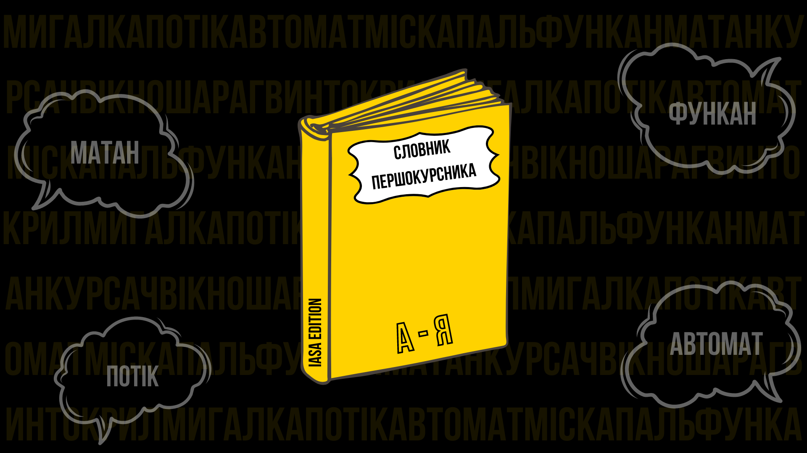

<!--truncate-->

_Великий тлумачний словник сучасної студентської мови для першокурсників / Київ: Студрада ІПСА, 2024 — 11 с._

#### Анотація

Цей посібник буде корисний тим, хто тільки починає свій шлях вивчення мови, поширеної в цивілізації під назвою «університет». Серед 101 розглянутого понятття є як спеціальна лексика, що є основою фахової комунікації, так і діалектизми, зокрема ІПСА, які роблять спілкування живим та автентичним.

### Основне

**1. Вікно** — відсутність пари посеред дня. Зазвичай під час неї студенти готуються до наступних або просто відпочивають.

**2. Мигалка** — пара, яка проходить один раз на два тижні.

**3. РР (РГР)** — розрахункова (розрахунково-графічна) робота значного обсягу, зазвичай із математичних предметів, яку дають на самостійне опрацювання. Вона містить декілька завдань різного типу з певної теми й передбачає проведення усного чи письмового захисту. Після запровадження дистанційної форми навчання, розрахункові часто замінюють собою модульні контрольні.

**4. МКР** — модульна контрольна робота, яку пишуть після закінчення вивчення теми. Бали, отримані за цю роботу, часто мають значний вплив на загальну оцінку з дисципліни.

**5. Колоквіум** — перевірка теоретичних знань посеред семестру. Іноді проведення колоквіуму дає можливість студентам відчути атмосферу екзамену.

**6. Атестація** — контроль успішності студентів, який проводиться двічі на семестр. Під час двох атестаційних тижнів майже з усіх предметів пишуться контрольні роботи. Після цього на підставі поточних балів за семестр можна отримати відмітку «а», якщо атестація здана успішно, або «н/а» в протилежному випадку.

**7. Потік** — групи одного курсу, об'єднані факультетом чи катедрою. Номери потоку видаються відповідно року вступу (наприклад, для 2024 року буде 4 потік).

**8. Н-ка** — відмітка про пропуск пари в журналі групи.

**9. Староста** — людина, основним завданням якої є комунікація між групою та викладачами й допомога з вирішенням питань різного характеру. Зазвичай обирається голосуванням всередині групи.

Термін **куратор** має два значення:

**10. Студент-куратор (Студкуратор)** — студент старшого курсу, який на добровільній основі допомагає першокурсникам і пояснює, як проходить навчання й життя в інституті.

**11. Академічний куратор** — викладач, відповідальний за групу. Зазвичай вони не беруть активної участі в житті групи. У їхні обов'язки входять надання своїм підопічним важливої інформації, а також ознайомлення батьків / опікунів / відповідальних студента у випадку проблем із навчанням.

**12. Тижні** — розклад занять, розбитий на парні й непарні тижні, які зазвичай відрізняються мигалками. Навчання в новому семестрі починається з непарного тижня.

**13. Недопуск** — невиконання вимог, які потрібні для написання контрольної, екзамену чи заліку.

**14. Конспект** — письмовий матеріал із предмету на лекціях і практиках.

**15. Лаба** — лабораторна робота, що проводиться з фізики (для 122 спеціальності) та програмування. Перша полягає у виконанні експериментального дослідження та обрахунку отриманих величин, їхнього порівняння з теоретичними. Друга передбачає написання програми згідно із заданою умовою, виконане завдання необхідно продемонструвати викладачу на практичному занятті.

**16. Екзамен** — один із найскладніших різновидів контролю на сесії. Екзамени відбуваються традиційно з 2-3 основних предметів за семестр.

**17. Залік** — різновид перевірки підсумкових знань у кінці семестру. На даний вид контролю виносяться всі предмети, що не потрапили на екзамен, але на відміну від іспиту, його можна не складати, якщо в студента достатній бал за семестр, який його влаштовує.

**18. Сесія** — назва періоду заліків та екзаменів. У КПІ їх дві: зимова й літня. Вони тривають приблизно 2 тижні. Взимку заліки відбуваються до Нового року, а екзамени — у перші два тижні січня, а влітку семестровий контроль триває протягом червня.

**19. Допка** — перескладання екзамену / заліку у випадку неуспішної здачі.

**20. Комісія** — друге перескладання, остання спроба скласти іспит, на якій, на відміну від попередніх, присутні декілька викладачів.

**21. Шара** — «бонус» від викладача на екзамені чи заліку під час зимової сесії. Це може бути кілька додаткових балів або звільнення від написання деяких задач на іспиті.

**22. Курсач** — курсова робота, виконується з прикладних дисциплін. Студент демонструє рівень здобутих знань, розробивши проєкт: до прикладу, з програмування потрібно створити додаток за вибраною темою.

**23. Дедлайн (ДД)** — термін (дата або / та час), до якого має бути виконано певне завдання.

**24. Ректорський контроль** — обов'язкова контрольна робота для всіх факультетів від адміністрації КПІ, з метою визначення рівня знань студентів. Жодним чином не впливає на подальше оцінювання. Проводиться в першому та восьмому семестрах.

**25. Автомат** — отримання оцінки за семестр без написання заліку чи екзамену.

**26. Студак** — документ, який підтверджує, що ти є студентом / кою. З ним можна отримувати знижки на громадський транспорт, музеї, кінотеатри тощо.

**27. Паль** — «злиті» варіанти контрольних, заліків, екзаменів або готові роботи.

**28. Кампус** — електронна система КПІ, у якій студенти можуть стежити за своєю успішністю й перевіряти, чи атестовані вони.

**29. Кампус** — територія студмістечка.

Термін **диплом** має два значення:

**30. Диплом** — документ, який підтверджує факт закінчення навчального закладу.

**31. Диплом** — підсумкова робота, яку пишуть на 4 курсі, щоб отримати вищезгаданий документ.

**32. ДП** — день першокурсника.

**33. СР, Студрада** — команда активістів, які добровільно працюють і роблять життя в КПІ трішки краще. Існують студентські самоврядування навчальних підрозділів і загальноуніверситетське. Перші діють локально й незалежно від загального: влаштовують різні заходи для студентів на факультеті / інституті, розв'язують серйозні проблеми з викладачами тощо. Студрада КПІ займається тим же, але більш глобально. Зазвичай мають певну структуру, наприклад, поділені на відділи / департаменти.

**34. ДНВР** — департамент навчально-виховної роботи, належить до адміністрації КПІ й відповідає за навчальні процеси. Також має свій [телеграм-канал](https://t.me/dnvr_31), де можна побачити дописи про академічну мобільність, волонтерство, стипендії, різноманітні події освітнього, культурно-просвітницького чи розважального характеру тощо.

**35. Флуд / оффтоп** — спілкування, не пов'язане з темою чату або обговорення. У більшості бесід нормально ставляться до флуду, оскільки це є основою спілкування, однак існують чати вигляду «запитання — відповідь» чи такі, де ведеться обговорення за певною темою й відхилення від неї не є доречним. За флуд там можна отримати бан (видалення без можливості повернутися) або мут (позбавлення права писати будь-що), тому завжди уважно читай опис, поважай правила й учасників.

### Гуртожиток

**36. Зава** — завідувач / ка гуртожитку.

**37. Коменда** — комендант / ка гуртожитку, відповідає за порядок, перевірку стану кімнат і відпрацювання в гуртожитку.

**38. Коридорка** — вид гуртожитку, у якому вздовж коридору розташовані кімнати на 4 людини, 2 душі на весь гуртожиток і по 2 санвузли на кожен поверх (жіночі та чоловічі).

**39. Блочка** — вид гуртожитку, в якому живуть у блоках: кожен складається з 2-ох кімнат на 4 людини, свого душу і санвузла.

### Місця

**40. [Ліба](https://www.google.com.ua/maps/place/Науково-технічна+бiблiотека+ім.+Г.І.+Денисенка/@50.4490061,30.4548284,17z/data=!4m6!3m5!1s0x40d4cc27dd6b8b6d:0xd1305aa5df55d493!8m2!3d50.4496233!4d30.456329!16s%2Fg%2F1ttq0mpr?hl=uk&entry=ttu)** — Науково-технічна бiблiотека ім. Г.І. Денисенка на території КПІ.

**41. [ПЗ](https://www.google.com.ua/maps/place/Площа+Знань,+Київ,+02000/@50.4491905,30.4572317,17z/data=!3m1!4b1!4m6!3m5!1s0x40d4cc27fac26f45:0x9d2dadbe7c736f8f!8m2!3d50.4491665!4d30.4572136!16s%2Fg%2F11b8z20xfb?hl=uk&entry=ttu)** — Площа знань, найбільша площа, знаходиться навпроти бібліотеки КПІ.

**42. [Сосновий](https://www.google.com.ua/maps/place/Сквер+%22Сосновий%22/@50.4497657,30.454432,18z/data=!4m5!3m4!1s0x40d4cc27d04083b9:0xf7b594d9b35f56a1!8m2!3d50.4497657!4d30.4551416?hl=uk&shorturl=1)** — сквер за бібліотекою КПІ. Невеликий, проте неймовірно затишний.

**43. [Парк](https://www.hashtap.com/redirect?url=https%3A%2F%2Fwww.hashtap.com%2Fredirect%3Furl%3Dhttps%253A%252F%252Fgoo.gl%252Fmaps%252FEATVLQBedxUiV4hLA%26strict%3D0%26redirect_token%3D3e6e59a8f6318df8c4142450ab81bb7cc98e0e4a9cb4150b9de0ea68ee421f83f0f56f212edbce63181a469fae439bac42c81b7eed6759d089bb1df28103c1b2&strict=0&redirect_token=919cc5c501f5cb3da69761ed1dae1d095fb8d5b1755025cf1f162909e473413df23764796e1995e6771c1befc79021ca6b90da0a6240dc6675b3e6c77c7c1276)** — парк КПІ. Тягнеться від станції метро «Політехнічний інститут» до вул. Янгеля.

**44. [Плаза](https://www.hashtap.com/redirect?url=https%3A%2F%2Fwww.hashtap.com%2Fredirect%3Furl%3Dhttps%253A%252F%252Fg.page%252Fsmart-plaza-polytech%253Fshare%26strict%3D0%26redirect_token%3D9e55ea5f7bce0bf2042e46667fb77aabe6340d5960ab2c1a6b8dcef24877ae341150c4b67a5b51c93027facdd007a3c6347d90ea6e854f4d2a27749520cd0a7d&strict=0&redirect_token=1e478d49e8d4e827987872e30c51a4a8aea7397756722137d8ce99b97a342186407329d98747d0160ab91604ed8e7329184ae8b87b9cba53e8c4eceeab671bfd)** — ТЦ Smart Plaza прямо навпроти виходу з метро на ст. Політехнічний інститут.

**45. [Пузатка](https://www.hashtap.com/redirect?url=https%3A%2F%2Fwww.hashtap.com%2Fredirect%3Furl%3Dhttps%253A%252F%252Fgoo.gl%252Fmaps%252F3hWRLXQdnem9rMm29%26strict%3D0%26redirect_token%3D678eb5276b4406e25f05ccd4ee07cd530db0d0103151685443eead57c591dc47a0d8b6aad8373407627a85f8472fe01d8cde36be28afe39b0e0b9f0b8aeb29e1&strict=0&redirect_token=541400bb93a1517feebbee4c4a4d2df861c989a3ff12bb35f6dc55fd50339b687832483e927eabfa10543ec2d8601ce18c7221f7c350e30a7b21274725834602)** — ресторан української кухні в Плазі.

**46. [Хепік (Happy cake)](https://www.hashtap.com/redirect?url=https%3A%2F%2Fwww.hashtap.com%2Fredirect%3Furl%3Dhttps%253A%252F%252Fgoo.gl%252Fmaps%252F5F4DLeHEo7soR3pw6%26strict%3D0%26redirect_token%3D4a456d2a8e64923794aa292f071849b8c71e3f2b68dde472ac44be13666939452182a6fd1d379e82ecad2fb949eae39418e9432368811f6cefd37928279103e0&strict=0&redirect_token=a16d7dc6e0cc42ccb694130a19e74c9390102bbf3c96d25ea02bf25408cdfd8e908bfe2cd1064215b1990cb11787fb63b717255946a61553a218f4623e75b3b2)** — кафе на вулиці Політехнічній навпроти 14-го корпусу.

**47. [Поляна](https://www.hashtap.com/redirect?url=https%3A%2F%2Fwww.hashtap.com%2Fredirect%3Furl%3Dhttps%253A%252F%252Fgoo.gl%252Fmaps%252Ff8myEuUVYvKAGnWv6%26strict%3D0%26redirect_token%3Ddf2d640d5d6ca326ea7bf69d6a8d13bc731c9e4e66e0a61633f79c0dabcfdc887a20e1794a91e6af9552c94b4ebc4869b1a408b1bbc715c210944e6afe9fb307&strict=0&redirect_token=45313f4975b7ea231806ef00df72e15e08eb3c81381a77fec9dac2a7284d894abbc5967711f2c6ea0226f56b8862d77d03aafef06e9da081d6056026e39e8c34)** — студентська назва скверу імені Олени Теліги. Традиційне місце відпочинку КПІшників, знаходиться біля 18 корпусу й трамвайної зупинки «Польова».

**48. [Паровоз](https://www.hashtap.com/redirect?url=https%3A%2F%2Fwww.hashtap.com%2Fredirect%3Furl%3Dhttps%253A%252F%252Fgoo.gl%252Fmaps%252FVEWi9P25sRUW3JS68%26strict%3D0%26redirect_token%3Dd79c2ea9bdd9e5f7a68fcd6aeec44d7c72b216ee43596bea77b55d0f9d542591b1f9069beecbf08881a4c2afafd99670751cfd0760c637a9e4123374ca5c2c91&strict=0&redirect_token=8cab4a8c9e4d5cb9134c71633bc7d762bdc19077464fdee96ebb2623ca4006bb0b387a6b9267c1a2022c9889fd2a02942223efda39a9778e95fc5bc838be00b8)** — один з експонатів політехнічного музею, знаходиться біля 6-го корпусу.

### Предмети та сленг ІПСА

**49. Лінал/лінійка** — лінійна алгебра та аналітична геометрія.

**50. Матан** — математичний аналіз.

**51. Гарманал** — гармонічний аналіз.

**52. Функан** — функціональний аналіз.

**53. Дифури** — диференціальні рівняння.

**54. ТЙ** — теорія ймовірностей.

**55. Матстат** — математична статистика.

**56. Дискретка/ДМ** — дискретна математика.

**57. МЛ/МЛТА** — математична логіка та теорія алгоритмів.

**58. Матфіз/РМФ** — рівняння математичної фізики.

**59. Прога** — програмування.

**60. ООП** — об'єктно-орієнтоване програмування.

**61. АСД** — алгоритми і структури даних.

**62. БД** — бази даних.

**63. ЧМ** — чисельні методи.

**64. Веб** — веб-програмування.

**65. Паралельки** — паралельні обчислення.

**66. ТІК** — теорія інформації і кодування.

**67. ОС** — операційні системи.

**68. АОС** — архітектура обчислювальних систем.

**69. КМ** — комп’ютерні мережі.

**70. Схемач** — схемотехніка.

**71. Принтери** — технічне забезпечення інформаційних технологій.

**72. Демидович** — задачник з математичного аналізу.

**73. Каденс** — програмне забезпечення для проектування інтегральних схем на курсі схемотехніки.

**74. 105** — аудиторія, у якій найчастіше проходять комісії.

**75. Каченята** — першокурсники або абітурієнти ІПСА.

**76. Бульбазавр** — бакалавр.

**77. Динозавр / дід** — студент четвертого курсу.

**78. Тур** — подорож студентів ІПСА містами України.

**79. Кансіл** — інформаційний [телеграм-канал](https://www.hashtap.com/redirect?url=https%3A%2F%2Fwww.hashtap.com%2Fredirect%3Furl%3Dhttps%253A%252F%252Ft.me%252FIASA_Student_Council%26strict%3D0%26redirect_token%3Dd0093a0861950acd3cae10b01eb456a0b311e6d46a09f3e3f463043967311e296bb348a6eb6969019ddbc55c3b915699318f01076f608031716574ff9a19e3b0&strict=0&redirect_token=42dd77fd7021f5d93b3b0cae99c7008c8aa7be72cab91a2541a14529173b4c8237cdad27feed7dc993a407cbea9cbecbf609c714b81861665446cea344aac581) студради ІПСА.

**80. Івент** — захід для студентів чи абітурієнтів, організований студрадою, а також [телеграм-канал](https://www.hashtap.com/redirect?url=https%3A%2F%2Fwww.hashtap.com%2Fredirect%3Furl%3Dhttps%253A%252F%252Ft.me%252Fiasa_event%26strict%3D0%26redirect_token%3D4960137332734ba97422f8f65a381fc8cc29854eeed7f99b8fa52c87afab88e93c1d7f82b5493a20cfd3642a09198ef41cca9840293565ce4a820625030fffd4&strict=0&redirect_token=fcc8dd74796f7b2b5b9605d5e77d711208862a7cc1f27edb0828bb0b582087f12ebcb3b6c6cc938d7100751cb8b234047427754a894a32e65afad7a7e26962e5) студради ІПСА з інформацією про ці заходи.

### Програмування

**81. Жаба** — мова програмування Java.

**82. Шарп / шарпи** — мова програмування C#.

**83. Пітон / пайтон** — мова програмування Python.

**84. Плюси / cpp / цпп** — мова програмування C++.

**85. Жс / джс / js** — мова програмування JavaScript.

**86. Пиха** — мова програмування PHP.

**87. Репа** — репозиторій (сховище для зберігання й підтримки даних). Найчастіше використовуються в системах контролю версій: [Git](https://www.hashtap.com/redirect?url=https%3A%2F%2Fwww.hashtap.com%2Fredirect%3Furl%3Dhttps%253A%252F%252Fuk.wikipedia.org%252Fwiki%252FGit%26strict%3D0%26redirect_token%3D6eae7c3cfa07aa3f648e86bb5bf3afaa110b0c9045ef5cb88be684b9a884aaf1f2ed680b5e8abf16a1e027e9a8d0d221b1013200d28f8b37f10d2cd8d8787c37&strict=0&redirect_token=addcc6facfc217541996545f21e76c8641733337c73cc12b05044b2daff774f32ce7c7b68a8105e0d86786468aefc524c6664dfbe1f6632e0415a42e6f0502f1), [Mercurial](https://www.hashtap.com/redirect?url=https%3A%2F%2Fwww.hashtap.com%2Fredirect%3Furl%3Dhttps%253A%252F%252Fuk.wikipedia.org%252Fwiki%252FMercurial%26strict%3D0%26redirect_token%3D3c9fad79e6fe8ac2ac8d47889989398b4dbb1144d8df9a2f0bcd6e18727e176e237c755e3d5cc3db348aa4931b6b0f0ef38500a1cd75e01638f75748b76a8665&strict=0&redirect_token=cebddec5daff1bd970841ff3aed0e3ff218a0da486f3a1f1f4255de4e871a4a5ccaf3e2d9554e11a02f7ab6f3af02d83c60d3644a6effd8b9ea0437e5c3ce3f7) тощо.

**88. Баг** — помилка в роботі програми.

**89. Галера** — компанія, у якій платять низькі зарплати й не цінують розробників.

**90. Фіча** — додаткова опція програмного продукту.

**91. Конфіг** — конфігураційний файл із налаштуваннями програмного забезпечення.

**92. Дейлік** — регулярне зібрання команди для відслідковування та регуляції процесу роботи.

**93. Запушити** — вивантажити вміст локального репозиторію у віддалений.

**94. Комітнути / закомітити** — зберегти зміни в коді, зафіксувати їх у репозиторії.

**95. Компілити** — запустити код та створити виконуваний файл з програмою.

**96. Демка** — демонстраційна версія.

**97. Офер** — пропозиція роботи.

**98. Залізо** — апаратне забезпечення пристроїв.

**99. Кейс** — випадок чи ситуація, справа.

**100. Розраб** — розробник.

**101. Код-рев'ю** — перевірка коду для виявлення помилок.
