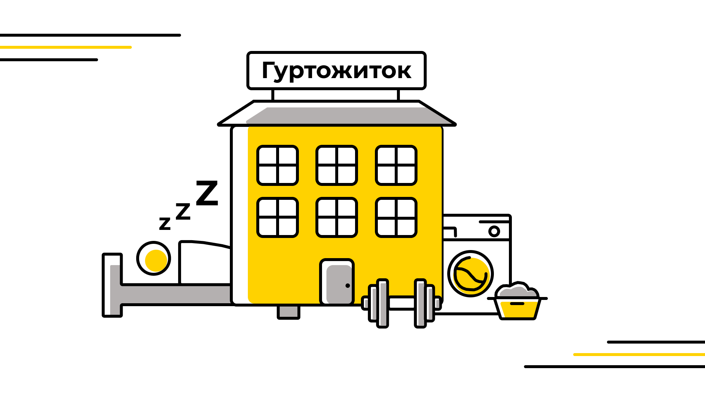
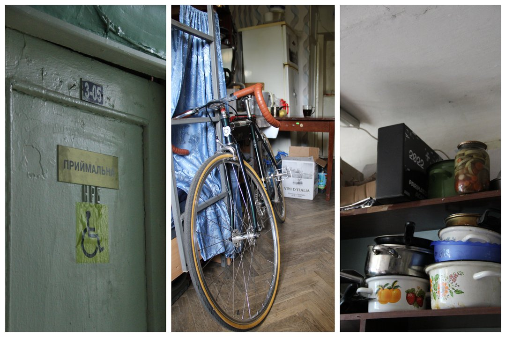

<!--truncate-->

«Як я до такого дожився, спитаєте ви».

Почнемо з того, що ІПСАшників селять у гуртожиток коридорного типу №7.

Шлях із гуртожитку до 35-го корпусу в середньому займає 15 хвилин.

### Кімнати

Зазвичай першокурсників поселяють у порожні кімнати з необхідним мінімумом меблів і холодильником (чий стан, правда, під питанням). За бажанням можна розділити каторгу з друзями,  домовившись із завідувачкою гуртожитку про поселення комплектом. Кімнати вражають «просторістю» — 12-14 квадратних метрів. Їхня комфортабельність залежить від попередників, тому може знадобитися як косметичний, так і капітальний ремонт.

Щодо тарганів: якщо підтримувати чистоту, то їх майже ніколи не буде, хіба що ці нещасні душі підселяться з кімнат поряд.

### Зручності всередині

Для поверхів характерне наступне планування: по дві вбиральні, кімнати з умивальниками й кухні. На першому поверсі є «робочка» (простір на кшталт читальної зали в бібліотеці). На цокольному — окремі душові для хлопців і дівчат, пральня та спортивний зал, який зараз додатково функціонує як укриття.

                            

### Поговоримо про гроші

Станом на липень 2024 року ціна за проживання в гуртожитку становить:

Наприкінці кожного навчального року додатково сплачується рахунок за спожиту електроенергію (у середньому 500-800 грн із людини при чотиримісному поселенні).

Згідно з [правилами проживання](https://studmisto.kpi.ua/pravila_vnutr%D1%96shnogo_rozporyadku/) оплата за місяць має бути внесена до його початку. Зробити це можна декількома способами:

• За допомогою [інтернет-ресурсу](https://hostelpay.kpi.ua/).

• За реквізитами, які надасть адміністрація.

• Через додаток Приват24, у розділі «Платежі», знайшовши КПІ ім. Ігоря Сікорського.

Постачання інтернет-послуг у гуртожитках забезпечує лише провайдер [КПІ-Телеком](https://kpi-telekom.kpi.ua/). Гайд про його підʼєднання шукайте [за посиланням](https://telegra.ph/Vse-chto-nuzhno-znat-o-KPItelekom-08-23), а матеріали з [допису](https://t.me/kpicampus/699) допоможуть перевірити статус комутаторів і розв’язати проблеми з інтернет-підключенням. Варіанти оплати послуг:

• [Білінг](https://billing.kpi.ua/).

• [EasyPay](https://easypay.ua/ua) за номером твого договору.

• [Термінали і portmone](https://kpi-telekom.kpi.ua/faq/draft/#TYME).

Також у гуртожитках є пральні машини. З вартістю використання можна ознайомитися нижче:

### Персонал

**Завідувачка** (пахан) — головна в гуртожитку. Може виселити тебе за нелегалів — людей, яких пропускаєш через вікно.

**Комендант** (бігало з паханом) слідкує за порядком і виставляє оцінку за чистоту в кімнаті.

**Кастелян** видає все для твоєї шконки.

**Чергові вахтери** (шинери) прокидаються вночі, аби відчинити тобі двері гуртожитку.

**Технічний персонал** (бики) — прибиральниці, чергові столярі та сантехніки.

### Що взяти із собою

Як можна зрозуміти, у кімнату складно запхнути себе, сусіда, вміст домашньої шафи та бабусиного серванта. Заселяючись, бери необхідне: одяг на поточний сезон, декілька столових приборів, тарілок, кухонний ніж, каструлю тощо. Більш специфічне побутове приладдя варто погоджувати зі своїми «співкамерниками», адже багато речей уже можуть бути в кімнаті від сусідів чи минулих мешканців.

Щодо постілі є 2 варіанти: взяти з дому свою крутецьку наволоку з бравл старс або скористатися безплатним Kastelyan Pass з опцією обміну її на нову кожні 10 днів.

### Основні правила

• Перепустка видається на час проживання в гуртожитку.

• Забороняється передавати в користування перепустку іншим особам.

• Дозволяється запрошувати відвідувачів до 22:00 і виводити (чи вже виносити) до 23:00.

• Мешканці мають право на вільний вхід за пред'явленням перепустки. З 00:00 до 06:00 вхідні двері зачиняються.

• Жителі зобов'язані дві години на місяць брати участь у роботах громадського характеру: миття вікон, прибирання умивальників й інші активності на користь гуртожитку та студмістечка.

• Студентам забороняється самовільно переселятися з однієї кімнати в іншу, проникати й сприяти проникненню інших осіб до будівлі поза межами прохідної, зберігати / вживати алкогольні напої та вироби з тютюну, шуміти з 22:00 до 08:00.

Згідно з Угодою на проживання в гуртожитку:

**_За порушення «Правил внутрішнього розпорядку в студентських гуртожитках КПІ ім. Ігоря Сікорського», а також за вчинки, несумісні зі званням студента, на мешканців накладаються такі стягнення:_**

**_- Зауваження._**

**_- Догана._**

**_- Непоселення до гуртожитку на наступний навчальний рік._**

**_- Розірвання угоди (договору) на проживання._**

**_- Відрахування з університету._**

Докладніше загальний перелік правил описано на [сайті](https://studmisto.kpi.ua/pravila_vnutr%D1%96shnogo_rozporyadku/).

### Інфраструктура

• [Найближчий продуктовий (Фора)](https://goo.gl/maps/Bm2bbmADFs9bRS6cA).

• [Найближча аптека (АНЦ)](https://goo.gl/maps/mj1LLgCaj5iwzoXb6).

• [Ще одна аптека](https://goo.gl/maps/rjXHnF4nAu4tYhRi8).

• [ТЦ Аркадія (Сільпо)](https://goo.gl/maps/5WN3jZ49smALHmZS9).

• [ТРЦ Мармелад (АТБ, Нова Пошта №152)](https://goo.gl/maps/MdRYhJQhEZMZGPCb9).

• [Нова Пошта №173](https://goo.gl/maps/NcCBCEkVfbnQfRk57).

• [Укрпошта 03067](https://goo.gl/maps/T5bNESoT9eEMJhqEA).

• [Укрпошта 03056](https://goo.gl/maps/aokJ6HnX7SgfrZvi8).

• [Магазин канцелярії та друк](https://goo.gl/maps/B7BYFi7D1X7fqewu6).

• [EVA](https://goo.gl/maps/UcCzzrHDXzfqoWam7).

• [Найближчій будівельний](https://goo.gl/maps/H7ynbUHP7MFYL5cw5).

• [Набрати воду можна тут](https://t.me/kpicampus/1414).

• Їдальні в [1](https://goo.gl/maps/UAYGMsPoZyTumXNN6) та [31](https://goo.gl/maps/e3wuBCahxAdapmmg9) корпусах.

• [Поліклініка](https://goo.gl/maps/3txUSE3wuNo8zGqN6).

### Фотоальбом

