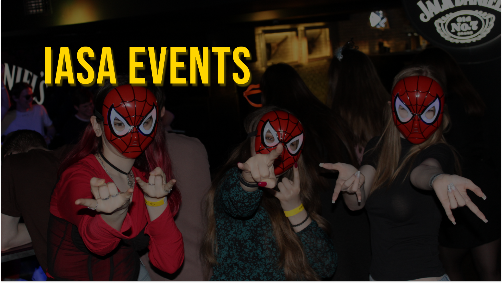

<!--truncate-->

Ані для кого не секрет те, що Студрада ІПСА — одна з найактивніших, можливо, навіть у всій Україні. Кожен із відділів якісно й відповідально працює, але в цій статті ми поділимося візитівкою ІПСАшного позанавчального життя — івентами, які, скоріш за все, супроводжуватимуть тебе на тернистому шляху до фрази «Я БАКАЛАВР» або «Я МАГІСТР».

### День першокурсника

Очевидно, що це твій перший день у ролі студента. Тобі не тільки доведеться зробити чимало відкриттів, як-от: зустрітися з групою та дізнатися з ким проведеш ці роки життя, а й добре відсвяткувати знайомство в новій компанії. Після цього відбудеться яскравий парад каченят до площі знань, де всі першокурсники зможуть відчути справжній дух єдності. Завершиться день захопливою афтепаті, де на тебе чекатимуть музика, танці та багато нових друзів.

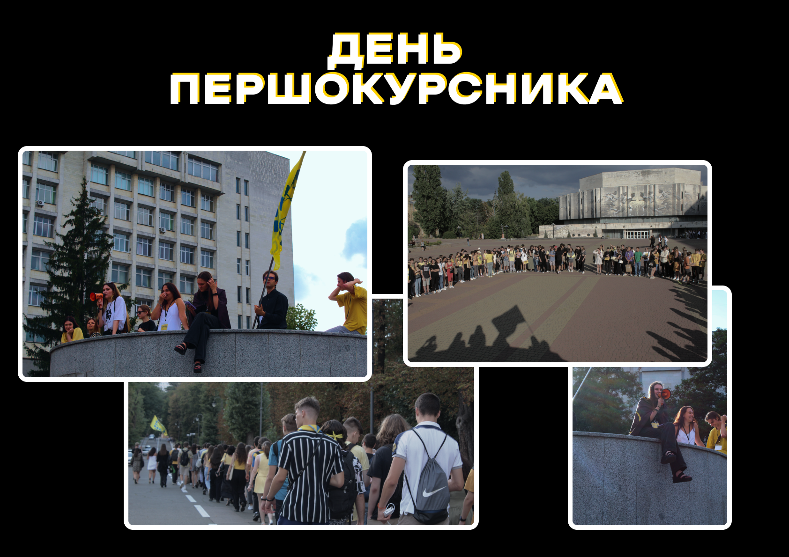

### Пуща

Ласкаво просимо на посвяту в студенти. Захопливий квест у Пущі-Водиці перевірить твою спритність, кмітливість і стійкість до крінжу, а цікаві активності доповнять неймовірну атмосферу та дозволять відпочити після початку навчання. Урочистим закінченням вечора стане поїдання тарілки гречки, що символізує початок студентського життя та готовність до подолання будь-яких викликів.

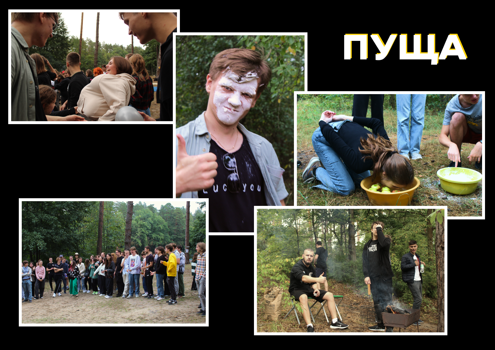

### Fresh

Один із перших заходів для «свіжої» крові ІПСА. Аби презентувати себе, повеселити інших і закріпити знайомство з одногрупниками та кураторами, кожна група готує сценку на заздалегідь задану тему. Бери участь у конкурсах й отримуй багато незабутніх емоцій у компанії чудових людей.

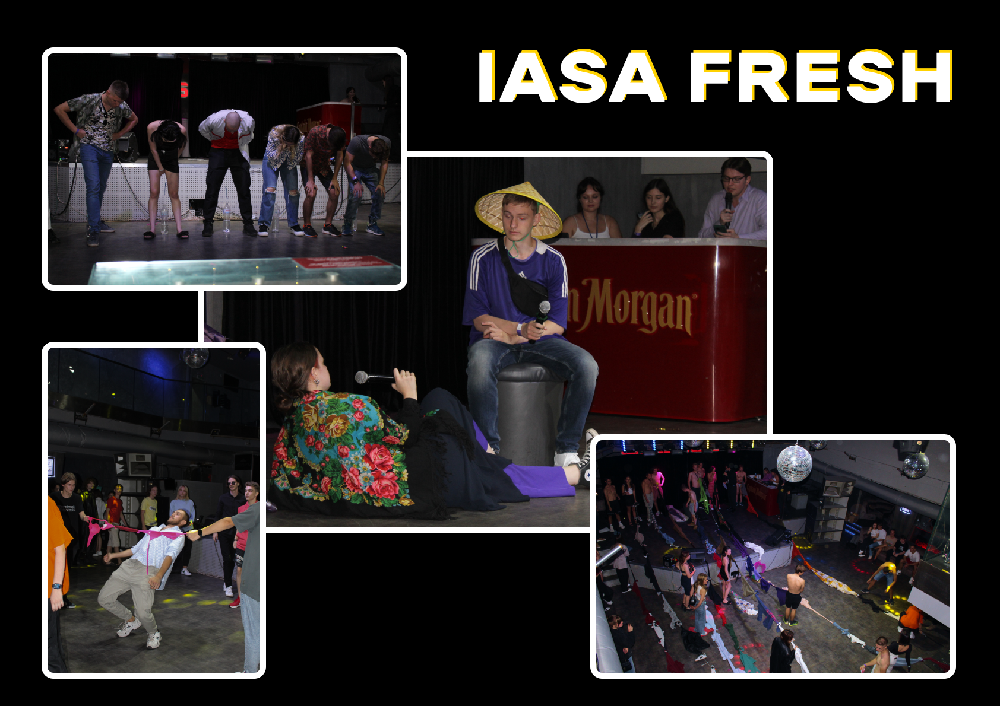

### Квест для першокурсників

Як тебе не любити, Києве мій! Після нашого івенту ти закохаєшся в столицю ще сильніше, особливо якщо гугл мапа твій найкращий друг у мандрівках. Отримуй завдання для дослідження міста й пізнавай його пліч-о-пліч зі своєю групою. Потрібно докласти чимало зусиль, адже переможе найбільш згуртована команда.

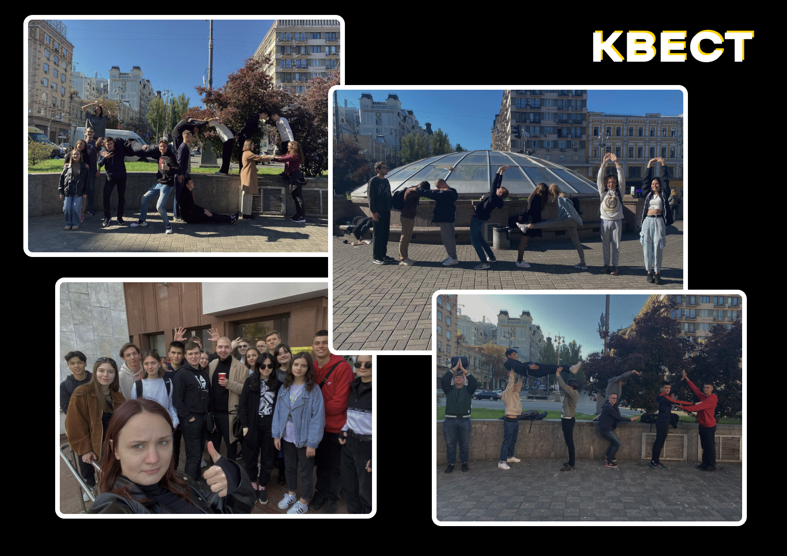

### IASA Chess & WWW

Подія для справжніх інтелектуалів, чи не так? Насправді знадобиться лише базове знання шахових фігур та гарна пам’ять, аби на «Що? Де? Коли?» згадати, здавалося б, непотрібну інформацію з тіктоку. IASA Chess & WWW — це про командну гру в теплому колі душніл ІПСАшників, де всі можуть відчути себе стратегами та приємно провести час.

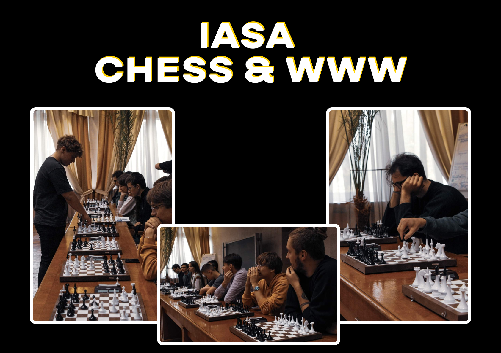

### IASA Halloween

Захід присвячений відомому Дню всіх святих. Страшно веселі конкурси наймоторнішої вечірки супроводжуються змаганням за найкреативніший костюм, а запальні танці не закінчуються, допоки душа не покине тіло.

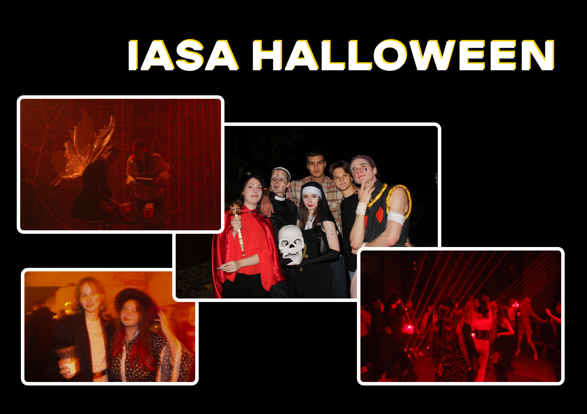

### IASA Royale

Обіграв молодшу сестру в дурня... Це дійсно заслуговує поваги. Однак перевірити навички маминого шулєра можна не лише на рідних. IASA Royale створений спеціально для фанатів полоскотати свої нерви: покер, блекджек та інші ігри чекають на те, коли ти розкриєш свій потенціал. Не забудь поцупити найліпшу татову сорочку, щоб точно пройти фейс-контроль.

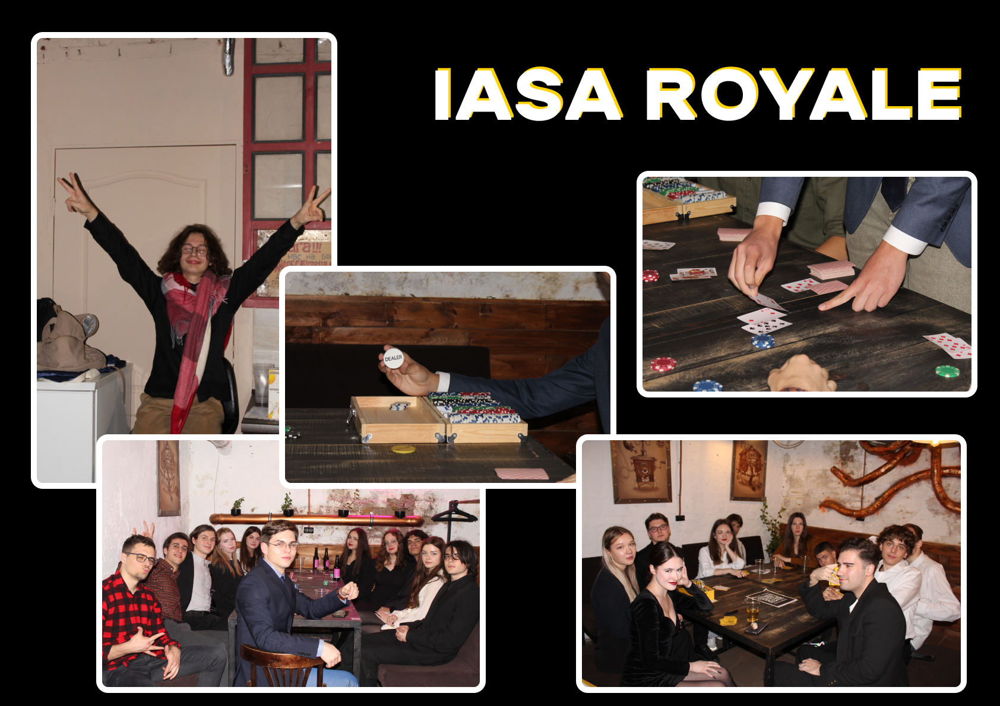

### IASA RAVE

Готовий до нічного вибуху енергії та драйву? Подія, яку ти не захочеш пропустити, і це навіть не контрольна! Якщо у твоєму житті хард буває тільки ворк, то хутчіше приєднуйся до незабутнього вечора під ритми техно й хардстайлу. Підготуйся до потужних басів, швидкого біту та безмежної свободи на танцмайданчику. Це твій шанс відірватися на повну й зануритися у світ електронної музики разом із друзями та однодумцями.

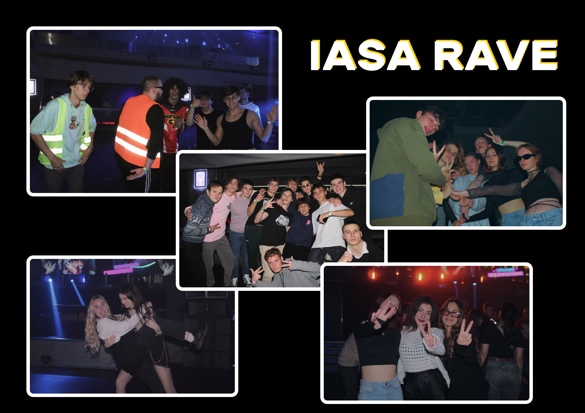

### IASA Survivors

Вдалося впоратись із загальноКПІшним івентом під назвою «сесія»? IASA Survivors відкриває для тебе свої обійми, незважаючи на те, як ти це зробив: завдяки допомозі всіх наявних богів чи просто сумлінному навчанню. Усі, хто вижили, зберуться тут вшанувати пам'ять відрахованих і відпочити після складного випробування. Не забудь про дрес-код, що кожного разу змінюється.

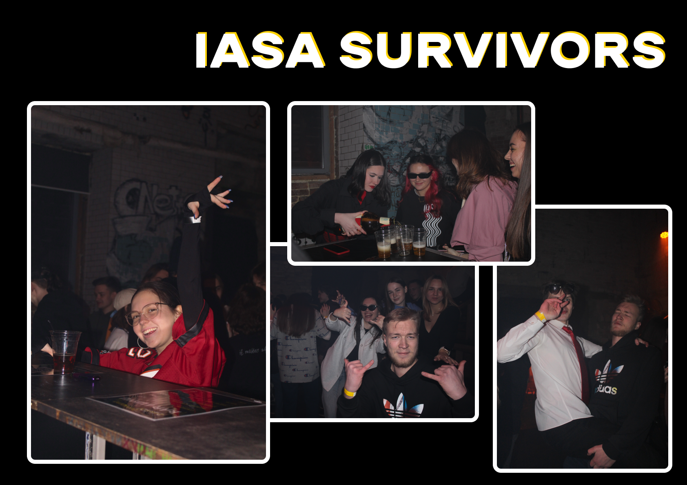

### IASA Valentine

Найромантичніший івент у збірці кожного ІПСАшника, який дозволить поринути в атмосферу кохання та веселощів. Купідони вже шукають тебе, щоб запропонувати захопливі конкурси й різноманітні активності, які допоможуть знайти нових друзів і навіть пару (не в розкладі). Також у програмі вечора танці, фотозони для незабутніх знімків, і, звичайно ж, приємні сюрпризи. Не пропусти можливість провести цей особливий день у колі студентів ІПСА.

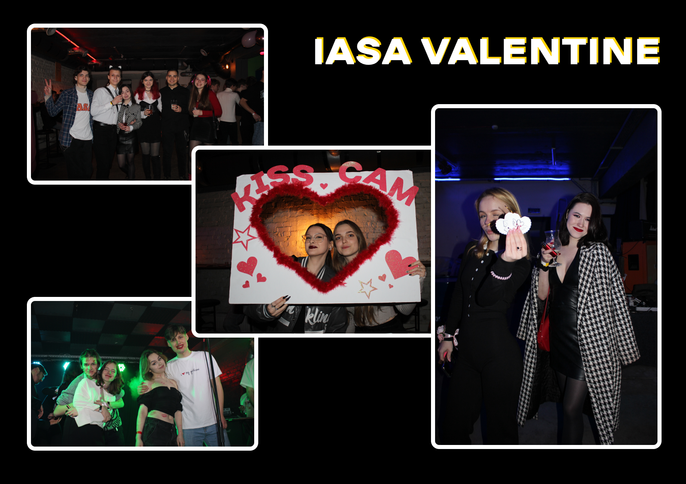

### IASA Online Night

Що, окрім матану, може робити ІПСАшник вночі? Звичайно ж, муркотіти в дискордику із затишною компанією! На IASA Online Night ти проведеш час за приємними розмовами та цікавими іграми разом із нами, не покидаючи власної кімнати. Це найкомфортніша онлайн-сесія, що точно відверне увагу від буденних клопотів і виснажливих занять.

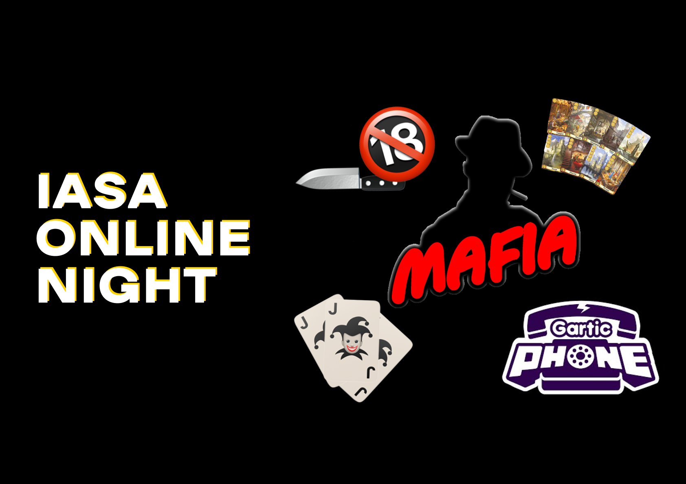

### IASA Evening

Для любителів більш культурних заходів ми маємо невеликий і затишний — IASA Evening. Обов'язковою складовою посиденьок із настільними іграми, Just Dance або переглядом фільмів стануть перерви на печиво, чай чи каву.

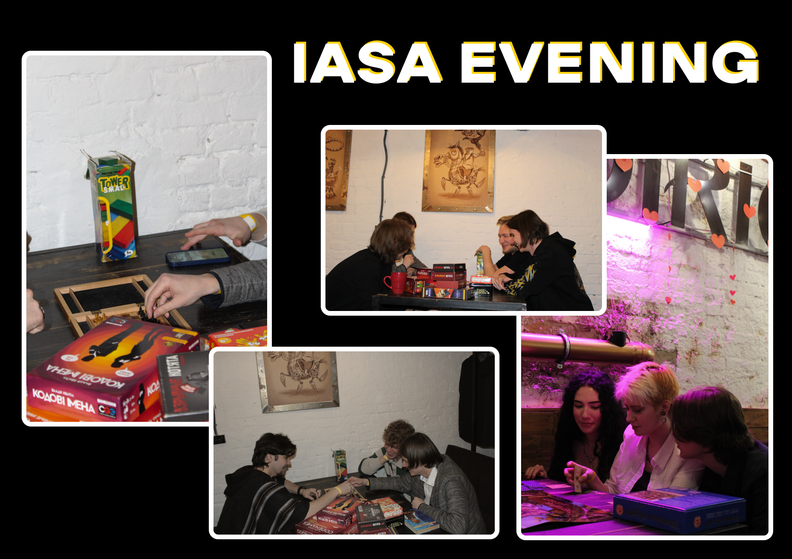

### Тактична медицина (Stop the Bleed)

На жаль, ми живемо в неспокійні часи, коли потрібно бути готовим до будь-якого розвитку подій. Цей новий, але надважливий захід — чудова можливість розібратися в основах тактичної медицини й набути життєво необхідного досвіду.

### IASA Poetry & Chill

Цей івент надає можливість студентам не тільки відпочити розумом та душею, а й проявити себе: прочитати улюблені або, можливо навіть, авторські вірші, заспівати пісню, зіграти на улюбленому інструменті тощо.

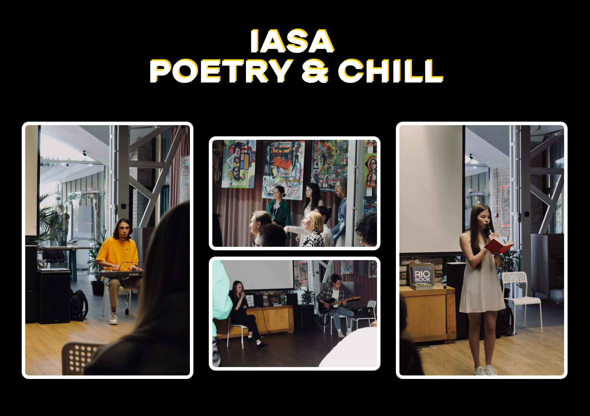

### IASA Meme Party

Кидати приколи в чат своєї групи це, звісно, круто, але вдягнути рофлокостюм та презентувати його своїм знайомим ще краще. Івент дає можливість приміряти той образ, у якому соромно й на вулицю вийти. Тут збираються всі уособлення популярних і локальних мемів, починаючи з виконавця «маминих світлиць», закінчуючи гачімучєнікамі.

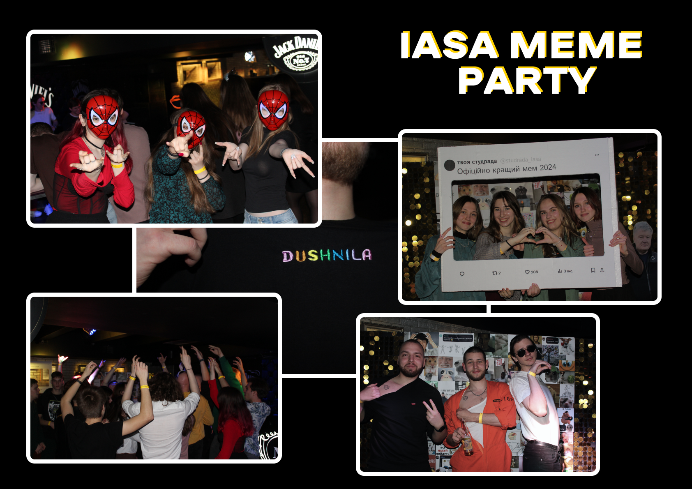

### IASA Ball

Нарешті мрії про казковий бал зможуть втілитись у дійсність. Лише мить — і зі звичайного студента ти перетворюєшся на героя п’єси, сторінки якої довго нестимуть пам’ять про цю подію. Шанс відчути себе частиною королівського прийому випадає не часто, тому вбирайся в найкращі шати, повторюй вальсові рухи й будь готовий взяти участь в інтерактивах. Після церемонії коронування, святкування не закінчується, а тільки починається, саме час для незабутньої афтепаті, де ти можеш продовжити запалювати танцмайданчик під улюблені треки.

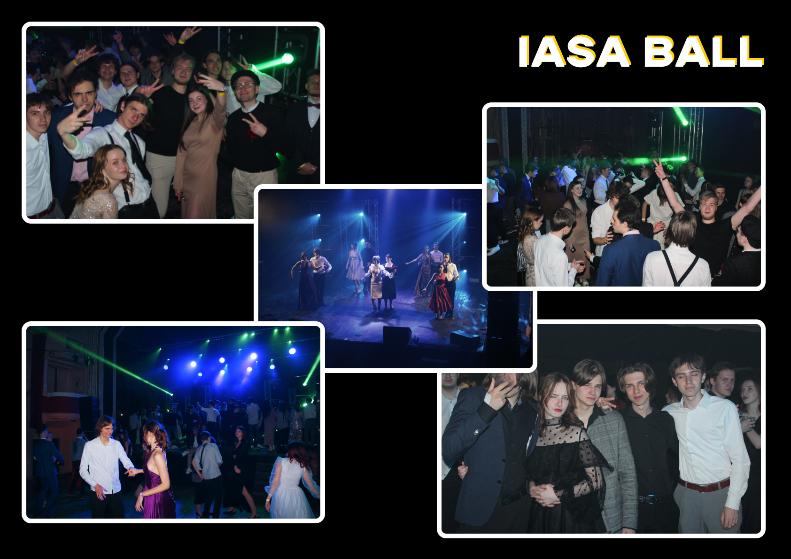

Звичайно, веселощів багато, але й учитися теж нелегко.

Ти будеш губитися не тільки під час квесту, а ще й на перших контрольних. Розважатимешся до ранку на IASA Online Night, а потім знову не спатимеш, але вже через матан. Доклавши неймовірні зусилля, прийдеш на першу пару й завдяки кріпатурі згадаєш запальні танці на Fresh.

Унікальність наших заходів полягає в тому, що чудові люди створюють їх для чудових людей. Ком'юніті — це те, що зробить твоє навчання в ІПСА насиченим і незабутнім!

Більше фото можна побачити на нашій [сторінці](https://www.facebook.com/studrada.iasa) у фейсбуці, у [хайлайтах](https://www.instagram.com/studrada_iasa?igsh=dngzeG01d2g4azg2) інстаграму та в [телеграм-каналі](https://t.me/iasa_event).

**P.S.** На жаль, через війну не можна передбачити чи всі заходи буде проведено. Не виключено, що вони відбудуться в меншій кількості, іншому форматі або онлайн. Можливо, будуть замінені новими крутими івентами. Дякуємо нашим захисникам за те, що маємо можливість поєднувати навчання з відпочинком у такі складні часи!

