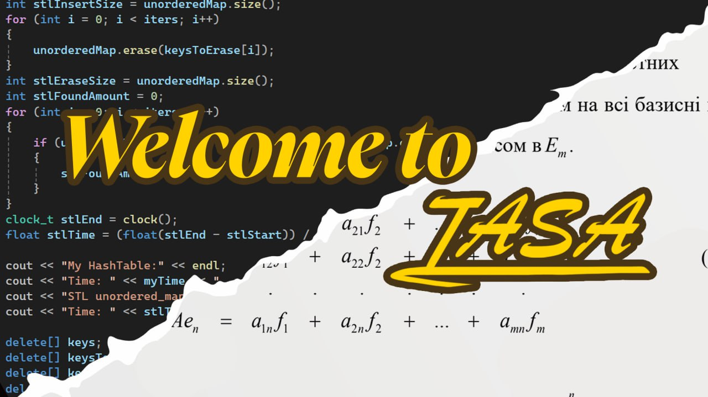

<!--truncate-->

_«I’m not telling you it’s going to be easy. I’m telling you it’s going to be worth it»._

_Art Williams_

## Зміст

- [Розклад](#розклад).

- [Карта КПІ](#карта-кпі).

- [Твої викладачі](#твої-викладачі).

- [Додаткові матеріали для майбутніх предметів](#додаткові-матеріали-для-майбутніх-предметів).

- [Івенти енд кул сторіс](#івенти-енд-кул-сторіс).

- [Тобі з ними вчитися](#тобі-з-ними-вчитися).

- [Студкуратори](#студкуратори).

- [А де староста?](#а-де-староста).

- [Корисні посилання](#корисні-посилання).

## Розклад

Спеціально для фанатів естетики та ненависників екселівських таблиць — елегантний розклад першачків.

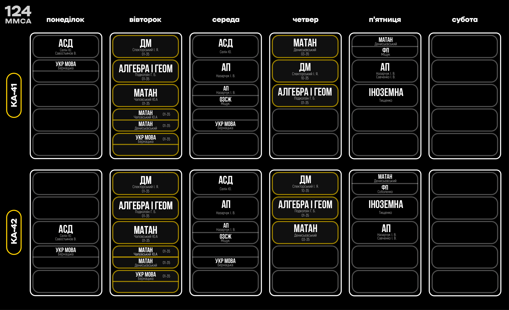

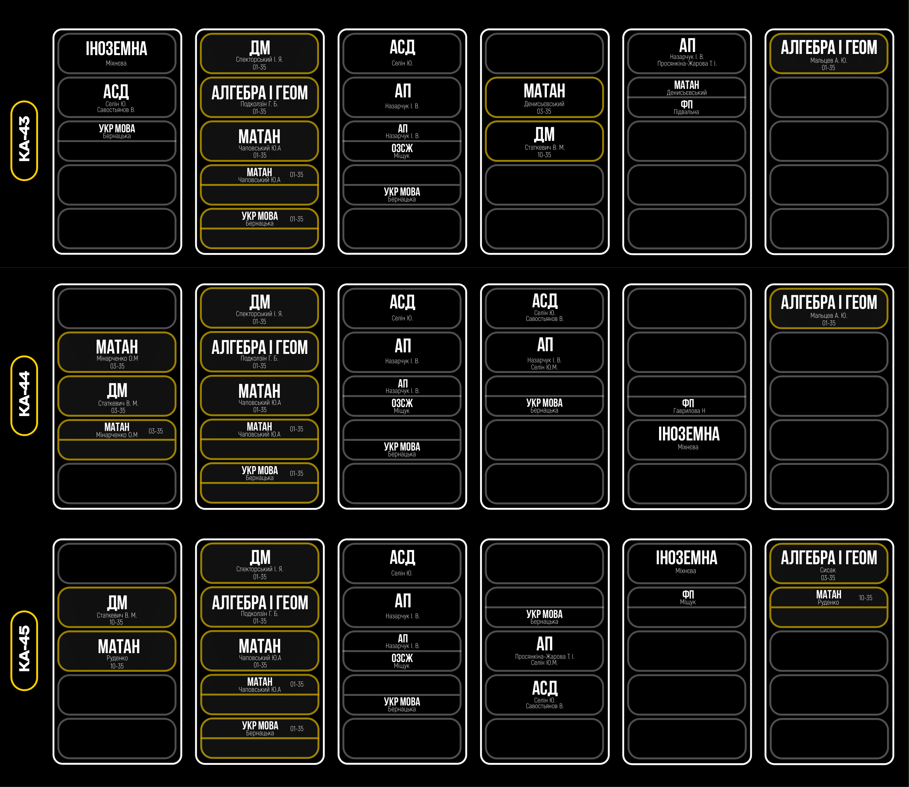

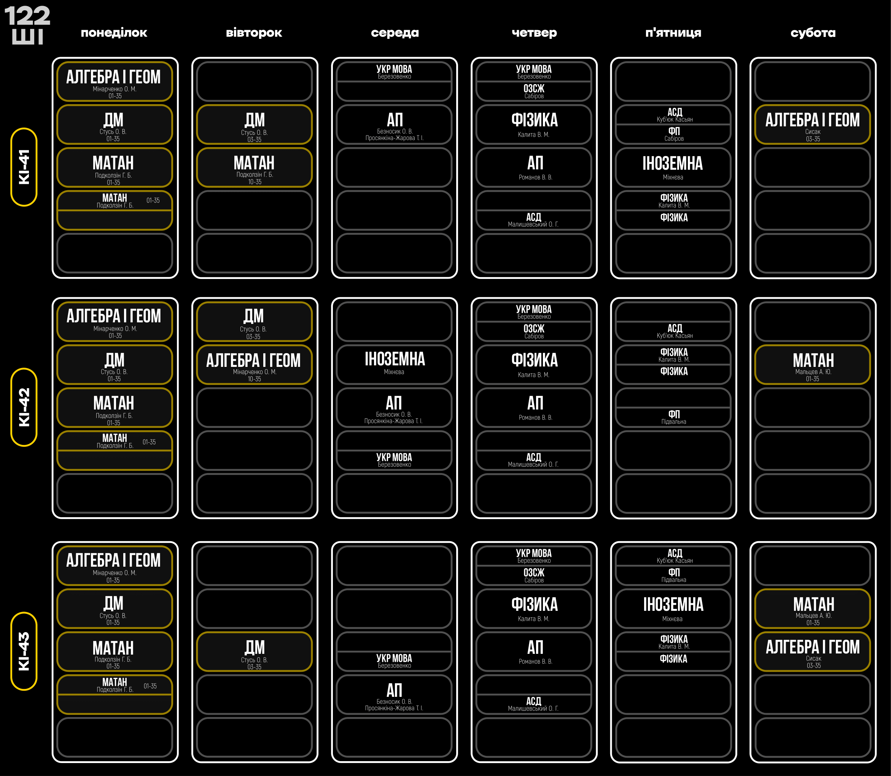

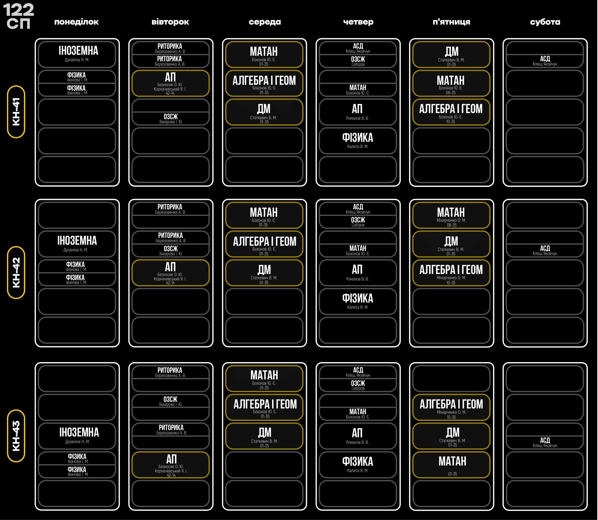

## Карта КПІ

Щоб в погоні за знаннями не ~~втратити себе~~ загубитися, користуйся незамінним путівником:

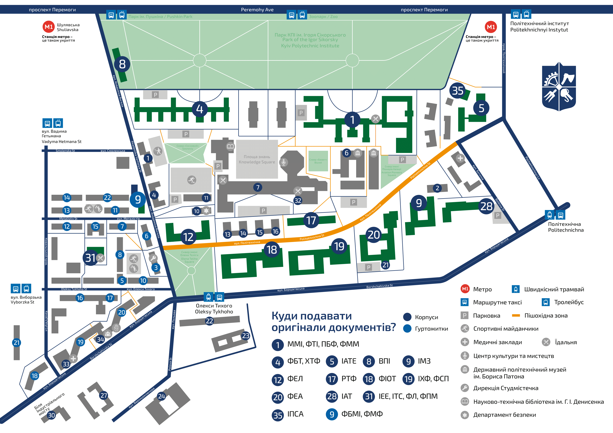

## Твої викладачі

#### Подколзін Гліб Борисович (у простонародді «ГБ»)

_«Останній відпочинок був у вас у школі, а ось наступний буде вже в могилі.»_

#### Мінарченко Олександр Миколайович (між студентами «Мінарь»)

_«Поздоровляю зі святом 1-го травня і в якості дарунка надсилаю наступну частину розрахункової.»_

#### Бохонов Юрій Євгенович (у деяких колах «Бохіч»)

_«Існує радіанна міра кутів! Що ви все в градусах міряєте, це вам що, горілка, чи що?»_

_«Точно це винести? Я зараз почну меблі виносити.»_

_«Я зараз зʼїм цю вебкамеру, і ніхто нічого не побачить.»_

#### Стусь Олександр Вікторович

_«Перевага дистанційного навчання — вам хоч можна мікрофони вимкнути.»_

#### Спекторський Ігор Якович (a.k.a. «Спектр»)

_«Подивіться на себе в дзеркало: чи є сором в очах? Якщо немає, то тренуйтеся.»_

_«Час від часу ми будемо змінювати орієнтацію, але, сподіваюся, це нічого страшного для вас.»_

#### Безносик Олександр Вікторович

_«Ну добре… Хоч і не зовсім добре…»_

_«Світло закінчилося.»_

_«Який у вас цікавий метод. Щось я нічого не розумію.»_

#### Просянкіна-Жарова Тетяна Іванівна

_«А вам курсову кавалєри роблять?»_

#### Назарчук Ірина Василівна

_«РєБяТа!»_

_«Рєбята, …»_

#### Селін Юрій Миколайович

_«Бі, ей, ел, ел – Ball. Англійською мовою знаєте, так?_

_ Пишеться Liverpool, читається Manchester. Пишемо «А», читаємо «О»… Ну то ще не найгірший варіант: пишемо «что», читаємо «шо». *хє-хє-хє*» _

#### Калита Віктор Михайлович

_«Забудьте про своє програмування, через 5 років уже будуть квантові комп’ютери й усім треба буде фізика, а не програмування!»_

_«Не дай Бог F, то буде ТЕФ»_

#### Чаповський Юрій Аркадійович

_«Бачимо систему – вирішуємо, бачимо пляшку пива – випиваємо. Ну ось так, автоматом – інстинкт.»_

Більше про предмети та викладачів за [посиланням](https://iasastudentcouncil.github.io/iasa-sc-blog/blog/Disciplines).

## Додаткові матеріали для майбутніх предметів

### Математичний аналіз

- [Essence of calculus](https://www.youtube.com/playlist?list=PLZHQObOWTQDMsr9K-rj53DwVRMYO3t5Yr).

- [Олексій Василенко](https://www.youtube.com/@Alwebra).

### Алгебра та геометрія

- [Essence of linear algebra](https://www.youtube.com/playlist?list=PLZHQObOWTQDPD3MizzM2xVFitgF8hE_ab).

- [MIT 18.06 Linear Algebra, Spring 2005](https://www.youtube.com/playlist?list=PLE7DDD91010BC51F8).

### Алгоритмізація та програмування

- [C Programming Language Tutorial](https://www.geeksforgeeks.org/c-programming-language/?ref=shm_outind).

* [W3 Schools](https://www.w3schools.com/).

* [C++ Programming Language](https://www.geeksforgeeks.org/c-plus-plus/?ref=shm_outind).

- [Уроки та статті С++](https://ravesli.com/uroki-cpp/).

- [4-годинна лекція про вказівники в С та С++](https://www.youtube.com/watch?v=zuegQmMdy8M).

- [C++ Primer Plus (Stephen Prata)](https://drive.google.com/file/d/1kx9Ic53-9g3cRmE2pa1lSDxL8ngX2ojm/view?usp=sharing).

### Алгоритми та структури даних

- [Grokking algorithms](https://edu.anarcho-copy.org/Algorithm/grokking-algorithms-illustrated-programmers-curious.pdf).

- [Introduction to algorithms (Cormen, Leiserson, Rivest, Stone)](<https://sd.blackball.lv/library/Introduction_to_Algorithms_Third_Edition_(2009).pdf>).

### Також варте уваги

- [Brilliant](https://brilliant.org/courses/).

- [Записи лекцій ІПСА](https://www.youtube.com/@IASALectures).

- [Algebra, Topology, Differential Calculus, and Optimization Theory For Computer Science and Machine Learning](https://www.cis.upenn.edu/~jean/math-deep.pdf).

## Івенти енд кул сторіс

### [День першачка](https://www.facebook.com/media/set/?vanity=studrada.iasa&set=a.685053900335286)

### [Пуща](https://www.facebook.com/media/set?vanity=studrada.iasa&set=a.694210252752984)

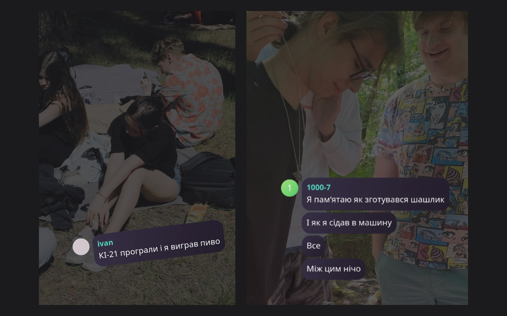

### [Квест](https://www.youtube.com/watch?v=f6NCVLzZjEY&t=780s)

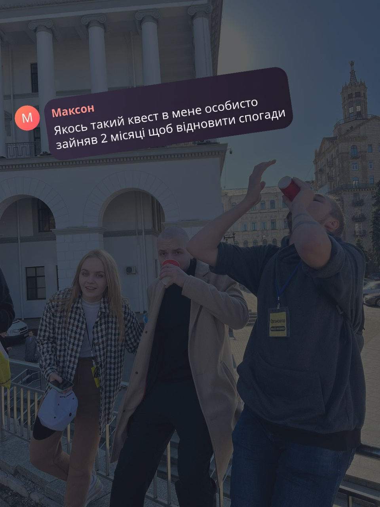

### [Фреш](https://www.facebook.com/media/set/?vanity=studrada.iasa&set=a.699111388929537)

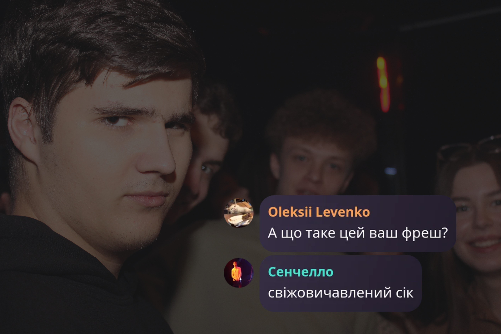

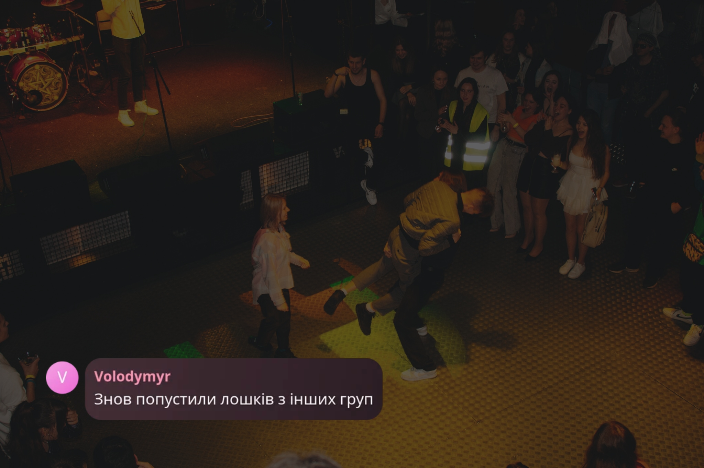

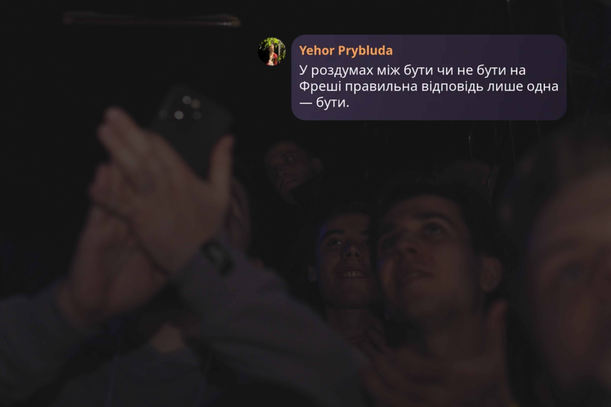

Ще більше івентів і докладніше про них за [посиланням](https://iasastudentcouncil.github.io/iasa-sc-blog/blog/Event/).

## Тобі з ними вчитися…

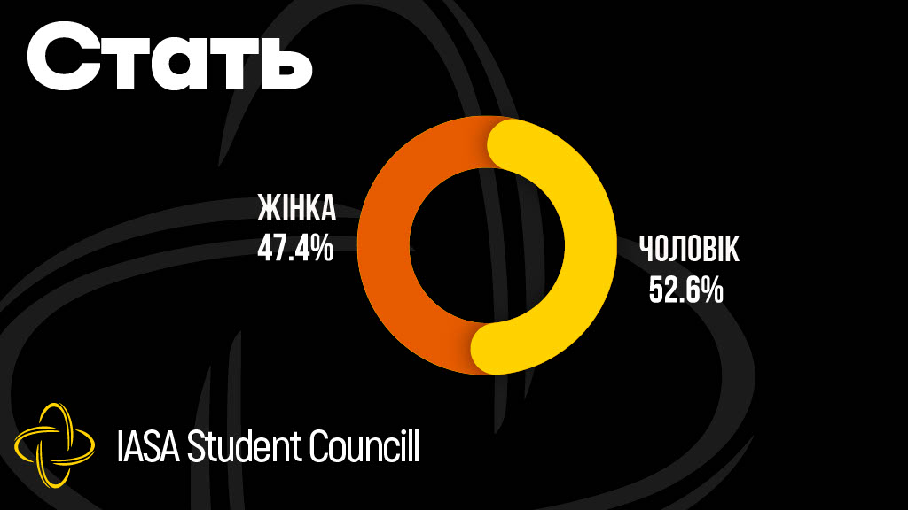

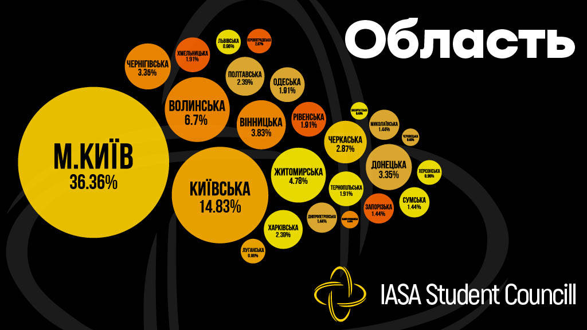

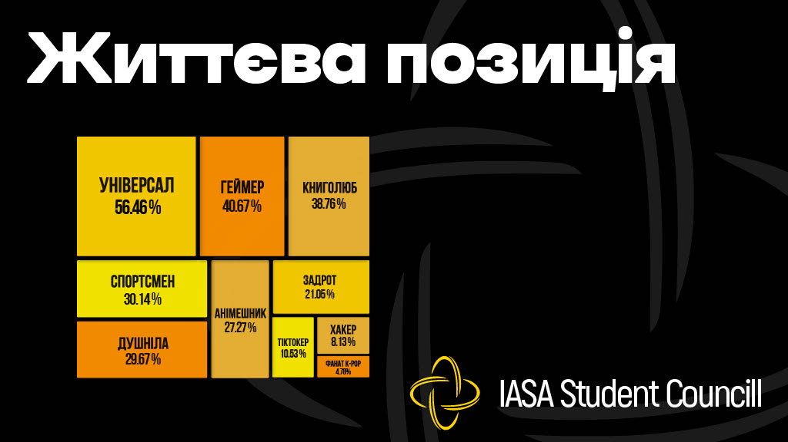

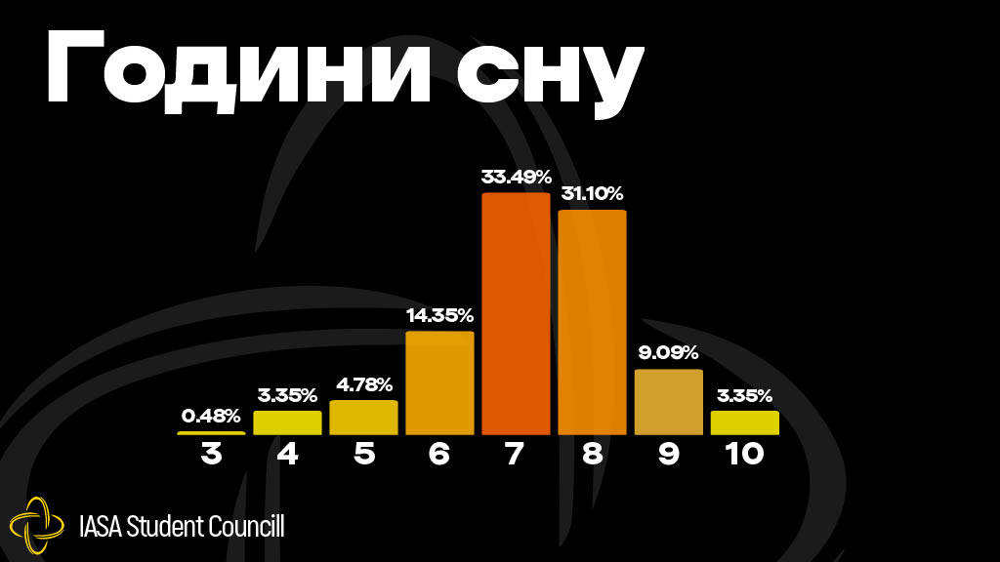

## Студкуратори

### КА-41

- *Олександра Богданова КА-33*

— Що робити, якщо тобі дали місяць на лабораторну, а дедлайн вчора?

> «Бігати й плакати, придумати виправдання, увірувати у вищі сили.»

- *Поліна Лавриненко КА-21*

— Як провести п'ятихвилинку під час офлайн пари?

> «3 найкращі способи провести п'ятихвилинку під час пари:
>
> 1. Забудьте про її існування та відсидіть усі 1,5 години пари.
>
> 2. Через 45 хвилин попросіть викладача на перекур. Якщо пощастить, то вийдете палити разом із ним.
>
> 3. Не приходити на пару (ризик перездачі збільшується).
>
> Якщо насправді вірите, що викладачі її дотримуються, то в мене для вас погані новини…».

### КA-42

- *Ольга Полюлях КА-31*

– Чому при ІПСА немає РАЦСу?

> «Підходить СПшник до ММСАшниці й каже…».

- *Олександра Лавріненко КА-35*

— Які івенти не можна пропускати?

> «Пропустити можна тільки два івенти: свій ДП й ДП своєї первашки».

### КА-43

- *Артем Захаренко КА-33*

– Назви стартер пак молодого ІПСАшника.

> «Пачка дзиґарів і контрацептивів.
Шо то, шо то закінчиться під час сесії, тільки от перше будеш використовувати ти, а друге ー викладач».

- *Анна Рагуліна КА-32*

– Які негласні правила виживання в ІПСА?

> «Перше правило вулиці — останній дзиґар не стріляємо, якщо не для ГБ.
Друге правило вулиці: побачив, що хтось юзає паль, — юзаєш разом із ним.
Третє правило вулиці: не смійся з товариша, який на допці, бо потрапиш на комісію.
Вірю у вас, браття  🐺🐺🦅🦅».

### КА-44

- *Софія Петренко КА-34*

— Що робити, якщо ти філолог на ІПСА?

> «Замість розв'язків задач писати фанфіки про квадратні корені й інтеграли».

- *Васіліса Заярченко КА-23*

— Що робити, якщо від кількості тасків для Студради забув про навчання?

> «Стати кураторкою, щоб не було часу на тупі запитання».

### КА-45

- *Анна Людоговська КА-24*

— Як пережити сесію без втрати розуму?

> «Звичайно, найкращий варіант — учитися протягом семестру й не відкладати підготовку. Але, камон, часто «потім» плавно переходить у зазубрювання знань усіх народів і віків за ніч до дедлайну. Та не розчаровуймося :) 
Переважно викладач надає алгоритм здачі екзамену й теми, на які потрібно звернути увагу. Запропонуй таким же каченятам, як ти, готувати матеріал та розбиратися в ньому. Пам'ятай мудрість, що передається від ІПСАшника до ІПСАшника:«Monkeys Together Strong».
Починай уже робити запаси м'ятного чаю та валеріани. Ти мамин пиріжечок, і все зможеш пережити ♡».

- *Олександр «Чебуратор» Ковальчук КА-22*

— Що робити, якщо ти заснув під час захисту лабораторної

> «А мінуси будуть?
>
> Ситуація сумна, проте відновити втрачену ауру можливо. Викладач така ж людина як і ти, тож спить не більше тебе. У цьому випадку найкращим рішенням буде запропонувати йому поспати разом. 95% шанс на успіх.
> 
> Якщо сон у викладача 8+ годин на добу, він бреше й потрібно дати зрозуміти, що ти максимально впевнений у своїй роботі та даєш фору іншим людям. Не переймайся, якщо й це не спрацює. У разі провалу за тебе поставлять свічку 😘».

### КІ-41

- *До Данг Ха Мі (Маша) КІ-21*

— Що робити, якщо Студрада надзвонює твоїй мамі?

> «У моєму випадку, поки студрадівці будуть знаходити спільну мову з моєю мамою (в усіх можливих сенсах) будь-яке питання втратить свою актуальність.
Для простих смертних же є декілька варіантів: бігти на кухню мити посуд; загазлайтить, сказати, що переплутали людину; позахищати нарешті оці лабки, залишені для кращих часів. 
Хоча ладно, останнє не має багато сенсу.
А так, вчіться добре, малята, щоб Студрада дзвонила тільки аби передати, наскільки вами захоплений ГБ.
І любіть маму».

- *Ярослав Зоммер КІ-32*

— Як почати розмову з одногрупниками?

> «Насправді все дуже просто) Якщо ти доволі комунікабельна людина й хочеш соціалізуватися зі своїми браттями / сестрами по навчанню, не соромся! І це найголовніше. Відправ зайвий раз кружечок 😍 у групу та розрухай посіпак. Ніхто не знайомий між собою, тому соромиться думки інших, але насправді всі хочуть поспілкуватися, тож проявляй ініціативу. Якщо знаходишся в Києві, то клич прогулятися, налагодити контакт).
Май добрі стосунки з кураторами. Твій батько й мати в університеті знають усю групу, тому допоможуть із цим. Успіхів тобі, перваше, все вийде!».

### КІ-42

- *Аліна Журавель КІ-23*

— Що робити, якщо ти зірка тіктоку, але викладачі сидять у фейсбуці?

> *сумно їм ковбаску*.

- *Олексій Вербицький КІ-11*

— Як захистити первашку від 4-курсника?

> «Найкращий захист — це напад!».

### КІ-43

- *Майкл Тал КІ-33*

— Як не занепастити свою репутацію за місяць навчання?

> «Ви вступили на ІПСА, вас автоматично не люблять інші факультети, бо є кращими за них (І, можливо, тому що трошки самозакохані).
>
> Загалом, слухати тата (мене, незалежно від групи), маму (змінюється залежно від групи), бути культурною людиною. Ну і так далі, враховуючи умови тотальної цензури.
>
> Фрагмент, який додався в ході написання цього дуже скромного тексту: якщо ви порізали перець чилі — не треба терти очі. Спочатку добре вимийте руки.
> 
>> P.S. Якщо буде не лінь, знайдіть оригінал звернення куратора КІ-33 Івана Мамонова (цензура). Це вам маленький квест, його не публікували. Буде весело.
>
>> P.P.S. Стікерпак із Майклом: https://t.me/addstickers/SofaMichael_by_fStikBot».

- *Аліса Міхєєва КІ-22*

— Яке одне запитання обрати для психолога після сесії в ІПСА?

> «Чи можна вважати прокрастинацію навичкою, якщо я її довів/ела до досконалості під час підготовки до екзаменів?».

### КН-41

- *Сабір Саядов ДА-11*

— Як знайти чоловіка в ІПСА?

> «Піти з ІПСунами в Портер Паб у центрі, увімкнути Deftones — «Change» на автоматі за 5 гривень й очікувати наплив хлопчиків-нефорів».

- *Андріана Долотова ДА-22*

— Як знайти жінку в ІПСА? 

> «Покажи їй фокус із пальцем. А пошукати можеш спробувати на кухні в гуртожитку».

### КН-42

- *Роман Ніколаєв ДА-12*

— На що витратити першу степуху?

> «Редполітика забороняє мені розмовляти про такі речі».

- *Маргарита Радчук КН-31*

— Як розставити пріоритет, якщо завтра івент, а післязавтра допка?

> «Завтра жоскім люксом йдемо на івент!
>
> Забудь про все, що робило тебе scared.
>
> Післязавтра вже суєта, 
>
> Для чого тобі ця маячня….
>
> Запамʼятовуй святкові моменти: 
>
> Як лагідно тазік в обіймах тримав ти.
> 
> Не хвилюйся, спи солоденько! 
>
> Комісія чекає все одно після допки…🥴
>
> Підготуватися до екзу все рівно шанс маленький,
>
> Тому йди готуй свій вражаючий лук, рідненький!».

*(Прим. ред. Ми не несемо відповідальність за відповідність до норм правопису.)*

### КН-43

- *Олександр Музика ДА-12*

— Як тусити групою, знаючи, що вас розформують?

> «Як востаннє, тобто без меж)».

- *Роман Гавриленко ДА-22*

—Що допомагає з навчанням більше: таро чи біблія?

> «Не знаю, не пробував навчатися. Думаю, таро або біблія».

## А де староста?

### Які обовʼязки старости?

- Бути посередником між групою та деканатом / викладачами.

- Займатись організаційною діяльністю: збір документів, надання паролів від локальних сервісів КПІ тощо.

- Надавати посилання на пари (так, бувають випадки, коли посилання надсилають на особисту пошту старости).

- Домовлятися за коригування розкладу (у нечастих кейсах).

- Розв'язувати проблеми одногрупників.

- Можливо, на очних парах обовʼязки додадуться, але точно сказати ми не можемо.

- Вести канал з ДЗ (optional) (але для цього можна знайти охочого з групи).

- Записувати пари (аналогічно до попереднього пункту).

### Які плюшки?

- Тебе знатимуть (та, можливо, поважатимуть) викладачі (деякі з них дуже полюбляють старост і дають додаткові бали).

- +10 додаткових балів до рейтингового балу (0.05*10=0.5 бала, які можуть стати у пригоді).

- Можливість вибудувати зручну структуру введення навчального процесу всередині групи.

- Старости відомі великому колу студентства, що допомагає краще соціалізуватися.

- Враховують на співбесідах на роботу.

### Які мінуси?

- Витрачений час.

- Велика відповідальність.

- Не завжди можна догодити всім одногрупникам.

- Забитий директ.

- Потрібно запам'ятовувати прізвища всіх одногрупників.

**P.S.** *«Лідерство схоже на красу: складно дати йому точне визначення, але розумієш, що воно таке, коли побачиш», — Уоррен Бенніс.*

## Корисні посилання

### Канали ІПСА:

- [IASA Student Council](https://t.me/IASA_Student_Council). Важливі оголошення про навчальний процес, усі версії розкладу й вакансії компаній.

- [IASAevent](https://t.me/iasa_event). Анонси та деталі найближчих розважальних заходів. 

- [IASAedu](https://t.me/iasa_edu). Канал із цікавими матеріалами для саморозвитку.

- [IASA Analytics](https://t.me/iasa_analytics). Результати студентських опитувань щодо якості викладання.

- [Деканат ІПСА](https://t.me/dekanat_ipsa). Новини від адміністрації.

*Щоб додати всі згадані вище канали в один клік, переходь за [посиланням](https://t.me/addlist/TOiC3mgaeNY0ZjQy) або скануй QR-код.*

- [Instagram СтудРади ІПСА](https://instagram.com/studrada_iasa). Інститутське життя у фото та відео.

- ІПСАшний мерч: [Instagram](https://www.instagram.com/analyst.shop/), [Telegram](https://t.me/analyst_shop). Ресурси для придбання товарів із символікою нашого факультету на різний смак.

### Боти та чати ІПСА:

- [@IASAsuggestionBot](https://t.me/IASAsuggestionBot). Скарги / пропозиції для СР, можна подати на рекламу вакансії, якщо ви роботодавець.

- [@iasa_stud_support_bot](https://t.me/iasa_stud_support_bot). Сповістити про неналежну поведінку викладача, невиконання обов'язків і порушення прав студентів.

- [@ipsa_kpibot](https://t.me/ipsa_kpibot). Спілкування з деканатом.

- [IASA SBS](https://t.me/sbs_iasa). Місце, де підкажуть розв'язання складних задач і допоможуть розібратися в темі.

- [IASAchat](https://t.me/+dG_yV0FxCEE0MDY6). Чат для спілкування ІПСАшників різних видів і мастей.

### Ресурси КПІ:

- [Студентство КПІ](https://t.me/sr_kpi). Дописи про актуальне від загальноуніверситетської Студради.

- Студмістечко КПІ: канали [адміністрації](https://t.me/studmisto) та [активу СтудРади](https://t.me/kpicampus). Головне джерело інформації для мешканців гуртожитків.

- [КПІ](https://t.me/presinfokpi). Офіційний телеграм-канал інституту.

- [ДНВР](https://t.me/dnvr_31). Важливі оновлення про навчання, поселення та працевлаштування. 

- [Стипендія КПІ](https://t.me/kpischolarship). Інформація про стипендію.

- [Розклад КПІ](https://schedule.kpi.ua).

