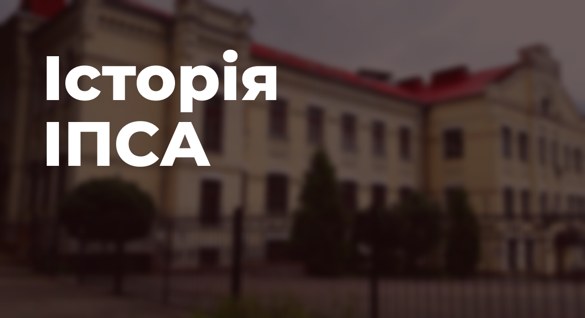
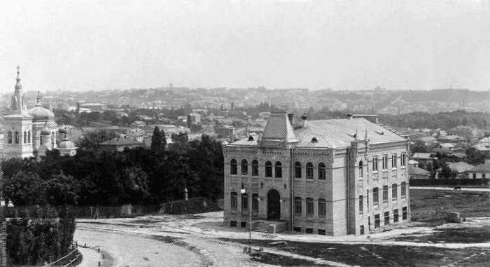

Історія ІПСА бере свій початок ще до його офіційного заснування, оскільки складники навчально-наукового інституту — катедри, були створені набагато раніше.

### **_Спочатку було ~~слово~~ СП…_**

У далекому 1962 році зародилась ідея про створення катедри **_системного проєктування_**, коротко іменованої як СП. У 1972 задумка була реалізована: на базі факультету радіоелектроніки в рамках спеціальності «Промислова електроніка» розпочалася підготовка спеціалістів відповідного напряму. У 1985 році, за підтримки професора А.І. Петренко, з'явилася катедра систем автоматичного проєктування (САПР).

### **_Утворилася земна твердь… Утворилася катедра ММСА_**

У **1988** році розпочинає свою діяльність катедра **_математичних методів системного аналізу_** (ММСА), за участі Ю.Л. Далецького, М.З. Згуровського та В.С. Михалевича.

**1990 рік** — ММСА стає підрозділом факультету прикладної математики, а на її базі створюється Науково-дослідний інститут (нині центр) міждисциплінарних досліджень.

**1995 рік** — в Україні запроваджено нові спеціалізації: «Системний аналіз та управління», «Інтелектуальні системи прийняття рішень» та «Соціальна інформатика», які потребували створення відповідної структурної одиниці для їхнього вивчення.

**1997 рік** — на базі Науково-дослідного інституту прикладного системного аналізу НАН України та катедри ММСА створено **ІПСА** — інститут прикладного системного аналізу. Підрозділ отримує четвертий рівень акредитації, що забезпечує можливість здобувати освіту відповідно до бакалаврських та магістерських програм. У 2006 році до катедрату була приєднана вищезгадана САПР.

### **_Як оцінити неоціненне?_**

**2004 рік** — за сприяння Згуровського М.З. — ректора КПІ, запроваджено Болонську систему оцінювання.

**Завдання реформи:** перехід на дворівневу освіту: бакалаврат і магістратуру, введення системи зіставлення дипломів і рівне визнання їх у всіх країнах так званої «Зони європейської вищої освіти».

### **_Потім з’явилася ~~людина~~ ШІ…_**

**До 2022** року катедра ММСА проводила підготовку студентів за двома спеціальностями: 124 «Системний аналіз» та 122 «Комп’ютерні науки» (освітня програма «Системи і методи штучного інтелекту»).

**2022 рік** — зміна устрою ЗВО. Згідно з новими вимогами, 122 спеціальність сепаровано від ММСА та створено катедру штучного інтелекту.

### **_І наповнюйте землю, оволодійте нею…_**

Корпуси, у яких проходить навчальний процес: 35, 14, 6. Усі будівлі розташовані на території кампусу КПІ.

Раніше катедра ММСА повністю розміщувалася в 14 корпусі, а наукові підрозділи були зосереджені в 35. У **2012** році вона повністю переїхала в 35 корпус, хоча деякі заняття й досі проходять у 14. Катедра СП розміщувалася у 26 корпусі, на Печерську, та **2021** року переїхала до 14 корпусу, на територію кампусу. **2022** рік — катедра ШІ локалізується в 6 корпусі.

### **_Сучасні реалії…_**

Сьогодення. ІПСА — це насамперед сильна математика та яскраве студентське життя. Але якщо перше — це заслуга висококваліфікованого викладацького колективу, то над другою складовою працюють студенти.

### **_Рушій прогресу студентства_**

1998 рік — активіст Артем Михайлюк започатковує Студентську Раду ІПСА, стає її першим головою та досягає права голосу голови СтудРади у Вченій раді, чим встановлює зв’язок між здобувачами освіти й адміністрацією КПІ. Час ішов, змінювалися люди та цілі організації, з’являлися нові амбітні та креативні студенти. На початку 2000 року СР ІПСА перемогла в єдиному в історії КПІ міжфакультетському конкурсі як найкраща студентська рада НТУУ «КПІ». Згодом, у **2009, була визнана найкращим органом студентського самоврядування України.**

**Мета СтудРади:** вдосконалення навчання в ІПСА для сучасних та майбутніх поколінь студентів, покращення інституту спільними зусиллями здобувачів освіти та викладачів, створення заходів для відчуття смаку того самого «студентського життя».

### **_Далі буде…_**
