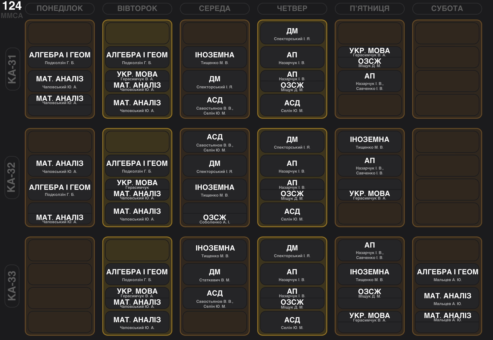

### Загальноуніверситетська духота

#### Що таке ІПСА? Які спеціальності я можу вибрати в ІПСА?

НН ІПСА — це навчально-науковий інститут прикладного системного аналізу.  Тут готують фахівців двох спеціальностей: 122 «Комп’ютерні науки» та 124 «Системний аналіз». Перша дає вибір між двома освітніми програмами: «Системи й методи штучного інтелекту» (катедра ШІ) та «Інтелектуальні сервіс-орієнтовані розподілені обчислювання» (катедра СП). Натомість друга пропонує освітню програму «Системний аналіз і управління» (катедра ММСА). Уже існує проєкт змін освітніх програм на «Системний аналіз та наука про дані» й «Комп'ютерні науки та штучний інтелект», проте коли він набуде чинності – невідомо.

<!--truncate-->

#### Що таке системний аналіз?

Системний аналіз — методологія, яка передбачає певний набір інструментів для розв'язання задач різних сфер досліджень. Він претендує на універсальність засобів, моделей і підходів. Також говорить про те, як працювати в умовах невизначених та / або суперечливих вхідних даних. Надає можливості прогнозування та передбачення поведінки системи. 

#### Чим відрізняються 122 та 124 спеціальності?

На 124 спеціальності вивчають формалізацію та побудови моделей із розумінням необхідності їхнього впровадження в комп'ютерне середовище. Тобто для побудови моделей необхідна математика, а для розуміння того, як вони будуть реалізовуватися потрібне володіння базовими навичками програмування.

На 122 вчать саме впровадженню цих моделей, тобто розробці програмного забезпечення. Коректна реалізація вимагає розуміння роботи та структури цих моделей, для чого потрібна певна математична база.

**P.S.** Про різницю освітніх програм можеш дізнатися в торішніх статтях: [122СП](https://iasastudentcouncil.github.io/iasa-sc-blog/blog/122%D0%A1%D0%9F/), [122ШІ](https://iasastudentcouncil.github.io/iasa-sc-blog/blog/AI/), [124](https://iasastudentcouncil.github.io/iasa-sc-blog/blog/124/).

#### Чи легко потім перевестися зі 122 на 124 або навпаки?

При зміні навчального закладу або спеціальності виникає «академічна різниця» в програмах, що вимірюється в кредитах ЄКТС. Вона не може перевищувати 20 кредитів за кожен рік навчання та має бути обов'язково ліквідована у визначені терміни. Також варто зазначити, що переведення з катедри СП на ШІ чи навпаки легше реалізувати на першому курсі бакалаврату, оскільки тоді програми є ідентичними. Перевестися можливо лише після першої літньої сесії.

#### На скільки потрібно скласти НМТ, щоб до вас потрапити? (Як розрахувати свій конкурсний бал?)

Цього року вступники мають скласти три обов'язкових іспити: з математики, української мови та історії України. Четвертий предмет обирається із наступного переліку: фізика, іноземна мова, біологія, хімія, українська література або географія. Щоб розрахувати свій конкурсний бал, необхідно використати формулу:

(К1 × П1 + К2 × П2 + К3 × П3 + К4 × П4) / (К1 + К2 + К3 + К4),

де П1, П2, П3, П4 — оцінки з першого, другого, третього та четвертого предметів за шкалою 100-200 балів;

К1, К2, К3, К4 — [невід'ємні вагові коефіцієнти](https://osvita.ua/consultations/bachelor/10025/), що визначені для кожної спеціальності.

[Таблиця прохідних балів 122 та 124](http://mmsa.kpi.ua/prospective-student/guide).

#### Коли можна перевестися із контракту на бюджет?

Можливість перевестися з контрактної на бюджетну форму навчання зʼявляється після першого курсу. Надалі це можна зробити наприкінці кожного семестру. Враховуються результати двох останніх сесій та пільговий статус. Докладніше про процес можна прочитати за [посиланням](https://dnvr.kpi.ua/2022/11/06/7240/).

#### Чи є можливості навчатися за кордоном за програмою по обміну?

ІПСАшниці та ІПСАшники (!) мають можливість навчатися за програмами від [Erasmus](https://kpi.ua/1609-4) та іншими пропозиціями #Edu_abroad щодо обміну від університетів та урядів інших країн. Докладніше за [посиланням](https://mobilnist.kpi.ua/).

#### Який буде формат навчання?

Адміністрація розглядає можливість змішаного формату навчання, що передбачає дистанційні лекції та очне відвідування практик. Проте наразі всі пари проходять онлайн. Точна інформація про формат зʼявляється перед початком кожного семестру.

#### У якому корпусі навчаються студенти ІПСА?

Основними корпусами для навчання є 6, 13, 14 та 35, хоча заняття можуть відбуватись і в інших приміщеннях на території КПІ, залежно від викладачів з інших факультетів та інститутів. Однією з вагомих причин для переходу в інший корпус може бути певне обладнання, наприклад, для лабораторних робіт із фізики.

#### Чи надається іногороднім студентам гуртожиток та які там умови проживання?

Право на поселення до гуртожитків надається всім, хто має реєстрацію місця проживання поза радіусом 50 кілометрів від м. Києва. Наразі, в умовах дистанційного навчання це не є вагомою причиною для поселення через невелику кількість місць у бомбосховищі. Пріоритет надається студентам з окупованих чи особливо небезпечних територій. Студенти ІПСА проживають у 7 гуртожитку коридорного типу. Кожен поверх містить по 2 санвузли, кухні та місця для вмивання з 4 умивальниками по обидва боки коридору. Душ знаходиться на цокольному поверсі й розділений на чоловічий та жіночий. Кімнати 12-14 кв. м — чотиримісні. Основні умови залежать від попередніх власників, проте не забороняється зробити ремонт.

Докладніше про гуртожитки можна прочитати [тут](https://iasastudentcouncil.github.io/iasa-sc-blog/blog/Dormitory/).

### Навчання та дотичні до нього запитання

#### Чи багато прогресивних викладачів, які мають сучасні знання?

Незважаючи на фундаментальність своїх предметів, більшість викладачів математичних дисциплін намагаються оновлювати методичні матеріали, знаходити більш наочні приклади пояснення, покращувати навчальні матеріали. IT-дисципліни зазвичай викладають молоді спеціалісти-практики, які здатні надавати актуальний матеріал.

#### Чи є викладачі, у яких неможливо здати предмет не заплативши?

Можемо гарантувати, що таких викладачів в ІПСА не існує, адже вони звикли брати плату лише витраченим часом на вивчення їхнього предмета.

#### Чи обов’язково писати конспект на лекціях? Чи надають викладачі короткі електронні конспекти?

У більшості викладачів є «Методичні матеріали» за якими вони й читають лекції. До того ж в Інтернеті можна знайти весь необхідний матеріал. Вести конспекти чи ні — суто твій вибір. Писати їх від руки чи робити записи за допомогою електронних пристроїв – the same. Якщо для тебе кількість написаного не впливає на якість знань, вистачить пасивного перегляду лекцій та вищеописаних матеріалів.

#### Скільки в середньому пар у день? Яку оптимальну кількість часу потрібно відводити на навчання в ІПСА?

Може бути як по 3 пари, так і коливання від 1 до 4 пар у день. Також потрібно враховувати деякі практики, які не є обов’язковими для відвідування, а використовуються лише для здачі лабораторних робіт чи надання консультацій. Близько 30% навчання проходить в авдиторіях, інші 70% — це самостійна робота студента над матеріалом, лабораторними роботами й іншими завданнями.

#### Навіщо мені стільки математики?

Багато математичних алгоритмів є основною для побудови, формалізації, розробки та впровадження певних моделей у складні інформаційні системи. Наприклад, знання з математичного аналізу чи статистики є необхідною базою для будь-якого аналітика, без лінійної алгебри не обійтися майбутньому гейм-девелоперу, а дискретна математика стане в нагоді більшості «прогерів».

Навіть у випадку «мамо, я стану фронтендером!», математика розвиває логіку, критичне та алгоритмічне мислення.

#### Наскільки шкільна математика відрізняється від університетської?

Дуже. Якщо ти в школі думав/ла, що розумієш математику, то тут можеш дійти висновку, що ти помилявся/лася.

Зрештою, хвилюватися не варто: усі в рівних умовах, шкільної бази має вистачити.

#### Мене навчать тут програмувати?

Ти отримаєш непогану базу як із програмування, так і з математичних дисциплін, що є дуже корисним і дасть тобі гарне розуміння щодо напряму, у якому плануєш розвиватися надалі.

#### Якщо я нуль у програмуванні, чи треба щось вчити до вступу та що саме?

Відсутність навичок — не смертний вирок. До того ж курс програмування почнеться з основ мови С, тому в тебе буде можливість розібратися. Розуміти, аналізувати та розробляти алгоритми тебе навчать на парах з АСД. Якщо ж вважаєш, що написаної програми в Scratch на інформатиці недостатньо, — цей [список літератури](https://iasastudentcouncil.github.io/iasa-sc-blog/blog/preparationforstudy/) створено для тебе.

#### Які мови програмування тут вивчають?

На обох спеціальностях на першому курсі вивчають C та C++. Далі ви вибиратимете самі, якою мовою програмувати. Зокрема тебе будуть навчати таким базовим мовам програмування, як, наприклад, мова асемблера.

#### Чи важка фізика? Мене виженуть, якщо я нуль?

Якщо ти маєш хоча б мінімальну базу з математики та фізики, то для того, щоб орієнтуватися в темах, достатньо лише уважно слухати лекції та не ловити ґав на практиках.

#### Наскільки важка англійська?

Якщо плануєш підняти свій рівень з В1-В2, маємо погані новини. Ти зможеш лише закріпити вже набуті знання, хоча акцентуватися увага буде на технічній термінології. Для учнів, які в школі вивчали німецьку чи французьку мови, є можливість обрати їх.

#### Як багато гуманітарних предметів вивчаються в ІПСА?

Щосеместру вивчається одна або дві гуманітарні дисципліни, окрім перманентної англійської та додаткових вибіркових предметів. Це ніяк не основна частина твого навчання, тому вимоги там відповідні.

#### Чи можливо відвідувати якісь однонаправлені секції (наприклад, плавання)?

Перший курс ІПСА побалує тебе теоретичними парами з основ здорового способу життя. Проте, для того, щоб розвивати свої спортивні здібності в певній дисципліні, КПІ надає можливість записатися до секції, де ти зможеш займатися улюбленою справою з обраним тренером безкоштовно. Їх перелік станом на 2023 рік за [посиланням](https://telegra.ph/physical-education-02-13).

#### Чи буде в мене вільний час? Та як правильно ним розпоряджатися, щоб усе встигати?

Буде, питання лише в кількості. Варто пам’ятати, що це залежить від твого ставлення до навчання. Хтось докладає максимум зусиль перші місяці та не вмирає ближче до сесії. Інші починають навчатися вже в період атестації або екзаменів (press F). Таким чином, дотримуючись певних правил організації свого часу, тебе, ~~можливо~~, не відрахують.

#### Коли можливо поєднувати навчання з роботою?

Питання залишається індивідуальним і залежить як від твоїх можливостей, так і від специфіки роботи. Здебільшого ж за спеціальністю ІПСАшники починають працювати з 3 курсу. Деякі студенти на 1-2 курсах підробляють репетиторами. Кількість працевлаштованих росте з підвищенням курсу разом із лояльністю викладачів до цієї зайнятості.

#### Івенти… що?

ІПСАшники, аби підтвердити класифікацію «людина звичайна», вміють / люблять / потребують відпочивати. Для вирішення цієї проблеми Студрада влаштовує івенти, на яких ти можеш розширити коло друзів і просто на деякий час забути про навчання. З переліком заходів можна ознайомитися за [посиланням](https://iasastudentcouncil.github.io/iasa-sc-blog/blog/Event/).

### Трохи мотивації

#### Який відсоток відрахувань?

Існує стереотип, що шанси продовжити навчання після першої сесії прямують до нуля, що є менш актуальним через дистанційний формат навчання. Насправді ж вони обернено пропорційні вашим зусиллям.

#### В ІПСА всі такі генії, що мені тут робити?

Потрібно розуміти, що кожен студент колись був невпевненим абітурієнтом і що не тільки тебе «доля обділила» якісною середньою освітою. На ділі «геніальність» означає зацікавленість, яка, у свою чергу, корелює з кількістю зусиль та часу, що ти готовий віддати навчанню. Працюй, а геніальне оточення створить конкуренцію, що стане твоєю мотивацією для підкорення нових висот.

#### Я навчався в гуманітарному класі, чи буде для мене посильним навчання в ІПСА?

Якщо ти склав екзамен і потрапив до нас, то для тебе вже немає непосильних задач. Доведеться наполегливо працювати на початку, щоб покрити різницю в базових вимогах і вміннях. Але зазвичай розрив між більш та менш підготовленими студентами зникає за кілька місяців. Ти можеш займати топові місця в рейтингу зі стандартною загальноосвітньою математичною підготовкою 3 години на тиждень та без жодних умінь програмувати на початку. Усе залежить лише від тебе.

### Надважливе

#### Чи є в ІПСА заочна форма навчання?

Дотепно, немає.
