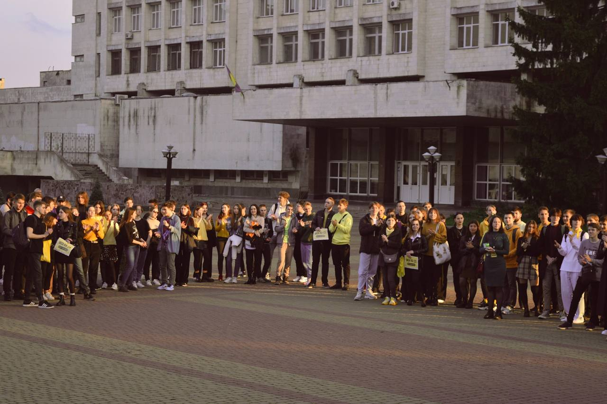
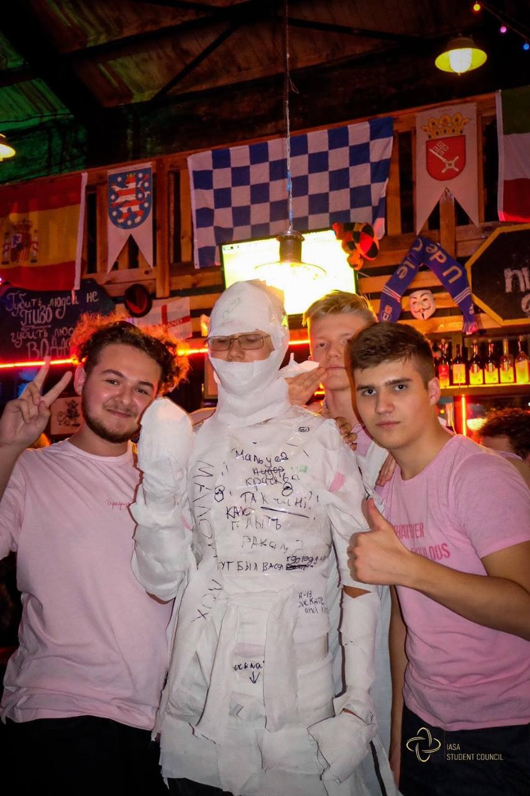
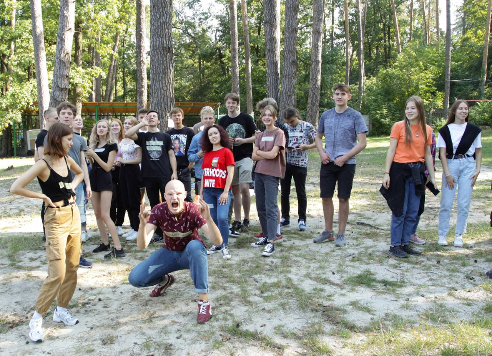
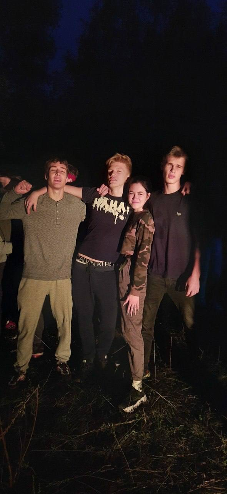
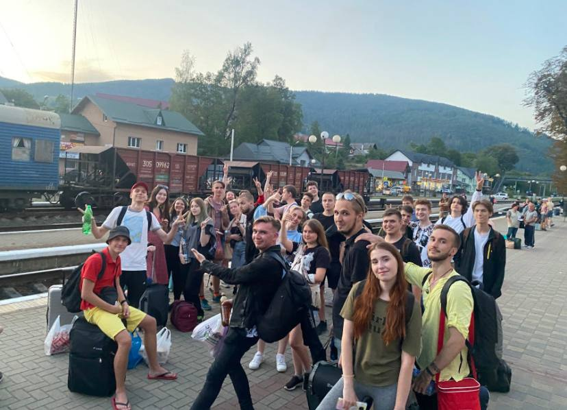

Ні для кого не буде секретом те, що Студрада ІПСА є однією з найактивніших у всьому КПІ. Передумовами цього, безсумнівно, є відповідальна та якісна робота кожного з її відділів. Хочемо поділитися візитівкою ІПСАшного позанавчального життя — івентами. Нижче ти зможеш ознайомитися з усіма заходами, які, ймовірно, зустрінуться під час тернистого шляху до фрази “Я БАКАЛАВР” або “Я МАГІСТР”. 

### День першокурсника

Знайомство з ІПСА в ролі студента. Це твій початок. Тут ти вперше (або ні) зустрінешся зі своєю групою та проведеш разом з нею незабутній час. Куратори (про них дізнаєшся пізніше) розкажуть про ІПСАшне життя та свій досвід. Уважно слухай і приєднуйся до захопливої екскурсії студентським життям.

### Fresh

Один із найперших заходів. На нього кожна група готує відеопрезентацію та веселу мініатюру на задану тематику. Вже під час підготовки ти зможеш зблизитися з одногрупниками і кураторами. Бери участь у конкурсах та отримай купу незабутніх емоцій в компанії чудових людей.

### Квест для першокурсників

Навчання тільки почалося, а отже саме час розвідати прекрасні вулички Києва разом з одногрупниками. Кожна команда досліджуватиме столицю, паралельно виконуючи завдання в боротьбі за омріяну перемогу.

### Пуща

Ласкаво просимо на посвяту в студенти. Тут на тебе чекають цікаві конкурси, улюблені пісні під гітару та просто незабутня атмосфера. Де, як не на природі, виникне можливість якісно відпочити та розважитися зі своєю групою, пізнаючи особливості кожного товариша?

### Туріада

Туріаду не можна описати словами, її треба пізнати. Це захід, на якому має бути кожен тру-ІПСАшник. Тут ти відчуєш себе частиною великої сім’ї. На природі, з палатками, під гітару — чи може бути щось краще?

P.S. Івент може бути скасованим або скороченим до вечора через наявність комендантської години.

### Хеловін 

Найбільш моторошний івент року після атестаційного тижня вводить в оману розум ІПСАшників. Ніколи не знаєш, чи вийдеш ти після цієї вечірки живим… Вампіри, злидні, вовкулаки, бабаї, сирени, вбивці, нявки й інша нечисть ніколи не спить… Але, тим не менш, усі студенти можуть брати участь у різноманітних конкурсах і почванитися своїми костюмами!

### Miss/Mister IASA

Усе ще впевнений, що дівчата в ІПСА поділяються на красунь, що шукають чоловіка-програміста, та зубрійок, особисте життя яких будується лише з книгами? Тоді ти просто не був на Miss IASA. Руйнуй стереотипи! На тебе чекає крута атмосфера та нагода познайомитися з розумними та чарівними ІПСАшницями. Під час івенту дівчата змагаються в різних конкурсах, де демонструють свої найкращі сторони. Аналогічний івент є і для хлопців — Mister IASA.

### IASA Evening 

А для поціновувачів більш культурних заходів ми маємо невеликий, проте затишний івент. IASA Evening — це цілий день із настільними іграми, Just Dance, іноді, переглядом фільмів, а найголовніше — з ІПСАшною родиною. Також не варто забувати про круті призи найкращим гравцям та печиво з кавою або чаєм.

### IASA Royale 

Не можна забути і про прихильників азартних ігор. Розкішні вбрання дівчат, хлопці в ділових костюмах, смачний бар і покерні столи. Чи можна провести вечір краще? Не переймайся, збанкрутіти шансів немає, а от вийти з крутим призом і незабутніми спогадами зможе кожен.

### IASA Online Night

З огляду на обставини, в яких живемо, наш обовʼязок — подбати й про відпочинок для тих, хто не може відвідати офлайн івенти. Тож, якщо ти не в Києві, не переймайся, є можливість поспілкуватися з ІПСАшниками й пограти в круті ігри або ж подивитися фільми в дискорді.

### IASA Theme Party 

Навчання у твоєму житті й так буде багато, тому й відпочинок має бути. Тож, час від часу відбуваються тематичні вечірки, де можна потанцювати під хіти обраної епохи, брати участь в крутих конкурсах і споглядати відповідні періоду вбрання студентів .

### IASA Poetry & Chill

Наш факультет повен талантів, тож ми маємо вечір, де всі початківці (або ні) в поезії, стендапі, музиці можуть продемонструвати свої таланти, а зацікавлені глядачі — насолодитися неповторною атмосферою, цікавими тематичними конкурсами і спілкуванням з однодумцями за келихом вина.

### IASA Tours

Додатковий захід, який дає можливість усім охочим ІПСАшникам зібратися разом та відвідати одне з міст нашої країни. Тур — це маса емоцій, цікавих історій та незабутніх вражень. 

В ІПСА справді нелегко вчитися, але й не доведеться  нудьгувати. 

Ми вміємо й відпочивати, й здобувати знання: 

• розважатися до ранку з матаном, а потім знову не спати, бо IASA Online Night;

• приїжджати з Туру рано-вранці та йти писати контрольні;

• поїхати з Туріади, щоб захистити лабу та повернутися назад;

• посинати перші пари всім потоком після Фрешу;

• губитися групою як на перших контрольних, так і  під час квесту;

• робити максимально тверезий вигляд як на парах після заходів, так і на alcohol-free івентах.

Але, можливо, найголовніше, про що треба нагадати з приводу ІПСАшних заходів: чудові люди роблять їх для чудових людей, саме тому вони є неповторними. Ком'юніті — це те, що робить твоє навчання в ІПСА цікавим та незабутнім!

Більше фото можна побачити на нашій [сторінці](https://www.hashtap.com/redirect?url=https%3A%2F%2Fwww.hashtap.com%2Fredirect%3Furl%3Dhttps%253A%252F%252Fwww.facebook.com%252Fstudrada.iasa%252F%26strict%3D0%26redirect_token%3D40c9b898dc06548caa6b30f07e4010a6ab2f435b29708ac856ffbc1507130188e5624379582725590d07df9da4262bc71b3faf67989f588dee344635a20a6e72&strict=0&redirect_token=8fd5ba75b077c7c1b0acb51de901eaee0c8e185adf252ea0ba249e160b1279d1624feeebb19cf7c7f69fa43b7901c317c581208fc77c1bd763371f81ac0e3810) у Фейсбук та у [хайлайтах](https://www.hashtap.com/redirect?url=https%3A%2F%2Fwww.hashtap.com%2Fredirect%3Furl%3Dhttps%253A%252F%252Fwww.instagram.com%252Fstudrada_iasa%252F%253Figshid%253D1q0npfl93sd4j%26strict%3D0%26redirect_token%3D9ff1c2ad4f5fb699bb86bce5afb96cfe98fffb141eb339b5b79d804b0ceb8fd14e4f8f91815320b01df673930fe8b85692d1c0352b3ae1f7414865b915d7b39e&strict=0&redirect_token=a4874a0673cb68c62b1c5ac53914588f1a5f574c9beef5e4543a1e5787e433cdf16feac19f09a9b23b477c8d63c620bcc7a10efd512909927ffe883c2ddd45ba) Інстаграм.

P.S. У зв’язку з війною ніхто не може передбачити можливість проведення всіх заходів. Імовірно, вони відбудуться в меншій кількості, іншому форматі або просто онлайн. Можливо, будуть замінені новими крутими івентами. Дякуємо захисникам, що маємо можливість поєднувати навчання з відпочинком у такі складні часи!!!

