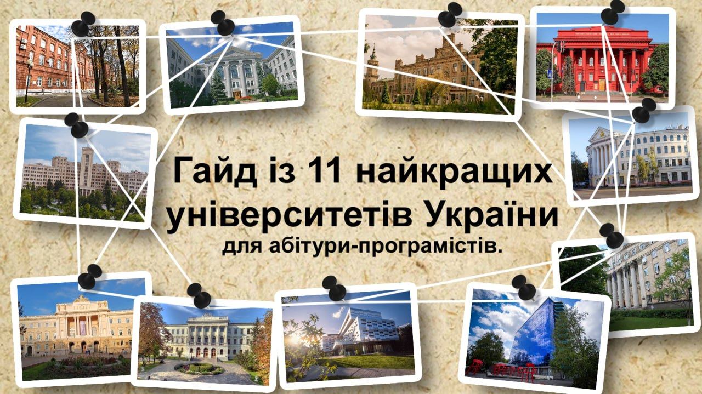
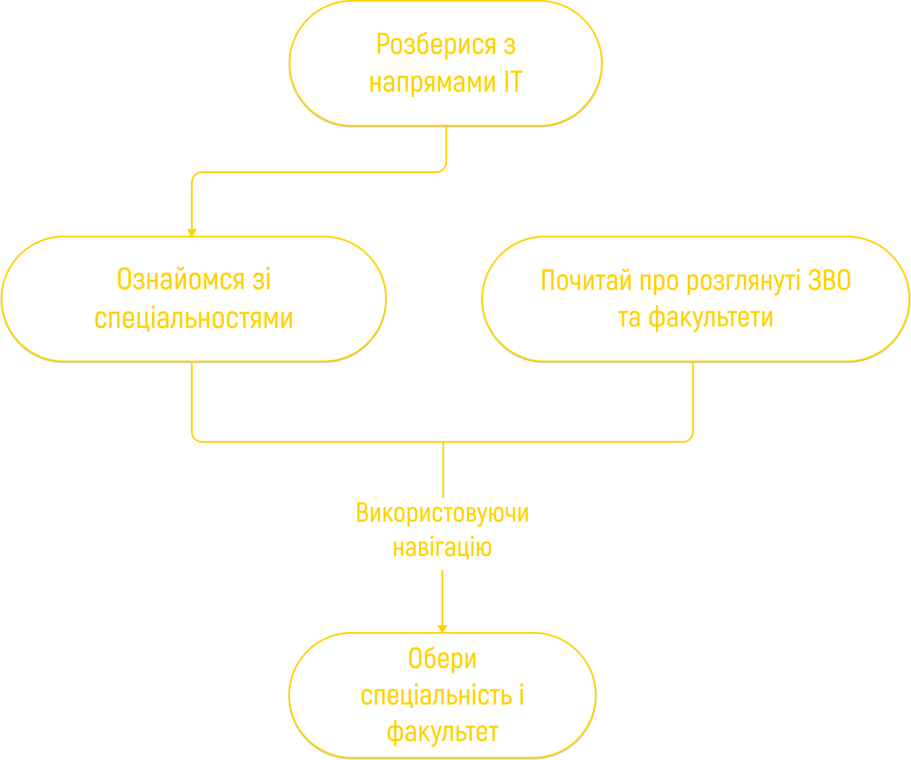

<!--truncate-->

# Гайд з університетів України для абітури-програмістів (магістратура edition)

>«You can't always get what you want. But if you try sometime, you'll find you get what you need».

_Mick Jagger_

## Як читати цей гайд?

## Основи основ

IT-сфера — то темний ліс, тут легко заблукати навіть із мапою.  Тому насамперед розглянемо декілька базових термінів, щоб проявити деякі загублені шляхи.

## Трохи суб'єктивізму

Просто нагадаємо, що програмування — це в 90% випадків звичайна рутина, яка полягає у вирішенні поставлених завдань, але для ідейних чемпіонів нудна буденність перетворюється на хоррор-квест 😉

Також треба пам’ятати, що написання коду — це ремесло (дрібне виробництво за допомогою примітивного знаряддя), і між професіями програміст і слюсар не так багато відмінностей. Як приклад, обидва можуть підвищувати кваліфікацію та залежно від неї отримувати різний дохід.

## Напрями в ІТ

**Керування.** Охоплює розподіл ресурсів, встановлення метрик успішності, управління командою та забезпечення виконання проєктних завдань у встановлені терміни.

+ **Product Manager** відповідає за стратегію розвитку та успіх ІТ-продукту. Визначає вимоги користувачів, планує функціональні можливості, спілкується з командою розробників, встановлює пріоритети, проводить аналіз ринку та координує випуск продукту на ринок.

+ **Business Analyst** відповідає за розуміння потреб бізнесу та перетворення їх на вимоги до програмного забезпечення або інших бізнес-рішень. Взаємодіє із зацікавленими сторонами, проводить аналіз бізнес-процесів, ідентифікує проблеми та можливості, розробляє рекомендації для покращення ефективності й результативності організації.

+ **Project Manager** відповідає за планування, виконання та контроль розробки ІТ-продукту. Управляє ресурсами, строками та бюджетом проєкту, оцінює ризики та забезпечує успішне його завершення.

+ **Product Marketing Manager** відповідає за стратегію маркетингу ІТ-продукту. Досліджує ринок, визначає цільову авдиторію, розробляє позиціювання продукту, планує маркетингові кампанії та сприяє впровадженню продукту на ринок.

+ **DevOps Engineer** — це спеціаліст, який бере участь у всіх етапах життєвого циклу IT-проєкту, забезпечує тісну кооперацію між командами розробників задля оптимізації їхніх робочих процесів і, як результат, допомагає скоротити час, за який програмний продукт потрапить до кінцевого користувача.

**Програмування.** Ось і підійшли до солоденького 🙃 Це безпосередньо технічні професії, які потребують фундаментальних знань вищої математики, кібернетики та мов програмування. Саме спеціалісти в цій галузі створюють різноманітні застосунки та програми.

+ **Data Analyst** аналізує та інтерпретує дані, щоб допомогти компаніям приймати обґрунтовані рішення. Відповідає за збір, обробку та візуалізацію даних, створюючи звіти та рекомендації на основі отриманих результатів.

+ **Data Engineer** розробляє, будує та підтримує інфраструктуру для зберігання, обробки та аналізу великих обсягів даних. Відповідає за створення та оптимізацію баз даних, ETL-процесів (екстракція, трансформація, завантаження даних) і забезпечення безперебійного функціонування дата-інженерних систем.

+ **Data Scientist** використовує наукові методи та алгоритми машинного навчання для дослідження великих обсягів даних. Він створює складні моделі прогнозування, інтегрує різні джерела даних та виконує глибинний аналіз, щоб виявити тренди та патерни для прийняття стратегічних рішень.

+ **Machine Learning Engineer** розробляє та впроваджує моделі машинного навчання для автоматизації задач та покращення процесів. Займається підготовкою даних, тренуванням моделей, оптимізацією алгоритмів та інтеграцією рішень у продуктивні системи.

+ **Computer Security Specialist** розробляє системи захисту інформації та все, що з цим пов'язано (від безпечної передачі даних через USB, до найскладніших алгоритмів, які забезпечують безпечну передачу твоїх даних).

+ **Software Engineer** є фахівцем, який займається розробкою, проєктуванням, тестуванням і підтримкою програмного забезпечення. Працює над створенням програмних продуктів, застосунків, вебсайтів, операційних систем.

+ **Embedded Engineer** — простими словами, це розробник та програміст різної електроніки: від блютуз-колонки до процесора.

**Дотичні до IT:**

+ **UI/UX Designer** відповідає за створення та вдосконалення користувацького інтерфейсу й взаємодії між користувачем і продуктом чи сервісом, аналізує потреби користувачів, розробляє дизайн та забезпечує зручну взаємодію користувачів з продуктом.

+ **Game Designer** визначає механіки гри, розробляє сюжет, рівні, персонажів, правила гри й інші аспекти, які забезпечують процес гри. Також співпрацює з розробниками, художниками, програмістами й т.д., щоб створити цілісний геймплей.

+ **Sound Designer** відповідає за створення звукового середовища в різних проєктах. Фахівець розробляє імерсивні звукові ефекти, музику, діалоги й інші аудіоелементи.

+ **Quality Assurance (QA) Engineer** займається перевіркою програмного забезпечення або продукту. До того ж проводить тестування і співпрацює з розробниками для виправлення помилок.

**Що обрати?**

Найголовніше — визначитися з тим, чим тобі хочеться займатися. Магістратура дає більш спеціалізовані знання, тому вибирай із розумом.

Потрібно провести певний ресерчинг, щоб дізнатися докладніше, що входить до обов'язків того чи іншого спеціаліста. Де проводити цей ресерч? Можна почати з Djinni та DOU. На останньому, до речі, щороку опитують українських програмістів та публікують детальну статистику актуальності кожного напряму й, відповідно, заробітних плат.

**Поговоримо про гроші**

Каша всюди смакує однаково (окрім дизайнерів): розробник-початківець заробляє в Україні до $1000. Досвід понад 5 років пропорційний $4000-5000 на місяць (не у дизайнерів). Докладніше на [DOU](https://dou.ua/lenta/articles/salary-report-devs-summer-2024/).

**P.S.** Ми не беремо до уваги дизайнерів, де медіана прибутку трішки менша.

## Навіщо магістратура?

+ **Диплом.** У разі працевлаштування в Україні твої навички та уміння все ще переважують «корочку». За кордоном другий рівень вищої освіти цінується значно вище, а для керівних посад це може бути обов’язковою вимогою.

+ **Дорога в науку.** Якщо ти з легкістю пишеш quicksort мовою Асемблера, виконуєш машинний код у голові, а «Мистецтво програмування» Кнута для тебе рідніше за «Гарі Поттера», то варто задуматися про кар’єру дослідника. Магістратура — це перший крок до неї.

+ **Ком'юніті.** Ще 1,5-2 роки в оточенні однодумців нікому не завадять. Причому на магістратурі вже будуть не ті сором’язливі каченята, а справжні стріляні горобці. Університетська спільнота все ще підвищує твої шанси знайти роботу, навіть якщо твій статус не «в активному пошуку».

+ **Додаткові бенефіти.** Гуртожиток, відстрочка, студентські знижки — це далеко не всі переваги навчання, які можна подовжити, якщо вступиш на магістратуру.

+ **«Мама дуже сильно попросила»** (с) Антон Бурков.

**Що ми маємо?**

ЗВО — не Гарвард (та і Гарвард — не Гарвард). Тобі майже напевно зустрінуться непотрібні предмети та нудні викладачі зі застарілими матеріалами. Проте, не без ложки меду: університет є чудовим місцем для тавтології «навчитися вчитись», адаптації до існування в системі та розвитку самостійності.

## Список університетів

- **Національний технічний університет України «Київський політехнічний інститут імені Ігоря Сікорського» (КПІ)**

    - Розташування: Київ.

    - Статус: державний.

    - [Сайт ЗВО](https://kpi.ua/).

    - [Телеграм-канал для вступників](https://t.me/vstup_kpi).

    - [Телеграм-чат для вступників](https://t.me/vstup_kpi_chat).

    - [Флуд-чат для вступників](https://t.me/+7X1qI-s6BlBiMGNi).

    - Факультети:

        - **Навчально-науковий інститут атомної та теплової енергетики ([ІАТЕ](https://iate.kpi.ua/))**

        Спеціальності: 121 «Інженерія програмного забезпечення», 122 «Комп'ютерні науки».

        - **Навчально-науковий інститут прикладного системного аналізу** ([ІПСА](https://iasa.kpi.ua/))

        Спеціальності: 122 «Комп'ютерні науки», 124 «Системний аналіз».

        - **Інститут спеціального зв'язку та захисту інформації**([ІСЗЗІ](https://iszzi.kpi.ua/))

        Спеціальності: 122 «Комп'ютерні науки», 125 «Кібербезпека».

        - **Факультет біомедичної інженерії** ([ФБМІ](https://fbmi.kpi.ua/))

        Спеціальності: 122 «Комп'ютерні науки».

        - **Факультет інформатики та обчислювальної техніки** ([ФІОТ](https://fiot.kpi.ua/))

        Спеціальності: 121 «Інженерія програмного забезпечення», 123 «Комп'ютерна інженерія», 126 «Інформаційні системи та технології».

        - **Факультет прикладної математики** ([ФПМ](http://fpm.kpi.ua/))

        Спеціальності: 113 «Прикладна математика», 121 «Інженерія програмного забезпечення», 123 «Комп'ютерна інженерія».

        - **Навчально-науковий фізико-технічний інститут** ([ФТІ](http://ipt.kpi.ua/))

        Спеціальності: 113 «Прикладна математика», 125 «Кібербезпека».

- **Київський національний університет імені Тараса Шевченка (КНУ)**
 
    - Розташування: Київ.

    - Статус: державний.

    - [Сайт ЗВО](http://www.univ.kiev.ua/).

    - [Телеграм-канал для вступників](https://t.me/knu_vstup).

    - [Телеграм-чат для вступників](https://t.me/knu_vsup_Chat).

    - Факультети:

        - **Факультет комп'ютерних наук та кібернетики** ([ФКНК](https://csc.knu.ua/uk/))

        Спеціальності: 113 «Прикладна математика», 121 «Інженерія програмного забезпечення», 122 «Комп'ютерні науки», 124 «Системний аналіз».

        - **Факультет інформаційних технологій** ([ФІТ](http://www.univ.kiev.ua/ua/departments/it/))

        Спеціальності: 121 «Інженерія програмного забезпечення», 122 «Комп'ютерні науки», 125 «Кібербезпека», 126 «Інформаційні системи та технології».

        - **Факультет радіофізики, електроніки та комп'ютерних систем** ([ФРЕКС](https://rex.knu.ua/))

        Спеціальності: 123 «Комп'ютерна інженерія».

- **Національний університет «Києво-Могилянська академія» (НаУКМА)**

    - Розташування: Київ.

    - Статус: державний. 

    - [Сайт ЗВО](https://www.ukma.edu.ua/).

    - [Телеграм-канал для вступників](https://t.me/vstup_naukma).

    - [Форма для вступу в телеграм-чат для вступників](https://forms.gle/zWgTDxa5KFkiWW34A).

    - Факультети:

        - **Факультет інформатики** ([ФІ](https://www.fin.ukma.edu.ua/))

        Спеціальності: 113 «Прикладна математика», 121 «Інженерія програмного забезпечення», 122 «Комп'ютерні науки», 125 «Кібербезпека».

- **Київський національний економічний університет імені Вадима Гетьмана (КНЕУ)**

    - Розташування: Київ.

    - Статус: державний. 

    - [Сайт ЗВО](https://kneu.edu.ua/).

    - [Телеграм-канал для вступників](https://t.me/abiturient_KNEU).

    - [Телеграм-чат для вступників](https://t.me/vstup_kneu_2024).

    - Факультети:

        - **Інститут інформаційних технологій в економіці** ([ІІТЕ](https://fisit.kneu.edu.ua/ua/))

        Спеціальності: 122 «Комп'ютерні науки», 124 «Системний аналіз», 125 «Кібербезпека».

- **Харківський національний університет радіоелектроніки (ХНУРЕ)**

    - Розташування: Харків.

    - Статус: державний.

    - [Сайт ЗВО](https://nure.ua/).

    - [Телеграм-канал для вступників](https://t.me/nure_osvita).

    - [Телеграм-чат для вступників](https://t.me/nure_vstup).

    - Факультети:

        - **Факультет інформаційно-аналітичних технологій та менеджменту** ([ФІТМ](https://nure.ua/faculty/fakultet-informatsiyno-analitichnih-tehnologiy-ta-menedzhmentu))

        Спеціальності: 113 «Прикладна математика», 122 «Комп'ютерні науки», 124 «Системний аналіз».

        - **Факультет комп'ютерних наук** ([ФКН](https://nure.ua/faculty/fakultet-kompyuternih-nauk))

        Спеціальності: 121 «Інженерія програмного забезпечення», 122 «Комп'ютерні науки».

        - **Факультет комп'ютерної інженерії та управління** ([ФКІУ](https://nure.ua/faculty/fakultet-kompyuternoyi-inzheneriyi-ta-upravlinnya)) 

        Спеціальності: 123 «Комп'ютерна інженерія», 125 «Кібербезпека».

        - **Факультет інформаційних радіотехнологій та технічного захисту інформації** ([ФІРТЗІ](https://nure.ua/faculty/fakultet-informatsiynih-radiotehnologiy-ta-tehnichnogo-zahistu-informatsiyi-irtzi))

        Спеціальності: 125 «Кібербезпека», 126 «Інформаційні системи та технології».

        - **Факультет інфокомунікацій** ([ФІК](https://nure.ua/faculty/fakultet-infokomunikatsiy))

        Спеціальності: 125 «Кібербезпека».

- **Харківський національний університет імені В. Н. Каразіна** (ХНУ)

    - Розташування: Харків.

    - Статус: державний.

    - [Сайт ЗВО](https://karazin.ua/).

    - [Телеграм-канал для вступників](https://t.me/StartKarazinUniver).
    
    - Факультети:

        - **Факультет математики і інформатики** ([ФМІ](https://math.karazin.ua))

        Спеціальності: 113 «Прикладна математика», 122 «Комп'ютерні науки».

        - **Факультет комп’ютерних наук** ([ФКН](https://csd.karazin.ua/science/konferentsiyi/mizhnarodna-naukovo-tehnichna-konferentsiya-komp-yuterne-modelyuvannya-u-naukoyemnih-tehnologiyah-kmnt-2020/))

        Спеціальності: 122 «Комп'ютерні науки», 123 «Комп'ютерна інженерія», 125 «Кібербезпека».

        - **Факультет радіофізики, біомедичної електроніки та комп’ютерних систем** ([ФРБЕКС](https://rbecs.karazin.ua/?lang=ua))

        Спеціальності: 126 «Інформаційні системи та технології».

        - **Навчально-науковий інститут «Каразінський банківський інститут»** ([ІКБІ](http://kbi.karazin.ua))

        Спеціальності: 122 «Комп'ютерні науки», 125 «Кібербезпека».

- **Національний технічний університет «Харківський політехнічний інститут» (ХПІ)**

    - Розташування: Харків.

    - Статус: державний. 

    - [Сайт ЗВО](https://kpi.kharkov.ua/ukr/).

    - [Телеграм-канал для вступників](https://t.me/HiTechOsvita).

    - Факультети:

        - **Інститут комп’ютерного моделювання, прикладної фізики та математики** ([ІКМ](https://web.kpi.kharkov.ua/infiz/uk/home/)) 

        Спеціальності: 113 «Прикладна математика», 122 «Комп'ютерні науки».

        - **Інститут комп’ютерних наук та інформаційних технологій** ([ІКНІТ](https://web.kpi.kharkov.ua/if/uk/uaabout/))

        Спеціальності: 113 «Прикладна математика», 121 «Інженерія програмного забезпечення», 122 «Комп'ютерні науки», 123 «Комп'ютерна інженерія», 124 «Системний аналіз», 125 «Кібербезпека», 126 «Інформаційні системи та технології».

- **Львівський національний університет імені Івана Франка (ЛНУ)**

    - Розташування: Львів.

    - Статус: державний. 

    - [Сайт ЗВО](https://lnu.edu.ua/).

    - [Телеграм-канал для вступників](https://t.me/entrantlnu).

    - Факультети:

        - **Факультет прикладної математики і інформатики** ([ФПМІ](https://ami.lnu.edu.ua)) 

        Спеціальності: 113 «Прикладна математика», 122 «Комп'ютерні науки», 124 «Системний аналіз», 125 «Кібербезпека».

        - **Механіко-математичний факультет** ([ММФ](http://www.mmf.lnu.edu.ua/he))

        Спеціальності: 113 «Прикладна математика»

        - **Факультет електроніки й компʼютерних технологій** ([ФЕКТ](https://electronics.lnu.edu.ua))

        Спеціальності: 121 «Інженерія програмного забезпечення», 122 «Комп'ютерні науки», 126 «Інформаційні системи та технології».

- **Національний університет «Львівська політехніка» (ЛП)**

    - Розташування: Львів. 

    - Статус: державний.

    - [Сайт ЗВО](https://lpnu.ua/).

    - [Телеграм-чат для вступників](https://t.me/nulp_abit).

    - [Телеграм-канал для вступників](https://t.me/+CXbfM6kf5TphMDMy).

    - Факультети:

        - **Інститут прикладної математики та фундаментальних наук** ([ІМФН](https://lpnu.ua/imfn))

        Спеціальності: 113 «Прикладна математика».

        - **Інститут комп'ютерних наук та інформаційних технологій** ([ІКНІ](https://lpnu.ua/ikni))

        Спеціальності: 121 «Інженерія програмного забезпечення», 122 «Комп'ютерні науки», 124 «Системний аналіз», 126 «Інформаційні системи та технології».

        - **Інститут комп'ютерних технологій, автоматики та метрології** ([ІКТА](https://lpnu.ua/ikta))

        Спеціальності: 122 «Комп'ютерні науки», 123 «Комп'ютерна інженерія», 125 «Кібербезпека».

        - **Інститут телекомунікацій, радіоелектроніки та електронної техніки** ([ІТРЕ](https://lpnu.ua/itre))

        Спеціальності: 126 «Інформаційні системи та технології».

- **Український католицький університет (УКУ)**

    - Розташування: Львів.

    - Статус: приватний.

    - [Сайт ЗВО](https://ucu.edu.ua/).

    - [Телеграм-канал для вступників](https://t.me/ucu_admission).

    - Факультети:

        - **Факультет прикладних наук** ([ФПН](https://apps.ucu.edu.ua/))

        Спеціальності: 122 «Комп'ютерні науки», 124 «Системний аналіз».

- **Дніпровський національний університет імені Олеся Гончара (ДНУ)**

    - Розташування: Дніпро. 

    - Статус: державний.

    - [Сайт ЗВО](https://dnu.dp.ua/).

    - [Телеграм-канал для вступників](https://t.me/dnu_info).

    - Факультети:

        - **Факультет прикладної математики** ([ФПМ](http://fpm.dnu.dp.ua))

        Спеціальності: 113 «Прикладна математика», 121 «Інженерія програмного забезпечення», 124 «Системний аналіз», 126 «Інформаційні системи та технології».

        - **Фізико-технічний факультет** ([ФТФ](https://fti.dp.ua))

        Спеціальності: 125 «Кібербезпека».

        - **Факультет фізики, електроніки та компʼютерних систем** ([ФФЕКС](https://fpecs.dnu.dp.ua))

        Спеціальності: 122 «Комп'ютерні науки», 123 «Комп'ютерна інженерія». 

        - **Механіко-математичний факультет** ([ММФ](http://mmf.dnu.dp.ua))

        Спеціальності: 113 «Прикладна математика».

## 113 Прикладна математика

Спеціальність, що передбачає широкий спектр спеціалізацій, від математичного моделювання до економіки та фінансів, і від розробки алгоритмів для розв’язування складних задач до сфери інформаційних технологій.

 ### КПІ

 #### ФПМ

Факультет прикладної математики зосереджується на поглибленому навчанні математичних дисциплін та використанні сучасних інформаційних технологій. Студенти набувають навичок системного мислення, аналізу даних і розробки програмного забезпечення.

**Освітньо-наукова програма: Наука про дані та математичне моделювання**

Метою є підготовка фахівців, здатних розв'язувати складні задачі й проблеми в галузі науки про дані та здійснювати інноваційну професійну діяльність для комплексного виконання проєктно-технологічних робіт з машинного навчання, інтелектуального аналізу даних та математичного моделювання об’єктів, процесів і явищ різного характеру, зокрема тих, що пов’язані з обробкою великих обсягів даних (Big Data).

Формат навчання в останньому семестрі: онлайн.

Прохідний бал 2023: 177,8.

Прохідний бал 2022: 178.

Вартість контракту (за весь термін): 109800 грн.

Важливі посилання: [освітня програма](https://osvita.kpi.ua/sites/default/files/opfiles/113_ONPM_NDMM_2022.pdf), [навчальний план](https://pma.fpm.kpi.ua/_next/static/media/uploads-bld-node-01-64eaec9e-7986-4193-958d-5925dc2739a1.pdf), [вибіркові дисципліни](https://pma.fpm.kpi.ua/_next/static/media/uploads-bld-node-01-19d02aa0-d238-4641-b91f-36ae3c83ee4a.pdf), [чат для абітурієнтів](https://t.me/fam_abit).

**Освітньо-професійна програма: Наука про дані та математичне моделювання**

Метою є підготовка фахівця, здатного розв'язувати складні задачі й проблеми в галузі науки про дані та здійснювати інноваційну професійну діяльність для комплексного виконання проєктно-технологічних робіт з машинного навчання, інтелектуального аналізу даних та математичного моделювання об’єктів, процесів і явищ різного характеру, зокрема тих, що пов’язані з обробкою великих обсягів даних (Big Data).
Формат навчання в останньому семестрі: онлайн.

Прохідний бал 2023: 171,4.

Прохідний бал 2022: 165.

Вартість контракту (за весь термін): 82350 грн.

Важливі посилання: [освітня програма](https://osvita.kpi.ua/sites/default/files/opfiles/113_OPPM_NDMM_2022.pdf), [навчальний план](https://pma.fpm.kpi.ua/_next/static/media/uploads-bld-node-01-a9025c52-5396-45ee-b087-b167fbb1947d.pdf), [вибіркові дисципліни](https://pma.fpm.kpi.ua/_next/static/media/uploads-bld-node-01-19d02aa0-d238-4641-b91f-36ae3c83ee4a.pdf), [чат для абітурієнтів](https://t.me/fam_abit). 

 #### ФТІ

Фізико-технічний інститут — один із науково-навчальних підрозділів. Інститут готує фахівців із сучасних розділів прикладної фізики, інформатики та інформаційної безпеки. 

**Освітньо-наукова програма: Математичні методи моделювання, розпізнавання образів та компʼютерного зору** 

Проходження науково-дослідної практики та виконання спільних, зокрема міжнародних, проєктів на замовлення державних установ і провідних ІТ-компаній за фахом. Орієнтація навчання на актуальні задачі розпізнавання образів та комп’ютерного зору. 

Формат навчання в останньому семестрі: онлайн.

Прохідний бал 2023: 140,4.

Прохідний бал 2022: 185.

Вартість контракту (за весь термін): 109800 грн.

Важливі посилання: [освітня програма](https://osvita.kpi.ua/sites/default/files/opfiles/113_ONPM_MMMROKZ_2022.pdf), [навчальний план](https://drive.google.com/file/d/173NrpkFJlpTCY1ldfqDEEoThecCEo5sl/view), [вибіркові дисципліни](https://drive.google.com/file/d/1G7O93rx11H44toQVueO1L940mDy9J-Yu/view), [чат для абітурієнтів](https://t.me/abit_ipt). 

**Освітньо-наукова програма: Математичні методи криптографічного захисту інформації**

Різнобічна підготовка фахівців у галузі криптографічного захисту інформації, що поєднує теоретичну та практичну складову, з акцентом на останніх досягненнях сучасної криптології, новітніх моделях і методах криптографічного захисту інформації та відповідного математичного підґрунтя.

Формат навчання в останньому семестрі: онлайн.

Прохідний бал 2023: 156.

Прохідний бал 2022: 125.

Вартість контракту (за весь термін): 109800 грн.

Важливі посилання: [освітня програма](https://osvita.kpi.ua/sites/default/files/opfiles/113_ONPM_MMKZI_2022.pdf), [навчальний план](https://mmis.ipt.kpi.ua/wp-content/uploads/education/mmis_np_master_2022-23.pdf), [вибіркові дисципліни](https://mmis.ipt.kpi.ua/wp-content/uploads/students/F-Catalogue_Masters.pdf), [чат для абітурієнтів](https://t.me/abit_ipt). 

 ### КНУ

 #### ФКНК

Факультет комп'ютерних наук та кібернетики — центр підготовки фахівців у галузі обчислювальної математики та інформатики, які мають необхідні фахові знання та вміння для проєктування, розробки, успішного впровадження та подальшого аналізу складних інформаційних систем.

**Освітньо-наукова програма: Прикладна математика**

Підготовка фахівців, здатних застосувати математичні методи, моделі, алгоритми та програмне забезпечення, що призначені для дослідження, аналізу, проєктування процесів і систем в різноманітних предметних областях.

Формат навчання в останньому семестрі: онлайн.

Прохідний бал 2023: 158,6.

Прохідний бал 2022: 155,0.

Вартість контракту (за весь термін): 91400 грн.

Важливі посилання: [освітня програма](http://csc.knu.ua/media/filer_public/e2/dd/e2dd36fe-78a7-40b2-a553-0ca02fd4e128/_onp_pm_113_mag_2022.pdf), [навчальний план](https://csc.knu.ua/media/filer_public/e3/6b/e36b74d4-88ed-4086-b742-88dce24390fd/plan_mag_113_pm_2022.pdf), [вибіркові дисципліни](https://csc.knu.ua/media/study/master-degree/113-pm-master-2022-2023.html), [чат для абітурієнтів](https://t.me/CyberHub_KNU).

 #### ММФ

Механіко-математичний факультет — структурний підрозділ, освітні програми якого охоплюють широкий спектр напрямків: від фундаментальної та прикладної математики до теоретичної механіки, механіки суцільних середовищ та математичного моделювання.

**Освітньо-наукова програма: Комп’ютерна механіка**

Надання освіти в області математики та механіки з широким доступом до працевлаштування, підготовка фахівців, здатних формулювати, розв'язувати й узагальнювати практичні задачі у своїй професійній діяльності з використанням фундаментальних, спеціальних прикладних методів математичних і комп’ютерних наук, розробляти моделі механічних систем, алгоритми, створювати та експлуатувати програмне забезпечення. 

Формат навчання в останньому семестрі: онлайн.

Прохідний бал 2023: 165,2.

Вартість контракту (за весь термін): 86600 грн.

Важливі посилання: [освітня програма](https://mechmat.knu.ua/wp-content/uploads/2018/08/mag-com-mech.pdf), [чат для абітурієнтів](https://t.me/abit_mmf_2024).

 ### НаУКМА

 #### ФІ

Факультет інформатики — навчально-науковий підрозділ, який проводить підготовку фахівців широкого профілю, здатних розробляти та впроваджувати складні комп’ютерні системи, застосовувати методи системного аналізу та математичного моделювання.

**Освітньо-наукова програма: Комп’ютерні науки**

Надає можливість поглибити математичні знання і спеціалізуватися в напрямку, який цікавить. Серед них застосування математики в IT-технологіях, природничих науках, у бізнесі та фінансах. Також працює сертифікатна програма «Аналіз даних», що містить три дисципліни з машинного навчання, за допомогою якого проводиться сучасна обробка й аналіз зображень, відео, побудова прогнозів тощо. 

Формат навчання в останньому семестрі: за рішенням групи.

Прохідний бал 2023: 162,6.

Прохідний бал 2022: 190,7.

Вартість контракту (за семестр): 45000 грн.

Важливі посилання: [освітня програма](https://www.ukma.edu.ua/ects/images/ects/docs/op/op_math2021.pdf), [вибіркові дисципліни](https://vstup.ukma.edu.ua/education-program-info?ep-id=116).

 ### ХНУРЕ

 #### ФІТМ

Факультет інформаційно-аналітичних технологій та менеджменту — структурний підрозділ, який проводить підготовку спеціалістів із таких галузей: прикладна математика, системний аналіз, комп’ютерні науки.

**Освітньо-професійна програма: Прикладна математика**

Випускники є фахівцями в області математичного моделювання, програмування, обчислювальної математики, розробки алгоритмів та структур даних, а також вміють коректно формулювати постановку задачі, спираючись на предметну галузь, обирати метод розв'язку.

Формат навчання в останньому семестрі: онлайн.

Прохідний бал 2023: 173,0.

Прохідний бал 2022: 164,0.

Вартість контракту (за перший рік): 24900 грн.

Важливі посилання: [освітня програма](https://nure.ua/wp-content/uploads/Education_programs/2023/2023_mag_113_opp_pm.pdf), [навчальний план](https://nure.ua/wp-content/uploads/Education_programs/2023/2023_mag_113_np_pm.pdf), [вибіркові дисципліни](https://am.nure.ua/vibirkovi-disciplini-specialnist-pm-5-kurs), [канал для абітурієнтів](http://t.me/magistraturaNURE).

 ### ХНУ

 #### ФМІ

Факультет математики і інформатики — навчально-науковий підрозділ, де студентам надається відповідна фундаментальна освіта, яка може бути застосована в освітній, математичній та IT-сфері. 

**Освітньо-професійна програма: Прикладна математика**

Спрямована на підготовку фахівців з прикладної математики, які спроможні самостійно формулювати та розв’язувати задачі у різних галузях людської діяльності, національної економіки й виробництва та володіють навичками виконання прикладних досліджень в галузі математичного моделювання об’єктів і процесів з застосуванням інформаційних технологій. 

Формат навчання в останньому семестрі: онлайн.

Прохідний бал 2023: 158,4.

Прохідний бал 2022: 152,8.

Вартість контракту (за весь термін): 38640 грн.

Важливі посилання: [освітня програма](https://appmath.univer.kharkov.ua/pdf/OP/OPP_113_Master_2023-2024.pdf), [навчальний план](https://appmath.univer.kharkov.ua/pdf/OP/OPP_NP_113_Master_2023-2024.pdf), [вибіркові дисципліни](https://appmath.univer.kharkov.ua/pdf/choice/Choice_5_2024.pdf), [канал для абітурієнтів](https://t.me/StartKarazinUniver).

**Освітньо-наукова програма: Прикладна математика**

Поєднання різноманітних напрямів прикладної математики (аналіз даних, теорія керування, комп’ютерне моделювання, механіка, біоматематика та ін.) на основі ґрунтовної підготовки з орієнтацією на наукові дослідження, що дозволяє отримати глибокі знання й розуміння задач, методів і підходів.

Формат навчання в останньому семестрі: онлайн.

Прохідний бал 2023: 152,8.

Вартість контракту (за весь термін): 52440 грн.

Важливі посилання: [освітня програма](https://appmath.univer.kharkov.ua/pdf/OP/ONP_113_Master_2023-2025.pdf), [навчальний план](https://appmath.univer.kharkov.ua/pdf/OP/ONP_NP_113_Master_2023-2025.pdf), [вибіркові дисципліни](https://appmath.univer.kharkov.ua/pdf/choice/Choice_5_2024.pdf), [канал для абітурієнтів](https://t.me/StartKarazinUniver).

 ### ХПІ

 #### ІКНІТ

Інститут комп'ютерних наук та інформаційних технологій —  навчально-науковий структурний підрозділ у галузі інформаційних технологій. Інститут готує фахівців з програмування, системного аналізу, кібербезпеки та інших напрямків комп'ютерних наук. 

**Освітньо-професійна програма: Інтелектуальний аналіз даних**

Спрямована на підготовку фахівців-дослідників, що володіють математичними методами та інформаційними технологіями машинного навчання й штучного інтелекту для пошуку, аналізу, обробки, візуалізації даних, зокрема даних вимірювань та спостережень, текстів, сигналів і зображень з метою видобування знань, прогнозування, прийняття рішень.

Формат навчання в останньому семестрі: онлайн.

Прохідний бал 2023: 173,0.

Прохідний бал 2022: 188,0.

Вартість контракту (за рік): 24700 грн.

Важливі посилання: [освітня програма](http://web.kpi.kharkov.ua/kmmm/wp-content/uploads/sites/110/2023/04/OPP_PM_IAD-_Magystr_2022-Z-retsenziyamy-tytul.pdf), [навчальний план](https://web.kpi.kharkov.ua/kmmm/wp-content/uploads/sites/110/2024/02/NP_OPP_23-24.pdf), [чат для абітурієнтів](https://t.me/istvstup).

**Освітньо-наукова програма: Інтелектуальний аналіз даних**

Готує фахівців-дослідників, які володіють математичними методами та інформаційними технологіями машинного навчання й штучного інтелекту для аналізу, обробки та візуалізації даних, та здатні працювати з вимірюваннями, спостереженнями, текстами, сигналами й зображеннями для видобування знань, прогнозування та прийняття рішень.

Формат навчання в останньому семестрі: онлайн.

Прохідний бал 2023 (лише контракт): 177.

Прохідний бал 2022 (лише контракт): 183.

Вартість контракту (за рік): 24700 грн.

Важливі посилання: [освітня програма](https://web.kpi.kharkov.ua/kmmm/wp-content/uploads/sites/110/2024/03/ONP_Magystr_KMAD_2023_24_Gotov.pdf), [навчальний план](https://web.kpi.kharkov.ua/kmmm/wp-content/uploads/sites/110/2024/04/KMAD_NP-2023-1mon_.pdf), [чат для абітурієнтів](https://t.me/istvstup).

**Освітньо-професійна програма (міждисциплінарна): Інтелектуальні системи кібербезпеки**

Спрямована на підготовку фахівців-дослідників, що володіють сучасними математичними методами й інформаційними технологіями інтелектуального пошуку, аналізу, обробки даних, зокрема даних вимірювань і спостережень, технологій захисту інформації, інформаційної безпеки, кібербезпеки, розробки й використання програмного забезпечення.

Формат навчання в останньому семестрі: онлайн.

Прохідний бал 2023 (лише контракт): 174.

Вартість контракту (за рік): 24700 грн.

Важливі посилання: [освітня програма](http://web.kpi.kharkov.ua/kmmm/wp-content/uploads/sites/110/2023/04/OPP_PM_IAD-_Magystr_2022-Z-retsenziyamy-tytul.pdf), [навчальний план](https://web.kpi.kharkov.ua/kmmm/wp-content/uploads/sites/110/2024/02/NP_OPP_23-24.pdf), [чат для абітурієнтів](https://t.me/istvstup).

 #### ІКМ

Навчально-науковий інститут комп’ютерного моделювання, прикладної фізики та математики — організаційний і навчально-науковий структурний підрозділ, який базується на поєднанні фундаментальної фізико-математичної освіти й підготовки з комп’ютерних наук, які разом спрямовані на практичні задачі в галузі ІТ.

**Освітньо-професійна програма: Компʼютерне та математичне моделювання** 

Спрямована на підготовку фахівців, що володіють спеціалізованими знаннями у сфері прикладної математики, здатні здійснювати математичне та комп'ютерне моделювання об’єктів і процесів, що в них відбуваються, проводити прикладні дослідження інженерних проблем з погляду розв’язання за допомогою традиційних, інтелектуальних методів обчислень.

Формат навчання в останньому семестрі: онлайн.

Прохідний бал 2023: 181.

Вартість контракту (за рік): 24700 грн.

Важливі посилання: [освітня програма](https://blogs.kpi.kharkov.ua/v2/qual1ty/wp-content/uploads/sites/44/2024/03/113-Komp-yuterne-ta-matematychne-modelyuvannya-M-2023.pdf), [навчальний план](https://web.kpi.kharkov.ua/dpm/wp-content/uploads/sites/123/2024/02/Navchalnij-plan_113_Prikladna-matematika_OPP_mag_2023.pdf), [чат для абітурієнтів](https://t.me/vstup113).

**Освітньо-наукова програма: Компʼютерне та математичне моделювання** 

Спрямована на підготовку фахівців, що володіють спеціалізованими знаннями у сфері прикладної математики, що охоплюють сучасні наукові здобутки, та здатні здійснювати математичне, комп'ютерне моделювання об'єктів і процесів, що в них відбуваються, проводити прикладних досліджень, критичного осмислення інженерних проблем з погляду розв'язання за допомогою традиційних, інтелектуальних методів обчислень.

Формат навчання в останньому семестрі: онлайн.

Прохідний бал 2022 (лише контракт): 190.

Вартість контракту (за рік): 24700 грн.

Важливі посилання: [освітня програма](https://blogs.kpi.kharkov.ua/v2/nv/wp-content/uploads/sites/43/2024/03/ONP-113-Kompyuterne-ta-matematychne-modelyuvannya.pdf), [навчальний план](https://web.kpi.kharkov.ua/dpm/wp-content/uploads/sites/123/2024/02/Navchalnij-plan_113_Prikladna-matematika_ONP_mag_2023.pdf), [чат для абітурієнтів](https://t.me/vstup113).

 ### ЛНУ

 #### ФПМІ

Факультет прикладної математики та інформатики — структурний підрозділ, що готує фахівців у сферах інформаційних технологій, фінансів, консалтингу, науки, освіті й державної служби.

**Освітньо-наукова програма: Прикладна математика** 

Підготовка фахівців у галузі прикладної математики з акцентом на застосування обчислювальних технологій. Надання здобувачам знань про комплексні моделі та методи, проєктування, управління презентації проєктів, засоби й методології їх реалізації.

Формат навчання в останньому семестрі: офлайн.

Прохідний бал 2023: 135,0.

Прохідний бал 2022: 144,0.

Вартість контракту (за весь термін): 75766 грн.

Важливі посилання: [навчальний план](https://ami.lnu.edu.ua/wp-content/uploads/2024/01/113_MastersAM2023_1_9-1.pdf), [канал для абітурієнтів](https://t.me/entrantlnu).

**Освітньо-професійна програма: Прикладна математика**

Підготовка висококваліфікованих фахівців у галузі прикладної математики з акцентом на застосування обчислювальних технологій. Надання здобувачам знань про комплексні моделі та методи, проєктування, управління  презентації проєктів, засоби й методології їх реалізації.

Формат навчання в останньому семестрі: офлайн.

Прохідний бал 2023: 160,8.

Прохідний бал 2022: 144,0.

Вартість контракту (за весь термін): 55835 грн.

Важливі посилання: [освітня програма](https://ami.lnu.edu.ua/wp-content/uploads/2023/10/OPP_AM_1_4_2024_.pdf), [навчальний план](https://ami.lnu.edu.ua/wp-content/uploads/2023/08/MastersAM2023_1_4.pdf), [канал для абітурієнтів](https://t.me/entrantlnu).

 #### ММФ

Механіко-математичний факультет є одним з найстаріших та найпрестижніших підрозділів університету, що забезпечує підготовку фахівців у галузях математики, механіки та інформатики.

**Освітньо-професійна програма: Теоретична і прикладна механіка** 

Спрямована на формування у випускників компетентностей в галузі теоретичної й прикладної механіки, що забезпечують продукування нових ідей, здатність до ефективної дослідницької діяльності, математичного моделювання складних процесів і систем, розв’язання практичних проблем науки та техніки із застосуванням сучасних комп’ютерних технологій.

Формат навчання в останньому семестрі: офлайн.

Прохідний бал 2023: 146,6.

Прохідний бал 2022: 156.

Вартість контракту (за весь термін): 52954 грн.

Важливі посилання: [освітня програма](https://education-programs.lnu.edu.ua/master/mathematics-and-statistics/mechanics/), [канал для абітурієнтів](https://t.me/entrantlnu).

 ### ЛП

 #### ІМФН

Інститут прикладної математики та фундаментальних наук — це навчально-структурний підрозділ, де студенти здобувають знання в галузях системних наук та кібернетики, фінансів, фізико-математичних наук, інформаційних технологій та міжнародних відносин.

**Освітньо-професійна програма: Прикладна математика**

Студенти освітньої програми отримують глибоку фундаментальну та спеціальну підготовку під час лекційних, практичних і лабораторних занять. Одержують навички роботи під час практики у провідних ІТ-компаніях, науково-дослідних установах, обчислювальних центрах підприємств.

Формат навчання в останньому семестрі: змішаний.

Прохідний бал 2023: 154,9.

Прохідний бал 2022: 157,4.

Вартість контракту (за рік): 49500 грн.

Важливі посилання: [освітня програма](https://lpnu.ua/sites/default/files/2021/program/17176/113-mag-pm-2024.PDF), навчальний план та вибіркові дисципліни (в освітній програмі), [загальний чат для абітурієнтів](https://t.me/nulp_abit), [чат ІМФН](https://t.me/nulp_imfn).

 ### ДНУ

 #### ФПМ

Факультет прикладної математики готує фахівців для ІТ-галузі: розробників алгоритмів, програмістів, інженерів з автоматизації, спеціалістів у проєктуванні баз даних, програмної інженерії та мережевих технологій. Випускники працюють у державних, банківських і промислових структурах.

**Освітньо-професійна програма: Компʼютерне моделювання та обчислювальні методи**

Передбачає підготовку фахівців до виконання науково-дослідної та прикладної діяльності з використанням методів прикладної математики й комп'ютерних технологій; до створення й використання математичних моделей процесів, об'єктів.

Формат навчання в останньому семестрі: онлайн.

Прохідний бал 2023: 155,8.

Прохідний бал 2022: 150.

Вартість контракту (за рік): 28000 грн.

Важливі посилання: [освітня програма](https://www.dnu.dp.ua/docs/osvitni_programy/2022/master/2020%20%D0%9C%D0%B0%D0%B3%20113%20%D0%BA%D0%BE%D0%BC%D0%BF%20%D0%BC%D0%BE%D0%B4%20%D1%82%D0%B0%20%D0%BE%D0%B1%D1%87%20%D0%BC%D0%B5%D1%82.pdf), [вибіркові дисципліни](https://www.dnu.dp.ua/view/fpm_23-24), [чат для абітурієнтів](http://t.me/dnu_abitchat).

**Освітньо-професійна програма: Інформатика**

Передбачає підготовку фахівців, які володіють системою знань у галузі прикладної математики й інформатики, здатних формулювати та розв’язувати складні нестандартні задачі, проблеми інноваційного, дослідницького характеру, вміють розробляти комп’ютерні системи обробки, аналізу інформації.

Формат навчання в останньому семестрі: онлайн.

Прохідний бал 2023: 173,4.

Прохідний бал 2022: 173,0.

Вартість контракту (за рік): 28000 грн.

Важливі посилання: [освітня програма](https://www.dnu.dp.ua/docs/osvitni_programy/2022/master/113%20%D0%9C%D0%B0%D0%B3_%D0%86%D0%BD%D1%84%D0%BE%D1%80%D0%BC%D0%B0%D1%82%D0%B8%D0%BA%D0%B0.pdf), [вибіркові дисципліни](https://www.dnu.dp.ua/view/fpm_23-24), [чат для абітурієнтів](http://t.me/dnu_abitchat).

 #### ММФ

Механіко-математичний факультет навчає структурного мислення, розвиває логіку і дає знання, які стануть в пригоді як e будь-якій галузі професій, так і в житті.

**Освітньо-професійна програма: Компʼютерна механіка**

Освітня програма передбачає підготовку фахівців у галузі прикладної математики та механіки. Випускники опановують навички розробки програмного забезпечення для розрахунків міцності, комп’ютерного моделювання в механіці деформівного твердого тіла й ресурсозабезпечення в машинобудуванні.

Формат навчання в останньому семестрі: онлайн.

Прохідний бал 2023: 158,2.

Прохідний бал 2022: 175,0.

Вартість контракту (за рік): 28000 грн.

Важливі посилання: [освітня програма](https://www.dnu.dp.ua/docs/osvitni_programy/proekty/m_113_OP_%20Komp%20mechanika_2021.pdf), [вибіркові дисципліни](https://www.dnu.dp.ua/view/fpm_23-24), [чат для абітурієнтів](http://t.me/dnu_abitchat).

## 121 Інженерія програмного забезпечення

Ті самі програмісти в широкому розумінні. Галузь знань зосереджена на розробці, тестуванні та підтримці програмного забезпечення, охоплює всі аспекти його життєвого циклу: від аналізу вимог і проєктування до розробки, тестування й підтримки готових продуктів. 

 ### КПІ

 #### ФІОТ

Факультет інформатики та обчислювальної техніки — структурний підрозділ, який готує кваліфікованих фахівців з розробки й експлуатації програмних продуктів і технічних засобів комп’ютерних і комп’ютеризованих систем, впровадження сучасних інформаційних технологій загального та цільового призначення для різноманітних галузей науки й промисловості.

**Освітньо-наукова програма: Інженерія програмного забезпечення комп'ютерних та інформаційних систем**
 
Зосереджена на освіті та підготовці у галузі інженерії програмного забезпечення комп'ютерних систем через поєднання академічного навчання й участі в ІТ-проєктах. Вона спрямована на всебічний професійний, інтелектуальний і соціальний розвиток студентів, дозволяючи їм самостійно формувати освітню траєкторію для освоєння нових технологій та знань.

Формат навчання в останньому семестрі: онлайн.

Прохідний бал 2023: 133,6.

Прохідний бал 2022: 200,0.

Вартість контракту (за весь термін): 98850 грн.

Важливі посилання: [освітня програма](https://osvita.kpi.ua/sites/default/files/opfiles/121_ONPM_IPZKIS_2022.pdf), [навчальний план](https://comsys.kpi.ua/upload/NP_121%D0%9C%D0%BD_%D0%BF%D1%80%D0%B8%D0%B9%D0%BE%D0%BC_2023.pdf), [вибіркові дисципліни](https://osvita.kpi.ua/sites/default/files/f-catalog/fkat_121_onpm_ipzkis_2023.pdf), [чат для абітурієнтів](https://t.me/abit_fice).

**Освітньо-професійна програма: Інженерія програмного забезпечення комп'ютерних систем**
 
Зосереджена на освіті та підготовці у галузі інженерії програмного забезпечення комп'ютерних систем через поєднання академічного навчання і участі в ІТ-проєктах. Вона спрямована на всебічний професійний, інтелектуальний та соціальний розвиток студентів, дозволяючи їм самостійно формувати освітню траєкторію для освоєння нових технологій та знань.

Формат навчання в останньому семестрі: онлайн.

Прохідний бал 2023: 177,0.

Прохідний бал 2022: 195,0.

Вартість контракту (за весь термін): 98850 грн.

Важливі посилання: [освітня програма](https://osvita.kpi.ua/sites/default/files/opfiles/121_OPPM_IPZKS_2022.pdf), [навчальний план](https://comsys.kpi.ua/upload/NP_121%D0%9C%D0%BF_%D0%BF%D1%80%D0%B8%D0%B9%D0%BE%D0%BC_2023.pdf), [вибіркові дисципліни](https://osvita.kpi.ua/sites/default/files/f-catalog/fkat_121_oppm_ipzks_2023.pdf), [чат для абітурієнтів](https://t.me/abit_fice).

**Освітньо-професійна програма: Інженерія програмного забезпечення інформаційних систем** 

Програма поєднує ґрунтовну математичну підготовку з сучасними професійними навичками, дозволяючи працювати з передовими технологіями та інформаційними системами підтримки управлінських рішень. Велика увага приділяється розвитку практичних навичок, щоб випускники могли швидко включитися в робочий процес.
 
Формат навчання в останньому семестрі: онлайн.

Прохідний бал 2023: 131,6.

Прохідний бал 2022: 140.

Вартість контракту (за весь термін): 98850 грн.

Важливі посилання: [освітня програма](https://osvita.kpi.ua/sites/default/files/opfiles/121_OPPM_IPZIS_2022.pdf), [навчальний план](https://ipi.kpi.ua/wp-content/uploads/2023/06/NP_mp_23_24_denna.pdf), [вибіркові дисципліни](https://osvita.kpi.ua/sites/default/files/f-catalog/fkat_121_oppm_ipzis_2023.pdf), [чат для абітурієнтів](https://t.me/abit_fice). 

 #### ФПМ

Факультет прикладної математики зосереджується на поглибленому навчанні математичних дисциплін та використанні сучасних інформаційних технологій. Студенти набувають навичок системного мислення, аналізу даних і розробки програмного забезпечення.

**Освітньо-наукова програма: Інженерія програмного забезпечення мультимедійних та інформаційно-пошукових систем**
 
Готує фахівців з проєктування інформаційно-пошукових систем з використанням технологій штучного інтелекту. Унікальність програми полягає в поєднанні інженерії програмного забезпечення з обробкою природномовних текстів, розробкою мультимедійних інтерфейсів та застосуванням технології мульсемедіа (Mulsemedia), що є частиною сучасних технологій Metaverse та Digital Humans.

Формат навчання в останньому семестрі: онлайн.

Прохідний бал 2023: 177,6.

Прохідний бал 2022: 195,0.

Вартість контракту (за весь термін): 131800 грн.

Важливі посилання: [освітня програма](https://osvita.kpi.ua/sites/default/files/opfiles/121_ONPM_IPZMIPS_2022.pdf), [навчальний план](https://pzks.fpm.kpi.ua/documents/navchalni_plany/NP_mn_2023.pdf), [вибіркові дисципліни](https://pzks.fpm.kpi.ua/documents/vybirkovi_dystsypliny/Magistry_2023-24.pdf), [чат для абітурієнтів](https://t.me/fam_abit).

**Освітньо-професійна програма: Інженерія програмного забезпечення мультимедійних та інформаційно-пошукових систем**
 
Готує фахівців з проєктування інформаційно-пошукових систем з використанням штучного інтелекту, з особливим акцентом на технології мульсемедіа (Mulsemedia), що є частиною таких сучасних технологій, як Metaverse та Digital Humans. Навчання відбувається із використанням спеціалізованого обладнання лабораторії мультимедіа, мульсемедіа та імерсійних технологій.

Формат навчання в останньому семестрі: онлайн.

Прохідний бал 2023: 179,6.

Прохідний бал 2022: 195,0.

Вартість контракту (за весь термін): 98850 грн.

Важливі посилання: [освітня програма](https://osvita.kpi.ua/sites/default/files/opfiles/121_OPPM_IPZMIPS_2022.pdf), [навчальний план](https://pzks.fpm.kpi.ua/documents/navchalni_plany/NP_mp_2023.pdf), [вибіркові дисципліни](https://pzks.fpm.kpi.ua/documents/vybirkovi_dystsypliny/Magistry_2023-24.pdf), [чат для абітурієнтів](https://t.me/fam_abit).

 #### ІАТЕ

Інститут атомної та теплової енергетики — навчально-науковий структурний підрозділ, який є провідним в системі технічних вишів України в галузі атомної та теплової енергетики, теплотехніки й теплофізики.

**Освітньо-наукова програма: Інженерія програмного забезпечення інтелектуальних кібер-фізичних систем в енергетиці** 

Програма готує фахівців з інженерії програмного забезпечення, орієнтуючись на розробку кіберфізичних систем, що поєднують мережі фізичних та обчислювальних компонентів, особливо в енергетичних системах. Студенти вивчають ключові технології, такі як великі дані, моделювання, хмарні обчислення, Інтернет речей, машинне навчання, доповнена реальність та інформаційна безпека, інтегруючи їх у єдині системи. Особлива увага приділяється впровадженню програмного забезпечення в енергетиці.

Формат навчання в останньому семестрі: онлайн.

Прохідний бал 2023: 164,2.

Прохідний бал 2022: 173,0.

Вартість контракту (за весь термін): 131800 грн.

Важливі посилання: [освітня програма](https://osvita.kpi.ua/sites/default/files/opfiles/121_ONPM_IPZIKFSE_2022.pdf), [навчальний план](https://ipze.kpi.ua/wp-content/uploads/2023/06/%D0%9D%D0%9F-2023-%D0%BE%D1%87%D0%BD%D0%B0-%D0%BC%D0%BD-NP_782.pdf), [вибіркові дисципліни](https://osvita.kpi.ua/sites/default/files/f-catalog/fkat_121_onpm_ipzikfse_2023.pdf), [чат для абітурієнтів](https://t.me/tef_abit).

**Освітньо-професійна програма: Інженерія програмного забезпечення інтелектуальних кібер-фізичних систем в енергетиці**
 
Готує фахівців з інженерії програмного забезпечення для розробки кіберфізичних систем, що поєднують фізичні та обчислювальні компоненти, особливо в енергетиці. Студенти вивчають ключові технології, такі як великі дані, моделювання, хмарні обчислення, Інтернет речей, машинне навчання, доповнена реальність та інформаційна безпека, інтегруючи їх у єдині системи. Основна увага приділяється впровадженню програмного забезпечення в енергетичній галузі.

Формат навчання в останньому семестрі: онлайн.

Прохідний бал 2023: 158,6.

Прохідний бал 2022: 175,0.

Вартість контракту (за весь термін): 98850 грн.

Важливі посилання: [освітня програма](https://osvita.kpi.ua/sites/default/files/opfiles/121_OPPM_IPZIKFSE_2022.pdf), [навчальний план](https://ipze.kpi.ua/wp-content/uploads/2023/06/%D0%9D%D0%9F-2023-%D0%BE%D1%87%D0%BD%D0%B0-%D0%BC%D0%BF-NP_644.pdf), [вибіркові дисципліни](https://osvita.kpi.ua/sites/default/files/f-catalog/fkat_121_oppm_ipzikfse_2023.pdf), [чат для абітурієнтів](https://t.me/tef_abit).
 
 ### КНУ

 #### ФКНК

Факультет комп’ютерних наук та кібернетики — центр підготовки фахівців у галузі обчислювальної математики та інформатики, які мають необхідні фахові знання та вміння для проєктування, розробки, успішного впровадження та подальшого аналізу складних інформаційних систем.

**Освітньо-наукова програма: Програмне забезпечення систем**

Підготовка професіоналів, здатних застосувати математичні основи, моделі, принципи моделювання, проєктування, розробки та супроводу програмних систем і технологій; здійснювати розробку, впровадження і супровід спеціалізованих, автономних, розподілених, інтелектуальних програмних систем автоматизованого пошуку, аналізу, обробки й збереження інформації. 

Формат навчання в останньому семестрі: онлайн.

Прохідний бал 2023: 162,8.

Прохідний бал 2022: 179,0.

Вартість контракту (за весь термін): 132400 грн.

Важливі посилання: [освітня програма](http://csc.knu.ua/media/filer_public/45/af/45afb756-f566-4949-bb71-977f5cecec01/onp121_2021.pdf), [навчальний план](http://csc.knu.ua/uk/filer/canonical/1634494257/1395/), [вибіркові дисципліни](https://csc.knu.ua/media/study/master-degree/121-iss-master-2023-202x.html), [чат для абітурієнтів](https://t.me/CyberHub_KNU).

 #### ФІТ

Факультет інформаційних технологій — структурний підрозділ КНУ, створений для підготовки висококваліфікованих фахівців, здатних до розв'язання складних задач в IT-сфері, проведення системних фундаментальних досліджень і здійснення експериментальних розробок для інформатизації суспільства.

**Освітньо-наукова програма: Інженерія програмного забезпечення**

Підготовка фахівців, що володіють методологією наукових досліджень з проєктування, розробки, тестування та супроводу програмного забезпечення, здатних забезпечити ефективне використання сучасних наукових методів, технологій розробки компʼютерних програм для діяльності підприємств і організацій з метою розвитку їх конкурентоздатності, сталий розвиток ІТ компаній щодо якості процесів і результатів розробки програмного забезпечення, що характеризується невизначеністю умов і вимог.

Формат навчання в останньому семестрі: 1 курс офлайн, 2 — онлайн.

Прохідний бал 2023: 164,4.

Прохідний бал 2022: 128,0.

Вартість контракту (за весь термін): 132400 грн.

Важливі посилання: [освітня програма](https://fit.knu.ua/wp-content/uploads/2024/03/ОНП_ІПЗ_ОР_Магістр_2021.pdf), [вибіркові дисципліни](https://pst.knu.ua/applicant), [чат для абітурієнтів](https://t.me/abit_knu_fit).

 ### НаУКМА

 #### ФІ

Факультет інформатики — навчально-науковий підрозділ, який проводить підготовку фахівців широкого профілю, здатних розробляти та впроваджувати складні комп’ютерні системи, застосовувати методи системного аналізу та математичного моделювання.

**Освітньо-наукова програма: Інженерія програмного забезпечення**

Передбачає підготовку фахівців, здатних ставити виробничі завдання щодо розробки, забезпечення якості, впровадження та супроводу програмних засобів, знаходити раціональні методи й засоби їх розв’язку, вирішувати найскладніші з них, забезпечувати сталий розвиток ІТ-компаній щодо якості процесів та результатів розробки програмного забезпечення.

Формат навчання в останньому семестрі: визначається за рішенням групи.

Прохідний бал 2023: 179,6.

Прохідний бал 2022: 172.

Вартість контракту (за семестр): 80000 грн.

Важливі посилання: [освітня програма](https://www.ukma.edu.ua/ects/index.php/2011-04-18-08-31-28/106-2018-06-13-06-37-07/pzs/223-2018-10-29-10-09-42).

 ### ХНУРЕ

 #### ФКН

Факультет комп'ютерних наук — структурний підрозділ, що проводить підготовку спеціалістів із таких галузей: інженерія програмного забезпечення, комп’ютерні науки, інформаційні системи та технології тощо. 

**Освітньо-наукова програма: Інженерія програмного забезпечення**

Програма розроблена для студентів, які прагнуть стати фахівцями у сфері розробки та супроводу програмного забезпечення. Головною перевагою є орієнтація на формування максимально широкого науково-технічного світогляду. 

Формат навчання в останньому семестрі: онлайн.

Прохідний бал 2023: 177,6.

Прохідний бал 2022: 164.

Вартість контракту (за перший рік): 41500 грн.

Важливі посилання: [освітня програма](https://software.nure.ua/wp-content/uploads/2024/02/2024_mag_121_onp_ipz.pdf), [навчальний план](https://software.nure.ua/wp-content/uploads/2024/02/2024_mag_121_np_ipz.pdf), [вибіркові дисципліни](https://software.nure.ua/syllabus/), [канал для абітурієнтів](http://t.me/magistraturaNURE).

 ### ХПІ

 #### ІКНІТ

Інститут комп'ютерних наук та інформаційних технологій —  навчально-науковий структурний підрозділ у галузі інформаційних технологій. Інститут готує фахівців з програмування, системного аналізу, кібербезпеки та інших напрямків комп'ютерних наук. 

**Освітньо-професійна програма: Інженерія програмного забезпечення**
 
Спрямована на підготовку фахівців, які здатні розв’язувати складні задачі та проблеми з розробки, забезпечення якості, впровадження й супроводу програмних засобів, що передбачає проведення досліджень та / або здійснення інновацій, характеризується невизначеністю умов і вимог.

Формат навчання в останньому семестрі: онлайн.

Прохідний бал 2023: 154.

Прохідний бал 2022: 174,8.

Вартість контракту (за рік): 35800 грн.

Важливі посилання: [освітня програма](http://web.kpi.kharkov.ua/asu/wp-content/uploads/sites/109/2023/07/skan_MAG_121_IPZ_OPP_2023.pdf), [навчальний план](https://web.kpi.kharkov.ua/asu/wp-content/uploads/sites/109/2023/09/plan_121_1-4_MAG_2023_signed.pdf), [чат для абітурієнтів](https://t.me/vstup_csit_khpi).

**Освітньо-наукова програма: Інженерія програмного забезпечення**
 
Спрямована на підготовку фахівців-дослідників, які здатні розв’язувати складні задачі та проблеми з розробки, забезпечення якості, впровадження й супроводу програмних засобів, що передбачає проведення досліджень та / або здійснення інновацій, характеризується невизначеністю умов і вимог.

Формат навчання в останньому семестрі: онлайн.

Прохідний бал 2023: 175,0.

Прохідний бал 2022: 178,4.

Вартість контракту (за рік): 35800 грн.

Важливі посилання: [освітня програма](https://web.kpi.kharkov.ua/asu/wp-content/uploads/sites/109/2023/07/skan_MAG_121_IPZ_ONP_2023.pdf), [навчальний план](https://web.kpi.kharkov.ua/asu/wp-content/uploads/sites/109/2023/09/plan_121_1-9_MAG_2023_signed.pdf), [чат для абітурієнтів](https://t.me/vstup_csit_khpi).

 ### ЛП

 #### ІКНІ

Інститут комп'ютерних наук та інформаційних технологій займається підготовкою фахівців, що спеціалізуються на аналізі, моделюванні, проєктуванні та побудові інтелектуальних систем з використанням передових технологій та програмних засобів.

**Освітньо-професійна програма: Інженерія програмного забезпечення**

Зосереджена на розробці, модифікації, аналізі, забезпеченні якості та супроводі програмного забезпечення. Вона готує фахівців до розв'язання складних задач в умовах невизначеності, навчаючи базовим математичним, інфологічним, лінгвістичним та економічним концепціям, а також методам аналізу, моделювання, проєктування, тестування й управління проєктами. Використовуються як програмно-апаратні, так і хмарні засоби підтримки інженерії програмного забезпечення.

Формат навчання в останньому семестрі: змішаний.

Прохідний бал 2023: 163,4.

Прохідний бал 2022: 160,0.

Вартість контракту (за семестр): 54600 грн.

Важливі посилання: [освітня програма](https://lpnu.ua/sites/default/files/2021/program/15946/121-mag-2021.PDF), [вибіркові дисципліни](https://pz.lpnu.ua/master-courses-map), [канал кафедри](https://t.me/pz_nulp), [загальний чат для абітурієнтів](https://t.me/nulp_abit), [чат ІКНІ](https://t.me/nulp_ikni).

**Освітньо-наукова програма: Інженерія програмного забезпечення**

Охоплює процеси розробки, модифікації, аналізу, контролю якості, впровадження та супроводу програмного забезпечення. Її мета — підготувати фахівців, здатних розв'язати складні проблеми в умовах невизначеності. Теоретичний зміст включає математичні, інфологічні, лінгвістичні та економічні концепції, що стосуються розробки та супроводу ПЗ. Використовуються методи аналізу, моделювання, проєктування, тестування, управління проєктами, а також програмно-апаратні та хмарні засоби.

Формат навчання в останньому семестрі: змішаний.

Прохідний бал 2023: 162,8.

Прохідний бал 2022: 156,0.

Вартість контракту (за семестр): 54600 грн.

Важливі посилання: [освітня програма](https://lpnu.ua/sites/default/files/2021/program/17513/121-mag-onp-2023_1.PDF), [вибіркові дисципліни[(https://pz.lpnu.ua/science-master-courses-map), [канал кафедри](https://t.me/pz_nulp), [загальний чат для абітурієнтів](https://t.me/nulp_abit), [чат ІКНІ](https://t.me/nulp_ikni).

 ### ДНУ

 #### ФПМ

Факультет прикладної математики готує фахівців для ІТ-галузі: розробників алгоритмів, програмістів, інженерів з автоматизації, спеціалістів у проєктуванні баз даних, програмної інженерії та мережевих технологій. Випускники працюють у державних, банківських і промислових структурах.

**Освітньо-професійна програма: Інженерія програмного забезпечення**

Освітня програма передбачає підготовку фахівців, здатних ставити виробничі завдання щодо розробки, забезпечення якості впровадження та супроводження програмних засобів, знаходити раціональні шляхи розв’язку цих задач, вирішувати найбільш складні з них, забезпечувати сталий розвиток ІТ-компаній щодо якості процесів та результатів розробки програмного забезпечення.

Формат навчання в останньому семестрі: онлайн.

Прохідний бал 2023: 176.2.

Прохідний бал 2022: 183.

Вартість контракту (за рік): 35000 грн.

Важливі посилання: [освітня програма](https://www.dnu.dp.ua/docs/osvitni_programy/2023/master/m_2021_2023_121_p.pdf), [вибіркові дисципліни](https://www.dnu.dp.ua/view/fpm_23-24), [чат для абітурієнтів](http://t.me/dnu_abitchat).

## 122 Комп'ютерні науки

Напевно, найзагальніша спеціальність серед 12Х, яка охоплює програмування, комп'ютерну архітектуру, алгоритми та структури даних, машинне навчання, комп'ютерні мережі та безпеку.

### КПІ

#### ІПСА

Інститут прикладного системного аналізу — це насамперед складна математика та яскраве студентське життя. Але якщо перше — заслуга викладацького колективу, то над другою складовою працюють студенти. Навчально-науковий комплекс готує фахівців з інформаційних технологій, системного аналізу та інтелектуальних систем прийняття рішень. Випускники здатні проєктувати, створювати та експлуатувати комп'ютерні системи для аналізу, передбачення, прогнозування й управління динамічними процесами в макроекономічних, технічних, фізичних, екологічних і фінансових складних системах.

**Освітньо-професійна програма: Системи і методи штучного інтелекту**

Програма зосереджена на використанні сучасних методів обчислювального інтелекту, таких як нейронні мережі, машинне навчання, глибоке навчання та аналіз великих даних. Вона навчає розв'язувати прикладні задачі штучного інтелекту, такі як розпізнавання зображень, автоматичну класифікацію, прогнозування в різних сферах, включаючи розумні міста, інтелектуальний транспорт, медичну діагностику та аналіз ризиків.

Формат навчання в останньому семестрі: онлайн.

Прохідний бал 2023: 174,6.

Прохідний бал 2022: 140.

Вартість контракту (за весь термін): 80850 грн.

Важливі посилання: [освітня програма](https://osvita.kpi.ua/sites/default/files/opfiles/122_OPPM_SMShI_2022o.pdf), [навчальний план](https://ai.kpi.ua/ua/masters/NP_690_2022.pdf), [вибіркові дисципліни](https://osvita.kpi.ua/sites/default/files/f-catalog/fkat_122_oppm_smshi_2023.pdf), [чат для абітурієнтів](https://t.me/masters_abitiasa).

**Освітньо-наукова програма: Комп'ютерні науки**

Готує професіоналів, які застосовують алгоритмічні принципи для розробки й підтримки інформаційних систем у комп'ютерних науках. Вона забезпечує глибоке фундаментальне навчання і навички швидкого освоєння нових технологій, відповідаючи стратегії розвитку, спрямованої на сталий розвиток і підготовку фахівців для майбутнього суспільства.

Формат навчання в останньому семестрі: онлайн.

Прохідний бал 2023: 150,0.

Прохідний бал 2022: 169,8.

Вартість контракту (за весь термін): 107800 грн.

Важливі посилання: [освітня програма](https://osvita.kpi.ua/sites/default/files/opfiles/122_ONPM_KN_2022o.pdf), [навчальний план](https://ai.kpi.ua/ua/masters/NP_ONP_2023.pdf), [вибіркові дисципліни](https://osvita.kpi.ua/sites/default/files/f-catalog/fkat_122_onpm_kn_2023.pdf), [чат для абітурієнтів](https://osvita.kpi.ua/sites/default/files/f-catalog/fkat_122_onpm_kn_2023.pdf).

**Освітньо-професійна програма: Інтелектуальні сервіс-орієнтовані розподілені обчислювання**

Програма вивчає сучасні концепції та моделі інтелектуальних обчислювальних середовищ, зокрема сервісні архітектури, хмарні, грід та безсерверні обчислення, машинне навчання і блокчейн-технології. Вона готує фахівців до проєктування, розробки та підтримки програмних систем, а також до роботи з великими даними, Інтернетом речей, розумними містами, інтелектуальним транспортом та електронною охороною здоров'я.

Формат навчання в останньому семестрі: онлайн.

Прохідний бал 2023: 176,6.

Прохідний бал 2022: 180.

Вартість контракту (за весь термін): 80850 грн.

Важливі посилання: [освітня програма](https://osvita.kpi.ua/sites/default/files/opfiles/122_OPPM_ISORO_2022o.pdf), [навчальний план](https://cad.kpi.ua/wp-content/uploads/2023/06/%D0%9D%D0%9F_%D0%86%D0%A1%D0%9E%D0%A0%D0%9E_%D0%BC%D0%B0%D0%B3-%D0%BF%D1%80%D0%BE%D1%84_2023.pdf), [вибіркові дисципліни](https://osvita.kpi.ua/sites/default/files/f-catalog/fkat_122_oppm_isoro_2023.pdf), [чат для абітурієнтів](https://t.me/masters_abitiasa).

 #### ІАТЕ

Інститут атомної та теплової енергетики — навчально-науковий структурний підрозділ, який є провідним в системі технічних вишів України в галузі атомної та теплової енергетики, теплотехніки й теплофізики.

**Освітньо-професійна програма: Цифрові технології в енергетиці**

Мета — вивчення новітніх цифрових технологій, актуальних в енергетичній сфері та формування професійних компетентностей у галузі проєктування, розробки, комплектування й супроводу програмних систем із розподіленими базами даних, високопродуктивних розподілених обчислень, візуалізації графічної та геометричної інформації, віртуальної реальності, постреляційних баз даних.

Формат навчання в останньому семестрі: онлайн.

Прохідний бал 2023: 168,2.

Прохідний бал 2022: 193,0.

Вартість контракту (за весь термін): 80850 грн.

Важливі посилання: [освітня програма](https://osvita.kpi.ua/sites/default/files/opfiles/122_OPPM_CTE_2022o.pdf), [навчальний план](https://dte.kpi.ua/wp-content/uploads/2023/06/mahistr_23.pdf),  [вибіркові дисципліни](https://osvita.kpi.ua/sites/default/files/f-catalog/fkat_122_oppm_cte_2023.pdf), [чат для абітурієнтів](https://t.me/tef_abit).

**Освітньо-наукова програма: Комп’ютерні науки**

Мета — вивчення сучасних методів та технологій для обробки й зберігання даних в інформаційних і комп'ютерних системах. Магістри освоюють алгоритми розв’язання теоретичних і прикладних задач, математичне і комп’ютерне моделювання, сучасні технології програмування, методи збору та аналізу даних, а також проєктування і забезпечення якості інформаційних систем і технологій. Програма також охоплює комп'ютерну графіку, візуалізацію даних, інженерію знань і CASE-технології.

Формат навчання в останньому семестрі: онлайн.

Прохідний бал 2023: 145,0.

Прохідний бал 2022: 160,6.

Вартість контракту (за весь термін): 107800 грн.

Важливі посилання: [освітня програма](https://osvita.kpi.ua/sites/default/files/opfiles/122_ONPM_KN_2022o.pdf), [навчальний план](https://dte.kpi.ua/wp-content/uploads/2023/06/navch_plan_mag_nauk.pdf), [вибіркові дисципліни](https://osvita.kpi.ua/sites/default/files/f-catalog/fkat_122_onpm_kn_2023.pdf), [чат для абітурієнтів](https://t.me/tef_abit).

 #### ФБМІ

Факультет біомедичної інженерії — структурний підрозділ, який готує фахівців за сучасними розділами біомедичної інженерії, медичної та біологічної інформатики й кібернетики, фізичної реабілітації. Навчальні дисципліни поєднують технічну, інформаційну та медико-біологічну складові.

**Освітньо-професійна програма: Компʼютерні технології в біології та медицині** 

Спеціалізується на використанні комп’ютерних технологій у біології та медицині. Вона охоплює сервіс-орієнтовані обчислення, розподілені і хмарні обчислення, машинне навчання, а також обробку великих даних і біомедичні системи. Студенти вивчають методи обробки біомедичних зображень і розробку медичних інформаційних систем.

Формат навчання в останньому семестрі: онлайн.

Прохідний бал 2023: 175,4.

Прохідний бал 2022: 175,0.

Вартість контракту (за весь термін): 80850 грн.

Важливі посилання: [освітня програма](https://osvita.kpi.ua/sites/default/files/opfiles/122_OPPM_KTBM_2022o.pdf), [вибіркові дисципліни](https://osvita.kpi.ua/sites/default/files/f-catalog/fkat_122_oppm_ktbm_2023.pdf), [чат для абітурієнтів](https://t.me/abit_biomed_mag).

**Освітньо-наукова програма: Комп’ютерні науки**

Мета — використання новітніх концепцій і моделей сучасної теорії й практики побудови математичного, програмного та апаратного забезпечення комп'ютерних систем для підготовки науково-педагогічних кадрів.

Формат навчання в останньому семестрі: онлайн.

Прохідний бал 2023: 160,4.

Прохідний бал 2022: 155,0.

Вартість контракту (за весь термін): 107800 грн.

Важливі посилання: [освітня програма](https://osvita.kpi.ua/sites/default/files/opfiles/122_ONPM_KN_2022o.pdf), [навчальний план](https://bmc.fbmi.kpi.ua/wp-content/uploads/2023/10/%D0%9D%D0%9F_%D0%9C%D0%90%D0%93-%D0%9D_%D0%BD%D0%B0%D0%B1%D0%BE%D1%80%D1%83_2023.pdf), [вибіркові дисципліни](https://osvita.kpi.ua/sites/default/files/f-catalog/fkat_122_onpm_kn_2023.pdf), [чат для абітурієнтів](https://t.me/abit_biomed_mag).

 #### ІСЗЗІ

Інститут спеціального зв’язку та захисту інформації здійснює освітню діяльність із підготовки, перепідготовки та підвищення кваліфікації начальницького та офіцерського складу з вищою освітою у сфері спеціального зв’язку й захисту інформації для потреб Держспецзв’язку, а також інших центральних органів виконавчої влади, військових формувань і правоохоронних органів.

**Освітньо-професійна програма: Комп'ютерні системи і технології спеціального зв'язку**

Готує фахівців в області інформаційних технологій для розробки та обслуговування державних інформаційних систем. Вона включає навчання методів програмування, математичному моделюванню, збору й аналізу даних, а також проєктуванню і забезпеченню якості ІТ-систем. Мета — підготувати спеціалістів, які зможуть ефективно працювати в державних інформаційних ресурсах і сприяти міжнародному визнанню України.

Інститут спеціального зв'язку та захисту інформації — єдиний підрозділ КПІ, де вчать шикуватися за наказом. Студенти цього інституту настільки добре замасковані, що існує лише один спосіб дізнатись інформацію про вступ — написати їм [особисто](https://t.me/iszzi_vstup).

Важливі посилання: [освітня програма](https://osvita.kpi.ua/sites/default/files/opfiles/122_oppm_kstsz_2023.pdf).

 ### КНУ

 #### ФКНК

Факультет комп’ютерних наук та кібернетики — центр підготовки фахівців у галузі обчислювальної математики та інформатики, які мають необхідні фахові знання та вміння для проєктування, розробки, успішного впровадження та подальшого аналізу складних інформаційних систем.

**Освітньо-наукова програма: Інформатика**

Займається підготовкою фахівців, здатних застосувати математичні основи, алгоритмічні принципи в моделюванні, проєктуванні, розробці та супроводі інформаційних систем і технологій; здійснювати розробку, впровадження і супровід інтелектуальних систем аналізу та обробки даних в організаційних, технічних, природничих та соціально-економічних системах.

Формат навчання в останньому семестрі: онлайн.

Прохідний бал 2023: 170,6.

Прохідний бал 2022: 170.

Вартість контракту (за весь термін): 132400 грн.

Важливі посилання: [освітня програма](https://csc.knu.ua/media/filer_public/9d/76/9d76c836-f713-4089-87d7-ddd6de67b072/122_inf_mag_2023.pdf), [навчальний план](http://csc.knu.ua/uk/filer/canonical/1660643074/2069/), [вибіркові дисципліни](http://csc.knu.ua/media/study/master-degree/122-mag-inf-courses-2022.html), [чат для абітурієнтів](https://t.me/CyberHub_KNU).

**Освітньо-наукова програма: Штучний інтелект**

Займається підготовкою професіоналів, здатних застосувати алгоритмічні принципи в моделюванні, проєктуванні, розробці та супроводі інформаційних систем і технологій; здійснювати розробку, впровадження і супровід інтелектуальних систем аналізу та обробки даних в організаційних, технічних, природничих та соціально-економічних системах. 

Формат навчання в останньому семестрі: онлайн.

Прохідний бал 2023: 172,4.

Прохідний бал 2022: 174,0.

Вартість контракту (за весь термін): 132400 грн.

Важливі посилання: [освітня програма](http://csc.knu.ua/media/filer_public/bb/b8/bbb86d1c-310c-451d-95d3-0398989c13f1/onp_mag_ai_01_07_2022.pdf), [навчальний план](http://csc.knu.ua/uk/filer/canonical/1662561182/2096/), [вибіркові дисципліни](http://csc.knu.ua/media/study/master-degree/122-ai-master-2020-2021.html), [чат для абітурієнтів](https://t.me/CyberHub_KNU).

**Освітньо-наукова програма: Бізнес-інформатика**

Займається підготовкою професіоналів, здатних на основі здобутих наукових знань, системного підходу та його принципів, практичних умінь і здобутих інноваційних навичок у розробці та застосуванні математичних моделей, методів та інформаційних технологій, здійснювати дослідження та розробку бізнес-процесів при створенні та супроводженні об’єктів критичної інфраструктури, технічних, еколого-економічних та соціальних систем з використанням сучасних ІКТ. 

Формат навчання в останньому семестрі: онлайн.

Прохідний бал 2023: 167,4.

Прохідний бал 2022: 170,0.

Вартість контракту (за весь термін): 132400 грн.

Важливі посилання: [освітня програма](http://csc.knu.ua/media/filer_public/bb/ae/bbae7221-ecec-4932-915c-6353044c9788/_onp_122_mag_bizinf_2022_1.pdf), [навчальний план](http://csc.knu.ua/uk/filer/canonical/1663760230/2130/), [вибіркові дисципліни](http://csc.knu.ua/media/study/master-degree/122-bizinf-master-2022.html), [чат для абітурієнтів](https://t.me/CyberHub_KNU).

**Освітньо-наукова програма: Математичні методи штучного інтелекту**

Готує професіоналів, здатних застосувати алгоритмічні принципи в моделюванні, проєктуванні, розробці та супроводі інформаційних систем і технологій; здійснювати розробку, впровадження і супровід інтелектуальних систем аналізу та обробки даних в організаційних, технічних, природничих та соціально-економічних системах; застосовувати штучний інтелект в області машинного навчання, інформатики та кібербезпеки.

Формат навчання в останньому семестрі: онлайн.

Прохідний бал 2023: 172,6.

Прохідний бал 2022: 146,0.

Вартість контракту (за весь термін): 132400 грн.

Важливі посилання: [освітня програма](https://csc.knu.ua/media/filer_public/4a/62/4a62e9cc-e26a-47a0-9638-28ce53bd05b4/122_mag_mmai_2023.pdf), [навчальний план](http://csc.knu.ua/uk/filer/canonical/1662561182/2099/), [вибіркові дисципліни](https://knuit.space/mmai.html), [чат для абітурієнтів](https://t.me/CyberHub_KNU).

 #### ФІТ

Факультет інформаційних технологій — структурний підрозділ КНУ, створений для підготовки висококваліфікованих фахівців, здатних до розв'язання складних задач в IT-сфері, проведення системних фундаментальних досліджень і здійснення експериментальних розробок для інформатизації суспільства.

**Освітньо-наукова програма: Технології штучного інтелекту**

Мета — надати освіту в області комп’ютерних наук із широким доступом до працевлаштування, підготувати студентів з особливим інтересом до розробки, впровадження і супроводу інтелектуальних систем обробки інформації та управління, систем підтримки прийняття рішень, систем штучного інтелекту, експертних систем.

Формат навчання в останньому семестрі: 1 курс офлайн, 2 онлайн.

Прохідний бал 2023: 166,4.

Прохідний бал 2022: 153,0.

Вартість контракту (за весь термін): 132400 грн.

Важливі посилання: [освітня програма](https://fit.knu.ua/wp-content/uploads/2024/03/ОНП-ТШІ-редакція-2022-року.pdf), [навчальний план](https://kiis.knu.ua/navchalnij-plan-tehnologii-shtuchnogo-intelektu/), [вибіркові блоки](https://kiis.knu.ua/vibirkovi-bloki-osvitnja-naukova-programa-tehnologii-shtuchnogo-intelektu/), [вибіркові з переліку](https://kiis.knu.ua/disciplini-vilnogo-viboru-studenta//), [чат для абітурієнтів](https://t.me/abit_knu_fit).

**Освітньо-наукова програма: Інформаційні системи**

Мета освітньої програми — підготовка фахівців з комп’ютерних наук, здатних розв’язувати задачі дослідницького та інноваційного характеру у сфері комп’ютерних наук, що передбачає як вільне володіння наявними знаннями, так і спроможність їх застосування у практиці, проєктування, розроблення, впровадження, експлуатацію прикладних інформаційних систем і технологій у різній діяльності. 

Формат навчання в останньому семестрі: 1 курс офлайн, 2 онлайн.

Прохідний бал 2023: 171,2.

Прохідний бал 2022: 137,0.

Вартість контракту (за весь термін): 132400 грн.

Важливі посилання: [освітня програма](https://fit.knu.ua/wp-content/uploads/2024/03/ОНП_ІС_редакція_2023-.pdf), [навчальний план](https://drive.google.com/file/d/1Cc3Wjug5TChEt7sHdKXdl1tu7GlgL07g/view), [вибіркові дисципліни](https://ais.knu.ua/onp-is/), [чат для абітурієнтів](https://t.me/abit_knu_fit). 

**Освітньо-наукова програма: Інформаційна аналітика і впливи**

Забезпечує підготовку дослідників даних та бізнес-процесів, у тому числі аналітиків за напрямом аналізу даних великого обсягу та аналізу інформації для прийняття бізнесових рішень, здатних проводити аналітичні дослідження, розробляти алгоритми, математичні моделі, проєктувати та розробляти комп’ютерні інформаційні технології обробки та дослідження даних, а також здатних отримувати прогнозні оцінки розвитку бізнесу в ІТ та інших галузях.

Формат навчання в останньому семестрі: 1 курс офлайн, 2 онлайн.

Прохідний бал 2023: 168,0.

Прохідний бал 2022: 182,0.

Вартість контракту (за весь термін): 132400 грн.

Важливі посилання: [освітня програма](https://fit.knu.ua/wp-content/uploads/2024/03/ОНП_ІАВ_редакція_2022.pdf), [навчальний план](https://drive.google.com/file/d/1rliRVbhdJfkEMcTASFUqIEe1jbi1FsoZ/view), [вибіркові дисципліни](http://pm.fit.knu.ua/vybirkovi/), [чат для абітурієнтів](https://t.me/abit_knu_fit).

**Освітньо-наукова програма: Управління проєктами**

Забезпечує студентам поглиблені знання та навички у розробці, впровадженні та супроводі комп'ютерних систем для управління ІТ-проєктами. Це дозволить їм ефективно вирішувати складні завдання в проєктуванні та інтеграції інформаційних технологій на підприємствах України.

Формат навчання в останньому семестрі: 1 курс офлайн, 2 онлайн.

Прохідний бал 2023: 165,4.

Прохідний бал 2022: 170,0.

Вартість контракту (за весь термін): 132400 грн.

Важливі посилання: [освітня програма](https://fit.knu.ua/wp-content/uploads/2024/03/ОНП_УП_редакція_2022.pdf), [навчальний план](https://drive.google.com/file/d/13046RTfvh5g-xa8aRlajDI4jzT30aQWr/view), [вибіркові дисципліни](http://pm.fit.knu.ua/vybirkovi/), [чат для абітурієнтів](https://t.me/abit_knu_fit).

 ### НаУКМА

 #### ФІ

Факультет інформатики — навчально-науковий підрозділ, який проводить підготовку фахівців широкого профілю, здатних розробляти та впроваджувати складні комп’ютерні системи, застосовувати методи системного аналізу та математичного моделювання.

**Освітньо-наукова програма: Комп’ютерні науки**

Орієнтована на підготовку кадрів для проведення досліджень та науково-технічних розробок у галузі проєктування й реалізації інформаційних систем. 

Формат навчання в останньому семестрі: по рішенню групи.

Прохідний бал 2023: 163,4.

Прохідний бал 2022: 148.

Вартість контракту: 150000 грн.

Важливі посилання: [освітня програма](https://www.fin.ukma.edu.ua/_files/ugd/632819_eccc40587aa74509b462c6b1768db994.pdf), [інформаційна сторінка програми](https://www.ukma.edu.ua/ects/index.php/2011-04-18-08-31-28/102-2018-06-13-06-37-07/iusit/276-2018-11-16-11-08-10), [форма для додавання в чат для абітурієнтів](https://docs.google.com/forms/d/e/1FAIpQLSfhKzPVFE5Nm5672sqAQQMPKAU5yQ-qeVRQE5vzuIjjfuM9WQ/viewform).

 ### КНЕУ

 #### ІІТЕ

Інститут інформаційних технологій в економіці — це навчально-науковий підрозділ, що готує фахівців із розробки, впровадження й супроводу інформаційних систем, систем прийняття рішень і програмних комплексів для управління складними соціально-економічними системами. 

**Освітньо-професійна програма: Інформаційні управляючі системи і технології**

Програма готує ІТ-фахівців нового покоління з глибокими знаннями в інноваційних технологіях, математичному моделюванні та системному аналізі. Випускники навчаться вирішувати нестандартні завдання, приймати оптимальні рішення і створювати ефективні ідеї, використовуючи сучасні інструменти для аналізу великих даних і адаптації до нових викликів у цифровій сфері.

Формат навчання в останньому семестрі: онлайн.

Прохідний бал 2023: 174,8.

Прохідний бал 2022: 180.

Вартість контракту: 95950 грн.

Важливі посилання: [освітня програма](https://kneu.edu.ua/g-files/index.php?file=1wPz3WZLJ-Uqs8yz1eCNhMAu2KVL0SGm7), [навчальний план](https://kneu.edu.ua/g-files/index.php?file=1ZAIqgqjGqDIyKtxJUoLAwSiVX-Tf6nc2), [вибіркові дисципліни](https://drive.google.com/file/d/1hJsR6Haiq5tTvaJqoRP2luQtYjZ3-QTu/view), [чат для абітурієнтів](https://t.me/abityra_iite_2023).

**Освітньо-професійна програма: Системи штучного інтелекту**

Готує фахівців, які отримають глибокі знання та навички у розробці й впровадженні програмного забезпечення для різних інтелектуальних систем, таких як вебсервіси, бази даних, хмарні технології, машинне навчання та мобільні додатки. Випускники будуть готові створювати інноваційні інформаційні продукти та бути конкурентоспроможними на ринку праці.

Формат навчання в останньому семестрі: онлайн.

Прохідний бал 2023: 172,6.

Прохідний бал 2022: 188.

Вартість контракту: 95950 грн.

Важливі посилання: [освітня програма](https://kneu.edu.ua/g-files/index.php?file=10mRGU21A71on9zvoffIw7fbQ9BLQJimb), [навчальний план](https://kneu.edu.ua/g-files/index.php?file=1J3ZnQ_KOqaF84lGoGydEk1cGYQmkWDOw), [вибіркові дисципліни](https://drive.google.com/file/d/1hJsR6Haiq5tTvaJqoRP2luQtYjZ3-QTu/view), [чат для абітурієнтів](https://t.me/abityra_iite_2023).

 ### ХНУРЕ

 #### ФКН

Факультет комп'ютерних наук — структурний підрозділ, що проводить підготовку спеціалістів із таких галузей: інженерія програмного забезпечення, комп’ютерні науки, інформаційні системи та технології тощо.

**Освітньо-наукова програма: Системи штучного інтелекту**

Готує дослідників у сфері штучного та обчислювального інтелекту. Студенти отримують знання про сучасні досягнення в цій галузі, навички формулювання і розв'язання практичних задач, а також вміння проводити дослідження і використовувати новітні інформаційні технології.

Формат навчання в останньому семестрі: онлайн.

Прохідний бал 2023: 179,8.

Вартість контракту (за перший рік): 41500 грн.

Важливі посилання: [освітня програма](https://nure.ua/wp-content/uploads/Education_programs/2024/2024_mag_122_onp_sshi.pdf), [навчальний план](https://nure.ua/wp-content/uploads/Education_programs/2024/2024_mag_122_np_sshi.pdf), [вибіркові дисципліни](https://ai.nure.ua/ua/silabusi.html), [канал для абітурієнтів](http://t.me/magistraturaNURE).

**Освітньо-професійна програма: Науки про дані (Data Science)**

Готує фахівців для роботи з даними й аналітикою, з акцентом на розв'язання складних задач і створення інтелектуальних інформаційних систем та фокусується на практичних навичках в інтелектуальному аналізі та обробці даних на дослідницькому рівні.

Формат навчання в останньому семестрі: онлайн.

Прохідний бал 2023: 167,2.

Прохідний бал 2022: 168.

Вартість контракту (за перший рік): 41500 грн.

Важливі посилання: [освітня програма](https://nure.ua/wp-content/uploads/Education_programs/2024/2024_mag_122_opp_ds.pdf), [навчальний план](https://nure.ua/wp-content/uploads/Education_programs/2024/2024_mag_122_np_ds.pdf), [вибіркові дисципліни](https://ai.nure.ua/ua/silabusi.html), [канал для абітурієнтів(http://t.me/magistraturaNURE).

**Освітньо-професійна програма: Інформаційні управляючі системи та технології**

Зорієнтована на формуванні фахівця, здатного розв’язувати складні задачі, пов’язані зі створенням інформаційних управляючих систем на дослідницькому рівні професійної діяльності.

Формат навчання в останньому семестрі: онлайн.

Прохідний бал 2023: 168,2.

Прохідний бал 2022: 154,0.

Вартість контракту (за перший рік): 41500 грн.

Важливі посилання: [освітня програма](https://nure.ua/wp-content/uploads/Education_programs/2024/2024_mag_122_opp_iust.pdf), [навчальний план](https://nure.ua/wp-content/uploads/Education_programs/2024/2024_mag_122_np_iust.pdf), [вибіркові дисципліни](https://drive.google.com/drive/u/2/folders/1VIU3WQst-wFfg5mfk_BIsQJkZ6qFr_8B), [канал для абітурієнтів](http://t.me/magistraturaNURE).

**Освітньо-наукова програма: Управління проєктами в галузі інформаційних технологій.**

	Акцент зроблений на формуванні фахівця, здатного розв’язувати складні задачі, пов’язані з управлінням ІТ-проєктами на дослідницькому рівні професійної діяльності.

Формат навчання в останньому семестрі: онлайн.

Прохідний бал 2023: 177,6.

Прохідний бал 2022: 151.

Вартість контракту (за перший рік): 41500 грн.

Важливі посилання: [освітня програма](https://nure.ua/wp-content/uploads/Education_programs/2024/2024_mag_122_onp_upgit.pdf), [навчальний план](https://nure.ua/wp-content/uploads/Education_programs/2024/2024_mag_122_np_upgit.pdf), [вибіркові дисципліни](https://drive.google.com/drive/u/1/folders/1GTcLcrKPv2qyLaN8EH82TaTMT4449668), [канал для абітурієнтів](http://t.me/magistraturaNURE).

**Освітньо-професійна програма: Інформаційні технології проєктування**

Готує фахівців, які володіють системою професійних знань у галузі інформаційних технологій, науковими й прикладними підходами, спрямованими на комп’ютеризацію процесів індивідуального або колективного проєктування складних інформаційних систем різного призначення із застосуванням сучасних інформаційних технологій. 

Формат навчання в останньому семестрі: онлайн.

Прохідний бал 2023: 171,4.

Прохідний бал 2022: 152,0.

Вартість контракту (за перший рік): 41500 грн.

Важливі посилання: [освітня програма](https://nure.ua/wp-content/uploads/Education_programs/2024/2024_mag_122_opp_itp.pdf), [навчальний план](https://nure.ua/wp-content/uploads/Education_programs/2024/2024_mag_122_np_itp.pdf), [вибіркові дисципліни](https://drive.google.com/drive/u/0/folders/1Z42c7G0FXWrHMlw05nK-nigm1D_xr1eI), [канал для абітурієнтів](http://t.me/magistraturaNURE).

**Освітньо-наукова програма: Системне проєктування**

Зорієнтована на формування фахівця, здатного розв’язувати складні задачі, пов’язані з дослідженням та удосконаленням методології системного проєктування складних об’єктів та систем організаційно-технічного спрямування. 

Формат навчання в останньому семестрі: онлайн.

Прохідний бал 2023: 181,8.

Вартість контракту (за перший рік): 41500 грн.

Важливі посилання: [освітня програма](https://nure.ua/wp-content/uploads/Education_programs/2024/2024_mag_122_onp_spr.pdf), [навчальний план](https://nure.ua/wp-content/uploads/Education_programs/2024/2024_mag_122_np_spr.pdf), [вибіркові дисципліни](https://drive.google.com/drive/u/0/folders/1Z42c7G0FXWrHMlw05nK-nigm1D_xr1eI), [канал для абітурієнтів](http://t.me/magistraturaNURE).

**Освітньо-професійна програма: Інформатика**

Надає студентам глибокі теоретичні та практичні знання в галузі інформатики, що дозволяє їм ефективно розробляти та впроваджувати інтелектуальні та інформаційні системи, у тому числі вебсервіси. Програма також спрямована на підготовку фахівців, які відповідають вимогам роботодавців у сфері інформаційних технологій.

Формат навчання: онлайн. 

Прохідний бал 2023: 168,6.

Прохідний бал 2022: 153.

Вартість контракту (за перший рік): 41500 грн.

Важливі посилання: [освітня програма](https://nure.ua/wp-content/uploads/Education_programs/2024/2024_mag_122_opp_inf.pdf), [навчальний план](https://nure.ua/wp-content/uploads/Education_programs/2024/2024_mag_122_np_inf.pdf), [канал для абітурієнтів](http://t.me/magistraturaNURE).

 ### ХНУ

 #### ФКН (ІКН)

Факультет комп’ютерних наук — структурний підрозділ, створений для підготовки спеціалістів із проєктування складних комп’ютерних мереж і систем штучного інтелекту, системного аналізу та прикладної криптології, комп’ютерного забезпечення складних економічних і соціальних систем. 

**Освітньо-професійна програма: Інформаційні управляючі системи та технології**

Готує фахівців у галузі інформаційних систем і технологій, які можуть розв'язувати складні проблеми, розробляти нові технології та впроваджувати їх у різні сфери. Студенти отримують знання і навички для створення програмно-апаратних систем, обробки інформації та управління комп'ютерними системами й мережами.

Формат навчання в останньому семестрі: онлайн.

Прохідний бал 2023: 161,2.

Прохідний бал 2022: 168,0.

Вартість контракту (за весь термін): 52080 грн.

Важливі посилання: [освітня програма](https://csd.karazin.ua/navchannya/standarti-osviti/osviti-programi/), [навчальний план](http://csd.karazin.ua/wp-content/uploads/2021/11/www-csd.univer.kharkov.ua-2018_2021-122-ks-magistr-denna.pdf), [вибіркові дисципліни](https://csd.karazin.ua/navchannya/spetsialnosti/122-komp-yuterni-nauki/perelik-distsiplin-za-kursom_2023_2024-kn/), [канал для абітурієнтів](https://t.me/StartKarazinUniver).

 #### ФМІ

Факультет математики і інформатики — навчально-науковий підрозділ, де студентам надається відповідна фундаментальна освіта, яка може бути застосована в освітній, математичній та IT-сфері. 

**Освітньо-професійна програма: Інформатика**

Мета — підготовка кваліфікованих спеціалістів, здатних проводити теоретичні та експериментальні дослідження в галузі комп’ютерних наук і сучасних інформаційних технологій.

Формат навчання в останньому семестрі: онлайн.

Прохідний бал 2023: 133,6.

Прохідний бал 2022: 198.

Вартість контракту (за весь термін): 52080 грн.

Важливі посилання: [освітня програма](https://drive.google.com/file/d/1wjzjjiipqHLU7dFvQUpWNu6QK9Boh0uK/view?usp=sharing), [навчальний план](https://drive.google.com/file/d/1U1iM1_NiRz6zZU5XHkB9ojfgIj-4HzuS/view), [канал для абітурієнтів](https://t.me/StartKarazinUniver).

**Освітньо-наукова програма: Інформатика**

Мета — підготовка професіоналів, здатних проводити наукові дослідження при розробці програмних проєктів в галузі інформаційних технологій.

Формат навчання в останньому семестрі: онлайн.

Прохідний бал 2023: 147,4.

Вартість контракту (за весь термін): 70680 грн.

Важливі посилання: [освітня програма](https://drive.google.com/file/d/1o_QvwhEMdue31PVkm9omqo2xlX5FzkE7/view?usp=drive_link), [навчальний планї(https://drive.google.com/file/d/1oF7AFnNA6ssAyu1Gnw1JHnjiyO99hynS/view), хканал для абітурієнтів](https://t.me/StartKarazinUniver).

 #### КБІ

Навчально-науковий інститут «Каразінський банківський інститут» — структурний підрозділ, який готує спеціалістів із галузей IT, суміжних із фінансово-кредитною системою України.

**Освітньо-професійна програма: Комп’ютерні науки**

Готує фахівців, які володіють теоретичними й методологічними основами та засобами створення і використання інформаційно-комунікаційних технологій; здатних здійснювати розробку, впровадження, використання інтелектуальних інформаційних систем аналізу та обробки даних у різних сферах діяльності суспільства, зокрема у фінансово-банківській сфері.

Формат навчання в останньому семестрі: онлайн.

Прохідний бал 2023: 133,2.

Прохідний бал 2022: 196.

Вартість контракту (за весь термін): 52080 грн.

Важливі посилання: [освітня програма](http://kbi.karazin.ua/wp-content/uploads/2023/10/9KBI_122mag.pdf), [навчальний план](http://kbi.karazin.ua/wp-content/uploads/2024/01/RNP_122_M.pdf), [вибіркові дисципліни](http://kbi.karazin.ua/wp-content/uploads/2019/10/15_122_magistrvibir..pdf), [канал для абітурієнтів](https://t.me/StartKarazinUniver).

 ### ХПІ

 #### ІКНІТ

Інститут комп'ютерних наук та інформаційних технологій —  навчально-науковий структурний підрозділ у галузі інформаційних технологій. Інститут готує фахівців з програмування, системного аналізу, кібербезпеки та інших напрямків комп'ютерних наук. 

	**Освітньо-професійна програма: Компʼютерні науки**

Мета освітньої програми — забезпечує підготовку професіоналів у галузі комп’ютерних наук, здатних розв’язувати задачі дослідницького та/або інноваційного характеру у сфері комп’ютерних наук на основі створення ефективних алгоритмів, застосування сучасних технологій та мов програмування для побудови високопродуктивних інформаційних систем та програмно-технічних комплексів.

Формат навчання в останньому семестрі: онлайн.

Прохідний бал 2023: 183,2.

Прохідний бал 2022: 155.

Вартість контракту (за рік): 35800 грн.

Важливі посилання: [освітня програма](http://web.kpi.kharkov.ua/say/wp-content/uploads/sites/84/2024/01/OPP-122-magistry-2023.pdf), [навчальний план](http://web.kpi.kharkov.ua/say/wp-content/uploads/sites/84/2024/01/KN-M323.pdf), [вибіркові дисципліни](https://web.kpi.kharkov.ua/say/uk/specialties_ua/master_ua/master_122_ua/master_122_plan_ua/), [чат для абітурієнтів](https://t.me/vstup122).

**Освітньо-професійна програма: Компʼютерні науки та інтелектуальні системи**

Готує професіоналів у галузі комп’ютерних наук та інтелектуальних систем, здатних до самостійної науково-дослідної, виробничо-технологічної та організаційно-управлінської діяльності.

Формат навчання в останньому семестрі: онлайн.

Прохідний бал 2023: 171,2.

Прохідний бал 2022: 190.

Вартість контракту (за рік): 35800 грн.

Важливі посилання: [освітня програма](http://web.kpi.kharkov.ua/asu/wp-content/uploads/sites/109/2023/07/skan_MAG_122_KNIS_OPP_2023.pdf), [чат для абітурієнтів](https://t.me/vstup122).

**Освітньо-наукова програма: Компʼютерні науки та інтелектуальні системи**

Підготовка професіоналів у галузі комп’ютерних наук та інтелектуальних систем, здатних до самостійної науково-дослідної, виробничо-технологічної та організаційно-управлінської діяльності.

Формат навчання в останньому семестрі: онлайн.

Прохідний бал 2023: 170,4.

Вартість контракту (за рік): 35800 грн.

Важливі посилання: [освітня програма](http://web.kpi.kharkov.ua/asu/wp-content/uploads/sites/109/2023/07/skan_MAG_122_KNIS_ONP_2023.pdf), [навчальний план](https://web.kpi.kharkov.ua/asu/wp-content/uploads/sites/109/2023/09/plan_122_1-9_MAG_2023_signed.pdf), [чат для абітурієнтів](https://t.me/vstup122).

**Освітньо-професійна програма: Управління проєктами в сфері інформаційних технологій**

Готує фахівців, здатних розв'язувати складні задачі й проблеми з управління проєктами у сфері інформаційних технологій та здійснювати інноваційну професійну діяльність.

Формат навчання в останньому семестрі: онлайн.

Прохідний бал 2023: 182,2.

Прохідний бал 2022: 188.

Вартість контракту (за рік): 35800 грн.

Важливі посилання: [освітня програма](https://web.kpi.kharkov.ua/pm/wp-content/uploads/sites/120/2023/07/OPP_122_Komp.-nauky_magistry_UP_2022_final.pdf), [чат для абітурієнтів](https://t.me/vstup122).

 #### ІКМ

Навчально-науковий інститут комп’ютерного моделювання, прикладної фізики та математики — організаційний і навчально-науковий структурний підрозділ, який базується на поєднанні фундаментальної фізико-математичної освіти й підготовки з комп’ютерних наук, які разом спрямовані на практичні задачі в галузі ІТ.

**Освітньо-професійна програма: Компʼютерні науки. Моделювання, проєктування та компʼютерна графіка**

Готує фахівців для вирішення дослідницьких і інноваційних завдань у комп'ютерних науках. Випускники навчаються проводити теоретичні та експериментальні дослідження, використовувати математичні методи та алгоритми в розробці й супроводі інформаційних технологій, а також створювати та підтримувати інтелектуальні системи.

Формат навчання в останньому семестрі: онлайн.

Прохідний бал 2023: 161,2.

Прохідний бал 2022: 175.

Вартість контракту (за рік): 35800 грн.

Важливі посилання: [освітня програма](https://blogs.kpi.kharkov.ua/v2/qual1ty/wp-content/uploads/sites/44/2024/02/122-Komp-yuterni-nauky.-Modelyuvannya-proektuvannya-ta-komp-yuterna-grafika-M-2023.pdf), [навчальний план, чат для абітурієнтів](https://web.kpi.kharkov.ua/infiz/wp-content/uploads/sites/59/2024/02/Navchalnyj-plan_122_Kompyuterni-nauky_OPP_mag_2023.pdf).

 ### ЛНУ

 #### ФПМІ

Факультет прикладної математики та інформатики — структурний підрозділ, що готує фахівців у сферах інформаційних технологій, фінансів, консалтингу, науки, освіті й державної служби.

**Освітньо-професійна програма: Інформатика**

Підготовка фахівців для проведення досліджень та науково-технічних розробок у галузі проєктування та реалізації інтелектуальних інформаційних систем. Навчання за освітньо-професійною програмою передбачає інтерактивність навчання (семінари, диспути, форуми), групові проєкти, динамічна модифікація тематичних робочих програм.

Формат навчання в останньому семестрі: змішаний.

Прохідний бал 2023: 156,0.

Прохідний бал 2022: 148,0.

Вартість контракту (за весь термін): 73129 грн.

Важливі посилання: [освітня програма](https://ami.lnu.edu.ua/wp-content/uploads/2013/11/Osvitnia_prohrama_mahistr_KN_PROEKT_24_25-1.pdf), [навчальний план, канал для абітурієнтів](https://ami.lnu.edu.ua/wp-content/uploads/2013/11/NavchalnyyPlan2023-2024.pdf).

 #### ЕФ

Економічний факультет є структурним підрозділом Львівського національного університету імені Івана Франка й покликаний провадити фундаментальну підготовку спеціалістів у галузі економіки.

**Освітньо-професійна програма: Консолідована інформація **

Надає знання та навички в бізнес-аналітиці, реінжинірингу бізнес-процесів і ІТ, зосереджуючи увагу на аналітичних компетенціях і управлінських рішеннях. Випускники здобувають досвід через практику в компаніях, які займаються інформаційно-аналітичною діяльністю або використовують ІТ-системи для прийняття рішень.

Формат навчання в останньому семестрі: змішаний.

Прохідний бал 2023: 168,0.

Прохідний бал 2022: 180,0.

Вартість контракту (за весь термін): 55835 грн.

Важливі посилання: [освітня програма](https://econom.lnu.edu.ua/wp-content/uploads/2024/01/OP_122_I_2023_MAG.pdf), [навчальний план](https://econom.lnu.edu.ua/academics/master/curriculum-consolidated-information), [канал для абітурієнтів](https://t.me/entrantlnu).

 #### ФЕКТ

Факультет електроніки та комп'ютерних технологій — структурний підрозділ ЛНУ, який об’єднує катедри оптоелектроніки й інформаційних технологій, радіоелектронних і комп'ютерних систем, радіофізики та комп'ютерних технологій, сенсорної й напівпровідникової електроніки, системного проєктування, фізичної та біомедичної електроніки.

**Освітньо-професійна програма: Компʼютерні науки**

Зосереджена на розвитку професійних навичок у комп'ютерних науках, зокрема в штучному інтелекті, науці про дані та вбудованих системах. Студенти вивчають теоретичні та практичні аспекти сучасних технологій, включаючи розробку програмного забезпечення та моделювання взаємодії людина-комп'ютер.

Формат навчання в останньому семестрі: змішаний.

Прохідний бал 2023: 163,8.

Прохідний бал 2022: 136,0.

Вартість контракту (за весь термін): 73129 грн.

Важливі посилання: [освітня програма](https://electronics.lnu.edu.ua/wp-content/uploads/OP2024mag122.pdf), [навчальний план](https://electronics.lnu.edu.ua/wp-content/uploads/NP122mag2022off.pdf), [канал для абітурієнтів](https://t.me/entrantlnu).

 ### ЛП

 #### ІМФН

Інститут прикладної математики та фундаментальних наук — це навчально-структурний підрозділ, де студенти здобувають знання в галузях системних наук та кібернетики, фінансів, фізико-математичних наук, інформаційних технологій та міжнародних відносин.

**Освітньо-професійна програма: Інформаційно-комунікаційні технології**

Базується на загальновідомих положеннях і результатах наукових досліджень в області інформаційних технологій та сфокусована на умінні будувати й досліджувати складні математичні моделі в області збору та обробки інформації, створення нових і використання сучасних програмних продуктів.

Формат навчання в останньому семестрі: змішаний.

Прохідний бал 2023: 144,6.

Прохідний бал 2022: 128,0.

Вартість контракту: 56700 грн.

Важливі посилання: [освітня програма](https://lpnu.ua/sites/default/files/2021/program/17193/122-mag-opp-2022.PDF), [чат для абітурієнтів](https://t.me/nulp_abit), [чат ІМФН](https://t.me/nulp_imfn).

 #### ІКНІ

Інститут комп'ютерних наук та інформаційних технологій займається підготовкою фахівців, що спеціалізуються на аналізі, моделюванні, проєктуванні та побудові інтелектуальних систем з використанням передових технологій та програмних засобів.

**Освітньо-наукова програма: Комп’ютерні науки**

Забезпечує здобуття поглиблених теоретичних та практичних знань, які належать до областей систем штучного інтелекту, дослідження й розв’язання складних задач проєктування та розроблення інформаційних систем для задоволення потреб науки, бізнесу та підприємств у різних галузях.

Формат навчання в останньому семестрі: змішаний.

Прохідний бал 2023: 152,2.

Прохідний бал 2022: 144,0.

Вартість контракту: 94600 грн.

Важливі посилання: [освітня програма](https://lpnu.ua/sites/default/files/2021/program/17497/kompyuterni-nauki-onp.PDF), [чат для абітурієнтів](https://t.me/nulp_abit), [чат ІКНІ](https://t.me/nulp_ikni).

**Освітньо-професійна програма: Системне проєктування**

Готує професіоналів, здатних розв'язувати комплексні задачі системного проєктування в інноваційних напрямах комп’ютерних наук. Зокрема, дослідження аналіз, моделювання та розв’язування задач системного проєктування інформаційних систем для задоволення потреб різних галузей індустрії.

Формат навчання в останньому семестрі: змішаний.

Прохідний бал 2023: 151,0.

Прохідний бал 2022: 128,0.

Вартість контракту: 70950 грн.

Важливі посилання: [освітня програма](https://lpnu.ua/sites/default/files/2021/program/17196/opp-sistemne-proektuvannya-2020.PDF), [навчальний план](https://cad.lpnu.ua/programs/8.122-2024_CDS2.pdf), [чат для абітурієнтів](https://t.me/nulp_abit), [чат ІКНІ](https://t.me/nulp_ikni).

**Освітньо-професійна програма: Інформаційні технології проєктування**

Зосереджена на розвитку компетенцій у галузі інформаційних систем і технологій. Студенти вивчають методи та засоби інформаційних систем, розроблення математичних моделей об'єктів та процесів проєктування, а також методи моделювання, аналізу і синтезу систем комп'ютерного проєктування. Програма охоплює методи створення, впровадження, супроводу та експлуатації комп'ютерних систем проєктування, а також принципи їхньої інтеграції з іншими автоматизованими системами.

Формат навчання в останньому семестрі: змішаний.

Прохідний бал 2023: 144,6.

Прохідний бал 2022: 132,0.

Вартість контракту: 70950 грн.

Важливі посилання: [освітня програма](https://lpnu.ua/sites/default/files/2021/program/17194/122mag2016itp.PDF), [навчальний план](https://cad.lpnu.ua/programs/8.122-2024_CDS1.pdf), [чат для абітурієнтів](https://t.me/nulp_abit), [чат ІКНІ](https://t.me/nulp_ikni).

**Освітньо-професійна програма: Інформаційні управляючі системи та технології**

Надає теоретичні та практичні знання в області комп'ютерних наук, зокрема в інформаційних управляючих системах і технологіях, готуючи студентів до професійної діяльності та працевлаштування. Вона базується на сучасних наукових дослідженнях і орієнтована на освоєння новітніх інструментів і технологій у цій сфері.

Формат навчання в останньому семестрі: змішаний.

Прохідний бал 2023: 159,2.

Прохідний бал 2022: 150,0.

Вартість контракту: 70950 грн.

Важливі посилання: [освітня програма](https://lpnu.ua/sites/default/files/2021/program/17195/informaciyni-upravlyayuchi-sistemi-ta-tekhnologii-mag.PDF), [загальний чат для абітурієнтів](https://t.me/nulp_abit), [чат ІКНІ](https://t.me/nulp_ikni).

**Освітньо-професійна програма: Системи штучного інтелекту**

Мета — забезпечити студентам здобуття теоретичних та практичних знань, умінь та розуміння, що належать до областей систем штучного інтелекту, що дасть їм можливість ефективно виконувати завдання інноваційного характеру відповідного рівня професійної діяльності, яка орієнтована на дослідження й розв’язання складних задач проєктування та розроблення інформаційних систем для задоволення потреб науки, бізнесу та підприємств у різних галузях.

Формат навчання в останньому семестрі: змішаний.

Прохідний бал 2023: 163,0.

Прохідний бал 2022: 178,0.

Вартість контракту: 81900 грн.

Важливі посилання: [освітня програма](https://lpnu.ua/sites/default/files/2021/program/17198/122-mag-2022-sistemi-shtuchnogo-intelektu.PDF), [загальний чат для абітурієнтів](https://t.me/nulp_abit), [канал катедри](https://t.me/pz_nulp), [чат ІКНІ](https://t.me/nulp_ikni).

 #### ІКТА

Інститут комп’ютерних технологій, автоматики та метрології — структурний підрозділ, створений для підготовки спеціалістів у галузях комп’ютерних та інформаційно-вимірювальних технологій, інтелектуальних мехатронних систем, робототехніки, комп’ютерної інженерії, кібербезпеки, метрологічного забезпечення комп’ютерних вимірювальних систем та систем керування й сертифікаційних випробувань, вимірювань у нанотехнологіях.

**Освітньо-професійна програма: Комп’ютерні системи управління рухомими об’єктами**

Базується на результатах сучасних науково-технічних досліджень з інформаційних технологій, комп’ютерних технологій та програмування, вбудованих систем та інтернету речей, цифрових методів оброблення сигналів та зображень, інтелектуальних технологій керування рухомими об’єктами, комп’ютерного моделювання систем автотранспорту, планування експерименту.

Формат навчання в останньому семестрі: змішаний.

Прохідний бал 2023: 158,6.

Прохідний бал 2022: 132.

Вартість контракту: 56700 грн.

Важливі посилання: [освітня програма](https://lpnu.ua/sites/default/files/2021/program/12853/opp122mag2020.PDF), [загальний чат для абітурієнтів](https://t.me/nulp_abit), [чат ІКТА](https://t.me/nulp_ikta).

 ### УКУ

 #### ФПН

Факультет прикладних наук — структурний підрозділ Українського католицького університету, який готує спеціалістів у галузі комп'ютерних наук та інформаційних технологій. Навчання спрямоване на отримання студентами теоретичних знань і практичних навичок, необхідних для роботи в ІТ-компаніях, створення власних проєктів та ведення науково-дослідної діяльності. 

**Освітньо-професійна програма: Науки про дані (небюджетна)**

Готує фахівців для практичної роботи у сфері комп’ютерних наук і наук про дані з глибоким знанням методів машинного навчання, статистики, обробки даних та великих даних, інноваційних підходів до підприємництва, відповідального ставлення до інформації й використання методів штучного інтелекту.

Формат навчання в останньому семестрі: офлайн.

Прохідний бал 2023: 164,4.

Вартість контракту (за весь термін): 375000 грн.

Важливі посилання: [освітня програма](https://drive.google.com/file/d/1FoBUucA63ZtyndohNVGsNOIU-iguE_9a/view?usp=sharing), [навчальний план](https://drive.google.com/file/d/10BrxJwtEmAZDbEsxk9E50enPFSAZKRcv/view?usp=drive_link), [вибіркові дисципліни](https://wiki.ucu.edu.ua/osvitni_prohramy:nauky_pro_dani:osvitni_komponenty), [канал для абітурієнтів](https://t.me/ucu_admission).

### ДНУ

#### ФФЕКС

Факультет фізики, електроніки та комп’ютерних систем — структурний підрозділ Дніпропетровського національного університету імені Олеся Гончара, який готує спеціалістів у галузях електроніки та наноматеріалів, телекомунікацій, оптоінформатики, мобільного й оптичного зв’язку й ІТ-технологій.

**Освітньо-професійна програма: Компʼютерні науки**

Передбачає розвиток професійних здібностей студентів щодо формування здатності розв’язувати складні спеціалізовані задачі, наукові та практичні проблеми в області комп’ютерних наук.

Формат навчання в останньому семестрі: онлайн.

Прохідний бал 2023: 169,4.

Прохідний бал 2022: 178,0.

Вартість контракту: 52500 грн.

Важливі посилання: [освітня програма](https://www.dnu.dp.ua/docs/osvitni_programy/2022/master/m_122_2022.rar), [вибіркові дисципліни](https://www.dnu.dp.ua/view/ffeks_23-24), [чат для абітурієнтів](http://t.me/dnu_abitchat).

 ## 123 Комп'ютерна інженерія

Спеціальність про розробку та вдосконалення комп'ютерної техніки. Здебільшого розглядаються наступні аспекти: апаратне забезпечення, програмне забезпечення, мережеві зв'язки, електроніка та системне програмування.

 ### КПІ

 #### ФІОТ

Факультет інформатики та обчислювальної техніки — структурний підрозділ, який готує кваліфікованих фахівців з розробки й експлуатації програмних продуктів і технічних засобів комп’ютерних і комп’ютеризованих систем, впровадження сучасних інформаційних технологій загального та цільового призначення для різноманітних галузей науки й промисловості.

**Освітньо-професійна програма: Компʼютерні системи і мережі** 

Забезпечує набуття освітньої кваліфікації для виконання професійної діяльності, пов’язаної з проєктуванням, розробленням, супроводженням технічного та програмного забезпечення комп’ютерних систем та мереж, а також фахових компетенцій, які дозволяють здобувачам вищої освіти створювати й впроваджувати інноваційні комп’ютерні системи та мережі в тому числі з використанням технологій штучного інтелекту.

Формат навчання в останньому семестрі: онлайн.

Прохідний бал 2023: 134,2.

Прохідний бал 2022: 130,0.

Вартість контракту (за весь термін): 89850 грн.

Важливі посилання: [освітня програма](https://osvita.kpi.ua/sites/default/files/opfiles/123_OPPM_KSM_2022.pdf), [навчальний план](https://comsys.kpi.ua/upload/%D0%9D%D0%9F_%D0%BC%D0%BF_%D0%BE%D1%87.pdf), [вибіркові дисципліни](https://osvita.kpi.ua/sites/default/files/f-catalog/fkat_123_oppm_ksm_2023.pdf), [чат для абітурієнтів](https://t.me/abit_fice). 

**Освітньо-наукова програма: Компʼютерні системи і мережі** 

Готує фахівців до професійної діяльності в області комп'ютерних систем та мереж, забезпечуючи знання і навички для дослідження, проєктування та розробки програмного забезпечення. Програма також розвиває компетенції для створення і впровадження інноваційних інтелектуальних систем.

Формат навчання в останньому семестрі: онлайн.

Прохідний бал 2023: 162,6.

Прохідний бал 2022: 173,0.

Вартість контракту (за весь термін): 119800 грн.

Важливі посилання: [освітня програма](https://osvita.kpi.ua/sites/default/files/opfiles/123_ONPM_KSM_2022.pdf), [навчальний план](https://comsys.kpi.ua/upload/%D0%9D%D0%9F_%D0%BC%D0%BD.pdf), [вибіркові дисципліни](https://osvita.kpi.ua/sites/default/files/f-catalog/fkat_123_onpm_ksm_2023.pdf), [чат для абітурієнтів](https://t.me/abit_fice). 

 #### ФПМ

Факультет прикладної математики зосереджується на поглибленому навчанні математичних дисциплін та використанні сучасних інформаційних технологій. Студенти набувають навичок системного мислення, аналізу даних і розробки програмного забезпечення.

**Освітньо-професійна програма: Системне програмування та спеціалізовані комп'ютерні системи** 

Навчає проєктувати, розробляти та супроводжувати технічне і програмне забезпечення для спеціалізованих комп'ютерних систем і мереж. Вона також готує фахівців до створення і впровадження інноваційних систем, використовуючи сучасні методи та практики проєктного управління.

Формат навчання в останньому семестрі: онлайн.

Прохідний бал 2023: 165,8.

Прохідний бал 2022: 155,0.

Вартість контракту (за весь термін): 89850 грн.

Важливі посилання: [освітня програма](https://osvita.kpi.ua/sites/default/files/opfiles/123_OPPM_SPSKS_2022.pdf), [чат для абітурієнтів](https://t.me/fam_abit). 

**Освітньо-наукова програма: Системне програмування та спеціалізовані комп'ютерні системи** 

Забезпечує освітню кваліфікацію для виконання професійної діяльності, пов’язаної з дослідженням, розробленням системного програмного забезпечення для спеціалізованих комп‘ютерних систем. ОП формує фахові компетенції, які дозволяють здобувачам вищої освіти створювати та впроваджувати спеціалізовані комп’ютерні системи, використовуючи найкращі світові засоби інформаційних технологій.

Формат навчання в останньому семестрі: онлайн.

Прохідний бал 2023: 158,8.

Прохідний бал 2022: 185,0.

Вартість контракту (за весь термін): 119800 грн.

Важливі посилання: [освітня програма](https://osvita.kpi.ua/sites/default/files/opfiles/123_ONPM_SPSKS_2022.pdf), [чат для абітурієнтів](https://t.me/fam_abit). 

 ### КНУ

 #### ФРЕКС

Факультет радіофізики, електроніки та комп'ютерних систем — структурний підрозділ, який готує спеціалістів у галузі фізики, електроніки, комп'ютерної інженерії й математики.

**Освітньо-наукова програма: Комп’ютерні системи та мережі**

Поєднує знання в галузі мережевих технологій, апаратного та програмного забезпечення, обробки сигналів, розподілених обчислень і штучного інтелекту. Студенти отримують практичні навички, використовуючи сучасне обладнання університету, таке як обчислювальні кластери та мережеві лабораторії.

Формат навчання в останньому семестрі: змішаний.

Прохідний бал 2023: 143,8.

Прохідний бал 2022: 148.

Вартість контракту (за весь термін): 132400 грн.

Важливі посилання: [освітня програма](https://rex.knu.ua/wp/wp-content/uploads/2023/04/ONP-2021.pdf), [навчальний план](https://rex.knu.ua/wp/wp-content/uploads/2023/03/123_PLAN-2021.pdf), [чат для абітурієнтів](https://t.me/abit_frecs_2023).

 ### ХНУРЕ

 #### ФКІУ

Факультет комп'ютерної інженерії та управління — структурний підрозділ, що проводить підготовку спеціалістів таких галузей, як комп'ютерна інженерія та кібербезпека.

**Освітньо-професійна програма: Комп’ютерні системи та мережі**

Зосереджена на створенні програмно-апаратних систем для обробки інформації та управління, включаючи мобільні, вбудовані та розподілені системи. Студенти вивчають створення нових програм і математичних моделей для обчислень, а також технології для взаємодії в комп'ютерних мережах і Інтернеті речей.

Формат навчання в останньому семестрі: онлайн.

Прохідний бал 2023: 159,0.

Прохідний бал 2022: 148,0.

Вартість контракту (за перший рік): 41500 грн.

Важливі посилання: [освітня програма](https://nure.ua/wp-content/uploads/Education_programs/2024/2024_mag_123_opp_ksm.pdf), [навчальний план](https://nure.ua/wp-content/uploads/Education_programs/2024/2024_mag_123_np_ksm.pdf), [вибіркові дисципліни](https://dec.nure.ua/uk-syllabuses-disciplines/), [канал для абітурієнтів](http://t.me/magistraturaNURE).

**Освітньо-наукова програма: Системне програмування**

Акцент зроблений на набуття знань у галузі створення програмно-апаратних систем перероблення інформації та управління, створення та використання нового системного програмного забезпечення для розробки та експлуатації комп’ютерних систем та мереж. 

Формат навчання в останньому семестрі: онлайн.

Прохідний бал 2023: 172,4.

Прохідний бал 2022: 148,0.

Вартість контракту (за перший рік): 41500 грн.

Важливі посилання: [освітня програма](https://nure.ua/wp-content/uploads/Education_programs/2024/2024_mag_123_onp_sp.pdf), [навчальний план](https://nure.ua/wp-content/uploads/Education_programs/2024/2024_mag_123_np_1_9_sp.pdf), [вибіркові дисципліни](https://dec.nure.ua/uk-syllabuses-disciplines/), [канал для абітурієнтів](http://t.me/magistraturaNURE).

**Освітньо-професійна програма: Спеціалізовані комп’ютерні системи**

Зорієнтована на набуття знань, умінь та компетенцій в галузі створення спеціалізованих комп’ютерних систем перероблення інформації та управління, створення й використання спеціалізованого програмного забезпечення для розробки та експлуатації кіберфізичних систем, вбудованих систем. 

Формат навчання в останньому семестрі: онлайн.

Прохідний бал 2023: 159,0.

Прохідний бал 2022: 149,0.

Вартість контракту (за перший рік): 41500 грн.

Важливі посилання: [освітня програма](https://nure.ua/wp-content/uploads/Education_programs/2024/2024_mag_123_opp_sks.pdf), [навчальний план](https://nure.ua/wp-content/uploads/Education_programs/2024/2024_mag_123_np_sks.pdf), [вибіркові дисципліни](https://ad.nure.ua/abituriientam/anotacii-disciplin), [канал для абітурієнтів](http://t.me/magistraturaNURE).

**Освітньо-професійна програма: Комп'ютерні інтелектуальні технології**

Зорієнтована на набуття знань, умінь та компетенцій в галузі створення апаратно-програмних засобів інтелектуальної обробки інформації, створення та використання нового програмного забезпечення для розробки та експлуатації інтелектуальних комп’ютерних систем та мереж. 

Формат навчання в останньому семестрі: онлайн.

Прохідний бал 2023: 158,2.

Прохідний бал 2022: 132,0.

Вартість контракту (за перший рік): 41500 грн.

Важливі посилання: [освітня програма](https://nure.ua/wp-content/uploads/Education_programs/2024/2024_mag_123_opp_kit.pdf), [навчальний план](https://nure.ua/wp-content/uploads/Education_programs/2024/2024_mag_123_np_kit.pdf), [вибіркові дисципліни](https://cit.nure.ua/studentam-2), [канал для абітурієнтів](http://t.me/magistraturaNURE).

### ХНУ

#### ФКН (ІКН)

Факультет комп’ютерних наук — структурний підрозділ, створений для підготовки спеціалістів із проєктування складних комп’ютерних мереж і систем штучного інтелекту, системного аналізу та прикладної криптології, комп’ютерного забезпечення складних економічних і соціальних систем. 

**Освітньо-професійна програма: Комп'ютерна інженерія**

Готує фахівців, здатних самостійно розв’язувати комплексні проблеми, складні професійні завдання в галузі комп’ютерної інженерії, що передбачає проводити науково-дослідну роботу та / або здійснення інновацій та характеризується невизначеністю умов і вимог.

Формат навчання в останньому семестрі: онлайн.

Прохідний бал 2023: 161,4.

Прохідний бал 2022: 178.

Вартість контракту: 52080 грн.

Важливі посилання: [освітня програма](http://csd.karazin.ua/wp-content/uploads/2019/12/csd.karazin.ua-opp-123-magistr-2024-vipravl.pdf), [навчальний план](http://csd.karazin.ua/wp-content/uploads/2021/11/www-csd.univer.kharkov.ua-2018_2022-123-ki-magistr-denna.pdf), [вибіркові дисципліни](https://csd.karazin.ua/navchannya/spetsialnosti/123-komp-yuterna-inzheneriya/perelik-distsiplin-za-kursom_2023_2024-ki/), [канал для абітурієнтів](https://t.me/StartKarazinUniver).

### ХПІ

#### ІКНІТ

Інститут комп'ютерних наук та інформаційних технологій —  навчально-науковий структурний підрозділ у галузі інформаційних технологій. Інститут готує фахівців з програмування, системного аналізу, кібербезпеки та інших напрямків комп'ютерних наук. 

	**Освітньо-професійна програма: Прикладна компʼютерна інженерія**

Готує магістрів, що передбачає здобуття теоретичних знань, умінь, навичок та інших компетентностей, достатніх для продукування нових ідей, розв’язання наукових проблем у галузі інформаційних технологій та дослідницько-інноваційної діяльності, опановування методології наукової та педагогічної діяльності, проведення власного наукового дослідження.

Формат навчання в останньому семестрі: онлайн.

Прохідний бал 2023: 174,4.

Прохідний бал 2022: 193.

Вартість контракту (за рік): 35800 грн.

Важливі посилання: [освітня програма](https://blogs.kpi.kharkov.ua/v2/quality/wp-content/uploads/sites/25/2023/09/OPP-123-PKI-mag1.4_08.09.2023-ytog.pdf), [навчальний план](https://drive.google.com/file/d/1dEq2HA85CxoVXZkUnHB4P3eU2IaDR3lC/view), [чат для абітурієнтів](https://t.me/CEP_123CE).

**Освітньо-професійна програма: Сучасне програмування, мобільні пристрої та комп'ютерні ігри**

Готує магістрів, які зможуть вирішувати наукові та практичні завдання в інформаційних технологіях, захисті даних та дослідженнях. Студенти навчаються використовувати штучний інтелект, системи прийняття рішень, розробляти комп'ютерні системи, мобільні пристрої та ігри, а також працювати в робототехніці та безпілотниках.

Формат навчання в останньому семестрі: онлайн.

Прохідний бал 2023: 184.

Прохідний бал 2022: 158.

Вартість контракту (за рік): 35800 грн.

Важливі посилання: [освітня програма](https://blogs.kpi.kharkov.ua/v2/quality/wp-content/uploads/sites/25/2023/08/2023_OPP_MAG_1.4-123.pdf), [вибіркові дисципліни](https://web.kpi.kharkov.ua/cep/2022/06/17/dvv_spmki/), [чат для абітурієнтів](https://t.me/CEP_123CE).

**Освітньо-наукова програма: Сучасне програмування, мобільні пристрої та комп'ютерні ігри**

Підготовка інженерних кадрів для роботи в різних галузях професійного використання сучасної обчислювальної техніки та мереж Internet, методів прийняття науково обґрунтованих рішень, новітніх інформаційних технологій, зокрема хмарних обчислень. Розробка сучасного програмного забезпечення комп’ютерних систем, систем інтелектуальної обробки інформації та управління базами даних, систем автоматизованого проєктування компонентів; програмування мобільних пристроїв і комп’ютерних ігор.  

Формат навчання в останньому семестрі: онлайн.

Прохідний бал 2023: 181,4.

Вартість контракту (за рік): 35800 грн.

Важливі посилання: [чат для абітурієнтів](https://t.me/CEP_123CE).

 ### ЛП

 #### ІКТА

Інститут комп’ютерних технологій, автоматики та метрології — структурний підрозділ, створений для підготовки спеціалістів у галузях комп’ютерних та інформаційно-вимірювальних технологій, інтелектуальних мехатронних систем, робототехніки, комп’ютерної інженерії, кібербезпеки, метрологічного забезпечення комп’ютерних вимірювальних систем та систем керування й сертифікаційних випробувань, вимірювань у нанотехнологіях.

**Освітньо-професійна програма: Комп’ютерні системи та мережі**

Надає теоретичні знання та практичні навички для успішного виконання професійних обов’язків за спеціальністю та готує студентів до працевлаштування. Програма базується на сучасних наукових дослідженнях з інформаційних технологій, комп’ютерної та програмної інженерії, мікро- та наноелектроніки, і орієнтована на актуальні спеціальності: комп’ютерні системи та компоненти, математичне моделювання та обчислювальні методи.

Формат навчання в останньому семестрі: змішаний.

Прохідний бал 2023: 152,9.

Прохідний бал 2022: 142,1.

Вартість контракту (за семестр): 54000 грн.

Важливі посилання: [освітня програма](https://lpnu.ua/sites/default/files/2021/program/17264/opp-2022-123-mag-ksm.PDF), [чат для абітурієнтів, чат ІКТА](https://t.me/nulp_abit).

**Освітньо-професійна програма: Спеціалізовані комп’ютерні системи**

Охоплює вивчення ключових дисциплін, таких як захист інформації, проєктування комп'ютерних систем і мереж, а також комп'ютерні системи штучного інтелекту. Студенти також ознайомляться з економікою й управлінням, безпекою та сучасними мережними технологіями.

Формат навчання в останньому семестрі: змішаний

Прохідний бал 2023: 160.

Прохідний бал 2022: 152,4.

Вартість контракту (за семестр): 54000 грн.

Важливі посилання: [освітня програма](https://lpnu.ua/sites/default/files/2021/program/17265/opp-2022-123-mag-sks.PDF), [навчальний план](https://lpnu.ua/spetsializovani-kompiuterni-systemy), [загальний чат для абітурієнтів](https://t.me/nulp_abit), [чат ІКТА](https://t.me/nulp_ikta).

**Освітньо-професійна програма: Системне програмування**

Готує фахівців для розв'язання складних задач у комп'ютерній інженерії, зокрема в проєктуванні, використанні та обслуговуванні комп'ютерів, мереж, кіберфізичних систем і IoT. Основні методи навчання включають дослідження процесів, автоматизоване проєктування, математичне та комп'ютерне моделювання, а також програмування.

Формат навчання в останньому семестрі: змішаний.

Прохідний бал 2023: 155,2.

Прохідний бал 2022: 157,1.

Вартість контракту (за семестр): 54000 грн.

Важливі посилання: [освітня програма](https://lpnu.ua/sites/default/files/2021/program/17266/opp2021.pdf), [навчальний план](https://old.lpnu.ua/education/majors/ICTA/8.123.02/19/2017/ua/full), [загальний чат для абітурієнтів](https://t.me/nulp_abit), [чат ІКТА](https://t.me/nulp_ikta).

### ДНУ

 #### ФФЕКС

Факультет фізики, електроніки та комп’ютерних систем — структурний підрозділ Дніпропетровського національного університету імені Олеся Гончара, який готує спеціалістів у галузях електроніки та наноматеріалів, телекомунікацій, оптоінформатики, мобільного й оптичного зв’язку й ІТ-технологій.

**Освітньо-професійна програма: Компʼютерна інженерія**

Передбачає набуття студентами таких компетентностей: використання сучасних операційних систем, розробка програмного забезпечення для паралельних та розподілених комп’ютерних систем, дослідження і розробка систем штучного інтелекту, створення сервісно-орієнтованих додатків, проєктування віртуальних приватних мереж і магістральних доменів глобальних мереж, розробка інформаційних вебресурсів, програмування й організація взаємодії процесів.

Формат навчання в останньому семестрі: онлайн.

Прохідний бал 2023: 169,2.

Прохідний бал 2022: 175.

Вартість контракту (за весь термін): 52500 грн.

Важливі посилання: [освітня програма](https://www.dnu.dp.ua/docs/osvitni_programy/2022/master/m_123__2022_2023.pdf), [вибіркові дисципліни](https://www.dnu.dp.ua/view/ffeks_23-24), [чат для абітурієнтів](http://t.me/dnu_abitchat).

## 124 Системний аналіз

Спеціальність зосереджується на вивченні взаємозв'язків, властивостей і функціонуванні систем будь-якої предметної області, із метою зрозуміти, як вони працюють та як їх можна покращити. Розглядає, власне, аналіз і моделювання системи, оптимізацію, моделювання процесів й управління проєктами. Передбачає значний обсяг математичного матеріалу.

 ### КПІ

 #### ІПСА

Інститут прикладного системного аналізу — це насамперед складна математика та яскраве студентське життя. Але якщо перше — заслуга висококваліфікованого викладацького колективу, то над другою складовою працюють студенти. Навчально-науковий комплекс готує фахівців з інформаційних технологій, системного аналізу та інтелектуальних систем прийняття рішень. Випускники здатні проєктувати, створювати та експлуатувати комп'ютерні системи для аналізу, передбачення, прогнозування й управління динамічними процесами в макроекономічних, технічних, фізичних, екологічних і фінансових складних системах.

**Освітньо-професійна програма: Системний аналіз фінансового ринку**

Підготовка кваліфікованих фахівців, здатних до самостійної науково-дослідної, науково-інноваційної, організаційно-управлінської, педагогічної діяльності в галузі за спеціальністю в ЗВО на засадах інтернаціоналізації освітнього процесу в умовах сталого інноваційного науково-технічного розвитку.

Формат навчання в останньому семестрі: онлайн.

Прохідний бал 2023: 170,2.

Прохідний бал 2022: 125.

Вартість контракту (за весь термін): 79350 грн.

Важливі посилання: [освітня програма](https://osvita.kpi.ua/sites/default/files/f-catalog/fkat_124_oppm_safr_2023.pdf), [навчальний план](http://mmsa.kpi.ua/sites/default/files/2021_08_mmsa_124_safm_opp_magister.pdf), [вибіркові дисципліни](https://osvita.kpi.ua/sites/default/files/f-catalog/fkat_124_oppm_safr_2023.pdf), [чат для абітурієнтів](https://t.me/masters_abitiasa).

**Освітньо-професійна програма: Системний аналіз і управління**

Готує професіоналів, здатних проєктувати складні інформаційні системи, розробляти нові та застосовувати наявні методи системного аналізу для розв'язання складних проблем у різних сферах діяльності. 

Формат навчання в останньому семестрі: онлайн.

Прохідний бал 2023: 147.

Прохідний бал 2022: 130.

Вартість контракту (за весь термін): 79350 грн.

Важливі посилання: [освітня програма](https://osvita.kpi.ua/sites/default/files/opfiles/124_oppm_sau_2023.pdf), [навчальний план](http://mmsa.kpi.ua/sites/default/files/2021_08_mmsa_124_sac_opp_magister.pdf), [вибіркові дисципліни](https://osvita.kpi.ua/sites/default/files/f-catalog/fkat_124_oppm_sau_2023.pdf), [чат для абітурієнтів](https://t.me/masters_abitiasa).

### КНУ

 #### ФКНК

Факультет комп’ютерних наук та кібернетики — центр підготовки фахівців у галузі обчислювальної математики та інформатики, які мають необхідні фахові знання та вміння для проєктування, розробки, успішного впровадження та подальшого аналізу складних інформаційних систем.

**Освітньо-наукова програма: Системи і методи прийняття рішень**

Готує фахівців, здатних розробляти й застосовувати методи й засоби системного аналізу для розв'язання складних проблем незалежно від сфери діяльності.

Формат навчання в останньому семестрі: онлайн.

Прохідний бал 2023: 162,2.

Прохідний бал 2022: 170.

Вартість контракту (за весь термін): 91400 грн. 

Важливі посилання: [освітня програма](https://csc.knu.ua/media/filer_public/18/9d/189dd244-5f71-40c9-97e0-676839cccfeb/onp_smpr__2021__.pdf), [навчальний план](http://csc.knu.ua/uk/filer/canonical/1634494257/1396/), [вибіркові дисципліни](https://csc.knu.ua/media/study/master-degree/122-mag-smpr2024-2025.html), [чат для абітурієнтів](https://t.me/CyberHub_KNU). 

 ### НаУКМА

 #### ФІ

Факультет інформатики — навчально-науковий підрозділ, який проводить підготовку фахівців широкого профілю, здатних розробляти та впроваджувати складні комп’ютерні системи, застосовувати методи системного аналізу та математичного моделювання.

**Освітньо-наукова програма: Системний аналіз**

Навчання надає глибокі знання з відстежування зв'язків між об'єктами, аналізу причинно-наслідкових зв'язків та розв'язання складних задач у різних галузях. Студенти вивчають математичні моделі для природних, техногенних, економічних і соціальних об'єктів, а також розробляють алгоритми управління ризиками та методи прогнозування розвитку процесів. Програма сприяє практичному застосуванню теоретичних знань у ведучих компаніях галузі через тісні зв'язки з ними.

Формат навчання в останньому семестрі: за рішенням групи.

Прохідний бал 2023: 174,8.

Вартість контракту (за весь термін): 94600 грн.

Важливі посилання: [освітня програма](https://www.ukma.edu.ua/ects/index.php/2011-04-18-08-31-28/100-2018-06-13-06-37-07/simpr/236-2018-10-31-11-43-24), [навчальний план](https://vstup.ukma.edu.ua/education-program-info?ep-id=121#disciplines), [форма для додавання в чат для абітурієнтів](https://docs.google.com/forms/d/e/1FAIpQLSfhKzPVFE5Nm5672sqAQQMPKAU5yQ-qeVRQE5vzuIjjfuM9WQ/viewform).

 ### КНЕУ

 #### ІІТЕ

Інститут інформаційних технологій в економіці — навчально-науковий підрозділ, що готує висококваліфікованих фахівців із розробки, впровадження та супроводу інформаційних систем, систем прийняття рішень і програмних комплексів для управління складними соціально-економічними системами.

**Освітньо-професійна програма: Системний аналіз.**

Спрямована на підготовку кваліфікованих фахівців із системного аналізу, які володіють методологією та аналітичним інструментарієм для розв'язання непередбачуваних задач і проблем в умовах глобальних викликів незалежно від сфери діяльності, здатних розробляти й застосовувати математичні методи та інформаційні технології в складних системах різної природи в умовах невизначеності на основі методології системного аналізу.

Формат навчання в останньому семестрі: онлайн.

Прохідний бал 2023: 172,6.

Прохідний бал 2022: 184,0.

Вартість контракту (за весь термін): 95950 грн.

Важливі посилання: [освітня програма](https://drive.google.com/file/d/1fX2-6eHcpiWfKUhWAZBD5Wle5REJX9zF/view?usp=sharing), [навчальний план](https://kneu.edu.ua/g-files/index.php?file=1M8XXuZlvaP_oOvDwsyw9R4edUYgKAN8B), [вибіркові дисципліни](https://fisit.kneu.edu.ua/ua/depts9/k_komp_matematyky_ta_informacijnoi_bezpeku/_disciplines_of_masters/mag_124-system-analysis/mag_system-analysis-20/), [чат для абітурієнтів](https://t.me/abit_iite_kneu_2022).

 ### ХНУРЕ
 
 #### ФІТМ

Факультет інформаційно-аналітичних технологій та менеджменту — структурний підрозділ, який проводить підготовку спеціалістів із таких галузей: прикладна математика, системний аналіз, комп’ютерні науки.

**Освітньо-професійна програма: Системний аналіз і управління**

Орієнтована на підготовку кваліфікованих фахівців, здатних розробляти й застосовувати методи та засоби системного аналізу для прогнозування поведінки, проєктування, управління складними системами різної природи й призначення. Також створення систем підтримки прийняття рішень на основі методології системного аналізу, що дає можливість ефективно виконувати завдання інноваційного характеру.

Формат навчання в останньому семестрі: онлайн.

Прохідний бал 2023: 168,4.

Прохідний бал 2022: 200,0.

Вартість контракту (за перший рік): 24900 грн.

Важливі посилання: [освітня програма](https://nure.ua/wp-content/uploads/Education_programs/2024/2024_mag_124_opp_sau.pdf), [навчальний план](https://nure.ua/wp-content/uploads/Education_programs/2024/2024_mag_124_np_sau.pdf), [вибіркові дисципліни](https://am.nure.ua/vibirkovi-disciplini-specialnist-sa-magistri), [канал для абітурієнтів](http://t.me/magistraturaNURE).

 ### ХПІ

 #### ІКНІТ

Інститут комп'ютерних наук та інформаційних технологій —  навчально-науковий структурний підрозділ у галузі інформаційних технологій. Інститут готує фахівців з програмування, системного аналізу, кібербезпеки та інших напрямків комп'ютерних наук. 

	**Освітньо-професійна програма: Системний аналіз і управління**

Підготовка професіоналів, здатних проєктувати складні інформаційні системи, розробляти нові та застосовувати наявні методи системного аналізу й управління для розв'язання складних проблем у різних сферах діяльності.

Формат навчання в останньому семестрі: онлайн.

Прохідний бал 2023: 135,8.

Прохідний бал 2022: 145,0.

Вартість контракту (за рік): 35800 грн.

Важливі посилання: [освітня програма](https://web.kpi.kharkov.ua/say/wp-content/uploads/sites/84/2024/01/OPP-124-magistry-2023.pdf), [навчальний план](https://web.kpi.kharkov.ua/say/wp-content/uploads/sites/84/2024/01/KN-623.pdf), [вибіркові дисципліни](https://web.kpi.kharkov.ua/say/uk/specialties_ua/master_ua/master_124_ua/master_124_plan_ua/).

 ### ЛНУ

 #### ФПМІ

Факультет прикладної математики та інформатики — структурний підрозділ, що готує фахівців у сферах інформаційних технологій, фінансів, консалтингу, науки, освіті й державної служби.

**Освітньо-професійна програма: Системний аналіз**

Цілями навчання є реалізація загальних та науково-професійних компетентностей для формування виробничих функцій майбутнього фахівця. Робочий інструментарій системного аналітика — методи моделювання, системного аналізу, дослідження операцій, а також техніка прогнозів та ризиків, теорія прийняття рішень.

Формат навчання в останньому семестрі: змішаний.

Прохідний бал 2023: 156,8.

Прохідний бал 2022: 144,0.

Вартість контракту (за весь термін): 55835 грн.

Важливі посилання: [стара освітня програма](https://ami.lnu.edu.ua/wp-content/uploads/2017/02/124_sa_lnu_2_2017-2.pdf), [навчальний план](https://ami.lnu.edu.ua/wp-content/uploads/2022/09/MastersSA2022.pdf), [канал для абітурієнтів](https://t.me/entrantlnu).

 ### ЛП

 #### ІКНІ

Інститут комп'ютерних наук та інформаційних технологій займається підготовкою фахівців, що спеціалізуються на аналізі, моделюванні, проєктуванні та побудові інтелектуальних систем з використанням передових технологій та програмних засобів.

**Освітньо-професійна програма: Аналіз даних (Data Science)**

Здобуття поглиблених теоретичних і практичних знань, які належать до областей системного аналізу, інженерії даних і знань, наук про дані, що дасть їм можливість ефективно виконувати завдання інноваційного характеру відповідного рівня професійної діяльності, яка орієнтована на розв’язання складних задач дослідження, видобування та аналізу даних з різноманітних інформаційних ресурсів для задоволення потреб науки, бізнесу та підприємств у різних галузях.

Формат навчання в останньому семестрі: змішаний.

Прохідний бал 2023: 153,8.

Прохідний бал 2022: 148,0.

Вартість контракту(за весь термін): 70950 грн.

Важливі посилання: [освітня програма](https://lpnu.ua/sites/default/files/2021/program/15947/data-science-opp-2021_0.pdf), [навчальний план](https://ism.lpnu.ua/sites/default/files/ca2022-ad.pdf), [чат для абітурієнтів](https://t.me/nulp_abit), [чат ІКНІ](https://t.me/nulp_ikni).

**Освітньо-професійна програма: Системи і методи прийняття рішень**

         Мета — здобуття поглиблених теоретичних та практичних знань, які належать до областей системного аналізу та інженерії даних і знань, систем і методів прийняття рішень, що дасть їм можливість ефективно виконувати завдання інноваційного характеру відповідного рівня професійної діяльності, яка орієнтована на дослідження й розв’язання складних задач проєктування та розроблення інформаційних систем для задоволення потреб науки, бізнесу та підприємств у різних галузях.

Формат навчання в останньому семестрі: змішаний.

Прохідний бал 2023: 152,6.

Прохідний бал 2022: 144,0.

Вартість контракту (за семестр): 70950 грн.

Важливі посилання: [освітня програма](https://lpnu.ua/sites/default/files/2021/program/15949/smpr-opp-2021_0.pdf), [навчальний план](https://ism.lpnu.ua/sites/default/files/ca2022-dss.pdf), [загальний чат для абітурієнтів](https://t.me/nulp_abit), [чат ІКНІ](https://t.me/nulp_ikni).

**Освітньо-наукова програма: Системний аналіз**

Мета — здобуття поглиблених теоретичних та практичних знань, які належать до областей системного аналізу та інженерії даних і знань, систем і методів прийняття рішень, що дасть їм можливість ефективно виконувати завдання інноваційного характеру відповідного рівня професійної діяльності, яка орієнтована на дослідження й розв’язання складних задач проєктування та розроблення інформаційних систем для задоволення потреб науки, бізнесу та підприємств у різних галузях.

Формат навчання в останньому семестрі: змішаний.

Прохідний бал 2023: 152,4.

Прохідний бал 2022: 144,0.

Вартість контракту (за весь термін): 94600 грн.

Важливі посилання: [освітня програма](https://lpnu.ua/sites/default/files/2021/program/17379/onp-sa-magistr-2021_1.pdf), [загальний чат для абітурієнтів](https://t.me/nulp_abit),  [чат ІКНІ](https://t.me/nulp_ikni).

 ### ДНУ

 #### ФПМ

Факультет прикладної математики готує фахівців для ІТ-галузі:     розробників алгоритмів, програмістів, інженерів з автоматизації, спеціалістів у проєктуванні баз даних, програмної інженерії та мережевих технологій. Випускники працюють у державних, банківських і промислових структурах.

**Освітньо-професійна програма: Системний аналіз**

Програма готує професіоналів, які можуть розробляти і використовувати методи системного аналізу для проєктування і управління складними системами. Вона орієнтована на практичне застосування математичних методів та інформаційних технологій для прогнозування і прийняття рішень у складних системах за умов невизначеності.

Формат навчання в останньому семестрі: онлайн.

Прохідний бал 2023: 164,8.

Прохідний бал 2022: 190,0.

Вартість контракту (за весь термін): 42000 грн.

Важливі посилання: [освітня програма](https://www.dnu.dp.ua/docs/osvitni_programy/2022/master/2021%20%D0%9C%D0%B0%D0%B3%20124%20%D1%81%D0%B8%D1%81%D1%82%20%D0%B0%D0%BD%D0%B0%D0%BB%D1%96%D0%B7.pdf), [вибіркові дисципліни](https://www.dnu.dp.ua/docs/osvitni_programy/2022/master/2021%20%D0%9C%D0%B0%D0%B3%20124%20%D1%81%D0%B8%D1%81%D1%82%20%D0%B0%D0%BD%D0%B0%D0%BB%D1%96%D0%B7.pdf),  [чат для абітурієнтів](http://t.me/dnu_abitchat).

 ## 125 Кібербезпека та захист інформації

Спеціальність зосереджена на захисті комп'ютерних систем, мереж й інформації, включно з аналізом загрози, правовими аспектами, виявленням і реагуванням на інциденти.
 
 ### КПІ

 #### ФТІ

Фізико-технічний інститут — один із науково-навчальних підрозділів. Інститут готує фахівців із сучасних розділів прикладної фізики, інформатики та інформаційної безпеки. 

**Освітньо-професійна програма: Системи, технології та математичні методи кібербезпеки**

Підготовка професіоналів, здатних використовувати й впроваджувати новітні технології та математичні методи, проводити науково-дослідну та інноваційну діяльність в галузі захисту інформації та кібернетичної безпеки.

Формат навчання в останньому семестрі: онлайн.

Прохідний бал 2023: 155,6.

Прохідний бал 2022: 128.

Вартість контракту (за весь термін): 97350 грн.

Важливі посилання: [освітня програма](https://osvita.kpi.ua/sites/default/files/opfiles/125_oppm_stmmkb_2023.pdf), [вибіркові дисципліни](https://osvita.kpi.ua/sites/default/files/f-catalog/fkat_125_oppm_stmmkb_2023.pdf), [чат для абітурієнтів](https://t.me/abit_ipt).

**Освітньо-професійна програма: Системи технічного захисту інформації** 

Готує фахівців в галузі методів отримання, обробки та передавання сигналів різної фізичної природи. Фундаментальна підготовка щодо проєктування, розробки, впровадження та супроводу комплексних систем захисту  інформації, що циркулює на об’єктах інформаційної діяльності державної та приватної форми власності. Посилена підготовка в галузі міждисциплінарного системного аналізу з метою створення комплексних систем захисту інформаційних потоків у комунікаційних мережах.

Формат навчання в останньому семестрі: онлайн.

Прохідний бал 2023: 136,2.

Прохідний бал 2022: 125,0.

Вартість контракту (за весь термін): 97350 грн.
 
Важливі посилання: [освітня програма](https://osvita.kpi.ua/sites/default/files/opfiles/125_oppm_stzi_2023.pdf), [вибіркові дисципліни](https://osvita.kpi.ua/sites/default/files/f-catalog/fkat_125_oppm_stzi_2023.pdf), [чат для абітурієнтів](https://t.me/abit_ipt).

**Освітньо-наукова програма: Системи, технології та математичні методи кібербезпеки**
 
        Підготовка професіоналів, здатних використовувати й впроваджувати новітні технології та математичні методи, проводити науково-дослідну й інноваційну діяльність в галузі захисту інформації та кібернетичної безпеки.

Формат навчання в останньому семестрі: онлайн.

Прохідний бал 2023: 149,8.

Прохідний бал 2022: 125,0.

Вартість контракту (за весь термін): 129800 грн.

Важливі посилання: [освітня програма](https://osvita.kpi.ua/sites/default/files/opfiles/125_onpm_stmmkb_2023.pdf), [чат для абітурієнтів](https://t.me/abit_ipt).

 #### ІСЗЗІ

Інститут спеціального зв’язку та захисту інформації здійснює освітню діяльність із підготовки, перепідготовки та підвищення кваліфікації начальницького та офіцерського складу з вищою освітою у сфері спеціального зв’язку й захисту інформації для потреб Держспецзв’язку, а також інших центральних органів виконавчої влади, військових формувань і правоохоронних органів.

**Освітньо-професійна програма: Безпека державних інформаційних ресурсів**

Готує кваліфікованих фахівців, здатних розв'язувати складні задачі й проблеми у галузі інформаційних технологій, кібербезпеки та здійснювати інноваційну професійну діяльність для проєктування, розробки, впровадження, супроводу й аудиту захищених інформаційних систем і засобів захисту. Підготовка фахівців здійснюється в статусі курсанта. Залучення до викладання навчальних дисциплін фахівців з підрозділів Держспецзв’язку інших навчальних закладів, наукових установ.

Інститут спеціального зв'язку та захисту інформації — єдиний підрозділ КПІ, де вчать шикуватися за наказом. Студенти цього інституту настільки добре замасковані, що існує лише один спосіб дізнатись інформацію про вступ — написати їм особисто.

Важливі посилання: [освітня програма](https://osvita.kpi.ua/sites/default/files/opfiles/125_oppm_bdir_2023.pdf).

 ### КНУ

 #### ФІТ

Факультет інформаційних технологій — структурний підрозділ КНУ, створений для підготовки висококваліфікованих фахівців, здатних до розв'язання складних задач в IT-сфері, проведення системних фундаментальних досліджень і здійснення експериментальних розробок для інформатизації суспільства.

**Освітньо-наукова програма: Кібербезпека**

Спрямована на підготовку професіоналів здатних використовувати й впроваджувати новітні технології та методи досліджень, виконувати науково-дослідну та інноваційну діяльність у галузі захисту інформації та кібернетичної безпеки.

Формат навчання в останньому семестрі: 1 курс офлайн, 2 — онлайн.

Прохідний бал 2023: 148,2.

Прохідний бал 2022: 134.

Вартість контракту (за весь термін): 132400 грн.

Важливі посилання: [освітня програма](https://fit.knu.ua/wp-content/uploads/2024/03/125_ОНП_маг_Кібербезпека_2023_КБтаЗІ_-1.pdf), [вибіркові дисципліни](https://fit.knu.ua/archives/category/for_studetns/перелік-вибіркових-дисциплін), [чат для абітурієнтів](https://t.me/abit_knu_fit).

 ### ХНУРЕ

 #### ФКІУ

Факультет комп'ютерної інженерії та управління — структурний підрозділ Харківського національного університету радіоелектроніки, який готує спеціалістів таких галузей, як комп'ютерна інженерія, кібербезпека тощо.

**Освітньо-професійна програма: Безпека інформаційних і комунікаційних систем**

Орієнтована на вивчення принципів розробки комплексних систем захисту інформації, методів і засобів кібербезпеки, криптографічного захисту даних, особливості захисту сучасних інфокомунікаційних технологій, оцінювання захищеності інформації.

Формат навчання в останньому семестрі: онлайн.

Прохідний бал 2023: 162,4.

Прохідний бал 2022: 192,0.

Вартість контракту (за перший рік): 41500 грн.

Важливі посилання: [освітня програма](https://nure.ua/wp-content/uploads/Education_programs/2024/2024_mag_125_opp_biks.pdf), [навчальний план](https://nure.ua/wp-content/uploads/Education_programs/2024/2024_mag_125_np_biks.pdf), [вибіркові дисципліни](https://drive.google.com/drive/folders/1nkwOMosMa-p9If7DJYbXWVGXlt5bg9r8?usp=sharing), [канал для абітурієнтів](http://t.me/magistraturaNURE).

 #### ФІК

Факультет інфокомунікацій — структурний підрозділ, що покликаний провадити підготовку спеціалістів із таких напрямів, як-от: телекомунікації, радіотехніка, кібербезпека тощо.

**Освітньо-професійна програма: Адміністративний менеджмент у сфері захисту інформації**

Орієнтована на вивчення принципів розробки комплексних систем захисту інформації, методів і засобів кібербезпеки, криптографічного захисту даних, особливості захисту сучасних інфокомунікаційних технологій, оцінювання захищеності інформації.

Формат навчання в останньому семестрі: онлайн.

Прохідний бал 2023: 158,8.

Прохідний бал 2022: 200.

Вартість контракту (за перший рік): 41500 грн.

Важливі посилання: [освітня програма](https://nure.ua/wp-content/uploads/Education_programs/2024/2024_mag_125_np_1_9_amszi.pdf), [навчальний план](https://nure.ua/wp-content/uploads/Education_programs/2024/2024_mag_125_onp_amszi.pdf), [вибіркові дисципліни](https://ice.nure.ua/ua/learning-process/syllables/), [канал для абітурієнтів](http://t.me/magistraturaNURE).

 #### ФІРТЗІ

Факультет інформаційних радіотехнологій та технічного захисту інформації — структурний підрозділ, який здійснює підготовку фахівців за спеціальностями кібербезпека, комп'ютерні науки та інформаційні технології.

**Освітньо-професійна програма: Системи технічного захисту інформації, автоматизація її обробки**

Орієнтована на вивчення принципів розробки комплексних систем захисту інформації, методів і засобів кібербезпеки, криптографічного захисту даних, особливості захисту сучасних інфокомунікаційних технологій, оцінювання захищеності інформації.

Формат навчання в останньому семестрі: онлайн.

Прохідний бал 2023: 149.

Прохідний бал 2022: 152.

Вартість контракту (за перший рік): 41500 грн.

Важливі посилання: [освітня програма](https://nure.ua/wp-content/uploads/Education_programs/2024/2024_mag_125_opp_stzia.pdf), [навчальний план](https://nure.ua/wp-content/uploads/Education_programs/2024/2024_mag_125_np_stzia.pdf), [вибіркові дисципліни](https://drive.google.com/open?id=1QT0cVgwzl-jwhyQXs-_8AnU0VyrEEtwe), [канал для абітурієнтів](http://t.me/magistraturaNURE).

 ### ХНУ

 #### ФКН (ІКН)

Факультет комп’ютерних наук — структурний підрозділ, створений для підготовки спеціалістів із проєктування складних комп’ютерних мереж і систем штучного інтелекту, системного аналізу та прикладної криптології, комп’ютерного забезпечення складних економічних і соціальних систем. 

**Освітньо-професійна програма: Безпека інформаційних і комунікаційних систем**

Готує фахівців, здатних використовувати й впроваджувати технології інформаційної безпеки для розв’язання практичних завдань кібербезпеки та профілактики кіберзагроз.

Формат навчання в останньому семестрі: онлайн.

Прохідний бал 2023: 162,4.

Прохідний бал 2022: 160.

Вартість контракту (за весь термін): 41500 грн.

Важливі посилання: [освітня програма](http://csd.karazin.ua/wp-content/uploads/2019/12/csd.karazin.ua-opp-125-mag-2024.pdf), [навчальний план](http://csd.karazin.ua/wp-content/uploads/2021/11/www-csd.univer.kharkov.ua-2018_2022-125-kb-magistr-denna.pdf), [вибіркові дисципліни](https://csd.karazin.ua/navchannya/spetsialnosti/125-kiberbezpeka/perelik-distsiplin-za-kursom_2023_2024-kb/), [канал для абітурієнтів](https://t.me/StartKarazinUniver).

### ХПІ

#### ІКНІТ

Інститут комп'ютерних наук та інформаційних технологій —  навчально-науковий структурний підрозділ у галузі інформаційних технологій. Інститут готує фахівців з програмування, системного аналізу, кібербезпеки та інших напрямків комп'ютерних наук. 

**Освітньо-професійна програма: Кібербезпека**

Підготовка фахівців, здатних розв’язувати задачі дослідницького та інноваційного характеру у сфері інформаційної або кібербезпеки.

Формат навчання в останньому семестрі: онлайн.

Прохідний бал 2023: 169,8.

Прохідний бал 2022: 193.

Вартість контракту (за рік): 35800 грн.

Важливі посилання: [освітня програма](https://cybersecurity.kpi.kharkov.ua/wp-content/uploads/2023/09/август-2023_ОПП_Магістр_125_Кібербезпека_та_захист_інформації.pdf), [навчальний план](https://cybersecurity.kpi.kharkov.ua/wp-content/uploads/2023/09/08_2023_-%D0%9D%D0%9F_%D0%9C%D0%B0%D0%B3%D0%B8%D1%81%D1%82%D1%80%D1%8B-125-%D0%B4%D0%BD%D0%B5%D0%B2%D0%BD%D0%BE%D0%B52023_2024-%D0%A1%D0%9E-%D0%A1%D0%9A%D0%90%D0%9D%D0%90%D0%9C%D0%98.pdf), [вибіркові дисципліни](https://cybersecurity.kpi.kharkov.ua/vybirkova-skladova-osvitnikh-program-125-magistr/), [чат для абітурієнтів](https://t.me/cybersecurity_khpi).

 ### ЛНУ

 #### ФПМІ

Факультет прикладної математики та інформатики — структурний підрозділ, що готує фахівців у сферах інформаційних технологій, фінансів, консалтингу, науки, освіті й державної служби.

**Освітньо-професійна програма: Технології штучного інтелекту в кібербезпеці**

Навчає використовувати штучний інтелект і машинне навчання для боротьби з кіберзагрозами. Випускники здатні автоматизувати виявлення і реагування на загрози, що дозволяє ефективніше справлятися з новими кібератаками.

Формат навчання в останньому семестрі: змішаний.

Прохідний бал 2023: 161,0.

Вартість контракту (за весь термін): 60824 грн.

Важливі посилання: [освітня програма](https://ami.lnu.edu.ua/wp-content/uploads/2013/11/OPP_AI_Cyber_2023m_-v_2.pdf), [канал для абітурієнтів](https://t.me/entrantlnu).

 ### ЛП

 #### ІКТА

Інститут комп’ютерних технологій, автоматики та метрології — структурний підрозділ, створений для підготовки спеціалістів у галузях комп’ютерних та інформаційно-вимірювальних технологій, інтелектуальних мехатронних систем, робототехніки, комп’ютерної інженерії, кібербезпеки, метрологічного забезпечення комп’ютерних вимірювальних систем та систем керування й сертифікаційних випробувань, вимірювань у нанотехнологіях.

**Освітньо-професійна програма: Адміністрування систем кібербезпеки**

Розроблена у співпраці з Львівським ІТ-кластером, навчає фахівців кібербезпеки управляти ризиками, розробляти політику безпеки, реалізовувати та адмініструвати системи кіберзахисту. Студенти вчаться проводити аудит, пенетраційне тестування й аналізувати ефективність заходів безпеки.

Формат навчання в останньому семестрі: змішаний.

Прохідний бал 2023: 160,0.

Прохідний бал 2022: 166,0.

Вартість контракту (за семестр): 44700 грн.

Важливі посилання: [освітня програма](https://lpnu.ua/sites/default/files/2021/program/15950/125-mag-2020-administruvannya-sistem-kiberbezpeki.PDF), [канал кафедри](https://t.me/pz_nulp), [загальний чат для абітурієнтів](https://t.me/nulp_abit), [чат ІКТА](https://t.me/nulp_ikta).

**Освітньо-професійна програма: Системи технічного захисту інформації, автоматизація її обробки**

Готує фахівців для вирішення актуальних завдань у сфері інформаційної безпеки, що передбачають розроблення, впровадження та експлуатацію систем технічного захисту інформації на об’єктах інформаційної діяльності, зокрема, захищених комп’ютерних систем інформації з обмеженим доступом, захист приміщень від витоку інформації, виявлення закладних пристроїв для несанкціонованого отримання інформації.

Формат навчання в останньому семестрі: змішаний.

Прохідний бал 2023: 148,2

Прохідний бал 2022: 144.

Вартість контракту (за семестр): 44700 грн.

Важливі посилання: [освітня програма](https://lpnu.ua/sites/default/files/2021/program/15320/125-mag-opp-stziao-2023.PDF), [навчальний план (в освітній програмі)](https://lpnu.ua/sites/default/files/2021/program/15320/125-mag-opp-stziao-2023.PDF), [канал кафедри](https://t.me/pz_nulp), [загальний чат для абітурієнтів](https://t.me/nulp_abit), [чат ІКНІ](https://t.me/nulp_ikni).

**Освітньо-професійна програма: Безпека інформаційних і комунікаційних систем**
     
Дає можливість готувати фахівців для вирішення низки актуальних завдань у сфері інформаційної безпеки, що передбачають розроблення, впровадження та експлуатацію захищених інформаційних і комунікаційних систем; систем криптографічного захисту, зокрема, з використанням електронного цифрового підпису; систем контрольованого доступу до комп’ютерних мереж з використанням методів аутентифікації.

Формат навчання в останньому семестрі: змішаний.

Прохідний бал 2023: 155,8.

Прохідний бал 2022: 166.

Вартість контракту (за семестр): 44700 грн.

Важливі посилання: [освітня програма](https://lpnu.ua/sites/default/files/2021/program/15951/125-mag-2020-bezpeka-informaciynikh-i-komunikaciynikh-sistem.PDF), [навчальний план (в освітній програмі)](https://lpnu.ua/sites/default/files/2021/program/15951/125-mag-2020-bezpeka-informaciynikh-i-komunikaciynikh-sistem.PDF), [канал кафедри](https://t.me/pz_nulp), [загальний чат для абітурієнтів](https://t.me/nulp_abit), [чат ІКНІ](https://t.me/nulp_ikni).

**Освітньо-професійна програма: Управління інформаційною безпекою**

Дає можливість готувати фахівців для вирішення актуальних завдань у сфері інформаційної безпеки, управління ризиками та інцидентами інформаційної безпеки; психології управління; організації спеціального діловодства; основ технічного та криптографічного захисту інформації; реалізації системи управління інформаційною безпекою, зокрема, розроблення політики та програми інформаційної безпеки організації, адміністрування системи інформаційної безпеки, консультування користувачів системи.

Формат навчання в останньому семестрі: змішаний.

Прохідний бал 2023: 151,0.

Прохідний бал 2022: 142,0.

Вартість контракту (за семестр): 44700 грн.

Важливі посилання: [освітня програма](https://lpnu.ua/sites/default/files/2021/program/15321/2021oppkbuikiberbezpeka.pdf), [навчальний план (в освітній програмі)](https://lpnu.ua/sites/default/files/2021/program/15321/2021oppkbuikiberbezpeka.pdf), [канал кафедри](https://t.me/pz_nulp), [загальний чат для абітурієнтів](https://t.me/nulp_abit), [чат ІКНІ](https://t.me/nulp_ikni).

 ## 126 Інформаційні системи та технології

Це спеціальність, де концентрується увага на розробці, вдосконаленні та управлінні інформаційними системами. Ці системи своєю чергою охоплюють апаратне, програмне та мережеве забезпечення для обробки та управління інформацією.
 ### КПІ

 #### ФІОТ

**Факультет інформатики та обчислювальної техніки** — структурний підрозділ, який готує кваліфікованих фахівців з розробки й експлуатації програмних продуктів і технічних засобів комп’ютерних і комп’ютеризованих систем, впровадження сучасних інформаційних технологій загального та цільового призначення для різноманітних галузей науки й промисловості.

**Освітньо-професійна програма: Інформаційні управляючі системи та технології**
Охоплює створення та управління інформаційними системами, архітектурою підприємства і стратегією розвитку. Студенти навчаються працювати з великими даними, сховищами, бізнес-процесами та управлінням проєктами, а також проєктувати й впроваджувати інформаційні системи для підтримки управлінських рішень.

Формат навчання в останньому семестрі: онлайн.

Прохідний бал 2023: 168,4.

Прохідний бал 2022: 173.

Вартість контракту (за весь термін): 88350 грн.

Важливі посилання: [освітня програма](https://osvita.kpi.ua/sites/default/files/opfiles/126_OPPM_IUST_2022.pdf), [навчальний план](https://ist.kpi.ua/wp-content/uploads/2023/08/126_np_iust_mag.prof._2023_denna.pdf), [вибіркові дисципліни](https://osvita.kpi.ua/sites/default/files/f-catalog/fkat_126_oppm_iust_2023.pdf), [чат для абітурієнтів](https://t.me/fictmasterchat) 

**Освітньо-професійна програма: Інформаційне забезпечення робототехнічних систем**

Програма зосереджена на розробці та підтримці інтелектуальних та мобільних робототехнічних систем, які використовуються в різних промислових галузях. Студенти навчаються створювати роботів, що використовують штучний інтелект, моделі та методи оптимізації для адаптації до змінюваного середовища й ефективного виконання складних завдань.
Формат навчання в останньому семестрі: онлайн.

Прохідний бал 2023: 161.

Прохідний бал 2022: 168.

Вартість контракту (за весь термін): 88350 грн.

Важливі посилання: [освітня програма](https://osvita.kpi.ua/sites/default/files/opfiles/126_OPPM_IZRTS_2022.pdf), [навчальний план](https://ist.kpi.ua/wp-content/uploads/2023/08/126_np_izr_mag.prof._2023_denna.pdf), [вибіркові дисципліни](https://osvita.kpi.ua/sites/default/files/f-catalog/fkat_126_oppm_izrts_2023.pdf), [чат для абітурієнтів](https://t.me/fictmasterchat).

**Освітньо-професійна програма: Інтегровані інформаційні системи **

Освітня програма забезпечує якісну підготовку конкурентоздатних професіоналів сучасного ринку праці у сфері інформаційних систем, які мають достатній обсяг знань та компетентності у практичному використанні інформаційних технологій для розв'язання інтеграційних професійних задач.

Формат навчання в останньому семестрі: онлайн.

Прохідний бал 2023: 168,2.

Прохідний бал 2022: 170.

Вартість контракту (за весь термін): 88350 грн.

Важливі посилання: [освітня програма](https://osvita.kpi.ua/sites/default/files/opfiles/126_OPPM_IIS_2022.pdf), [навчальний план](https://t.me/fictmasterchat), [вибіркові дисципліни](https://osvita.kpi.ua/sites/default/files/f-catalog/fkat_126_oppm_iis_2023.pdf), [чат для абітурієнтів](https://t.me/fictmasterchat).

**Освітньо-наукова програма: Інформаційні управляючі системи та технології**

Включає вивчення теоретичних принципів та набуття практичних навичок проєктування, розробки, впровадження та супроводження інформаційно-управляючих систем. В основі програми – системи аналітичної обробки надвеликих обсягів даних, методи проєктування складних програмних систем, призначених для збору, передачі, обробки інформації та сигналів та формування управляючих впливів у різних сферах використання.

Формат навчання в останньому семестрі: онлайн.

Прохідний бал 2023: 168,2.

Прохідний бал 2022: 170.

Вартість контракту (за весь термін): 88350 грн.

Важливі посилання: [освітня програма](https://osvita.kpi.ua/sites/default/files/opfiles/126_ONPM_IUST_2022.pdf), [навчальний план](https://ist.kpi.ua/wp-content/uploads/2022/08/np_5kurs_ismn.pdf), [вибіркові дисципліни](https://osvita.kpi.ua/sites/default/files/f-catalog/fkat_126_onpm_iust_2023.pdf), [чат для абітурієнтів](https://t.me/fictmasterchat) 

 ### КНУ

 #### ФІТ

**Факультет інформаційних технологій** — підрозділ, який створений для підготовки фахівців, здатних до розв’язання складних задач у сфері інформаційних технологій, проведення системних досліджень та здійснення експериментальних розробок для інформатизації суспільства.

**Освітньо-наукова програма: Програмні технології інтернет речей**

Мета — надати освіту в області інформаційних систем та технологій, розробки та впровадження прогресивних інформаційних технологій на підприємствах України, працевлаштування випускників у провідних IT компаніях, підготувати студентів з особливим інтересом до розробки, впровадження і супроводу систем «Інтернет речей».

Формат навчання в останньому семестрі: 1 курс офлайн, 2 онлайн.

Прохідний бал 2023: 155,2.

Прохідний бал 2022: 177,0.

Вартість контракту (за весь термін): 132400 грн.

Важливі посилання: [освітня програма](https://fit.knu.ua/wp-content/uploads/2024/03/126ONP_mag-без-ст2_3.pdf), [вибіркові дисципліни](https://fit.knu.ua/archives/category/for_studetns/перелік-вибіркових-дисциплін), [чат для абітурієнтів](http://t.me/abit_knu_fit).

 ### ХНУРЕ

 #### ФІК

Факультет інфокомунікацій — структурний підрозділ, що проводить підготовку спеціалістів з таких напрямів: телекомунікації, радіотехніка та кібербезпека.

**Освітньо-наукова програма: Інформаційні системи та технології**

Акцент зроблений на набуття знань, умінь та компетенцій в галузі інформаційних систем та технологій, зокрема, сучасних методів аналізу та синтезу інформаційних систем, впровадженню сучасних хмарних технологій у різні сфери життєдіяльності людини та держави. Програма направлена на розвиток не лише технічних, але й лідерських та комунікаційних навичок, що є важливими компонентами для успіху у галузі ІТ. 

Формат навчання в останньому семестрі: онлайн.

Вартість контракту (за перший рік): 41500 грн.

Важливі посилання: [освітня програма](https://nure.ua/wp-content/uploads/Education_programs/2024/2024_mag_126_onp_ist.pdf), [навчальний план](https://nure.ua/wp-content/uploads/Education_programs/2024/2024_mag_126_np_ist.pdf), [канал для абітурієнтів](http://t.me/magistraturaNURE).

 #### ФІРТЗІ

Факультет інформаційних радіотехнологій та технічного захисту інформації — структурний підрозділ, який здійснює підготовку фахівців за спеціальностями: кібербезпека, комп'ютерні науки та інформаційні технології.

**Освітньо-професійна програма: Архітектурне проєктування інформаційних систем**

Акцент зроблений на набуття знань, умінь та компетенцій в галузі інформаційних систем та технологій, зокрема, сучасних методів аналізу та синтезу інформаційних систем, впровадженню сучасних хмарних технологій у різні сфери життєдіяльності людини та держави. Програма направлена на розвиток не лише технічних, але й лідерських та комунікаційних навичок, що є важливими компонентами для успіху у галузі ІТ. 

Прохідний бал 2023: 152.

Прохідний бал 2022: 200.

Вартість контракту (за перший рік): 41500 грн.

Важливі посилання: [освітня програма](https://nure.ua/wp-content/uploads/Education_programs/2024/2024_mag_126_opp_aps.pdf), [навчальний план](https://nure.ua/wp-content/uploads/Education_programs/2024/2024_mag_126_np_ist.pdf), [вибіркові дисципліни](https://drive.google.com/drive/folders/1am0FRmUYV-MDM9l_3Dk3SVl-zZ3W81qa), [канал для абітурієнтів](http://t.me/magistraturaNURE).

 ### ХПІ

 #### ІКНІТ

**Інститут комп'ютерних наук та інформаційних технологій** —  навчально-науковий структурний підрозділ у галузі інформаційних технологій. Інститут готує фахівців з програмування, системного аналізу, кібербезпеки та інших напрямків комп'ютерних наук. 

**Освітньо-професійна програма: Програмне забезпечення інформаційних систем**

Метою є формування та розвиток комплексу знань, умінь та навичок, необхідних для розв’язання задач дослідницького та інноваційного характеру у сфері розробки програмного забезпечення для бізнес-інформаційних систем та технологій (ІСТ). 

Формат навчання в останньому семестрі: онлайн.

Прохідний бал 2023: 173,0.

Прохідний бал 2022: 188,0.

Вартість контракту (за рік): 35800 грн.

Важливі посилання: [освітня програма](https://web.kpi.kharkov.ua/ist/wp-content/uploads/sites/235/2024/03/126_magistry_OPP_2023_t-1.pdf), [навчальний план](https://web.kpi.kharkov.ua/ist/wp-content/uploads/sites/235/2024/02/M723-1.pdf), [вибіркові дисципліни](https://web.kpi.kharkov.ua/ist/uk/s/m/126m1-4/), [чат для абітурієнтів](https://t.me/istvstup).

#### Освітньо-наукова програма: Програмне забезпечення інформаційних систем

Метою є формування та розвиток комплексу знань, умінь та навичок, необхідних для розв’язання задач дослідницького та інноваційного характеру у сфері розробки програмного забезпечення для бізнес-інформаційних систем та технологій (ІСТ). 

**Формат навчання в останньому семестрі**: онлайн.

Прохідний бал 2023: 173,0.

Прохідний бал 2022: 150,0.

Вартість контракту (за рік): 35800 грн.

Важливі посилання: [освітня програма](https://web.kpi.kharkov.ua/ist/wp-content/uploads/sites/235/2024/03/126_magistry_ONP_2023_t.pdf), [навчальний план](https://web.kpi.kharkov.ua/ist/wp-content/uploads/sites/235/2024/02/N723.pdf), [вибіркові дисципліни](https://web.kpi.kharkov.ua/ist/uk/s/m/126m1-9/), [чат для абітурієнтів](https://t.me/istvstup).

 ### ЛП

 #### ІТРЕ

Інститут телекомунікацій, радіоелектроніки та електронної техніки — структурний підрозділ Львівської політехніки, що готує фахівців у галузі інформаційних, комунікаційних, радіо- та мікроелектронних і лазерних технологій, програмно-апаратних систем, авіоніки, біоінженерії та Інтернету речей. 

**Освітньо-професійна програма: проєктування та адміністрування інформаційних комунікаційних мереж**

Навчає аналізувати та оцінювати інформацію у сфері інформаційно-комунікаційних технологій, у тому числі управління персоналом і ресурсами. Вона охоплює проєктування, впровадження та обслуговування інформаційних систем, а також кібербезпеку й інтелектуальні системи. Студенти також вчаться розробляти моделі інформаційних процесів та реалізовувати проєкти з використанням сучасних технологій.

Формат навчання в останньому семестрі: змішаний

Прохідний бал 2023: 153,2.

Прохідний бал 2022: 148.

Вартість контракту (за семестр): 45000 грн.

Важливі посилання: [освітня програма](https://lpnu.ua/sites/default/files/2021/program/17268/126mag2020.PDF), [загальний чат для абітурієнтів](https://t.me/nulp_abit), [чат ІТРЕ](https://t.me/tr_itre).

 #### ІКНІ

Інститут комп'ютерних наук та інформаційних технологій займається підготовкою фахівців, що спеціалізуються на аналізі, моделюванні, проєктуванні та побудові інтелектуальних систем з використанням передових технологій та програмних засобів.

**Освітньо-професійна програма: Інформаційні системи та технології**

Забезпечує студентам здобуття поглиблених теоретичних та практичних знань, умінь та розуміння з інформаційних систем та технологій (ІСТ), що сприяють соціальній стійкості й мобільності випускника на ринку праці, а також дасть їм можливість ефективно виконувати завдання інноваційного характеру відповідного рівня професійної діяльності, яка орієнтована на дослідження й розв’язання складних задач проєктування, розгортання, інтегрування та тестування, впровадження й експлуатацію ІСТ у різних галузях людської діяльності, національної економіки та виробництва.

Формат навчання в останньому семестрі: змішаний

Прохідний бал 2023: 146,6.

Прохідний бал 2022: 158.

Вартість контракту (за семестр): 47300 грн.

Важливі посилання: [освітня програма](https://lpnu.ua/sites/default/files/2021/program/17400/126-mag-opp-2022-ist.PDF), [канал кафедри](https://t.me/pz_nulp), [загальний чат для абітурієнтів](https://t.me/nulp_abit), [чат ІКНІ](https://t.me/nulp_ikni).

**Освітньо-професійна програма: Управління ІТ проєктами**

Забезпечує студентам здобуття поглиблених теоретичних та практичних знань, умінь та розуміння, що належать до областей управління проєктами та програмами у сфері матеріального (нематеріального) виробництва, що дасть їм можливість ефективно виконувати завдання інноваційного характеру відповідного рівня професійної діяльності, які орієнтовані на дослідження й розв’язання складних задач проєктування та розроблення інформаційних систем для задоволення потреб науки, бізнесу та підприємств у різних галузях.

Формат навчання в останньому семестрі: змішаний

Прохідний бал 2023: 161.

Прохідний бал 2022: 158.

Вартість контракту (за семестр): 47300 грн.

Важливі посилання: [освітня програма](https://lpnu.ua/sites/default/files/2021/program/12834/upravlinnya-it-proektami-mag.PDF), [канал кафедри](https://t.me/pz_nulp), [загальний чат для абітурієнтів](https://t.me/nulp_abit), [чат ІКНІ](https://t.me/nulp_ikni).

**Освітньо-наукова програма: Інформаційні системи та технології**

Забезпечує студентам здобуття поглиблених теоретичних та практичних знань, умінь та розуміння з інформаційних систем та технологій (ІСТ), що сприяють соціальній стійкості й мобільності випускника на ринку праці, а також дасть їм можливість ефективно виконувати завдання інноваційного характеру відповідного рівня професійної діяльності, яка орієнтована на дослідження й розв’язання складних задач проєктування, розгортання, інтегрування та тестування, впровадження й експлуатацію ІСТ у різних галузях людської діяльності, національної економіки та виробництва.

Формат навчання в останньому семестрі: змішаний.

Прохідний бал 2023: 155.

Прохідний бал 2022: 168.

Вартість контракту (за семестр): 47300 грн.

Важливі посилання: [освітня програма](https://ism.lpnu.ua/sites/default/files/phd_126-ist.pdf), навчальний план (в освітній програмі), [канал кафедри](https://t.me/pz_nulp), [загальний чат для абітурієнтів](https://t.me/nulp_abit), [чат ІКНІ](https://t.me/nulp_ikni).

 ### ДНУ

 #### ФПМ

Факультет прикладної математики готує фахівців для ІТ-галузі: розробників алгоритмів, програмістів, інженерів з автоматизації, спеціалістів у проєктуванні баз даних, програмної інженерії та мережевих технологій. Випускники працюють у державних, банківських і промислових структурах.

**Освітньо-професійна програма: Інформаційні системи та технології**

Передбачає підготовку конкурентоспроможних професіоналів, здатних до проєктної, організаційної та науково-інноваційної діяльності у ІТ-галузі для вирішення стратегічних та нагальних проблем розвитку інформаційної структури, створення, застосування і експлуатації інформаційних систем та технологій, розв’язання задач цифрової трансформації у нових або невідомих середовищах на основі сучасних наукових досягнень, управління інформаційними ризиками на основі концепції інформаційної безпеки.

Формат навчання в останньому семестрі: онлайн.

Прохідний бал 2023: 185,8.

Вартість контракту (за рік): 35000 грн.

Важливі посилання: [освітня програма](https://www.dnu.dp.ua/docs/osvitni_programy/2024/m_126_2023_2024.pdf), [вибіркові дисципліни](https://www.dnu.dp.ua/view/fpm_23-24), [чат для абітурієнтів](http://t.me/dnu_abitchat).

## Висновки

Що ж, ось і закінчився, здавалося, нескінченний гайд. Маємо надію, що він слугуватиме тобі дороговказом для цього складного вибору. Бажаємо успіхів і до нових зустрічей!

### Корисні посилання

+ [Гайд](https://iasastudentcouncil.github.io/iasa-sc-blog/blog/University), яким ми надихалися, написаний минулого року.

+ На [ЄДЕБО](https://vstup.edbo.gov.ua/) можна знайти всю необхідну інформацію стосовно університетів: прохідні бали, акредитації освітніх програм, обсяги держзамовлень.

[Абіт-Пошук](https://abit-poisk.org.ua/) допоможе сталкерити знайомих.

Кілька тестів на профорієнтацію: [хто ти?](https://tvoemisto.tv/news/u_lvovi_vidkryvaietsya_ofis_itkompanii_intetics_yaki_vakansii_proponuyut_test_92401.html), [яка ти мова програмування](https://bit.ua/2021/09/test-yaka-ty-mova-programuvannya/).

[Варто замислитися](https://pracja.com.ua/statti/prychyn_ne_buty_programistom/32.html).

*Hic sunt dracones*.

