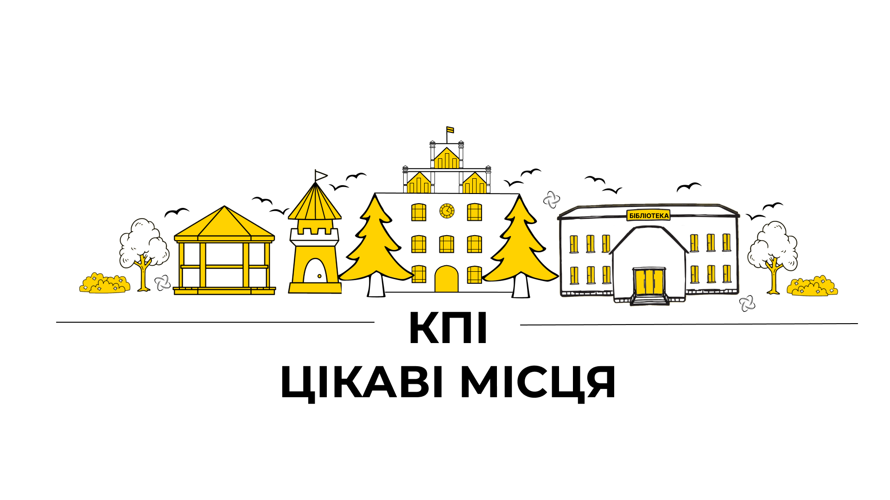

<!--truncate-->

Сусіди заважають робити лаби в гуртожитку?

Є грандіозний стартап, але ніде над ним працювати?

Хочеш відпочити душею та тілом?

У цих випадках можна втекти в студентські відкриті простори.

### Belka Space (Тимчасово зачинена)

_Розташування: [бібліотека](https://www.hashtap.com/redirect?url=https%3A%2F%2Fwww.hashtap.com%2Fredirect%3Furl%3Dhttps%253A%252F%252Fwww.google.com%252Fmaps%252Fplace%252F%2525D0%25259D%2525D0%2525B0%2525D1%252583%2525D0%2525BA%2525D0%2525BE%2525D0%2525B2%2525D0%2525BE-%2525D1%252582%2525D0%2525B5%2525D1%252585%2525D0%2525BD%2525D1%252596%2525D1%252587%2525D0%2525BD%2525D0%2525B0%252B%2525D0%2525B1i%2525D0%2525B1%2525D0%2525BBi%2525D0%2525BE%2525D1%252582%2525D0%2525B5%2525D0%2525BA%2525D0%2525B0%252B%2525D1%252596%2525D0%2525BC.%252B%2525D0%252593.%2525D0%252586.%252B%2525D0%252594%2525D0%2525B5%2525D0%2525BD%2525D0%2525B8%2525D1%252581%2525D0%2525B5%2525D0%2525BD%2525D0%2525BA%2525D0%2525B0%252F%254050.4496039%252C30.4547019%252C17z%252Fdata%253D%25214m5%25213m4%25211s0x40d4cc27dd6b8b6d%253A0xd1305aa5df55d493%25218m2%25213d50.4496039%25214d30.4564391%26strict%3D0%26redirect_token%3D60217c8ae7fe0494a0b2d129e2d5f4c93e089e66c6199e0e9de666322b179b4b9ab569b661049d565702d61d215d56d45e9c69e2d7a88cd3360417e363ed4ce8&strict=0&redirect_token=31f4b8d3099cc9f3c9c3aa49d156405575093fc248c168dc937da2248191bc14196c48fa52ae00e806e01e8b3efacaea4c6c7c896dc2a48c37c6c2961b5bfb7a)._

Відкрита платформа для студентів, де можна робити домашні завдання та лабораторні роботи. Зручні стільці й крісла-мішки, великий проєктор, маркерні дошки та навіть чай із печивом (бери свою чашку) — це гостинна та затишна Білка. Також тут проходять конференції й хакатони. До того ж, студенти КПІ можуть безкоштовно провести свій захід, попередньо узгодивши його з керівництвом. А ще про Belka Space зняли цілий [фільм](https://www.hashtap.com/redirect?url=https%3A%2F%2Fwww.hashtap.com%2Fredirect%3Furl%3Dhttps%253A%252F%252Fwww.youtube.com%252Fwatch%253Fv%253DM6H5kvmZw4Y%2526feature%253Dyoutu.be%26strict%3D0%26redirect_token%3Dc3f1fcf3d1568ddc0b769ad4e03146479ac62736e16039eb6c6b6c29e6dd74d7b418f23c89b93baa892605cc7527ab15841d40d1ad37816c5a66bb1ec1af4635&strict=0&redirect_token=7e3f85ef970c27372b55f03f87c0bf16c994d476f697870794fca862dc156ae147247795f47721cfd171a537aaeafd3a26339392d9215f39d0fb27d7916eca9c).  Із початком повномасштабного вторгнення цей простір тимчасово не працює.

Докладніше в [телеграм-каналі](https://www.hashtap.com/redirect?url=https%3A%2F%2Fwww.hashtap.com%2Fredirect%3Furl%3Dhttp%253A%252F%252Ft.me%252Fbelka_space%26strict%3D0%26redirect_token%3D2437f4d0d0f6aca0a8ade3e10ddcc49cfb78b20ebc780c638b01b02042ea2b5fa73a58c68adf9ca8124a81b69b79827b323ac43df39f8ad51137123194b915be&strict=0&redirect_token=c374104e063176c812d2b609b8cea7b7bd4b1dfd1bdf10fd4551224b7e81d51e87a8cd3645c07dfa98f059b4af58ea681a3c0a23507e9f3a4ca45afc57a2479e) платформи.

### Вежа

_Розташування: [вежа першого корпусу](https://www.hashtap.com/redirect?url=https%3A%2F%2Fwww.hashtap.com%2Fredirect%3Furl%3Dhttps%253A%252F%252Fwww.google.com%252Fmaps%252Fplace%252F%2525D0%252590%2525D1%252580%2525D1%252582-%2525D0%2525BF%2525D1%252580%2525D0%2525BE%2525D1%252581%2525D1%252582%2525D1%252596%2525D1%252580%252B%252522%2525D0%252592%2525D0%2525B5%2525D0%2525B6%2525D0%2525B0%252B%2525D0%25259A%2525D0%25259F%2525D0%252586%252522%252F%254050.4492408%252C30.4606171%252C18z%252Fdata%253D%25214m5%25213m4%25211s0x40d4ce82c46cd1e7%253A0xaa07357b8befecfb%25218m2%25213d50.4494553%25214d30.4618666%26strict%3D0%26redirect_token%3D0c73201bddec3bc2e77ab140df47a91159aa3afff6f93fcb4abdd176552e12e8d914e466ad74511bdef4098dccb41724e6e337758441a4a326083b952e047ab1&strict=0&redirect_token=7694774fcc2044708f941c1eabd64c4d68d5c8a4ecff461c47a16ad56263e271f901987ea1ce26ee4d7728267c1a8982130b9dc33f5899feeed554170abac315)._

Арт-простір для всіх охочих. Тут проводять вечори акустичної музики, джеми, перегляди фільмів та круті лекції.

Докладніше в [телеграм-каналі](https://www.hashtap.com/redirect?url=https%3A%2F%2Fwww.hashtap.com%2Fredirect%3Furl%3Dhttp%253A%252F%252Ft.me%252Fvezhakpi%26strict%3D0%26redirect_token%3D2814789dbba320649ef3763faaa5cf79dfe85dd2682491cc5e52055719cafd8149a629be1313bb34af03cc857dd7e8ae19cc4b15062916236f947df144b759f4&strict=0&redirect_token=8c49fd41774751f6760bf01612043106b62f674c4f5cb43f65ed287472ea751ed7ceaae0e6a065d71208d6ab40328703a2738e3f72a68e0a3bda9bb48789131d) арт-простору.

### Lampa

_Розташування: [бібліотека](https://www.hashtap.com/redirect?url=https%3A%2F%2Fwww.hashtap.com%2Fredirect%3Furl%3Dhttps%253A%252F%252Fwww.google.com%252Fmaps%252Fplace%252F%2525D0%25259D%2525D0%2525B0%2525D1%252583%2525D0%2525BA%2525D0%2525BE%2525D0%2525B2%2525D0%2525BE-%2525D1%252582%2525D0%2525B5%2525D1%252585%2525D0%2525BD%2525D1%252596%2525D1%252587%2525D0%2525BD%2525D0%2525B0%252B%2525D0%2525B1i%2525D0%2525B1%2525D0%2525BBi%2525D0%2525BE%2525D1%252582%2525D0%2525B5%2525D0%2525BA%2525D0%2525B0%252B%2525D1%252596%2525D0%2525BC.%252B%2525D0%252593.%2525D0%252586.%252B%2525D0%252594%2525D0%2525B5%2525D0%2525BD%2525D0%2525B8%2525D1%252581%2525D0%2525B5%2525D0%2525BD%2525D0%2525BA%2525D0%2525B0%252F%254050.4496039%252C30.4547019%252C17z%252Fdata%253D%25214m5%25213m4%25211s0x40d4cc27dd6b8b6d%253A0xd1305aa5df55d493%25218m2%25213d50.4496039%25214d30.4564391%26strict%3D0%26redirect_token%3D60217c8ae7fe0494a0b2d129e2d5f4c93e089e66c6199e0e9de666322b179b4b9ab569b661049d565702d61d215d56d45e9c69e2d7a88cd3360417e363ed4ce8&strict=0&redirect_token=31f4b8d3099cc9f3c9c3aa49d156405575093fc248c168dc937da2248191bc14196c48fa52ae00e806e01e8b3efacaea4c6c7c896dc2a48c37c6c2961b5bfb7a)._

Відкрита лабораторія електроніки для навчання, досліджень та розробок.

Докладніше в [телеграм-каналі](https://www.hashtap.com/redirect?url=https%3A%2F%2Fwww.hashtap.com%2Fredirect%3Furl%3Dhttp%253A%252F%252Ft.me%252Fkpi_lampa%26strict%3D0%26redirect_token%3D4863ca71163f7ccf014efc48e403996c0f87e3cc96973f4e6dd8c5ab1d98680634958ed17a64c2e72e2d105cac656ad7fe80eeeab5cd9c703cfd08e3fe49a297&strict=0&redirect_token=fafbf458331ee82ac5622bea54c20d22e6cb11e1e7cd4a58d562579125b99b51468ab6be232f241eefefd8650edda555c3e5b380ee0dab5839d8e8e5d6466209) лабораторії.

### КПІскала

_Розташування: [спорткомплекс КПІ](https://www.hashtap.com/redirect?url=https%3A%2F%2Fwww.hashtap.com%2Fredirect%3Furl%3Dhttps%253A%252F%252Fwww.google.com%252Fmaps%252Fplace%252F%2525D0%2525A1%2525D0%2525BA%2525D0%2525B0%2525D0%2525BB%2525D0%2525BE%2525D0%2525B4%2525D1%252580%2525D0%2525BE%2525D0%2525BC%252B%2525D0%25259A%2525D0%25259F%2525D0%252598%2525D1%252581%2525D0%2525BA%2525D0%2525B0%2525D0%2525BB%2525D0%2525B0%252F%254050.4428151%252C30.4491847%252C18z%252Fdata%253D%25214m5%25213m4%25211s0x40d4cc20711d2759%253A0x2659456eaac75775%25218m2%25213d50.442562%25214d30.4495418%26strict%3D0%26redirect_token%3Dc6524ec2c5ed6f60964ac8aad6387a2304ab134033487bee1a6d5779c2aa4fe9ca71e338315195efc2b5415e75aaed97b91b7555cc971fadc87108310f16d97c&strict=0&redirect_token=52c204a6b942ff8ba2185e41b7c0e3f48ed59b8b042550c1e019cd3a0cc535f82469445eb31437335e6466b416d4aa26b2f6372142d77caa84582b038b7a56a6)._

Для всіх охочих скелелазів у КПІ є скеледром. Тут зумієш безкоштовно потренуватися для досягнення нових висот. Якщо ти новачок, не хвилюйся — зможеш знайти тренера, який розкаже, що та як робити.

Докладніше в [телеграм-чаті](https://www.hashtap.com/redirect?url=https%3A%2F%2Fwww.hashtap.com%2Fredirect%3Furl%3Dhttps%253A%252F%252Ft.me%252Fkpiclimbing_chat%26strict%3D0%26redirect_token%3Dc0b03327be54e5860cd4d5ac52c0e0476337633d05670fbdc5b62f5565cf5d00b8ff32a5046fc959b908ba2c88b333f9e648a9a97a900beb31e9259d69e6086c&strict=0&redirect_token=4cfceb974cbb908233e2cb3ac2673e5c9fb39ae61a62bf05ea0c0383c1f8f9c0e5419e69c0568fc1b994c6642503cd661a88d35a481040c5d545b4299ef2bc69) скеледрому.

### Колізей

_Розташування: [вулиця Політехнічна](https://www.hashtap.com/redirect?url=https%3A%2F%2Fwww.hashtap.com%2Fredirect%3Furl%3Dhttps%253A%252F%252Fwww.google.com%252Fmaps%252Fplace%252F%2525D0%25259A%2525D0%2525BE%2525D0%2525BB%2525D1%252596%2525D0%2525B7%2525D0%2525B5%2525D0%2525B9%252B%2525D0%25259A%2525D0%25259F%2525D0%252586%252F%254050.4468914%252C30.4623081%252C18z%252Fdata%253D%25214m5%25213m4%25211s0x40d4ce9cc2317e59%253A0x2aca04be7f6b8a99%25218m2%25213d50.4470257%25214d30.4623916%26strict%3D0%26redirect_token%3Df73fa2b54a6fc50f584159257467354aa6d6e1debabc5cb01c415fedcb6e5e5c2da571aae5e11ae6cfae0176fd88c2dcea9d6fe9ddd5447280513f2889c99323&strict=0&redirect_token=7dd34eaf9a4afc8fc585f95b0cb9787de1a9ebb30c0e499e64fc22dcc76115cc222b1687f4a5ed205ef54566b78cb380aa1030b72e436c6171fb2c3f9f19da7d)._

Із Колізеєм асоціюються незабутні вечори кіно та аматорські концерти. Також тут є атмосферний музичний майданчик просто неба.

Докладніше в [телеграм-каналі](https://www.hashtap.com/redirect?url=https%3A%2F%2Fwww.hashtap.com%2Fredirect%3Furl%3Dhttp%253A%252F%252Ft.me%252Fcolosseumkpi%26strict%3D0%26redirect_token%3Dd42d7679dcd8a8ad26296eb7e8f3b971d810f070ff5a67247f70963718456bc80703453c7e38ca45fe296facd0802f64d045dc2d2ff16e4b8885bd18c51449ec&strict=0&redirect_token=5fbe973c18230bc9be6ab60381eb7f56d338f9cc5db6ea00056c6e3f49aff89e8959852b98cb6c0259d573cc6424ce387e545a1469d4218f3f57f8035a51cea5) простору.

### Бібліотека

_Розташування: [просп. Перемоги 37](https://www.hashtap.com/redirect?url=https%3A%2F%2Fwww.hashtap.com%2Fredirect%3Furl%3Dhttps%253A%252F%252Fwww.google.com%252Fmaps%252Fplace%252F%2525D0%25259D%2525D0%2525B0%2525D1%252583%2525D0%2525BA%2525D0%2525BE%2525D0%2525B2%2525D0%2525BE-%2525D1%252582%2525D0%2525B5%2525D1%252585%2525D0%2525BD%2525D1%252596%2525D1%252587%2525D0%2525BD%2525D0%2525B0%252B%2525D0%2525B1i%2525D0%2525B1%2525D0%2525BBi%2525D0%2525BE%2525D1%252582%2525D0%2525B5%2525D0%2525BA%2525D0%2525B0%252B%2525D1%252596%2525D0%2525BC.%252B%2525D0%252593.%2525D0%252586.%252B%2525D0%252594%2525D0%2525B5%2525D0%2525BD%2525D0%2525B8%2525D1%252581%2525D0%2525B5%2525D0%2525BD%2525D0%2525BA%2525D0%2525B0%252F%254050.4496039%252C30.4547019%252C17z%252Fdata%253D%25214m5%25213m4%25211s0x40d4cc27dd6b8b6d%253A0xd1305aa5df55d493%25218m2%25213d50.4496039%25214d30.4564391%26strict%3D0%26redirect_token%3D60217c8ae7fe0494a0b2d129e2d5f4c93e089e66c6199e0e9de666322b179b4b9ab569b661049d565702d61d215d56d45e9c69e2d7a88cd3360417e363ed4ce8&strict=0&redirect_token=31f4b8d3099cc9f3c9c3aa49d156405575093fc248c168dc937da2248191bc14196c48fa52ae00e806e01e8b3efacaea4c6c7c896dc2a48c37c6c2961b5bfb7a)._

Місце, де можна знайти не лише потрібну літературу, але й простір для роботи в групі та наодинці. Безкоштовний Wi-Fi і доступні розетки допоможуть провести час у бібліотеці максимально продуктивно. Студенти, що живуть у гуртожитку, оцінять зручність підготовки до сесії в тихій атмосфері книгозбірні.

Найцікавіше в згаданих місцях — історія їхнього створення. Багато з цих проєктів були започатковані з ініціативи студентів КПІ. Вони розробили концепції, організували збір коштів та втілили свої ідеї в життя.

Докладніше в [телеграм-каналі](https://t.me/kpi_library) бібліотеки.

### Сквер «Сосновий»

_Розташування: [просп. Перемоги 37](https://goo.gl/maps/kW7wfZfcV36Ph4PUA)._

Зрозуміло з назви, що головна перлина скверу – сосновий гай, який надає приємну свіжість та аромат. Легкий шелест вітру в гілках та прохолода їхньої тіні створюють ідеальну атмосферу для відпочинку в спекотні дні.

Сквер «Сосновий» – це ідеальне місце для літнього проведення часу. Тут ти знайдеш велику кількість затишних лавок, де зможеш відпочити, почитати улюблену книжку, пограти в настільні ігри з друзями чи просто насолодитися природою.

### Площа знань

_Розташування: [Навпроти бібліотеки.](https://goo.gl/maps/GSbJ4pYZ5jMkXGn2A)_

Ця простора та красива площа знаходиться прямо навпроти бібліотеки. Вона створює неймовірний настрій для спілкування, навчання та святкування. Саме на Площі знань відбуваються різноманітні заходи, які додають студентам купу життєрадісних спогадів, пов’язаних із цим місцем.

Одним із найбільш пам’ятних моментів для кожного ІПСАшника є святкування Дня першокурсника. Це особлива нагода, коли на Площі знань збирається велика кількість першокурсників, щоб разом відчути неймовірну енергію інституту та пережити початок нового етапу в житті. Сміх, радість та веселощі наповнюють повітря, а кричалки студентів стають гучним доказом їхнього відчуття єдності.

### Парк КПІ

_Розташування: [Навпроти першого корпусу](https://goo.gl/maps/xZ7EBjMUyM1QccnH8)._

Цей парк є справжнім оазисом серед міського шуму. Він вражає своєю величезною територією та дозволяє тобі насолодитися прогулянками затишними стежками й зеленими галявинами. Неперевершена краса природи наповнює це місце магічною атмосферою.

Особливо цікавою подією, що тут відбувається, є основна частина Дня першокурсника ІПСА. Саме навпроти першого корпусу молоді студенти збираються, щоб ознаменувати свій перший день університетського життя. 

Але це ще не все! Якщо стане сумно самотньо прогулюватися парком, то тобі неодмінно зустрінуться милі білочки, які перебігають із дерева на дерево. Вони підбадьорюють відвідувачів та, безсумнівно, є справжніми символами парку.

### Альтанки

_Розташування: [Прямо за 7 гуртожитком](https://goo.gl/maps/Kdr8311BPJru5UWV9)._

Такий затишний куточок став справжнім магнітом для студентів, де вони збираються, щоб провести час разом. Це ідеальне місце для спілкування, обговорення новин та обміну враженнями й планами. Багато студентів приносять сюди свої гітари та створюють незабутні концерти, що поєднують у собі гармонію вокального й інструментального супроводів (або просто надокучають людям із відчиненими вікнами).

### Поляна

_Розташування: [Вул. Політехнічна](https://goo.gl/maps/5KGqbMRmBpg4ZkjbA)._

Нарешті дійшли до найцікавішого. Поляна – це особливе місце на території КПІ, яке має офіційну назву «Сквер імені Олени Теліги». Кожні вихідні студенти збираються тут, щоб відпочити від робочих буднів. 

У цьому сквері є дещо дуже цікаве – велика куля, розташована в центрі. Вона неодноразово відкріплялася від свого місця й котилася в невідомому напрямку, залишаючи допитливих студентів зі здогадками про її місцезнаходження.

Але, безсумнівно, одним із найцікавіших моментів, пов'язаних із Поляною, є традиція, що передається з покоління в покоління. Щороку на День першокурсника студенти збираються та налаштовують свою вдачу на наступний навчальний рік. І як вони це роблять? Авжеж закидають магазинні візки на дерева. Цей ритуал символізує прагнення до успіху та позитивних змін у майбутньому (або просто п’яні розваги).

### Мапа студмістечка КПІ

Настав час представити шедевр дизайнерського мистецтва! 

Просимо:

Ходять легенди, що якщо пройти весь маршрут від метро до поляни, то ви зможете знайти скарб! Отож, скоріше виходьте із сірих і депресивних домівок та відправляйтеся назустріч невідомому! (хоча якщо ви прочитали всю статтю, то не такі ці місця вже й невідомі)

