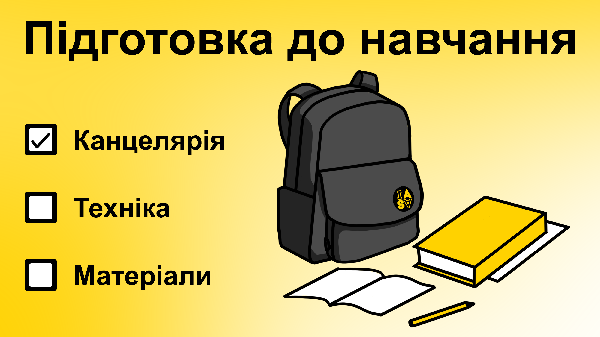
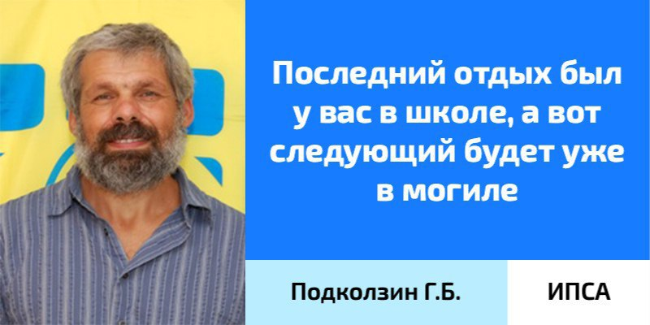

<!--truncate-->

Вступна кампанія триває, згодом будуть подаватися заявки, а це означає одне: незабаром розпочнеться твоє навчання в ІПСА. Тому пропонуємо взятися за голову вже зараз, аби не гаяти час.

### Канцелярія

Перед початком навчального року слід запастися різноманітною канцелярією (_прим. ред. Поки не небесною_), щоб конспекти були не тільки естетичними, а й зручними. В університеті майже всі пари поділяються на лекції та практики. У реаліях дистанційного навчання вся необхідна макулатура буде поряд.

Надаємо умовний набір першачка:

+ 8 зошитів на 96 аркушів у клітинку (краще А4) для  математичного аналізу, лінійної алгебри та аналітичної геометрії, дискретної математики, фізики.

+ 2-3 зошити А5 на 12-24 аркуші для тестів, розрахункових, лабораторних, екзаменів і заліків.

+ Під час виконання завдань з української мови / риторики та програмування знадобиться Microsoft Word чи Google Документи для оформлення протоколів.

Більшість викладачів дозволяють ведення електронних конспектів, тому рекомендуємо такі програми для користувачів iPad і гаджетів інших компаній відповідно:

+ GoodNotes5, Pages, Penbook.

+ Samsung Notes, Penly, OneNote, Google Keep.

### Ноутбук

Оскільки під час навчання доведеться неодноразово захищати лабораторні й курсові роботи, бажано мати власний ноутбук. Звісно, можна ділити його з кимось, але в умовах активного виконання завдань буде складно відірватися хоч на хвилину. 

Отже, якщо ухвалено рішення здійснити інвестицію в комфортне навчання, обирай виробника та модель, яких душа забажає, але рекомендуємо звернути увагу на наші поради.

+ ROM: SSD або HDD 512+ GB.

+ RAM: 16+ GB DDR4.

+ Display: IPS або OLED.

+ CPU: коли вибираєш Intel — core i5 10 покоління й новіше, Ryzen — мінімум 5 4000 покоління. Додамо, що зазвичай процесори Intel є дещо менш енергоефективними.

+ OS

  + Windows / Linux подекуди виграє через наявність або можливість встановлення необхідного програмного забезпечення.

  + Якщо ти користувач MacOS, то незручності можуть виникнути лише раз на рік і вирішитися з допомогою одногрупників чи за домовленістю з викладачем.

Наголошуємо, що ці характеристики є лише порадами. Виконувати лабораторні або інші завдання некритично й на слабшому ноутбуці.

### Знання

Уже зараз ти можеш подбати про себе майбутнього, аби без проблем адаптуватися до ритму ІПСА.

**P.S.** За миготливої аритмії значно підвищується ризик тромбозу.

#### Вчи, синку, матчастину:

+ Вектори.

+ Тригонометрія.

+ Арифметичні дії з дійсними числами.

+ Квадратні рівняння.

+ Дільники та кратні. Розклад числа на прості множники.

+ Комбінаторика.

#### Перші кроки у світ програмування:

+ Розуміння загальних ідей — [Youtube](https://youtube.com/playlist?list=PLhQjrBD2T380F_inVRXMIHCqLaNUd7bN4), [Edx course](https://www.edx.org/course/introduction-computer-science-harvardx-cs50x).

+ Здобути скіл алгоритмічного мислення: [Grokking algorithms](https://edu.anarcho-copy.org/Algorithm/grokking-algorithms-illustrated-programmers-curious.pdf).

Вищеперерахованого задосить, аби спростити собі життя на старті. Для охочих якнайшвидше залізти в [цукрове](https://uk.wikipedia.org/wiki/%D0%A1%D0%B8%D0%BD%D1%82%D0%B0%D0%BA%D1%81%D0%B8%D1%87%D0%BD%D0%B8%D0%B9_%D1%86%D1%83%D0%BA%D0%BE%D1%80) пекло плюсів: 

+ [З чого почати?](https://code.visualstudio.com/docs/languages/cpp)

+ [C++ Tutorial for Beginners](https://www.youtube.com/watch?v=vLnPwxZdW4Y).

+ [C++ Full course for Beginners](https://www.youtube.com/watch?v=GQp1zzTwrIg) (10 годин).

+ [Курс на Coursera](https://www.coursera.org/programs/igor-sikorsky-kyiv-polytechnic-institute-on-coursera-1uynq/specializations/coding-for-everyone).

+ [FreeCodeCamp](https://www.freecodecamp.org/).

### Накопичуємо ману

Найкращі неземні варіанти відпочинку?!?!?!

+ Зробити огляд на свою родину в [IASA ABIT flood](https://t.me/abitiasa_flood).

+ Подивитися весь кіновсесвіт Раяна Гослінга (Барбі теж враховується).

+ Загубитися в Рівному (класика – 100).

+ Поспати (наступного разу це вийде не скоро).

**Проведи останні місяці канікул із користю!**

