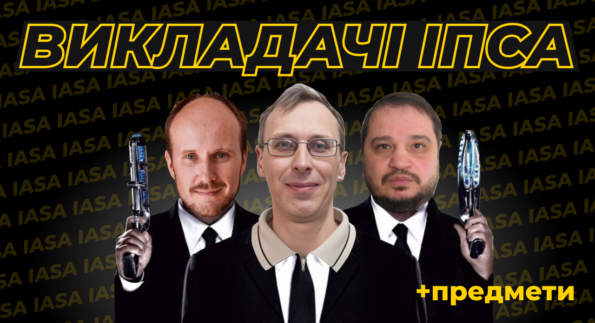

## «Not the faculty but His Excellency the General can properly determine the sum of two and two.»

## Hermann Hesse

<!--truncate-->

Дисклеймер: усі описи й інфографіки сформовані в результаті опитування студентів і випускників. Докладніше на [IASA Analytics](https://t.me/iasa_analytics).

Нотатки авторів: Нижче наведено road map освітніх програм (наполегливо рекомендуємо їх переглянути). Далі все як у людей: просто гортай вниз. Для кожної дисципліни вказано ймовірних викладачів, одразу після опису предмета ознайомся з кожним із них (конче треба, правда). 

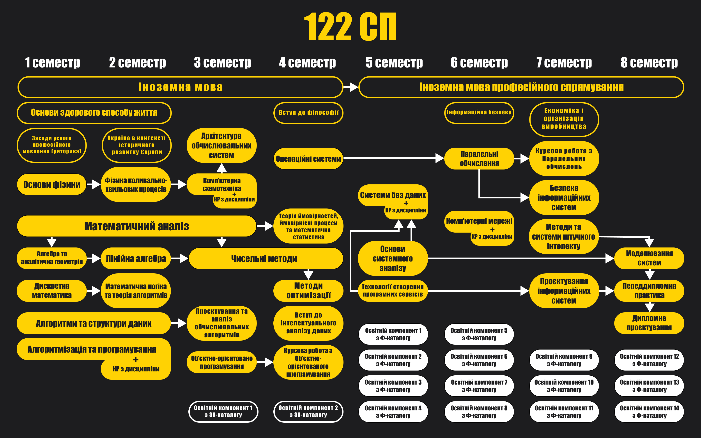

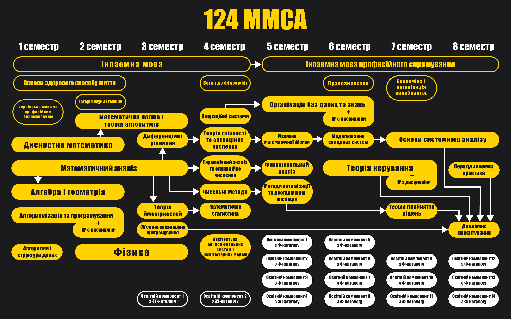

## Предмети:

### Математичний і гармонічний аналіз

#### Викладачі: 

Цьогорічний стак:
+ ММСА: [Чаповський Ю.А.](https://wannacat.org/adopt/), [Попова Н.Д.](https://wannacat.org/adopt/)
+ ШІ: [Рябов Г.В.](https://wannacat.org/adopt/), [Мінарченко О.М.](https://wannacat.org/adopt/)
+ СП: [Бохонов Ю.Є](https://wannacat.org/adopt/), [Мінарченко О.М.](https://wannacat.org/adopt/)
Можливий розвиток подій: [Денисьєвський М.О.](https://wannacat.org/adopt/), [Руденко О.В.](https://wannacat.org/adopt/), [Номіровський Д.А.](https://wannacat.org/adopt/), [Мальцев А.Ю](https://wannacat.org/adopt/), [Семенов В.В.](https://wannacat.org/adopt/), [Подколзін Г.Б.](https://wannacat.org/adopt/)

**Про що предмет:** 

+ Диференціальний аналіз: вивчення та застосування похідних.

+ Інтегральний аналіз: розгляд визначених, невизначених й інших варіацій інтегралів, їхнє застосування.

+ Послідовності: числові та функціональні, обчислення границь (лімітів).

+ Ряди: числові та функціональні нескінченні суми.

+ Диференціальні рівняння: фактично, звичайне рівняння, яке включає похідні та передбачає пошук функції, а не числа.

+ Комплексний аналіз: розгляд функцій комплексної змінної (там, де i = -1).

+ Гармонічний аналіз: представлення функцій у вигляді тригонометричних рядів й інтегралів.

**Особливості викладання:** Фундаментальність дисципліни передбачає відповідну вимогливість викладачів. Системні аналітики вивчають предмет протягом чотирьох семестрів, спеціалісти 122 ШІ опрацьовують матеріал швидше, адже до нього додаються деякі теми функціонального аналізу, що на 124 є окремим предметом. Студенти 122 СП, зі свого боку, обмежуються трьома семестрами. На обох спеціальностях кожне півріччя навчання завершується складанням іспиту.

**Приклади застосування:** Диференціальне числення активно використовується в моделюванні фінансових ринків, управлінні ризиками й економічних процесах. Ряд Тейлора забезпечує обчислення ірраціональних виразів із будь-якою точністю. Перетворення Фур'є застосовується для аналізу й обробки зображень, надає змогу виявляти просторові частоти, фільтрувати шум, знаходити ребра та границі, виконувати компресію зображень й інші операції. Більше прикладів за посиланням.

### Лінійна алгебра та аналітична геометрія

#### Викладачі: 

Цьогорічний стак:

+ ММСА: [Подколзін Г.Б.](https://wannacat.org/adopt/), [Мальцев А.Ю.](https://wannacat.org/adopt/), [Сисак К.Я.](https://wannacat.org/adopt/)

+ ШІ: [Барановська Л.В.](https://wannacat.org/adopt/), [Сисак К.Я.](https://wannacat.org/adopt/)

+ СП: [Бохонов Ю.Є](https://wannacat.org/adopt/), [Мінарченко О.М.](https://wannacat.org/adopt/)

Можливий розвиток подій: не можемо передбачити ще когось, окрім вище згаданих.

**Про що предмет:**

+ Аналітична геометрія: представлення геометричних об'єктів (точок, ліній та фігур) за допомогою рівнянь і формул (опис залежностей координат), що дає змогу використовувати алгебраїчні методи для розв'язання геометричних задач.

+ Лінійні, унітарні й евклідові простори: множини будь-яких елементів та операцій, що є розширенням до вже відомих зі школи дій над векторами (додавання, множення на константу, скалярне множення (унітарні) та модуль (евклідові)).

+ Матриці: таблиці / масиви чисел. Матриці лінійних операторів (функції над об’єктами вищеописаних просторів зі збереженням їхніх властивостей у множині значень).

**Особливості викладання:** «It is my experience that proofs involving matrices can be shortened by 50 if one throws the matrices out», — Еміль Артін. Вітаю, це вже друга дисципліна в стартер-паці маминого розумника. На обох спеціальностях предмет викладають протягом першого курсу, передбачено іспит.

**Приклади застосування:** Лінійна алгебра є основою багатьох алгоритмів машинного навчання (робот-андроїд, штучний інтелект): лінійна регресія, метод головних компонент, метод опорних векторів та інші. Використовується для обчислення векторних операцій, знаходження оптимальних рішень і моделювання даних.

### Дискретна математика

#### Викладачі: 

Цьогорічний стак:

+ ММСА: [Спекторський І.Я.](https://wannacat.org/adopt/), [Статкевич В.М.](https://wannacat.org/adopt/)

+ ШІ: [Стусь О.В.](https://wannacat.org/adopt/)

+ СП: [Статкевич В.М.](https://wannacat.org/adopt/)

Можливий розвиток подій: [Моклячук О.М.](https://wannacat.org/adopt/)

**Про що предмет:**

+ Алгебра висловлювань.

+ Множини, їхні властивості й операції над ними.

+ Графи — множини з'єднаних ребрами вершин.

+ Комбінаторика: перестановки, комбінації, розміщення, які виникають у задачах лічби та вибірки.

+ Відношення — зв'язок між елементами двох множин. Можуть бути представлені за допомогою множини пар, матриці або графа.

+ Групи та кільця: множини разом з операціями на кшталт додавання (групи), додавання та множення (кільця).

**Особливості викладання:** Мабуть, найпростіша з математичних дисциплін першого курсу. На 122 предмет вивчають один семестр, на 124 — два, з іспитом після першого, що зумовлено більш поглибленим опрацюванням деяких тем і додатковим розгляданням булевих алгебр, кардинальних й ординальних чисел.

**Приклади застосування:** Дискретна математика є основою для розробки алгоритмів, структур даних і комп'ютерних систем. Також використовується для аналізу пропускної здатності, ефективності та безпеки мереж.

### Математична логіка
#### Викладачі: 

Цьогорічний стак:

+ ММСА: Спекторський І.Я., Статкевич В.М.

+ ШІ: Стусь О.В.

+ СП: Статкевич В.М.

Можливий розвиток подій: не можемо передбачити ще когось, окрім вище згаданих.

**Про що предмет:**

+ Абстрактні алгоритмічні машини — моделі теоретичних комп'ютерів, що не претендують на відповідність справжнім комп'ютерам або технічним реаліям, зосереджуються на моделюванні основних можливостей обчислень. Розглядаються машина Тюрінга, нормальний алгоритм Маркова та блок-схема Поста.

+ Рекурсивні функції: представлення будь-яких функцій за допомогою композиції та рекурсії базових функцій.

+ Формальні граматики — математичний інструмент для опису структури мови. Визначає правила, за якими можна утворити коректні вирази, речення або текст із множини символів. Допомагають описувати мови програмування, обробки даних й інші мовні конструкції.

+ Абстрактні автомати — інструмент дуже схожий на алгоритмічні машини. Використовується для моделювання роботи програм у комп'ютерах, процесах у природних системах тощо. Допомагають вивчати як системи взаємодіють із навколишнім середовищем, як вони реагують на різні вхідні сигнали.

**Особливості викладання:** Ситуація аналогічна до дискретної математики. На 122 вивчають один семестр, а на 124 — два, через поглиблене вивчення рекурсивних функцій і додатковий розгляд мереж Петрі.

**Приклади застосування:** У математичній логіці розвиваються формальні методи для представлення знань, розв'язання проблем і прийняття рішень у штучному інтелекті. Застосовується для формалізації логічного мислення, побудови експертних систем, моделювання розумових процесів і розв'язання складних завдань машинного навчання.

### Програмування

#### Викладачі: 

Цьогорічний стак:

+ ММСА: Назарчук І.В., Просянкіна-Жарова Т.І., Савченко І.О., Селін Ю. М.

+ ШІ: Романов В.В., Безносик О.В., Просянкіна-Жарова Т.І.

+ СП: Романов В.В., Безносик О.В.

Можливий розвиток подій: не можемо передбачити ще когось, окрім вище згаданих.

**Про що предмет:**

+ Базові ідеї програмування.

+ Синтаксис мов С / С++ й основні конструкції: масиви, функції, вказівники, структури даних, робота з пам’яттю, рекурсія та графічні можливості.

+ Створення та використання бібліотек. 

+ Введення в об’єктно-орієнтоване програмування.

**Особливості викладання:** На 124 програмування вивчається більш поверхнево в порівнянні зі 122. У першому семестрі системні аналітики пишуть екзамен із цього предмету (у Комп’ютерних наук — залік). У другому півріччі студенти складають залік і пишуть курсову роботу незалежно від спеціальності.

### Алгоритми та структури даних

#### Викладачі:

Цьогорічний стак:

+ ММСА: Селін Ю.М., Севастьянов В. В.

+ ШІ: Малишевський О.Г., Куб’юк Є.Ю,

+ СП: Клещ К.О., Яковчук О.К.

Можливий розвиток подій: не можемо передбачити ще когось, окрім вище згаданих.

**Про що предмет:** 

+ Ефективність і дизайн алгоритмів.

+ Розгляд найпростіших структур даних: стек, черга, зв’язні списки, дерева, купа, черга з пріоритетом і хеш-таблиця. 

+ Алгоритми сортування: вставка, бульбашка, вибір, злиття, купа.

+ Алгоритми пошуку: лінійний, бінарний, тернарний, інтерполяція, золотий перетин.

+ Рекуренції, дерева пошуку. Динамічне програмування та алгоритми (жадібні, паралельні, на графах).

**Особливості викладання:** Найкращий курс АСД на катедрі СП. Попри низьку якість проведення пар на ШІ, матеріал усе ще на рівні. На 124, вважай, цього предмету не існує: він викладається цілий семестр, протягом якого достатньо виконати 4 лабораторні.

**Приклади застосування:** Алгоритми та структури даних є основою розробки програмного забезпечення. Вони використовуються для розв'язання задач сортування, пошуку, оптимізації, обробки даних і створення графічного інтерфейсу користувача.

### Фізика

#### Викладачі:

Традиційний стак:

+ ММСА: Снарський А.О., Федотов В.В.

+ ШІ: Калита В.М., Гусева Ю.І., Іванова І.М.

+ СП: Калита В.М., Іванова І.М.

**Про що предмет:**

+ Основні закони руху та збереження в механіці. 

+ Стаціонарний електричний струм, рівняння електромагнітного поля. 

+ Механічні, електромагнітні коливання та хвилі.

**Особливості викладання:** Не основний предмет — вимоги викладачів відповідні. Уряди-годи важко закрити без докладання зусиль (привіт лабораторним на 122). У будь-якому разі хоронити себе за браком шкільної бази не варто: навчання починається майже з нуля.

### Теорія ймовірностей і математична статистика

#### Викладачі:

Можливий розвиток подій: 

+ ММСА: Василик О.І., Каніовська І. Ю., Самойленко І.В., Пилипенко А.Ю.
+ ШІ: Ільєнко А.Б., Голіченко І.І., Павленков В.В.
+ СП: Бондарчук С.В.

**Про що предмет:** 

Основи теорії ймовірностей: формалізація шкільних знань.

+ Випадкові величини (результати випадкових експериментів, значення та ймовірності їхнього набуття), вектори, функції від них. 

+ Граничні теореми: закон великих чисел, центральна гранична теорема, збіжність послідовності випадкових величин, її види.

+ Точкові статистичні оцінки — приблизне числове значення невідомого параметра сукупності на основі вибірки. 

+ Довірчі інтервали — те ж оцінювання, проте з урахуванням точності результату. 

+ Перевірка статистичних гіпотез.

**Особливості викладання:** Є базовою дисципліною аналізу даних, проте годин на неї виділяють мало: на 124 і 122 ШІ два семестри в середньому по 3 год на тиждень, 122 СП балує одним семестром по 4 години. Будьте готові до додаткових пар і великої кількості домашнього завдання. Курс теорії ймовірностей для обох спеціальностей завершується складанням іспиту.

**Приклади застосування:** Математична статистика забезпечує розробку статистичних методів навчання: дерев рішень, лінійної та логістичної регресії. Дає змогу оцінити параметри моделі, провести перевірку гіпотез, виявити статистичну значущість та виконати вибір моделі.

### Об'єктно-орієнтоване програмування

#### Викладачі:

Можливий розвиток подій: 

+ ММСА: Древаль М.М.

+ ШІ: Пишнограєв І.О.

+ СП: Булах Б.В., Мироненко С.С.

**Про що предмет:** 

+ Базові принципи об'єктно-орієнтованого й узагальненого програмування, їхня реалізація засобами мови C++ або Java. 

+ Розгляд основних аспектів розробки програмних застосунків.

**Особливості викладання:** Предмет вирізняється відносно молодими викладачами, це зазвичай тягне за собою актуальні матеріали й адекватне ставлення до студентів. Завершивши вивчення, необхідно написати курсову роботу.

### Обчислювальна математика (Чисельні методи)

#### Викладачі: 

Можливий розвиток подій: 

+ ММСА: Дмитрієва О.А.

+ ШІ: Дмитрієва О.А., Шубенкова І.А.

+ СП: Петренко А.І., Вербицький Є.В., Бритов О.А.

**Про що предмет:** 

+ Точні та наближені методи розв’язання систем лінійних і нелінійних алгебраїчних рівнянь.

+ Чисельне обчислення власних значень та векторів матриць. 

+ Інтерполяція й наближення функцій.

+ Чисельне диференціювання, інтегрування та розв’язання диференціальних рівнянь.

**Особливості викладання:** Предмет супроводжується гаслом «Ми не на математичній спеціальності», тому зазвичай очікувати чітких теоретичних обґрунтувань не варто. Передбачено іспит.

**Приклади застосування:** Моделювання та симуляція фізичних явищ: рух планет, поведінка рідин і газів, електромагнітні поля та ін. З більш конкретного — проєктне знесення вежі АЕС Філіпсбурга в 2020 році. Протягом 4 років вираховувалося місце закладання вибухівки заради уникнення жертв і неповного руйнування (додаткові витрати). 

### Архітектура обчислювальних систем і комп'ютерних мереж (Схемотехніка)

#### Викладачі:

Можливий розвиток подій: 

+ ММСА: Коваленко А.Є., Тимошенко Ю.О.

+ ШІ: Коваленко А.Є., Тимошенко Ю.О.

+ СП: Стіканов В.Ю., Артюхов В.Г., Кирюша Б.А., Бритов О.А., Гіоргізова-Гай В.Ш.

**Про що предмет:**

+ Принципи побудови сучасних, великих і надвеликих інтегральних схем (процесор у комп’ютері, схоже, великий). 

+ Організація комп’ютерних процесорів, пристроїв введення-виведення та запам’ятовування.

+ Принципи роботи, структури й програмні засоби автоматизації проєктування схем.

**Особливості викладання:** Предмет вважається найскладнішим за весь час навчання на 122 СП (найімовірніше, це суто через викладача). На 124 і 122 ШІ дисципліна успішно виправдовує статус другорядної. 

**Приклади застосування:** Проєктування та розробка інтегральних схем, таких, як мікропроцесори, мікросхеми пам'яті, логічні вентилі й інші електронні компоненти. Створення та оптимізація розміщення компонентів і трас з'єднання, моделювання та верифікація пристрою перед фабрикацією.

_P.S. Почитай про архітектуру процесорів._

### Операційні системи

#### Викладачі: 

Можливий розвиток подій: 

+ ММСА: Коваленко А.Є.

+ ШІ: Коваленко А.Є.

+ СП: Безносик О.Ю., Круш І.В.

**Про що предмет:** 

+ Принципи побудови й архітектури операційних систем. 

+ Керування ресурсами комп’ютера, системне програмування.

+ Організація процесів, планування, розподілення та виконання робіт в обчислювальних системах.

**Особливості викладання:** Дисципліна здебільшого про bash, що в комбінації з ненаймолодшими викладачами робить предмет майже непотрібним (перекривається мінімальними курсами). Отримати 60+ можна, написавши декілька лабораторних і модульну контрольну.

### Диференціальні рівняння, теорія стійкості та варіаційне числення (тільки ММСА)

#### Викладачі: 

Можливий розвиток подій:

Горбань Н.В., Капустян О. В. 

Про що предмет: 

+ Диференціальні рівняння першого (винятково перша похідна) та вищих порядків.

+ Вступ до систем диференціальних рівнянь. 

+ Теорії стійкості, що вивчає реакцію систем на невеликі відхилення від початкового стану: зберігається стійкість чи збільшується амплітуда коливань.

+ Варіаційне числення: пошук функцій, що задовольняють екстремум заданого виразу. Наприклад, задача Дідони та пошук брахістохрони.

**Особливості викладання:** Актуальність предмету й цікавий матеріал другого семестру витягують враження, особливо після задушливого першого півріччя.

**Приклади застосування:** Принцип Маупертаура — задача варіаційного числення, що полягає в знаходженні форми тонкої металевої пластини, яка має мінімальну енергію деформації за заданих граничних умовах. Теорія стійкості допомагає визначити стійкість конструкцій, механізмів під час руху, деформацій і зовнішніх впливів.

### Вступ до інтелектуального аналізу даних

#### Викладачі: 

Можливий розвиток подій: 

+ ШІ: Терентьєв О.М.

+ СП: Іщенко Г.В., Сергеєв-Горчинський О.О.

**Про що предмет:**

+ Основні поняття, задачі та стадії інтелектуального аналізу даних.

+ Сучасні способи зберігання даних.

+ Аналіз залежностей у даних: кластеризація, класифікація, регресія, сиквенційний.

**Особливості викладання:** На 122 розглядають лише основи основ, не більше. Лекції супроводжуються лабораторними роботами, що повільно, але впевнено актуалізують матеріал. Системним аналітикам пощастило трохи більше: предмет є вибірковим і зазвичай викладається набагато краще.

**Приклади застосування:** Створення систем, які пропонують персоналізовані рекомендації користувачам на основі їхніх попередніх дій, уподобань та характеристик. Аналіз текстових даних, включно з обробкою природної мови, систематизацією документів і виявленням емоцій. Опрацювання зображень та задачі комп'ютерного зору: розпізнавання образів, виявлення об'єктів, класифікація образів.

### Системи баз даних

#### Викладачі: 

Можливий розвиток подій: 

+ ШІ: Єфремов К.В..

**Про що предмет:** 

+ Реляційні алгебра й моделі даних — це про організацію даних у таблиці, зв’язки між ними.

+ Проєктування баз даних.

**Особливості викладання:** Необхідний матеріал для професійної діяльності аналітика (вчити треба, будь ласка, реально). У контексті ІПСА, це типовий предмет про виконання лабораторних робіт, що часто можна замінити деякими курсами.

### Методи оптимізації

**Викладачі:** Чкалов О.В.

**Про що предмет:** 

+ Елементи опуклого аналізу: розв’язання задач оптимізації через знаходження екстремумів функції, використовуючи властивості опуклості (це коли будь-яка пряма лінія, яка з'єднує дві точки в області, лежить повністю всередині цієї області).

+ Критерії оптимальності в задачах нелінійного програмування: та сама задача, проте з урахуванням певних обмежень.

+ Методи одновимірного пошуку екстремуму: знаходження найкращого значення функції за допомогою просування вздовж осі або на певному діапазоні.

+ Умовна та безумовна багатопараметричні оптимізації: на кшталт описаного вище, але для функцій декількох змінних.

**Особливості викладання:** У деякому розумінні продовження курсів обчислювальної математики й АСД зі збереженням усіх недоліків: предмет закривається написанням декількох лабораторних.

**Приклади застосування:** Еволюційні алгоритми, що є методом оптимізації, який імітує природний еволюційний процес для знаходження оптимального розв’язку. Містять використання генетичних алгоритмів, програмування й інших підходів.

_P.S. Наступні два роки навчання здебільшого складаються з вибіркових предметів. Докладніше за посиланнями:_

+ 3 курс: ММСА, ШІ, СП.

+ 4 курс: ММСА, ШІ, СП.

## Викладачі: 

### [Бохонов Юрій Євгенович](https://teletype.in/@iasa_sc/rkOQp7agB)
 

<i>Викладач як лектор</i>

<i>Викладач як практик</i>

**Дисципліни:** математичний аналіз, лінійна алгебра та аналітична геометрія.

**Нотатки виживших:**

_«Ю.Є. — справжній ювелір своєї справи. Лекції та практики проходили у форматі діалогу, що беззаперечно додавало мотивації працювати. Потужна варіативність методів і підходів до одного й того ж завдання, що часто згадували студенти, розв'язуючи на контрольній / розрахунковій завдання по-Бохоновськи, згідно з вимогами. Одне, що засмучувало, — це листок і ручка, що були основним знаряддям Юрія Євгеновича»._

_«Зарозумілий дідуля, якого супер просто закрити, але він буде неймовірно душити. Нікого не відраховує, бо боїться, що виросте 2-ий Гітлер (народна прикмета). Любить Ріхтера та класичну музику»._

_«Він один із тих, хто не просто читає і йде, а той, хто викладається на повну на парах. Проте не все так добре. Викладач занадто вимогливий і водночас дуже не любить, коли хтось тупить. Прям дуже не любить, тому багатьох називає двієчниками. Спочатку він говорить серйозно, а потім, на другому курсі, це перетворюється на жарт. Але в нього дійсно можна навчитися, бо він аж муштрує. І пише свої методички, за якими й веде лекції. Він може 100 разів сказати, що ви двієчники й нічого не вмієте, але він і 200 разів повторить, і буде проводити 100500 консультацій у позанавчальний час, аби ви все зрозуміли»._

_«Юрій Євгенович був як сонце в хмарний день, це були одні з небагатьох пар, які хотілося відвідувати. Звісно, більшості не подобався стиль його взаємодії зі студентами, але я б сама навряд чи відреагувала спокійно, якщо 2 курс ІПСА не може відповісти, що таке Якобіан... На лекціях не вистачило доведень теорем, але у зв'язку з воєнним станом, нам довелося пройти більше матеріалу за короткий термін, тому це було виправдано. Викладач любить «гарні / красиві» задачі, над якими треба подумати»._

### [Подколзін Гліб Борисович](https://teletype.in/@iasa_sc/rJWiKGCYH)

**Дисципліни:** математичний аналіз, лінійна алгебра та аналітична геометрія.

**Нотатки виживших:**

_«Хороший викладач, приємно з ним працювати, дає інформацію в зручних пдф конспектах та проводить непогані пари з наданням запису опісля. Таке відчуття, що досить зацікавлений, і роботи перевіряє швидко. Іноді, має недоречні наїзди на людей, але я схильний списувати їх на його зайнятість»._

_«Єдиний викладач, який під час дистанційного навчання самостійно їздив до корпусу заради нас, щоб писати на дошці та транслювати зображення. Це було схоже на симулятор «реальних занять», повне занурення з автентичним звуковим супроводом постукування крейди по дошці, не виходячи з дому._

_Він чудово подавав матеріал, і будь-якої миті можна було уточнити незрозумілі деталі та попросити про проведення консультації, для чого також приїздив до корпусу. У позанавчальний час запитання з предмету можна було ставити через електронну пошту. Хоча був обраний не найзручніший засіб зв'язку, через який зазвичай важко проводити оперативну переписку, оскільки відсутні сповіщення, як у тому ж Telegram, проте Гліб Борисович завжди відповідав на повідомлення, причому робив це вкрай швидко, що нівелірувало недолік пошти»._

_«Ну, братанчик неймовірний. Проводив заняття з авдиторії, за низької якості трансляції, можна приходити очно — було взагалі чудно. Формат файлів із конспектами не зайшов, сильно розслаблював, як на мене, тому закінчення 2 семестра пройшла трохи повз. Завжди готовий допомогти, пояснити; намагається ввійти в положення студентів, м’яко ставиться до пропусків дедлайнів»._

### Денисьєвський Микола Олексійович

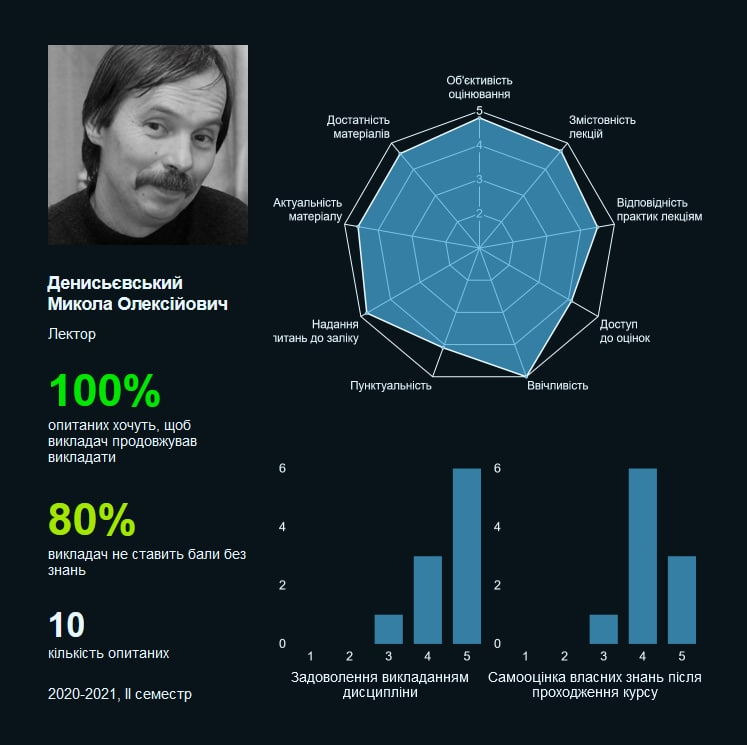

**Дисципліни:** математичний аналіз, лінійна алгебра та аналітична геометрія.

**Нотатки виживших:**

_«Як лектор: дуже спокійний викладач, який пише на листочку, паралельно коментуючи ультра спокійним голосом. Матеріал доступний і зрозумілий. На виході матимете потужний конспект. _

_Як практик подобається менше. Оскільки дає, як на мене, надто малу кількість завдань (хоча це обґрунтовано його власноруч створеним навчальним планом) і не надто охоче пояснює. На парі зазвичай нікого не питає. Просто собі пише на листочку і все. Дає домашні завдання з аналогічними задачами»._

_«Нормальна швидкість викладення, яка влаштовує всіх. Є матеріали, як в електронному, так і письмовому варіантах, причому вони не ідентичні, є деякі власні доповнення та зауваження, ну й іноді а-ля лайфхаки»._

_«Доволі довго перевіряв роботи й не виставляв бали в класрум. У кампусі бали були аж наприкінці семестру. Хоча це перекривається прекрасним викладанням і детальним поясненням матеріалу»._

_«Гарний викладач, трохи пофігіст: він не збирається бігати за студентом, якщо той не прийшов на практику. Може й буде працювати як з повною авдиторією, так і з 2-5 людьми, проте треба проявляти активність. Тих, хто займається своїми справами, не чіпає взагалі. _

_На початку кожної практики, за 5-7 хвилин, любить повторити коротко теоретичний матеріал, необхідний для сьогоднішнього заняття._

_На дистанційному постійно проводив практики в Скайпі на камеру, використовуючи листок і ручку. Напевно, найбільш регулярні практики в онлайн форматі серед усіх дисциплін»._

_«Завжди готовий відповісти на всі запитання і розібрати все декілька разів. Був випадок, коли він провів для нашої групи консультацію прямо під час екзамену для того, щоб допомогти із завданням, яке дав нам наш практик»._

### [Мальцев Антон Юрійович](https://freemusicarchive.org/music/Maltsev_Anton/)

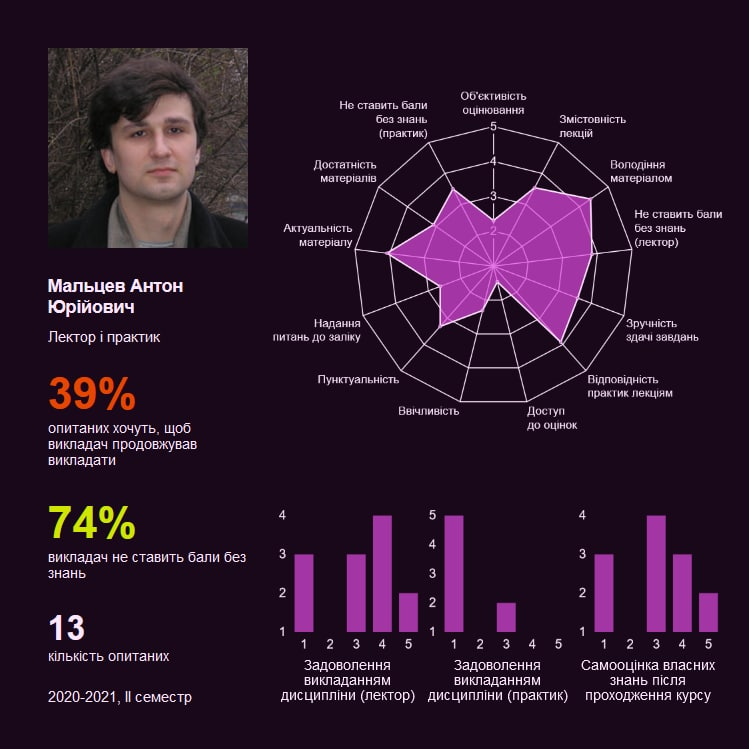

**Дисципліни:** математичний аналіз, лінійна алгебра та аналітична геометрія.

**Нотатки виживших:**

_«Суперечливий викладач. Переваги: ідеально проводить лекції, дуже добре пояснює матеріал, усі домашні завдання відповідають лекціям і дійсно змушують зрозуміти предмет, а не просто знати його. Щодо проведення лекцій і практик немає жодних нарікань. Усе є для того, щоб зрозуміти предмет, а далі все залежить від бажання студентів._

_Недоліки: повне відсутність послідовності оцінювання (РСО). Фактично воно існує, але змінюється кожного тижня. На дистанційному навчанні в другому семестрі РСО зводиться до того, що ти отримуєш автомат при умові вчасно зданих домашніх завдань. Якщо не здалося — пишеш іспит. Навіть виконання розрахункових робіт нічого не вирішує, їх просто потрібно здати для того, щоб вони були._

_Таке РСО з'явилося за тиждень до початку сесії. Викладач дуже грубо ставиться до студентів. Дуже рідко відповідає в особистих повідомленнях в Telegram, часто ігнорує (із кимось навіть видалив чат). На лекціях страшно задати питання, так як у половині випадків відповідь лунає у вигляді криків: «Як це можна не розуміти? Це ж тривіально!»._

_Не завжди вчасно розбирає питання, пов'язані з домашніми завданнями. Про них необхідно писати в телеграм-чат. Після цього він їх перегляне, вирішить, а потім розбере їх на початку лекції. Буває таке, що за 3-4 дні до лекції надсилали, але він розбирав ці задачі тільки через одну лекцію (іноді говорив, що просто не помічав)._

_У першому семестрі та в першому місяці другого семестру були не дуже якісні конспекти лекцій. Це навіть не його власні, а ті, написані студентами ще давно. І там багато помилок, які виявляються лише під час їх читання. Навіть вони були у вигляді згенерованих фотографій. Далі, у другому семестрі, були його лекції, написані вручну та сфотографовані, але без помилок. А далі вже тільки з'являлася методичка, але вона служила лише як приклад розв'язання деяких задач (бо іншого там нічого не було)._

_Висновок: як викладач — ідеальний, на найвищому рівні володіє своїм предметом. Але як особистість — не дуже. Був би ввічливішим до студентів і хоч трохи ішов їм на зустріч — не було б ціни такому викладачу»._

_«По закінченню цього предмету знань взагалі немає. Викладач нормально не пояснював матеріал, а на запитання про незрозумілі деталі казав, щось типу: «Як це незрозуміло? Вам має бути зрозумілим!» Також часто чули фразу по типу: «Зрозуміло? Ні? (3 секунди мовчання) Йдемо далі!» і продовжував далі розказувати без пояснень. Також надавалися відскановані конспекти лекцій студентів минулих років, у яких було дуже багато помилок, а тому потрібно було ламати очі, аби зрозуміти написане. Після того, як такі матеріали закінчилися, викладач робив їх сам і тоді було трохи легше. Наскільки пам’ятаю, то ми писали контрольні роботи, які мали б якось впливати на остаточну оцінку, але ні. Нам давали ДЗ і їх теж не перевіряли, а наприкінці семестру, якщо здав усе вчасно, отримуєш 60+. Якщо ж оцінка не задовольняє, то достатньо сильно валив»._

_«Перший семестр був більш-менш адекватний, вів пари, надавав домашки. Незважаючи на змішане навчання, проводив усі свої пари в суботу онлайн і щоразу мав дуже смішні відмовки про корону. Дз було обов’язкове, але він ніколи не перевіряв, тому дуже швидко ми почали здавати рандомні фотки зошитів. Пари були звичайні. Не прям погано, але й не прикольно. Предмет був заліковий, але наприкінці року абсолютно всі мали писати залік. Оцінки виставив рандомом, тому десь більше половини потоку відлетіли на допку, де він просто подарував кожному 60, якщо в них були здані всі ДЗ._
_Із впровадженням воєнного стану перестав проводити пари, кілька разів кинув на пошту конспекти чи відео, точно не пам’ятаю, а потім всім поставив 65. Тож лінал у нас знають лиш ті, хто вчився самостійно»._

### Попова Наталія Дмитрівна

**Дисципліни:** математичний аналіз.

**Нотатки виживших:**

_«Хороший викладач? Істина пізнається в порівнянні, дану викладачку ставлять практиком у деякі групи з сильним лектором, в інших групах практиком виступає лектор відповідно. Тож, в цілому, хороші пояснення та підготовка до занять, фундаментальний розбір прикладів, але в порівнянні з лектором на практиках — таке, відсутня віртуозність і бажання розв'язувати цікаві задачі з непередбачуваним фіналом. Тому варто зазначити, що практики НД варто відвідати, але опісля зайти на практику до лектора (якщо ГБ, то така можливість є), щоб закріпити матеріал та перейти на більш високий рівень. Домашні завдання аналогічні лекторським, кр складає лектор, тому так...»._

_«Нормальна викладачка навіть більше в бік хорошого. На практиках розв'язує усі необхідні приклади і пояснює принципи/алгоритми розв’язання, проте складних задач вона не дає й іноді не знає, як розв'язати приклади дз, які дає лектор. Контрольні перевіряє лояльно й взагалі як практикиня нормально»._

_«Викладачка була практиком з предмету «Математичний аналіз», абсолютній більшості студентів подобалась лояльним оцінюванням та неважким матеріалом. Також, що не мало важливо, вміє гарно пояснювати матеріал та давала «лайфхаки», щоб розвʼязувати математичні проблеми легше. Особисто в мене залишилось двояке відчуття, оскільки викладачка наче і хороша, та й людина приємна, але не вистачало «жесті». Прикладів з практик було б недостатньо, щоб написати на відмінний бал екзамен у лектора, який якраз і відомий своєю любовʼю до якихось… «красивих та жорстоких» математичних задач. З цією викладачкою вам легко буде опанувати основу, та 80% матеріалу затребуваного для екзамену. Для чогось більш хай-левел необхідно буде працювати самостійно. _
_Для мене, як людини емоційної, дистанційні практики були психологічним насиллям, оскільки це було повільно і монотонно. Знову ж, без «жесті». Але в записах на 1,75х — чудово. Можливо це лише з мене ІПСА зробив математичного мазохіста, і вам сподобається таке спокійне та просте викладення матеріалу. Але для екзамену лектора однозначно прийдеться готуватись трішки більше ніж за практиками. Проте *важливе уточнення* якщо самостійно виконувати ВСЕ домашнє завдання, якого немало, то цих навичок вам цілком вистачить, щоб заробити відмінний бал»._

### [Мінарченко Олександр Миколайович](https://medium.com/@iasa/%D0%BC%D0%B8%D0%BD%D0%B0%D1%80%D1%87%D0%B5%D0%BD%D0%BA%D0%BE-%D0%B0%D0%BB%D0%B5%D0%BA%D1%81%D0%B0%D0%BD%D0%B4%D1%80-%D0%BD%D0%B8%D0%BA%D0%BE%D0%BB%D0%B0%D0%B5%D0%B2%D0%B8%D1%87-%D0%BE%D0%B1-%D1%83%D1%87%D1%91%D0%B1%D0%B5-%D0%B2-%D0%BC%D0%B3%D1%83-%D1%84%D1%83%D1%82%D0%B1%D0%BE%D0%BB%D0%B5-%D0%B8-%D0%BE-%D0%BA%D0%BE%D0%BD%D1%84%D0%BB%D0%B8%D0%BA%D1%82%D0%B0%D1%85-%D1%81-%D0%BF%D1%80%D0%B5%D0%BF%D0%BE%D0%B4%D0%B0%D0%B2%D0%B0%D1%82%D0%B5%D0%BB%D1%8F%D0%BC%D0%B8-9f6a88a42523)

<i>Викладач як лектор</i>

<i>Викладач як практик</i>

**Дисципліни:** математичний аналіз.

**Нотатки виживших:**

_«Викладання Мінаря треба ділити на дві частини, до воєнного стану / під час._

_До: викладав лекції онлайн у форматі простого читання та пояснення свого конспекту за темою, потім надсилає його на пошту. Багатьом цей підхід здавався не дуже гарним, але мені подобався, бо на лекції по факту можна не ходити, а просто читати ці файли, які насправді дуже гарно написані (але бувають описки, через які нічого не зрозуміло, це можна уточнити на парі). Практики викладалися таким же способом._

_Щодо отримання балів, коли навчання проходить офлайн, то на практиці можна заробити «+», який потім колись перейде в додаткові, а основна частина відміток — це контрольні, до яких треба отримати допуск: виконати розрахункові роботи й віднести йому._

_Система оцінювання в нього дуже специфічна: може надіслати результати контрольної у вигляді «+», «-», «-+», «+-» тощо. Чим більше плюсів, тим краще, але чим більше мінусів, тим меншу «плюс» має вагу._

_Оцінки свої ти дізнаєшся тільки під кінець семестру (якщо, звісно, не зможеш розкрити код енігми та розшифрувати ці плюсики)._

_Під час КР може попереджати, що за запізнення на хвилину буде знімати бали, але зазвичай це просто слова, він дід, насправді, добрий._

_Під кінець першого курсу ставить вам оцінку, яка найімовірніше буде й на другому, зазвичай автоматом._

_Під час воєнного стану:_

_Нічого не змінюється, крім оцінювання._

_Ми отримували оцінки за РГР, які він давав на весь семестр. Здати можеш коли хочеш, головне до екзамену. Перевіряє він їх вже на другому курсі неприскіпливо: просто порівнює вашу оцінку з оцінкою за попередній рік і все._

_Важливо!_

_Писати КР / РР треба дуже детально й брати матеріал з його лекцій / практик, він таке дуже любить. Варто пояснювати кожен свій крок, навіть до смішного — писати чому ти поділив на «Х», чому помножив і т.д._

_Загалом, викладач мені сподобався: він добрий, чуйний, зазвичай нікого не відраховує, а ще забавно сміється: «Хє-хє-хє-хє»»._

_«Хотілося б, щоб на практиках студенти теж розв'язували завдання й отримували за це бали. Тоді було б більше мотивації вчити предмет»._

_«Є одна базова проблема, яка тягнеться не один рік — майже повна відсутність РСО, все що ми знаємо про нього — будуть розрахункові й екзамен, але про те, скільки балів ми набрали за семестр дізнаємося лише на консультації перед екзаменом»._

### Рябов Георгій Валентинович

**Дисципліни:** математичний аналіз.

**Нотатки виживших:**

Пан Рябов не викладав раніше дисципліни в ІПСА, але проводив гурток з додаткових розділів математичного аналізу при відділі теорії випадкових процесів Інституту математики НАН України. Учасники гуртка підкреслюють зацікавленість Георгія Валентиновича у своїй дисципліні, бажання донести інформацію та відчутну прискіпливість.

### [Барановська Леся Валеріївна](https://teletype.in/@iasa_sc/HJO3vFzdH)

<i>Викладачка як лекторка</i>

<i>Викладачка як практикиня</i>

**Дисципліни:** лінійна алгебра та аналітична геометрія.

**Нотатки виживших:**

_«Дуже добра. Розуміння матеріалу гарантоване. Весь потік повністю опанував запропонований матеріал. Також Леся Валеріївна пропонувала багато гарного додаткового матеріалу з лінійної алгебри та спряжених дисциплін»._

_«Дуже приємна викладачка. Детальне пояснення матеріалу, відповіді на будь-які питання щодо нього. Контрольні й розрахункові писалися дуже легко, бо на 100% відповідали матеріалу, всі завдання були завчасно опрацьовані на практиках. Бали було заробити дуже легко. Також ми закінчили курс за місяць до закінчення семестру, що значно спростило період сесії»._

_«Рівень, на якому викладається лінал дуже поганий, оскільки чомусь все зводиться до оперування матрицями, аж ніяк не до того, що очікується. Лекції рідко проводяться повномірно, частіше це закінчується розповідями про сім'ю, династію й так далі. Ходила під час них у фору по смаколики»._

_«Коли вона в тебе викладає, тобі здається, що ти такий крутий, все знаєш, все шариш і взагалі все нескладно. Але коли починаються предмети на наступних курсах, типу дифурів, теорії ймовірності тощо, то розумієш, що вона не включила в програму добру половину всього, що ви мали б вчити. У другому семестрі її манера викладання взагалі жахлива: робить вигляд, що ми тоді налаштовуємося на самоосвіту, і проходимо якусь ще меншу купку тем упродовж семестру»._

### [Спекторський Ігор Якович](https://medium.com/@iasa/ip-%D1%88%D0%BF%D0%B8%D0%BE%D0%BD-%D0%B8%D0%BF%D1%81%D0%B0-%D0%BA%D0%BE%D1%82%D0%BE%D1%80%D1%8B%D0%B9-%D0%B2%D1%8B%D0%B2%D0%BE%D0%B4%D0%B8%D1%82-%D1%8D%D0%BC%D0%BF%D0%B8%D1%80%D0%B8%D1%87%D0%B5%D1%81%D0%BA%D0%B8%D0%B5-%D0%B7%D0%B0%D0%BA%D0%BE%D0%BD%D1%8B-%D0%BD%D0%B0-%D1%81%D0%B2%D0%BE%D0%B8%D1%85-%D0%BF%D0%B0%D1%80%D0%B0%D1%85-%D1%81%D0%BF%D0%B5%D0%BA%D1%82%D0%BE%D1%80%D1%81%D0%BA%D0%B8%D0%B9-%D0%B8%D0%B3%D0%BE%D1%80%D1%8C-%D1%8F%D0%BA%D0%BE%D0%B2%D0%BB%D0%B5%D0%B2%D0%B8%D1%87-cd80f0e6a4f1)

<i>Викладач як лектор</i>

<i>Викладач як практик</i>

**Дисципліни:** дискретна математика, математична логіка.

**Нотатки виживших:**

_«Найпрацьовитіша людина, яку я коли-небудь зустрічав. Викладач з великої літери, який показав, що жодна дистанційка не стане на заваді освітньому процесу. Лекції — дуже інформативні та натхненні, практики — цікаві й насичені. Коли розпочався карантин, він перший з усіх розпочав онлайн-заняття, записи яких розповсюджувалися на весь потік, якщо раптом хтось не зміг бути присутнім і так далі._

_Заздалегідь, перед заняттями, надсилав пдф лекції одночасно з двох дисциплін, які він викладав у нас, доповнюючи їх і дописуючи нові теми. Дуже швидко відповідав на всі листи зі запитаннями, оперативно надсилав виправлення до розрахункових робіт._

_Апогей працьовитості настав під кінець семестру, коли він за декілька днів перевірив майже сотню контрольних робіт і великих за розміром розрахункових, відповівши кожному студенту з трьох груп, до того ж організував прийом додаткових завдань. І відразу після цього провів два заліки: один — із дискретної математики, інший — із математичної логіки»._

_«У нього чудові методичні матеріали та пояснення для розрахункових робіт, просто казка. Щодо практичних занять — важче, через жахливий почерк. Були скарги на монотонність та відсутність структури, але суто я не помічав цього, тому якщо не забивати на предмет, все буде цілком зрозуміло. «Горе від розуму, а щастя від безумства» — за такою логікою в нас усі дуже розумні, якщо їм Спектр не сподобався»._

_«Спекторський займає перше місце в моєму особистому топі викладачів. Пояснення доступні. Не варто соромитися щодо запитань, він чітко все розкладе по поличках. Також відповідав в особисті повідомлення на запитання з приводу розрахункових, нарахування балів, екзамену тощо. Незважаючи на ситуацію з відключеннями світла, на відміну від інших викладачів, завжди знаходив вихід, було перенесено лише декілька пар»._

_«Занадто швидка подача матеріалу, цілі теми могли проходити за 1 тиждень. Деякі теми у мене взагалі вилетіли, на жаль. А також неймовірно важко зрозуміти щось після пари переглянувши дошку, відбувається хаос через швидке писання мишкою. Але загалом все добре. Тільки трошки більше б розжовування, після пари залишаються незрозумілі моменти»._

_«Видно, що Ігор Якович палко захоплений своєю справою, але йому варто пам'ятати, що в студентів також є інші предмети, принаймні час на обробку матеріалу, а максимум — вільний час для себе. Перепрацювання пар у два-три рази — ненормально»._

### [Стусь Олександр Вікторович](https://medium.com/@iasa/%D0%BE%D0%BB%D0%B5%D0%BA%D1%81%D0%B0%D0%BD%D0%B4%D1%80-%D1%81%D1%82%D1%83%D1%81%D1%8C-%D0%BF%D1%80%D0%BE-%D0%BD%D0%B0%D1%83%D0%BA%D1%83-%D1%84%D1%83%D1%82%D0%B1%D0%BE%D0%BB-%D1%82%D0%B0-%D0%B1%D0%B0%D0%B3%D0%B0%D1%82%D0%BE-%D1%87%D0%BE%D0%B3%D0%BE-%D1%96%D0%BD%D1%88%D0%BE%D0%B3%D0%BE-32d023eb6eb6)
 

<i>Викладач як лектор</i>

<i>Викладач як практик</i>

**Дисципліни:** дискретна математика, математична логіка.

**Нотатки виживших:**

_«На лекціях читав посібник, але зі своїми прикладами. Зате на практиках вирішував різні задачі, завжди був готовий провести консультацію з домашнього завдання, яке детально перевіряє й коментує, як і розрахункові та контрольні»._

_«Лекції проходять достатньо нудно тільки через те, що почерк викладача дрібний і незрозумілий, а голос тихий. На практиках він проходить всіма практичними запитаннями, які можуть трапитися на контрольній / іспиті. Оцінює дуже об'єктивно, зверне увагу навіть на найменші неточності, проте в майбутньому ти не будеш допускати таких помилок»._

_«Дуже прискіплива людина, яка готова пояснювати студентам десятки разів один і той самий матеріал, має чітку й сувору РСО. Знімав десяті балів за відсутність крапки в реченні. Футбольний фанат, тому захисти розрахункових раніше проходили у вигляді забивання голів: відповів правильно — забив, неправильно — забив Олександр Вікторович, по рахунку визначали, чи є вона захищеною. Під час очного навчання, якщо помічав списування на МКР, давав жовту картку студенту, 2 списування — червона картка, що буде в такому разі — без поняття, бо наші до такого не дійшли»._

_«Найкращий, 10/10. Під час онлайн занять дістав своїм тачпадом увесь потік. Оцінки ставить фактично, можна легко домовитися про виправлення, чуйний, і, незважаючи на технічні проблеми, його заняття дійсно цікаві та корисні»._

### [Статкевич Віталій Михайлович](https://teletype.in/@iasa_sc/H1aP70YPr)

<i>Викладач як лектор</i>

<i>Викладач як практик</i>

**Дисципліни:** дискретна математика, математична логіка.

**Нотатки виживших:**

_«Викладач добрий, лояльний, чуйний, проте водночас по-своєму вимогливий. На парах відповідати одне задоволення, при неправильній відповіді Статкевич намагається пояснити, де саме студент помилився. Проте слід згадати й іншу його сторону. Наприклад, на додатковій сесії чи комісії він дуже вимогливий, що можна пояснити бажанням переконатися в знаннях студента. Загалом, справив більше, ніж позитивне враження»._

_«Найбільший мінус — це те, що ми так і не дізналися, нащо бали за розрахункові та які були помилки. Також були проблеми з виставленням балів, адже взагалі незрозуміло, за що вони були. Також наприкінці першого семестру до нього було не додзвонитися: він не прийшов на пару, так і не написав нічого. Але дає можливість відповісти кожному студенту, не поспішає, готовий пояснити декілька разів, на його парах нестрашно сказати щось не так»._

_«Завдання вирішує безпосередньо на парі, але ставить багато запитань і чекає, поки хтось відповість. І чекати може хоч 20 хвилин. Мовчки. Абсолютно. До всіх помилок ставиться спокійно. Але якщо він починає розуміти, що ніхто не зацікавлений у тому, щоб щось зрозуміти, то викликає на усні опитування. І, скоріше за все, буде соромно не вчитися в Статіка, бо він надто лапочка»._

### Моклячук Олександр Михайлович

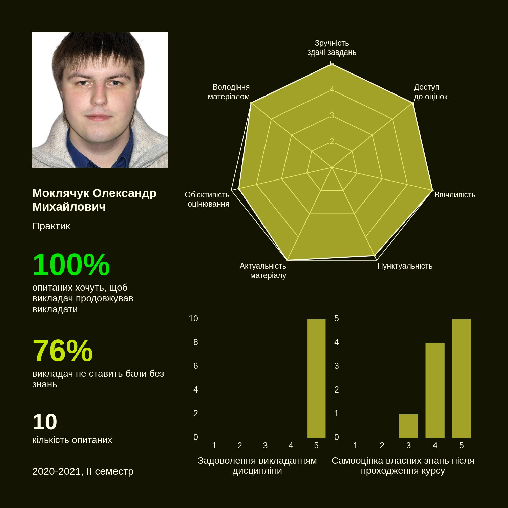

**Дисципліни:** дискретна математика.

**Нотатки виживших:**

_«Дуже крутий і чуйний викладач. По-перше, задачки були цікаві, на практиках допомагав і підказував, якщо ми шось забували з лекцій. На його практиках ми самі вирішували задачі, він лиш підштовхував._

_Розрахункові було дуже комфортно захищати. Він не ставив бали просто так, але й не валив, допомагав вийти на потрібну думку. Після початку війни ввійшов у положення, але не в плані, що забив, а в можливостях здавати роботи»._

_«Вів практики з дискретної математики, де ми розв'язували завдання до розглянутих на лекціях тем й отримували додаткові бали. Заняття були цікавими та інформативними. Також мені подобалися захисти розрахункових робіт, оскільки питання на них були завжди за темою та допомагали повторити вивчене. Після відвідування його практик та здачі запланованих робіт залишитися без знань було неможливо, більш того, у разі незрозумілостей, викладач завжди йшов на контакт. Моя щира рекомендація»._

_«Якщо виникали якісь проблеми, завжди йшов на контакт, було легко підтримувати з ним зв'язок щодо питань з навчання й організаційних моментів»._

### Назарчук Ірина Василівна

<i>Викладачка як лекторка</i>

<i>Викладачка як практикиня</i>

**Дисципліни:** програмування та алгоритмічні мови.

**Нотатки виживших:**

_«Перше, що хотілося б сказати, це те, що як людина, викладачка дуже приємна жінка, яка намагалася зробити так, щоб усі зрозуміли предмет. Проводила консультації та з розумінням відносилася до будь-яких ситуацій у студентів. Але її підходи до викладання трохи застарілі й, мабуть, специфічні. У цілому, ставлення до неї позитивне. Люди, котрі реально намагалися зрозуміти матеріал, могли отримати від неї відповіді на всі запитання»._

_«Цікава жіночка, класно розказує про синтаксиси мов. У цілому мені сподобалася, але є одне АЛЕ… На екзамені вона казала нам, аби ми писали код не в програмі для написання кодів, а на листочках і дуже сильно валила за пропущенну кому чи не так написане слово…»._

_«МКР проводяться у форматі тестів, які не завжди об'єктивно оцінюються. Довести правильність свого варіанту виходило не завжди: матеріал у лекції — закон, і все одно, що сторонні джерела суперечать цьому. Якось так»._

### Селін Юрій Миколайович

<i>Викладач як лектор</i>

<i>Викладач як практик</i>

**Дисципліни:** алгоритми та структури даних, програмування.

**Нотатки виживших:**

_«Усі лабораторні, які я робила з цієї дисципліни, були написані за матеріалами з програмування. Він надав файл із конспектами, але там було надто мало інформації для написання лабораторних. Можливо, якби він вів лекції й доповнював конспекти своїми коментарями, усе було б краще, але останні 2-2,5 місяці першого семестру лекції Селін не проводив через відключення світла та не йшов на контакт для перенесення пар. Насправді, курс і лаби були неважкими, оскільки на програмуванні все детально пояснювалося. Також варто додати, що він не вміє програмувати. Це робить навчання в нього легшим, оскільки ти можеш припуститися помилки, а він не буде знижувати за це бали. Але таке викладання є некомпетентним, а оцінювання — необ'єктивним. Хоча б через те, що 2/4 лабораторних це по більшій частині написання коду, який він навіть не перегляне. Також іноді він з неповагою звертався до студентів, зокрема й за те, що вони не знали матеріал, який він сам не викладав. Не рідко звинувачував студентів у списуванні, хоча це було неправдою»._

_«Методичного матеріалу недостатньо, лабораторні роботи було нескладно захистити, але одного разу при поясненні алгоритму та відповідного йому коду засмутила фраза у форматі «не потрібно хизуватися своїми знаннями, я побачив, що ви знаєте». Після ускладнення ситуації з електропостачанням Юрій Миколайович дозволив не захищати лабораторні, тоді вже було важко зрозуміти, згідно з якими критеріями вони оцінюються. На питання щодо балу відповіді не було отримано»._

### Севастьянов Володимир Володимирович

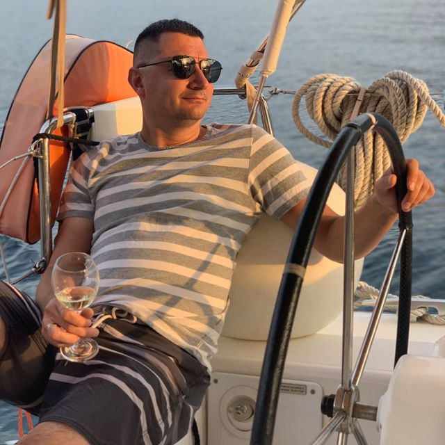

**Дисципліни:** алгоритми та структури даних.

_«Практики по АСД витягав Севастьянов В.В, який розповідав дійсно цікаво та зрозуміло, але, на жаль, він був тільки на 60% всіх практик»._

_«Севастьянов був у нас як другий практик на АСД, але всі пари в нас викладав виключно Селін. Володимир Володимирович тільки допомагав з перевіркою лабораторних робіт. Він робив це дуже ретельно й прискіпливо, отримати в нього 100 балів за лабу було складніше, ніж у Селіна. Але викладач завжди дозволяв її переробити та підвищити оцінку. Також у будь-який момент готовий допомогти. Коли в частини нашої групи виникла проблема з темою, провів нам додаткове заняття. На мій погляд, він хороший викладач, який просто хоче, щоб студенти справді добре тямили в предметі»._

### Романов Валерій Володимирович

**Дисципліни:** програмування та алгоритмічні мови.

**Нотатки виживших:**

_«Викладач, якому подобається влаштовувати студентам сюрпризи! Іноді, може зателефонувати о 6 ранку з метою термінового захисту контрольної роботи, а інколи переконує здобувачів освіти у тому, що синтаксис відповідної мови не є їй притаманним. Дуже легко приймає курсові, звертає увагу на розробку інтерфейсу. Кумедний дядько, з ним рідко може бути сумно. На парах зустрічав фразою «які в нас красиві дівчата»🏆»._

_«На його лекції ходять мало людей, дійсно, з самого початку він дає абсолютно непотрібний, дуже розтягнутий протягом семестру матеріал. Проте в нього є конспекти лекцій, які можна самостійно опрацювати. Я би сказав, що його лекції носять більш ознайомчий характер, а не практичний, хоча деякі моменти в його конспектах можна почитати й навіть застосувати»._

_«Неймовірно цікавий і харизматичний викладач! Дуже подобається, коли наводить приклад із буденного життя, і ти такий «Ого!», й аж хочеться сидіти та слухати далі»._

### Просянкіна-Жарова Тетяна Іванівна

**Дисципліни:** програмування та алгоритмічні мови.

**Нотатки виживших:**

_«Працьовита людина, завжди на зв'язку, дозволяє доздавати роботи, навіть після дедлайну. Чудова думка про неї»._

_«Справжній жах, борець за правильне форматування документації. Воно-то потрібне, але пріорітет на виконанні протоколу до лаби, а не на написанні самого коду та розумінні алгоритму — це суцільний кошмар. Не дуже справедливо перевіряє контрольні роботи, знімає бали незрозуміло за що. При захисті курсової на код взагалі не дивиться, насолоджується лише готовою роботою застосунку та голосовим супроводженням-поясненням»._

_«Прискіпується так, що аж жижки трусяться через кожен міліметр протоколу, за який тебе відчитають до посиніння. Опісля 4-5 захищених лаб викладачка тебе запам’ятовує, і все йде як по маслу, хоч слоника у віжуал студіо намалюй, усе буде ок»._

_«Тетяна Іванівна сподобалася своєю стриманістю та тим, що викладалася більше, ніж на максимум. Витрачала особистий час на те, щоб прийняти в усіх лабораторні та курсові роботи»._

### [Безносик Олександр Юрійович](https://iasastudentcouncil.github.io/iasa-sc-blog/blog/interview)

**Дисципліни:** програмування та алгоритмічні мови, операційні системи.

**Нотатки виживших:**

_«Це людина, яка не стільки прагне просто розпитати тебе по лабораторній роботі, а хоче її пояснити та розповісти щось нове. Під час здачі робіт на конференції можуть бути присутні хто завгодно, оскільки Безносик не переживає за те, що ви скатаєте чужий код. Він хоче, щоб усі зрозуміли, як має бути і як було б краще зробити. Дехто називає його душнілою, проте я так ніколи не вважав. Він може поставити 100500 запитань під час захисту, але винятково для того, щоб зрозуміти, що ти не знаєш і що можна розповісти. Абсолютно добра, світла людина. Ставлю йому 👍»._

_«Викладач буває грубим, може легко злякати студентів своєю поведінкою, але, здається, оцінює об'єктивно»._

_«Як лектор, мені Безносик не дуже сильно сподобався: на лекціях він показував тільки презентацію, ніколи не запускав код та безпосередньо не взаємодіяв з операційними системами. Живих прикладів на лекціях дуже не вистачало»._

### Руденко Олексій Володимирович

**Дисципліни:** математичний аналіз.

**Нотатки виживших:**

_«Руденко не лектор, це практик. Отже, весь матеріал дається поверхово й за темою розглянутих завдань. Синхронізація з лектором слабка; він дізнається лише тему в 90% випадків, а в іншому дає ті задачі, які вважає за потрібне: теорії за деякими з них лектор не давав; так само лектор міг взагалі не розглядати якийсь тип завдань із розв'язуваних Руденком. _

_Великий бонус буде для тих, хто намагається розібрати лекції й приходить на практику вже з мінімальними знаннями теорії чи просто розумінням того, що відбувається. Тут його промову можна розібрати, і вона буде корисною. Знову ж таки, можна питати, уточнювати багато разів одне й теж, може й буде видно, що його це дратує, але він відповідатиме. Теорія матана не інтуїтивна, і Руденко не зробить її зрозумілішою, але при поясненні він малює картинки, які прояснюють ситуацію. Це дозволяє простою мовою зрозуміти складні речі»._

_«Практики Руденко вів нормально винятково для заучок, які розуміють із півслова. Давав матеріали, оцінки ставив по градації, віддавав перевагу тим, хто більше йому підлизував на заняттях. Більшість хлопців, які до нього не ходили, отримували низькі бали та приписку «списано», навіть якщо нічого не списували й робили самі»._

_«Викладач, ніби й непогано знає предмет, але нормально пояснити матеріал студентам не може. Через це на парах ми дуже довго розбирали дз і не встигали за темами. На контрольних й екзаменах він дає завдання значно складніші, ніж ті, які ми розбирали на практиках чи дз. До всього прискіпується й дуже знімає бали за всякі дрібниці, яких ні на практиках, ні в дз не було. І зазвичай навіть не зрозуміло, що саме він хоче, щоб було розписано»._

### Номіровський Дмитро Анатолійович

<i>Викладач як лектор</i>

<i>Викладач як практик</i>

**Дисципліни:** математичний аналіз.

**Нотатки виживших:**

_«Мабуть, найкращий лектор серед тих, що я бачив. Уміє дуже просто, але без втрати строгості пояснити. Щодо практик: розглядалася недостатня кількість задач на парах, домашнє давав не структуровано, на честь чого слова «зробіть щось з цього блоку» стають приводом для загартовування самоорганізації. Завжди готовий відповісти на всі запитання щодо домашнього, через це практичні заняття більше схожі на індивідуальні з конкретним студентом»._

_«Найбільш протирічний кадр. З одного боку — шикарні лекції, написані на графічному планшеті, ретельне пояснення кожного факту та теореми, вдало наведені ілюстрації тощо. Вчити матан було одне задоволення. Це без іронії чи сарказму. Проте хороше на цьому закінчується. Основна претензія — незрозуміле РСО. Оцінки за кожну роботу виставлялися не в абсолюті, а відносно (навіть без пояснення шкали переведення балів). Роботи дає, увага, не у фіксований час, а тоді, коли йому заманеться, щоб це було для нас несподіванкою. Резюме: нудно точно не буде!»._

_«Викладач не знає різниці між контрольними та розрахунковими роботами. Усі види його контролів у тестовій формі, лише в синхронному режимі. По суті, писати за тебе ті тести може хто завгодно, у кого є світло в час написання кр. У кого немає — не судьба. (Викладач давав змогу переписувати роботи пізніше). Випросити в нього 60 балів набагато легше, аніж отримати нормальну систему оцінювання»._

### Чаповський Юрій Аркадійович
 

<i>Викладач як лектор</i>

<i>Викладач як практик</i>

**Дисципліни:** математичний аналіз. 

**Нотатки виживших:**

_«У дистанційному форматі практики проводилися цілком гідно. До кожного заняття був підготовлений pdf-документ із переліком завдань, які вирішувалися протягом пари, а їхнє рішення супроводжувалося коментарями. Можна було запитати будь-якої миті._

_Варто також відзначити, що наявність графічного планшета робить текст читабельнішим, а також швидшим, ніж писати мишкою._

_Однак усе розвʼязував лише викладач, студенти не мали можливості «вийти до дошки» й самостійно вирішити завдання на електронній дошці. Можливо, це навіть непогано, оскільки так вдавалося виконувати більше за одне заняття._

_Мінусом є те, що зв'язатися з викладачем украй проблематично. Ні номера телефону, ні телеграм контакту не надано, єдине, що було, — адреса електронної пошти. Якщо питати з предмету там, то в більшості випадків будете проігнорованими. Хоч пошта не дає можливості побачити статус «прочитано», але такий висновок було зроблено з того, що на технічні питання, пов'язані з проблемами про перевірені роботи, відповідь приходила майже миттєво._

_Водночас питання з дисципліни ігноруються не тому, що викладач не знає на них відповіді. Якщо поставити те саме питання під час пари, або на консультації, відповідь буде отримана. Особисто мені здається, що справа в лінощі чи принциповому небажанні відповідати, коли робочий день викладача завершено»._

_«Дуже поважаю викладача після сесії, яку він нам провів. Особистий екзамен один на один з викладачем тривав із раннього ранку й майже до ночі. У кожного був призначений свій час. Юрій Аркадійович хотів зрозуміти, чи знає кожна окрема особа матеріал за семестр, надав достатньо часу й дуже об'єктивно оцінював._

_Лекції проводив протягом семестру, надавав методичні матеріали в достатній кількості._

_Дивним чином він змусив весь потік студентів поважати себе. Те, що він топ-викладач, лунає часто в чатах або особистому спілкуванні. Викладач підкреслює, що поважає тебе як особистість, спокійно та з позитивним настроєм спілкується незалежно від того, чи ти правильно відповів. Культ обожнювання Чаповського вже проноситься ІПСА. Але серйозно, хотілося би більше таких викладачів»._

_«Хоче передати знання з великою точністю. Це особливо проявляється під час здачі розрахункових, де бали можуть зняти навіть за друкарську помилку в терміні, нібито якщо написати на ряд з позитивними членами абсолютно збігається. Але мені не здається це мінусом, адже під кінець, якщо друкарських помилок було небагато, за це в підсумковій оцінці не знімають бали, а чітке значення термінів краще запам'ятовується. Також викладач проводив додаткові заняття, оскільки ми не встигали пройти матеріал»._

_«Єдиний мінус — лекції неможливо слухати у звичайному темпі, дуже нудно, швидко засинаєш. Потім просто передивляєшся їх на х2 швидкості. Оцінювання — майже повністю об'єктивне. «Майже», адже викладачеві складно визначити студентів, які списали свої розрахункові роботи або робили їх не самі»._

### Сисак Катерина Ярославівна

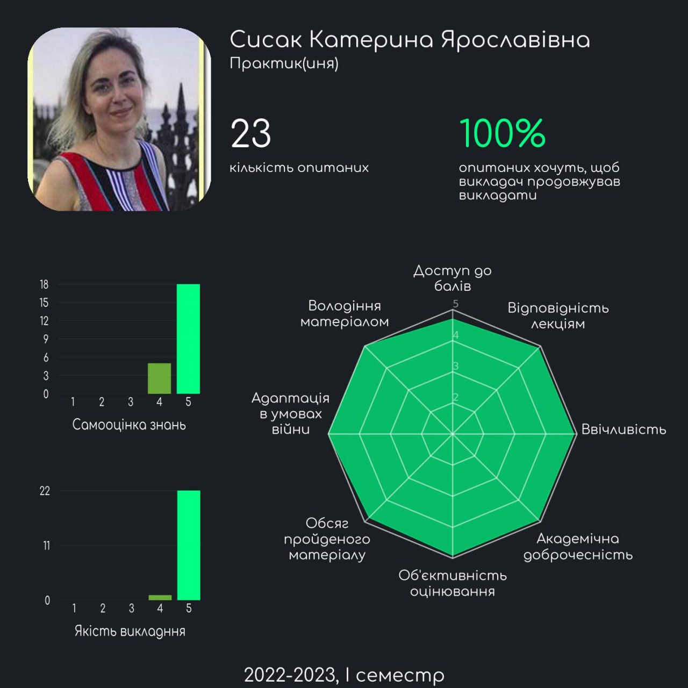

**Дисципліна:** лінійна алгебра та аналітична геометрія. 

**Нотатки виживших:**

_«Практикиня -— чудова жінка, яка змістовно готується до занять і намагається щось донести до студентів. Після кожного заняття надсилає презентації з пройденим матеріалом, яких достатньо для розуміння викладеного. Види контролю: 2 МКР і розрахункова кожного семестру. Складність полягає не в самих задачах, а скоріше в обрахунку»._

### Савченко Ілля Олександрович

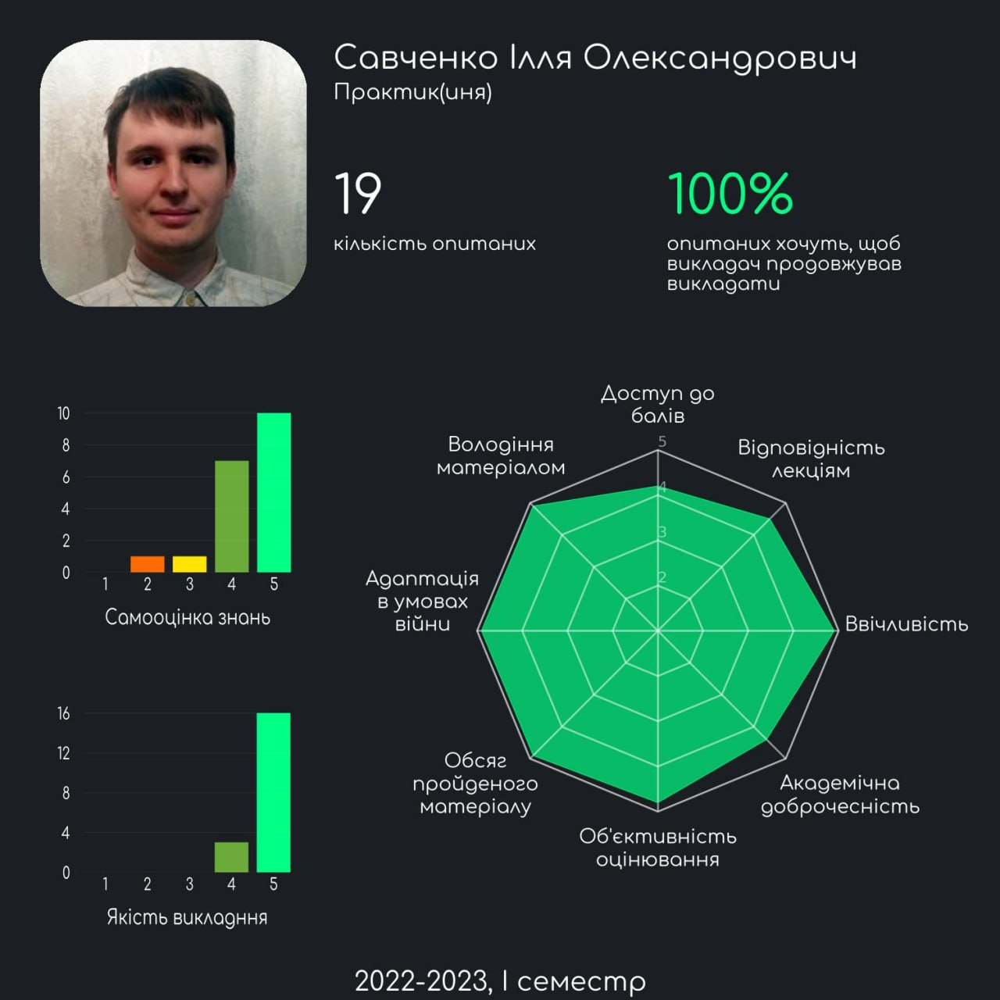

**Дисципліна:** програмування та алгоритмічні мови. 

**Нотатки виживших:**

_«На практиках можна було показати недороблену роботу, якщо зайшов у глухий кут, і він допомагав із вирішеннями проблеми. Була достатньо велика проблема з балами, бо їх не можна було подивитися впродовж семестру»._

_«Викладач молодший за своїх колег зі своєї дисципліни, тому спілкування з ним у деяких моментах може бути простіше. Добре знає весь матеріал, який вимагається від студентів, та із задоволенням відповість на запитання. Лабораторні роботи оцінює фактично: не відповівши на питання за кодом, на зараховану роботу можна не розраховувати. У той же час відразу не ставить 0 балів, а дає можливість прийти наступного разу, хоча тоді оцінка може бути справедливо нижчою»._

_«Савченко — людина, до якої я завжди був радий прийти на пару. Ввічливий, намагається допомогти, і просто хороша людина. Моїм одногрупникам він допомагав шукати помилки, зі мною, як із кентом, розраховувався за пару хвилин і відпускав пити каву. Матеріалом володіє, з учнів запитує достатньо, рекомендую всім»._

_«Хороший чоловʼяга, треба буде колись з ним випити чарку»._

### Малишевський Олексій Григорович

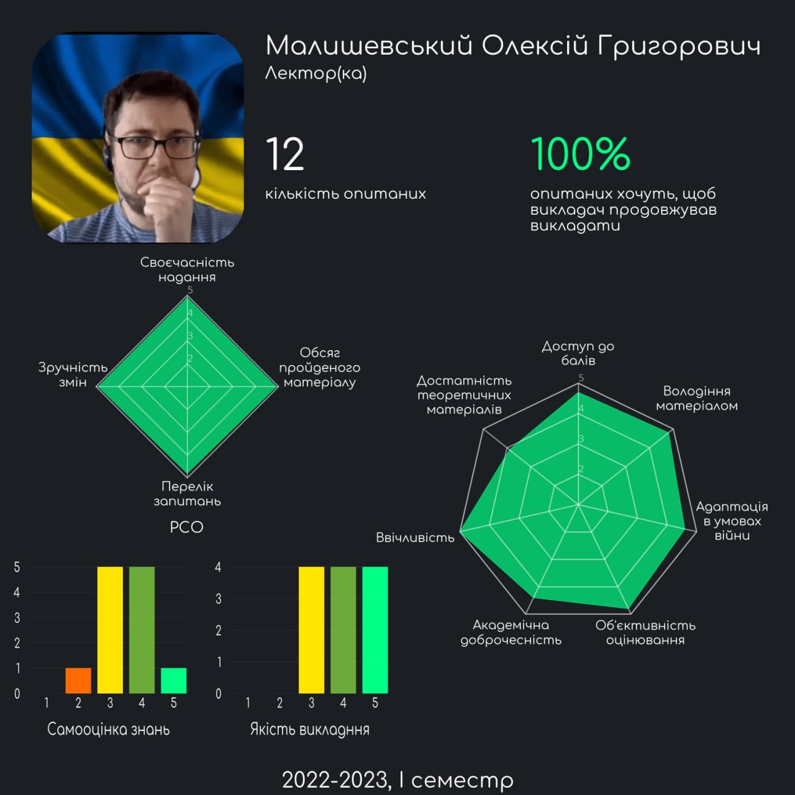

**Дисципліна:** Алгоритми та структури даних. 

**Нотатки виживших:**

_«Гарний лектор, добре пояснює логіку алгоритмів, із повагою ставиться до студентів»._

_«Він заруїнив нам всі лекції такого важливого предмету. Всі презентації були англійською, матеріал подавався складно, не був орієнтований на початківців, взагалі нічого не було зрозуміло, нецікаво, одна надія була на лаборантів, які власне й рятували на своїх консультаціях»._

_«Викладач не завжди вміє донести матеріал. На лекціях досить часто перестрибує з теми на тему, через що після 15-ти хвилин прослуховування в голові залишається каша. Матеріал, який будуть розповідати на лекції, краще переглянути до її початку, щоб розуміти, про що взагалі йдеться (оскільки це не завжди є очевидним). Організація навчального процесу перебуває на досить високому рівні, зв'язок зі студентами підтримує через Telegram»._

_«Хороший лектор. Під час проходження курсу, проводив опитування про знання матеріалу. Повторно проходив теми, матеріалами яких студенти не дуже добре володіли»._

_«Лекції не несуть сенсу, викладач надає книгу, після яку проблем із предметом не виникає. Наприкінці семестру дає тест за своїми лекціями (матеріалами наданої літератури)»._

### Куб’юк Євген Юрійович

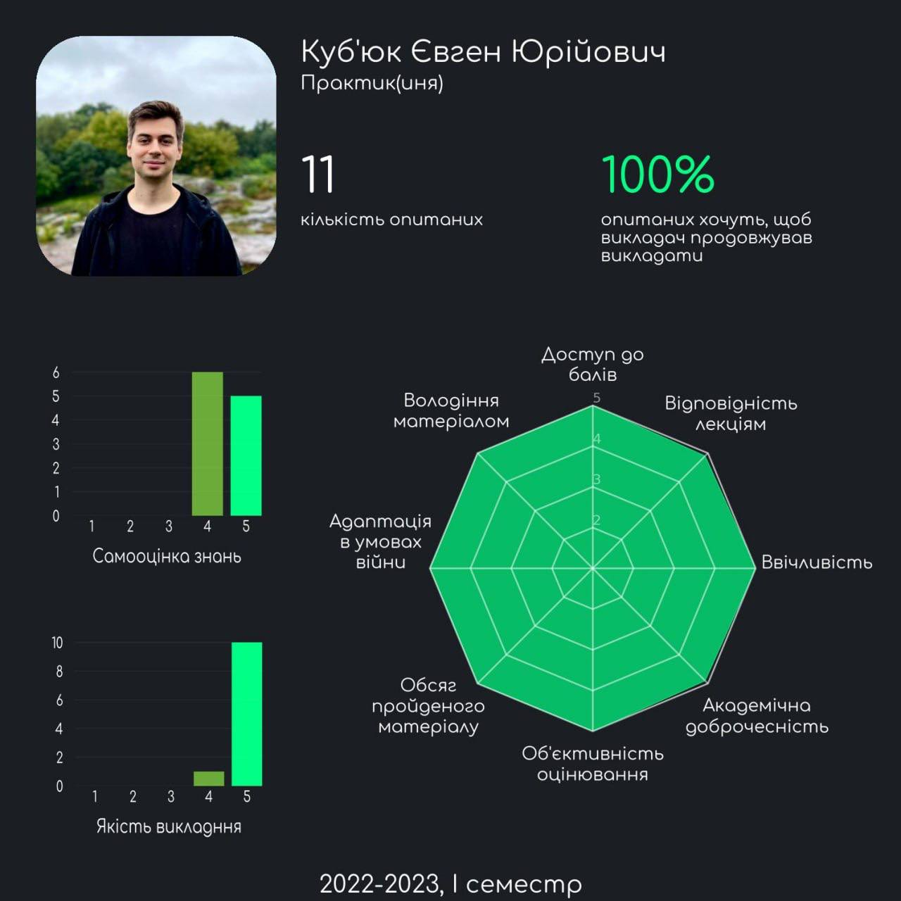

**Дисципліна:** алгоритми та структури даних.

**Нотатки виживших:**

_«Найулюбленіший викладач, уміло пояснює, якщо щось не зрозуміло, завжди питає по темі. Якщо не знаєш чогось, то він наштовхує на правильну відповідь, завжди ввічливий»._

_«Лабораторні дійсно цікаві (особливо 2 семестр). Захисти нормальні, але не дуже зрозуміло, яким чином обирають людей, до яких прискіпливо ставляться, а до яких — ні. А так, розуміючий викладач, моментами надто принциповий»._

_«Чудовий викладач. Дуже швидко й об'єктивно відповідає на додаткові запитання, швидко адаптувався до нових реалій. Завжди спокійний та з розумінням ставиться до помилок, навіть елементарних. Бажаю і надалі співпрацювати»._

### Клещ Кирило Олегович та Яковчук Олег Костянтинович

<i>Викладач (Клещ) як лектор</i>

<i>Викладач (Клещ) як практик</i>
 

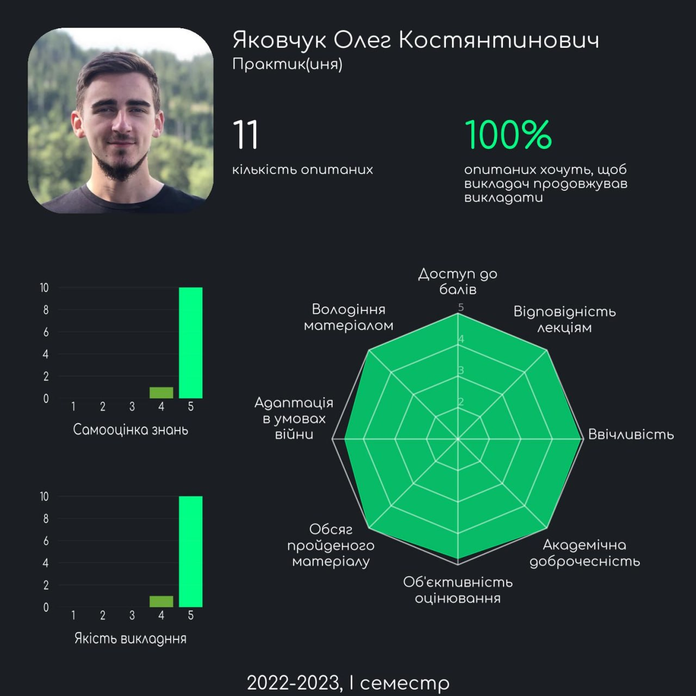

**Дисципліна:** алгоритми та структури даних.

**Нотатки виживших:**

_«Обидва вимагають реальних знань і по факту їх дають, хоч і душніли бісові. Найважливіший, напевно, предмет на 1 курсі, якщо хочеш пов'язати свою роботу з програмуванням»._

_«Найкращі викладачі на першому курсі. Наразі ще й лектори на цій дисципліні. Щиро зацікавлені допомогти кожному, проте є дуже суворими й вимогливими, які звіряють всі роботи в пошуку схожих робіт, використовують систему антиплагіат. Це наче добре, але іноді вони надто перегинають і буквально не зараховують роботи, якщо люди просто робили завдання разом і хоч трішки, хоч десь, хоч щось співпадає. Якщо вони запідозрять щось, то довести їм, що це просто збіг, чи що тобі з одним рядком коду хтось просто допоміг, майже неможливо. На поступки вони не йдуть. Виходить, що люди, які просто хотіли розібратися й попросили когось допомогти, перебувають потім у відчаї. Якщо ти пізніше на парі захистиш свою роботу, й до тебе не буде питань із теорії та розуміння матеріалу, то максимум, який ти отримаєш за цю роботу, — це 50% балів з можливих»._

### [Федотов Вячеслав Віталійович](http://teletype.in/@iasa_sc/SJjXdDOpM)

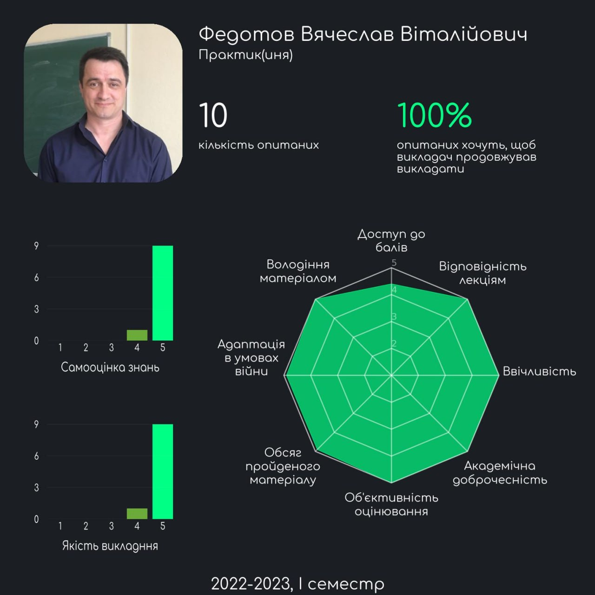

**Дисципліна:** фізика.

**Нотатки виживших:**

_«На онлайні та офлайні наче дві різні людини. Ставиться до предмету трохи пофігистично. Для людей, що готові мати поверхневі знання, ніби підійде його викладання, але не для повноцінного розуміння. На офлайні жартував над дівчатами не зовсім коректно, зверхньо, в той самий час вихваляв хлопців. Можна сказати, що це ж просто жарти, але було дуже багато сексизму, що, вважаю, від викладачів недоречно»._

_«Матеріал і свій предмет викладач знає чудово. Досить просто пояснює. Перед контрольними завжди розбирав аналогічне завдання. Але під кінець семестру виплив досить значний недолік із оцінюванням. У нього була якась своя система набору балів за кр, яку він не міг нормально нам пояснити, а силабусу ми навіть і не бачили»._

_«Федотов викладав фізику на першому курсі, проводив практичні та приймав лаби. Чесно, він не дуже серйозний викладач, часто міг розповісти якусь історію чи пожартувати, проте коли доходить до викладання, він може, вміє та розуміє. Більшість пар були поєднанням певних жартів, фізики та історій з життя, що, як на мене, досить ок))))»._

_«Провів дві пари й зник до кінця семестру, скинувши табличку, куди кожен писав свій бажаний бал, а він ставив його в кампус»._

### [Калита Віктор Михайлович](https://teletype.in/@iasa_sc/ByGFpjWoX)

<i>Викладач як лектор</i>

<i>Викладач як практик</i>

**Дисципліна:** фізика.

**Нотатки виживших:**

_«Можливо, на перший погляд можна подумати, що предмет не дуже відповідає комп. наукам чи сисану, проте викладацький підхід Калити Віктора Михайловича був для мене одним із найприємніших. Маю дуже багато приємних спогадів із лекцій: цікаві історії з життя в поєднанні з корисним матеріалом робили пари тим, чого чекаєш. Сам предмет присвячений більш комплексному підходу до фізичних явищ за допомогою методів мат. аналізу. Таке поєднання мені в свій час дуже подобалось. Калита дуже приємна людина та геніальний викладач. 10/10»._

_«Предмет цікавий, але після 1-го курсу ніде не застосовувався. Калита цікаво пояснює і виводить взаємозв'язки, закони по явищам, що вивчаються. До речі, це розкриває прикладний зміст багатьох тем з мат. аналізу»._

_«Калита топ, пояснює круто! На всі запитання відповість, якщо щось не розумієш — допоможе. Але й вимагає знань. На 60 закрити неважко, на 100 — доведеться задовбатися»._

_«Цікавий, розумний, дотепний і добрий дядько, пише та публікує свої статті в науковому журналі. Деякі з них, до речі, може показати на парі та розповісти якісь цікавинки) Матеріал подає зрозуміло, може, дещо швидко, проте він викладає за своєю методичкою, у якій все дуже доступно розписано, завжди можна прочитати та розібратися. Також ви будете здавати Калиті дві усні контрольні роботи протягом семестру. Для цього треба буде фактично вивчити його методичку. Питання дає рандомні, кому як пощастить. Треба пам'ятати всі формули й могти їх усно ротом відтворити та пояснити._

_Практик: Як не дивно, розв’язує задачі. Зацікавлений в тому, щоб його зрозуміли. Але від того всім не стає більш не чхати на ті задачі)»._

_«Його самовпевненість може спочатку навіть відштовхувати, але згодом вона стає приємною. Заняття схожі на ютуб канал з наукпопу»._

### Гусєва Юлія Ігорівна

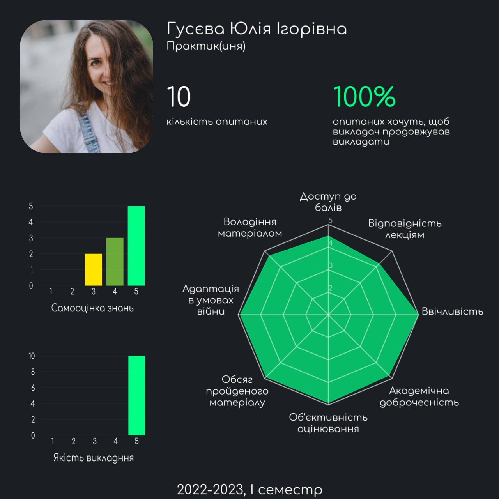

**Дисципліна:** фізика.

**Нотатки виживших:**

_«Прийомів лабораторних, як таких, не було, замість них були тести, тому здачі лаб також не надто напружували студентів. Сама лаборантка приємна, чуйна та лояльна.»_

_«Викладачка дуже гарно адаптувала умови здачі та виконання лабораторних. Чітко і якісно відповідає на всі запитання, робить підказки, які базуються на найпоширеніших помилках»._

_«Викладачка якісно організувала весь процес написання та здачі лабораторних робіт. Уся потрібна інформація була надана відразу в зрозумілому форматі. До кожної лаби прикріплені всі матеріали, потрібні для здачі на максимальний бал. До всіх моментів, на яких можуть виникнути запитання, вона зняла відеопояснення. Тож запитань у процесі виконання майже не виникало — просто сиди та роби, без жодних проблем. Проте якщо все ж виникали, викладачка завжди була рада на них відповісти та все пояснити. Процес навчання був гарно адаптований під дистанційку»._

### Іванова Ірина Михайлівна

**Дисципліни:** фізика.

**Нотатки виживших:**

_«Іванова — не дуже, криклива жінка, яка не дає знань. Приймає кожне дз із захистом, додає бали за вирішення задач на занятті.»_

_«Той рідкий випадок, коли тобі в обличчя наче нічого конкретно поганого не сказали, проте після пари з Івановою почуваєш себе морально приниженим і всеціло вижатим. Викладачка усім своїм видом та інтонацією показує, як її саму задовбало викладання цієї дисципліни, як вона чманіє від того, наскільки студенти «тупі», жодного разу не беручи до уваги той момент, що деякі, вступаючи сюди, не знали, що будуть вчити фізику, тому не вчили її в школі. Важко сказати, що викладачка зовсім поганс, адже всі оцінки були виставлені правильно, а на захисті дз були навіть деякі поблажки, проте саме ця манера викладання псує все враження не тільки про викладача, а й про предмет у цілому»._

_«Специфічна викладачка, при комунікації з якою потрібно просто не звертати увагу на те, що вона говорить і в якому тоні спілкується. Принаймні дає можливість спокійно захищати ДЗ наприкінці семестру, тобто не відразу все, але частинами. Давала додаткові завдання»._

### Каніовська Ірина Юріївна

<i>Викладачка як лекторка</i>

<i>Викладачка як практикиня</i>

**Дисципліни:** теорія ймовірностей і математична статистика.

**Нотатки виживших:**

_«Якість викладання чудова, але Ірина Юріївна весь семестри лякала нас екзаменом, відрахуванням і так далі. Хоча наприцінці виявилось, що причина не дарма: екзамен дійсно був доволі складним»._

_«Так залякали нас КІЮ, що було страшно ще до початку першої пари з нею. А фактично просто жінка, дуже схожа на вашу шкільну математичку, добре доносить матеріал і нормально оцінює. Знову ж таки якщо вчити предмет, то проблем не має виникнути»._

_«Ірина Юріївна чудесно й детально читає матеріал, і відповідно суворо вимагає знань та розуміння. ТЙ потребує знань з аналізу та алгебри, без них багато тем будуть взагалі незрозумілі. Дисципліна дуже знадобиться в подальшому: без розуміння ТЙ ви взагалі не вивчите статистику. І при вивченні більш практичних дисциплін, пов’язаних із машинним навчанням, ймовірність допоможе краще розуміти, що ж в тих алгоритмах відбувається «під капотом» і як воно працює»._

_«Викладачка досить багато вимагає знань з інших дисциплін, навіть якщо такі теми не були вивчені. Це досить незручно, адже матеріал і так досить важкий, а математичний апарат, який застосовується, ще більше»._

### Василик Ольга Іванівна

<i>Викладачка як лекторка</i>

<i>Викладачка як практикиня</i>

**Дисципліни:** теорія ймовірностей і математична статистика.

**Нотатки виживших:**

_«Ця людина спокійно та докладно (розжує буквально кожну незрозумілу частину) розкаже все, що вам цікаво або викликає труднощі. Василик не буде вас лякати цим дуже непростим предметом. Таких викладачів найбільше люблю: не буде змушувати вчити, але якщо є бажання, то можна добре засвоїти цей предмет. Сама організація була доволі доброю та компромісною для студентів. Якщо будете в неї — не соромтеся питати все, що невідомо!»_

_«На лекції ходити не було сенсу, адже вони складалися з читання методички, чим можна було б зайнятися й без участі викладачки. Ользі Іванівні не вистачає жорсткішого контролю за опануванням матеріалу студентами, адже дисципліна архіважлива для нас як для майбутніх фахівців. Але викладачка дуже лояльна, ввічлива, завжди піде назустріч, якщо людина цікавиться — усе залюбки пояснить. Проте знову ж таки, сподіватися на добросовісність студентів — справа невдячна :)»_

_«Ну це тихий жах: як лекції, так і практики. Монотонне бубніння матеріалу не сподобалося від слова зовсім, є чітке відчуття, що викладачці абсолютно на студентів, аби кр і рр були здані»._

### Самойленко Ігор Валерійович
 
**Дисципліни:** теорія ймовірностей і математична статистика.

**Нотатки виживших:**

_«Класний викладач, добре володіє матеріалом, розв'язувати задачки на практиках було просто, швидко та цікаво, нежорсткий та лояльний в оцінюванні, робота з ним завжди послідовна та результативна»._

_«Крутий виклад. Якщо щось незрозуміло, то можна запитати — завжди пояснить по поличках що та як працює. Лояльний в оцінюванні, йде на поступки. Якщо запізнився на кілька хвилин під час відправлення кр, то не знижує бали. Пари завжди записує та викладає на гугл диск, щоб можна було пізніше переглянути»._

_«Видно, що викладач зацікавлений у тому, аби студенти опанували відповідну дисципліну. Пояснення матеріалу дуже докладне та зрозуміле, йде назустріч студентам у розвʼязку питань різного характеру»._

_«Дуже лояльний викладач, не намагався нікого завалити. Його величезний плюс був у тому, що ІВ описував наші помилки та запобігав їхньому повторенню. У моменти жорстких обстрілів не ставив чітких дедлайнів, чим показував своє справжнє ставлення до студентів. Викладач мотивував якісніше вивчати дисципліну та розглядати виняткові моменти»._

_«Норм викладач, але іноді сам плутається в задачах»._

### Пилипенко Андрій Юрійович

**Дисципліни:** теорія ймовірностей і математична статистика.

**Нотатки виживших:**

_«Розумний дядько й класний предмет. Я вважаю, самому Пилипенку не вистачає структурованості як на лекціях, так і на практиках — він може повернутися через пів лекції назад зі словами «О, я тут дописати забув». Але так у нього хороша збірка із завданнями, є можливість вивчити предмет»._

_«Предмет легко позакривали ті, хто навчалися: відвідували пари, виконували домашні роботи. Чим більше ти нічого не робиш протягом семестру, тим більші до тебе вимоги наприкінці. Доходило навіть до усних співбесід з людьми, у яких він був не впевнений. Без знань предмет закрити важко, але це безсумнівно приємно, адже матстат — дисципліна важлива»._

### [Ільєнко Андрій Борисович](https://www.hashtap.com/p/Qbpy3r9RzVpZ)

**Дисципліни:** теорія ймовірностей і математична статистика.

**Нотатки виживших:**

_«Прекрасний викладач. Якщо б усі були такими — навчання в ІПСА було б близьким до ідеалу. Увесь матеріал проілюстрований цікавими прикладами та проєктований на життєві ситуації, що давали поняття, для чого нам цей предмет. РСО чітка та повністю дотримувалася. Дякую за такий прекрасний курс»._

_«Найкращий викладач математичних предметів, а, може, й взагалі ІПСА, принаймні на цій дисципліні. Усе дуже послідовно та легко вивчається. Де треба — нагадував і допомагав зрозуміти матан чи лінал, необхідний для дисципліни. Усі ним дуже задоволені: при тому, що дає дуже змістовну інфу, ще й не задовбує тих, кого не треба занадто, розуміє життєві обставини»._

_«Лекції ми дивилися самостійно, АБ проводив замість них консультації, де докладніше пояснював матеріал та розв'язував практичні завдання»._

_«Прекрасний чоловік, усе зрозуміло, доступно та розжовано. Його лекції нудні, але на 2х ідеально, так що на пару не заходила, але всі записи дивилася і залишилася задоволена»._

_«Креативність, запал, тактовність — то все про нього. 12/10 (не сарказм)»._

### Голіченко Ірина Ігорівна

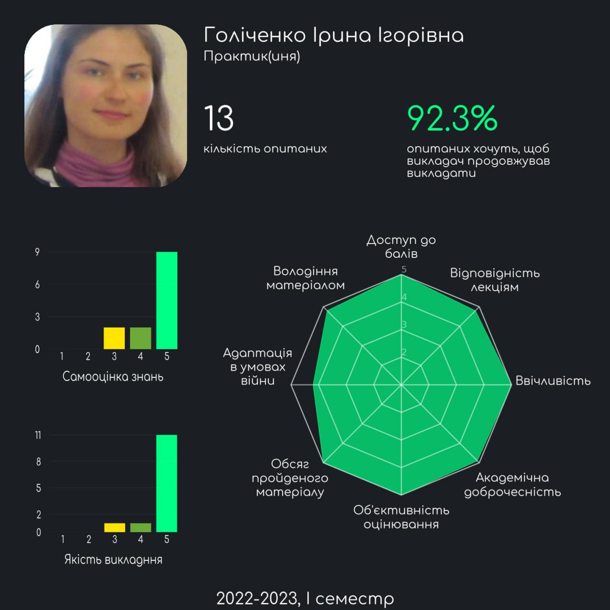

**Дисципліни:** теорія ймовірностей і математична статистика.

**Нотатки виживших:**

_«Більш-менш нормальна викладачка. Дз було складніше матеріалу, розглянутого на практичних заняттях, але в разі нерозуміння вона пояснювала все, що цікавило. Трохи прискіплива в перевірці КР / РР. Приємна жінка»._

_«Ірина Ігорівна зрозуміло подавала матеріал практичних занять, іноді викликала занепокоєння через відмінність домашнього завдання від розглянутого на парі відповідно до рівня складності, але в разі проблем викладачка пояснювала незрозуміле та розв'язувала задачі, що викликали труднощі. Щодо оцінювання контрольних робіт виникали питання за незначні зняття балу за надто дрібний начерк написаного або інші проблеми в оформленні. Не думаю, що доцільно зважати на такі дрібниці, але дуже великої халепи зняті копійки не викликали, тому не можна вважати це недоліком. Викладачка доволі лояльна, завжди йде назустріч студенту в разі виникнення проблем»._

### Павленков Володимир Володимирович

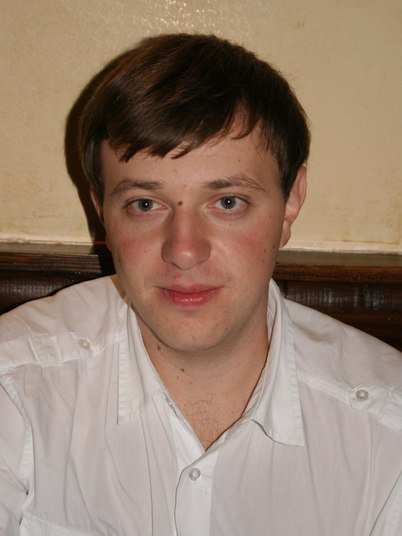

**Дисципліни:** теорія ймовірностей і математична статистика.

**Нотатки виживших:**

_«Через надмірно розмірений тон і спокійний голос пари здавалися нудними, хоча матеріал був у міру важким. Тому людей на його пари приходило замало. Було в нас 2 кр та 1 рр. Усі роботи та матеріали скидали (і ми, і він) у чат телеграму, що зручно. Перед кр робив розсилку матеріалів у особисті відкладеними повідомленнями. Щодо оцінювання: досить лояльний та й у спілкуванні приємний»._

_«Практик — клоун, просто клоун. Розв'язувати 3 легкі задачі впродовж заняття та задавати 15-20 значно складніших для виконання вдома. КР теж прикол, оскільки можна було отримати як 3 задачі одного типу (на кожну 5-10 хв), а можна — 3 задачі різних видів, у кожній з яких тільки розбиратися хвилин 20»._

### Боднарчук Семен Володимирович

**Дисципліни:** теорія ймовірностей і математична статистика.

**Нотатки виживших:**

_«Із касти тих, хто вимагає, але й дає. Пояснює дуже круто, хоча ми й вивчаємо трохи спрощену програму, порівняно з ММСА та ШІ. Я навіть усі його пари подивився. Предмет доволі корисний буде, якщо хочеш кудись у дс / аналітику / мл тощо»._

_«Пояснює складні речі простою мовою, до того ж практики проходять цікаво та з гумором, гарна перевірка на контрольних і навіть на розрахункових обмежує списування. А це зі свого боку спонукає докладати більше зусиль для тих, хто недостатньо вивчає важливий предмет»._

_«Один із найкращих викладачів за 2 роки навчання: змістовні та цікаві практики, готовий іти на діалог (проводити консультації тощо), ідеальне знання свого предмету та навіть більше — куплена ліцензія зуму, створено чати в телеграмі. Жодних зауважень до викладача»._

### [Древаль Максим Михайлович](https://medium.com/@iasa/dreval-74bfecaee037)

<i>Викладач як лектор</i>

<i>Викладач як практик</i>

**Дисципліни:** об’єктно-орієнтоване програмування.

**Нотатки виживших:**

_«Контрольні тести були швидкими й доволі жорсткими, особливо перший, проте вони точно непогано показували, хто готувався та вчив теми (або знайшов таку людину на допомогу), а хто — ні (в умовах полегшення списування під час дистанційки). Іспит також відбувся в хорошому режимі, як із програмною частиною, так і з усною співбесідою — він дійсно зміг оцінити рівень знань після його лекцій. Також ідея, по суті, курсової роботи, яка називалася семестровою та була шансом отримати бали замість екзамену, теж виявилась дуже корисною для вивчення нових технологій і використання ООП не в калічних лабораторних із цієї дисципліни. І тут він порадував принциповістю й тим, що вивів декількох людей із чужими роботами на чисту воду»._

_«Прекрасний викладач! Здебільшого студенти сприймають його як наставника, людину на своїй хвилі. Проте стосунки були в межах субординації, все одно треба було ретельно готуватися до захистів і мати на увазі те, що за знайдений плагіат роботу може бути анульовано. У лекціях здебільшого була вже відома раніше інформація»._

_«Потужний викладач, знає свій предмет. Дуже вимогливий, без знань не здасть ніхто. Хотілось би більше реальних кейсів у курсі, оскільки практичні заняття, по суті, це просто захист лаб, а якихось прикладних застосувань коду максимально мало. Тут лише «гугл у допомогу»»._

_«Чудовий викладач, якого було дуже цікаво слухати, приємна людина, завдяки його поясненням предмет був зрозумілим, а ще додає до презентацій картинки котиків. Загалом, найулюбленіший за семестр!»._

### Пишнограєв Іван Олександрович

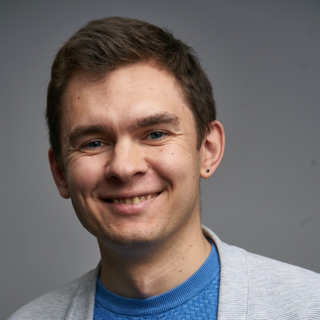

**Дисципліни:** об’єктно-орієнтоване програмування.

**Нотатки виживших:**

_«Нормальний, приємний викладач, діставав на захистах, але інше ок. Лекції більш-менш, хоча початок був прям — основи Java. Чогось особливого сказати не можу, лаб було 7 + мкр (тестик), хотілося більше цікавого, але все ж не забуду розробку одного практичного рішення на багацько рядків коду»._

_«Була лиш одна лекція, потім запропонував пройти курси на курсері. 3 чи 4, точно не пам’ятаю. Було з R і Python, за ними й виставив бали, пар не було»._

_«Якщо коротко, то це справді чудовий викладач, мабуть, найкращий, що був на другому курсі. Лабораторні роботи оцінював лояльно, їх захист також. На захистах не тільки перевіряв знання теорії, а й сам розповідав такі собі лайфхаки та інші способи покращити програму. Активний у телеграмі, постійно з нами спілкувався й жартував. Лекції я відвідував тільки перші, далі перестав за сімейними обставинами. Але матеріалів його презентацій цілком вистачало для написання та захисту робіт»._

_«Весь потік украшився в нього. У нас він вів ООП і був відповідальний за курсач із баз даних. ООП проводив регулярно, лише іноді пропускав пари, але матеріал, який уважав за потрібне, вичитав за місяць-півтора до закінчення семестру. Були лаби та 1 мкр у вигляді гугл-форми. Дуже ввічливий і приємний у спілкуванні та здачі лаб викладач»._

### Булах Богдан Вікторович

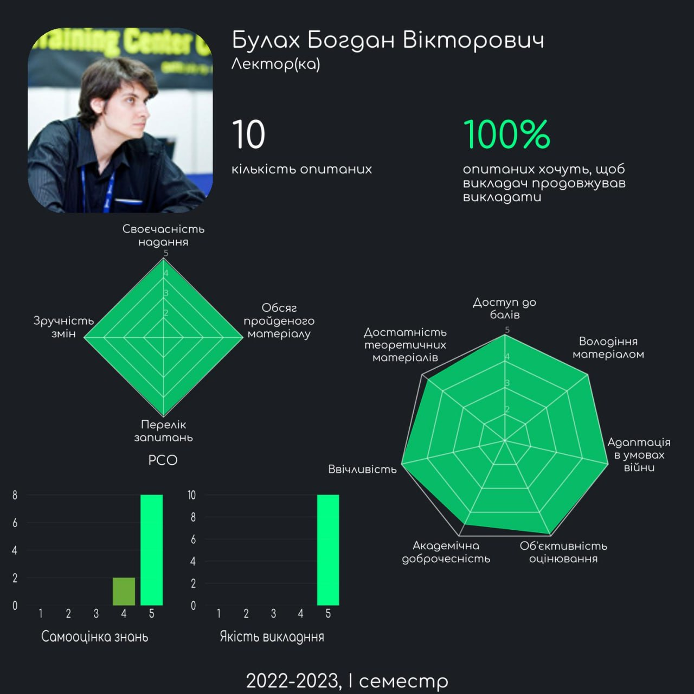

**Дисципліни:** об’єктно-орієнтоване програмування.

**Нотатки виживших:**

_«Можливо через необов'язковість відвідування занять та досить пасивні лекції, людей на парах було мало. Якщо чесно, на лекціях було не дуже цікаво, мабуть, тому що викладач розповідав те, що ми бачили на проекторі й не дуже заохочував нас. Було достатньо добре написати лабораторні та контрольну з курсовою роботою, щоб отримати високу оцінку»._

_«Один із найкращих викладачів. Із ним було легко комунікувати, відповідав відкрито на всі запитання та дійсно хотів допомогти студенту. Лекції цікаві та змістовні. Повністю адаптував навчальний процес до умов війни, не зменшивши якість. Захист лабораторних робіт проходив у зручний студентам час. Він не змушував хвилюватися — викладач слухав та хотів зрозуміти, що хоче донести студент, підтримував діалог і дійсно об'єктивно оцінював»._

_«Булах наче здравий чел, і лаби нормальні, пов'язані з курсачем, і вибір мови програмування та теми дає. До нас, щоправда, на здачі через дрібниці прискіпувався, але тільки тому що він не розумів, де ми той курсач писали. Якщо подобається кодити — буде легко і цікаво, як ні — Бог у поміч»._

### Мироненко Сергій Сергійович

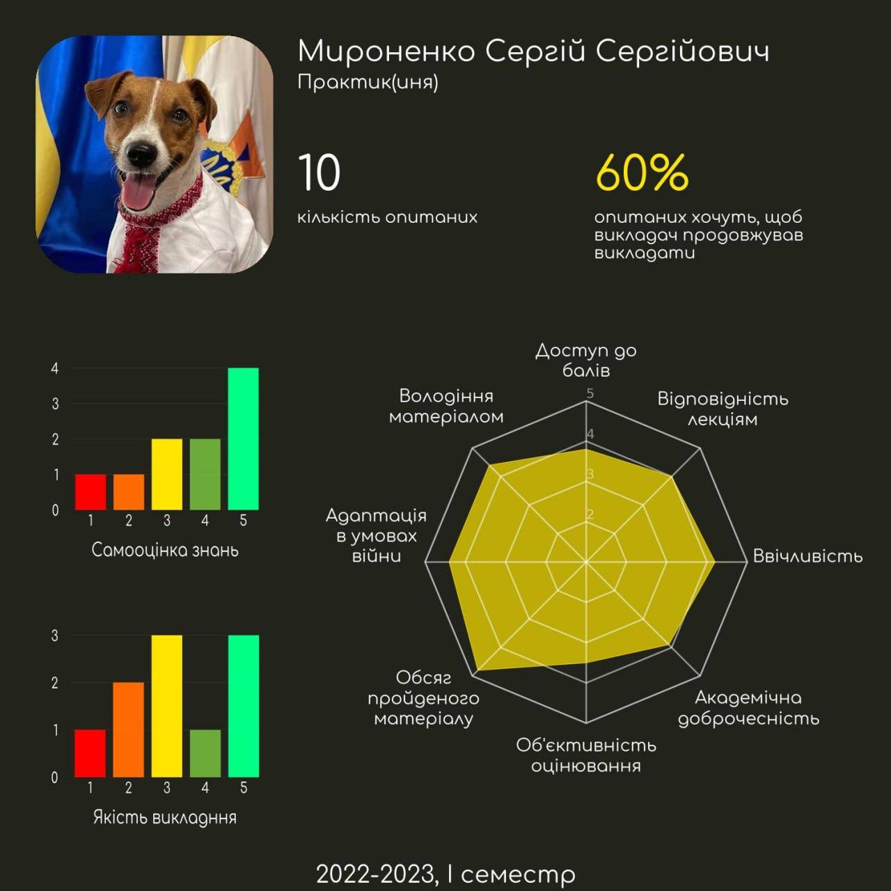

**Дисципліни:** об’єктно-орієнтоване програмування.

**Нотатки виживших:**

_«Цікавий практик, позитивний. Спочатку від нього не було ні слуху ні духу пів семестру, потім з'явився й кинув лабораторні. Загалом, Мироненко не створював проблеми в найважчий час і йшов назустріч студентам відразу після перших ударів по енергетичній інфраструктурі. Дякую»._

_«Я не розумію, як цей викладач працює. Зв'язатися з ним неможливо. Враження, ніби він взагалі не веде практики, а займається чимось іншим. Про досвід спілкування з ним: ми домовлялись про усну здачу роботи. Він її не провів і нічого про це не сказав. На останнє запитання, що я йому надіслав 13 грудня він не відповів досі. Комунікувати з цим практиком просто неможливо»._

_«Класний викладач, який не лише добре володіє теорією з предмету, а й також завжди надає актуальну інформацію з програмування та розробки програмного забезпечення»._

### Дмитрієва Ольга Анатоліївна

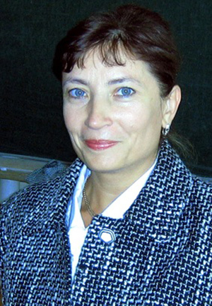

**Дисципліни:** обчислювальна математика, чисельні методи.

**Нотатки виживших:**

_"Насправді, я обирала СРОМ (Спеціальні розділи обчислювальної математики), аби потрапити до Хоменко Ольги Володимирівни, яка чудово викладала Чисельні методи на 2 курсі. Проте перед початком семестру студентам повідомили, що лекції та практики в нас вестиме інша викладачка. І я дуже хочу подякувати Ользі Анатоліївні за те, що попри складні обставини, велике навантаження на неї в іншому університеті та те, що це був її перший семестр викладання в ІПСА, вона змогла оперативно та максимально якісно організувати навчальний процес. РСО та всі необхідні для виконання практичних робіт матеріали вона надала нам на першому ж занятті. Бали за вхідний контроль знань з ЧМ були нараховані як додаткові, що відчутно допомогло на сесії. Усі лекції записувалися та викладалися на ґуґл-диску. А з посиленням обстрілів та впровадженням графіків відключень електроенергії Ольга Анатоліївна першою серед викладачів скасувала дедлайни виконання практичних робіт та не знижувала оцінку, якщо студент не міг бути присутнім на захисті своєї роботи. Тим, у кого ж таки виходило бути на парах, Ольга Анатоліївна надавала детальні пояснення щодо помилок / неточностей у реалізаціях програм і протоколах, відповідала на всі запитання, а за потреби, навіть демонструвала деякі деталі на прикладах інших варіантів завдань. _

_У цілому, після семестру вивчення СРОМ у мене залишилися винятково позитивні враження, і це на 100% завдяки Ользі Анатоліївні»._

_«Я майже не ходив на заняття, спочатку не сподобалося, або, можливо, через мою недисциплінованість. Лабораторні роботи писались фактично без особливих знань, просто базовий Пітон + перегляд лекцій або методи. Лекції були досить приємними, усі пояснення були чіткими»._

### Шубенкова Ірина Анатоліївна

<i>Викладачка як лекторка</i>

<i>Викладачка як практикиня</i>

**Дисципліни:** обчислювальна математика, чисельні методи.

**Нотатки виживших:**

_«Займалися реалізацією алгоритмів для наближених обчислень. На лекціях розглядали лише теоретичний підхід. Шубенкова є досить лояльною викладачкою, навіть кілька разів їздив здавати лаби в 35, спогади про очку сюди. Нескладний предмет, місцями цікавий»._

_«У першому семестрі думка була трохи кращою, ніж у другому, але все ж... Клоунеса, яка не розуміється в коді та дивиться тільки звіт, приймаючи будь-що. Знає предмет із математичного боку, давала кумедні додаткові завдання, іноді ставила цікаві запитання. 2 КР на семестр: на них іде дуже багато часу й зусиль, але найбільш імовірно, що вона їх не перевіряє, а ставить бал у випадку вчасної відправки роботи»._

_«Методичного матеріалу відносно достатньо, захист лабораторних робіт здійснювався доволі лояльно, викладачка в разі недосконалого виконання роботи чи оформлення звіту просила надсилати виправлення (без штрафних балів), знання теорії вимагалося, інколи відповіді на поставлені запитання було неможливо знайти в матеріалах лекції»._

_«Лабораторні перевірялися невідомо як, під час їх здачі викладачку цікавила тільки аналітична частина, у коді могло бути написано що завгодно, тому було просто здавати паль і не паритися, але теорію вона інколи запитувала»._

### Петренко Анатолій Іванович

**Дисципліни:** обчислювальна математика, чисельні методи.

**Нотатки виживших:**

_«Відверто кажучи, викладачу вже багато років. Він гарний спеціаліст, проте не дуже хороший викладач. Лекції дивитися важко, але вимоги дуже суворі. За семестр були дві кр на дві години, які відповідали лекційним матеріалам, проте були досить складні, тому за 2 години було важко встигнути. В умовах війни не кожен міг почати відразу, тож просто не встигав зробити навіть половини»._

_«Старий маразматик, який перестав, нарешті, бути головою кафедри. Лаби приймає не він, але в нього буде кілька КР, які треба робити. Теоретично, 60 отримаєте й без КР, але КР дають надто багато балів. На пари можна не ходити, не пам'ятаю, щоб за це давали бали. Кр досить нескладні, якщо розуміти, що там. Теоретична інформація повністю є в методі, практики трохи не вистачає»._

_«Говорити з ним не має сенсу, бо він тебе не чує, як і ти його не розумієш. Контрольні — просто кидаєш щось і він запускає рандом, ось так і оцінюється»._

### Вербицький Євген Володимирович

**Дисципліни:** обчислювальна математика, чисельні методи.

**Нотатки виживших:**

_«Викладач відразу повідомив, як будуть проходити здачі лабораторних робіт, і не пропустив жодного заняття. Проводив практики та захист лаб у Скайпі. Дуже відповідально поставився до викладання на дистанційці»._

_«Приємна людина, щоправда, залежить від настрою. Якщо він, так би мовити, «не дуже», то захистити роботу важче, бо можуть бути більш складні / дивні запитання. Якщо настрій у нормі, то все легко й швидко. Коли по відповідях бачить, що ти знаєш, навіть недосконало, то оцінка буде досить приємна. Погану ставить лише якщо ти взагалі не розумієшся на темі. На практиках дає змогу зробити додаткові завдання й отримати бали, але зазвичай задачі ніхто не робить, бо балів і так вистачає.»_

_«У мене приймав лабораторні з чисельних методів. Цікавий викладач. Оцінка лабораторної залежить від настрою викладача, що є недоліком. Загалом, гарно розписаний час приймання лабораторних: на кожного студента виділялось 5 хвилин. Також ми самі обирали час, коли зручно захищати роботи. Вербицький проводить ще практичні заняття з чисельних методів, але більшу частину завдання виконують саме студенти, адже декілька людей готують їх до заняття й потім розповідають про їхні розв’язки. У цілому — нормальний викладач, наприкінці семестру за лабораторні та практичні роботи всі отримали високі бали.»_

_«Суперлайтовий викладач, ну прямо дуже лайтовий. Він такий собі лаборант, який приймає лаби в 1-15 варіантів у групі. На захисті не потребує ні демонстрації екрану, ні вебки. Лабу не перевіряє, а просто ставить 3-4 запитання з контрольних. Якщо говориш йому, що не знаєш, то починає пояснювати, хоча воно тобі зовсім не потрібно.»_

### Бритов Олексій Анатолійович

**Дисципліни:** обчислювальна математика, чисельні методи, архітектура систем та комп’ютерних мереж, схемотехніка.

**Нотатки виживших:**

_«Приймав лабораторні роботи, загалом усе добре, проте об'єктивність оцінювання залежала від настрою. Тобто: якщо максимальний бал 10, може поставити одне легке запитання та й буде 10. Проте тоді були випадки, коли студент відповідав на всі запитання, а отримував 8.»_

_«Він приймав лише лаби з чисельних методів та архітектури систем та комп’ютерних мереж. Коли перевіряє роботи, трохи душить, але якщо нормально підготуватись і виглядати впевнено, то все буде окей. Якщо й валить, то за роботу ставить мінімум половину оцінки, навіть, якщо ти не відповів на жодне запитання. Загалом класний, але багато дівчат чомусь казали, що бояться його...»_

_«Спочатку на перевірку надсилається протокол а потім захист із запитаннями по теорії з лаби. До початку повномасштабного вторгнення Бритов був лайтовішим, йому буквально було достатньо, коли я з протоколу читав те, що він просив. Навіть непрацюючу паль іноді приймав. Після повномасштабного в нас скасували захисти і він став набагато прискіпливіше дивитися на лаби й чіплятися буквально до всього.»_

### Коваленко Анатолій Єпіфанович

<i>Викладач як лектор</i>

<i>Викладач як практик</i>

**Дисципліни:** архітектура систем та комп’ютерних мереж, схемотехніка, операційні системи.

**Нотатки виживших:**

_«Цікавий предмет про базові поняття з операційних систем. Вів Коваленко не дуже цікаво, але мав багато лекційного матеріалу, який вичерпно покривав лаби та кр.»_

_«Якісь базові речі операційних систем отримано, але Коваленко — чоловік у віці, який читає методичку. Ілюстрацій і складних концепцій мінімум, купа тексту, лаби покривають заледве 1/10 від усього матеріалу. Можна було викладати значно краще.»_

_«Здається паль. Предмет забувається. Крапка.»_

### Тимошенко Юрій Олександрович

**Дисципліни:** архітектура систем та комп’ютерних мереж, схемотехніка. 

**Нотатки виживших:**

_«Інколи було смішно»._

_«Юрій Олександрович, безумовно, людина старої школи, яка схиляється до очного відвідування занять, зрозуміло, що за можливості студента. Реакція на відсутність студента на парі (наприклад, через проблеми з електропостачанням) викликала бурхливу реакцію й коментарі формату «немає на занятті — немає бажання вчитися, немає світла — є мобільний інтернет». Пояснення балів за МКР не надавалося, деякі варіанти містили в собі завдання, які не вивчалися під час курсу. Також доволі важливими для Юрія Олександровича є не знання з предмету, а кругозір здобувачів освіти, тобто відповіді на запитання, що не стосуються дисципліни. Дуже багато води, а прикладного значення з неї мало, тому «MAKE, CREATE, INNOVATE»»._

_«Недоладний викладач, який любить звертати з теми схемотехніки будь-куди: чи то в бізнес, чи то в загальну освіченість, програмування, нейробіологію. Щось я з ним зрозумів, але це точно не було легко: дуже складно слідкувати за його думками. Він удає, що є одним із тих крутих викладачів з онлайн-курсів усіляких прінстонів і гарвардів, але об'єктивно не є таким, і тому виходить дуже посередньо та неоднорідно. Хоча деякі практики мені сподобалися, загалом не рекомендую»._

_«Виставляє бали навмання за однією контрольною та типу роботою на парах, але зароблені бали ніяк не контролюються. Матеріал практик хаотичний і не відповідає лекціям. Ніколи не знаєш, що тебе чекає далі, але можна вивезти за допомогою логіки»._

### Стіканов Валерій Юхимович

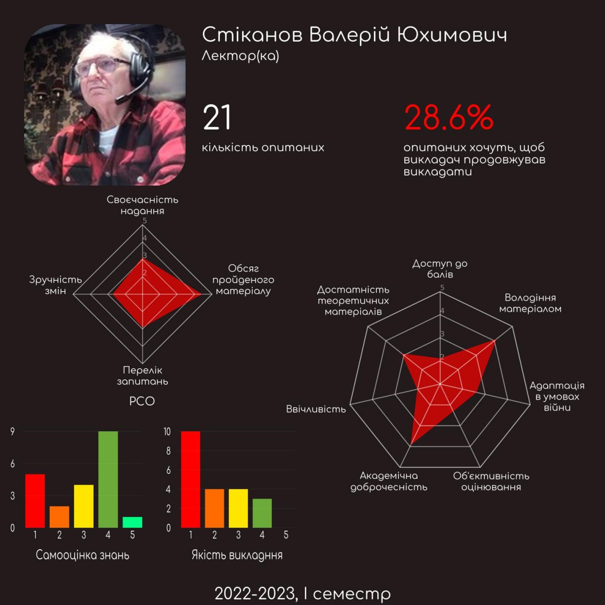

**Дисципліни:** архітектура систем та комп’ютерних мереж, схемотехніка.

**Нотатки виживших:**

_«Викладач володіє матеріалом добре, але зовсім не був здатний донести його до студентів, постійно говорив щось собі під ніс та писав незрозумілі каракулі. Роботи приймалися пізно ввечері та вночі. Дуже тисне на студентів, що є неприпустимим у навчанні, адже це відвертало увагу від вивчення дисципліни та повністю направляло її на взаємовідносини з викладачем»._

_«Викладач не розумів усієї картини умов відключень електроенергії, майже не змінив захист лабораторних робіт відповідно до цього, тому студентам у різною мірою було важко»._

_«Найгірший викладач за всі два роки. Абсолютно неадекватний, з ним неможливо йти на компроміси чи якось спілкуватися без заспокійливих. Його логіку прослідкувати неможливо, тому будь-яка здача сам на сам перетворюється на гру в сапера»._

### Артюхов Віталій Григорович

**Дисципліни:** архітектура систем та комп’ютерних мереж, схемотехніка.

**Нотатки виживших:

_«Зважаючи на сумнівну актуальність дисципліни, для виконання лабораторних використовувався гугл, оскільки на лекціях лише незрозуміла монотонна вода. Протягом року було незʼясоване рсо. Доволі часто на лекціях уточнювались якісь нюанси стосовно ргр / екзамену, але на них особливо й не відповідали. Також за відвідування лекцій ставили бали, що, як на мене, не зовсім розсудливо. У підсумку: невідповідність лекцій самим лабам, низька якість лекцій, незрозуміле РСО, як і бали за РГР, малий фідбек при перевірці робіт на застарілій дисципліні, як і наповненість матеріалів для лабораторних — вбивають будь-яке бажання вчити дисципліну й нічого після себе не залишають...»._

_«Неприємно — це коли викладач надсилає файли у форматі .cir. Не сказати, що спричиняє лише один негатив, але й позитивного нічого немає. Просто нейтрально»._

_«Своєрідний викладач, не був на лекціях, мабуть, ще й шарить за матеріал. На комісії сміявся з інших професорів, йому було однаково на них, але не на студента, ставив суперлегкі запитання. Особливостей немає, тільки лекції та на телефон дзвонить запитати стосовно РГР, яку ти списав. Був лише на одній парі: читає лекцію з пдфніка»._

### Кирюша Богдан Анатолійович

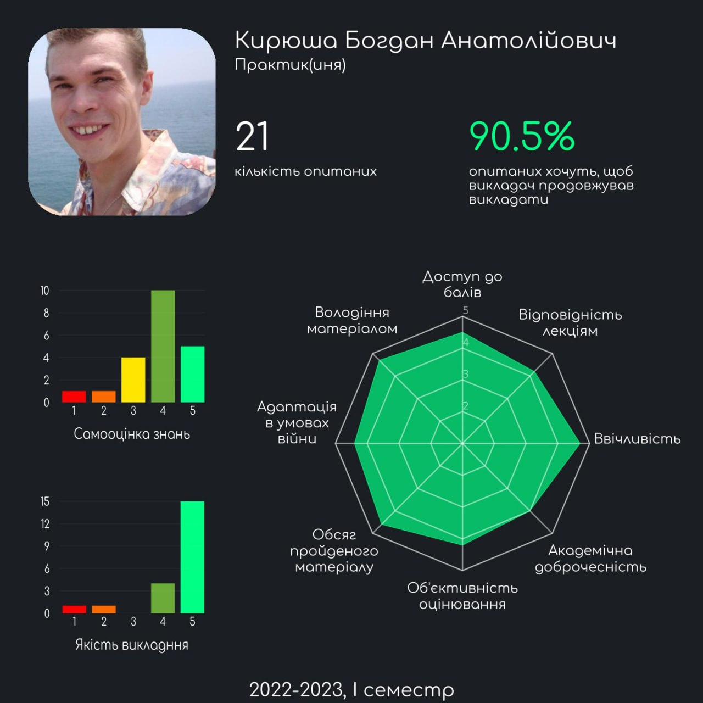

**Дисципліни:** архітектура систем та комп’ютерних мереж, схемотехніка.

**Нотатки виживших:**

_«Приймав лабораторні роботи з асемблеру (В ДИСКОРДІ!!!). Перед кожною новою лабою проводив додаткові заняття, де показував щось з асемблеру. Проте це, зазвичай, не рятувало від того, що завдання були незрозумілі, і шукати інфу треба було самостійно. Наскільки суворо приймає роботи — залежить винятково від його настрою. Для мене він один із найбільших душніл на СП. Проте так само можна зустріти безліч позитивних відгуків про Кирюшу»._

_«Доволі лояльний, не має на меті завалити. Якщо чогось не знаєш, то він залюбки проведе невелику лекцію, де до дрібниць пояснить усі нюанси, які, імовірно, забудеш. А також не любить халявщиків наприкінці семестру. З мінусів: його настрій залежить від катки в доті. Буквально»._

### Гіоргізова-Гай Вікторая Шалвівна

**Дисципліни:** архітектура систем та комп’ютерних мереж, схемотехніка.

**Нотатки виживших:**

_«Як лекторка непогана, але має дуже застарілі матеріали, ще й російською мовою. Як лаборантка — приймає роботи довго й ставить дуже багато запитань. Зазвичай усі здавали лаби другому лаборанту, він був не такий душний і прискіпливий. Проте курсову роботу всі здавали саме Гіоргізовій-Гай. І вона приймала кожну курсову 1.5 години, запитувала дуже специфічним чином: формулювала запитання дуже довго й хотіла почути коротку конкретну відповідь. Якщо думка виходила за рамки «коротка», то викладачка не давала можливості висловитися до кінця. Мене особисто дратувало те, що за час захисту десь година йшла на формулювання безпосередньо запитань, що більшу частину часу на твоєму захисті говорить викладач. Проте краще її не перебивати та намагатися здогадатися, що вона хоче почути»._

_«Спочатку сказала, що можна перескласти КР пізніше, а потім уже надіслала оцінки до Стіканова, порушивши свої слова»._

_«Досить вимоглива пані. Штурхає відносно заслужено. Постійно необхідно бути на зв'язку, запитувати. Тоді з нею буде трохи легше на захисті курсової. Дуже довго пояснює очевидні речі. Іноді консультації перетворюються на тортури. Ти питаєш щось, вона чесно й коректно відповідає, але іноді або навіть зазвичай її відповідь зачепить увесь курс або окремі розділи. Сиди слухай»._

### Круш Ігор Володимирович

<i>Викладач як лектор</i>

<i>Викладач як практик</i>

**Дисципліни:** операційні системи.

**Нотатки виживших:**

_«Найкайфовіший викладач, приймав курсову та проводив лекції з ООП, завжди має влучні поради в коді та аншлаги на лекціях, бо файно все розповідає»._

_«Узагалі викладач класний: і в телеграмі побалакати може на інші теми, щодо того ж коду — не булить. Молодий аспірант — це завжди приємно. На пари з ПАОА (Проєктування та аналіз обчислювальних алгоритмів) знову ж таки ніхто не ходив — писали по 2-3 задачки на літкоді на лабу й захищалися. Теж пояснить, допоможе. Може сказати дописати і доздати, але бали знімає нормально так за косяки. Ще є проблемка в тому, що з'являється цей пан у випадку ПАОА десь у середині семестру, а у випадку ОС — наприкінці. Тим, кому сильно все одно, чи хто не встигає, чи ще щось, дозволяє записувати захисти у вигляді відео на 3-10 хвилин, заливати на ютуб і кидати лінк йому в телеграм. Якщо там усе нормально — ставить бал, якщо є запитання — може викликати в зум поспілкуватися, хоча такого наче ні з ким не було»._

### [Горбань Наталія Володимирівна](https://www.hashtap.com/p/rEMd5LLB9LwN)
 

<i>Викладачка як лекторка</i>

<i>Викладачка як практикиня</i>

**Дисципліни:** диференціальне рівняння, теорія стійкості та варіаційне числення. 

**Нотатки виживших:**

_«Дуже позитивна, завжди з розумінням ставиться до ситуації, гарно подає матеріал. Працювати з викладачкою дуже комфортно та цікаво. Через вимогу написання конспекту лекцій та фотозвіту (для зарахування домашнього завдання) на її предмет витрачалося багато часу, і, як наслідок, отримано непогані знання та навички»._

_«Дуже приємна людина, чудово підлаштовувалася під тяжкі обставини, викладання іноді трошки нудне або незрозуміле, але загалом це 5/5, змусила нас писати конспекти та дз, тож диффури знає весь поток»._

_«У неї досить структуровані конспекти, хороші практики та файли з прикладами до дз, та й просто з демонстрацією матеріалу. Але мені особисто не зайшло: було відчуття, що нас просто вчать розвʼязувати певні типи рівнянь, за фактом знань там небагато, більше вправи на запам'ятовування та повторення її прикладів. Теж бентежить щотижнева здача конспектів, тому що їх просто часто переписували без розуміння, що там написано, «аби здати»»._

### Капустян Олексій Володимирович

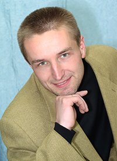

**Дисципліни:** диференціальне рівняння.

**Нотатки виживших:**

Пан Капустян раніше не викладав у ІПСА, лише у ФКНК КНУ, тому нижче буде розглянуто їхні враження:

Неймовірна дивина: наразі він у них не викладає.

### Терентьєв Олександр Миколайович

**Дисципліни:** вступ до інтелектуального аналізу даних.

**Нотатки виживших:**

_«Викладачі в державному університеті України мають спілкуватися українською. Аж ніяк не російською. Також мають ставитися з повагою до студентів, а не як до шматка лайна»._

_«Викладач, як мінімум, міг би зробити окремий чат для кожної групи, у якої проводить пари, бо так повідомлення з чужих пар із посиланнями на «екстремум — це» з Вікіпедії приходить усім, хто не зам'ютив та не заархівував чат. Це не говорячи про те, що рівень складності предмету (Методи оптимізації) у викладача був просто смішний після всіх спеціалізованих математичних дисциплін. На парах відчуваєш себе школярем-старшокласником»._

_«Досить непоганий викладач, знає предмет, який викладає, і дійсно показує на практиці застосування аналізу даних. Також на його парах буває цікаво, оскільки Терентьєв намагається максимально недушно взаємодіяти з нами. Єдине запитання виникає щодо оцінювання лабораторних і як написання есе (перша лаба) стосується теми предмета. Здається, першу та другу лабораторні він оцінив на максимум за те, що вони просто були, а ось третю він уже відкривав, але там була можливість просто взяти чужу роботу й здати, а Терентьєв навіть не помітив. Виходить, у плані подачі матеріалу та проведення лекцій і практик викладач хороший, але теми лабораторних робіт та їхня перевірка викликають сумніви»._

### Іщенко Ганна Валеріївна

**Дисципліни:** вступ до інтелектуального аналізу даних.

**Нотатки виживших:**

_«Чудова лекторка, гарно ставиться до студентів, іде назустріч. Лабораторні приймала без захисту, майже завжди з максимальними балами, навіть якщо ця робота була вже здана й не один раз)) Проте наприкінці семестру було непорозуміння з приводу виставлення оцінок. Оскільки на ІАД є два лаборанти: одна, власне, Іщенко, а інший — Сергєєв-Горчинський. Вони мали поділити всі лаби й усі роботи навпіл між собою. І позаяк переважна більшість студентів здавала роботи Іщенко, то прийшов час, коли вона сказала, що більше роботи не приймає, і далі їх буде приймати тільки пан Горчинський. Але в студентів не було контактів Горчинського, і він любив просто зникати й не перевіряти роботи. Так сталося, власне, наприкінці семестру: коли останній тиждень перед завершенням семестру Горчинський зник, і багато робіт висіло неперевіреними. Іщенко, як лекторка, сказала, що буде виставляти оцінки якогось там числа (за 2 чи 3 дні до закриття відомостей), і що всі роботи мають бути здані до цього часу. Але пан Горчинський до того часу не з’явився, а Іщенко було все одно: сказала, що це наші проблеми, хоча сама не змогла зв’язатися з Горчинським. Тож іноді з нею можуть бути проблеми, проте загалом добра й лояльна викладачка»._

_«Не виділяється високими знаннями програмування. Вона-то визначить, де функція, а де логіка, та й не виникне труднощів визначити мову програмування. Однак ключове слово «визначити» — щоб розібратися в коді вона не помічниця»._

### Сергеєв-Горчинський Олексій Олександрович

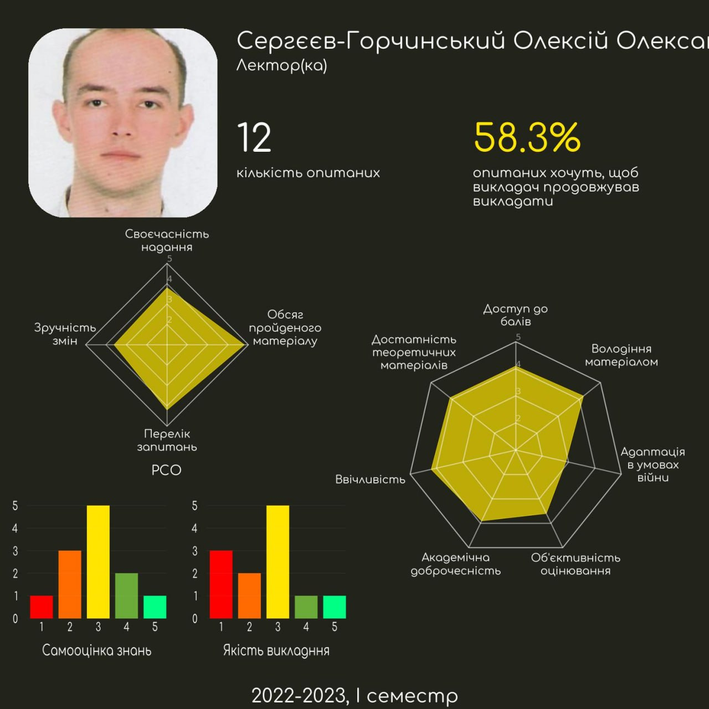

**Дисципліни:** вступ до інтелектуального аналізу даних.

**Нотатки виживших:**

_«Це якийсь прикол. Перші пари проходили так: усі студенти й він у муті. Ну й у чаті в гугл-міті теж було заборонено писати. Сидить пихтить не може встановити щось на убунту. Така тиша була десь третину-половину пари. Для розуміння ніякого передслова не було по типу: «Зараз я ставлю докер, докер це...». Ні, він просто сидів мовчки із самого початку пари з демкою екрану й щось ставив через термінал. _

_Лекції — це ще більший мем. Він просто листає презентацію й час від часу щось говорить. Суть така: _

_1. Новий слайд._

_2. Студенти читати._

_3. Див. п. 1._

_Ось так все і проходило. Коли його запитали, чому він мовчить, відповів, що так важко сприймати інформацію, коли текст на екрані читає оповідач — і, не повірите, це справді так, але є одне АЛЕ… Деякі викладачі чомусь думають, що це крутезна ідея вліпити текст на весь слайд. Можливо, це варіант, якщо буде використовуватися просто як література. Проте якщо ви все ж хочете ПРЕЗЕНТУВАТИ лекцію, то слайди мають складатися з ілюстрацій речей, про які ви говорите, ну й мінімум тексту (не більше речення)._

_На початку пари дають питання, і протягом дня на них треба знайти відповіді. Презентація з'являється на гугл-диску далеко не відразу після пари. Зазвичай, уже ввечері._

_У викладача є унікальний дар ставити так питання, що конкретне значення не може зрозуміти вся група. Не хочу здатися грубим, але це дійсно так. Контрольні запитання зі СБД перетворюються у філософію і сидиш-гадаєш, що малося на увазі._

_Протоколи дійсно гарні. Дуже непогано складені. Достатньо теоретичної і практичної частини для виконання та захисту._

_Ви маєте самі здогадатися, що у вашому протоколі повинні бути виконані не тільки пункти, що просять, але й усі операції з теоретичної частини. Ніби нічого страшного, але краще все ж речення про це десь написати._

_Захисти лаб теж зазвичай проходять на високому рівні. Спочатку вас поганяють по теорії, потім ви запускаєте програму, у якій реалізували застосування БД за допомогою якоїсь МП. Також може попросити написати якийсь запит до БД. Якщо щось незначне не знаєте, то підказує, як до цього дійти логічними висновками, або якщо це якийсь факт про БД, то разом перевіряєте його. _

_На захистах він зазвичай крутий, але якщо, не дай Боже, у нього щось до вас не виходило, то пишіть «пропало», буде дуже детально й багато запитувати, але при цьому, якщо на все правильно відповісти, то бали не зніме. _

_Для звʼязку використовувалися чати в гугл-спейсах. Їх було стільки, скільки всесвітів у Марвел. Науменко він не визнавав і роботу з нею не організовував. Не скажу, що прям її фанат, але все ж треба хоч для студентів робити видимість адекватної взаємодії. Олексій Олександрович не надавав їй навіть доступ до відомості. Ну це ж дитячий садок._

_Усе ж варто визнати, що викладач перспективний. Як лаборант прям норм. Як лектору ще варто відточити багато моментів, було б у нього бажання. Олексія Олександровича є за що похвалити, справді, проте треба бути відкритим і до критики. Якщо Ви це читаєте, то дякую за семестр СБД, він пройшов недарма»._

### Єфремов Костянтин Вікторович

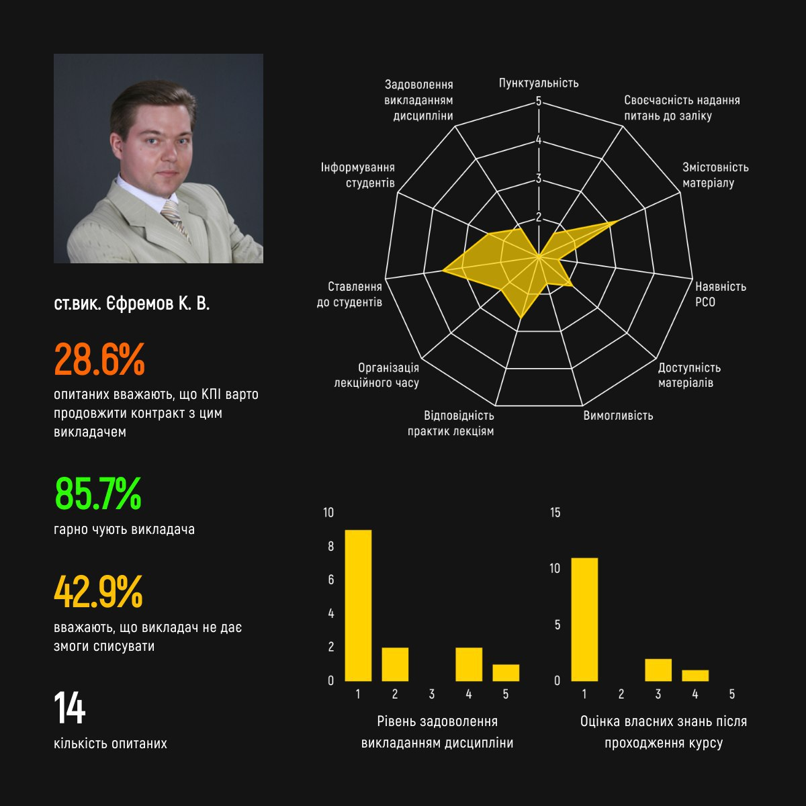

**Дисципліни:** системи баз даних.

**Нотатки виживших:**

_«Викладач уперше вів БД, цим можна було б і виправдати брак чіткого РСО, плану навчання чи взагалі його ідеї, але цього всього ми не дізнались і до самого кінця року. На пари запізнювався… завжди — це в кращому випадку, у гіршому (35%) — не приходив на них. Наче й людина приємна, але толку від нього немає. Якщо він обіцяє скинути щось «завтра», «через тиждень», «такого числа» — ви цього ніколи не побачите. _

_Про особливості викладання написати важко, коли нормально воно й не відбувалося. Лекції — це максимум 30 хвилин начитки якоїсь інформації шкільного рівня з документа або презентації. До речі, якщо вам цікаво, то на парі з БД абревіатура СУБД зʼявилась вперше за 1 місяць до закінчення навчання. Інтерфейс будь-якої СУБД нам так і не показали. Памʼятаєте про відсутність хорошого РСО? Воно вам не знадобиться. Бо ніяких видів контролю, у тому числі лабораторних чи практичних ви не отримаєте, проте будете нагодовані сніданками._

_Якщо коротко — навіщо цей предмет був в ІП мені не зрозуміло, нічого нового нас не навчили. Ні, не так. Просто нічого не навчили. Викладач не серйозно ставився до своєї роботи, лабораторних ми не отримали, це далеко не рівень ІПСА, це навіть не рівень 10 класу інформатики. _

_Висновок: предмет закрився й на тому дякую. Чи ніс цей викладач якусь користь у цей світ під час наших пар? Можливо, лише тоді, коли його там не було»._

### Чкалов Олексій Валерійович

<i>Викладач як лектор</i>

<i>Викладач як практик</i>

**Дисципліни:** методи оптимізації.

**Нотатки виживших:**

_«Приємний викладач, у якого можна легко закрити предмет. Лояльний до студентів, надає доступ до всіх необхідних матеріалів і виставляє оцінки своєчасно»._

_«Він «вів» у нас методи оптимізації, бо насправді за пів року було, напевно, лекції дві, на які ніхто не ходив. Усього треба зробити 5 лаб і предмет закритий, вони робляться не складно, тим паче є паль._

_Після того, як ти зробив усі лаби, ти вільний, за них він усім ставить максимум, захищати їх не треба, просто відправляєш на диск._

_Наприкінці семестру кидає табличку, де ти пишеш бал, який ти хочеш собі, я обнаглів чуток і написав 100, але оскільки я здав усі лаби, він поставив)._

_Більшість писали 90-95, у всіх усе стояло, єдине що, якщо ти не здав жодної лаби, то він не поставить тобі багато, максимум якісь 60, тобто чим більше лаб ти скинув, тим більше оцінка._

_Ще один прикол був, що насправді він не дивиться лаби, він просто дивиться чи загрузив ти їх на диск або чи створив папку_

_так один хлопець створив папку з лабою, вона була пуста, а він поставив за неї максимум»._

_«Один із найлайтовіших викладачів на СП. Швидко виходить на зв’язок, якщо потрібно. Також при складнощах із предметом, обов’язково на лекції все пояснить. Досить сучасний, лекції веде за допомогою графічного планшету та ноутбуку. Із практичних завдань задає лабораторні, які потрібно виконати за семестр. _

_Плюси: веселий викладач, добре пояснює матеріал, наприкінці ставить досить високі бали всім._

_Недоліки: іноді не проводив лекції та забував попередити студентів»._

### Снарський Андрій Олександрович

<i>Викладач як лектор</i>

<i>Викладач як практик</i>

**Дисципліни:** фізика.

**Нотатки виживших:**

_«Лекції проводив змістовні. Треба було писати конспекти лекцій та надсилати їх у гугл клас (типу для підтвердження присутності). Були 2 легенькі кр. У принципі, викладач хороший, гарно подавав матеріал»._

_«Викладач хороший, читає цікаво, але дуже вимогливий, а фізика на такому рівні для системного аналітика / програміста... можна й простіше»._

_«Андрій Олександрович проводить доволі цікаві лекції, їх важко назвати монотонними. Завжди розказує якісь цікаві факти, які пов'язані з темою, а також не забуває спілкуватися зі своїми слухачами (тобто відповідає на запитання, а також може й сам запитати в студентів щось з теми). Періодично кидав додаткові матеріали, також міг кинути цікаві задачі (вони могли бути необов'язково з його предмету). Підбивши підсумки, можна сказати, що Андрій Олександрович — викладач, який знає свій предмет, але також може поспілкуватися й на інші теми»._

### Семенов Володимир Вікторович

**Дисципліни:** математичний аналіз. 

**Нотатки виживших:**

_«Спокійний, не спішить, можна поставити запитання і завжди отримати відповідь, навіть якщо воно виявиться безглуздим. Лояльний, при складній ситуації з балами йде назустріч студентам. Матеріалом володіє чудово, складно ще щось сказати, якби був на його практиках було б більше вражень можливо, але він лектор»._

_«Хороша, позитивна людина, знає як підлаштуватися до дистанційного навчання та до реалій війни. Викладач вміє зрозуміло донести матеріал до студентів. Об'єктивне оцінювання. На мою думку, один із найкращих викладачів на ІПСА. Єдине — довго перевіряв наші модульні контрольні (першу — кілька місяців, а другу — уже кінець семестру піджимав, то і вийшло швидше), і не можна було глянути помилки в тих контрольних, але враховуючи, що Семенов викладає ще в Шеві, то, гадаю, можна пробачити»._

_«Досить непоганий викладач, незважаючи що він читав з презентації матеріал, пояснював він його розписуванням прикладів. Пояснення теорем докладно подавав. Якщо постійно ходити на лекції, гарно входиш у курс справ, і на практиках стає на порядок легше працювати з матеріалом»._