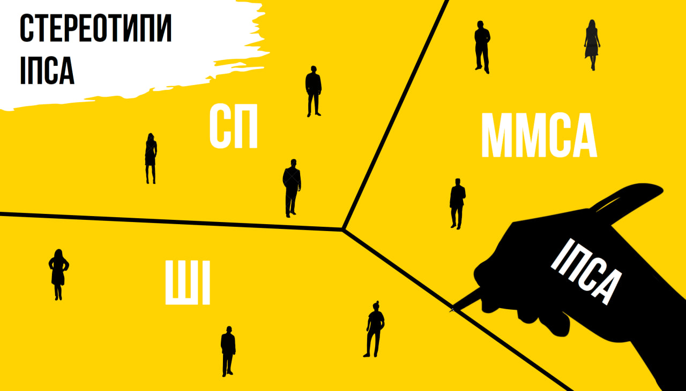

<!--truncate-->

### Чи правда, що:

• Організм дорослої людини зазвичай складається на 70% із води, але українця — із борщу.

• Кожен айтішник може зламати Пентагон, просто клацнувши на кнопочку.

• Тільки ІПСАшники знають математику.

Оскільки вже почали про ІПСА…

### Правдиві

#### Агресивна реакція на «іпсі, іпсою, іпсу»
ІПСА — це абревіатура, [питання](https://www.youtube.com/watch?v=7pBOhzcBork&ab_channel=iasaLEGE)?

#### Вбиває психіку
Важко зберігати спокій, коли одночасно палають дедлайни 10 робіт. Наші студенти звикають (у своїх мріях) до такого щільного графіка та через певний час після адаптації не відчувають тягаря чи тиску навчання ~~до наступної сесії~~.

**P.S.** Діди, які застали очне, не так радісно описують ситуацію: «Це на дистанційному ще можна жити…».

#### На СП нічого не роблять
Ходять чутки, що на СП дійсно «простіше» отримати автомат чи залік, але чи легше там по-справжньому вчитися?

#### В ІПСА багато викладачів-дідусів
На фундаментальних математичних дисциплінах вік викладачів коливається від 40 до 80 років, але на предметах IT галузі є нижчим.

#### Якщо ти щось не зрозумів, то це твої проблеми
Насправді так і є (привіт, доросле життя). Часто викладачі просто не встигають відповідати на ваші запитання протягом пари, що інколи виправляється завдяки консультаціям. Проте настав час звикати до методичок, палі,  індусів і розвивати пошукові та комунікативні навички.

#### Складно перевестися на бюджет
Студенти з пільгами мають пріоритет на бюджетні місця. Але хоча для інших шанси на успіх менші, це можливо, якщо після переведення пільговиків залишаються вільні місця.

#### Ти не будеш мати стабільного сну
Через велике навчальне навантаження, позауніверситетську активність і роботу наші амбітні студенти часто не висипаються та виживають на каві й енергетиках. Натомість завжди можна опанувати основи time management і зробити себе трохи щасливішим.

#### Більшість ІПСАшників відрізняються особливим ПВВ (почуття власної важливості)
На [Поляні](https://www.google.com/maps/place/Сквер+імені+Олени+Теліги/@50.4473255,30.453954,17z/data=!3m1!4b1!4m6!3m5!1s0x40d4cc27725b49d7:0xd00801d72ba54c32!8m2!3d50.4473255!4d30.453954!16s%2Fg%2F11h1694_1?entry=ttu) рідко можна почути щось хороше про ІПСАшників. Хіба те, що ми ходимо із задертим носом та поводимо себе доволі відсторонено від інших факультетів, пояснюючи це високими прохідними балами. Хоча хто сказав, що це погано?..

#### Проєктний (не) працює 💪💪💪
Івенти ІПСА давно згадуються як серед студентів КПІ, так і за межами університету. Тут можна не тільки гарно провести час, а й спробувати смачні напої від барменів Студради. Проте розмаїття не завершується вечірками, також проводяться культурні заходи.

#### Одна з найактивніших Студрад КПІ
В 2009 — найкращий орган студентського самоврядування України. Достатньо круто? Ні.

### Неправдиві

#### Відраховують 99.99% людей
Багато кого залякують тим, що вчитися в ІПСА == бути відрахованим. Усе залежить не від інституту чи факультету, а від студента. Попри таке стійке упередження, тут треба постаратися, щоб вилетіти. Де-факто на кожен екзамен є три спроби здачі: екзамен, перескладання (той самий екзамен) й комісія (той самий екзамен із присутністю декількох викладачів). Якщо ж якимось чудом тебе відрахували, не хвилюйся, завжди можна поновитися, але тепер за кошти батьків.

#### В ІПСА всі такі генії, що мені тут робити?!
Навчання в ІПСА починається з вищої математики й основ програмування. Звісно, людям, які навчалися в математичних ліцеях чи мають досвід програмування, на початку буде легше. З часом вектор розвитку та глибина отриманих знань почнуть залежати лише від кількості приділеного часу та сил.

#### Дуже важко навчатися
В ІПСА дійсно складно (авжеж, якщо вчитися). Рішення про те, наскільки необхідне таке велике навантаження, приймати лише тобі. «Закрити» більшість дисциплін можна просто подивившись декілька гайдів на ютубі.

#### Я нічого не буду бачити, окрім навчання
Будь ласка, перечитай ще раз пункт про важке навчання та не забувай про івенти.

#### Треба ходити на абсолютно всі пари, навіть лекції
Багато предметів можливо вивчити, прочитавши методичну літературу, або зрадити свого викладача з гарячим ютубером. Проте іноді доводиться залишатися вірним заради додаткових балів.

#### В ІПСА одні хлопці
Так, відсоток хлопців значний, але краще якість, ніж кількість. Як і будь-який технічний факультет / інститут, ІПСА — це те місце, де гендер точно ні на що не впливає, оскільки будуть оцінюватися лише розумові здібності та наполегливість, які ніяк не залежать від статі. У 2023 році на 8 березня було проведено [дослідження](https://t.me/IASA_Student_Council/1846), що показує співвідношення студентів і студенток.

#### Одразу після ІПСА мене візьмуть працювати у круту компанію, і з 2 курсу я буду заробляти 300кк/секунду
На жаль, жоден факультет не може гарантувати тобі працевлаштування, бо все залежить від докладених зусиль. ІПСА дає базу знань та можливість спробувати себе в широкому спектрі напрямів, але яке з цих умінь розвивати самостійно — твій вибір.

Більш реальну картину працевлаштування студентів можна переглянути в наших попередніх статтях про кожну зі спеціальностей інституту: [122 ші](https://iasastudentcouncil.github.io/iasa-sc-blog/blog/AI), [122 сп](https://iasastudentcouncil.github.io/iasa-sc-blog/blog/122%D0%A1%D0%9F/), [124](https://iasastudentcouncil.github.io/iasa-sc-blog/blog/124).

#### Легше заробити сколіоз від сидячої роботи, аніж увійти до числа стипендіатів
Вхід до числа стипендіатів і сколіоз ідуть у комплекті. Якщо відкинути всі жарти, то увійти в 40 % людей у рейтингу не є міфічним подвигом. У цей список щасливчиків не входять контрактники та студенти, що потрапили на додаткову сесію. Насправді «challenging» — іти на підвищену стипендію, яку отримують лише 10 % студентів, починаючи з другого семестру.

#### 124 == смерть
Зазвичай складністю стає саме насиченість теоретичним матеріалом математичних дисциплін. Тому деякі приходять до висновку, що 124 — нове число диявола. Проте системний аналіз — все ж математична спеціальність, тож її наповнення відповідне.

#### Дуже суворі викладачі, з якими часто виникають конфлікти
Здебільшого викладацький склад має чудове почуття гумору, емпатичні, але можна підібрати до них епітет «вимогливі». Якщо ж виникають проблеми, пов’язані з несправедливістю з боку викладача, то куратори й освітній відділ Студради завжди допоможуть із їхнім вирішенням. Так само проводиться опитування [IASA Analytics](https://t.me/iasa_analytics), у якому студенти ІПСА оцінюють викладачів за різними критеріями наприкінці семестру.

#### Немає людей із маленьких міст
ІПСА — це доволі популярний інститут серед людей із Києва й обласних центрів, але це не виключає того, що досить великий відсоток студентів буде з міст чи селищ, назви яких ти ніколи не чув. Якщо поглянути на статистику, частка таких людей стартує приблизно з 30% на групу.

#### Немає пар у вихідні та свята
Почнемо з шестиденного робочого тижня, згадаємо про недільні консультації перед контрольними. Трохи перепочинемо й завершимо цю оду продуктивності п'ятигодинною лекцією 31 грудня.

#### Лекції з програмування несуть якийсь сенс
На молодших курсах лекції з програмування насамперед будуть корисними для тих, хто вперше запустив IDE. Для тих, хто вже має досвід у програмуванні, на початку може бути трохи нудно, але досить корисно для систематизації своїх знань.

Надалі з'являться набагато цікавіші предмети з більшим заглибленням у конкретні області IT, наприклад: обʼєктно-орієнтовне програмування, вебтехнології та вебдизайн і т.д.

