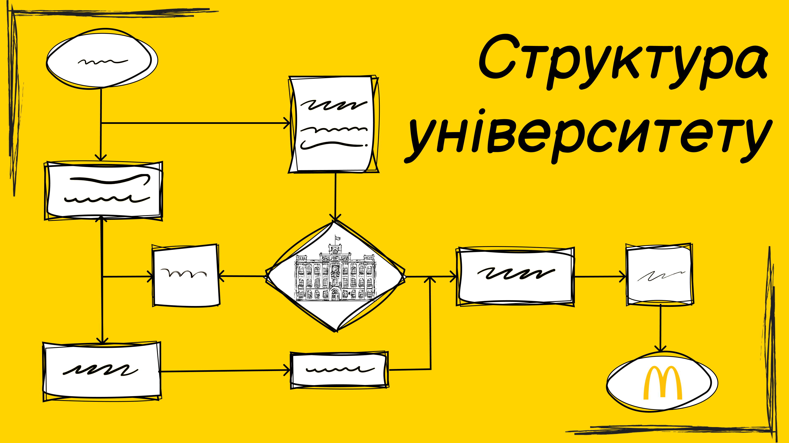

<!--truncate-->

Якщо слова «_катедра_» або «_проректор_» збивають із пантелику, а існування двох різних 122 спеціальностей стало відкриттям, то дана стаття точно піде тобі на користь.
На перший погляд, університет — складна система, але насправді його устрій подібний до шкільного.
Якщо коротко, то кожен ЗВО має однакову структуру:

Розберемо докладніше. Університет являє собою об’єднання «шкіл»: факультетів та інститутів, які є окремими відгалуженнями, що містять групи, які, на відміну від шкільних класів, містять у назві катедру, рік вступу та номер.

У кожній школі є директор. Приберемо «ди» й отримаємо ректора — найголовнішу людину університету. У КПІ цю посаду понад 30 років обіймає Михайло Захарович Згуровський, проте невдовзі відбудуться вибори нового голови. Але однієї людини для управління такою величезною освітньою машиною, як університет, недостатньо, тому існують «завучі», що звуться proректорами. Кожен із них відповідає за окремий аспект управління: є перший проректор, проректори з наукової й адміністративної роботи та інші. Також на університетському рівні є безліч відділів: Департамент навчально-виховної роботи, Стипендіальний відділ тощо — із них складається адміністрація КПІ.

До складу університету входять 14 факультетів і 10 навчально-наукових інститутів. Ці типи структурних підрозділів дуже схожі. Єдина відмінність — наявність в інститутах (біо)лабораторій та науково-дослідної діяльності, а також більш «престижної» назви. Головним представником адміністрації є декан факультету або директор інституту відповідно. Йому підпорядковується деканат — організаційний центр навчання, де займаються документацією студентів та допомогою їм у навчальному процесі.

Катедри здійснюють підготовку студентів у більш вузькому напрямі. Відмінності полягають у викладачах, обсязі та ґрунтовності матеріалу, а також рівні вивчення тієї чи іншої групи дисциплін (наприклад, математичних). В ІПСА зі вступної кампанії 2022 панує тріумвірат:

Докладніше про кожну спеціальність ти дізнаєшся в наступній серії публікацій, а поки сподіваємося, що ми наблизили тебе до розуміння структури університету.
