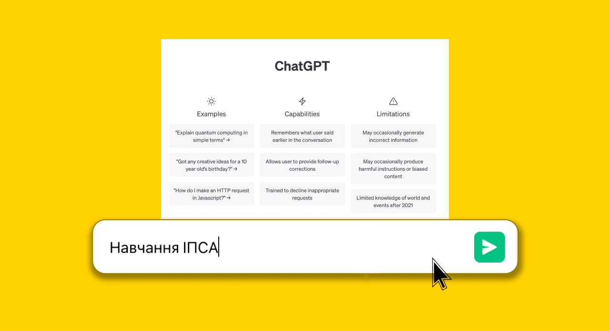

<!--truncate-->

### Загальні положення болонської системи

_Чому в сліпого хлопця випало морозиво?_

_Його збила фура._

Отже, славнозвісна болонська система передбачає, що протягом усього семестру студент заробляє оцінки, які наприкінці становлять (у сумі) показник успішності.

#### Є три способи здобуття рейтингового балу:

• навчальний процес (відвідування, робота на парах);

• модульний контроль (лабораторні, розрахункові та контрольні роботи);

• сесія (іспити, заліки та курсові роботи).

Максимальна оцінка за півріччя — 100. За семестр та іспит можна заробити фіксовану кількість балів (здебільшого 60 і 40 відповідно). Їхній розподіл визначається викладачем дисципліни та надається студентам на початку півріччя.

### Словниковий стартер пак:

**Атестація** — контроль успішності студента, що проводиться двічі на семестр. Під час двох атестаційних тижнів майже з усіх предметів пишуться контрольні роботи. Після цього з кожної дисципліни на підставі поточних балів за семестр ти отримаєш відмітку «а» у разі успіху або «н/а» в протилежному випадку.

**Розрахункова** — робота, яку дають додому, зазвичай із математичних предметів, коли вивчення теми добігає кінця. Вона включає декілька завдань різного типу із заданої теми і здебільшого передбачає проведення усного чи письмового захисту.

**Заліковий тиждень** — час з моменту сповільнення навчальних занять у семестрі, до, власне, сесії, у який складаються заліки, відпрацьовуються пропуски, «підчищаються хвости». Студенти допускаються до сесії, якщо вони впоралися з усіма передбаченими на поточний семестр заліками, курсовими роботами, проєктами.

**Лабораторна** — робота, що традиційно проводиться з предметів, пов’язаних із програмуванням та фізикою. У випадку програмування передбачає написання коду, який для зарахування необхідно показати викладачу та відповісти на більшість запитань.

**Екзамен** — один із найскладніших різновидів контролю на сесії. Екзамени здебільшого проходять у письмовому форматі  з  2-3 предметів на семестр відповідно до навчального плану. До початку сесії студентам також можуть надаватися теоретичні питання для підготовки.

**Залік** — різновид перевірки підсумкових знань наприкінці семестру. На відміну від екзамену, залік часто не є обов’язковим, якщо в студента достатній бал за семестр і він його влаштовує.

**Сесія** — назва періоду заліків та екзаменів. У КПІ дві сесії: зимова і літня. Кожна з яких триває приблизно 2 тижні: взимку заліки відбуваються до Нового року, а екзамени після Різдва, та влітку — усе одразу: протягом червня.

**Додка** — додаткова сесія для тих, хто не впорався з основною. Зазвичай проводиться у перші дні канікул та накладає дебаф на твої шанси отримати стипендію: вони зникають.

**Комісія** проходить одразу після додаткової сесії для найбільш цілеспрямованих та є останньою перешкодою перед відрахуванням.

**Автомат** — метод отримання оцінки з предмета без складання екзамену чи заліку. Шанс такого щастя пропорційно зменшується з рухом:

**_122 СП -> 122 ШІ -> 124._**

Цебто, існують три плюс одна міфічні касти:

• Вища (напівфантастична) — автомат (блатні).

• Найчисленніша — залік / екзамен (мужики).

• Більш-менш велика — додаткова сесія (мученики).

• Нижча — комісія (знедолені).

### Перший курс

Спочатку навчальний процес націлений на компенсацію різниці в підготовці. Немає значення, закінчив ти крутий ліцей чи звичайну ЗОШ, склав математику на 200 чи на 170. Кожен має однакові шанси опинитися в числі будь-якої касти. Старання завжди будуть давати результат, а кількість приділеного часу прямо пропорційна успіху. Тому не хвилюйся, тебе ~~напевно~~ не відрахують.

Дізнавайся про всі важливі дати навчального року та підвищуй шанси на відмінне навчання.

Перша атестація починається наприкінці жовтня та березня (першого і другого семестру відповідно), друга — середина грудня та травня. Після чого тиждень відпочинку та початки залікових сесій, за якими одразу екзаменаційні.

### Предмет конкуренції

Рейтинг успішності, відповідно до якого студентам надається академічна стипендія, розраховується за такою формулою:

P = 0,95*С + 0,05*Д

**С** — середнє арифметичне здобутих за семестр балів.

**Д** — додаткові бали за [позанавчальну діяльність](https://dnvr.kpi.ua/wp-content/uploads/2021/07/%D0%9D%D0%B0%D0%BA%D0%B0%D0%B7_%E2%84%96%D0%9D%D0%9E%D0%9D_195_2021_%D0%B2%D1%96%D0%B6_13_07_2021_%D0%9F%D1%80%D0%BE_%D0%B2%D0%BD%D0%B5%D1%81%D0%B5%D0%BD%D0%BD%D1%8F_%D0%B7%D0%BC%D1%96%D0%BD_%D0%B4%D0%BE_%D0%BD%D0%B0%D0%BA%D0%B0%D0%B7%D1%83_%D0%B2%D1%96%D0%B4.pdf):

• конкурси та олімпіади (університетські, всеукраїнські, міжнародні);

• отримання патенту (заявка);

• публікація статті;

• участь у студентських гуртках чи громадському житті університету.

Залежно від рейтингу студент має результат у 7-рівневій [Європейській системі](https://uk.wikipedia.org/wiki/%D0%84%D0%B2%D1%80%D0%BE%D0%BF%D0%B5%D0%B9%D1%81%D1%8C%D0%BA%D0%B0_%D0%BA%D1%80%D0%B5%D0%B4%D0%B8%D1%82%D0%BD%D0%B0_%D1%82%D1%80%D0%B0%D0%BD%D1%81%D1%84%D0%B5%D1%80%D0%BD%D0%BE-%D0%BD%D0%B0%D0%BA%D0%BE%D0%BF%D0%B8%D1%87%D1%83%D0%B2%D0%B0%D0%BB%D1%8C%D0%BD%D0%B0_%D1%81%D0%B8%D1%81%D1%82%D0%B5%D0%BC%D0%B0) переказу кредитів — A, B, C, D, E, FX, F:

• A — відмінно (95 – 100);

• В — молодець (85 – 94);

• С — добре (75 – 84);

• D — можеш краще (65 – 74);

• Е — спасіння, задовільно (60 – 64);

• FX — незадовільно (0 – 59), означає виконання додаткових завдань для зарахування дисципліни в усіх інших університетах, але не завжди в нас;

• ~~press F to pay respect~~ F — означає, що доведеться повторно прослухати цей курс. Насправді, це означає, що ти був відрахований ще на попередньому пункті.

### Або цікава мука, або нецікаве щастя

Задля розширення навчальних можливостей було введено систему вибіркових дисциплін із 2 до 4 курсу. Але складати основну частину вашого навчання вибіркові почнуть із 3 курсу. Саме тоді на базі отриманих знань за два роки студентам надають можливість самостійно вибрати більш бажану сферу вивчення. ІПСАшники можуть зробити фокус на математичних дисциплінах або заглибитися у фінансово-економічну сферу, чи взагалі здобути базові знання з усіх галузей.

Для розрізнення видів вибіркових предметів є дві категорії, які спрямовані на:

• поглиблення і вдосконалення загальних здібностей стандартів вищої освіти ([ЗУ-каталог](https://osvita.kpi.ua/sites/default/files/downloads/ZU-Katalog-2022.pdf));

• покращення фахових компетентностей, визначених конкретною навчальною програмою (Ф-каталог: [122](https://drive.google.com/file/d/1aUMkrdUWTm_gjHCHnFbLR7EG3E3zE3o2/view?usp=sharing) ШІ, [122](https://cad.kpi.ua/wp-content/uploads/2023/03/fkat_122_oppb_isoro_2023.pdf) СП, [124](http://mmsa.kpi.ua/sites/default/files/fkat_124_oppb_sau_2023.pdf)).

### Формат навчання

Асортимент складають три формати: очний, дистанційний та змішаний. Останній зазвичай передбачає онлайн лекції та стаціонарні практики.

#### Переваги очного:

• більше інтерактиву на парах;

• живе спілкування з викладачами та одногрупниками;

• життя в студентському колективі;

• наявність робочої атмосфери.

#### Переваги дистанційного:

• можливість вибрати зручне для себе джерело інформації (записи занять);

• гнучкість графіка;

• незалежність від геолокації;

• використання більшої кількості дидактичного матеріалу.

За будь-якого формату навчання, доклавши достатньо зусиль, ти можеш здобути якісні знання. Пам’ятай, для мами ти найкращий, тому ніколи не опускай руки, ми в тебе віримо!

