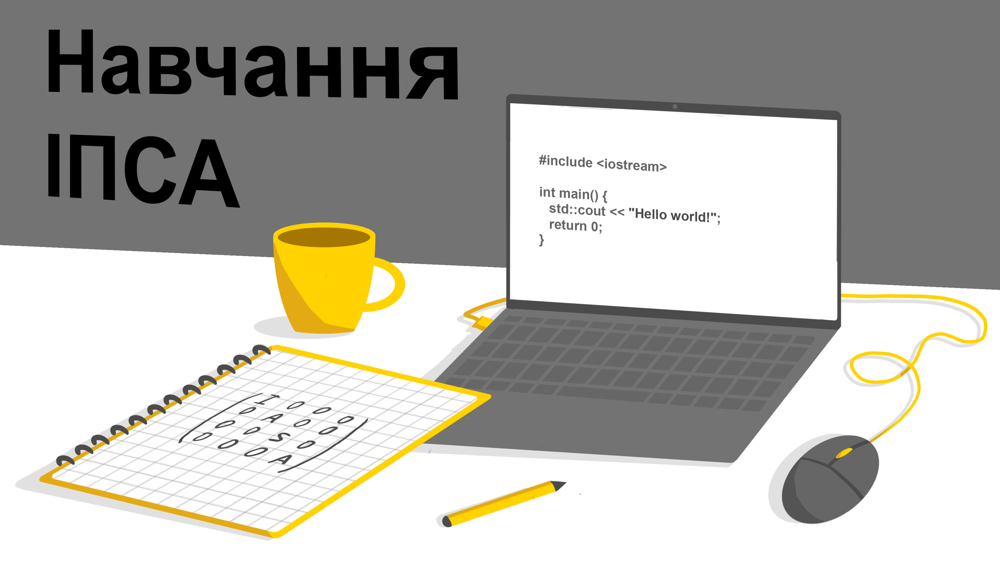
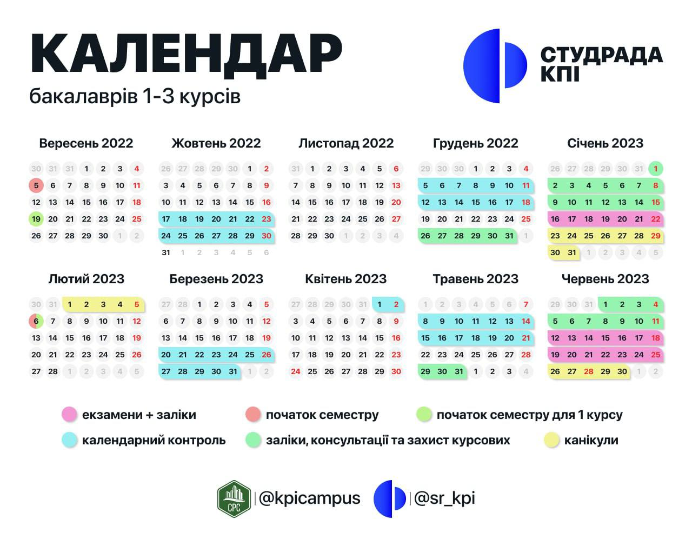

<!--truncate-->

### Загальні положення болонської системи

_Чому в сліпого хлопця впало морозиво?_

_Його збила фура._

Отже, славнозвісна Болонська система передбачає, що протягом семестру студент заробляє оцінки, які в сумі становлять показник успішності.

#### Є три способи здобуття рейтингового балу:

• Навчальний процес (відвідування, робота на парах).

• Модульний контроль (лабораторні, розрахункові й контрольні роботи).

• Сесія (іспити, заліки та курсові).

Максимальна оцінка за півріччя (окрім деяких дисциплін) — 100. За семестр та іспит можна заробити чітко фіксовану кількість балів, здебільшого 60 і 40 відповідно. Цей розподіл визначається викладачем дисципліни та надається студентам у вигляді рейтингової системи оцінювання (РСО).

Зі словниковим стартер-паком трушного ІПСАшника зможеш ознайомитися в статті [«Словника першокурсника»](https://iasastudentcouncil.github.io/iasa-sc-blog/blog/Dictionary).

Проте звернемо особливу увагу на поняття «_автомат_» — метод отримання оцінки з предмета без складання екзамену чи заліку. Шанс такого щастя пропорційно зменшується з рухом:

**_122 СП > 122 ШІ >>> 124._**

Через те, що сесія проходить у три етапи, утворюються три плюс одна міфічні касти:

• Вища (напівфантастична) — автомат (блатні).

• Найчисленніша — залік / екзамен (мужики).

• Більш-менш велика — додаткова сесія (мученики).

• Нижча — комісія (знедолені).

### Перший курс

Спочатку навчальний процес націлений на компенсацію різниці в підготовці. Немає значення, закінчив ти крутий ліцей чи звичайну ЗОШ, склав математику на 200 чи на 170. Кожен має однакові шанси опинитися серед будь-якої касти. Старання завжди будуть давати результат, а успіх прямопропорційний приділеному навчанню часу. Тому не хвилюйся, тебе напевно не відрахують.

Дізнавайся про всі важливі дати навчального року — підвищуй шанси на відмінне навчання.

Перший календарний контроль починається наприкінці жовтня та березня (першого і другого семестру відповідно), другий — у середині грудня та травня. Після чого тиждень відпочинку й початки залікових сесій, за якими одразу екзаменаційні.

### Предмет конкуренції

Після сесії з тих бюджетників, хто не потрапив на додку, складається рейтинг успішності. Відповідно до нього студентам надається академічна стипендія, а сам бал розраховується за такою формулою:

P = 0,95*С + 0,05*Д

***С*** — середнє арифметичне здобутих за семестр балів.

***Д*** — додаткові бали за [позанавчальну діяльність](https://dnvr.kpi.ua/wp-content/uploads/2021/07/%D0%9D%D0%B0%D0%BA%D0%B0%D0%B7_%E2%84%96%D0%9D%D0%9E%D0%9D_195_2021_%D0%B2%D1%96%D0%B6_13_07_2021_%D0%9F%D1%80%D0%BE_%D0%B2%D0%BD%D0%B5%D1%81%D0%B5%D0%BD%D0%BD%D1%8F_%D0%B7%D0%BC%D1%96%D0%BD_%D0%B4%D0%BE_%D0%BD%D0%B0%D0%BA%D0%B0%D0%B7%D1%83_%D0%B2%D1%96%D0%B4.pdf):

• Конкурси та олімпіади (університетські, всеукраїнські, міжнародні).

• Отримання патенту (заявка).

• Публікація статті.

• Участь у студентських гуртках чи громадському житті університету.

Залежно від рейтингу студент має результат у 7-рівневій [Європейській системі](https://uk.wikipedia.org/wiki/%D0%84%D0%B2%D1%80%D0%BE%D0%BF%D0%B5%D0%B9%D1%81%D1%8C%D0%BA%D0%B0_%D0%BA%D1%80%D0%B5%D0%B4%D0%B8%D1%82%D0%BD%D0%B0_%D1%82%D1%80%D0%B0%D0%BD%D1%81%D1%84%D0%B5%D1%80%D0%BD%D0%BE-%D0%BD%D0%B0%D0%BA%D0%BE%D0%BF%D0%B8%D1%87%D1%83%D0%B2%D0%B0%D0%BB%D1%8C%D0%BD%D0%B0_%D1%81%D0%B8%D1%81%D1%82%D0%B5%D0%BC%D0%B0) переказу кредитів:

• A — відмінно (95 – 100).

• В — молодець (85 – 94).

• С — добре (75 – 84).

• D — можеш краще (65 – 74).

• Е — спасіння, задовільно (60 – 64).

• FX — незадовільно (0 – 59), означає виконання додаткових завдань для зарахування дисципліни в усіх інших університетах, але не завжди в нас.

• ~~press F to pay respect~~ F — означає, що доведеться повторно прослухати цей курс. Насправді це свідчить про те, що ти був відрахований ще на попередньому пункті.

### Або цікава мука, або нецікаве щастя

Задля розширення навчальних можливостей було введено систему вибіркових дисциплін із 2 до 4 курсу. Але складати основну частину вашого навчання вони почнуть із 3 курсу. Саме тоді на базі отриманих за два роки знань студентам надають можливість самостійно вибрати бажану сферу вивчення. ІПСАшники можуть зосередитися на математичних дисциплінах або заглибитись у фінансово-економічну галузь, чи взагалі здобути базові знання в усіх царинах.

Є дві категорії вибіркових, які відрізняються спрямуванням:

• Поглиблення та вдосконалення загальних здібностей стандартами вищої освіти ([ЗУ-каталог](https://osvita.kpi.ua/sites/default/files/downloads/zu-katalog-2024.pdf)).

• Покращення фахових компетентностей, визначених конкретною навчальною програмою (Ф-каталог: [122 ШІ](https://osvita.kpi.ua/sites/default/files/f-catalog/fkat_122_oppb_smshi_2024.pdf), [122 СП](https://osvita.kpi.ua/sites/default/files/f-catalog/fkat_122_oppb_isoro_2024.pdf), [124](https://osvita.kpi.ua/sites/default/files/f-catalog/fkat_124_oppb_sau_2024.pdf)).

### Формат навчання

Асортимент складають три формати: очний, дистанційний і змішаний. Останній зазвичай передбачає онлайн лекції та стаціонарні практики.

#### Переваги очного:

• Більше інтерактиву на парах.

• Живе спілкування з викладачами й одногрупниками.

• Життя в студентському колективі.

• Наявність робочої атмосфери.

#### Переваги дистанційного:

• Можливість вибрати зручне для себе джерело інформації (записи занять).

• Гнучкість графіка.

• Незалежність від геолокації.

• Використання більшої кількості дидактичного матеріалу.

Незалежно від умов, доклавши достатньо зусиль, можеш здобути якісні знання. Пам’ятай: для мами ти найкращий, тому ніколи не опускай руки, ми в тебе віримо!

