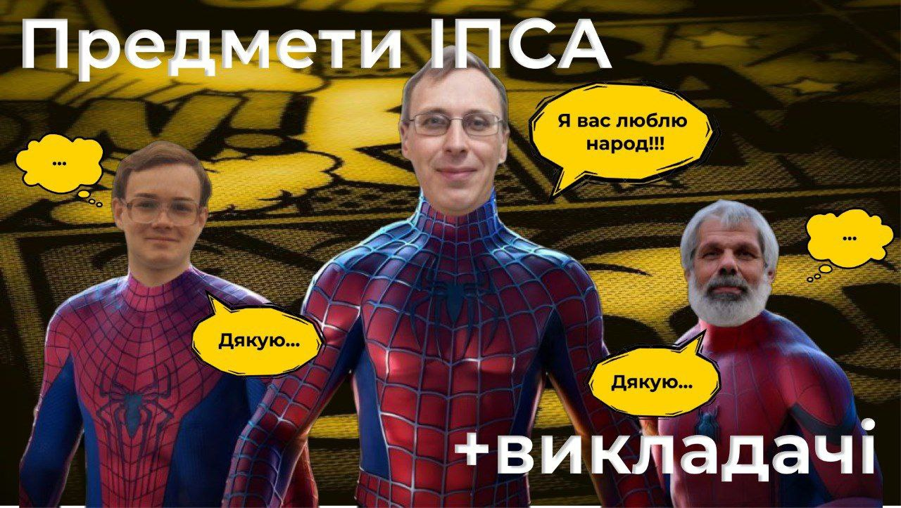
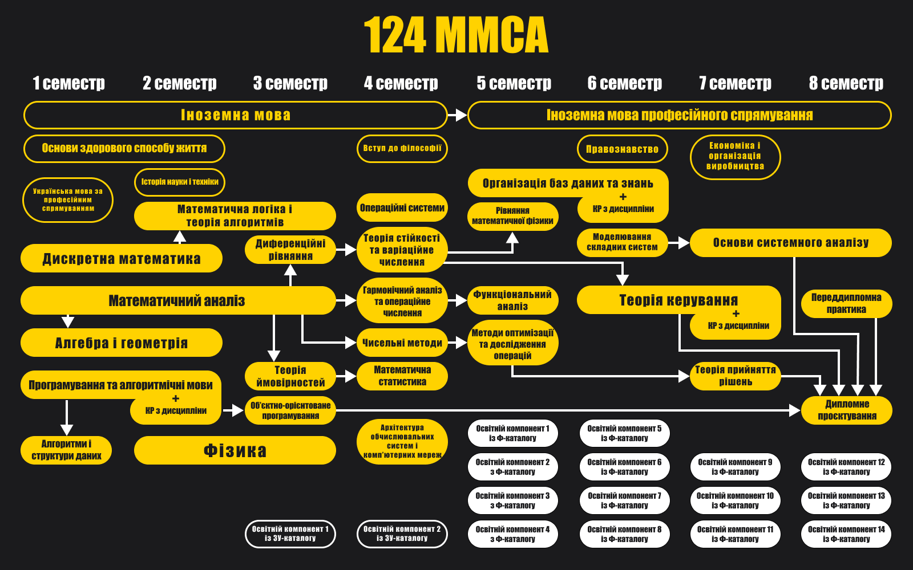
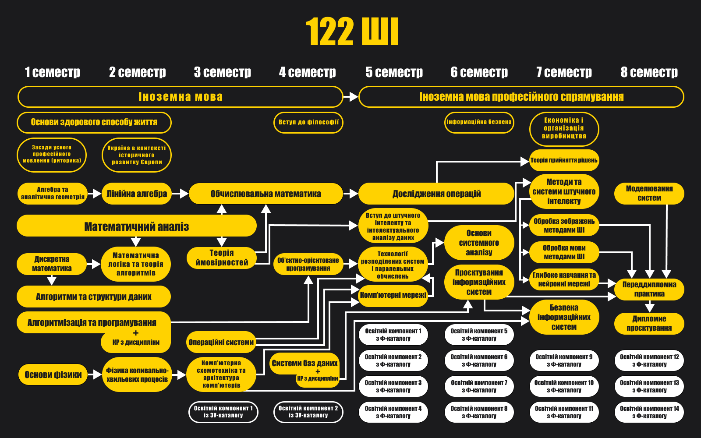
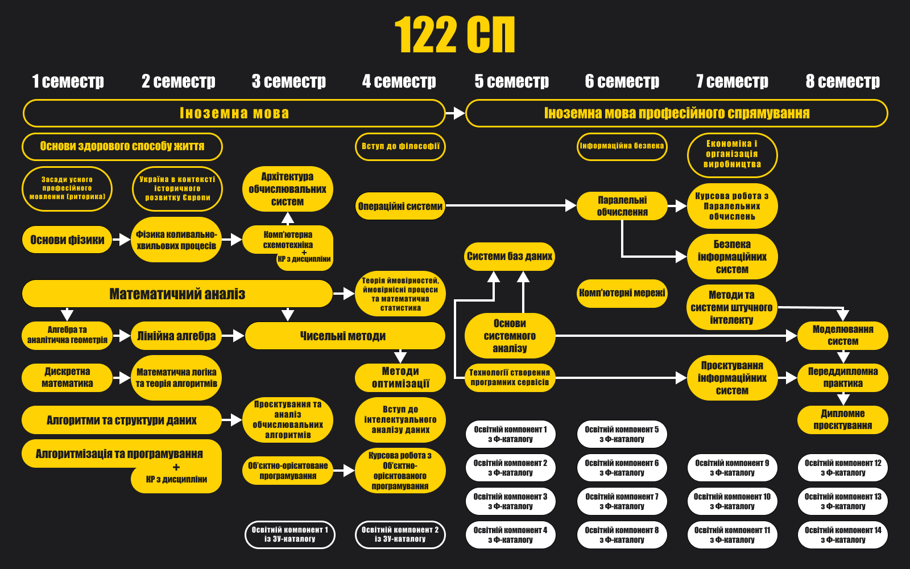

<!--truncate-->

> _«Not the faculty but His Excellency the General can properly determine the sum of two and two»._

_Hermann Hesse_

Дисклеймер № 1: для кожної дисципліни вказано ймовірних викладачів, тому зважайте на можливі зміни їхнього розподілу на катедрах.

Дисклеймер № 2: усі описи й інфографіки сформовані в результаті опитування студентів і випускників. Докладніше на [IASA Analytics](https://t.me/iasa_analytics).

Нотатки авторів: Нижче наведено road map освітніх програм (наполегливо рекомендуємо їх переглянути). Далі все як у людей: просто гортай вниз. Одразу після опису предмета ознайомся з ймовірними викладачами (конче треба, правда).

## Предмети

### Математичний і гармонічний аналіз

**Викладачі:**

Цьогорічний стак:

+ ММСА: [Денисьєвський М.О.](#Денисьєвський-Микола-Олексійович), [Мінарченко О.М.](#Мінарченко-Олександр-Миколайович), [Руденко О.В.](#Руденко-Олексій-Володимирович), [Чаповський Ю.А.](#Чаповський-Юрій-Аркадійович), [Попова Н.Д.](#Попова-Наталія-Дмитрівна)

+ ШІ: [Подколзін Г.Б.](#Подколзін-Гліб-Борисович), [Мальцев А.Ю.](#Мальцев-Антон-Юрійович), [Рябов Г.В.](#Рябов-Георгій-Валентинович), [Мінарченко О.М.](#Мінарченко-Олександр-Миколайович), [Руденко О.В.](#Руденко-Олексій-Володимирович)

+ СП: [Бохонов Ю.Є.](#Бохонов-Юрій-Євгенович), [Мінарченко О.М.](#Мінарченко-Олександр-Миколайович), [Юсипів Т.В.](#Юсипів-Тарас-Васильович)

Можливий розвиток подій: [Номіровський Д.А.](#Номіровський-Дмитро-Анатолійович), [Семенов В.В.](#Семенов-Володимир-Вікторович)

Про що предмет:

+ Диференціальний аналіз: вивчення та застосування похідних.

+ Інтегральний аналіз: розгляд визначених, невизначених і інших варіацій інтегралів, їхнє застосування.

+ Послідовності: числові та функціональні, обчислення границь (лімітів).

+ Ряди: числові й функціональні нескінченні суми.

+ Диференціальні рівняння: звичайне рівняння, яке містить похідні та передбачає пошук функції, а не числа.

+ Комплексний аналіз: розгляд функцій комплексної змінної, де i^2 = -1.

+ Гармонічний аналіз: представлення функцій у вигляді інтегралів і тригонометричних рядів.

**Особливості викладання:** Фундаментальність дисципліни передбачає відповідну вимогливість викладачів. Системні аналітики вивчають предмет упродовж чотирьох семестрів, спеціалісти 122 ШІ опрацьовують матеріал швидше, адже до нього додаються деякі теми функціонального аналізу, що на 124 є окремим предметом. Студенти 122 СП, зі свого боку, обмежуються трьома семестрами. На обох спеціальностях кожне півріччя навчання завершується складанням іспиту.

**Приклади застосування:** Диференціальне числення активно використовується в моделюванні фінансових ринків, управлінні ризиками й економічних процесах. Ряд Тейлора забезпечує обчислення ірраціональних виразів із будь-якою точністю. Перетворення Фур'є застосовується для аналізу й обробки зображень, надає змогу виявляти просторові частоти, фільтрувати шум, знаходити ребра та границі, виконувати компресію зображень і інші операції. Більше прикладів за [посиланням](https://www.google.com.ua).

### Лінійна алгебра та аналітична геометрія

**Викладачі:**

Цьогорічний стак:

+ ММСА: Подколзін Г.Б., Мальцев А.Ю., Сисак К.Я.

+ ШІ: Сисак К.Я., Мінарченко О.М.

+ СП: Бохонов Ю.Є, Мінарченко О.М.

Можливий розвиток подій: Барановська Л.В.

**Про що предмет:**

+ Аналітична геометрія: представлення геометричних об'єктів (точок, ліній та фігур) за допомогою рівнянь і формул (опис залежностей координат), що дає змогу використовувати алгебраїчні методи для розв'язання геометричних задач.

+ Лінійні, унітарні й евклідові простори: множини будь-яких елементів та операцій, що є розширенням до вже відомих зі школи дій над векторами: додавання, множення на константу, скалярне множення (унітарні) та модуль (евклідові).

+ Матриці: таблиці / масиви чисел. Матриці лінійних операторів — функції над об'єктами вищеописаних просторів зі збереженням їхніх властивостей у множині значень.

**Особливості викладання:** «It is my experience that proofs involving matrices can be shortened by 50 if one throws the matrices out», — Еміль Артін. Вітаємо, це вже друга дисципліна в стартер паці маминого розумника. На обох спеціальностях предмет викладають упродовж першого курсу, завершується складанням іспиту в другому семестрі.

**Приклади застосування:** Лінійна алгебра є основою багатьох алгоритмів машинного навчання (робот-андроїд, штучний інтелект): лінійна регресія, метод головних компонент, метод опорних векторів та інші. Використовується для обчислення векторних операцій, знаходження оптимальних рішень і моделювання даних.

### Дискретна математика

**Викладачі:**

Цьогорічний стак:

+ ММСА: Спекторський І.Я., Статкевич В.М.

+ ШІ: Стусь О.В.

+ СП: Статкевич В.М.

Можливий розвиток подій: Моклячук О.М.

**Про що предмет:**

+Алгебра висловлювань.

+ Множини, їхні властивості й операції над ними.

+ Графи: множини з'єднаних ребрами вершин.

+ Комбінаторика: перестановки, комбінації, розміщення, які виникають у задачах лічби та вибірки.

+ Відношення: зв'язок між елементами двох множин. Можуть бути представлені за допомогою множини пар, матриці або графа.

+ Групи та кільця: множини разом з операціями над ними. Для груп це додавання, для кілець — додавання та множення.

**Особливості викладання:** Мабуть, найпростіша з математичних дисциплін першого курсу. На 122 предмет вивчають один семестр, на 124 — два, з іспитом після першого, що зумовлено більш поглибленим опрацюванням деяких тем і додатковим розгляданням булевих алгебр, кардинальних і ординальних чисел.

**Приклади застосування:** Дискретна математика є основою для розробки алгоритмів, структур даних і комп'ютерних систем. Також використовується для аналізу пропускної здатності, ефективності та безпеки мереж.

### Математична логіка та теорія алгоритмів

**Викладачі:**

Традиційний стак:

+ ММСА: Спекторський І.Я., Статкевич В.М.

+ ШІ: Стусь О.В.

+ СП: Статкевич В.М.

**Про що предмет:**

+ Абстрактні алгоритмічні машини: моделі теоретичних комп'ютерів, що не претендують на відповідність справжнім комп'ютерам або технічним реаліям, зосереджуються на моделюванні основних можливостей обчислень. Розглядаються машина Тюрінга, нормальний алгоритм Маркова та блок-схема Поста.

+ Рекурсивні функції: представлення будь-яких функцій за допомогою композиції та [рекурсії базових функцій](https://uk.wikipedia.org/wiki/%D0%A0%D0%B5%D0%BA%D1%83%D1%80%D1%81%D0%B8%D0%B2%D0%BD%D1%96_%D1%84%D1%83%D0%BD%D0%BA%D1%86%D1%96%D1%97).

+ Формальні граматики: математичний інструмент для опису структури мови. Визначає правила, за якими можна утворити коректні вирази, речення або текст із множини символів. Допомагають описувати мови програмування, обробки даних і інші мовні конструкції.

+ Абстрактні автомати: інструмент дуже схожий на алгоритмічні машини. Використовується для моделювання роботи програм у комп'ютерах, процесах у природних системах тощо. Допомагають вивчати як системи взаємодіють із навколишнім середовищем, як вони реагують на різні вхідні сигнали.

**Особливості викладання:** Ситуація аналогічна до дискретної математики. На 122 вивчають один семестр, а на 124 — два, через поглиблене вивчення рекурсивних функцій і додатковий розгляд мереж Петрі.

**Приклади застосування:** У математичній логіці розвиваються формальні методи для представлення знань, розв'язання проблем і прийняття рішень у штучному інтелекті. Застосовується для формалізації логічного мислення, побудови експертних систем, моделювання розумових процесів і розв'язання складних завдань машинного навчання.

### Програмування

**Викладачі:**

Традиційний стак:

+ ММСА: Назарчук І.В., Просянкіна-Жарова Т.І., Савченко І.О., Селін Ю. М.

+ ШІ: Романов В.В., Безносик О.В., Просянкіна-Жарова Т.І.

+ СП: Романов В.В., Безносик О.В., Просянкіна-Жарова Т.І.

**Про що предмет:**

+ Базові ідеї програмування.

+ Синтаксис мов С / С++ і основні конструкції: масиви, функції, вказівники, структури даних, робота з пам'яттю, рекурсія та графічні можливості.

+ Створення й використання бібліотек.

+ Введення в об'єктно-орієнтоване програмування.

**Особливості викладання:** На 124 програмування вивчається більш поверхнево в порівнянні зі 122. У першому семестрі системні аналітики пишуть екзамен із цього предмету (у Комп'ютерних наук — залік). У другому півріччі студенти складають залік і пишуть курсову роботу незалежно від спеціальності.

### Алгоритми та структури даних

**Викладачі:**

Традиційний стак:

+ ММСА: Селін Ю.М., Севастьянов В. В.

+ ШІ: Малишевський О.Г., Куб'юк Є.Ю.

+ СП: Клещ К.О., Яковчук О.К

**Про що предмет:**

+ Ефективність і дизайн алгоритмів.

+ Розгляд найпростіших структур даних: стек, черга, зв'язні списки, дерева, купа, черга з пріоритетом і хеш-таблиця.

+ Алгоритми сортування: вставка, обмін, вибір, злиття, купа.

+ Алгоритми пошуку: лінійний, бінарний, тернарний, інтерполяція, золотий перетин.

+ Рекуренції, дерева пошуку. Динамічне програмування й алгоритми (жадібні, паралельні, на графах).

**Особливості викладання:** Найкращий курс АСД на катедрі СП. Попри низьку якість проведення пар на ШІ, матеріал усе ще на рівні. На 124, вважай, цього предмету не існує: він викладається цілий семестр, упродовж якого достатньо виконати 4 лабораторні.

**Приклади застосування:** Алгоритми та структури даних є основою розробки програмного забезпечення. Вони використовуються для розв'язання задач сортування, пошуку, оптимізації, обробки даних і створення графічного інтерфейсу користувача.

### Фізика

**Викладачі:**

Традиційний стак:

+ ММСА: Снарський А.О., Федотов В.В.

+ ШІ: Калита В.М., Гусєва Ю.І., Іванова І.М.

+ СП: Калита В.М., Іванова І.М., Гусєва Ю.І

**Про що предмет:**

+ Основні закони руху і збереження в механіці.

+ Стаціонарний електричний струм, рівняння електромагнітного поля.

+ Механічні, електромагнітні коливання та хвилі.

**Особливості викладання:** Не основний предмет — вимоги викладачів відповідні. Уряди-годи важко закрити без докладання зусиль (привіт лабораторним на 122). У будь-якому разі хоронити себе за браком шкільної бази не варто: навчання починається майже з нуля.

### Теорія ймовірностей і математична статистика

**Викладачі:**

Можливий розвиток подій:

+ ММСА: Василик О.І., Каніовська І. Ю., Самойленко І.В., Стусь О. В.

+ ШІ: Ільєнко А.Б., Голіченко І.І., Павленков В.В.

+ СП: Боднарчук С.В.

**Про що предмет:**

+ Основи теорії ймовірностей: формалізація шкільних знань.

+ Випадкові величини (результати випадкових експериментів, значення та ймовірності їхніх результатів), вектори, функції від них.

+ Граничні теореми: закон великих чисел, центральна гранична теорема, збіжність послідовності випадкових величин, її види.

+ Точкові статистичні оцінки: приблизне числове значення невідомого параметра сукупності на основі вибірки.

+ Довірчі інтервали: те ж оцінювання, проте з урахуванням точності результату.

+ Перевірка статистичних гіпотез.

**Особливості викладання:** Базова дисципліна аналізу даних, проте годин на неї виділяють мало: на 124 і 122 ШІ два семестри в середньому по 3 год на тиждень, 122 СП балує одним семестром по 4 години. Будьте готові до додаткових пар і великої кількості домашнього завдання. Курс теорії ймовірностей для обох спеціальностей завершується складанням іспиту.

**Приклади застосування:** Математична статистика забезпечує розробку статистичних методів навчання: дерев рішень, лінійної та логістичної регресії. Дає змогу оцінити параметри моделі, провести перевірку гіпотез, виявити статистичну значущість та виконати вибір моделі.

### Об'єктно-орієнтоване програмування

**Викладачі:**

Можливий розвиток подій:

+ ММСА: Древаль М.М.

+ ШІ: Пишнограєв І.О.

+ СП: Булах Б.В., Мироненко С.С.

**Про що предмет:**

+ Базові принципи об'єктно-орієнтованого й узагальненого програмування, їхня реалізація засобами мови C++ або Java.
+ Розгляд основних аспектів розробки програмних застосунків.

**Особливості викладання:** Предмет вирізняється порівняно молодими викладачами, що зазвичай тягне за собою актуальні матеріали й адекватне ставлення до студентів. Завершивши вивчення, студенти катедри СП пишуть курсову роботу.

### Обчислювальна математика (Чисельні методи)

**Викладачі:**

Можливий розвиток подій:

+ ММСА: Дмитрієва О.А.

+ ШІ: Дмитрієва О.А.

+ СП: Петренко А.І., Вербицький Є.В., Бритов О.А.

**Про що предмет:**

+ Точні та наближені методи розв'язання систем лінійних і нелінійних алгебраїчних рівнянь.

+ Чисельне обчислення власних значень та векторів матриць.

+ Інтерполяція та наближення функцій.

+ Чисельне диференціювання, інтегрування і розв'язання диференціальних рівнянь.

**Особливості викладання:** Предмет супроводжується гаслом «Ми не на математичній спеціальності», тому зазвичай очікувати чітких теоретичних обґрунтувань не варто. Передбачено іспит.

**Приклади застосування:** Моделювання та симуляція фізичних явищ: рух планет, поведінка рідин і газів, електромагнітні поля та ін. З більш конкретного: [проєктне знесення вежі АЕС Філіпсбурга у 2020 році](https://www.youtube.com/watch?v=LUKRDE__uDE). Протягом 4 років вираховувалося місце закладання вибухівки заради уникнення жертв та додаткових витрат через неповне руйнування.

### Операційні системи

**Викладачі:**

Можливий розвиток подій:

+ ММСА: Коваленко А.Є.

+ ШІ: Коваленко А.Є.

+ СП: Безносик О.Ю., Круш І.В.

**Про що предмет:**

+ Принципи побудови й архітектури операційних систем.

+ Керування ресурсами комп'ютера, системне програмування.

+ Організація процесів, планування, розподілення та виконання робіт в обчислювальних системах.

**Особливості викладання:** Дисципліна здебільшого про bash, що в комбінації з не наймолодшими викладачами робить предмет майже непотрібним (перекривається мінімальними курсами). Отримати 60+ можна, написавши декілька лабораторних і модульну контрольну.

### Диференціальні рівняння, теорія стійкості та варіаційне числення 

(тільки ММСА)

**Викладачі:** Капустян О. В., Юсипів Т.В., Зеленська І. В.

**Про що предмет:**

+ Диференціальні рівняння першого (винятково перша похідна) та вищих порядків.

+ Вступ до систем диференціальних рівнянь.

+ Теорії стійкості, що вивчає реакцію систем на невеликі відхилення від початкового стану: зберігається стійкість чи збільшується амплітуда коливань.

+ Варіаційне числення: пошук функцій, що задовольняють екстремум заданого виразу. Наприклад, задача Дідони та пошук брахістохрони.

**Особливості викладання:** Актуальність предмета й цікавий матеріал другого семестру витягують враження, особливо після задушливого першого півріччя.

### Системи баз даних

(тільки ШІ)

_Прим. ред. Ця дисципліна викладається на СП і ММСА після другого курсу._

**Викладач:** Єфремов К.В.

**Про що предмет:**

+ Реляційні алгебра й моделі даних — це про організацію даних у таблиці, зв'язки між ними.

+ Проєктування баз даних.

**Особливості викладання:** Необхідний матеріал для професійної діяльності аналітика (вчити треба, будь ласка, реально). У контексті ІПСА це типовий предмет про виконання лабораторних робіт, що часто можна замінити деякими курсами.

### Схемотехніка (тільки ШІ та СП)

**Викладачі:**

Можливий розвиток подій:

+ ШІ: Коваленко А.Є., Тимошенко Ю.О.

+ СП: Стіканов В.Ю., Артюхов В.Г., Кирюша Б.А., Бритов О.А., Гіоргізова-Гай В.Ш.

**Про що предмет:**

+ Принципи побудови сучасних, великих і надвеликих інтегральних схем (процесор у комп'ютері, схоже, великий).

+ Організація комп'ютерних процесорів, пристроїв введення-виведення та запам'ятовування.

+ Принципи роботи, структури й програмні засоби автоматизації проєктування схем.

**Особливості викладання:** Предмет вважається найскладнішим за весь час навчання на 122 СП (найімовірніше, це суто через викладача). На 122 ШІ дисципліна успішно виправдовує статус другорядної.

**Приклади застосування:** Проєктування та розробка інтегральних схем, як-от: мікропроцесори, мікросхеми пам'яті, логічні вентилі й інші електронні компоненти. Створення та оптимізація розміщення компонентів і трас з'єднання, моделювання та верифікація пристрою перед фабрикацією.

**P.S.** Почитай про архітектуру процесорів.

### Архітектура обчислювальних систем

(тільки СП та ММСА)

**Викладачі:**

Можливий розвиток подій:

+ ММСА: Артюхов В.Г., Гіоргізова-Гай В.Ш.

+ СП: Артюхов В.Г., Бритов О.А.

**Про що предмет:**

+ Основи архітектури обчислювальних систем: структура та організація комп'ютерів.

+ Пам'ять: ієрархія пам'яті, кеш-пам'ять, оперативна пам'ять, зовнішня пам'ять.

+ Мережі та розподілені системи: основи мереж, розподілені обчислення, кластерні та хмарні обчислення.

**Особливості викладання:** Враження від дисципліни були двоякі, АОС читалась із мікрокапа, а лабораторні захищались по програмах, написаних в асемблері, часом навіть без перевірки на працездатність. Дисципліна відносно нелегка для розуміння, що в комбінації з не наймолодшими викладачами робить предмет не дуже доступним для вивчення.

### Вступ до інтелектуального аналізу даних

(тільки СП)

**Викладачі:** Іщенко Г.В., Сергеєв-Горчинський О.О.

**Про що предмет:**

+ Основні поняття, задачі та стадії інтелектуального аналізу даних.

+ Сучасні способи зберігання даних.

+ Аналіз залежностей у даних: кластеризація, класифікація, регресія, секвенційний.

**Особливості викладання:** Розглядають лише основи основ, не більше. Лекції супроводжуються лабораторними роботами, що повільно, але впевнено актуалізують матеріал. Системним аналітикам пощастило трохи більше: предмет є вибірковим і зазвичай викладається набагато краще.

**Приклади застосування:** Створення систем, які пропонують персоналізовані рекомендації користувачам на основі їхніх попередніх дій, уподобань та характеристик. Аналіз текстових даних, включно з обробкою природної мови, систематизацією документів і виявленням емоцій. Опрацювання зображень та задачі комп'ютерного зору: розпізнавання образів, виявлення об'єктів, класифікація образів.

### Методи оптимізації

(тільки СП)

**Викладач:** Чкалов О.В.

**Про що предмет:**

+ Елементи опуклого аналізу: розв'язання задач оптимізації через знаходження екстремумів функції з використанням властивості опуклості (це коли будь-яка пряма лінія, яка з'єднує дві точки в області, лежить повністю всередині цієї області).

+ Критерії оптимальності в задачах нелінійного програмування: та сама задача, проте з урахуванням певних обмежень.

+ Методи одновимірного пошуку екстремуму: знаходження найкращого значення функції за допомогою просування вздовж осі або на певному діапазоні.

+ Умовна та безумовна багатопараметричні оптимізації: на кшталт описаного вище, але для функцій декількох змінних.

**Особливості викладання:** У деякому розумінні продовження курсів обчислювальної математики й АСД зі збереженням усіх недоліків: предмет закривається написанням декількох лабораторних.

**Приклади застосування:** Еволюційні алгоритми, що є методом оптимізації, який імітує природний еволюційний процес для знаходження оптимального розв'язку. Містять використання генетичних алгоритмів, програмування та інших підходів.

**P.S.** Наступні два роки навчання здебільшого складаються з вибіркових предметів. Докладніше за посиланнями:

+ 3 курс: [ММСА](https://iasastudentcouncil.github.io/iasa-sc-blog/blog/elected-mmsa-3-2024), [ШІ](https://iasastudentcouncil.github.io/iasa-sc-blog/blog/elected-ai-3-2024), [СП](https://iasastudentcouncil.github.io/iasa-sc-blog/blog/elected-sd-3-2024).

+ 4 курс: [ММСА](https://iasastudentcouncil.github.io/iasa-sc-blog/blog/elected-mmsa-4-2024), [ШІ](https://iasastudentcouncil.github.io/iasa-sc-blog/blog/elected-ai-4-2024), [СП](https://iasastudentcouncil.github.io/iasa-sc-blog/blog/elected-sd-4-2024).

## Викладачі:

### Бохонов Юрій Євгенович

**Дисципліни:** [математичний аналіз](#Математичний-і-гармонічний-аналіз), [лінійна алгебра та аналітична геометрія](#Лінійна-алгебра-та-аналітична-геометрія).