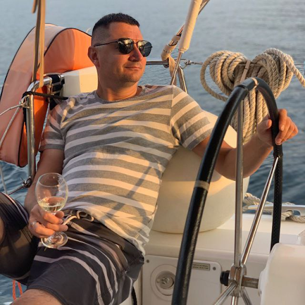
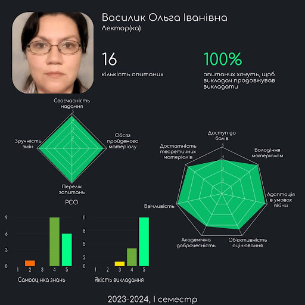
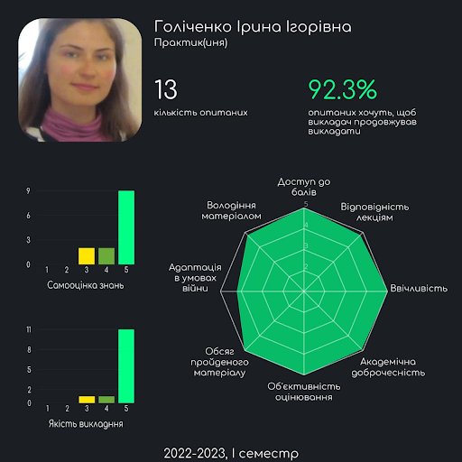
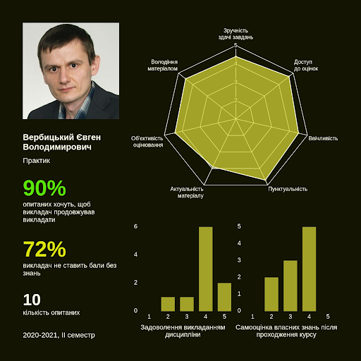
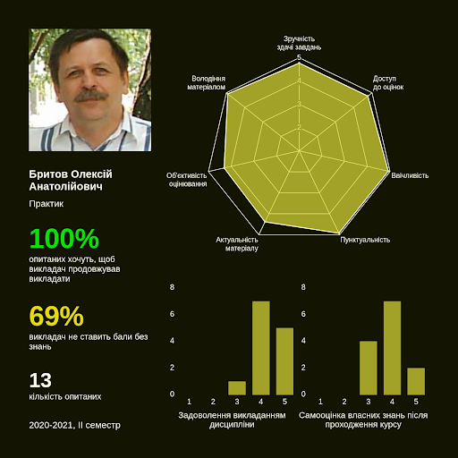
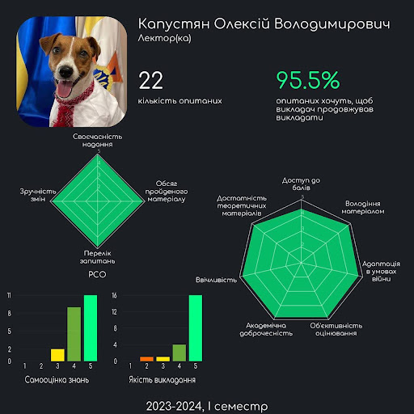
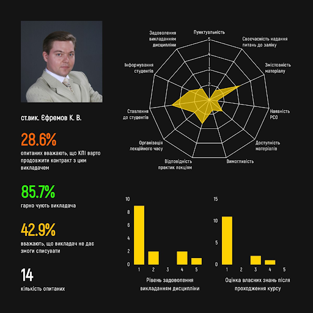

<!--truncate-->

> _«Not the faculty but His Excellency the General can properly determine the sum of two and two»._

_Hermann Hesse_

Дисклеймер № 1: для кожної дисципліни вказано ймовірних викладачів, тому зважайте на можливі зміни їхнього розподілу на катедрах.

Дисклеймер № 2: усі описи й інфографіки сформовані в результаті опитування студентів і випускників. Докладніше на [IASA Analytics](https://t.me/iasa_analytics).

Нотатки авторів: Нижче наведено road map освітніх програм (наполегливо рекомендуємо їх переглянути). Далі все як у людей: просто гортай вниз. Одразу після опису предмета ознайомся з ймовірними викладачами (конче треба, правда).

## Предмети

### Математичний і гармонічний аналіз

**Викладачі:**

Цьогорічний стак:

+ ММСА: [Денисьєвський М.О.](#денисьєвський-микола-олексійович), [Мінарченко О.М.](#мінарченко-олександр-миколайович), [Руденко О.В.](#руденко-олексій-володимирович), [Чаповський Ю.А.](#чаповський-юрій-аркадійович), [Попова Н.Д.](#попова-наталія-дмитрівна)

+ ШІ: [Подколзін Г.Б.](#подколзін-гліб-борисович), [Мальцев А.Ю.](#мальцев-антон-юрійович), [Рябов Г.В.](#рябов-георгій-валентинович), [Мінарченко О.М.](#мінарченко-олександр-миколайович), [Руденко О.В.](#руденко-олексій-володимирович)

+ СП: [Бохонов Ю.Є.](#бохонов-юрій-євгенович), [Мінарченко О.М.](#мінарченко-олександр-миколайович), [Юсипів Т.В.](#юсипів-тарас-васильович)

Можливий розвиток подій: [Номіровський Д.А.](#номіровський-дмитро-анатолійович), [Семенов В.В.](#семенов-володимир-вікторович)

Про що предмет:

+ Диференціальний аналіз: вивчення та застосування похідних.

+ Інтегральний аналіз: розгляд визначених, невизначених і інших варіацій інтегралів, їхнє застосування.

+ Послідовності: числові та функціональні, обчислення границь (лімітів).

+ Ряди: числові й функціональні нескінченні суми.

+ Диференціальні рівняння: звичайне рівняння, яке містить похідні та передбачає пошук функції, а не числа.

+ Комплексний аналіз: розгляд функцій комплексної змінної, де i^2 = -1.

+ Гармонічний аналіз: представлення функцій у вигляді інтегралів і тригонометричних рядів.

**Особливості викладання:** Фундаментальність дисципліни передбачає відповідну вимогливість викладачів. Системні аналітики вивчають предмет упродовж чотирьох семестрів, спеціалісти 122 ШІ опрацьовують матеріал швидше, адже до нього додаються деякі теми функціонального аналізу, що на 124 є окремим предметом. Студенти 122 СП, зі свого боку, обмежуються трьома семестрами. На обох спеціальностях кожне півріччя навчання завершується складанням іспиту.

**Приклади застосування:** Диференціальне числення активно використовується в моделюванні фінансових ринків, управлінні ризиками й економічних процесах. Ряд Тейлора забезпечує обчислення ірраціональних виразів із будь-якою точністю. Перетворення Фур'є застосовується для аналізу й обробки зображень, надає змогу виявляти просторові частоти, фільтрувати шум, знаходити ребра та границі, виконувати компресію зображень і інші операції. Більше прикладів за [посиланням](https://www.google.com.ua).

### Лінійна алгебра та аналітична геометрія

**Викладачі:**

Цьогорічний стак:

+ ММСА: [Подколзін Г.Б.](#подколзін-гліб-борисович), [Мальцев А.Ю.](#мальцев-антон-юрійович), [Сисак К.Я.](#сисак-катерина-ярославівна)

+ ШІ: [Сисак К.Я.](#сисак-катерина-ярославівна), [Мінарченко О.М.](#мінарченко-олександр-миколайович)

+ СП: [Бохонов Ю.Є.](#бохонов-юрій-євгенович), [Мінарченко О.М.](#мінарченко-олександр-миколайович)

Можливий розвиток подій: [Барановська Л.В.](#барановська-леся-валеріївна)

**Про що предмет:**

+ Аналітична геометрія: представлення геометричних об'єктів (точок, ліній та фігур) за допомогою рівнянь і формул (опис залежностей координат), що дає змогу використовувати алгебраїчні методи для розв'язання геометричних задач.

+ Лінійні, унітарні й евклідові простори: множини будь-яких елементів та операцій, що є розширенням до вже відомих зі школи дій над векторами: додавання, множення на константу, скалярне множення (унітарні) та модуль (евклідові).

+ Матриці: таблиці / масиви чисел. Матриці лінійних операторів — функції над об'єктами вищеописаних просторів зі збереженням їхніх властивостей у множині значень.

**Особливості викладання:** «It is my experience that proofs involving matrices can be shortened by 50 if one throws the matrices out», — Еміль Артін. Вітаємо, це вже друга дисципліна в стартер паці маминого розумника. На обох спеціальностях предмет викладають упродовж першого курсу, завершується складанням іспиту в другому семестрі.

**Приклади застосування:** Лінійна алгебра є основою багатьох алгоритмів машинного навчання (робот-андроїд, штучний інтелект): лінійна регресія, метод головних компонент, метод опорних векторів та інші. Використовується для обчислення векторних операцій, знаходження оптимальних рішень і моделювання даних.

### Дискретна математика

**Викладачі:**

Цьогорічний стак:

+ ММСА: [Спекторський І.Я.](#спекторський-ігор-якович), [Статкевич В.М.](#статкевич-віталій-михайлович)

+ ШІ: [Стусь О.В.](#стусь-олександр-вікторович)

+ СП: [Статкевич В.М.](#статкевич-віталій-михайлович)

Можливий розвиток подій: [Моклячук О.М.](#моклячук-олександр-михайлович)

**Про що предмет:**

+Алгебра висловлювань.

+ Множини, їхні властивості й операції над ними.

+ Графи: множини з'єднаних ребрами вершин.

+ Комбінаторика: перестановки, комбінації, розміщення, які виникають у задачах лічби та вибірки.

+ Відношення: зв'язок між елементами двох множин. Можуть бути представлені за допомогою множини пар, матриці або графа.

+ Групи та кільця: множини разом з операціями над ними. Для груп це додавання, для кілець — додавання та множення.

**Особливості викладання:** Мабуть, найпростіша з математичних дисциплін першого курсу. На 122 предмет вивчають один семестр, на 124 — два, з іспитом після першого, що зумовлено більш поглибленим опрацюванням деяких тем і додатковим розгляданням булевих алгебр, кардинальних і ординальних чисел.

**Приклади застосування:** Дискретна математика є основою для розробки алгоритмів, структур даних і комп'ютерних систем. Також використовується для аналізу пропускної здатності, ефективності та безпеки мереж.

### Математична логіка та теорія алгоритмів

**Викладачі:**

Традиційний стак:

+ ММСА: [Спекторський І.Я.](#спекторський-ігор-якович), [Статкевич В.М.](#статкевич-віталій-михайлович)

+ ШІ: [Стусь О.В.](#стусь-олександр-вікторович)

+ СП: [Статкевич В.М.](#статкевич-віталій-михайлович)

**Про що предмет:**

+ Абстрактні алгоритмічні машини: моделі теоретичних комп'ютерів, що не претендують на відповідність справжнім комп'ютерам або технічним реаліям, зосереджуються на моделюванні основних можливостей обчислень. Розглядаються машина Тюрінга, нормальний алгоритм Маркова та блок-схема Поста.

+ Рекурсивні функції: представлення будь-яких функцій за допомогою композиції та [рекурсії базових функцій](https://uk.wikipedia.org/wiki/%D0%A0%D0%B5%D0%BA%D1%83%D1%80%D1%81%D0%B8%D0%B2%D0%BD%D1%96_%D1%84%D1%83%D0%BD%D0%BA%D1%86%D1%96%D1%97).

+ Формальні граматики: математичний інструмент для опису структури мови. Визначає правила, за якими можна утворити коректні вирази, речення або текст із множини символів. Допомагають описувати мови програмування, обробки даних і інші мовні конструкції.

+ Абстрактні автомати: інструмент дуже схожий на алгоритмічні машини. Використовується для моделювання роботи програм у комп'ютерах, процесах у природних системах тощо. Допомагають вивчати як системи взаємодіють із навколишнім середовищем, як вони реагують на різні вхідні сигнали.

**Особливості викладання:** Ситуація аналогічна до дискретної математики. На 122 вивчають один семестр, а на 124 — два, через поглиблене вивчення рекурсивних функцій і додатковий розгляд мереж Петрі.

**Приклади застосування:** У математичній логіці розвиваються формальні методи для представлення знань, розв'язання проблем і прийняття рішень у штучному інтелекті. Застосовується для формалізації логічного мислення, побудови експертних систем, моделювання розумових процесів і розв'язання складних завдань машинного навчання.

### Програмування

**Викладачі:**

Традиційний стак:

+ ММСА: [Назарчук І.В.](#назарчук-ірина-василівна), [Просянкіна-Жарова Т.І.](#просянкіна-жарова-тетяна-іванівна), [Савченко І.О.](#савченко-ілля-олександрович), [Селін Ю. М.](#селін-юрій-миколайович)

+ ШІ: [Романов В.В.](#романов-валерій-володимирович), [Безносик О.В.](#безносик-олександр-юрійович), [Просянкіна-Жарова Т.І.](#просянкіна-жарова-тетяна-іванівна)

+ СП: [Романов В.В.](#романов-валерій-володимирович), [Безносик О.В.](#безносик-олександр-юрійович), [Просянкіна-Жарова Т.І.](#просянкіна-жарова-тетяна-іванівна)

**Про що предмет:**

+ Базові ідеї програмування.

+ Синтаксис мов С / С++ і основні конструкції: масиви, функції, вказівники, структури даних, робота з пам'яттю, рекурсія та графічні можливості.

+ Створення й використання бібліотек.

+ Введення в об'єктно-орієнтоване програмування.

**Особливості викладання:** На 124 програмування вивчається більш поверхнево в порівнянні зі 122. У першому семестрі системні аналітики пишуть екзамен із цього предмету (у Комп'ютерних наук — залік). У другому півріччі студенти складають залік і пишуть курсову роботу незалежно від спеціальності.

### Алгоритми та структури даних

**Викладачі:**

Традиційний стак:

+ ММСА: [Селін Ю.М.](#селін-юрій-миколайович), [Севастьянов В. В.](#севастьянов-володимир-володимирович)

+ ШІ: [Малишевський О.Г.](#малишевський-олексій-григорович), [Куб'юк Є.Ю.](#кубюк-євген-юрійович)

+ СП: [Клещ К.О.](#клещ-кирило-олегович-та-яковчук-олег-костянтинович), [Яковчук О.К.](#клещ-кирило-олегович-та-яковчук-олег-костянтинович)

**Про що предмет:**

+ Ефективність і дизайн алгоритмів.

+ Розгляд найпростіших структур даних: стек, черга, зв'язні списки, дерева, купа, черга з пріоритетом і хеш-таблиця.

+ Алгоритми сортування: вставка, обмін, вибір, злиття, купа.

+ Алгоритми пошуку: лінійний, бінарний, тернарний, інтерполяція, золотий перетин.

+ Рекуренції, дерева пошуку. Динамічне програмування й алгоритми (жадібні, паралельні, на графах).

**Особливості викладання:** Найкращий курс АСД на катедрі СП. Попри низьку якість проведення пар на ШІ, матеріал усе ще на рівні. На 124, вважай, цього предмету не існує: він викладається цілий семестр, упродовж якого достатньо виконати 4 лабораторні.

**Приклади застосування:** Алгоритми та структури даних є основою розробки програмного забезпечення. Вони використовуються для розв'язання задач сортування, пошуку, оптимізації, обробки даних і створення графічного інтерфейсу користувача.

### Фізика

**Викладачі:**

Традиційний стак:

+ ММСА: [Снарський А.О.](#снарський-андрій-олександрович), [Федотов В.В.](#федотов-вячеслав-віталійович)

+ ШІ: [Калита В.М.](#калита-віктор-михайлович), [Гусєва Ю.І.](#гусєва-юлія-ігорівна), [Іванова І.М.](#іванова-ірина-михайлівна)

+ СП: [Калита В.М.](#калита-віктор-михайлович), [Іванова І.М.](#гусєва-юлія-ігорівна), [Гусєва Ю.І.](#іванова-ірина-михайлівна)

**Про що предмет:**

+ Основні закони руху і збереження в механіці.

+ Стаціонарний електричний струм, рівняння електромагнітного поля.

+ Механічні, електромагнітні коливання та хвилі.

**Особливості викладання:** Не основний предмет — вимоги викладачів відповідні. Уряди-годи важко закрити без докладання зусиль (привіт лабораторним на 122). У будь-якому разі хоронити себе за браком шкільної бази не варто: навчання починається майже з нуля.

### Теорія ймовірностей і математична статистика

**Викладачі:**

Можливий розвиток подій:

+ ММСА: [Василик О.І.](#василик-ольга-іванівна), [Каніовська І. Ю.](#каніовська-ірина-юріївна), [Самойленко І.В.](#самойленко-ігор-валерійович), [Стусь О. В.](#стусь-олександр-вікторович)

+ ШІ: [Ільєнко А.Б.](#ільєнко-андрій-борисович), [Голіченко І.І.](#голіченко-ірина-ігорівна), [Павленков В.В.](#павленков-володимир-володимирович)

+ СП: [Боднарчук С.В.](#боднарчук-семен-володимирович)

**Про що предмет:**

+ Основи теорії ймовірностей: формалізація шкільних знань.

+ Випадкові величини (результати випадкових експериментів, значення та ймовірності їхніх результатів), вектори, функції від них.

+ Граничні теореми: закон великих чисел, центральна гранична теорема, збіжність послідовності випадкових величин, її види.

+ Точкові статистичні оцінки: приблизне числове значення невідомого параметра сукупності на основі вибірки.

+ Довірчі інтервали: те ж оцінювання, проте з урахуванням точності результату.

+ Перевірка статистичних гіпотез.

**Особливості викладання:** Базова дисципліна аналізу даних, проте годин на неї виділяють мало: на 124 і 122 ШІ два семестри в середньому по 3 год на тиждень, 122 СП балує одним семестром по 4 години. Будьте готові до додаткових пар і великої кількості домашнього завдання. Курс теорії ймовірностей для обох спеціальностей завершується складанням іспиту.

**Приклади застосування:** Математична статистика забезпечує розробку статистичних методів навчання: дерев рішень, лінійної та логістичної регресії. Дає змогу оцінити параметри моделі, провести перевірку гіпотез, виявити статистичну значущість та виконати вибір моделі.

### Об'єктно-орієнтоване програмування

**Викладачі:**

Можливий розвиток подій:

+ ММСА: [Древаль М.М.](#древаль-максим-михайлович)

+ ШІ: [Пишнограєв І.О.](#пишнограєв-іван-олександрович)

+ СП: [Булах Б.В.](#булах-богдан-вікторович), [Мироненко С.С.](#мироненко-сергій-сергійович)

**Про що предмет:**

+ Базові принципи об'єктно-орієнтованого й узагальненого програмування, їхня реалізація засобами мови C++ або Java.

+ Розгляд основних аспектів розробки програмних застосунків.

**Особливості викладання:** Предмет вирізняється порівняно молодими викладачами, що зазвичай тягне за собою актуальні матеріали й адекватне ставлення до студентів. Завершивши вивчення, студенти катедри СП пишуть курсову роботу.

### Обчислювальна математика (Чисельні методи)

**Викладачі:**

Можливий розвиток подій:

+ ММСА: [Дмитрієва О.А.](#дмитрієва-ольга-анатоліївна)

+ ШІ: [Дмитрієва О.А.](#дмитрієва-ольга-анатоліївна)

+ СП: [Петренко А.І.](#петренко-анатолій-іванович), [Вербицький Є.В.](#вербицький-євген-володимирович), [Бритов О.А.](#бритов-олексій-анатолійович)

**Про що предмет:**

+ Точні та наближені методи розв'язання систем лінійних і нелінійних алгебраїчних рівнянь.

+ Чисельне обчислення власних значень та векторів матриць.

+ Інтерполяція та наближення функцій.

+ Чисельне диференціювання, інтегрування і розв'язання диференціальних рівнянь.

**Особливості викладання:** Предмет супроводжується гаслом «Ми не на математичній спеціальності», тому зазвичай очікувати чітких теоретичних обґрунтувань не варто. Передбачено іспит.

**Приклади застосування:** Моделювання та симуляція фізичних явищ: рух планет, поведінка рідин і газів, електромагнітні поля та ін. З більш конкретного: [проєктне знесення вежі АЕС Філіпсбурга у 2020 році](https://www.youtube.com/watch?v=LUKRDE__uDE). Протягом 4 років вираховувалося місце закладання вибухівки заради уникнення жертв та додаткових витрат через неповне руйнування.

### Операційні системи

**Викладачі:**

Можливий розвиток подій:

+ ММСА: [Коваленко А.Є.](#коваленко-анатолій-єпіфанович)

+ ШІ: [Коваленко А.Є.](#коваленко-анатолій-єпіфанович)

+ СП: [Безносик О.Ю.](#безносик-олександр-юрійович), [Круш І.В.](#круш-ігор-володимирович)

**Про що предмет:**

+ Принципи побудови й архітектури операційних систем.

+ Керування ресурсами комп'ютера, системне програмування.

+ Організація процесів, планування, розподілення та виконання робіт в обчислювальних системах.

**Особливості викладання:** Дисципліна здебільшого про bash, що в комбінації з не наймолодшими викладачами робить предмет майже непотрібним (перекривається мінімальними курсами). Отримати 60+ можна, написавши декілька лабораторних і модульну контрольну.

### Диференціальні рівняння, теорія стійкості та варіаційне числення 

(тільки ММСА)

**Викладачі:** [Капустян О. В.](#капустян-олексій-володимирович), [Юсипів Т.В.](#юсипів-тарас-васильович), [Зеленська І. В.](#зеленська-ірина-олександрівна)

**Про що предмет:**

+ Диференціальні рівняння першого (винятково перша похідна) та вищих порядків.

+ Вступ до систем диференціальних рівнянь.

+ Теорії стійкості, що вивчає реакцію систем на невеликі відхилення від початкового стану: зберігається стійкість чи збільшується амплітуда коливань.

+ Варіаційне числення: пошук функцій, що задовольняють екстремум заданого виразу. Наприклад, задача Дідони та пошук брахістохрони.

**Особливості викладання:** Актуальність предмета й цікавий матеріал другого семестру витягують враження, особливо після задушливого першого півріччя.

### Системи баз даних

(тільки ШІ)

_Прим. ред. Ця дисципліна викладається на СП і ММСА після другого курсу._

**Викладач:** [Єфремов К.В.](#єфремов-костянтин-вікторович)

**Про що предмет:**

+ Реляційні алгебра й моделі даних — це про організацію даних у таблиці, зв'язки між ними.

+ Проєктування баз даних.

**Особливості викладання:** Необхідний матеріал для професійної діяльності аналітика (вчити треба, будь ласка, реально). У контексті ІПСА це типовий предмет про виконання лабораторних робіт, що часто можна замінити деякими курсами.

### Схемотехніка

(тільки ШІ та СП)

**Викладачі:**

Можливий розвиток подій:

+ ШІ: [Коваленко А.Є.](#коваленко-анатолій-єпіфанович)

+ СП: [Стіканов В.Ю.](#стіканов-валерій-юхимович), [Артюхов В.Г.](#артюхов-віталій-григорович), [Кирюша Б.А.](#кирюша-богдан-анатолійович), [Бритов О.А.](#бритов-олексій-анатолійович), [Гіоргізова-Гай В.Ш.](#гіоргізова-гай-вікторія-шалвівна)

**Про що предмет:**

+ Принципи побудови сучасних, великих і надвеликих інтегральних схем (процесор у комп'ютері, схоже, великий).

+ Організація комп'ютерних процесорів, пристроїв введення-виведення та запам'ятовування.

+ Принципи роботи, структури й програмні засоби автоматизації проєктування схем.

**Особливості викладання:** Предмет вважається найскладнішим за весь час навчання на 122 СП (найімовірніше, це суто через викладача). На 122 ШІ дисципліна успішно виправдовує статус другорядної.

**Приклади застосування:** Проєктування та розробка інтегральних схем, як-от: мікропроцесори, мікросхеми пам'яті, логічні вентилі й інші електронні компоненти. Створення та оптимізація розміщення компонентів і трас з'єднання, моделювання та верифікація пристрою перед фабрикацією.

**P.S.** Почитай про архітектуру процесорів.

### Архітектура обчислювальних систем

(тільки СП та ММСА)

**Викладачі:**

Можливий розвиток подій:

+ ММСА: [Артюхов В.Г.](#артюхов-віталій-григорович), [Гіоргізова-Гай В.Ш.](#гіоргізова-гай-вікторія-шалвівна)

+ СП: [Артюхов В.Г.](#артюхов-віталій-григорович), [Бритов О.А.](#бритов-олексій-анатолійович)

**Про що предмет:**

+ Основи архітектури обчислювальних систем: структура та організація комп'ютерів.

+ Пам'ять: ієрархія пам'яті, кеш-пам'ять, оперативна пам'ять, зовнішня пам'ять.

+ Мережі та розподілені системи: основи мереж, розподілені обчислення, кластерні та хмарні обчислення.

**Особливості викладання:** Враження від дисципліни були двоякі, АОС читалась із мікрокапа, а лабораторні захищались по програмах, написаних в асемблері, часом навіть без перевірки на працездатність. Дисципліна відносно нелегка для розуміння, що в комбінації з не наймолодшими викладачами робить предмет не дуже доступним для вивчення.

### Вступ до інтелектуального аналізу даних

(тільки СП)

**Викладачі:** [Іщенко Г.В.](#іщенко-ганна-валеріївна), [Сергеєв-Горчинський О.О.](#сергеєв-горчинський-олексій-олександрович)

**Про що предмет:**

+ Основні поняття, задачі та стадії інтелектуального аналізу даних.

+ Сучасні способи зберігання даних.

+ Аналіз залежностей у даних: кластеризація, класифікація, регресія, секвенційний.

**Особливості викладання:** Розглядають лише основи основ, не більше. Лекції супроводжуються лабораторними роботами, що повільно, але впевнено актуалізують матеріал. Системним аналітикам пощастило трохи більше: предмет є вибірковим і зазвичай викладається набагато краще.

**Приклади застосування:** Створення систем, які пропонують персоналізовані рекомендації користувачам на основі їхніх попередніх дій, уподобань та характеристик. Аналіз текстових даних, включно з обробкою природної мови, систематизацією документів і виявленням емоцій. Опрацювання зображень та задачі комп'ютерного зору: розпізнавання образів, виявлення об'єктів, класифікація образів.

### Методи оптимізації

(тільки СП)

**Викладач:** [Чкалов О.В.](#чкалов-олексій-валерійович)

**Про що предмет:**

+ Елементи опуклого аналізу: розв'язання задач оптимізації через знаходження екстремумів функції з використанням властивості опуклості (це коли будь-яка пряма лінія, яка з'єднує дві точки в області, лежить повністю всередині цієї області).

+ Критерії оптимальності в задачах нелінійного програмування: та сама задача, проте з урахуванням певних обмежень.

+ Методи одновимірного пошуку екстремуму: знаходження найкращого значення функції за допомогою просування вздовж осі або на певному діапазоні.

+ Умовна та безумовна багатопараметричні оптимізації: на кшталт описаного вище, але для функцій декількох змінних.

**Особливості викладання:** У деякому розумінні продовження курсів обчислювальної математики й АСД зі збереженням усіх недоліків: предмет закривається написанням декількох лабораторних.

**Приклади застосування:** Еволюційні алгоритми, що є методом оптимізації, який імітує природний еволюційний процес для знаходження оптимального розв'язку. Містять використання генетичних алгоритмів, програмування та інших підходів.

**P.S.** Наступні два роки навчання здебільшого складаються з вибіркових предметів. Докладніше за посиланнями:

+ 3 курс: [ММСА](https://iasastudentcouncil.github.io/iasa-sc-blog/blog/elected-mmsa-3-2024), [ШІ](https://iasastudentcouncil.github.io/iasa-sc-blog/blog/elected-ai-3-2024), [СП](https://iasastudentcouncil.github.io/iasa-sc-blog/blog/elected-sd-3-2024).

+ 4 курс: [ММСА](https://iasastudentcouncil.github.io/iasa-sc-blog/blog/elected-mmsa-4-2024), [ШІ](https://iasastudentcouncil.github.io/iasa-sc-blog/blog/elected-ai-4-2024), [СП](https://iasastudentcouncil.github.io/iasa-sc-blog/blog/elected-sd-4-2024).

## Викладачі:

### Бохонов Юрій Євгенович

***Дисципліни:*** [математичний аналіз](#математичний-і-гармонічний-аналіз), [лінійна алгебра та аналітична геометрія](#лінійна-алгебра-та-аналітична-геометрія).

***Нотатки виживших:***

> «Юрій Євгенович — справжній ювелір своєї справи. Лекції та практики проходили у форматі діалогу, що беззаперечно додавало мотивації працювати. Потужна варіативність методів і підходів до одного й того ж завдання, що часто згадували студенти, розв'язуючи на контрольній / розрахунковій завдання по-Бохоновськи, згідно з вимогами. Єдине, що засмучувало, — це листок і ручка, що були основним знаряддям Юрія Євгеновича».

> «Зарозумілий дідуля, якого супер просто закрити, але він буде неймовірно душити. Нікого не відраховує, бо боїться, що виросте другий Гітлер (народна прикмета). Любить Ріхтера та класичну музику».

> «Він один із тих, хто не просто читає та йде, а той, хто викладається на повну на парах. Проте не все так добре. Викладач занадто вимогливий і дуже не любить, коли хтось тупить. Прям дуже не любить, тому багатьох називає двієчниками. Спочатку він говорить серйозно, а потім, на другому курсі, це перетворюється на жарт. Але в нього дійсно можна навчитися, бо він аж муштрує. І пише свої методички, за якими й веде лекції. Він може 100 разів сказати, що ви двієчники й нічого не вмієте, але він і 200 разів повторить, і буде проводити 100500 консультацій у позанавчальний час, аби ви все зрозуміли».

> «Юрій Євгенович був як сонце в хмарний день, це були одні з небагатьох пар, які хотілося відвідувати. Звісно, більшості не подобався стиль його взаємодії зі студентами, але я б сама навряд чи відреагувала спокійно, якби 2 курс ІПСА не зміг відповісти, що таке Якобіан… На лекціях не вистачило доведень теорем, але, у зв'язку з воєнним станом, нам довелося пройти більше матеріалу за короткий термін, тому це було виправдано. Викладач любить «красиві» задачі, над якими треба подумати».

### Подколзін Гліб Борисович

***Дисципліни:*** [математичний аналіз](#математичний-і-гармонічний-аналіз), [лінійна алгебра та аналітична геометрія](#лінійна-алгебра-та-аналітична-геометрія).

***Нотатки виживших:***

> «Хороший викладач, приємно з ним працювати, дає інформацію в зручних PDF-конспектах та проводить непогані пари з наданням запису опісля. Таке відчуття, що досить зацікавлений, і роботи перевіряє швидко. Іноді має недоречні наїзди на людей, але я схильний списувати їх на його зайнятість».

> «Єдиний викладач, який під час дистанційного навчання самостійно їздив до корпусу заради нас, щоби писати на дошці та транслювати зображення. Це було схоже на симулятор «реальних занять», повне занурення з автентичним звуковим супроводом постукування крейди по дошці, не виходячи з дому. Він чудово подавав матеріал, і будь-якої миті можна було уточнити незрозумілі деталі та попросити про проведення консультації, для чого також приїздив до корпусу. У позанавчальний час запитання з предмета можна було ставити через електронну пошту. Хоча був обраний не найзручніший засіб зв'язку, через який зазвичай важко проводити оперативне листування, оскільки відсутні сповіщення, як у тому ж телеграмі, проте Гліб Борисович завжди відповідав на повідомлення, причому робив це вкрай швидко, що нівелювало недолік пошти».

> «Проводив заняття з авдиторії, за низької якості трансляції, можна приходити особисто — було взагалі чудно. Формат файлів із конспектами не зайшов, сильно розслаблював, як на мене, тому закінчення 2 семестру пройшла трохи повз. Завжди готовий допомогти, пояснити; намагається ввійти в положення студентів, м'яко ставиться до пропусків дедлайнів».

### Денисьєвський Микола Олексійович

***Дисципліни:*** [математичний аналіз](#математичний-і-гармонічний-аналіз), [лінійна алгебра та аналітична геометрія](#лінійна-алгебра-та-аналітична-геометрія).

***Нотатки виживших:***

> «Як лектор дуже спокійний викладач, який пише на листочку, паралельно коментуючи ультра спокійним голосом. Матеріал доступний і зрозумілий. На виході матимете потужний конспект. Як практик подобається менше. Оскільки дає, як на мене, надто малу кількість завдань (хоча це обґрунтовано його власноруч створеним навчальним планом) і не надто охоче пояснює. На парі зазвичай нікого не питає. Просто собі пише на листочку й усе. Дає домашні завдання з аналогічними задачами».

> «Нормальна швидкість викладення, яка влаштовує всіх. Є матеріали, як в електронному, так і письмовому варіантах, причому вони не ідентичні, є деякі власні доповнення та зауваження, ну й іноді а-ля лайфхаки».

> «Доволі довго перевіряв роботи й не виставляв бали в класрум. У кампусі бали були аж наприкінці семестру. Хоча це перекривається прекрасним викладанням і детальним поясненням матеріалу».

> «Гарний викладач, трохи пофігіст: він не збирається бігати за студентом, якщо той не прийшов на практику. Може та буде працювати як із повною авдиторією, так і з 2–5 людьми, проте треба проявляти активність. Тих, хто займається своїми справами, не чіпає взагалі. На початку кожної практики, за 5–7 хвилин, любить повторити коротко теоретичний матеріал, необхідний для сьогоднішнього заняття. На дистанційному постійно проводив практики в скайпі на камеру, використовуючи листок і ручку. Напевно, найбільш регулярні практики в онлайн форматі серед усіх дисциплін».

> «Завжди готовий відповісти на всі запитання і розібрати все декілька разів. Був випадок, коли він провів для нашої групи консультацію прямо під час екзамену для того, щоб допомогти із завданням, яке дав нам наш практик».

### Мальцев Антон Юрійович

***Дисципліни:*** [математичний аналіз](#математичний-і-гармонічний-аналіз), [лінійна алгебра та аналітична геометрія](#лінійна-алгебра-та-аналітична-геометрія).

***Нотатки виживших:***

> «Суперечливий викладач. Переваги: дуже добре пояснює матеріал, усі домашні завдання відповідають лекціям і дійсно змушують зрозуміти предмет, а не просто знати його. Щодо проведення пар немає жодних нарікань. Усе є для того, щоб зрозуміти дисципліну, а далі все залежить від бажання студентів. Недоліки: повна відсутність послідовності оцінювання (РСО). Фактично воно існує, але змінюється кожного тижня. На дистанційному навчанні в другому семестрі воно зводиться до того, що ти отримуєш автомат за умови вчасно зданих домашніх завдань. Якщо ні, пишеш іспит. Навіть виконання розрахункових робіт нічого не вирішує, їх просто потрібно зробити для того, щоб вони були. Таке РСО з'явилося за тиждень до початку сесії. Викладач дуже грубо ставиться до студентів. Дуже рідко відповідає в особистих повідомленнях у телеграмі, часто ігнорує (із кимось навіть видалив чат). На лекціях страшно поставити запитання, бо в половині випадків відповідь лунає у вигляді криків: «Як це можна не розуміти? Це ж тривіально!». Не завжди вчасно розбирає запитання, пов'язані з домашніми завданнями. Про них необхідно писати в телеграм-чат. Після цього він їх перегляне, вирішить, а потім розбере їх на початку лекції. Буває таке, що за 3–4 дні до лекції надсилали, але він розбирав ці задачі тільки через одну лекцію (іноді говорив, що просто не помічав). У першому семестрі та на початку другого семестру були не дуже якісні конспекти лекцій. Навіть не його власні, а написані студентами ще давно. І там багато помилок, які виявляються лише під час читання. Вони були у вигляді згенерованих фотографій. Потім, у другому семестрі, були вже його лекції, написані вручну без помилок і сфотографовані… А далі вже з'являлася методичка, але вона служила лише як приклад розв'язання деяких задач (бо іншого там нічого не було). 
>
> Висновок: як викладач він ідеальний, на найвищому рівні володіє своїм предметом, що не скажеш про нього як людину. Став би ввічливішим до студентів і хоч трохи йшов їм назустріч — не було б ціни такому викладачу».

> «Після закінчення цього предмету знань взагалі немає. Викладач нормально не пояснював матеріал, а на запитання про незрозумілі деталі казав щось типу: «Як це незрозуміло? Вам має бути зрозумілим!» Також часто чули фразу: «Зрозуміло? Ні? — 3 секунди мовчання. — Ідемо далі!» і продовжував далі розказувати без пояснень. Також надавалися відскановані конспекти лекцій студентів минулих років, у яких було дуже багато помилок, а тому потрібно було ламати очі, аби зрозуміти написане. Після того, як такі матеріали закінчилися, викладач робив їх сам і тоді було трохи легше. Наскільки пам'ятаю, ми писали контрольні роботи, які мали б якось впливати на остаточну оцінку, але ні. Нам давали ДЗ і їх теж не перевіряли, а наприкінці семестру, якщо здав усе вчасно, отримуєш 60+. Якщо ж оцінка не задовольняє, то достатньо сильно валив».

> «Перший семестр був більш-менш адекватний, вів пари, задавав домашнє завдання. Попри змішане навчання, проводив усі свої пари в суботу онлайн і щоразу мав дуже смішні відмовки про корону. ДЗ було обов'язкове, але він ніколи не перевіряв, тому дуже швидко ми почали здавати якісь фотки зошитів. Пари були звичайні. Не прям погано, але й не прикольно. Предмет був заліковий, але наприкінці року абсолютно всі мали писати залік. Оцінки виставив рандомом, тому десь більша частина потоку відлетіли на допку (прим. ред. Додаткову сесію), де він просто подарував кожному 60, якщо в них були здані всі ДЗ. З упровадженням воєнного стану перестав проводити пари, кілька разів кинув на пошту конспекти чи відео, точно не пам'ятаю, а потім усім поставив 65. Тож лінал у нас знають лиш ті, хто вчився самостійно».

### Попова Наталія Дмитрівна

***Дисципліни:*** [математичний аналіз](#математичний-і-гармонічний-аналіз).

***Нотатки виживших:***

> «Хороший викладач? Істина пізнається в порівнянні. Її ставлять практиком у деякі групи із сильним лектором, в інших групах практиком виступає лектор відповідно. У цілому, хороші пояснення та підготовка до занять, фундаментальний розбір прикладів, але в порівнянні з лектором на практиках — таке, відсутня віртуозність і бажання розв'язувати цікаві задачі з непередбачуваним фіналом. Варто зазначити, що практики НД доводиться відвідувати, але опісля треба зайти на практику до лектора (якщо це [Подколзін Гліб Борисович](#подколзін-гліб-борисович), то така можливість є), щоб закріпити матеріал та перейти на вищий рівень. Домашні завдання й контрольні складає лектор, тому так…».

> «Нормальна викладачка, навіть більше в бік хорошої. На практиках розглядає всі необхідні приклади й пояснює принципи / алгоритми розв'язання, проте складних задач вона не дає та іноді не знає, як зробити приклади з ДЗ, які дає лектор. Контрольні перевіряє лояльно».

> «Була практикинею з предмета математичний аналіз, абсолютній більшості студентів подобалася лояльним оцінюванням та неважким матеріалом. Також, що не мало важливо, уміє гарно пояснювати матеріал та дає «лайфхаки», щоб розвʼязувати математичні проблеми легше. Особисто в мене залишилося двояке відчуття, оскільки викладачка наче хороша, та й людина приємна, але не вистачало «жесті». Прикладів із практик було б недостатньо, щоб написати на відмінний бал екзамен у лектора, який якраз і відомий своєю любовʼю до якихось… «красивих та жорстоких» математичних задач. З цією викладачкою вам легко буде опанувати основу, та 80 % матеріалу потрібного для екзамену. Для чогось більш хай-левел необхідно буде працювати самостійно. Для мене, як людини емоційної, дистанційні практики були психологічним насиллям, оскільки це було повільно й монотонно. Знову ж, без «жесті». Але в записах на 1,75х — чудово. Можливо, це лише з мене ІПСА зробив математичного мазохіста, і тобі сподобається таке спокійне та просте викладення матеріалу. Але для екзамену лектора однозначно прийдеться готуватися трішки більше, ніж за практиками. Проте важливе уточнення: якщо самостійно виконувати всі домашнє завдання, якого немало, то цих навичок цілком вистачить, щоб заробити відмінний бал».

### Мінарченко Олександр Миколайович

***Дисципліни:*** [математичний аналіз](#математичний-і-гармонічний-аналіз).

***Нотатки виживших:***

> «Викладання Мінаря треба ділити на дві частини, до воєнного стану / під час. 
>
> До: викладав лекції онлайн у форматі простого читання та пояснення свого конспекту за темою, потім надсилає його на пошту. Багатьом цей підхід здавався не дуже гарним, але мені подобався, бо на лекції по факту можна не ходити, а просто читати ці файли, які насправді дуже гарно написані (але бувають описки, через які нічого не зрозуміло, це можна уточнити на парі). Практики викладалися таким же способом.
>
> Щодо отримання балів, коли навчання проходить офлайн, то на практиці можна заробити «+», який потім колись перейде в додаткові, а основна частина балів — це контрольні, до яких треба отримати допуск: виконати розрахункові роботи й віднести йому.
>
> Система оцінювання в нього дуже специфічна: може надіслати результати контрольної у вигляді «+», «-», «-+», «+-» тощо. Чим більше плюсів, тим краще, але чим більше мінусів, тим меншу «плюс» має вагу.
>
> Бали свої ти дізнаєшся тільки під кінець семестру (якщо, звісно, не зможеш розкрити код енігми та розшифрувати ці плюсики).
>
> Під час КР може попереджати, що за запізнення на хвилину буде знімати бали, але зазвичай це просто слова, він дід насправді добрий.
>
> Під кінець першого курсу ставить вам оцінку, яка найімовірніше буде й на другому, зазвичай автоматом.
>
> Під час воєнного стану:
>
> Нічого не змінюється, крім оцінювання.
>
> Ми отримували оцінки за РГР (прим. ред. Розрахунково-графічна робота), які він давав на весь семестр. Здати можеш коли хочеш, головне до екзамену. Перевіряє він їх уже на другому курсі неприскіпливо: просто порівнює вашу оцінку з оцінкою за попередній рік і все.
>
> Важливо!
>
> Писати КР / РР треба дуже детально і брати матеріал із його лекцій / практик, він таке дуже любить. Варто пояснювати кожен свій крок, навіть до смішного — писати чому ти поділив на «Х», чому помножив і т.д.
>
> Загалом, викладач мені сподобався: він добрий, чуйний, зазвичай нікого не відраховує, а ще потішно сміється: «Хє-хє-хє-хє»».

> «Хотілося б, аби на практиках студенти теж розв'язували завдання й отримували за це бали. Тоді було б більше мотивації вчити предмет».

> «Є одна базова проблема, яка тягнеться не один рік, — майже повна відсутність РСО (прим. ред. Рейтингова система оцінювання), усе, що нам відомо: будуть розрахункові й екзамен, але про те, скільки балів ми набрали за семестр дізнаємося лише на консультації перед екзаменом».

### Рябов Георгій Валентинович

***Дисципліни:*** [математичний аналіз](#математичний-і-гармонічний-аналіз).

***Нотатки виживших:***

> «Крутий викладач».

> «Дає по максимуму матеріалу за години, які в нас є, відповідає на всі запитання, дуже ввічливий. Також веде гурток по мат. аналізу».

> «На жаль, Георгій Валентинович припинив проводити практики після 1 семестру, і рівень викладання сильно впав, бо новий практик почав давати тривіальні завдання. Загалом виправдав мої очікування від цієї дисципліни».

### Барановська Леся Валеріївна

***Дисципліни:*** [лінійна алгебра та аналітична геометрія](#лінійна-алгебра-та-аналітична-геометрія).

***Нотатки виживших:***

> «Дуже добра. Розуміння матеріалу гарантоване. Увесь потік повністю опанував запропонований матеріал. Також Леся Валеріївна пропонувала багато додаткової інформації з лінійної алгебри та спряжених дисциплін».

> «Дуже приємна викладачка. Докладне пояснення матеріалу, відповіді на будь-які запитання щодо нього. Контрольні й розрахункові писалися дуже легко, бо на 100 % відповідали матеріалу, усі завдання були завчасно опрацьовані на практиках. Здобути бали було також неважко. Ми закінчили курс за місяць до закінчення семестру, що значно спростило період сесії».

> «Рівень, на якому викладається лінал (прим. ред. Лінійна алгебра та аналітична геометрія) дуже поганий, оскільки чомусь усе зводиться до оперування матрицями, аж ніяк не до того, що очікується. Лекції рідко проводяться повною мірою, частіше закінчується розповідями про сім'ю, династію тощо. Я ходила під час них у «Фору» по смаколики».

> «Коли Леся Валеріївна в тебе викладає — здається, що ти такий крутий, усе знаєш, усе шариш, і взагалі це нескладно. Але коли починаються предмети на наступних курсах, типу дифурів (прим. ред. Диференціальні рівняння), теорії ймовірності тощо, то розумієш, що вона не включила в програму добру частину того, що ти мав би вивчати. У другому семестрі її манера викладання взагалі жахлива: вдає, що ми налаштовуємося на самоосвіту й проходимо ще меншу купу тем упродовж семестру».

### Спекторський Ігор Якович

***Дисципліни:*** [дискретна математика](#дискретна-математика), [математична логіка](#математична-логіка-та-теорія-алгоритмів).

***Нотатки виживших:***

> «Бали виставляються за розрахункові та тести в мудл, чудова методичка, за якою легко зробити ті самі РГР, із тестами іноді важко, якщо не відвідувати пари, але загалом викладач хороший і веселий. За бажання знати матеріал добре, він вас навчить, якщо не цікаво, закрити предмет на 60 не буде складно. Заохочує студентів до різних олімпіад, швидко відповідає в телеграмі та допоможе з будь-якими запитаннями».

> «У нього чудові методичні матеріали та пояснення для розрахункових робіт, просто казка. Щодо практичних занять — важче через жахливий почерк. Були скарги на монотонність та відсутність структури, але суто я не помічав цього, тому, якщо не забивати на предмет, усе буде цілком зрозуміло. «Горе від розуму, а щастя від безумства» — за такою логікою в нас усі дуже розумні, якщо їм Спектр не сподобався».

> «Спекторський займає перше місце в моєму особистому топі викладачів. Пояснення доступні. Не варто соромитися щодо запитань, він усе чітко розкладе на поличках. Також відповідав в особисті повідомлення на запитання з приводу розрахункових, нарахування балів, екзамену тощо. Попри ситуацію з вимкненнями світла, на відміну від інших викладачів, завжди знаходив вихід. Було перенесено лише декілька пар».

> «Викладач супер, дуже позитивний та спроможний до комунікації зі студентами. Єдиний недолік, який відчув особисто я, що іноді важко сприйняти матеріал, оскільки начитує він його швидко, через що розуміння теми так чи інакше перекладається на зусилля студента».

> «Додаткова пара на додатковій парі й ще одна додаткова пара — це про Ігоря Яковича. Викладач настільки любить свою роботу, що на звʼязку завжди, окрім суботи. Гарне почуття гумору, тактовність і хороша подача роблять свою справу та його пари приносять задоволення».

> «Ігор Якович — супер. Завжди радий зайти на його пару».

> «Незрозумілий трохи був розрахунок оцінок, але все інше супер».

### Стусь Олександр Вікторович

***Дисципліни:*** [дискретна математика](#дискретна-математика), [математична логіка](#математична-логіка-та-теорія-алгоритмів), [теорія ймовірностей](#теорія-ймовірностей-і-математична-статистика).

***Нотатки виживших:***

> «На лекціях читав посібник, але зі своїми прикладами. Зате на практиках розв'язував різні задачі, завжди був готовий провести консультацію з домашнього завдання, яке детально перевіряє та коментує, як і розрахункові з контрольними».

> «Лекції проходять достатньо нудно тільки через те, що почерк викладача дрібний і незрозумілий, а голос тихий. На практиках він розглядає всі практичні запитання, які можуть трапитися на контрольній / іспиті. Оцінює дуже об'єктивно, зверне увагу навіть на найменші неточності, проте в майбутньому ти не будеш допускати таких помилок».

> «Дуже прискіплива людина, яка готова пояснювати студентам десятки разів один і той самий матеріал, має чітку й сувору РСО. Знімав десяті балів за відсутність крапки в реченні. Футбольний фанат, тому захисти розрахункових раніше проходили у вигляді забивання голів: відповів правильно — забив ти, а якщо неправильно, то забив Олександр Вікторович, за рахунком визначали, чи є вона захищеною. Під час очного навчання, якщо помічав списування на МКР, давав жовту картку студенту, 2 списування — червона картка, що буде в такому разі без поняття, бо наші до такого не дійшли».

> «Олександр Вікторович — один із найкращих викладачів на ІПСА. Практики були доволі зрозумілі й навіть самодостатні у відриві від лекцій. Завдання на контрольних завжди відповідали пройденому матеріалу. Часу на них давалося реалістично, а зазвичай навіть більше, ніж достатньо. Олександр Вікторович доволі вимогливий, розрахункову захищали усно і зробити це без реальних знань задача, не певен, що неможлива, але вкрай нетривіальна. Оцінювання в цілому справедливе, за будь-яку помилку та знятий бал завжди можна спитати, викладач взагалі відкритий до запитань і ніколи не відмовляв у консультаціях».

> «Прекрасно все розповідає, чуйний, йде на поступки та за можливістю всюди все допомагає. Єдиний мінус, що дуже нудно розповідає, без інтонації, монотонно, тому втрачається концентрація, проте це не критично».

### Статкевич Віталій Михайлович

***Дисципліни:*** [дискретна математика](#дискретна-математика), [математична логіка](#математична-логіка-та-теорія-алгоритмів).

***Нотатки виживших:***

> «Найввічливіший викладач з усіх. Матеріал намагається подати з такої точки зору, щоби було зрозуміло всім, завжди відповідав на додаткові запитання. Якщо були проблеми з домашніми / розрахункових, то в будь-який час міг провести додаткову консультацію».

> «Віталій Михайлович — ввічливий викладач, який гарно володіє матеріалом, може доступно його пояснити й навести приклади для кращого розуміння. З мінусів: до кінця семестру не дізнаєтеся про свої бали, бо розрахункові були перевірені за декілька днів до іспиту».

> «Дуже приємно мати справу з викладачем. Ніколи не боялася на практиках питати щось, що мені було не зрозуміло, навіть зовсім елементарне. Він без будь-якої агресії чи зневаги спокійно пояснював. Коли були запитання щодо розрахункових робіт і я писала йому на пошту, завжди відповідав. На жаль, на наступний семестр його замінили іншим практиком».

> «Єдиний викладач, який дає можливість студентам вирішувати приклади за допомогою онлайн-дошки в зумі».

### Моклячук Олександр Михайлович

***Дисципліни:*** [дискретна математика](#дискретна-математика).

***Нотатки виживших:***

> «Дуже крутий і чуйний викладач. По-перше, задачки були цікаві, на практиках допомагав і підказував, якщо ми щось забували з лекцій. На його практиках ми самі розв'язували задачі, він лиш підштовхував.

> Розрахункові було дуже комфортно захищати. Він не ставив бали просто так, але й не валив, допомагав вийти на потрібну думку. Після початку війни ввійшов у положення, але не в тому сенсі, що забив, а в можливостях здавати роботи».

> «Вів практики з дискретної математики, де ми розв'язували завдання до розглянутих на лекціях тем і отримували додаткові бали. Заняття були цікавими та інформативними. Також мені подобалися захисти розрахункових, оскільки запитання на них були завжди за темою та допомагали повторити вивчене. Після відвідування його практик і здачі запланованих робіт залишитися без знань було неможливо, крім того, у разі незрозумілостей, викладач завжди йшов на контакт. Моя щира рекомендація».

> «Якщо виникали якісь проблеми, завжди йшов на контакт, було легко підтримувати з ним зв'язок щодо питань із навчання і організаційних моментів».

### Назарчук Ірина Василівна

***Дисципліни:*** [програмування та алгоритмічні мови](#програмування).

***Нотатки виживших:***

> «Перше, що хотілося би сказати: викладачка, як людина, дуже приємна жінка, яка намагалася зробити так, щоб усі зрозуміли предмет. Проводила консультації та з розумінням ставилася до будь-яких ситуацій у студентів. Проте її підходи до подання матеріалу трохи застарілі й, мабуть, специфічні. Загалом, ставлення до неї позитивне. Люди, котрі реально намагалися зрозуміти матеріал, могли отримати відповіді на всі запитання».

> «Цікава жіночка, класно розповідає про синтаксиси мов. У загальному, мені сподобалася, але є одне АЛЕ… На екзамені вона казала, аби ми писали код не в спеціальній програмі, а на листочках, і дуже сильно валила за пропущену кому чи не так написане слово».

> «МКР проводить у форматі тестів, які не завжди об'єктивно оцінює. Довести правильність свого варіанту виходило не завжди: матеріал у лекції — закон, і все одно, що сторонні джерела суперечать цьому. Якось так».

> «Матеріалу іноді було недостатньо для виконання лабораторних робіт. Це великий мінус. Був також зовсім мені не зрозумілий момент, коли розповідає про якусь підтему (наприклад, створення меню) і потім, замість того щоби показати, як це реалізувати, каже: «Спробуйте самі написати». Але я ж для цього і вступив, аби від вас дізнатися, як це зробити. Далеко не кожен здатен збагнути й написати. Та й не повинен».

### Селін Юрій Миколайович

***Дисципліни:*** [алгоритми та структури даних](#алгоритми-та-структури-даних), [програмування та алгоритмічні мови](#програмування).

***Нотатки виживших:***

> «Усі лабораторні, які я робила з цієї дисципліни (прим. ред. АСД), були написані за матеріалами з програмування (прим. ред. Іншого предмету). Викладач надав файл із матеріалами, але там було надто мало інформації для написання робіт. Можливо, якби він вів лекції і доповнював конспекти своїми коментарями, усе було би краще, але останні 2–2,5 місяці першого семестру лекції Селін не проводив, через вимкнення світла та не йшов на контакт для перенесення пар. Насправді курс і лаби були неважкими, оскільки на програмуванні все детально пояснювалося. Також варто додати, що Юрій Миколайович не вміє програмувати. Це робить навчання в нього легшим, оскільки ти можеш припуститися помилки, а бали знижені не будуть. Проте таке викладання є некомпетентним, а оцінювання — необ'єктивним. Хоча б через те, що 2 з 4 лабораторних — це здебільшого написання коду, який він навіть не перегляне. Також іноді з неповагою звертався до студентів, зокрема й за те, що вони не знали матеріал, який Селін сам не викладав. Нерідко звинувачував студентів у списуванні, хоча це було неправдою».

> «Методичного матеріалу недостатньо, лабораторні роботи було нескладно захистити, але одного разу, під час пояснення алгоритму та відповідного йому коду засмутила фраза у форматі: «Не потрібно хизуватися своїми знаннями, я побачив, що ви знаєте». Після ускладнення ситуації з електропостачанням, Юрій Миколайович дозволив не захищати лабораторні, тоді вже було важко зрозуміти, згідно з якими критеріями вони оцінюються. На запитання щодо балу відповіді не було отримано».

> «На лекції майже весь семестр не ходила, оскільки вони взагалі не допомагали в написанні лаб, усе черпала або з програмування, або з інтернету».

> «У принципі, отримати 100 не важко, але тільки, якщо викладача задовольнить виконання лабораторної з першого разу. Надалі він кожного разу вносить правки зі словами: «Ну я не памʼятаю, що я вам там виправляв учора 🥰», і, як висновок, ці правки повертають лабораторну до початкового варіанту, за який тобі ставлять 80. Таке собі задоволення».

### Севастьянов Володимир Володимирович

***Дисципліни:*** [алгоритми та структури даних](#алгоритми-та-структури-даних).

***Нотатки виживших:***

> «Практики з АСД витягав Севастьянов В.В., який розповідав дійсно цікаво та зрозуміло, але, на жаль, був тільки на 60 % всіх практик».

> «Севастьянов був у нас як другий практик на АСД, але всі пари проводив винятково Селін. Володимир Володимирович тільки допомагав із перевіркою лабораторних робіт. Він робив це дуже ретельно        й прискіпливо, отримати 100 балів за лабу було складніше, ніж у лектора. Проте викладач завжди дозволяв її переробити та підвищити оцінку. Також у будь-який момент був готовий допомогти. Коли в частини нашої групи виникла проблема з темою, провів додаткове заняття. На моя думку, він хороший викладач, який просто хоче, щоб студенти справді добре тямили в предметі».

### Романов Валерій Володимирович

***Дисципліни:*** [програмування та алгоритмічні мови](#програмування).

***Нотатки виживших:***

> «Викладач, якому подобається влаштовувати студентам сюрпризи! Іноді може зателефонувати о 6 ранку з метою термінового захисту контрольної роботи, а часом переконує здобувачів освіти в тому, що синтаксис відповідної мови не притаманний їй. Дуже легко приймає курсові, в основному звертає увагу на розробку інтерфейсу. Кумедний дядько, з ним рідко може бути сумно. На парах зустрічав фразою: «Які в нас красиві дівчата» 🏆».

> «На його лекції ходить мало людей. Дійсно, із самого початку він дає абсолютно непотрібний, дуже розтягнутий протягом семестру матеріал. Проте в нього є конспекти лекцій, які можна самостійно опрацювати. Я би сказав, що його лекції мають більш ознайомчий, а не практичний характер, хоча деякі моменти можна почитати й навіть застосувати».

> «Неймовірно цікавий і харизматичний викладач! Дуже подобається, коли наводить приклад із буденного життя, і ти такий: «Ого!», й аж хочеться сидіти та слухати далі».

> «Хотілося б кращої якості лекцій із такої важливої дисципліни, як програмування. Дуже часто доводилося знаходити інформацію з інтернету».

> «Дуже сподобався збірник Романова».

### Просянкіна-Жарова Тетяна Іванівна

***Дисципліни:*** [програмування та алгоритмічні мови](#програмування).

***Нотатки виживших:***

> «Працьовита людина, завжди на зв'язку, дозволяє доздавати роботи, навіть після дедлайну. Чудова думка про неї».

> «Справжній жах, борець за правильне форматування документації. Воно, звісно, потрібне, але пріоритет на виконанні протоколу до лаби замість написання самого коду та розуміння алгоритму — це суцільне страхіття. Не дуже справедливо перевіряє контрольні роботи, знімає бали незрозуміло за що. Під час захисту курсової на код узагалі не дивиться, насолоджується лише готовою роботою застосунку та голосовим супроводженням-поясненням».

> «Прискіпується так, що аж жижки трусяться через кожен міліметр протоколу, за який тебе відчитають до посиніння. Опісля 4–5 захищених лаб викладачка тебе запам'ятовує, і все йде, як по маслу, хоч слоника у віжуал студіо намалюй, усе буде ОК».

> «Тетяна Іванівна сподобалася своєю стриманістю та тим, що викладалася більше, ніж на максимум. Витрачала особистий час на те, щоби прийняти в усіх лабораторні та курсові роботи».

### [Безносик Олександр Юрійович](https://iasastudentcouncil.github.io/iasa-sc-blog/blog/interview)

***Дисципліни:*** [програмування та алгоритмічні мови](#програмування), [операційні системи](#операційні-системи).

***Нотатки виживших:***

> «Це людина, яка не стільки прагне просто розпитати тебе про лабораторну роботу, а хоче її пояснити та розповісти щось нове. Під час захисту, на конференції можуть бути присутні хто завгодно, оскільки Безносик не переживає за те, що ви скатаєте чужий код. Він хоче, щоб усі зрозуміли, як має бути, і, як було би краще зробити. Дехто називає його душнілою, проте я так ніколи не вважав. Він може поставити 100500 запитань під час захисту, але винятково для того, щоб зрозуміти, що саме ти не знаєш і що можна розповісти. Абсолютно добра, світла людина. Ставлю йому 👍».

> «Викладач буває грубим, може легко злякати студентів своєю поведінкою, але, здається, оцінює об'єктивно».

> «Як лектор, мені Безносик не дуже сильно сподобався: на парах він показував тільки презентацію, ніколи не запускав код та безпосередньо не взаємодіяв з операційними системами. «Живих» прикладів дуже не вистачало».

### Руденко Олексій Володимирович

***Дисципліни:*** [математичний аналіз](#математичний-і-гармонічний-аналіз).

***Нотатки виживших:***

> «Руденко — не лектор, це практик. Отже, весь матеріал дається поверхово й за темою розглянутих завдань. Синхронізація з лектором слабка; у 90 % випадків він дізнається лише тему, а в інших дає ті задачі, які вважає за потрібне: теорії за деякими з них лектор не давав. Так само лектор міг взагалі не розглядати якийсь тип завдань із розв'язуваних Руденком.
Великий бонус буде для тих, хто намагається розібрати лекції і приходить на практику вже з мінімальними знаннями теорії чи просто розумінням того, що відбувається. Для них пара буде корисною. Знову ж таки, можна запитувати, уточнювати багато разів одне й те ж. Може й буде помітно, що його це дратує, але відповідатиме. Теорія матана не інтуїтивна, і Руденко не зробить її зрозумілішою, але при поясненні він малює картинки, які прояснюють ситуацію. Це дозволяє простіше зрозуміти складні речі».

> «Практики Руденко вів нормально винятково для заучок, які розуміють із півслова. Давав матеріали, оцінки ставив за градацією: віддавав перевагу тим, хто більше йому підлизував на заняттях. Більшість хлопців, які до нього не ходили, отримували низькі бали та приписку «списано», навіть якщо нічого не списували й робили самі».

> «Викладач ніби й непогано знає предмет, але нормально пояснити матеріал студентам не може. Через це на парах ми дуже довго розбирали ДЗ і не встигали за темами. На контрольних та екзаменах він дає значно складніші завдання, ніж ті, що ми розбирали на практиках чи домашніх, прискіпується до всього й дуже знімає бали за всілякі дрібниці. Зазвичай навіть не зрозуміло, що саме він хоче бачити розписаним».

### Номіровський Дмитро Анатолійович

 

***Дисципліни:*** [математичний аналіз](#математичний-і-гармонічний-аналіз).

***Нотатки виживших:***

> «Мабуть, найкращий лектор серед тих, що я бачив. Уміє дуже просто пояснити. Щодо практик: розглядалася недостатня кількість задач, домашнє давав не структуровано, через що слова «зробіть щось із цього блоку» стали приводом для загартовування самоорганізації. Завжди готовий відповісти на всі запитання щодо домашнього, через це практичні заняття більше схожі на індивідуальні з конкретним студентом».

> «Найбільш протирічний кадр. З одного боку — шикарні лекції, написані на графічному планшеті, ретельне пояснення кожного факту та теореми, вдало наведені ілюстрації тощо. Вчити матан було одне задоволення. Це без іронії чи сарказму. Проте хороше на цьому закінчується. Основна претензія — незрозуміле РСО (прим. ред. Рейтингова система оцінювання). Оцінки за кожну роботу виставлялися не в абсолютних балах, а відносно (навіть без пояснення шкали переведення). Роботи дає, увага, не у фіксований час, а тоді, коли йому заманеться, щоб це було для нас несподіванкою. Резюме: нудно точно не буде!».

> «Викладач не знає різниці між контрольними та розрахунковими роботами. Усі види його контролів були у тестовій формі, лише в синхронному режимі. По суті, писати за тебе ті тести може хто завгодно, у кого є світло в час написання кр. У кого немає — «нє судьба». (Викладач давав змогу переписувати роботи пізніше). Випросити в нього 60 балів набагато легше, аніж отримати нормальну систему оцінювання».

### Чаповський Юрій Аркадійович

 

***Дисципліни:*** [математичний аналіз](#математичний-і-гармонічний-аналіз).

***Нотатки виживших:***

> «У дистанційному форматі практики проводилися цілком гідно. До кожного заняття був підготовлений pdf-документ із переліком завдань, які вирішувалися протягом пари, а їхнє рішення супроводжувалося коментарями. Будь-якої миті можна було задати питання.
>
> Варто також відзначити, що наявність графічного планшета робить текст читабельнішим, а його написання швидшим, ніж мишкою.
>
> Однак усе розвʼязував лише викладач, студенти не мали можливості «вийти до дошки» й самостійно вирішити завдання. Можливо, це навіть непогано, оскільки так вдавалося виконувати більше за одне заняття.
Мінусом є те, що зв'язатися з викладачем украй проблематично. Ні номера телефону, ні телеграм контакту не було надано, єдине, що було, — адреса електронної пошти. Якщо запитувати щось із предмету там, то в більшості випадків будете проігнорованими. Хоч пошта не дає можливості побачити статус «прочитано», але такий висновок було зроблено з того, що на технічні питання, пов'язані з проблемами про перевірені роботи, відповідь приходила майже миттєво.
>
> Водночас, запитання з дисципліни ігноруються не тому, що викладач не знає на них відповіді. Якщо поставити те саме питання під час пари, чи на консультації, відповідь буде отримана. Особисто мені здається, що справа в лінощах або принциповому небажанні відповідати після завершення робочого дня викладача».

> «Дуже поважаю викладача після проведеної ним сесії. Особисті екзамени один на один тривали з самого ранку й майже до ночі. У кожного був призначений свій час. Юрій Аркадійович хотів зрозуміти, чи знає окрема особа матеріал за семестр, надавав достатньо часу й дуже об'єктивно оцінював. Лекції проводив протягом семестру, надавав методичні матеріали в достатній кількості. Дивним чином змусив весь потік студентів поважати його. Те, що «Чапа» топ-викладач, лунає часто в чатах або особистому спілкуванні. Викладач підкреслює, що поважає тебе як особистість, спокійно та з позитивним настроєм спілкується незалежно від того, чи правильною була відповідь. Культ обожнювання Чаповського вже проноситься ІПСА. Але серйозно, хотілося би більше таких, як він».

> «Хоче передати знання з великою точністю. Це особливо проявляється під час здачі розрахункових, де бали можуть зняти навіть за друкарську помилку у визначенні чи назві терміну. Проте мені не здається це мінусом, адже під кінець, якщо одруківок було небагато, за це в підсумковій оцінці не знімають бали, а чітке поняття краще запам'ятовується. Також викладач проводив додаткові заняття, оскільки ми не встигали пройти весь матеріал».

> «Єдиний мінус — лекції неможливо слухати у звичайному темпі, дуже нудно, швидко засинаєш. Потім просто передивляєшся їх на х2 швидкості. Оцінювання — майже повністю об'єктивне. «Майже», адже викладачеві складно визначити студентів, які списали свої розрахункові роботи або робили їх не самі».

### Семенов Володимир Вікторович

***Дисципліни:*** [математичний аналіз](#математичний-і-гармонічний-аналіз).

***Нотатки виживших:***

> «Спокійний, не поспішає, можна поставити запитання та завжди отримати відповідь, навіть, якщо воно виявиться безглуздим. Лояльний, у складній ситуації з балами йде назустріч студентам. Матеріалом володіє чудово, складно ще щось сказати. Якби я був на його практиках, було б, можливо, більше вражень, але він лектор».

> «Хороша, позитивна людина, знає, як підлаштуватися до дистанційного навчання та до реалій війни. Викладач уміє зрозуміло донести матеріал до студентів. Об'єктивне оцінювання. На мою думку, один із найкращих викладачів в ІПСА. Єдине, що довго перевіряв наші модульні контрольні (першу — кілька місяців, а другу — уже кінець семестру піджимав, то й вийшло швидше), і не можна було глянути свої помилки, але враховуючи, що Семенов викладає ще й у Шеві, то, гадаю, можна пробачити».

> «Досить непоганий викладач, незважаючи на те, що він читав матеріал із презентації, пояснював його розписуванням прикладів. Докладно подавав теореми. Якщо постійно ходити на лекції, гарно входиш у курс справ, і на практиках стає на порядок легше працювати з матеріалом».

### Сисак Катерина Ярославівна

***Дисципліна:*** [лінійна алгебра та аналітична геометрія](#лінійна-алгебра-та-аналітична-геометрія).

***Нотатки виживших:***

> «Практикиня — чудова жінка, яка ґрунтовно готується до занять і намагається щось донести до студентів. Після кожної пари надсилає презентації з пройденим матеріалом, яких цілком достатньо для розуміння. Види контролю: 2 МКР і розрахункова кожного семестру. Складність полягає не в самих задачах, а скоріше в обрахунку».

### Савченко Ілля Олександрович

***Дисципліна:*** [програмування та алгоритмічні мови](#програмування).

***Нотатки виживших:***

> «На практиках можна було показати недороблену роботу, якщо зайшов у глухий кут, і викладач допомагав із вирішеннями проблеми. Була достатньо велика проблема з балами, бо їх не можна було подивитися впродовж семестру».

> «Викладач молодший за колег зі своєї дисципліни, тому спілкування з ним у деяких моментах може бути простіше. Добре знає весь матеріал, який вимагається від студентів, та із задоволенням відповість на запитання. Лабораторні роботи оцінює прискіпливо: не відповівши на питання за кодом на зараховану роботу можна не розраховувати. Водночас одразу 0 балів не ставить, а дає можливість прийти наступного разу, хоча тоді оцінка може бути справедливо нижчою».

> «Савченко — людина, до якої я завжди був радий прийти на пару. Увічливий, намагається допомогти і просто хороша людина. Моїм одногрупникам він допомагав шукати помилки, зі мною, як із кентом, розраховувався за пару хвилин і відпускав пити каву. Матеріалом володіє, з учнів запитує достатньо, рекомендую всім».

> «Хороший чоловʼяга, треба буде колись із ним зустрітися й приємно посидіти».

### Малишевський Олексій Григорович

***Дисципліна:*** [алгоритми та структури даних](#алгоритми-та-структури-даних).

***Нотатки виживших:***

> «Гарний лектор, добре пояснює логіку алгоритмів, із повагою ставиться до студентів».

> «Він заруїнив нам усі лекції такого важливого предмету. Усі презентації були англійською, матеріал подавався складно, не був орієнтований на початківців, взагалі нічого не було зрозуміло, нецікаво, одна надія була на лаборантів, які власне й рятували на своїх консультаціях».

> «Викладач не завжди вміє донести матеріал. На лекціях досить часто перестрибує з теми на тему, через що після 15-ти хвилин прослуховування в голові залишається каша. Матеріал, який будуть розповідати на лекції, краще переглянути до її початку, щоб розуміти, про що взагалі йдеться (оскільки це не завжди є очевидним). Організація навчального процесу перебуває на досить високому рівні, зв'язок зі студентами підтримує через Telegram».

> «Хороший лектор. Проводив опитування про знання матеріалу. Повторно проходив теми, матеріалами яких студенти не дуже добре володіли».

> «Лекції не несуть сенсу, викладач надає книгу, після прочитання  якої проблем із предметом не виникає. Наприкінці семестру дає тест за своїми лекціями (матеріалами наданої літератури)».

### Куб'юк Євген Юрійович

***Дисципліна:*** [алгоритми та структури даних](#алгоритми-та-структури-даних).

***Нотатки виживших:***

> «Найулюбленіший викладач, уміло пояснює, якщо щось не зрозуміло, завжди питає по темі. Якщо не знаєш чогось, то він наштовхує на правильну відповідь, завжди ввічливий».

> «Лабораторні дійсно цікаві (особливо 2 семестр). Захисти нормальні, але не дуже зрозуміло, яким чином обирають людей, до яких прискіпливо ставляться, а до яких — ні. А так, розуміючий викладач, моментами надто принциповий».

> «Чудовий викладач. Дуже швидко та об'єктивно відповідає на додаткові запитання, швидко адаптувався до нових реалій. Завжди спокійний і з розумінням ставиться до помилок, навіть елементарних. Бажаю й надалі співпрацювати».

### Клещ Кирило Олегович та Яковчук Олег Костянтинович

***Дисципліна:*** [алгоритми та структури даних](#алгоритми-та-структури-даних).

***Нотатки виживших:***

> «Обидва вимагають реальних знань і по факту їх дають, хоч і душніли бісові. Найважливіший, напевно, предмет на 1 курсі, якщо хочеш пов'язати свою роботу з програмуванням».

> «Найкращі викладачі на першому курсі. Наразі ще й лектори з цієї дисципліни. Щиро зацікавлені допомогти кожному, проте є дуже суворими й вимогливими, звіряють усі роботи в пошуку схожих, використовують систему антиплагіат. Це наче добре, але іноді вони надто перегинають і буквально не зараховують роботи, якщо люди просто робили завдання разом і хоч трішки, хоч десь, хоч щось співпадає. Якщо вони запідозрять щось, то довести їм, що це просто збіг, чи що тобі з одним рядком коду хтось просто допоміг, майже неможливо. На поступки вони не йдуть. Виходить, що люди, які просто хотіли розібратися й попросили когось допомогти, перебувають потім у відчаї. Якщо ти пізніше на парі захистиш свою роботу, і до тебе не буде питань із теорії та розуміння матеріалу, то максимум, який ти отримаєш за цю роботу, — це 50 % балів із можливих».

### Федотов Вячеслав Віталійович

***Дисципліна:*** [фізика](#фізика).

***Нотатки виживших:***

> «На онлайні та офлайні наче дві різні людини. Ставиться до предмету трохи пофігистично. Для людей, що готові мати поверхневі знання, підійде його викладання, але не для повноцінного розуміння. На офлайні жартував над дівчатами не зовсім коректно, зверхньо, у той самий час вихваляв хлопців. Можна сказати, що це ж просто жарти, але було дуже багато сексизму, що, вважаю, від викладачів недоречно».

> «Матеріал і свій предмет викладач знає чудово. Досить просто пояснює. Перед контрольними завжди розбирав аналогічне завдання. Але під кінець семестру виплив досить значний недолік з оцінюванням. У нього була якась своя система набору балів за кр, яку він не міг нормально нам пояснити, а силабусу ми навіть і не бачили».

> «Федотов викладав фізику на першому курсі, проводив практичні та приймав лаби. Чесно, він не дуже серйозний викладач, часто міг розповісти якусь історію чи пожартувати, проте коли доходить до викладання, він може, вміє та розуміє. Більшість пар були поєднанням певних жартів, фізики та історій із життя, що, як на мене, досить ок».

> «Провів дві пари й зник до кінця семестру, скинувши табличку, куди кожен писав свій бажаний бал, а він ставив його в кампус».

### Калита Віктор Михайлович

***Дисципліна:*** [фізика](#фізика).

***Нотатки виживших:***

> «Можливо, на перший погляд можна подумати, що предмет не дуже відповідає комп. наукам чи сисану (прим. ред. Системний аналіз), проте викладацький підхід Калити Віктора Михайловича був для мене одним із найприємніших. Маю дуже багато приємних спогадів із лекцій: цікаві історії з життя в поєднанні з корисним матеріалом робили пари тим, чого чекаєш. Сам предмет присвячений більш комплексному підходу до фізичних явищ за допомогою методів мат. аналізу. Таке поєднання мені у свій час дуже подобалося. Калита дуже приємна людина та геніальний викладач. 10/10».

> «Предмет цікавий, але після 1 курсу ніде не застосовувався. Калита цікаво пояснює й виводить взаємозв'язки, закони явищ, що вивчаються. До речі, це розкриває прикладний зміст багатьох тем із мат. аналізу».

> «Калита топ, пояснює круто! На всі запитання відповість, якщо щось не розумієш — допоможе. Але й вимагає знань. На 60 закрити неважко, на 100 — доведеться задовбатися».

> «Цікавий, розумний, дотепний і добрий дядько, пише та публікує свої статті в науковому журналі. Деякі з них, до речі, може показати на парі та розповісти якісь цікавинки. Матеріал подає зрозуміло, може, дещо швидко, проте він викладає за своєю методичкою, у якій усе дуже доступно розписано, завжди можна прочитати та розібратися. Також ви будете здавати Калиті дві усні контрольні роботи протягом семестру. Для цього треба буде фактично вивчити його методичку. Запитання задає рандомні, кому як пощастить. Треба пам'ятати всі формули й могти їх усно ротом відтворити та пояснити.
>
> На практиках, як не дивно, розв'язує задачі. Зацікавлений у тому, щоб його зрозуміли. Але від того всім не стає більш не чхати на ті задачі».

> «Його самовпевненість може спочатку навіть відштовхувати, але згодом вона стає приємною. Заняття схожі на ютуб канал із наукпопу».

> «Трішки душний, змушував відмічатись на практиках та іноді на лекціях, хоча в умовах дистанційки є люди, які не можуть вчасно прийти, але передивляються пізніше, моментами був грубим, але все одно викладання матеріалу та розуміння студентів на високому рівні, завжди відповідав на запитання та допомагав»

### Снарський Андрій Олександрович

***Дисципліни:*** [фізика](#фізика).

***Нотатки виживших:***

> «Лекції проводив змістовні. На них треба було писати конспекти та надсилати їх у гугл клас (для підтвердження присутності). Були дві легенькі КР. У принципі, викладач хороший, гарно подавав матеріал».

> «Викладач хороший, читає цікаво, але дуже вимогливий. Фізика на такому рівні для системного аналітика / програміста… Можна й простіше».

> «Андрій Олександрович проводить доволі цікаві лекції, їх важко назвати монотонними. Завжди розказує якісь цікаві факти, які пов'язані з темою, а також не забуває спілкуватися зі своїми слухачами (тобто відповідає на запитання, а також може й сам поставити їх студентам). Періодично надавав додаткові матеріали, також міг кинути цікаві задачі (вони могли бути необов'язково з його предмета). Підбивши підсумки, можна сказати, що Андрій Олександрович — викладач, який знає свій предмет, також може поспілкуватися й на інші теми».

> «Обʼєктивно один із найкращих викладачів: лекції завжди цікаві, на практиках задачі не лише про знання формул, швидше це пари про те, яка фізика різностороння і наскільки математики люблять видумувати всяке різне. Окрім того, що Андрій Олександрович гарно розуміється на своєму предметі та на всі 100 % вичитує програму, так ще й дуже заохочено розповідає про якісь цікаві речі. Загалом класний викладач і для тих, хто хоче вивчати фізику поглиблено, і для тих, хто просто намагається закрити предмет і забути назавжди😁».

### Гусєва Юлія Ігорівна

***Дисципліна:*** [фізика](#фізика).

***Нотатки виживших:***

> «Прийомів лабораторних, як таких, не було. Замість них були тести, тому здачі лаб також не надто напружували студентів. Сама лаборантка приємна, чуйна та лояльна.»

> «Викладачка дуже гарно адаптувала умови здачі та виконання лабораторних. Чітко і якісно відповідає на всі запитання, робить підказки, які базуються на найпоширеніших помилках».

> «Викладачка якісно організувала весь процес написання та здачі лабораторних робіт. Уся потрібна інформація була надана відразу в зрозумілому форматі. До кожної лаби прикріплені всі матеріали, потрібні для здачі на максимальний бал. До всіх моментів, на яких можуть виникнути запитання, вона зняла відеопояснення. Тож запитань у процесі виконання майже не виникало — просто сиди та роби, без жодних проблем. Проте якщо все ж виникали, викладачка завжди була рада на них відповісти та все пояснити. Процес навчання був гарно адаптований під дистанційку».

### Іванова Ірина Михайлівна

***Дисципліни:*** [фізика](#фізика).

***Нотатки виживших:***

> «Іванова — не дуже, криклива жінка, яка не дає знань. Приймає кожне ДЗ (прим. ред. Домашнє завдання) із захистом, додає бали за розв'язання задач на занятті.»

> «Той рідкісний випадок, коли тобі в обличчя наче нічого конкретно поганого не сказали, проте після пари з Івановою почуваєш себе морально приниженим і цілковито вижатим. Викладачка всім своїм видом та інтонацією показує, як її задовбало викладання цієї дисципліни, як чманіє від того, наскільки студенти «тупі», жодного разу не беручи до уваги той факт факт, що деякі, вступаючи сюди, не знали, що будуть вчити фізику, тому не вчили її в школі. Важко сказати, що викладачка зовсім погана, адже всі оцінки були виставлені правильно, а на захисті ДЗ були навіть деякі потурання, проте саме ця манера викладання псує все враження не тільки про викладача, а й про предмет у цілому».

> «Специфічна викладачка, при комунікації з якою потрібно просто не звертати увагу на те, що вона говорить і в якому тоні спілкується. Принаймні дає можливість спокійно захищати ДЗ наприкінці семестру, тобто не відразу все, але частинами. Давала додаткові завдання».

### Каніовська Ірина Юріївна

***Дисципліни:*** [теорія ймовірностей і математична статистика](#теорія-ймовірностей-і-математична-статистика).

***Нотатки виживших:***

> «Якість викладання чудова, але Ірина Юріївна весь семестр лякала нас екзаменом, відрахуванням тощо. Хоча наприкінці виявилось, що не дарма: іспит дійсно був доволі складним».

> «Так залякали нас КІЮ (прим. ред. Каніовська Ірина Юріївна), що було страшно ще до початку першої пари з нею. А фактично просто жінка, яка дуже схожа на вашу шкільну математичку, добре доносить матеріал і нормально оцінює. Знову ж таки, якщо вчити предмет, то проблем не має виникнути».

> «Ірина Юріївна чудесно й детально доносить матеріал, і відповідно суворо вимагає його розуміння. ТЙ (прим. ред. Теорія ймовірностей) потребує знань з аналізу та алгебри, без них багато тем будуть взагалі незрозумілими. Дисципліна дуже знадобиться надалі: без її засвоєння ти взагалі не підступишся до статистики. І при вивченні більш практичних предметів, пов'язаних із машинним навчанням, ймовірність допоможе краще розуміти, що ж у тих алгоритмах відбувається «під капотом» і як воно працює».

> «Викладачка вимагає досить багато знань з інших дисциплін, навіть якщо такі теми не були вивчені. Це незручно, адже матеріал і так важкий, а математичний апарат, який застосовується, ще складніший».

### Василик Ольга Іванівна

***Дисципліни:*** [теорія ймовірностей і математична статистика](#теорія-ймовірностей-і-математична-статистика).

***Нотатки виживших:***

> «Ця людина спокійно та докладно (розжує буквально кожну незрозумілу частину) розкаже все, що вам цікаво або викликає труднощі. Василик не буде лякати цим дуже непростим предметом. Таких викладачів найбільше люблю: не змушуватиме вчити, але якщо є бажання, то можна добре засвоїти матеріал. Сама організація була доволі компромісною для студентів. Якщо будете в неї — не соромтеся питати все, що невідомо!».

> «На лекції ходити не було сенсу, адже вони складалися з читання методички, чим можна було б зайнятись і без участі викладачки. Ользі Іванівні не вистачає жорсткішого контролю за опануванням матеріалу студентами, адже дисципліна архіважлива для нас як для майбутніх фахівців. Але Василик дуже лояльна, ввічлива, завжди піде назустріч, якщо людина цікавиться — усе залюбки пояснить. Проте, знову ж таки, сподіватися на добросовісність студентів — справа невдячна».

> «Ну це тихий жах: як лекції, так і практики. Монотонне бубніння матеріалу не сподобалося від слова зовсім, є чітке відчуття, що викладачці абсолютно байдуже на студентів, аби КР (прим. ред. Контрольні роботи) і РР (прим. ред. Розрахункові роботи) були здані».

> «Дуже приємна викладачка, практично не напружує, але якихось суттєвих знань після закінчення курсу не лишилось. Ввічлива, завжди була готова відповісти на запитання, але курс настільки простий, що вони й не виникали. Розглядалися найбазовіші поняття та найпростіші задачі».

> «Ольга Іванівна дуже хороша викладачка, яка чудово розбирається у своєму предметі та має педагогічний хист добре його пояснити студентам. Навчання було організоване, вміст контрольних завжди строго відповідав темам, що проходилися. Василик не відмовляла в консультаціях перед роботами та надавала приклади білетів. До розрахункової надавала чудові методичні вказівки, де описувалась уся необхідна теорія, а також було детально розібрано аналогічний до поставленого завдання приклад. Оцінювала лояльно, отримати високий бал за предмет більш ніж реально».

### Самойленко Ігор Валерійович

***Дисципліни:*** [теорія ймовірностей і математична статистика](#теорія-ймовірностей-і-математична-статистика).

***Нотатки виживших:***

> «Класний викладач, добре володіє матеріалом, розв'язувати задачки на практиках було просто, швидко та цікаво, лояльний в оцінюванні, робота з ним завжди послідовна та результативна».

> «Крутий викладач. Якщо щось незрозуміло, то можна запитати: завжди розкладе по поличках що та як працює. Лояльний в оцінюванні, йде на поступки. При запізненні на декілька хвилин під час  відправлення КР (прим. ред. Контрольної роботи) не знижує бали. Пари завжди записує та викладає на гугл диск, щоб можна було пізніше переглянути».

> «Видно, що викладач зацікавлений у тому, аби студенти опанували дисципліну. Пояснення матеріалу дуже докладне та зрозуміле, йде назустріч студентам у розвʼязку питань різного характеру».

> «Дуже лояльний викладач, не намагався нікого завалити. Його величезний плюс був у тому, що Ігор Валерійович описував наші помилки та запобігав їхньому повторенню. У моменти жорстких обстрілів не ставив чітких дедлайнів, чим показував своє справжнє ставлення до студентів. Мотивував якісніше вивчати дисципліну та розглядати виняткові моменти».

> «Норм викладач, але іноді сам плутається в задачах».

### Пилипенко Андрій Юрійович

***Дисципліни:*** [теорія ймовірностей і математична статистика](#теорія-ймовірностей-і-математична-статистика).

***Нотатки виживших:***

> «Розумний дядько та класний предмет. Я вважаю, самому Пилипенку не вистачає структурованості, як на лекціях, так і на практиках: він може повернутися через пів лекції назад зі словами «О, я тут дописати забув». А оскільки в нього хороша збірка із завданнями, є можливість вивчити дисципліну».

> «Предмет легко позакривали ті, хто навчалися: відвідували пари, виконували домашні роботи. Чим більше ти нічого не робиш протягом семестру, тим більші до тебе вимоги наприкінці. Доходило навіть до усних співбесід із людьми, у яких він був не впевнений. Без знань дисципліну закрити важко, але це безсумнівно приємно, адже матстат — дисципліна важлива».

### Ільєнко Андрій Борисович

***Дисципліни:*** [теорія ймовірностей і математична статистика](#теорія-ймовірностей-і-математична-статистика).

***Нотатки виживших:***

> «Прекрасний викладач. Якби всі були такими, навчання в ІПСА було б близьким до ідеалу. Увесь матеріал проілюстрований цікавими прикладами та проєктований на життєві ситуації, що давали поняття, для чого нам цей предмет. РСО (прим. ред. Рейтингова система оцінювання), якої повністю дотримувалися, чітка. Дякую за такий прекрасний курс».

> «Найкращий викладач математичних предметів, а, може, і взагалі в ІПСА, принаймні на цій дисципліні. Усе дуже послідовно та легко вивчається. Де треба — нагадував і допомагав зрозуміти математичний аналіз чи лінійну алгебру, необхідні для дисципліни. Усі ним дуже задоволені: при тому, що дає дуже змістовну інфу, ще й не задовбує занадто тих, кого не треба, розуміє життєві обставини».

> «Не подобається, що викладач дає дивитися лекції в ютубі, а не проводить їх повноцінно в реальному часі. Також неприємно, що максимально можна отримати 90 балів. Хотілося б, щоб викладач більше йшов назустріч»

> «Лекції ми дивилися самостійно, Андрій Борисович проводив замість них консультації, де докладніше пояснював матеріал та розв'язував практичні задачі».

> «Прекрасна людина: доносить матеріал зрозуміло, доступно та розжовано. Його лекції подекуди нудні, але якщо дивитися все на 2х, то ідеально, так що я на пару не заходила: усі записи дивилася й залишилася задоволеною».

> «Креативність, запал, тактовність — то все про нього. Ставлю 12/10».

### Голіченко Ірина Ігорівна

***Дисципліни:*** [теорія ймовірностей і математична статистика](#теорія-ймовірностей-і-математична-статистика).

***Нотатки виживших:***

> «Нормальна викладачка та приємна жінка. Домашнє завдання було складніше матеріалу, розглянутого на практичних заняттях, і в разі нерозуміння вона пояснювала все, що цікавило. Трохи прискіплива в перевірці контрольних та розрахункових робіт».

> «Ірина Ігорівна зрозуміло подавала матеріал практичних занять, хоч іноді й викликала занепокоєння через відмінність рівня складності домашнього завдання та розглянутого на парі, але в разі проблем викладачка пояснювала незрозуміле та розв'язувала задачі, що викликали труднощі. Щодо оцінювання контрольних робіт виникали питання за незначні зняття балу занадто дрібний почерк написаного або інші проблеми в оформленні. Не думаю, що доцільно зважати на таке, але дуже великої халепи зняті «копійки» не викликали, тому не вважаю це недоліком. Викладачка доволі лояльна, завжди йде назустріч студенту».

### Павленков Володимир Володимирович

***Дисципліни:*** [теорія ймовірностей і математична статистика](#теорія-ймовірностей-і-математична-статистика).

***Нотатки виживших:***

> «Через надмірно розмірений тон і спокійний голос пари здавалися нудними, хоча матеріал був у міру важким. Через це людей на його пари приходило замало. У нас було 2 контрольні та 1 розрахункова. Усі роботи та матеріали скидали, як ми, так і він, у чат телеграму, що дуже зручно. Перед КР робив розсилку матеріалів у особисті відкладеними повідомленнями. Щодо оцінювання: досить лояльний та у спілкуванні приємний».

> «Практики викликали питання. Спочатку розв'язувати 3 легкі задачі впродовж заняття, а потім задавати 15–20 значно складніших для виконання вдома. КР незбалансовані, оскільки можна було отримати як 3 задачі одного типу, де на кожну витратив би 5–10 хв, так і різних видів, з якими тільки розбиратися хвилин 20».

### Боднарчук Семен Володимирович

***Дисципліни:*** [теорія ймовірностей і математична статистика](#теорія-ймовірностей-і-математична-статистика).

***Нотатки виживших:***

> «Вимогливий, але водночас надає все необхідне. Пояснює дуже круто, хоча ми й вивчаємо трохи спрощену програму, порівняно з катедрами ММСА та ШІ (я на СП). Я навіть усі його пари подивився. Предмет доволі корисний буде, якщо хочеш кудись у Data Science / аналітику тощо».

> «Пояснює складні речі простою мовою, до того ж практики проходять цікаво та з гумором. Хороша перевірка на контрольних і навіть на розрахункових обмежує списування. А це зі свого боку спонукає докладати більше зусиль для тих, хто недостатньо вивчає важливий предмет».

> «Один із найкращих викладачів за 2 роки навчання: змістовні та цікаві практики, готовність йти на діалог (проводити консультації тощо), ідеальне знання свого предмета та навіть більше: куплена ліцензія зуму і створені чати в телеграмі. Жодних зауважень до викладача».

### Древаль Максим Михайлович

***Дисципліни:*** [об'єктно-орієнтоване програмування](#обєктно-орієнтоване-програмування).

***Нотатки виживших:***

> «Контрольні тести були швидкими й доволі жорсткими, особливо перший, проте вони точно непогано показували, хто готувався та вчив теми (або знайшов потрібну людину на допомогу), а хто ні (в умовах полегшення списування під час дистанційки). Іспит також відбувся в хорошому режимі, як із програмною частиною, так і з усною співбесідою: викладач дійсно зміг оцінити рівень знань після його лекцій. Також ідея, по суті, курсової роботи, яка називалася семестровою та була шансом отримати бали замість екзамену, теж виявилась дуже корисною для вивчення нових технологій і використання ООП. Тут він порадував принциповістю і тим, що вивів декількох людей із чужими роботами на чисту воду».

> «Прекрасний викладач! Здебільшого студенти сприймають його як наставника, людину на своїй хвилі. Проте відносини були в межах субординації, усе одно треба ретельно готуватися до захистів і мати на увазі те, що за знайдений плагіат роботу може бути анульовано. У лекціях здебільшого вже відома раніше інформація».

> «Потужний викладач, знає свій предмет. Дуже вимогливий, без знань не здасть ніхто. Хотілося би більше реальних кейсів у курсі, оскільки практичні заняття, по суті, це просто захист лаб, а якихось прикладних застосувань коду максимально мало. Тут лише гугл у допомогу».

> «Чудовий викладач, якого було дуже цікаво слухати. Приємна людина, завдяки його поясненням предмет був зрозумілим. Додає до презентацій картинки котиків. Загалом, найулюбленіший за семестр!»

### Пишнограєв Іван Олександрович

***Дисципліни:*** [об'єктно-орієнтоване програмування](#обєктно-орієнтоване-програмування).

***Нотатки виживших:***

> «Нормальний, приємний викладач. Трохи діставав на захистах, але все інше — ок. Лекції більш-менш. Чогось особливого сказати не можу, лаб було 7 + МКР (тестик). Хотілося б більше цікавого, але все ж не забуду розробку одного практичного рішення на багацько рядків коду».

> «Якщо коротко, то це справді чудовий викладач, мабуть, найкращий, що був на другому курсі. Лабораторні роботи оцінював лояльно, їх захист також. На захистах не тільки перевіряв знання теорії, а й сам розповідав такі собі лайфхаки та інші способи покращити програму. Активний у телеграмі, постійно з нами спілкувався і жартував. Лекції я відвідував тільки перші, далі перестав за сімейними обставинами. Але матеріалів його презентацій цілком вистачало для написання та захисту робіт».

> «Весь потік закохався в нього. У нас він вів ООП і був відповідальний за курсач із баз даних. ООП проводив регулярно, лише іноді пропускав пари, але матеріал, який вважав за потрібний, вичитав за місяць-півтора до закінчення семестру. Були лаби та 1 модульна контрольна робота у вигляді гугл-форми. Дуже ввічливий і приємний у спілкуванні та на здачі лаб викладач».

### Булах Богдан Вікторович

***Дисципліни:*** [об'єктно-орієнтоване програмування](#обєктно-орієнтоване-програмування).

***Нотатки виживших:***

> «Можливо, через необов'язковість відвідування занять та досить пасивне викладання, людей на парах було мало. Якщо чесно, на лекціях було не дуже цікаво, мабуть, тому що Богдан Вікторович розповідав те, що ми бачили на проєкторі й не дуже заохочував нас. Було достатньо написати добре лабораторні та контрольну з курсовою роботами, щоб отримати високу оцінку».

> «Один із найкращих викладачів. З ним було легко комунікувати, відповідав відкрито на всі запитання та дійсно хотів допомогти студенту. Лекції цікаві та змістовні. Повністю адаптував навчальний процес до умов війни, не зменшивши якість. Захист лабораторних робіт проходив у зручний студентам час. Він не змушував хвилюватися: викладач слухав та хотів зрозуміти, що хоче донести студент, підтримував діалог і дійсно об'єктивно оцінював».

> «Булах — хороший викладач. Лаби, пов'язані з курсачем, нормальні, а ще вибір мови програмування дає. До нас, щоправда, на здачі через дрібниці прискіпувався, але тільки тому, що він не розумів, де ми той курсач писали. Якщо подобається кодинг, буде легко й цікаво, як ні — Бог у поміч».

### Мироненко Сергій Сергійович

***Дисципліни:*** [об'єктно-орієнтоване програмування](#обєктно-орієнтоване-програмування).

***Нотатки виживших:***

> «Цікавий практик, позитивний. Спочатку від нього не було ні слуху ні духу пів семестру, потім з'явився і кинув лабораторні. Загалом, Мироненко не створював проблеми в найважчий час і йшов назустріч студентам відразу після перших ударів по енергетичній інфраструктурі. Дякую!».

> «Я не розумію, як цей викладач працює. Зв'язатися з ним неможливо. Враження, ніби він взагалі не веде практики, а займається чимось іншим. Про досвід спілкування з ним: ми домовлялись про усну здачу роботи. Викладач її не провів і нічого про це не сказав. На останнє запитання, що я йому надіслав 13 грудня, не відповів досі. Комунікувати з цим практиком просто неможливо».

> «Класний викладач, який не лише добре володіє теорією з предмета, а й завжди надає актуальну інформацію з програмування та розробки програмного забезпечення».

### Дмитрієва Ольга Анатоліївна

***Дисципліни:*** [обчислювальна математика (чисельні методи)](#обчислювальна-математика-чисельні-методи).

***Нотатки виживших:***

> «Насправді я обирала СРОМ (прим. ред. Спеціальні розділи обчислювальної математики), аби потрапити до Хоменко Ольги Володимирівни, яка чудово викладала чисельні методи на 2 курсі. Проте перед початком семестру студентам повідомили, що лекції та практики в нас вестиме інша педагогиня. І я дуже хочу подякувати Ользі Анатоліївні за те, що попри складні обставини, велике навантаження на неї в іншому університеті та те, що це був її перший семестр викладання в ІПСА, вона змогла оперативно та максимально якісно організувати навчальний процес. РСО та всі необхідні для виконання практичних робіт матеріали були надані нам на першому ж занятті. Бали за вхідний контроль знань із ЧМ були нараховані як додаткові, що відчутно допомогло на сесії. Усі лекції записувалися та завантажувалися на гугл-диск. А з посиленням обстрілів і впровадженням графіків відключень електроенергії Ольга Анатоліївна першою серед викладачів скасувала дедлайни виконання практичних робіт і не знижувала оцінку, якщо студент не міг бути присутнім на захисті своєї роботи. Тим, у кого таки виходило відвідувати пари, Ольга Анатоліївна надавала детальні пояснення щодо помилок / неточностей у реалізаціях програм та протоколах, відповідала на всі запитання, а за потреби навіть демонструвала деякі деталі на прикладах інших варіантів завдань.
Загалом після семестру вивчення СРОМ у мене залишилися суто позитивні враження, і це на 100 % завдяки Ользі Анатоліївні».

> «Я майже не ходив на заняття, спочатку не сподобалося, або, можливо, через мою недисциплінованість. Лабораторні роботи писалися фактично без особливих знань: просто базовий Пітон + перегляд лекцій або методички. Лекції були досить приємними, усі пояснення — чіткими».

### Петренко Анатолій Іванович

***Дисципліни:*** [обчислювальна математика (чисельні методи)](#обчислювальна-математика-чисельні-методи).

***Нотатки виживших:***

> «Відверто кажучи, йому вже багато років. Він досвідчений спеціаліст, але не дуже хороший викладач. Лекції дивитися важко, проте вимоги доволі суворі. За семестр було дві КР на дві години, що відповідали лекційним матеріалам, та виявилися досить складними, тому за відведений час було важко встигнути. В умовах війни не кожен міг почати відразу, тож просто не встигав зробити навіть половину».

> «Старий маразматик, який перестав, нарешті, бути головою катедри. Лаби приймає не він, але в нього буде кілька КР, які треба робити. Теоретично, 60 отримаєте й без контрольних, але вони дають надто багато балів. На пари можна не ходити, не пам'ятаю, щоб за це нараховували бали. КР достатньо нескладні, якщо розуміти, що там. Теоретична інформація повністю є в методичці, практики трохи не вистачає».

> «Говорити з ним не має сенсу, бо він тебе не чує, як і ти його не розумієш. Контрольні — просто надсилаєш щось, і він запускає рандом, ось так і оцінюється».

### Вербицький Євген Володимирович

***Дисципліни:*** [обчислювальна математика (чисельні методи)](#обчислювальна-математика-чисельні-методи).

***Нотатки виживших:***

> «Викладач одразу повідомив, як будуть проходити здачі лабораторних робіт, і не пропустив жодного заняття. Проводив практики та захист лаб у Скайпі. Дуже відповідально поставився до викладання на дистанційці».

> «Приємна людина, щоправда, залежить від настрою. Якщо він, так би мовити, «не дуже», то захистити роботу важче, бо можуть бути більш складні / дивні запитання. Якщо настрій у нормі, то все легко та швидко. Коли по відповідях бачить, що ти знаєш, навіть недосконало, то оцінка буде досить приємна. Погану ставить, лише якщо ти взагалі не розумієшся на темі. На практиках дає змогу зробити додаткові завдання, але зазвичай задачі ніхто не робить, бо балів і так вистачає».

> «У мене приймав лабораторні з чисельних методів. Цікавий викладач. Оцінка роботи залежить від настрою викладача, що є недоліком. Загалом, гарно розписаний час здачі лабораторних: на кожного студента виділялося 5 хвилин. Також ми самі обирали час, у який зручно захищати роботи. Вербицький проводить ще практичні заняття з чисельних методів, але більшу частину завдання виконують саме студенти, адже декілька людей готують їх до пари й потім розповідають про їхні розв'язки. У цілому, нормальний викладач, наприкінці семестру за лабораторні та практичні роботи всі отримали високі бали».

> «Суперлайтовий викладач, ну прямо дуже. Він такий собі лаборант, який приймає лаби у 1–15 варіантів групи. На захисті не потребує ні демонстрації екрана, ні вебки. Лабу не перевіряє, а просто ставить 3–4 запитання з контрольних. Якщо говориш йому, що не знаєш, то починає пояснювати, хоча воно тобі зовсім не потрібно».

### Бритов Олексій Анатолійович

***Дисципліни:*** [обчислювальна математика (чисельні методи)](#обчислювальна-математика-чисельні-методи), [архітектура систем та комп'ютерних мереж](#архітектура-обчислювальних-систем), [схемотехніка](#схемотехніка).

***Нотатки виживших:***

> «Приймав лабораторні роботи, загалом усе добре, проте об'єктивність оцінювання залежала від настрою. Тобто, якщо максимальний бал 10, може поставити одне легке запитання та й буде 10. Проте тоді були випадки, коли студент відповідав на всі запитання, а отримував 8».

> «Він приймав лише лаби з чисельних методів і архітектури систем та комп'ютерних мереж. Коли перевіряє роботи, трохи душить, але якщо нормально підготуватись і виглядати впевнено, то все буде окей. Коли й валить, то за роботу ставить мінімум половину оцінки, навіть, якщо ти не відповів на жодне запитання. Загалом класний, але багато дівчат чомусь казали, що бояться його…»

> «Спочатку на перевірку надсилається протокол, а потім проводиться захист із запитаннями за теорією з лабораторної. До початку повномасштабного вторгнення Бритов був лайтовішим, йому буквально було достатньо, коли я з протоколу читав те, що він просив. Навіть паль, що не працює, іноді приймав. Після повномасштабного в нас скасували захисти й він став набагато прискіпливіше дивитися на лаби та чіплятися буквально до всього».

### Коваленко Анатолій Єпіфанович

***Дисципліни:*** [архітектура обчислювальних систем](#архітектура-обчислювальних-систем), [операційні системи](#операційні-системи).

***Нотатки виживших:***

> «Цікавий предмет про базові поняття з операційних систем. Викладав Коваленко не дуже цікаво, але мав багато лекційного матеріалу, який вичерпно покривав лабораторні та КР».

> «Якісь базові знання про операційні системи отримано, але Коваленко — чоловік похилого віку, який читає методичку. Ілюстрацій і складних концепцій мінімум, купа тексту, лаби покривають заледве 1/10 від усього матеріалу. Можна було викладати значно краще».

> «Здається паль. Предмет забувається. Крапка».

> «Просто хороша людина, але дуже любить поговорити, особливо коли питаєш по лабораторних, дуже багато інформації, що не стосується теми запитання».

> «Зовсім рандомні бали, які ніяк не обґрунтовуються. Жодному зі студентів не пояснив помилки. Викладач не володіє сучасними знаннями».

### Стіканов Валерій Юхимович

***Дисципліни:*** [архітектура систем та комп'ютерних мереж](#архітектура-обчислювальних-систем), [схемотехніка](#схемотехніка).

***Нотатки виживших:***

> «Викладач володіє матеріалом добре, але зовсім не здатний донести його до студентів, постійно говорив щось собі під ніс та писав незрозумілі каракулі. Роботи приймалися пізно ввечері та вночі. Дуже тисне на студентів, що є неприпустимим у навчанні, адже це відвертає увагу від опанування дисципліни та повністю направляє її на взаємовідносини з викладачем».

> «Викладач не розумів усієї картини щодо відключень електроенергії, майже не змінив захист лабораторних робіт відповідно до цього, тому студентам було складно».

> «Найгірший викладач за мої два роки навчання. Абсолютно неадекватний, із ним неможливо йти на компроміси чи якось спілкуватися без заспокійливих. Його логіку прослідкувати неможливо, тому будь-яка здача сам на сам перетворюється на гру в сапера».

> «Грубий і нетактовний викладач, отриманий на парах матеріал практично не допомагав у виконанні лабораторних робіт».

> «Агресивне ставлення до студентів. Не можна думати над його питанням понад 5 секунд. Крик, приниження, знущання. Залишилися погані враження за весь минулий семестр тільки через нього. Половину студентів відправляє на допку. Незрозуміло пояснює, що саме треба виправити в роботі».

### Артюхов Віталій Григорович

***Дисципліни:*** [архітектура систем та комп'ютерних мереж](#архітектура-обчислювальних-систем), [схемотехніка](#схемотехніка).

***Нотатки виживших:***

> «Зважаючи на сумнівну актуальність дисципліни, для виконання лабораторних використовувався гугл, оскільки на лекціях лише незрозуміла монотонна вода. Протягом року була незʼясована РСО (прим. ред. Рейтингова система оцінювання). Доволі часто на лекціях уточнювалися певні нюанси щодо РГР / екзамену (прим. ред. Розрахунково-графічна робота), але на них особливо й не відповідали. Також за відвідування ставили бали, що, як на мене, не зовсім розсудливо. У підсумку: невідповідність матеріалу лабам, низька якість, незрозумілі РСО та оцінки за РГР, малий фідбек під час перевірки робіт на застарілій дисципліні, наповненість матеріалів для лабораторних вбивають будь-яке бажання її вивчати й нічого після себе не залишають…».

> «Неприємно — це коли викладач надсилає файли у форматі «.cir». Не сказати, що він провокує лише один негатив, але й позитивного нічого немає. Просто нейтрально».

> «Своєрідний викладач, я не був на лекціях, мабуть, він ще й шарить за матеріал. На комісії сміявся з інших професорів, йому було однаково на них, але не на студента, ставив суперлегкі запитання. Особливостей немає, тільки дзвінки на телефон із запитаннями щодо РГР, яку ти списав. Був лише на одній парі: читає лекцію з пдфніка».

### Кирюша Богдан Анатолійович

***Дисципліни:*** [архітектура систем та комп'ютерних мереж](#архітектура-обчислювальних-систем), [схемотехніка](#схемотехніка).

***Нотатки виживших:***

> «Приймав лабораторні роботи з асемблера (У ДИСКОРДІ!!!). Перед кожною новою лабою проводив додаткові заняття. Проте це, зазвичай, не рятувало від того, що завдання були незрозумілі, і шукати інформацію треба було самостійно. Наскільки суворо приймає роботи — залежить винятково від його настрою. Для мене він один із найбільших душніл на СП. Проте так само можна зустріти безліч позитивних відгуків на Кирюшу».

> «Доволі лояльний, не має на меті завалити. Якщо чогось не знаєш, то він залюбки проведе невелику лекцію, де до дрібниць пояснить усі нюанси, які, ймовірно, забудеш. Також не любить халявщиків наприкінці семестру. З мінусів: його настрій залежить від катки в доті. Буквально».

### Гіоргізова-Гай Вікторія Шалвівна

***Дисципліни:*** [архітектура систем та комп'ютерних мереж](#архітектура-обчислювальних-систем), [схемотехніка](#схемотехніка).

***Нотатки виживших:***

> «Як лекторка непогана, але має дуже застарілі матеріали, ще й російською мовою. Як лаборантка — приймає роботи довго й ставить багато запитань. Зазвичай усі здавали лаби другому лаборанту, він був не такий душний та прискіпливий. Проте курсову роботу —- саме Гіоргізовій-Гай, приймала кожну 1.5 години, запитувала дуже специфічним чином: формулювала запитання дуже довго й хотіла почути лаконічну конкретну відповідь. Якщо думка виходила за рамки «коротка», то викладачка не давала можливості висловитися до кінця. Мене особисто дратувало те, що під час захисту десь година йшла на формулювання безпосередньо запитань, що здебільшого говорить викладач. Проте краще її не перебивати та намагатися здогадатися, що вона хоче почути».

> «Спочатку сказала, що можна перескласти КР пізніше, а потім уже надіслала оцінки до Стіканова, не дотримавшись своїх слів».

> «Досить вимоглива пані. Штурхає відносно заслужено. Постійно необхідно бути на зв'язку, запитувати. Тоді буде трохи легше на захисті курсової. Довго пояснює очевидні речі. Іноді консультації перетворюються на тортури. Ти питаєш щось, вона чесно й коректно відповідає, але іноді або навіть зазвичай відповідь зачепить увесь курс або окремі розділи. Сиди слухай».

### Круш Ігор Володимирович

***Дисципліни:*** [операційні системи](#операційні-системи).

***Нотатки виживших:***

> «Найкайфовіший викладач, приймав курсову й проводив лекції з ООП, завжди має влучні поради в коді та аншлаги на парах, бо файно все розповідає».

> «Узагалі викладач класний: у телеграмі побалакати може на інші теми, щодо того ж коду — не булить. Молодий аспірант — це завжди приємно. На пари з ПАОА (прим. ред. Проєктування та аналіз обчислювальних алгоритмів) знову ж таки ніхто не ходив — писали 2–3 задачки на літкоді й захищалися. Теж пояснить, допоможе. Може сказати дописати, але бали знімає нормально так за косяки. Ще є проблемка в тому, що з'являється цей пан у випадку ПАОА десь у середині семестру, а у випадку ОС (прим. ред. Операційні системи) — наприкінці. Тим, кому сильно все одно, чи хто не встигає, дозволяє записувати захисти у вигляді відео на 3–10 хвилин, заливати в ютуб і кидати лінк у телеграм. Якщо там усе нормально — ставить бал, якщо є запитання — може викликати в зум поспілкуватися, хоча такого наче ні з ким не було».

### Зеленська Ірина Олександрівна

***Дисципліни:*** [диференціальні рівняння](#диференціальні-рівняння-теорія-стійкості-та-варіаційне-числення).

***Нотатки виживших:***

> «Закрити предмет на відмінно було дуже легко. Досить приємна РСО, на КР мали приклади дуже схожі до завдань із практичних, іноді такі самі навіть попадалися. ДЗ теж оцінювалися, плюс тести були. Одне але: викладачка це все не перевіряла та здебільшого всім автоматом найвищі бали ставила, навіть екзамен».

### Капустян Олексій Володимирович

***Дисципліни:*** [диференціальні рівняння](#диференціальні-рівняння-теорія-стійкості-та-варіаційне-числення).

### Юсипів Тарас Васильович

***Дисципліни:*** [диференціальні рівняння](#диференціальні-рівняння-теорія-стійкості-та-варіаційне-числення), [математичний аналіз](#математичний-і-гармонічний-аналіз).

***Нотатки виживших:***

> «Дуже приємний та небайдужий викладач. Активно працює разом зі студентами на практиках, пояснює, якщо щось незрозуміло».

### Іщенко Ганна Валеріївна

***Дисципліни:*** [вступ до інтелектуального аналізу даних](#вступ-до-інтелектуального-аналізу-даних).

***Нотатки виживших:***

> «Чудова лекторка, гарно ставиться до студентів, іде назустріч. Лабораторні приймала без захисту, майже завжди з максимальними балами, навіть, якщо ця робота була вже здана й не один раз. Проте наприкінці семестру було непорозуміння щодо виставлення оцінок. Оскільки на ІАД (прим. ред. Інтелектуальний аналіз даних) є два лаборанти: одна, власне, Іщенко, а інший — Сергєєв-Горчинський, вони мали поділити всі лаби й усі роботи навпіл. Позаяк переважна більшість студентів здавала роботи Іщенко, то прийшов час, коли вона сказала, що більше роботи не прийматиме, і далі це робитиме тільки пан Горчинський. У студентів не було його контактів, оскільки він любив просто зникати й не перевіряти роботи. Так сталося наприкінці семестру: коли в останній тиждень перед завершенням Горчинський зник, і  багато робіт висіло неперевіреними. Іщенко, як лекторка, сказала, що буде виставляти оцінки якогось там числа (за 2 чи 3 дні до закриття відомостей) і роботи мають бути здані до цього часу. Але пан Горчинський не з'явився, а Ганні Валеріївні було все одно: сказала, що це наші проблеми, хоча сама не змогла зв'язатися з Горчинським. Тож іноді з нею можуть бути проблеми, проте загалом добра та лояльна викладачка».

> «Не виділяється високими знаннями програмування. Вона-то визначить, де функція, а де логіка, та й не виникне труднощів визначити мову програмування. Однак ключове слово — «визначити», розібратися в коді вона не помічниця».

> «Крутий спеціаліст із непоганим математичним бекграундом, гарні методички до лабораторних, але лекції… Ні про що. Абсолютно все одно чи сприймається матеріал, викладачка працює за принципом «відчитати лекції». Момент у тому, що вона буквально читає, і з часом починає здаватися, що викладачка не розуміється в цьому предметі та не мала практичного досвіду з цим, а тільки на папері та в «наукових працях», бо зверху так вимагають. Минулого семестру в нас був вибірковий курс ML, і від записаних лекцій було більше користі. Там викладач розповідав свій предмет! Показував, як це використати в пайтоні і які мат. формули за цим стоять.
>
> Іщенко не питає на лекціях, чи її зрозуміло. Відкрию секрет для всіх. Запитання «Усе зрозуміло?» недостатньо. Чому хтось із N людей вирішить сказати ні, коли всі мовчать? Студентів було б більше на парах, якби в них був сенс. На четвертому курсі теж ходять на пари конкретних викладачів, і не треба навіть ставити бали (або штрафи) за відвідуваність.
>
> Не знаю, як було раніше, проте зараз лектор має вміти більше, ніж читати. Інакше це виглядає як потік інформації в один бік.
>
> Сенс старатися на лабораторних, якщо викладач цього не робить?
>
> У будь-якому разі дякую за семестр. Курс організовано як годинник, РСО відома з самого початку, навіть дедлайни були адаптовані до успішності студентства».

### Сергеєв-Горчинський Олексій Олександрович

***Дисципліни:*** [вступ до інтелектуального аналізу даних](#вступ-до-інтелектуального-аналізу-даних).

***Нотатки виживших:***

> «Це якийсь прикол. Перші пари проходили так: усі студенти та він у муті. Ну й у чаті в гугл-міті теж було заборонено писати. Сидить, пихтить, не може встановити щось на убунту. Така тиша була десь третину-половину пари. Для розуміння: ніякого передслова по типу «Зараз я ставлю докер, докер це…» не було. Ні, він просто сидів мовчки із самого початку пари з демкою екрану й щось ставив через термінал.
>
> Лекції — це ще більший мем. Він просто гортає презентацію і час від часу щось говорить. Суть така:
>
> 1. Новий слайд.
> 
> 2. Студенти, читати.
> 
> 3. Див. п. 1.
>
> Ось так усе й проходило. Коли його запитали, чому він мовчить, відповів, що так важко сприймати інформацію, коли текст на екрані читає оповідач. І, не повірите, це справді так, але є одне АЛЕ… Деякі викладачі чомусь думають, що це крутезна ідея вліпити текст на весь слайд. Можливо, це варіант, якщо буде використовуватися просто як література. Проте якщо ви все ж хочете ПРЕЗЕНТУВАТИ лекцію, то слайди мають складатися з ілюстрацій речей, про які ви говорите, ну й мінімуму слів (не більше речення).
>
> На початку пари дають запитання, і протягом дня на них треба знайти відповіді. Презентація з'являється на гугл-диску далеко не відразу після пари. Зазвичай, уже ввечері.
>
> У викладача є унікальний дар ставити так запитання, що конкретне значення не може зрозуміти вся група. Не хочу здатися грубим, але це дійсно так. Контрольні завдання зі СБД перетворюються у філософію, і сидиш-гадаєш, що малося на увазі.
>
> Протоколи дійсно гарні. Дуже непогано складені. Достатньо теоретичної та практичної частини для виконання та захисту.
>
> Ви маєте самі здогадатися, що у вашому протоколі повинні бути виконані не тільки пункти, які потрібно, але й усі операції з теоретичної частини. Ніби нічого страшного, але краще все ж речення про це десь написати.
>
> Захисти лаб теж зазвичай проходять на високому рівні. Спочатку вас поганяють по теорії, потім ви запускаєте програму, у якій реалізували застосування БД за допомогою якоїсь мови програмування. Також може попросити написати якийсь запит до БД. Якщо щось незначне не знаєте, то підказує, як до цього дійти логічними висновками, або, якщо це якийсь факт про БД, то разом перевіряєте його.
>
> На захистах він зазвичай крутий, але якщо, не дай Боже, у нього щось до вас не виходило, то пишіть «пропало», буде дуже детально й багато запитувати, але при цьому, якщо на все правильно відповісти, то бали не зніме.
>
> Для звʼязку використовувалися чати в гугл-спейсах. Їх було стільки, скільки всесвітів у Марвел. Науменко він не визнавав і роботу з нею не організовував. Не скажу, що прям її фанат, але все ж треба хоч для студентів робити видимість адекватної взаємодії. Олексій Олександрович не надавав їй навіть доступ до відомості. Ну це ж дитячий садок.
>
> Усе ж варто визнати, що викладач перспективний. Як лаборант прям норм. Як лектору ще варто відточити багато моментів, було б у нього бажання. Олексія Олександровича є за що похвалити, справді, проте треба бути відкритим і до критики. Якщо Ви це читаєте, то дякую за семестр СБД, він пройшов недарма».

### Єфремов Костянтин Вікторович

***Дисципліни:*** [системи баз даних](#системи-баз-даних).

***Нотатки виживших:***

> «Викладач уперше вів бази даних, цим можна було б і виправдати брак чіткого РСО, плану навчання чи взагалі його ідеї, але цього всього ми не дізнались і до самого кінця року. На пари запізнювався… Завжди — це в кращому випадку, у гіршому (35 %) — не приходив на них. Наче й людина приємна, але толку від нього немає. Якщо він обіцяє скинути щось «завтра», «через тиждень», «такого числа», то ви цього ніколи не побачите.
>
> Про особливості викладання написати важко, коли нормально воно й не відбувалося. Лекції — це максимум 30 хвилин начитки якоїсь інформації шкільного рівня з документа або презентації. До речі, якщо вам цікаво, то на парі з БД абревіатура СУБД (прим. ред Системи управління базами даних) зʼявилась уперше за 1 місяць до закінчення навчання. Інтерфейс будь-якої СУБД нам так і не показали. Памʼятаєте про відсутність хорошого РСО? Воно вам не знадобиться, бо ніяких видів контролю, у тому числі лабораторних чи практичних ви не отримаєте, проте будете нагодовані сніданками.
>
> Якщо коротко, то навіщо цей предмет був в ІП — мені не зрозуміло, нічого нового нас не навчили. Ні, не так. Просто не залишилося жодних знань. Викладач несерйозно ставився до своєї роботи, лабораторних ми не отримували. Це далеко не рівень ІПСА, це навіть не 10 клас інформатики.
>
> Висновок: предмет закрився, і на тому дякую. Чи ніс цей викладач якусь користь у цей світ під час наших пар? Можливо, лише тоді, коли його там не було».

### Чкалов Олексій Валерійович

***Дисципліни:*** [методи оптимізації](#методи-оптимізації).

***Нотатки виживших:***

> «Приємний викладач, у якого можна легко закрити предмет. Лояльний до студентів, надає доступ до всіх необхідних матеріалів і виставляє оцінки своєчасно».

> «Він «вів» у нас методи оптимізації, бо насправді за пів року було, напевно, лекції дві, на які ніхто не ходив. Усього треба зробити 5 лаб, і предмет закритий. Вони робляться не складно, тим паче є паль.
>
> Після того, як ти зробив усі лаби, ти вільний, за них він усім ставить максимум, захищати їх не треба, просто відправляєш на диск.
>
> Наприкінці семестру кидає табличку, де ти пишеш бал, який ти хочеш собі, я обнаглів трохи й написав 100, але оскільки я здав усі лаби, він поставив).
>
> Більшість писали 90–95, у всіх усе було, єдине, що, якщо ти не здав жодної лаби, то він не поставить багато, максимум 60, тобто чим більше робіт ти скинув, тим більша оцінка.
>
> Ще один прикол був, що насправді він не дивиться лаби, він просто дивиться, чи завантажив ти їх на диск або чи створив папку.
>
> Так один хлопець створив папку з лабораторною, вона була пуста, а він поставив за неї максимум».

> «Один із найлайтовіших викладачів на СП. Швидко виходить на зв'язок, якщо потрібно. Також при складнощах із предметом обов'язково на лекції все пояснить. Досить сучасний, пари веде за допомогою графічного планшета й ноутбуку. З практичних завдань задає лабораторні, які потрібно виконати за семестр.
>
> Плюси: веселий викладач, добре пояснює матеріал, наприкінці ставить усім досить високі бали.
>
> Недоліки: іноді не проводив лекції та забував попередити студентів».
