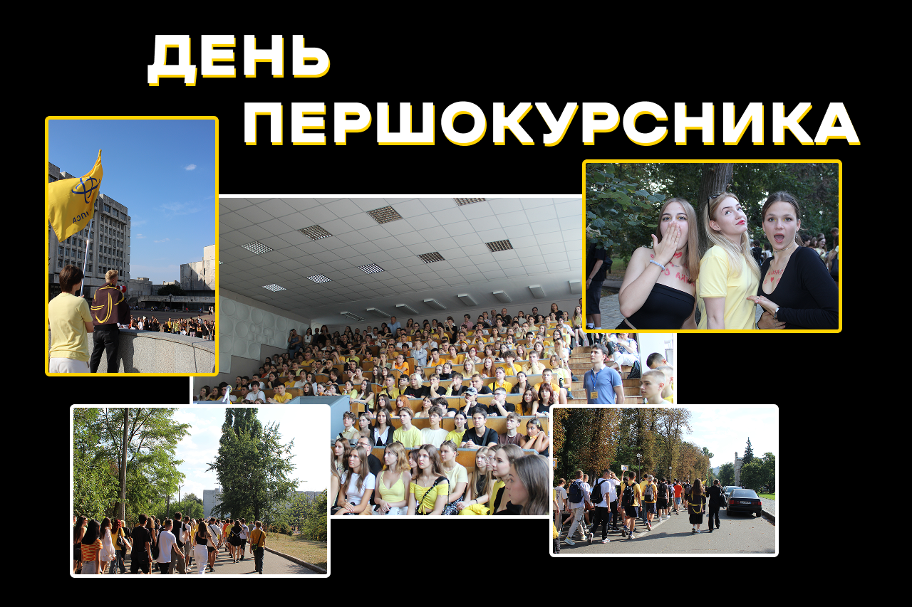

Ні для кого не секрет те, що Студрада ІПСА — одна з найактивніших, можливо, навіть у всій Україні. Кожен із відділів якісно й відповідально працює, а в цій статті ми поділимося візитівкою ІПСАшного позанавчального життя — івентами, які, скоріше за все, супроводжуватимуть тебе на тернистому шляху до фрази «Я БАКАЛАВР» або «Я МАГІСТР».

<!--truncate-->

---

## День першокурсника

Очевидно, що це твій перший день у ролі студента/ки. Доведеться не тільки зробити чимало відкриттів, як-от: зустрітися з групою та дізнатися, з ким проведеш ці роки життя, а й добре відсвяткувати знайомство в новій компанії. Після цього відбудеться яскравий парад каченят до площі знань, де всі першокурсники/ці зможуть відчути справжній дух єдності. Завершиться день захопливою афтепаті, де на тебе чекатимуть музика, танці та багато нових друзів.

## Пуща

Ласкаво просимо на посвяту в студенти. Захопливий квест у Пущі-Водиці перевірить твою спритність, кмітливість і стійкість до крінжу, а цікаві активності доповнять неймовірну атмосферу та дадуть змогу відпочити після початку навчання. Урочистим закінченням вечора стане поїдання тарілки гречки, що символізує початок студентського життя й готовність до подолання будь-яких викликів.

## Квест для першокурсників

Як тебе не любити, Києве мій! Після нашого івенту ти закохаєшся в столицю ще сильніше, особливо якщо гугл мапа — твій найкращий друг у мандрівках. Отримуй завдання для дослідження міста й пізнавай його пліч-о-пліч зі своєю групою. Потрібно докласти чимало зусиль, адже переможе найбільш згуртована команда.

## Fresh

Один із перших заходів для «свіжої» крові ІПСА. Аби презентувати себе, повеселити інших і закріпити знайомство з одногрупниками та кураторами, кожна група готує сценку на заздалегідь задану тему. Бери участь у конкурсах й отримуй багато незабутніх емоцій у компанії чудових людей.

## IASA Chess & WWW

Подія для справжніх інтелектуалів, чи не так? Насправді все доволі просто! Необхідно лише базове знання фігур та хороша пам'ять, щоб згадати корисну інформацію на «Що? Де? Коли?» з нічних переглядів тіктоку. IASA Chess & WWW — це про командну гру в теплому колі ІПСАшників/ць, де всі можуть стати стратегами та приємно провести час.

## IASA Halloween

Тематичний захід, присвячений усесвітньо відомому Дню всіх святих. Тут ти зможеш узяти участь у змаганнях за найкреативніший костюм або долучися до різноманітних конкурсів. Також невіддільною частиною подібних вечірок є запальні танці, які не закінчуються, допоки душа не покине тіло.

## IASA Royale

Перемога над молодшою сестрою в дурня... Це дійсно заслуговує поваги. Однак перевірити навички маминого шулєра можна не лише на рідних. IASA Royale створений спеціально для фанатів/ок полоскотати нерви: покер, блекджек та інші ігри чекають на те, коли ти розкриєш свій потенціал. Не забудь поцупити найліпшу татову сорочку, щоб точно пройти фейс-контроль.

## IASA cyberKnight

Захід для справжніх геймерів/ок і тих, хто знає, що таке «смоук у вікно». Це твоя можливість проявити себе в командних боях у Dota 2 або CS2 у форматі 5х5. Готуйся поринути в атмосферу справжнього кіберспортивного турніру та позмагатися за призи від партнерів і додаткові бали до рейтингу. Якщо замість підготовки до контрольних відпрацьовував скіли, то можеш сміливо претендувати на титул чемпіона, адже на IASA cyberKnight слабких не буває.

## IASA RetroFM

Вимкни сповіщення та увімкни ностальгію!  IASA RetroFM — найкращий момент, аби одягти татову куртку чи мамині лосини й зануритись у справжню дискотеку ретро. Танці, караоке, олдскульна атмосфера та, можливо, твій останній шанс поринути в минуле.

## IASA Toloka Day

Студентство — це не лише про навчання, іспити та дедлайни, а ще й про відповідальність, ініціативність і готовність діяти. На IASA Toloka Day ми об’єдналися заради збереження пам’ятки, щоб відновити її та повернути життя забутому мистецтву.

## IASA Kupala

Відчуй поклик вогню, шепіт стародавніх легенд і чарівну мить літньої ночі. IASA Kupala, сповнений обрядів, єднання з природою, міфами й власною душею. Якщо чуєш поклик вогнища й ледь чутний сміх мавок — час вирушати з нами на пошуки цвіту папороті.

## IASAmmer Party

Тематична вечірка, яка поверне тебе в яскраві 2010-ті — епоху флешок, Bluetooth-треків і леопардових лосин. Занурся в ностальгію, насолодися діджейським сетом з улюбленими хітами дитинства та покажи свій крутий лук у стилі того часу. А атмосферний танцмайданчик нагадає, що таке справжні танці й безтурботний кайф.

Учитися справді нелегко, але й нудьгувати не доведеться.

ІПСАшники/ці вміють:

- губитися групою як на перших контрольних, так і під час квесту;

- розважатися до ранку з матаном, а потім знову не спати, бо потрібно тренуватися перед IASA cyberKnight;

- замість першої пари ліналу солодко бачити сни вдома після Fresh.

Унікальність наших заходів полягає в тому, що чудові люди створюють їх для чудових людей. Ком'юніті — це те, що зробить твоє навчання в ІПСА насиченим і незабутнім!

Більше фото можна побачити на нашій [сторінці](https://www.facebook.com/studrada.iasa) у фейсбуці, у [хайлайтах](https://www.instagram.com/studrada_iasa?igsh=dngzeG01d2g4azg2) інстаграму та в [телеграм-каналі](https://t.me/iasa_event).

**P.S.** На жаль, через війну не можна передбачити, чи всі заходи буде проведено. Не виключено, що вони відбудуться в меншій кількості, іншому форматі або онлайн. Імовірно, будуть замінені новими крутими івентами. Дякуємо нашим захисникам за те, що маємо можливість поєднувати навчання з відпочинком у такі складні часи!

