Ні для кого не секрет те, що Студрада ІПСА — одна з найактивніших, можливо, навіть у всій Україні. Кожен із відділів якісно й відповідально працює, а в цій статті ми поділимося візитівкою ІПСАшного позанавчального життя — івентами, які, скоріше за все, супроводжуватимуть тебе на тернистому шляху до фрази «Я БАКАЛАВР» або «Я МАГІСТР».

<!--truncate-->

---

## День першокурсника

Очевидно, що це твій перший день у ролі студента/ки. Доведеться не тільки зробити чимало відкриттів, як-от: зустрітися з групою та дізнатися, з ким проведеш ці роки життя, а й добре відсвяткувати знайомство в новій компанії. Після цього відбудеться яскравий парад каченят до площі знань, де всі першокурсники/ці зможуть відчути справжній дух єдності. Завершиться день захопливою афтепаті, де на тебе чекатимуть музика, танці та багато нових друзів.

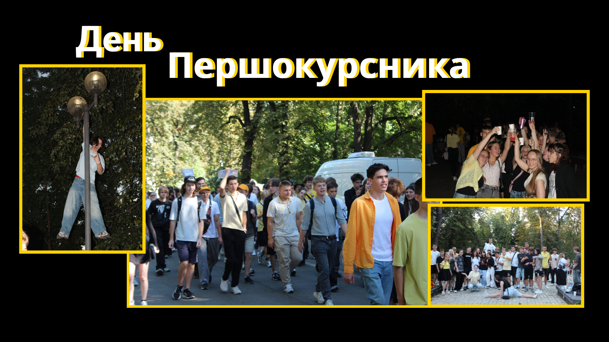

## Пуща

Ласкаво просимо на посвяту в студенти. Захопливий квест у Пущі-Водиці перевірить твою спритність, кмітливість і стійкість до крінжу, а цікаві активності доповнять неймовірну атмосферу та дадуть змогу відпочити після початку навчання. Урочистим закінченням вечора стане поїдання тарілки гречки, що символізує початок студентського життя й готовність до подолання будь-яких викликів.

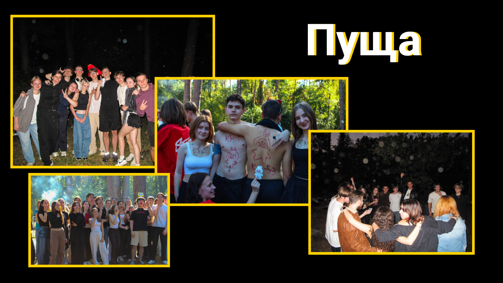

## Квест для першокурсників

Як тебе не любити, Києве мій! Після нашого івенту ти закохаєшся в столицю ще сильніше, особливо якщо гугл мапа — твій найкращий друг у мандрівках. Отримуй завдання для дослідження міста й пізнавай його пліч-о-пліч зі своєю групою. Потрібно докласти чимало зусиль, адже переможе найбільш згуртована команда.

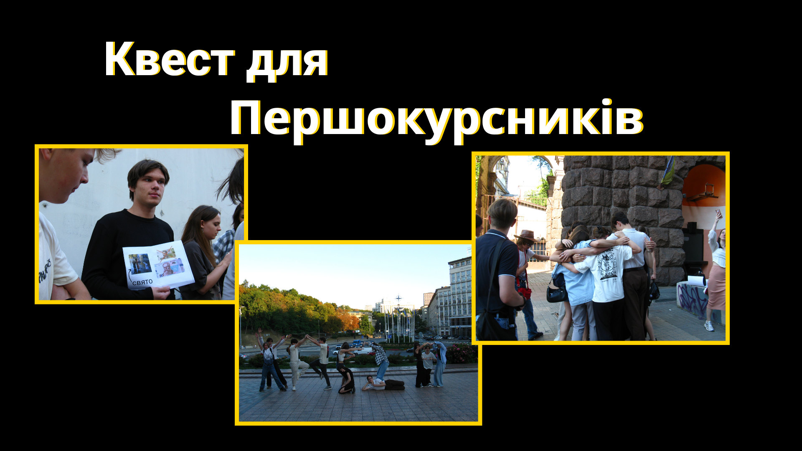

## Fresh

Один із перших заходів для «свіжої» крові ІПСА. Аби презентувати себе, повеселити інших і закріпити знайомство з одногрупниками та кураторами, кожна група готує сценку на заздалегідь задану тему. Бери участь у конкурсах й отримуй багато незабутніх емоцій у компанії чудових людей.

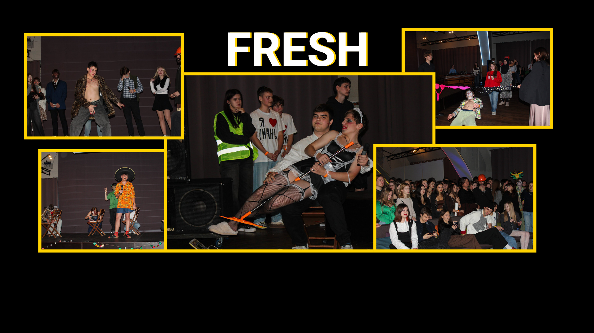

## IASA Halloween

Тематичний захід, присвячений усесвітньо відомому Дню всіх святих. Тут ти зможеш узяти участь у змаганнях за найкреативніший костюм або долучися до різноманітних конкурсів. Також невіддільною частиною подібних вечірок є запальні танці, які не закінчуються, допоки душа не покине тіло.  

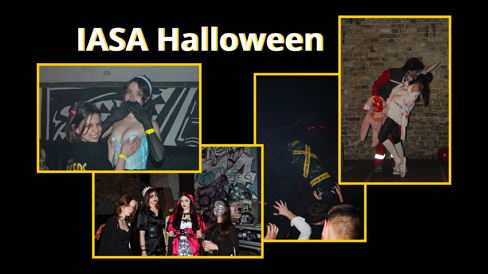

## IASA WWW

Мислиш швидко й логічно? Бажаєш перевірити власну ерудицію? Тоді тобі точно сподобається гра «Що? Де? Коли?». У тебе буде можливість зібрати свою команду та позмагатися за приз із іншими гравцями, можливо, навіть із викладачами. IASA WWW — це про інтелектуальну гру в теплому колі ІПСАшників/ць, де всі можуть стати стратегами.

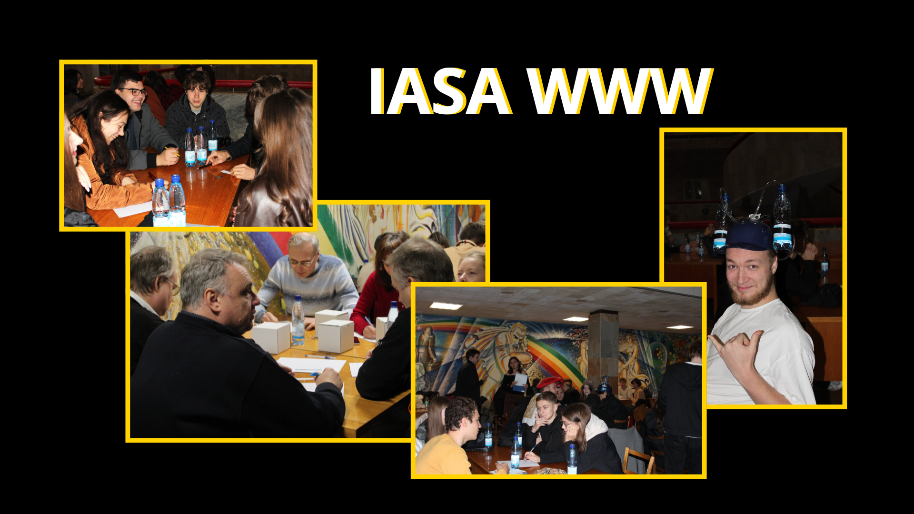

## IASA Survived Cowboy

Ти дійсно зміг пройти такий загально-КПІшний івент як сесія? Тут уже неважливо, чи це завдяки допомозі всіх наявних богів, або просто результат сумлінного навчання. IASA Survivors відкриває для тебе свої обійми. Це тематичний івент, де всі, хто вижили, зібралися для відпочинку перед початком семестру та вшанування пам’яті відрахованих. 

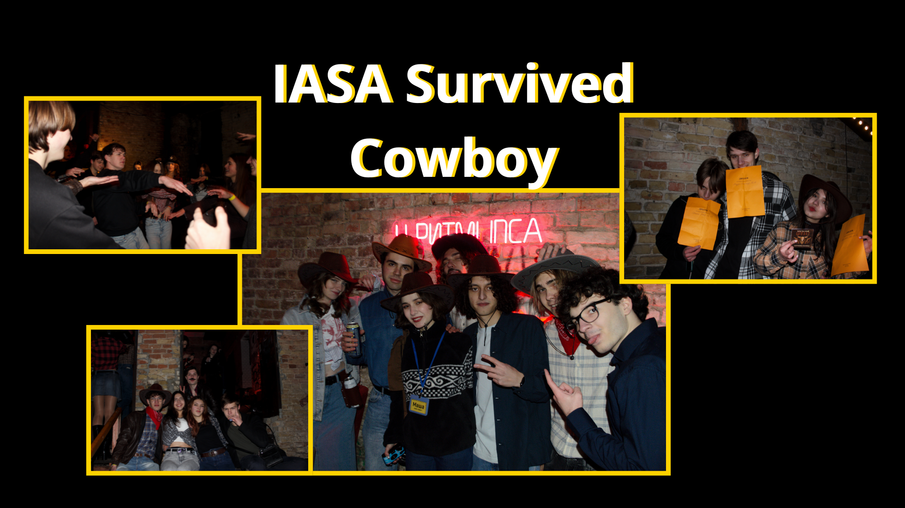

## IASA Valentine's Day

Найромантичніший івент у колекції кожного ІПСАшника! Хочеш поринути в атмосферу кохання та веселощів? Купідони ІПСА вже вишукують тебе. На тебе чекають захопливі конкурси, інтерактивні ігри та різноманітні активності, що допоможуть знайти нових друзів і навіть свою половинку. Також у програмі вечора танці, фотозони, де ви зможете зробити незабутні знімки, і, звичайно ж, приємні сюрпризи. Не пропусти можливість відзначити цей особливий день у колі студентів ІПСА.

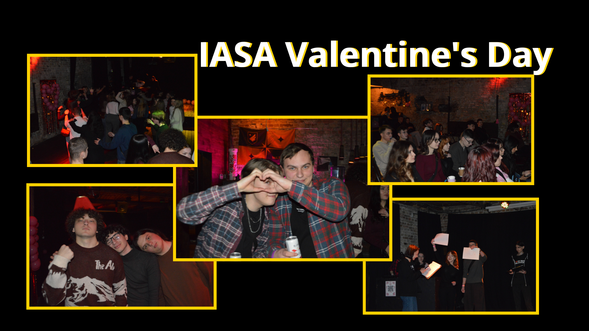

## IASA Toloka Day

Студентство — це не лише про навчання, іспити та дедлайни, а ще й про відповідальність, ініціативність і готовність діяти.  Милі мордочки, гавкіт і муркотіння – цього року на  IASA Toloka: Pet-friendly edition ми зібрались, щоб допомогти притулку Patron Pet Center та зробили збір на їх потреби. 

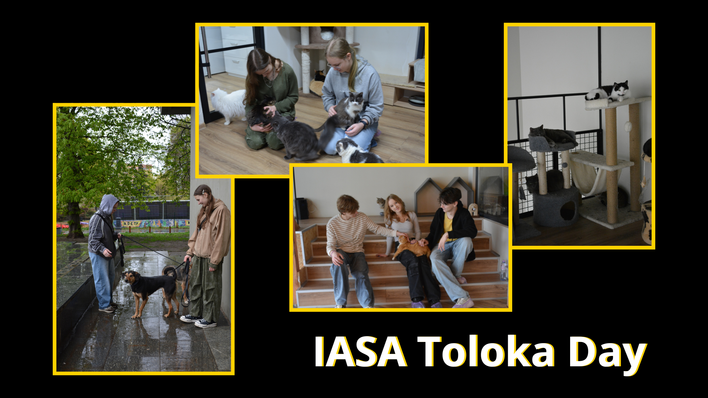

## IASA Spring Ball

Давно мріяв/ла про вечір казкового балу? На IASA Spring Ball ти відчуєш себе героєм / героїнею величного дійства, який запам'ятається надовго! Одягни своє найкраще вбрання, оскільки на тебе чекатимуть елегантна атмосфера та вечір повного зачарування. На заході ти зможеш насолодитися вальсом і вишуканою виставою, відчути себе частиною королівського вечора та взяти участь в інтерактивах. Після церемонії коронування не закінчуй святкування, адже на тебе чекає незабутнє афтепаті, де ти зможеш продовжити відриватися на танцполі під улюблені треки. 

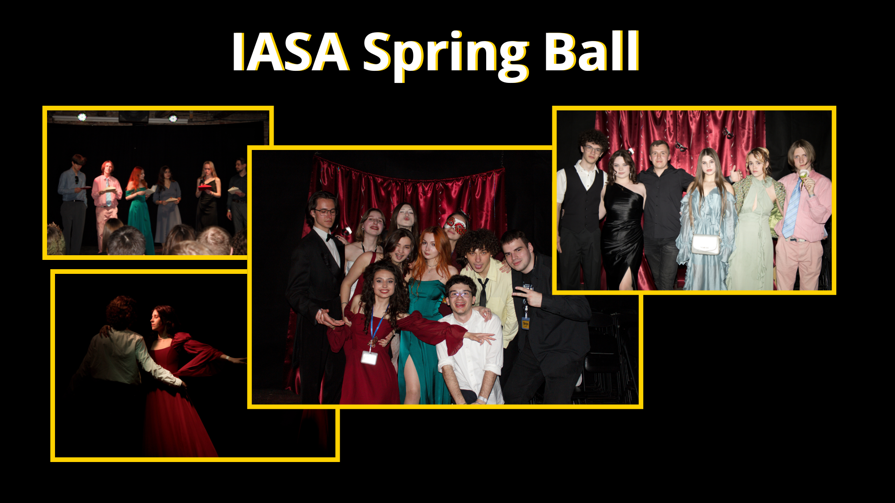

## IASA CyberKnight

Захід для справжніх геймерів/ок і тих, хто знає, що таке «смоук у вікно». Це твоя можливість проявити себе в командних боях у Dota 2 чи CS2 у форматі 5х5. Готуйся поринути в атмосферу справжнього кіберспортивного турніру та позмагатися за призи від партнерів і додаткові бали до рейтингу. Якщо замість підготовки до контрольних відпрацьовував/ла скіли, то можеш сміливо претендувати на титул чемпіона, адже на IASA cyberKnight слабких не буває.

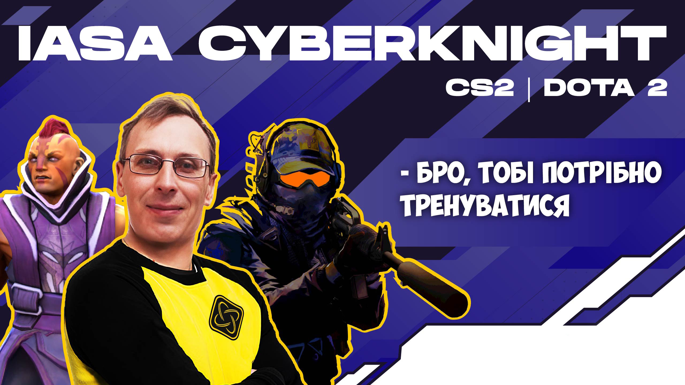

## IASA Jazz & Jackpots

Мрієш відчути вайб атмосфери Великого Ґетсбі? IASA Jazz & Jackpots — тут не буде другорядних ролей. Покер, мафія, блекджек та атмосфера немов у заштореній кімнаті: жива музика, м'яке світло та погляди, що говорять більше за слова, і джаз як частина історії. Головне — не витрать всю свою стипендію!

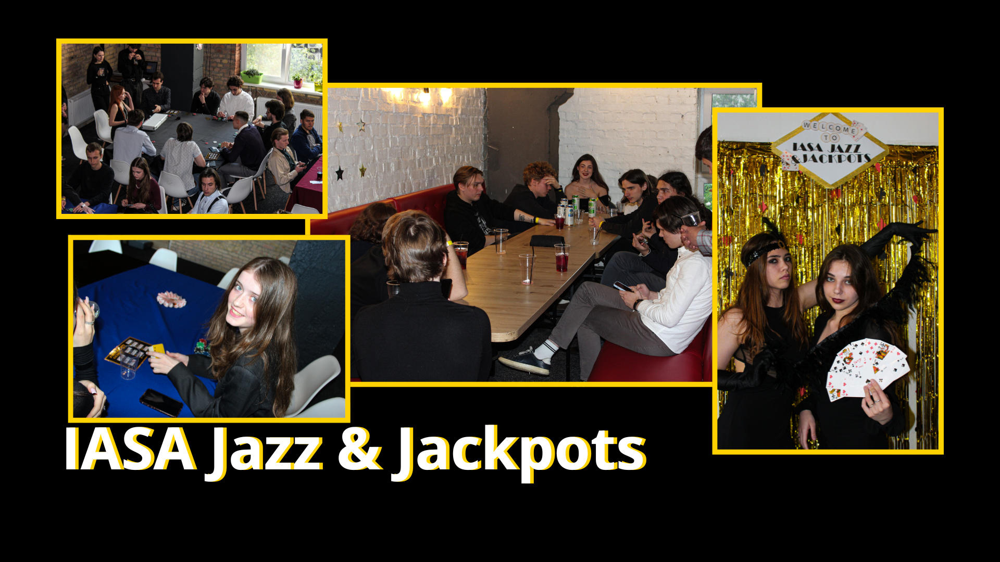

## IASA Івана Купала

Відчуй поклик вогню, шепіт стародавніх легенд і чарівну мить літньої ночі. На IASA Івана Купала, де приємне тепло огортає тіло й душу, серце б'ється в такт солов'їній пісні, а кожен момент стає особливим. Усе навколо сповниться запалом і легким туманом чар — від забав до обрядів.

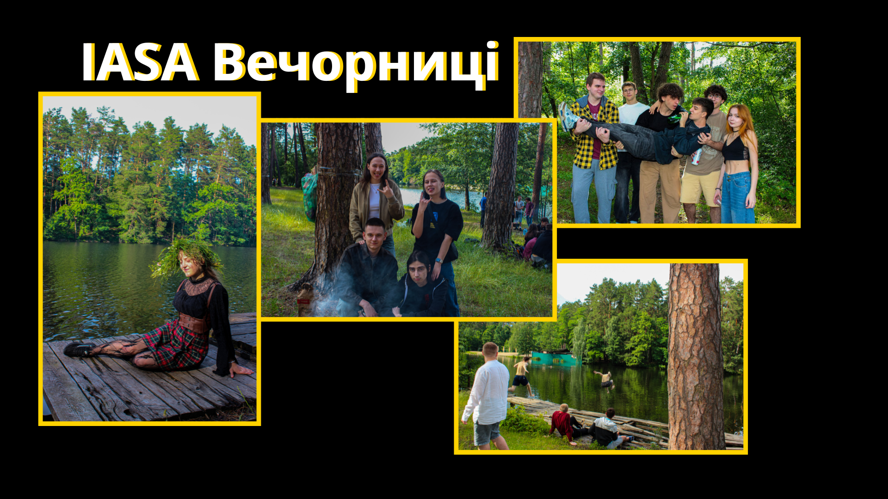

## IASAmmer

Тематична вечірка, яка на один вечір занурить тебе у гавайський вайб — квіти, леї та тропічні ліани. Атмосферний танцмайданчик нагадає, що таке справжні танці й безтурботний кайф, а неон допоможе не загубити друга в натовпі. 

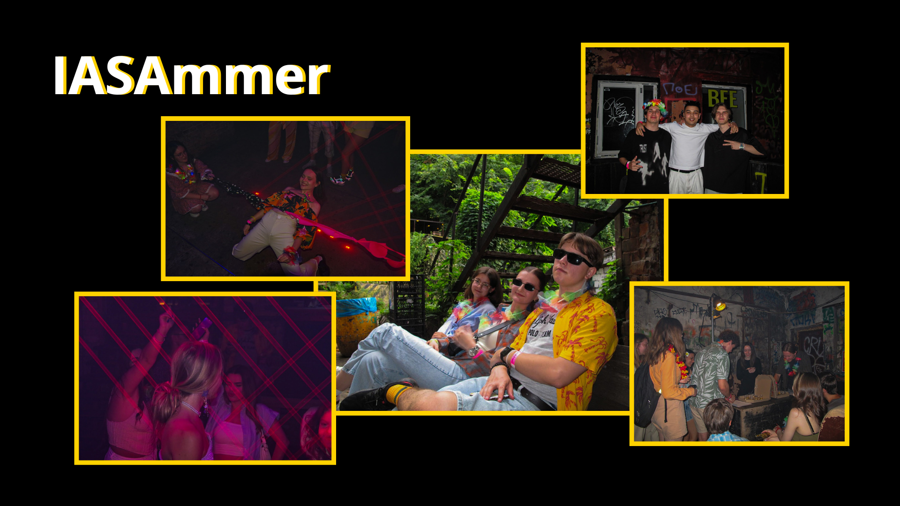

Учитися справді нелегко, але й нудьгувати не доведеться. 

ІПСАшники/ці вміють: 

- губитися групою як на перших контрольних, так і під час квесту;

- готуватися ночами до додаткової сесії, а потім відчувати себе вільними, як на Дикому Заході під час **IASA Survived Cowboy**;

- замість першої пари ліналу солодко бачити сни вдома після Fresh.

Унікальність наших заходів полягає в тому, що чудові люди створюють їх для чудових людей. Ком'юніті — це те, що зробить твоє навчання в ІПСА насиченим і незабутнім!

Більше фото у наших [хайлайтах](https://www.instagram.com/studrada_iasa?igsh=dngzeG01d2g4azg2) інстаграму та [телеграм-каналі](https://t.me/iasa_event).

**P.S.** На жаль, через війну не можна передбачити, чи всі заходи буде проведено. Не виключено, що вони відбудуться в меншій кількості, іншому форматі або онлайн. Імовірно, будуть замінені новими крутими івентами. Дякуємо нашим захисникам за те, що маємо можливість поєднувати навчання з відпочинком у такі складні часи!

