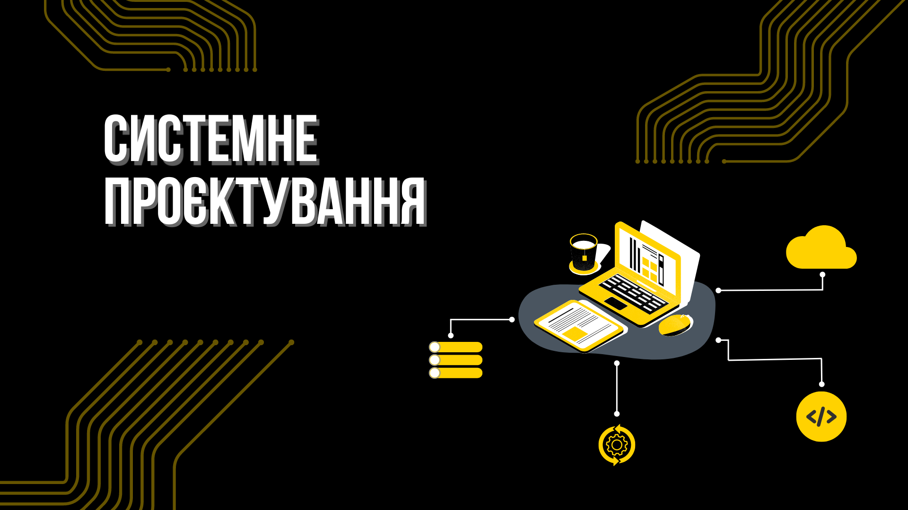
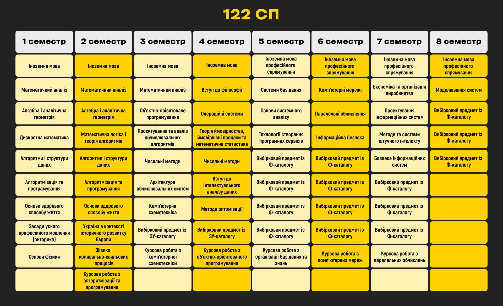
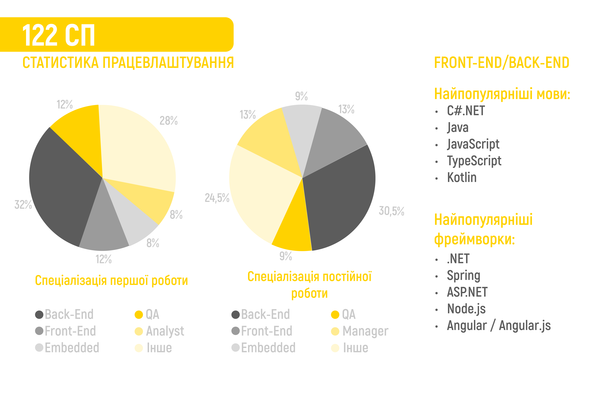
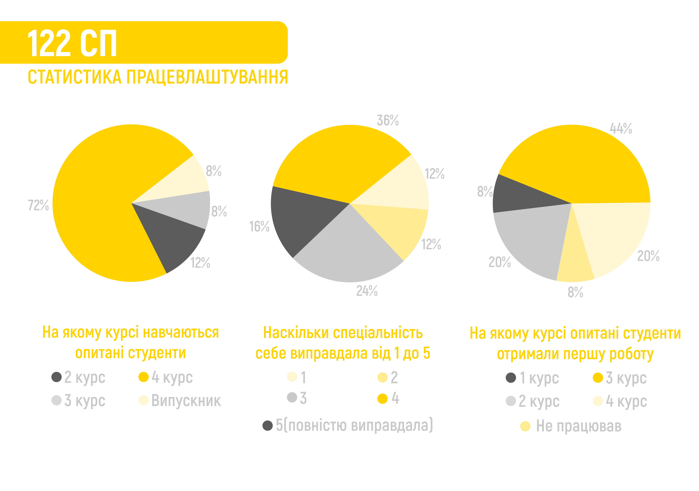

### База

Освітня програма цієї катедри має назву «Інтелектуальні сервіс-орієнтовані розподілені обчислювання». Перше слово звучить круто (це не стаття про ШІ), інші 一 вже досить незрозумілі та складні. Попросивши СПшника коротко розповісти, що тут вивчається, дуже висока ймовірність почути щось на кшталт «ну, трохи уклон в залізо» чи «айті-солянка» й заплутатися ще більше. Істина ж полягає в тому, що ця катедра уособлює собою різноманітність 122 спеціальності. Тут дадуть «помацати» ледь не кожен напрям у сфері, проте докладніше заглибитися в область, що сподобається, залишать на самого студента. До того ж тут дисциплінам про вищезгадану апаратну частину приділять трохи більше уваги, ніж, наприклад, на сусідній ШІ.

<!--truncate-->

import MobileTOC from "../../../src/components/MobileTOC/MobileTOC.jsx";

<MobileTOC sections={[
    { heading: "Дисципліни", subHeadings: []},
    { heading: "ППОфесії", subHeadings: []},
    { heading: "Думки чемпіонів", subHeadings: []},
    { heading: "Висновок", subHeadings: []}
]}/>

### Дисципліни

Системне проєктування — це майданчик, де технічні дисципліни зливаються з креативним мисленням, розширюючи горизонти в подальшому розвитку та працевлаштуванні.

Попри те, що математична підготовка на СП не настільки поглиблена, як на інших катедрах ІПСА, вона все ще на високому рівні, і це слугує важливим фундаментом для майбутнього навчання й роботи. Лінійна алгебра та аналітична геометрія можуть відчинити двері до світу розробки ігор, де всі координати й вектори мають своє вагоме значення. А дискретна математика, як секретний ключ, допомагає розкривати таємниці архітектури комп’ютерів і багато інших загадок.

Перші кроки в програмуванні мовами С й С++ занурюють студентів у світ структур і алгоритмів, що стануть відправною точкою в подальшій подорожі. Курс подальшого розвитку студенти можуть самі вибирати, концентруючись на певних предметах.

Студентське опитування показало, що серед усіх предметів особливо вирізняються об’єктно-орієнтоване програмування й курси з алгоритмів і структур даних. Вони вчать мислити логічно та креативно, а не просто писати код.

Упродовж навчання здобувачам освіти також доведеться заглибитись у світ архітектури комп’ютера й дізнатися, чому деякі програми стрімко мчать, немов боліди Формули-1, а інші рухаються повільно, як черепахи на пляжі. Можливо, настільки детальні знання стануть у пригоді не всім, проте для професій, що тісно взаємодіють не тільки з програмною, але й з апаратною складовою, вони точно будуть незамінними.

Перелік усіх дисциплін наведено нижче.

Тут ти можеш ознайомитися із [ЗУ-каталогом](https://osvita.kpi.ua/sites/default/files/downloads/ZU-Katalog-2022.pdf), а також [Ф-каталогом](http://cad.kpi.ua/wp-content/uploads/2023/03/fkat_122_oppb_isoro_2023.pdf)

**P.S.** Список вибіркових предметів може змінюватися.

### ППОфесії

#### Backend Developer
Займається розробкою та підтримкою серверної частини вебдодатків: баз даних й інших компонентів, необхідних для функціонування вебсервісів. Він також відповідає за роботу з логікою програми, забезпечуючи коректну відповідь на запити від клієнтської частини та надсилання необхідних даних. Для цього використовуються різні мови програмування й технології, як-от: .NET, Python, Java, Node.js, різноманітні фреймворки та бібліотеки.

>*«Розробка велетенської ненової системи, її підтримка, частковий рефакторинг. Попри посаду молодшого розробника, маю обов‘язки, ідентичні зі співкомандниками».*

>*«Третій місяць анбордингу (випробування), на другому вже почали давати завдання, які безпосередньо впливають на продукт. Дуже стрімке зростання в знаннях і досвіді, таски з кожним разом усе складніше».*

>*«Розробка та підтримка додатка для Revit згідно з вимогами інженерів. Робота з 3D, інформаційними моделями будівель і все таке».*

#### Game Developer
Фахівець, який займається створенням і вдосконаленням відеоігор. Ця роль охоплює розробку геймплейних механік, візуальних ефектів, анімації та звукового оформлення, які додають глибини та реалізму. Іншу частину роботи складає оптимізація продукту для різних платформ: від комп'ютерів до консолей і мобільних пристроїв.
Web-developer — розробник інтернет-ПЗ.

>*«С / С++ — це база, яку отримав в універі та яка використовується в роботі. Лінійна алгебра, дискретна математика, АСД (Алгоритми та структури даних) допомогли. Наскільки? Можливо, на 6/10. Деякі знання я отримав та активно ними  користуюся, інші предмети вивчив і забув».*

#### Engine / Render Developer
Спеціаліст, який займається розробкою й оптимізацією технологій, що використовуються для реалізації графіки в комп’ютерних іграх. Ця роль охоплює створення рушіїв (двигунів), які відповідають за обробку фізики, а також рендерингу й спеціальних візуальних ефектів. Вони вдосконалюють алгоритми для оптимізації продуктивності та якості графіки в іграх.

>*«Робота 99% C++ і 1% скриптів на пітоні, також шейдерні мови HLSL / GLSL. Працюю з Vulkan / DX12 та іншими графічними апішками. Основні завдання полягають у виправленні графічних багів, пов'язаних із платформеною імплементацією якихось фіч або фіксом будь-якої частини пайплайну розробки візуальної складової».*

#### Software Developer
Фахівець, який створює, тестує та підтримує програми й додатки для різних платформ. Він використовує різноманітні мови програмування, наприклад: С++, Java, C#, Swift, Kotlin тощо. Розробники програмного забезпечення працюють у різних галузях, включно з мобайлом, ігровою індустрією, вбудованими системами і багато чим іншим. Вони також відповідають за тестування коду, виправлення помилок, оптимізацію продуктивності та безпеку ПЗ.

>*«Чим займаюся? Реалізацією алгоритмів обчислювальної геометрії, графіки та інтерфейсу. У пригоді стали алгоритми й структури даних, аналітична геометрія, були б корисними комп’ютерна графіка з 3 курсу (Прим.ред. Це вибірковий предмет) й паралельні обчислення».*

#### Frontend Developer
Спеціаліст, який відповідає за створення вебінтерфейсів для користувачів. Він працює з HTML, CSS, JavaScript та різними фреймворками, щоб створювати візуальну частину вебдодатків і вебсайтів. Фронтенд розробник також займається оптимізацією вебсторінок для швидкості завантаження та взаємодії з користувачем, а також забезпечує сумісність із різними браузерами та пристроями.

#### Fullstack Developer
Якщо ти знаєш, хто такі Frontend і Backend Developer, то, об’єднавши їх, отримаєш Fullstack розробника.

>*«Я працюю в українській аутсорсинговій компанії. Моїми основними обов’язками є написання бекенду для наших сайтів та мобільних додатків, а також іноді допомагаю на фронтенді. Додатково спілкуюся з клієнтами як технічний спеціаліст, проводжу код рев'ю колегам, займаюся інфраструктурою проєкту й час від часу менторю нових розробників у компанії. Я почав працювати наприкінці 1 курсу. З предметів ІПСА найбільше мені знадобилися: алгоритми та структури даних (мабуть, один із найбільш корисних), об’єктно-орієнтоване програмування й трохи бази даних.*
>
>*Мій стек: TypeScript, ReactJS, NodeJS, PostgreSQL, AWS».*

#### Project Manager
Відповідає за керівництво проєктом із початку та до завершення. PM визначає цілі, розробляє план дій, розпоряджається необхідними для втілення задач ресурсами, керує командою, аби робота була завершена якісно й у встановлений термін. Також відповідає за звітність перед зацікавленими сторонами, вчасну здачу проєкту згідно з вимогами та контролює бюджет.

#### Embedded Developer
Займається розробкою програмного забезпечення для напряму інтегрованих в апаратне забезпечення систем. До його обов’язків належить аналіз вимог, проєктування, програмування, тестування та налагодження алгоритмів спеціалізованих апаратних платформ. Він пише код для мікроконтролерів, мікропроцесорів тощо, використовуючи С, С++ чи мову асемблера.

#### Machine Learning Engineer
Розробляє та впроваджує системи машинного навчання й штучного інтелекту, створює алгоритми для аналізу даних та побудови прогнозів. Спеціалісти в цій галузі також відповідають за оцінку та вдосконалення якості моделей, для якомога ефективнішого розв’язання задач.

#### Data Scientist
Використовує різноманітні методи й алгоритми для аналізу великих обсягів даних із метою виявлення закономірностей, трендів і кореляцій. Застосовує статистику, машинне навчання й інші техніки, щоб отримати корисну інформацію, яка може допомогти організаціям у прийнятті кращих рішень. Роль Data Scientist охоплює роботу з даними, їхній аналіз, візуалізацію та інтерпретацію результатів.

### Думки чемпіонів
>*«Замітка для абітурієнта: уявіть, що тебе кидають у неймовірно величезне болото під назвою «Українська ІТ-освіта». Твоя ціль — вигребти з цього болота до моря Українська ІТ-індустрія, а звідти — в океан Світова ІТ-індустрія. На початку шляху альма-матер надає інвентар із декількох предметів, які мають допомогти в цій подорожі. На якомусь факультеті це весло, на якомусь — дошки та цвяхи. У випадку ІПСА — це мотузка й мило. Спочатку вони зваблюють вкоротити собі віку, але зробити це ніяк: ти ж посеред болота, тут навіть дерев немає. Згодом починаєш думати, яким чином це можна застосувати. Через певний час із мотузки робиш ласо та збираєш ним собі гілочки. Зрештою, у тебе є засіб, який дозволяє пересуватися по болоту швидше, ніж пішки, і ти дістаєшся до моря, де використовуєш мило, щоб помитися та представити себе світу».*

>*«Напевно, найкраще в навчанні (та єдине, що утримує від відрахування) — це круті одногрупники».*

>*«Взагалі непогано, але велику увагу на першому курсі приділяють математичним предметам. На саме програмування відведено не так багато часу. Проте, звісно, математика дуже потрібна для деяких галузей».*

>*«Велика кількість випробувань та «відкриттів», що зрештою допомагають у пошуці роботи».*

>*«Важкувато, але загалом більш-менш нормально. Однак при вступі думав, що враження після першого семестру будуть кращими».*

>*«Навчання на СП справді можна порівняти з американськими гірками. Є моменти, коли відчуваєш себе справжнім хакером, готовим зламати Пентагон, і водночас є дні, коли здається, що твої знання скоріше на рівні мавпи, що тільки вчиться користуватися клавіатурою. Але ти швидко до цього звикаєш».*

>*«Дуже великий контраст між деякими предметами та викладачами: хтось робить свою роботу справно й цікаво викладає матеріал, при цьому не душить та приємний у спілкуванні, а хтось усі ці пункти перекреслив ще на першому занятті».*

>*«А взагалі ..... це все, треба було йти на клоуна та працювати в цирку».*

### Висновок

Якщо порівнювати з іншими катедрами ІПСА, то ця націлена на тих, хто не настільки зацікавлений у математиці, як у програмуванні та йому дотичних. «Системне проєктування» однозначно підійде тобі, якщо хочеш працювати в IT, але поки не впевнений ким саме, якщо можеш витримати і незрозумілі вимоги, і комплексні сучасні практики та готовий викладатися на всі 122%, аби встигнути за дедлайнами.

А взагалі ти, швидше за все, неповнолітній абітурієнт. Усі такими були. Читаєш чергову статтю, де кожен відгук про катедру змінює думку. Перед носом роздоріжжя, а ти хочеш розвернутися і насправді можеш це зробити. Та річ у тому, що завжди буде можливість грюкнути дверима та вибрати щось інше. Спеціальність не є чимось перманентним та остаточним. Пробуй, і все буде добре!

