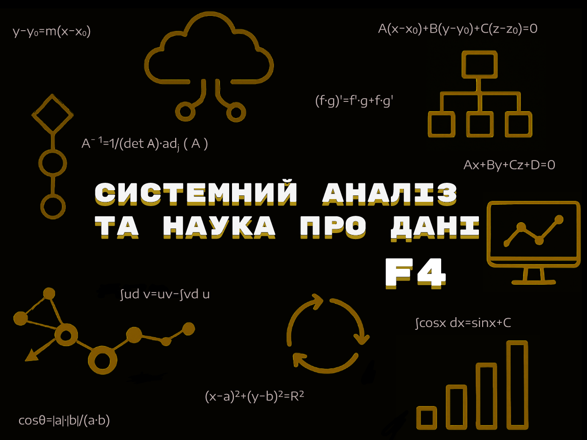
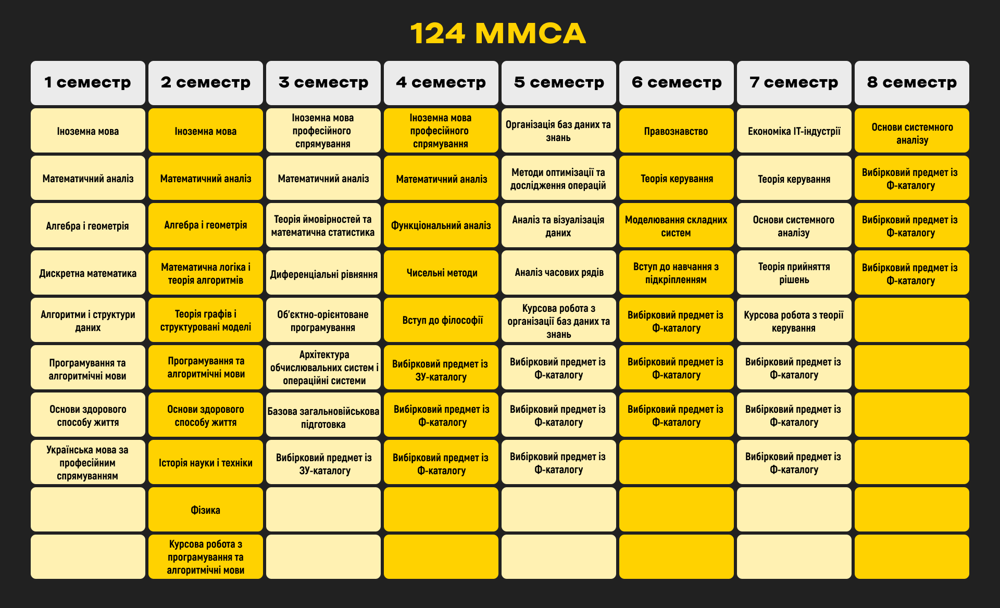

_Як з'їсти «Сисан»?_

<!--truncate-->

---

## База

Перше питання, яке виникає в абітурієнтів з приводу цієї чудової спеціальності — це не предмети, які вивчаються на ній, і навіть не зацікавленість щодо можливого працевлаштування. Вони зіштовхуються з головним квестом: розтлумаченням загадкової назви спеціальності. Системний аналіз — дуже гарна назва й надзвичайно страшна дефініція. А після перейменування спеціальності на «Системний аналіз та наука про дані» є вірогідність загубити значення деяких слів. Отже, ця методологія використовується для прогнозування в різних сферах, наприклад: виявлення тенденцій у продажах або визначення чинників, які впливають на рівень виконання вимог замовників, і надає можливості для передбачення поведінки системи. Також на F4 спеціальності вивчають формалізацію та побудову моделей із розумінням необхідності їхнього впровадження в комп'ютерне середовище. Для кращого поверхневого розуміння, достатньо прибрати прикметник "системний"  і отримати менш загадкового аналітика.

## Дисципліни: математика, програмування та щось ще

Під час навчання на освітній програмі «Системний аналіз і управління» значна увага приділяється формуванню міцної теоретичної бази, що є фундаментом для подальшого освоєння спеціалізованих дисциплін.

### Фундаментальні математичні дисципліни

**Математичний аналіз** — ваш новий найкращий друг. Диференціальні рівняння, інтеграли, функції багатьох змінних… Все це знадобиться не лише для складання екзаменів, а й для розуміння алгоритмів, оптимізації та машинного навчання.

**Дискретна математика** — теорія графів, комбінаторика, логіка. Без неї неможливо розібратися в алгоритмах або проєктувати бази даних.

**Алгебра та геометрія** — цей курс складається з двох частин: аналітичної геометрії та лінійної алгебри. Аналітична геометрія навчить вас працювати з векторами, площинами та лініями в просторі, що стане основою для розуміння 3D-графіки та комп'ютерного моделювання. Лінійна алгебра — це мова машинного навчання: матриці, власні вектори, системи лінійних рівнянь. Без неї несила зрозуміти, як працюють нейронні мережі, алгоритми рекомендацій чи обробка зображень.

**Теорія ймовірностей та математична статистика** — якщо хочете працювати з даними, це must-have. A/B-тести, прогнозування, аналіз ризиків — з усім цим вам доведеться познайомитися.

Багато студентів вважають, що це так звана база, на якій усе тримається. Ці предмети є основою для розуміння наступних і допомагають на практиці застосувати їх у найрізноманітніших сферах.

### Програмування: від основ до складних систем

**Програмування та алгоритмічні мови** — цей курс є фундаментальним для вивчення основ програмування та алгоритмізації. Передбачена курсова робота.

**Об’єктно-орієнтоване програмування (ООП)** — один із найцікавіших предметів, на думку студентів. Тут ви навчитеся писати код, який легко масштабувати та підтримувати.

**Організація баз даних та знань** — курс, що охоплює принципи побудови та управління базами даних. Вас навчать проектувати, оптимізувати запити і розуміти, чому ваш SQL-запит працює повільно. Також передбачена курсова робота.

### Системний аналіз та суміжні дисципліни

**Теорія керування** — як будувати ефективні системи, аби вони не розвалювалися під навантаженням. Передбачена курсова робота.

**Системний аналіз** — це саме та дисципліна, на яку ви, можливо, йшли. Вона вивчає теоретичні основи розв’язання міждисциплінарних задач, а також моделі, підходи, методи та алгоритми, що використовуються для їхнього аналізу.

**Вступ до навчання з підкріпленням** — новий компонент освітньої програми, що знайомить з основами машинного навчання.

### Загальноосвітні компоненти

Програма також включає загальноосвітні дисципліни, що розширюють кругозір студентів, такі як «Українська мова за професійним спрямуванням», «Історія науки і техніки», «Економіка ІТ-індустрії», «Правознавство».

Перелік усіх дисциплін наведений нижче.

### Вибіркові компоненти

Окрім обов'язкових дисциплін, студенти мають можливість обрати освітні компоненти з загальноуніверситетського та професійного каталогів, що дозволяє індивідуалізувати освітній шлях та поглибити знання в обраних напрямах.
Тут ти можеш ознайомитися із [ЗУ-каталогом](https://osvita.kpi.ua/sites/default/files/downloads/zu-katalog-2025.pdf), а також [Ф-каталогом](http://mmsa.kpi.ua/sites/default/files/fkat_124_onpd_sa_2025.pdf).

Світ не стоїть на місці, і ми теж. Наші освітні програми постійно оновлюються, щоб йти в ногу з часом. Інститут не просто дає знання — він створює ваші конкурентні переваги.

Хочемо ознайомити з останніми змінами в ОП:
1. Додано новий загальноосвітній компонент: «Теоретична підготовка базової загальновійськової підготовки».
2. Курс вивчення фізики зменшено до одного семестру.
3. Тривалість вивчення англійської мови було скориговано до чотирьох семестрів.
4. «Архітектура обчислювальних систем і комп'ютерних мереж» та «Операційні системи» об'єднані в один курс «Архітектура обчислювальних систем і операційні системи».
5. Курси «Теорія ймовірностей» та «Математична статистика» об'єднані в один — «Теорія ймовірностей та математична статистика».
6. Прибрали наступні дисципліни: «Теорія стійкості та варіаційне числення» та «Рівняння математичної фізики».
7. Нові компоненти в програмі: «Вступ до навчання з підкріпленням», «Аналіз часових рядів», «Аналіз та візуалізація даних».

## Працевлаштування

Студенти F4 спеціальності працюють у різних напрямах ІТ-сфери. Найчастіше вони починають кар’єру як аналітики, займаючись аналізом даних і підтримкою бізнес-рішень. Популярними напрямками також є Back-end і Front-end розробка, де вони відповідають за технічну частину продукту та його візуальну складову. Деякі студенти обирають напрям Data Science, працюючи з аналітикою, штучним інтелектом і машинним навчанням. Частина випускників займається тестуванням програмного забезпечення, забезпечуючи його якість, або керує процесами розробки в ролі Project Manager. Згодом деякі переходять на позиції Full-stack розробників, поєднуючи кілька технічних ролей.
Більше читай у [статті](https://iasastudentcouncil.github.io/iasa-sc-blog/blog/Jobs).

## Відгуки

Перед вибором спеціальності завжди хочеться знати більше, ніж пишуть у програмах. А хто краще розповість про навчання, ніж ті, хто сам через це проходить? Ми зібрали відгуки студентів, які вже обрали F4-у і готові поділитися досвідом!

Питання, на які давали відповіді студенти: 
1. Що тобі сподобалось / не сподобалось у навчанні? 
2. Чи не жалкуєш, що обрав/ла 124? 
3. Загальне враження про навчання.

**Дисклеймер:** навчання вступників 2024-го та наступних років відбувається у змішаному форматі.

**1й Курс**

> «Неіронічно, ні разу не шкодувала про обрану спеціальність. Мою увагу при виборі місця навчання привернули саме викладачі, оскільки читала лише позитивні історії - так воно і сталося. Душних та грубих можу на пальцях однієї руки перелічити, всі інші зайки: багато хто готовий витрачати особистий час на те, аби додатково щось пояснити, допомогти вирішити задачку, і багато з них дійсно люблять свою справу. Це, як на мене, найважливіше, що треба в собі мати, щоб викладати. Дисципліни загалом цікаві, але щодо їхньої складності залякують. Викладачі компетентні, надають усі потрібні матеріали для того, аби мати змогу зрозуміти все з першого разу. Якщо не бути лінтяюгою, і хоч би трошки посидіти над якимось предметом, то закрити дисципліни гарно насправді не важко. Протягом першого семестру бувало, що сумнівалася у тому, чи реально знадобиться мені в майбутньому те, що я вивчаю, проте в другому семестрі така думка розвіялась. Я не думаю, що в майбутньому уж багато буду рахувати інтеграли та ряди, перевіряти чи щось є групою/решіткою/ляляля, проте це все викарбовує у людині аналітичне та логічне мислення. аби довести теорему, треба розуміти та бачити речі з іншої сторони, і ось це вже в майбутньому буде необхідне».

> «Загалом мені все подобається від оточення і до (іноді дуже) складного матеріалу, який в нас викладають. Навчання відбувається у змішаному форматі, тому це найбільш кайфовий баланс який існує. Математичні дисципліни подаються зрозуміло, більшість викладачів дійсно йдуть на зустріч всім студентам. "Страшного" програмування в нас не було, вчать все з нуля мовою С++, бувають як корисні-прикладні завдання, так і просто цікаві над якими думаєш декілька днів поспіль, але викладачка радо допоможе та на консультаціях пояснить, якщо щось не зрозуміло. В другому семестрі ми писали курсову роботу з проги, якщо все вчасно робити то за місяць можна впоратись та отримати свій бал. Так само й з іншими викладачами, дехто з практиків дає свій ультра-мега корисний конспект, за яким можна за два вечори підготуватись до кр, інші просто доступно пояснюють матеріал, що практик достатньо для виконання розрахункових (індивідуальних завдань). Також хочеться сказати, що на моїй спеціальності всі дуже дружелюбні і я знайшла собі багато нових друзів на змішаному навчанні!
>
> Я не шкодую , що вступила в ІПСА на 124-у спеціальність та дійсно задоволена своїм вибором. Рада, що не піддалась думці, що тут буде неймовірно складно, адже якщо хоча б щось робити, то навчання буде в кайф)))
Загальне враження позитивне, сподіваюсь так буде і надалі».

> «Взагалі, не шкодую, що вступила) Звісно, є нюанси з приводу обʼєктивності оцінювання, постановки дедлайнів, але жити можна) Обʼєктивно зараз важко щось сказати, бо на першому курсі вивчаємо базу, яка не зрозуміло чи взагалі знадобиться. З плюсів на ІПСА, жарти викладачів, це окрема тема хаха, не можу не згадати івенти!!! З приводу навчання, якщо ти дійсно живеш математикою, тобі точно сюди)».

**2й Курс**

> Формат навчання був онлайн. Багато цікавих та корисних дисциплін: ООП мега цікавий предмет, якщо вам подобається програмування. Весь курс дуже інформативний: пояснюється практичне застосування різних парадигм та паттернів, а також велику увагу приділено оптимізації коду, що є однією з найважливіших навичок у програмуванні. Викладачка дуже лояльна та чудово пояснює матеріал. Загалом предмет не складний, але трохи часу треба буде приділити лабораторним і засвоєнню матеріалу. 
>
> Предмет ОС сподобався, викладач дуже гарно розуміється в програмуванні та може пояснити чому саме так, а не інакше треба щось робити. Бажано захищати всі роботи.
> 
> З чисельних методів викладачка дуже лояльна, та завжди йде на зустріч при захисті лабораторних, пояснює ваші помилки та допомагає їх вирішити.
>
> Є предмети, яким треба приділяти досить багато часу, такі як теорія ймовірностей, математична статистика, математичний та гармонічний аналізи.
>
> Абсолютно не шкодую навчатись, вважаю багато курсів корисними, не тільки в практичному застосуванні. Навчання сподобалось, більшість викладачів йдуть назустріч, незважаючи на дистанційний формат».

> «Як і на першому курсі, сподобалося і повне викладання окремих дисциплін: теорія ймовірності, математична статистика, аналіз, ООП, диференціальні рівняння, варіаційне числення. Деякі викладачі (меншість) залишають бажати кращого. 
>
> Чи не жалкую, що обрав 124? Добре там, де нас немає. Чи були кращі варіанти? Ну, можливо, примат у ФТІ або ФПМ, можливо, у приватних університетах. Але після другого курсу складно сказати, що в перспективі краще. У нас точно були хороші викладачі, і не впевнений, що в перерахованих вище місцях студенти отримали таку саму хорошу загальну базу. Фактично сумно лише те, що сидимо на дистанті. Але я все одно вступив би в ІПСА на 124 за таких умов.
>
> Загальне враження про навчання. Викладачі стали більш поблажливі, набирати 85+, якщо стабільно вчитися й вчасно все здавати, можна запросто. Основні знання отримали, тому задоволений. Операційні системи та Архітектура обчислювальних систем / Комп'ютерні мережі існують наче для галочки, краще б на щось корисне замінили. Решта добре. А так незапарно особливо».

> «За 2 роки навчання НЕ розчарувався у своєму виборі університету. Найбільше подобається ком'юніті: за ці роки отримав багато цікавих знайомств. Щодо навчального процесу, то так, на дистанційному часом не так цікаво, але з'являється простір для розвитку глибших тем, які можуть допомогти з просуванням кар'єрними сходинками. Щодо негативного досвіду — такого не було, проте часом викладають не надто актуальні речі, але це лише моя суб'єктивна думка і для загального розвитку — кайф)».

**3й Курс**

> «Подобаються предмети, більшість викладачів на 3 курсі цікаві та чілові, але завжди попадається хоч пару абсолютних протилежностей. 
>
> Не жалкую точно, проте магістратуру обиратиму з офлайн освітою, бо це точно сенсовніше. Якщо серйозно налаштовані, то, може, варто придивитися до універів, які здебільшого офлайн.* 
>
> Дуже спрацьовує внутрішній стержень і вміння мислити; точно вийдете кращою людиною, ніж ви є».

_Навчання для перших курсів 2025 року вступу буде в змішаному форматі._

> «Задоволений тим, що на 3 курсі нарешті була робота з базами даних.
>
> Не враховуючи декілька екзистенційних криз та intrusive thoughts at 3 AM, я, у принципі, не жалкую про свій вибір.
>
> Загалом корисний, але дуже виснажливий процес».

**4й Курс**

> «З погляду навчання, не сподобалось, бо хороших предметів залишилось зовсім мало в порівнянні з 1-3 курсом. Із того, що можна відзначити, — Іллєнко та Касьянов, але, на жаль, більшість фокусу вже не на універі, тому цілком вивчити їх предмети не вийшло. 
>
> Дуже риторичне питання, моя відповідь — ні, оскільки за 4 курс дізнався багато нового у сфері роботи завдяки знанням з попередніх курсів та друзям з ІПСА, але всупереч тому, що ми вивчали саме на 4 курсі в універі.
>
> 12/10, всім раджу ІПСА».

> «Загалом, на 1-2 курсах, мало що подобалося. Коли йшов сюди, то розумів для себе істину, що без математики далі ніяк, вона всюди у житті, але не думалось, що її буде так багато. В університеті не вистачало саме прикладного застосування, дуже багато теорії, і на перших курсах не дуже розумієш, навіщо це все вчити. І тільки вже на старших курсах почало доходити, що більшість теорії, яка була на початку, грає дуже важливу роль, для подальшого розуміння та навчання. 
>
> Я не жалкую, що вступив сюди, бо розумію, що зі стеком ЗНО (математика, географія, укр. мова + література) хіба в туризм кудись можна було, крім ІПСА))) (без образ хпхп). Хоча коли сиджу довго над кодом чи якоюсь математикою, досі приходить момент, коли першим пріоритетом поставив ІПСА, а не міжнародні відносини в КНУ (якби я попав туди, як би склалося життя :): )
>
> Були як гарні моменти, так і погані, це життя. Деякі викладачі, яким не було ціни в якості викладання, а деякі — морально виснажували, якщо сказати без емоцій. У мене майже всі 4 роки були дистанційно, не думаю, що це найкраща освіта, напевно, на очному навчанні якість знань була би вищою, оскільки банально важче списати і доводиться вчитися)
>
> _P.S. побажання абітурі. Якщо ви вже плануєте вчитися, то підкресліть для себе слово “вчитись”. Я колись на перших курсах потрапив у пастку, зубрив матеріал, гнався за балами, а не за знаннями. І на 3-4 курсі зрозумів для себе, що майже нічого не знаю з минулих років, оскільки просто зубрив матеріал, який, звісно, просто вивітрився за роки. Тому саме приділяйте увагу навчанню, розумінню матеріалу і не женіться за балами та стипендією, гроші у вас точно будуть трохи пізніше, якщо будете гарними спеціалістами, а там без знань нікуди)»._

## Висновок

«Системний аналіз та наука про дані» стане ідеальним вибором для тих, хто готовий інтенсивно працювати над математикою, постійно навчатися самостійно та прагне здобути універсальні міждисциплінарні знання. Студенти набувають навичок моделювання складних систем, прийняття оптимальних рішень, роботи з великими обсягами даних, а також програмування, що дозволяє створювати інструменти для аналізу й автоматизації процесів. F4 спеціальність це відмінний старт для кар’єри в сфері аналітики даних, штучного інтелекту, фінансового моделювання, IT-консалтингу, розробки програмного забезпечення та управління проєктами.