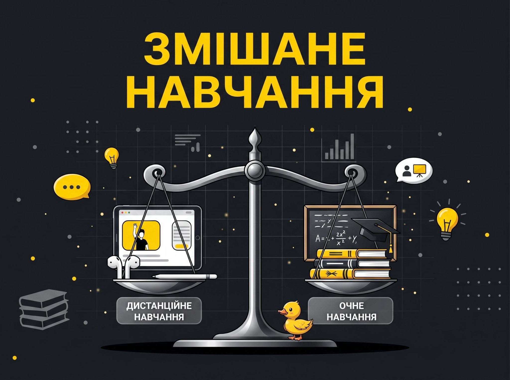
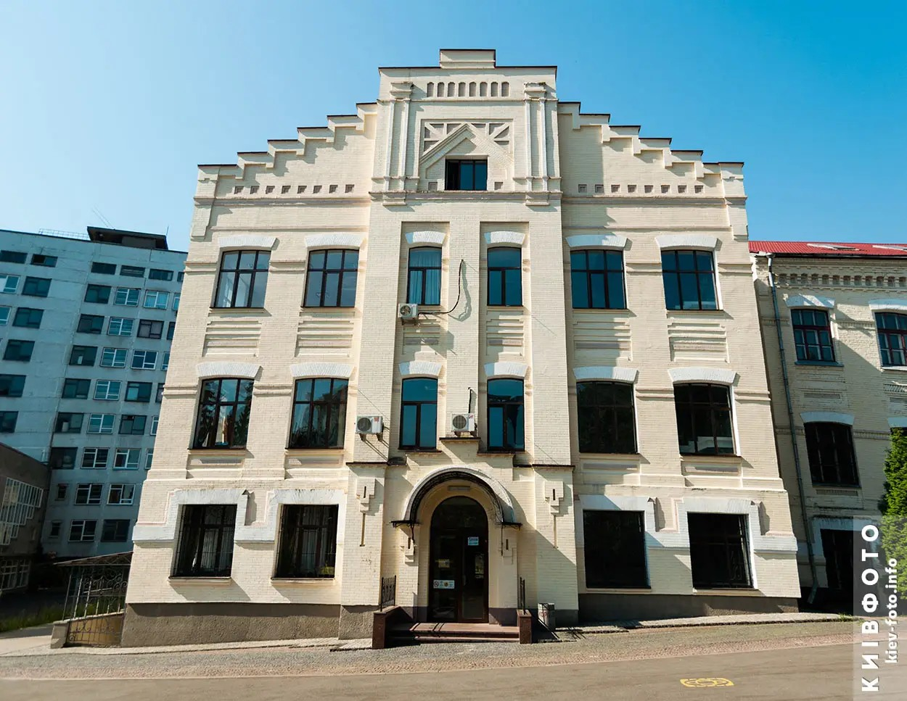
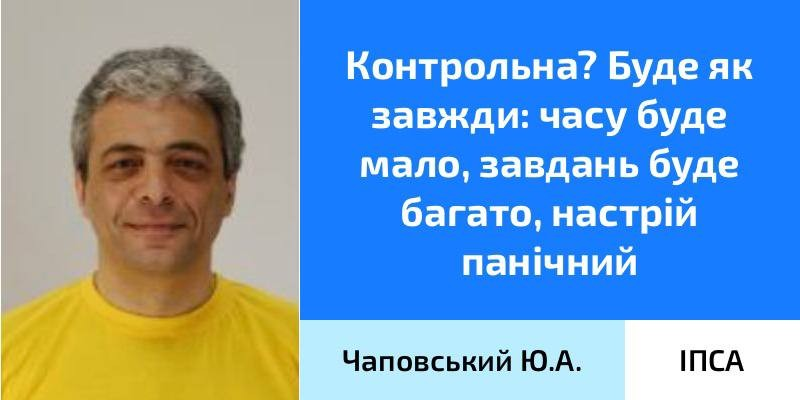
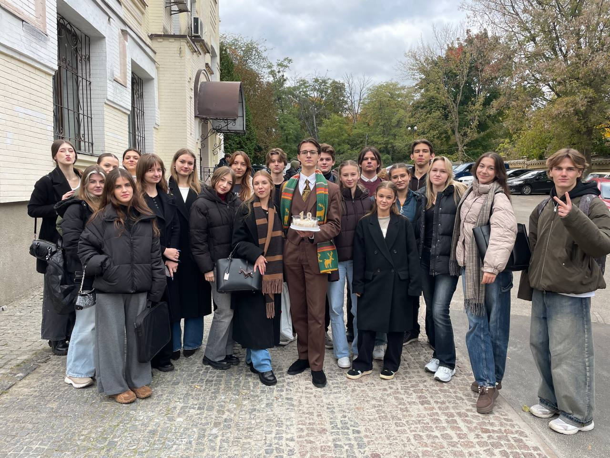
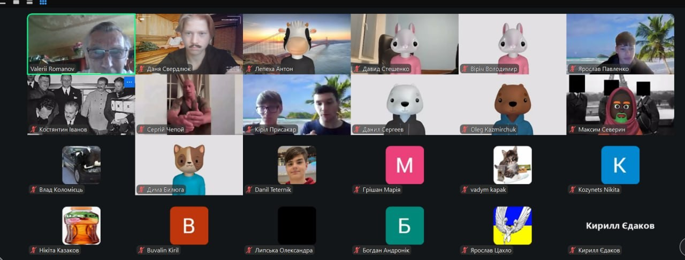
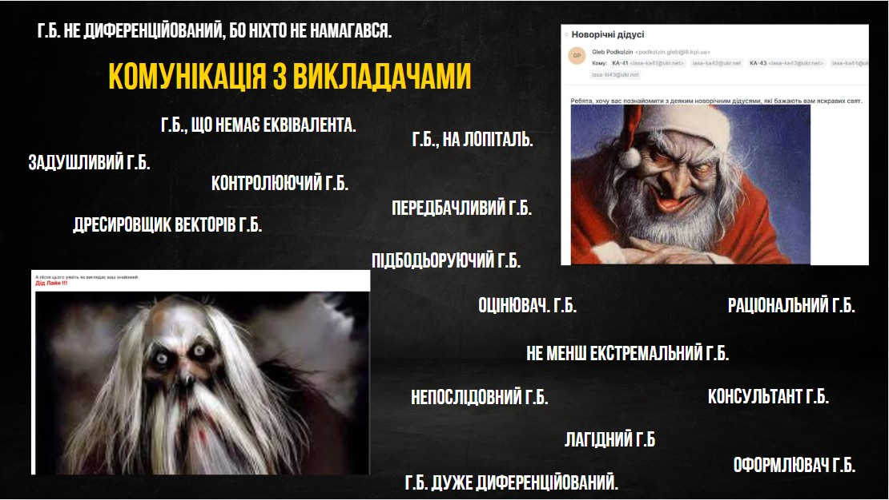
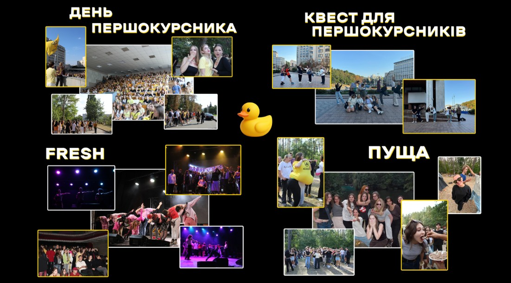

Ось ти вже заніс документи, і скоро почнеться твоя нова, довгоочікувана пригода. За декілька тижнів стартує навчання, і єдине, що відомо — воно буде проходити у **змішаному форматі**. Що чекає саме на тебе зараз пояснять першовідкривачі цього чудернацького нововведення.

<!--truncate-->

---

## Підготовка. Що варто знати?

Змішаний формат — це мікс очного і дистанційного навчання. Якісне засвоєння деяких предметів вимагає офлайн-формату. Далі — детальніше про них.

Для катедр СП та ШІ проводяться очно наступні дисципліни 1 семестру:
*   Математичний аналіз (лекції та практики).
*   Лінійна алгебра та аналітична геометрія (лекції та практики).
*   Дискретна математика (лекції та практики).
*   Основи фізики (практики та лабораторні заняття).

Для катедри ММСА:
*   Математичний аналіз (лекції та практики).
*   Лінійна алгебра та аналітична геометрія (лекції та практики).
*   Дискретна математика (лекції та практики).
*   Алгоритми і структури даних (лабораторні заняття).
*   Програмування та алгоритмічні мови (лабораторні заняття).

*Інформація щодо інших предметів та уточнення формату очного та дистанційного навчання далі буде…*

## Do you want a house tour?
Якщо дистанційне навчання буде проходити на власному комп'ютері / ноутбуці, під зручною ковдрою і з теплим чаєм, то куди ж приходити на офлайн-заняття?

Ласкаво просимо до 35 корпусу, який зовсім скоро стане тобі ріднішим за власну домівку. Тут тебе чекають і сміх, і сльози, і балачки про навчання — коротше кажучи, студентське життя. Будівля має 4 поверхи, один із яких — облаштоване для комфортного навчання укриття. Поверхи містять авдиторії як для лекційних занять, що розраховані на велику кількість людей, так і для практичних, які проводяться окремо для груп. Першокурсники здебільшого навчаються на цокольному поверсі, щоб під час повітряної тривоги не призупинявся навчальний процес. Другий курс, у свою чергу, подорожує між ними й у разі сирени спускається в підвал (якщо є вільні авдиторії, в іншому випадку пари перериваються та студенти йдуть до найближчого укриття: ст. метро Політехнічний Інститут).

Для перерв розташування корпусу пропонує «розваги» на будь-який смак: поруч знайдеш n-ну кількість кавʼярень, АТБ, Сільпо (всередині Smart Plaza Polytech), аптеки та інші заклади, необхідні кожному студенту.

## Навчальний процес

Змішане навчання передбачає наявність очних і дистанційних навчальних днів. Нумо розбиратися в їхніх особливостях.

## Очне навчання

Очний формат — це прекрасна можливість відчути вайб навчання, бо матеріал, що подається офлайн, сприймається краще. Також матимеш змогу познайомитись із викладачами, знайти сусіда по парті, з яким будеш сидіти протягом усього навчання та ловити дзен на очній 4 парі.

Викладачі прагнуть, аби студенти здобували знання, незважаючи ні на що, тож якщо ти з якихось причин не зможеш бути присутнім у корпусі — заходь онлайн: більшість пар (особливо лекцій) транслюють у Google Meet або Zoom.

А як щодо контрольних? Такі роботи також проводяться офлайн, тож радимо плідно працювати на парах.

---

## Дистанційне навчання

Під категорію дистанційних підпадають супутні та загальноосвітні дисципліни. Google Meet і Zoom — твої незамінні помічники на шляху до їхнього опанування. Викладачі надають достатньо навчальних матеріалів для вивчення та повторення: студенти особливо полюбляють передивлятися записи пар.

Модульні контрольні, лабораторні й інші роботи з дистанційних предметів проводяться, відповідно, онлайн.

Як виняток, право дистанційного відвідування може надаватися за рішенням Комісії з питань надання студентам права дистанційного відвідування занять (індивідуального формату навчання) інституту особам, що перебувають за кордоном, за умови підтвердження місця знаходження; особам з тимчасово окупованих територій та особам, стан здоров'я яких не дає змогу особисто відвідувати заняття, за умови підтвердження відповідними документами. Такі студенти погоджують індивідуальний навчальний план з викладачами.

## Статистика

Тепер, коли ти знаєш, що таке змішаний формат, ознайомся з показниками за минулі роки:
*   У період 2022-2023 років всі студенти навчалися онлайн.
*   2024 року — перший раз з початку повномасштабного вторгнення було прийнято рішення вивести на змішане навчання 1 курс.
*   Станом на 2025-2026 навчальний рік на змішаному форматі навчалися 1-2 курси.
*   На 2026-2027 навчальний рік очікується виведення всіх категорій здобувачів на змішане навчання. Пари з чисельністю здобувачів більше 50 (переважно лекції) проводитимуться дистанційно. Чи буде реалізовано таку ідею поки не зрозуміло, через невдоволення багатьох студентів, ще проводяться опитування та уточнення.

Виведуть всіх студентів на змішаний формат або ні — залежить від кількості місць в укриттях, у чому є певна проблема по всьому КПІ. Тож поки орієнтуємося на показники, які були в 25-му році.

## Взаємодія з колективом та викладачами

Університет — це не тільки про навчання, а й про соціалізацію. Взаємодія з іншими студентами необхідна, а часом непогано допомагає. Під час змішаного навчання з'явилася можливість живого спілкування з одногрупниками та студентами інших груп і катедр.

Кожна група має власний чат, де студенти можуть обговорювати важливі питання й ділитися інформацією. Крім того, існують чати всієї кафедри та потоку, що дозволяють спілкуватися з ширшим колом людей. Також можна отримувати потрібну інформацію від старших курсів (особливо від студкураторів — других батьків, провідників у ІПСАшне життя).

А як проходить комунікація із викладачами? Вони, звісно, чарівники, але не сидять в одиночній замурованій вежі (ознайомитися зі складом Гоґвартсу можна [тут](https://iasastudentcouncil.github.io/iasa-sc-blog/blog/subjects)). Більшість із них відкриті до спілкування, листуються в телеграмі, а не голубиною поштою. Пропонують консультації (переважно онлайн, але можливий і очний формат), якщо бачать, що певні теми не є зрозумілими. До кожного з них можна підійти до чи після пар, поставити питання щодо матеріалу чи домашнього завдання.

Основний контакт йде через старосту — деякі викладачі наполягають на виключній комунікації із ним/нею. Староста вирішує загальні питання, які стосуються всієї групи, а також може допомогти своїм одногрупникам із особистими справами: зв’язатися з куратором для вирішення проблеми.

---

## Позанавчальна діяльність

І ось ти навчаєшся. Невже це все, що ти отримаєш від КПІ? Звісно, ні. Навчання в КПІ не обмежується домашками, лабами та контрольними. Студентські об'єднання, спорт та багато іншого чекають на тебе, а завдяки змішаному навчанню точно знайдеш на це час.

Щоб тримати себе у формі, обов’язково відвідай [Спорткомплекс](https://sport.kpi.ua/). Тут працюють секції з волейболу, баскетболу, футболу, спортивної аеробіки, настільного тенісу, атлетизму, армрестлінгу, боксу та кікбоксингу, рукопашного бою (дзюдо, самбо), великого тенісу, скелелазіння та футзалу. Для студентів КПІ заняття безкоштовні — головне приходити та займатися.

Любиш гуманітарні науки чи навпаки хочеш ще більше прокачати технічні навички? У КПІ точно знайдеться те, що тобі треба.

Усі гуртки поділяються на 3 напрями:
1.  Наукові.
2.  Інженерні.
3.  Соціогуманітарні.

Якщо хочеш випробувати свої знання — бери участь в олімпіадах. Там ти точно зустрінеш однодумців, а за перемогу іноді можна отримати призи чи певні плюшки.
Детальніше про олімпіади та гуртки можна дізнатися за [посиланням](https://kpi.ua/vors).

Також є багато різних студентських об'єднань, які влаштовують літературні вечори, кінопокази, спікінг-клаби, майстер-класи та інше. Мистецькі об'єднання збираються у [Вежі](https://t.me/vezhakpi). Якщо хочеш бути в курсі всіх подій в КПІ, то заходь [сюди](https://t.me/kpi_events).

В ІПСА ми маємо власний освітній [проєкт](https://t.me/IASA_Student_Council) для початківців в IT.

Ну і місце, де ти точно зможеш знайти своїх однодумців, — Студрада ІПСА. У ній ти можеш займатися чим завгодно: від редагування статей до організації івентів різного спрямування. Але відбір буде непростим, тож дізнайся [тут](https://iasastudentcouncil.github.io/iasa-sc-blog/blog/winx-council-26/), чим займається кожен з відділів.

## Івенти

Пари парами, а відпочинок — це святе. Абстрагуватися від домашок, забути про дедлайни та сповна відчути весь вайб студентського життя допоможуть івенти від Студради ІПСА. Віддатись ритму музики, поринути в змагання чи зробити добру справу — вибір справді вражає.

У перші місяці навчання івенти присвячені першачкам, а саме: День першокурсника, Квест по Києву, Пуща та Fresh. Вони безкоштовні. Перша зустріч, пізнання столиці, вайбовий відпочинок та незабутні емоції — не розпочати студентське життя яскраво немає шансів, а студкуратори супроводжуватимуть і підтримуватимуть своїх підопічних на шляху знайомства.

На цьому цікавинки не закінчуються. ІПСАшні івенти чекають на першокурсників далі. Їхня тематика різна, кожен формат винятковий, але об'єднує одне — класно проведений час.

**P.S.** Детальніше про кожен івент можеш дізнатися у [статті](https://iasastudentcouncil.github.io/iasa-sc-blog/blog/Event).

## Гуртожиток

Якщо ти з іншого міста, то постає питання: «Як же підкорити незвідану столицю?»

Цей шлях починається в гуртожитку. Школа життя, вайб сусідства та море спогадів чекають на тебе, до того ж, рейтингова система поселення відкриває нові можливості. Згідно з нею, охочі поселитися обирають три гуртожитки, в яких найбільше хотіли б проживати, і розташовують їх за пріоритетністю: від першого (найбажанішого) до третього (найнижчого).

Відтак, студенти впорядковуються за такими критеріями:
1.  Наявність однієї з пільгових категорій.
2.  Навчання змішано / очно в семестрі, на який поселяються.
3.  Конкурсний бал.
4.  Пріоритет гуртожитку.

Система перевіряє заявки студента послідовно за першим, другим та третім пріоритетами, і якщо він не пройшов за жодним із них, то його намагаються поселити в гуртожиток щільного заселення. Це той, у якому проживає найбільше студентів конкретного факультету / інституту. Якщо такий гуртожиток вказаний одним із пріоритетів, то конкурсний бал на цій заявці множиться на 1.25, в іншому разі цей коефіцієнт не застосовується. Якщо ж студент не пройшов і туди, то він бере участь у розподілі на загальні вільні місця в будь-якому гуртожитку.

Варто зазначити, що кількість місць у кожному гуртожитку фіксована й розраховується з урахуванням місткості укриттів!

Відтак, обирати свій другий дім на найближчі роки треба уважно. На це рішення впливає багато факторів, і один з головних критеріїв — тип планування. Їх є два. Перший, блочний, характерний поділом, як не дивно, на блоки: по декілька кімнат (зазвичай 2), де є свій душ і вбиральня, а кухні спільні на поверх. А до другого (коридорного) типу належить гуртожиток №7 — щільного заселення ІПСА. Він має 5 поверхів, на кожному з яких по 2 кухні, 2 кімнати з умивальниками та 2 вбиральні. Також є душова, пральня, робоча кімната і спортзал, в якому облаштовано укриття.

Гуртожитки КПІ знаходяться за 10-15 хвилин пішки від нашого корпусу, тож про дорогу на пари можна не перейматися. А ще більше деталей про поселення та гуртожиток ми зібрали у [статті](https://iasastudentcouncil.github.io/iasa-sc-blog/blog/Dormitory).