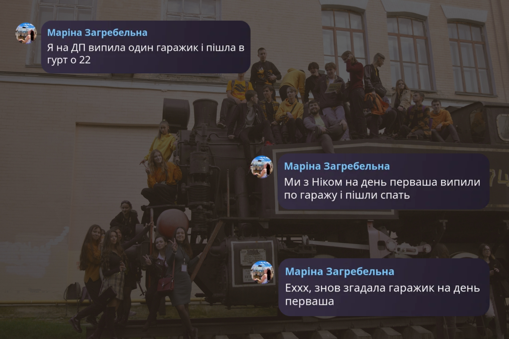
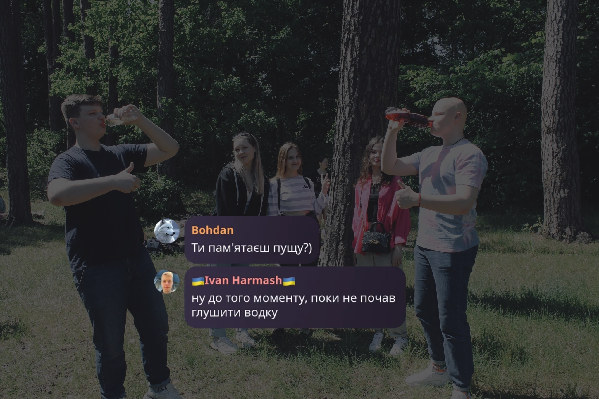
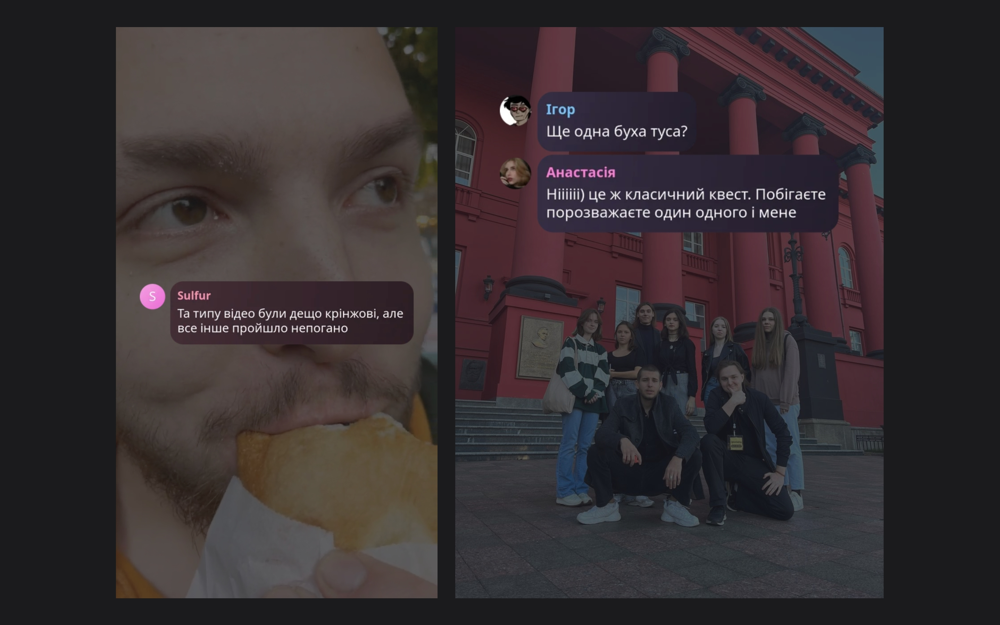
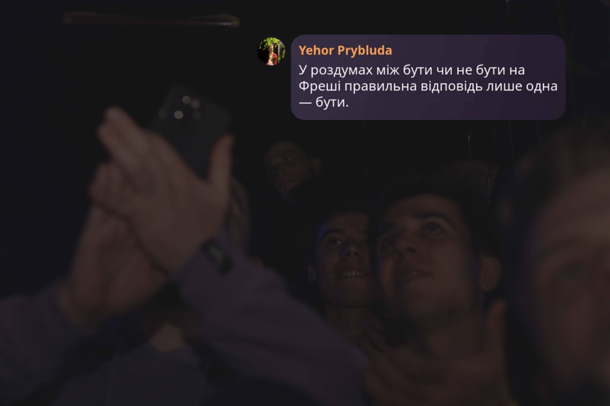

_«I’m not telling you it’s going to be easy. I’m telling you it’s going to be worth it»._

_Art Williams_

<!--truncate-->

## Зміст

- [Календар](#календар)

- [Розклад](#розклад).

- [Карта КПІ](#карта-кпі).

- [Твої викладачі](#твої-викладачі).

- [Додаткові матеріали для майбутніх предметів](#додаткові-матеріали-для-майбутніх-предметів).

- [Івенти енд кул сторіс](#івенти-енд-кул-сторіс).

- [Тобі з ними вчитися](#тобі-з-ними-вчитися).

- [Студкуратори](#студкуратори).

- [Староста: герой нашого часу](#старост:-герой-нашого-часу).

- [Корисні посилання](#корисні-посилання).

## Календар

## Розклад

Щоб не заблукати серед авдиторій, предметів та викладачів, розклад пар для катедр ММСА та ШІ можеш підгледіти [тут](https://t.me/IASA_Student_Council/2364), для СП — [тут](https://schedule.kpi.ua/?groupId=00000d6b-0000-0000-0000-000000000000).

## Карта КПІ

Щоб в погоні за знаннями не ~~втратити себе~~ загубитися, користуйся незамінним путівником:

## Твої викладачі

#### Подколзін Гліб Борисович (у простонародді «ГБ»)

_«Останній відпочинок був у вас у школі, а ось наступний буде вже в могилі.»_

#### Мінарченко Олександр Миколайович (між студентами «Мінарь»)

_«Поздоровляю зі святом 1-го травня і в якості дарунка надсилаю наступну частину розрахункової.»_

#### Бохонов Юрій Євгенович (у деяких колах «Бохіч»)

_«Існує радіанна міра кутів! Що ви все в градусах міряєте, це вам що, горілка, чи що?»_

_«Точно це винести? Я зараз почну меблі виносити.»_

_«Я зараз зʼїм цю вебкамеру, і ніхто нічого не побачить.»_

#### Стусь Олександр Вікторович

_«Перевага дистанційного навчання — вам хоч можна мікрофони вимкнути.»_

#### Спекторський Ігор Якович (a.k.a. «Спектр»)

_«Подивіться на себе в дзеркало: чи є сором в очах? Якщо немає, то тренуйтеся.»_

_«Час від часу ми будемо змінювати орієнтацію, але, сподіваюся, це нічого страшного для вас.»_

#### Безносик Олександр Вікторович

_«Ну добре… Хоч і не зовсім добре…»_

_«Світло закінчилося.»_

_«Який у вас цікавий метод. Щось я нічого не розумію.»_

#### Просянкіна-Жарова Тетяна Іванівна

_«А вам курсову кавалєри роблять?»_

#### Назарчук Ірина Василівна

_«РєБяТа!»_

_«Рєбята, …»_

#### Селін Юрій Миколайович

_«Бі, ей, ел, ел – Ball. Англійською мовою знаєте, так? Пишеться Liverpool, читається Manchester. Пишемо «А», читаємо «О»… Ну то ще не найгірший варіант: пишемо «что», читаємо «шо». *хє-хє-хє*.»_

#### Калита Віктор Михайлович

_«Забудьте про своє програмування, через 5 років уже будуть квантові комп’ютери й усім треба буде фізика, а не програмування!»_

_«Не дай Бог F, то буде ТЕФ.»_

#### Чаповський Юрій Аркадійович

_«Бачимо систему – вирішуємо, бачимо пляшку пива – випиваємо. Ну ось так, автоматом – інстинкт.»_

#### Мальцев Антон Юрійович

_«Ви розоряєте моє інтелектуальне казино.»_

#### Сисак Катерина Ярославівна

_«Якщо хочете спати, то йдіть поспіть або купіть собі нонстопчика випийте.»_

Більше про предмети та викладачів за [посиланням](https://iasastudentcouncil.github.io/iasa-sc-blog/blog/Disciplines).

## Додаткові матеріали для майбутніх предметів

### Математичний аналіз

- [Essence of calculus](https://www.youtube.com/playlist?list=PLZHQObOWTQDMsr9K-rj53DwVRMYO3t5Yr).

- [Олексій Василенко](https://www.youtube.com/@Alwebra).

### Алгебра та геометрія

- [Essence of linear algebra](https://www.youtube.com/playlist?list=PLZHQObOWTQDPD3MizzM2xVFitgF8hE_ab).

- [MIT 18.06 Linear Algebra, Spring 2005](https://www.youtube.com/playlist?list=PLE7DDD91010BC51F8).

### Алгоритмізація та програмування

- [C Programming Language Tutorial](https://www.geeksforgeeks.org/c-programming-language/?ref=shm_outind).

* [W3 Schools](https://www.w3schools.com/).

* [C++ Programming Language](https://www.geeksforgeeks.org/c-plus-plus/?ref=shm_outind).

- [Уроки та статті С++](https://ravesli.com/uroki-cpp/).

- [4-годинна лекція про вказівники в С та С++](https://www.youtube.com/watch?v=zuegQmMdy8M).

- [C++ Primer Plus (Stephen Prata)](https://drive.google.com/file/d/1kx9Ic53-9g3cRmE2pa1lSDxL8ngX2ojm/view?usp=sharing).

### Алгоритми та структури даних

- [Grokking algorithms](https://edu.anarcho-copy.org/Algorithm/grokking-algorithms-illustrated-programmers-curious.pdf).

- [Introduction to algorithms (Cormen, Leiserson, Rivest, Stone)](<https://sd.blackball.lv/library/Introduction_to_Algorithms_Third_Edition_(2009).pdf>).

### Також варте уваги

- [Brilliant](https://brilliant.org/courses/).

- [Записи лекцій ІПСА](https://www.youtube.com/@IASALectures).

- [Algebra, Topology, Differential Calculus, and Optimization Theory For Computer Science and Machine Learning](https://www.cis.upenn.edu/~jean/math-deep.pdf).

## Івенти енд кул сторіс

### [День першачка](https://www.facebook.com/media/set/?vanity=studrada.iasa&set=a.685053900335286)

### [Пуща](https://www.facebook.com/media/set?vanity=studrada.iasa&set=a.694210252752984)

### [Квест](https://www.youtube.com/watch?v=f6NCVLzZjEY&t=780s)

### [Фреш](https://www.facebook.com/media/set/?vanity=studrada.iasa&set=a.699111388929537)

Ще більше івентів і докладніше про них за [посиланням](https://iasastudentcouncil.github.io/iasa-sc-blog/blog/Event/).

## Тобі з ними вчитися…

## Студкуратори

### КА-51

- *Анна Пузік КА-42*

— Як пережити сесію без втрати розуму?

> «А) Обдурити систему й втратити його до сесії.
>  Б) Почати святкувати Новий рік чи День Незалежності трошки раніше.
>  В) Стати їжаком, бо ну, це і їжаку зрозуміло».

- *Аліса Сліпко КА-32*

— Як не зганьбитися й завжди отримувати 100 балів з матана?

> «Сідайте зручніше, слухайте уважно й записуйте:
>  1. За день до екзамена / кр не миємо голову.
>  2. Опівночі перед іспитом кричимо у вікно «Шара, прийди!!!»
>  3. Перед сном кладемо конспекти під подушку.
>  4. На Поляні тремо Шару і, спиною до неї, тричі викрикуємо «Шара, прийди!»

### КА-52

- *Ангеліна Пророк КА-32*

— Що робити, якщо твій викладач вболіває за Динамо, а ти фанатка Шахтаря?

> «Головне — до іспиту краще не розповідати про свої вподобання, інакше бал може   бути мінімумом… як очки Динамо в Лізі Європи. Якщо в підсумку отримано не дуже   гарний результат, то можна натякнути, хто краще, але без пафосу».

- *Поліна Ліченко КА-43*

— Як знайти об'єкт для успішного вкладення фінансів?

> «Купити групою жигуль та зробити з нього ІПСАмобіль, так щоб навіть ГБ *(прим. ред. Гліб Борисович Подколзін, викладач)* ходив і радів щасливим студентам».

### КА-53

- *Соломія Осаульчук КА-45*

— Як почати розмову з одногрупниками?

> «Впевнено підходиш питаєш: яке пиво п'єш, хто по масті та які дзиґари любиш? А далі вже піде само собою)».

- *Костянтин Казанін КА-31*

— Як порозумітися з іншими курсами?

> «Рібята, нетворкінг — це ваша база та фундамент, підтримуйте гарні відносини з якомога більшою кількістю людей, більше друзів, більше рефералів. Будьте собою, жартуйте, розповідайте історії, пригостіть пивом, робіть, що хочете — головне не говоріть про НМТ... У кінці кінців, спілкування — як рулетка, ти ставиш на червоне, друг на чорне, а падає зеро».

### КА-54

- *Анна Кручок КА-31*

— Як вибрати найкраще місце для тимбілдингу?

> «50.6182435, 26.2485772».

- *Марія Худікова КА-44*

— Де відпочити між парами?

> «Сходити в АТБ, Аврору або іншу кав'ярню біля корпусу (у нас їх багато), взяти собі хот-дог або інший смаколик і сісти на курилку».

### КА-55

- *Артем Бернацький КА-35*

— Що робити, якщо ти заснув під час захисту лабораторної?

> «Та я просто запустив функцію sleep(), тепер залишилося викликати wake_up() і спробувати ще раз».

- *Максим Сєрак КА-45*

—  Як палати як зірочка на івентах?

> «Та шо казати — тут треба сіяти!
>  Головне — палайте й бережіть колінки».

### КІ-51

- *Софія Поначовна КІ-41*

— На що витратити першу степуху?

> «3,3 л приємного вечора з друзями або заплатити за втрачений мангал на Пущі».

- *Віктор Богатиренко КІ-21*

— Як захистити первашку від чотирикурсника?

> «Навчити її фразі «Твій дипломний керівник цікавиться, як там справи з дипломом? Чому не надіслали результати?і» і в радіусі 50 м ви не побачите жодного чотирикурсника».

### КІ-52

- *Лідія Кучма КІ-43*

— Огого чи вьорд?

> «Вьорд скорше. Це прям моє».

- *Микола Білан КІ-42*

— Як не спитися на першому курсі в ІПСА?

> «Не знаю. Як дізнаюся — обов'язково розкажу)».

### КІ-53

- *Віктор Восковнюк КІ-33*

— Що допомагає з навчанням більше: таро чи Біблія?

> «Рівноцінно. Таро допомагає знайти відповідь на білет, Біблія дає віру, що відповідь правильна».

- *Ірина Полторацька КІ-43*

— Яке одне запитання вибрати для психолога після сесії в ІПСА?

> «Навіщо мені психолог, якщо після останнього семестру я вже сама можу робити з матрицями долі обернене, транспоноване й навіть розклад на майбутнє?»

### КН-51

- *Давід Міхно КН-43*

— Як бути скромним на парах знаючи, що ти з Донбасу?

> «Так і бути, можна не відповідати на кожне запитання викладача «я донецький»: всі і так по одному погляду бачать авторитетну людину з не менш авторитетного Донбасу».

- *Ангеліна Павлусенко КН-42*

—  Як стати куратором за 4 години, секрет успіху?

> «Спочатку треба взяти банку заспокійливого нефільтрованого, потім знайти відповіді на мільйон запитань і головне сказати, щоб називали «матерою», бо так заведено».

### КН-52

- *Олександр Керпань КН-32*

— Які негласні правила виживання в ІПСА?

> «Перше правило: «не ми, а нас».
> Друге правило: «три допки — не межа».
> Четверте правило: «головне знайти людину, з якою пройдеш усі допки».
> Ну і третє: «швидкість написання лаби залежить від кількості рідини в стакані».

- *Валерія Фролова КН-43*

— Як вибрати собі роль у сценці на IASA Fresh?

> «Ваша роль повинна пасувати вашій натурі, але це зовсім не означає, що вам обов'язково треба ловити білку…»

### КН-53

- *Олександр Четвертак КН-32*

— Що робити, якщо тобі дали місяць на лабораторну, а дедлайн вчора?

> «1. Виспатися.
>  2. Покушати.
>  3. Зателефонувати одногрупнику, який теж не здав.
>  4. Перенести на завтра.
>  5. Повторити».

- *Дар'я Брильова КН-43*

— Як зробити так, щоб 3 групу КН не розформували?

> «Не ходіть на поляну, слухайте маму».

## Староста: герой нашого часу

Хто такий староста? Це не просто людина, яку випадково вибрали на першій парі (бо всі інші відвернулися в той момент). Це головний посередник між групою й вищими силами (тобто викладачами й деканатом).

### Що робить староста на дистанційному навчанні?

- **Розмовляє з викладачами та деканатом** — простими словами, ходить на «переговори», як справжній дипломат.

- **Організаційна робота.** Збір довідок, документів, паролів і навіть іноді душ одногрупників.

- **Кидає посилання на пари.** Так, інколи ці посилання падають тільки на пошту старости, і він/вона стає «рятівником» усієї групи.

- **Перевіряє розклад.** Якщо хтось хоче пересунути пару чи викладач забув, що сьогодні п’ятниця, староста — це та людина, яка намагається з цим щось зробити.

- **Проблеми одногрупників?** «У мене не працює Moodle!», «Я не можу зайти в Zoom!», «Я забув пароль до електронки!» летять старості в директ.

### А що ж на очному навчанні?

Усе те, що й староста на дистанційному + бонусний пакет «виживання в офлайні»:

- **Тут староста стає справжнім менеджером із виживання групи**: Веде журнал і на хвилинку відчуває себе вчителем.

- **Шукає викладача**, який «десь заблукав», бо «він точно був у цьому корпусі, просто на іншому поверсі».

- **Заспокоює одногрупників**, коли викладач вирішив робити контрольну без попередження.

- **Розважає групу** в моменти, коли лекція затягується, а всі вже думають про їдальню.

### Які плюшки?

- Тебе знатимуть викладачі. Іноді навіть люблять настільки, що підкинуть пару додаткових балів.

- Додаткові 4-7 балів до рейтингу (це може вирішити долю твоєї стипендії чи просто врятувати від перескладання). Враховуй, що потім вони домножаться на 0.05.

- Можеш навести свою «структуру порядку» в групі. Або створити «структуру хаосу» — як піде.

- Старости завжди «на слуху», тож соціалізація гарантована.

- Це прикольно звучить на співбесідах: «Я мав досвід управління командою в 30 людей».

### Які мінуси?

- Час зникає, як стипендія після першого походу в магазин.

- Велика відповідальність, бо «винен завжди староста».

- Не догодиш усім, завжди знайдеться той, кому «не так».

- Директ вибухає повідомленнями навіть о 2 ночі.

- Ти маєш знати прізвища всіх, навіть тих, хто з'являється раз на пів року.

## Мудрість наостанок

«Лідерство схоже на красу: складно дати йому точне визначення, але розумієш, що воно таке, коли побачиш», — *казав Уоррен Бенніс.*
**А ми додамо:** староста — це людина, яка хотіла просто вчитися, а отримала роль техпідтримки, психолога, бухгалтера й дипломата в одній особі.

## Корисні посилання

### Канали ІПСА:

- [IASA Student Council](https://t.me/IASA_Student_Council). Важливі оголошення про навчальний процес, усі версії розкладу й вакансії компаній.

- [IASAevent](https://t.me/iasa_event). Анонси та деталі найближчих розважальних заходів.

- [IASAedu](https://t.me/iasa_edu). Канал із цікавими матеріалами для саморозвитку.

- [IASA Analytics](https://t.me/iasa_analytics). Результати студентських опитувань щодо якості викладання.

- [Деканат ІПСА](https://t.me/dekanat_ipsa). Новини від адміністрації.

*Щоб додати всі згадані вище канали в один клік, переходь за [посиланням](https://t.me/addlist/TOiC3mgaeNY0ZjQy) або скануй QR-код.*

- [Instagram Студради ІПСА](https://instagram.com/studrada_iasa). Інститутське життя у фото та відео.

- ІПСАшний мерч: [Instagram](https://www.instagram.com/analyst.shop/), [Telegram](https://t.me/analyst_shop). Ресурси для придбання товарів із символікою нашого факультету на різний смак.

### Боти та чати ІПСА:

- [@IASAsuggestionBot](https://t.me/IASAsuggestionBot). Скарги / пропозиції для СР, можна подати на рекламу вакансії, якщо ви роботодавець.

- [@iasa_stud_support_bot](https://t.me/iasa_stud_support_bot). Сповістити про неналежну поведінку викладача, невиконання обов'язків і порушення прав студентів.

- [@ipsa_kpibot](https://t.me/ipsa_kpibot). Спілкування з деканатом.

- [IASA SBS](https://t.me/sbs_iasa). Місце, де підкажуть розв'язання складних задач і допоможуть розібратися в темі.

- [IASAchat](https://t.me/+dG_yV0FxCEE0MDY6). Чат для спілкування ІПСАшників різних видів і мастей.

### Ресурси КПІ:

- [Студентство КПІ](https://t.me/sr_kpi). Дописи про актуальне від загальноуніверситетської Студради.

- Студмістечко КПІ: канали [адміністрації](https://t.me/studmisto) та [активу Студради](https://t.me/kpicampus). Головне джерело інформації для мешканців гуртожитків.

- [КПІ](https://t.me/presinfokpi). Офіційний телеграм-канал інституту.

- [ДНВР](https://t.me/dnvr_31). Важливі оновлення про навчання, поселення та працевлаштування.

- [Стипендія КПІ](https://t.me/kpischolarship). Інформація про стипендію.

- [Розклад КПІ](https://schedule.kpi.ua).

Більше корисних ресурсів і посилань в [IASA Starter Pack](https://iasastudentcouncil.github.io/iasa-sc-blog/blog/iasa-starter-pack).
