import MobileTOC from "../../../src/components/MobileTOC/MobileTOC.jsx";

<MobileTOC sections={[  
    {heading: "Розклад", subHeadings: []},
    {heading: "Твої викладачі", subHeadings: []},
    {heading: "Додаткові матеріали для майбутніх предметів", subHeadings: [
      "Математичний аналіз:",
      "Алгебра та геометрія:",
      "Алгоритмізація та програмування:",
      "Алгоритми та структури даних:",
      "Також варте уваги:" 
    ]},
    {heading: "Івенти енд кул сторіс", subHeadings: [
      "День першачка",
      "Квест",
      "Пуща",
      "Фреш"
    ]},
    {heading: "Тобі з ними вчитися...", subHeadings: []},
    {heading: "Студкуратори", subHeadings: [
      "КІ-31",
      "КІ-32",
      "КІ-33",
      "КН-31",
      "КН-32",
      "КН-33",
      "КА-31",
      "КА-32",
      "КА-33",
      "КА-34",
      "КА-35"
    ]},
    {heading: "Корисні посилання", subHeadings: [
      "Канали ІПСА",
      "Боти та чати ІПСА",
      "Ресурси КПІ"
    ]}
]}/>

_«I’m not telling you it’s going to be easy. I’m telling you it’s going to be worth it»._

_Art Williams_

<!--truncate-->

## Розклад

Спеціально для фанатів естетики та ненависників екселівських таблиць — елегантний розклад першачків.

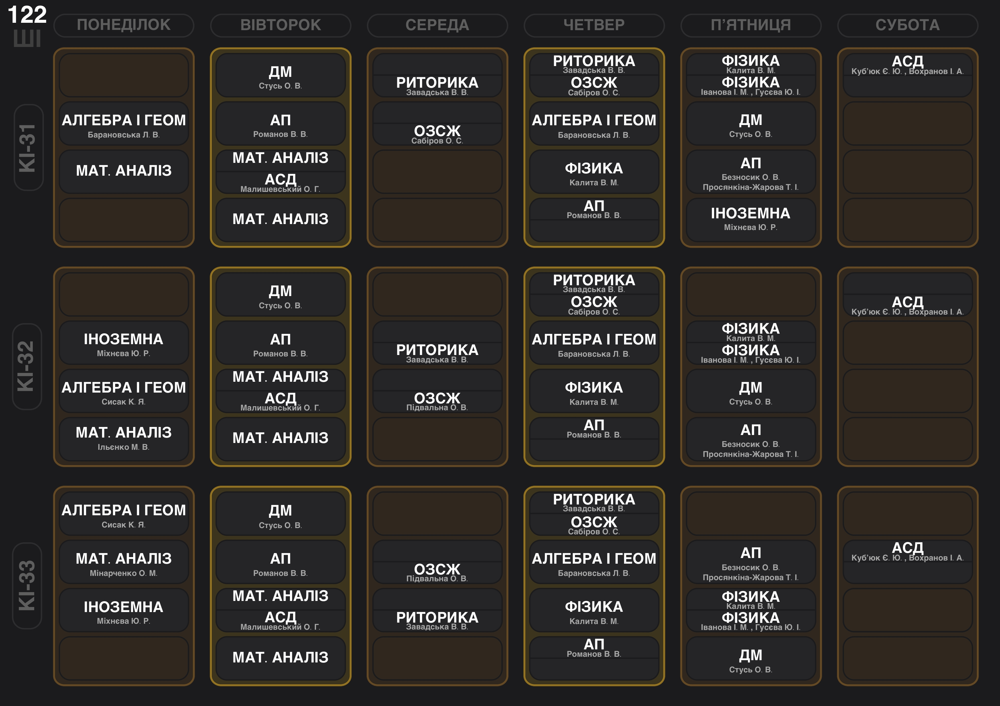

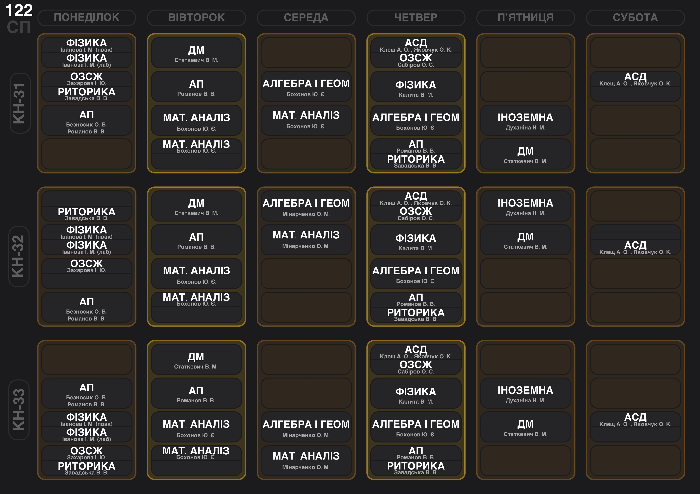

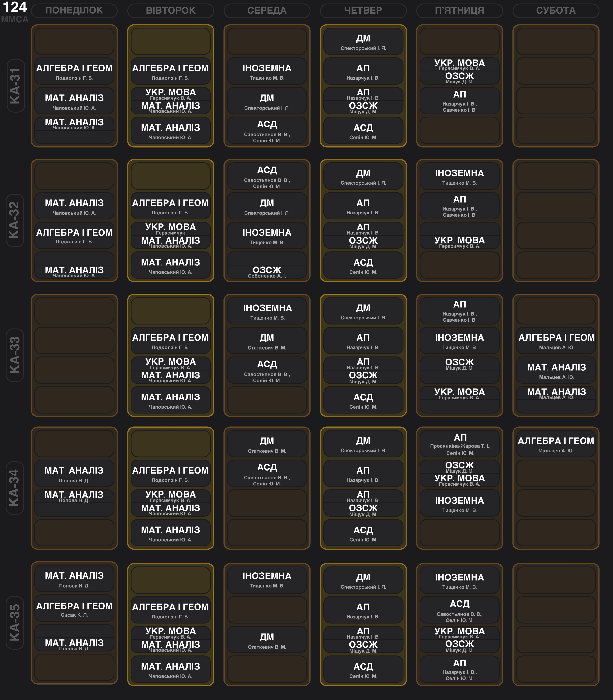

## Твої викладачі

#### Подколзін Гліб Борисович (у простонародді «ГБ»)

_«Останній відпочинок був у вас у школі, а ось наступний буде вже в могилі.»_

#### Мінарченко Олександр Миколайович (між студентами «Мінарь»)

_«Поздоровляю зі святом 1-го травня і в якості дарунка надсилаю наступну частину розрахункової.»_

#### Бохонов Юрій Євгенович (у деяких колах «Бохіч»)

_«Існує радіанна міра кутів! Що ви все в градусах міряєте, це вам що, горілка, чи що?»_

_«Точно це винести? Я зараз почну меблі виносити.»_

_«Я зараз зʼїм цю вебкамеру, і ніхто нічого не побачить.»_

#### Стусь Олександр Вікторович

_«Перевага дистанційного навчання — вам хоч можна мікрофони вимкнути.»_

#### Спекторський Ігор Якович (a.k.a. «Спектр»)

_«Подивіться на себе в дзеркало: чи є сором в очах? Якщо немає, то тренуйтеся.»_

_«Час від часу ми будемо змінювати орієнтацію, але, сподіваюся, це нічого страшного для вас.»_

#### Безносик Олександр Вікторович

_«Ну добре… Хоч і не зовсім добре…»_

_«Світло закінчилося.»_

_«Який у вас цікавий метод. Щось я нічого не розумію.»_

#### Просянкіна-Жарова Тетяна Іванівна

_«А вам курсову кавалєри роблять?»_

#### Назарчук Ірина Василівна

_«РєБяТа!»_

_«Рєбята, …»_

#### Селін Юрій Миколайович

_«Бі, ей, ел, ел – Ball. Англійською мовою знаєте, так?_

_ Пишеться Liverpool, читається Manchester. Пишемо «А», читаємо «О»… Ну то ще не найгірший варіант: пишемо «что», читаємо «шо». *хє-хє-хє*» _

#### Кривенко Сергій Миколайович («Залізна людина»)

_«Або українською, або Java.»_

_«А давайте зробимо пару закладок.»_

#### Калита Віктор Михайлович

_«Забудьте про своє програмування, через 5 років уже будуть квантові комп’ютери й усім треба буде фізика, а не програмування!»_

_«Не дай Бог F, то буде ТЕФ»_

#### Чаповський Юрій Аркадійович

_«Бачимо систему – вирішуємо, бачимо пляшку пива – випиваємо. Ну ось так, автоматом – інстинкт.»_

Більше про предмети та викладачів за [посиланням](https://iasastudentcouncil.github.io/iasa-sc-blog/blog/Disciplines).

## Додаткові матеріали для майбутніх предметів

### Математичний аналіз:

- [Essence of calculus](https://www.youtube.com/playlist?list=PLZHQObOWTQDMsr9K-rj53DwVRMYO3t5Yr).

- [Олексій Василенко](https://www.youtube.com/@Alwebra).

### Алгебра та геометрія:

- [Essence of linear algebra](https://www.youtube.com/playlist?list=PLZHQObOWTQDPD3MizzM2xVFitgF8hE_ab).

- [MIT 18.06 Linear Algebra, Spring 2005](https://www.youtube.com/playlist?list=PLE7DDD91010BC51F8).

### Алгоритмізація та програмування:

- [C Programming Language Tutorial](https://www.geeksforgeeks.org/c-programming-language/?ref=shm_outind).

* [W3 Schools](https://www.w3schools.com/).

* [C++ Programming Language](https://www.geeksforgeeks.org/c-plus-plus/?ref=shm_outind).

- [Уроки та статті С++](https://ravesli.com/uroki-cpp/).

- [4-годинна лекція про вказівники в С та С++](https://www.youtube.com/watch?v=zuegQmMdy8M).

- [C++ Primer Plus (Stephen Prata)](https://drive.google.com/file/d/1kx9Ic53-9g3cRmE2pa1lSDxL8ngX2ojm/view?usp=sharing).

### Алгоритми та структури даних:

- [Grokking algorithms](https://edu.anarcho-copy.org/Algorithm/grokking-algorithms-illustrated-programmers-curious.pdf).

- [Introduction to algorithms (Cormen, Leiserson, Rivest, Stone)](<https://sd.blackball.lv/library/Introduction_to_Algorithms_Third_Edition_(2009).pdf>).

### Також варте уваги:

- [Brilliant](https://brilliant.org/courses/).

* [Записи лекцій ІПСА](https://www.youtube.com/@IASALectures).

## Івенти енд кул сторіс:

### [День першачка](https://www.facebook.com/media/set/?set=a.486647053509306&type=3)

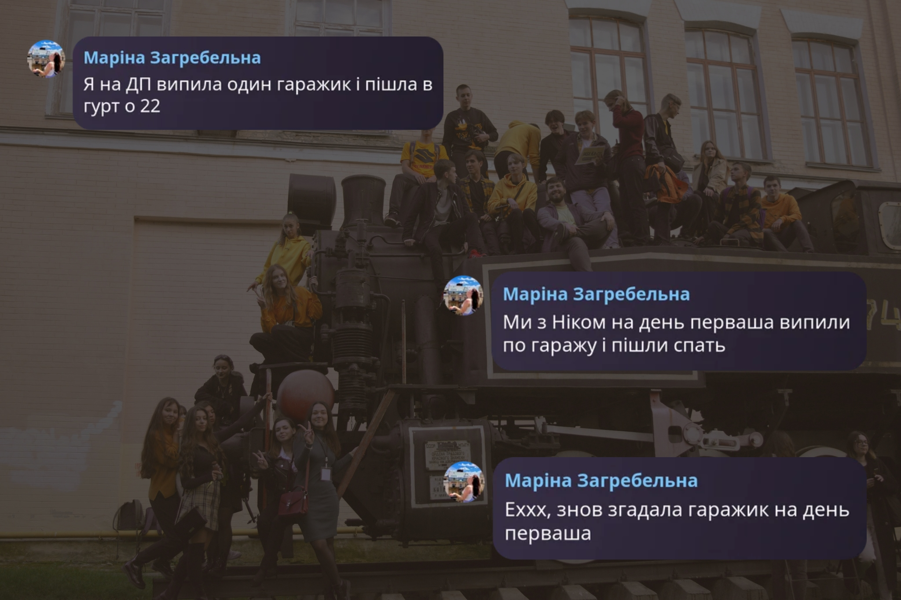

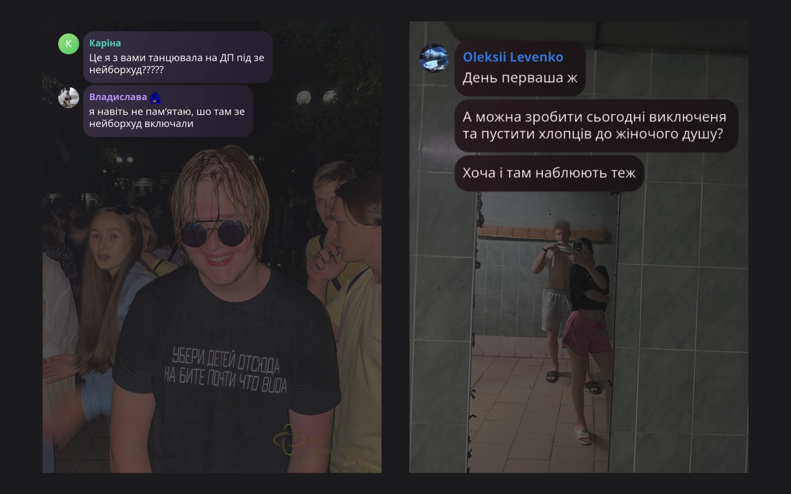

### [Квест](https://www.youtube.com/watch?v=f6NCVLzZjEY&t=780s)

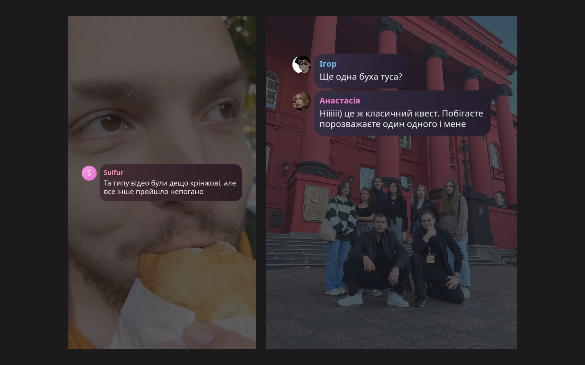

### [Пуща](https://www.facebook.com/100064920451346/posts/629119582595385/?mibextid=rS40aB7S9Ucbxw6v)

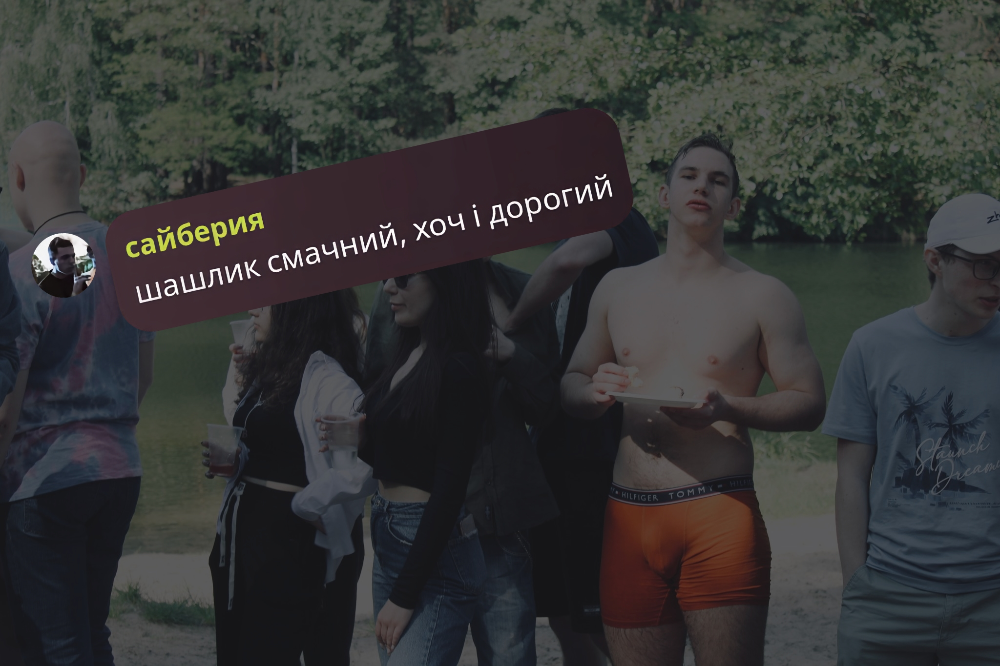

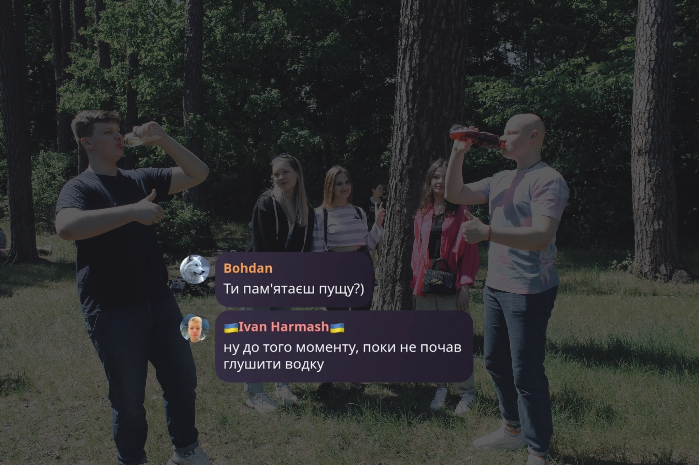

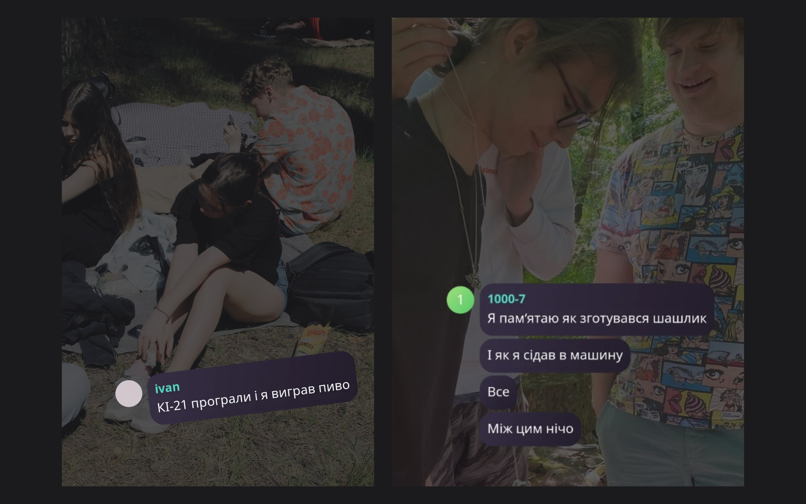

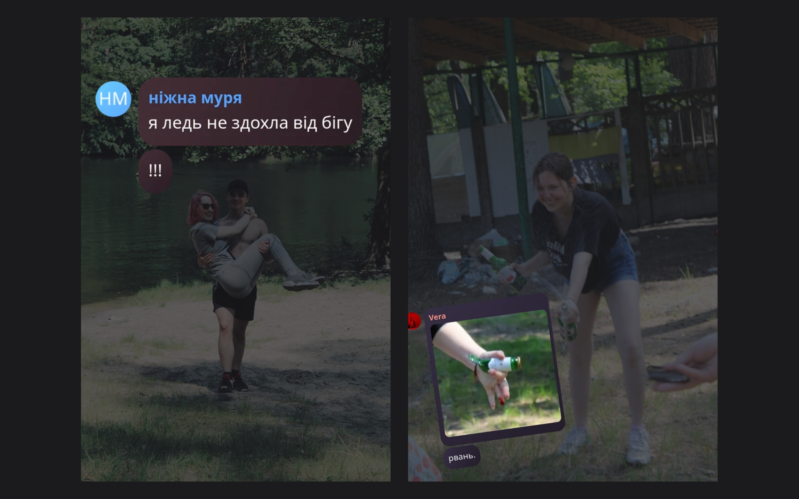

### [Фреш](https://www.facebook.com/100064920451346/posts/pfbid027gHR8mvVyKhPD6YCt8N528AwQq67Hs5iPRKZnvTXsBdcCc4sZmHfm38Bpo7jHpVl/?d=n)

Ще більше івентів і докладніше про них за [посиланням](https://iasastudentcouncil.github.io/iasa-sc-blog/blog/Event/).

## Тобі з ними вчитися…

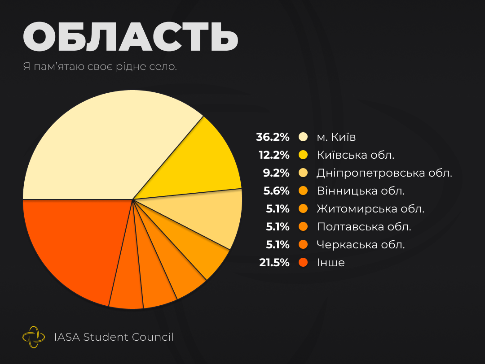

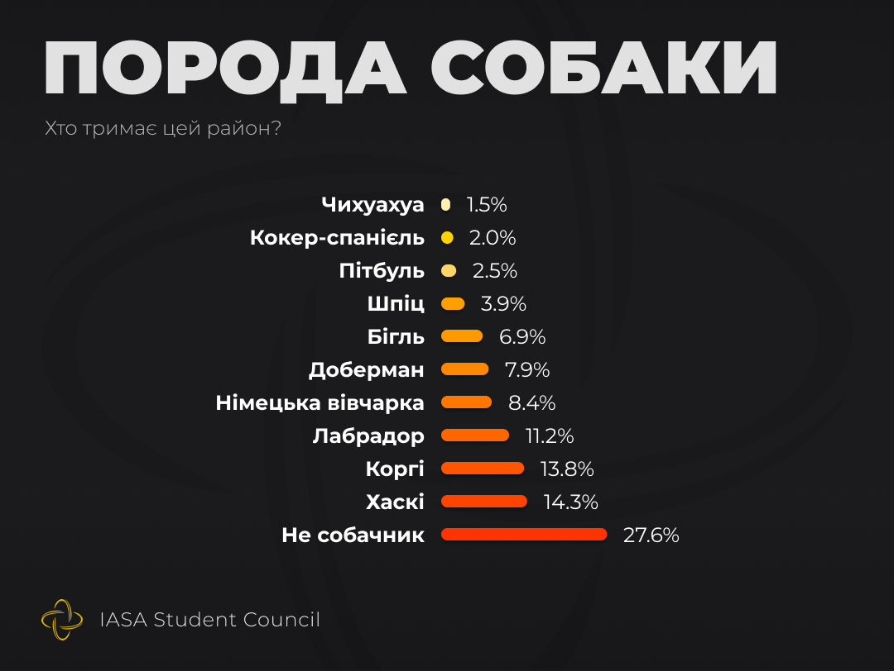

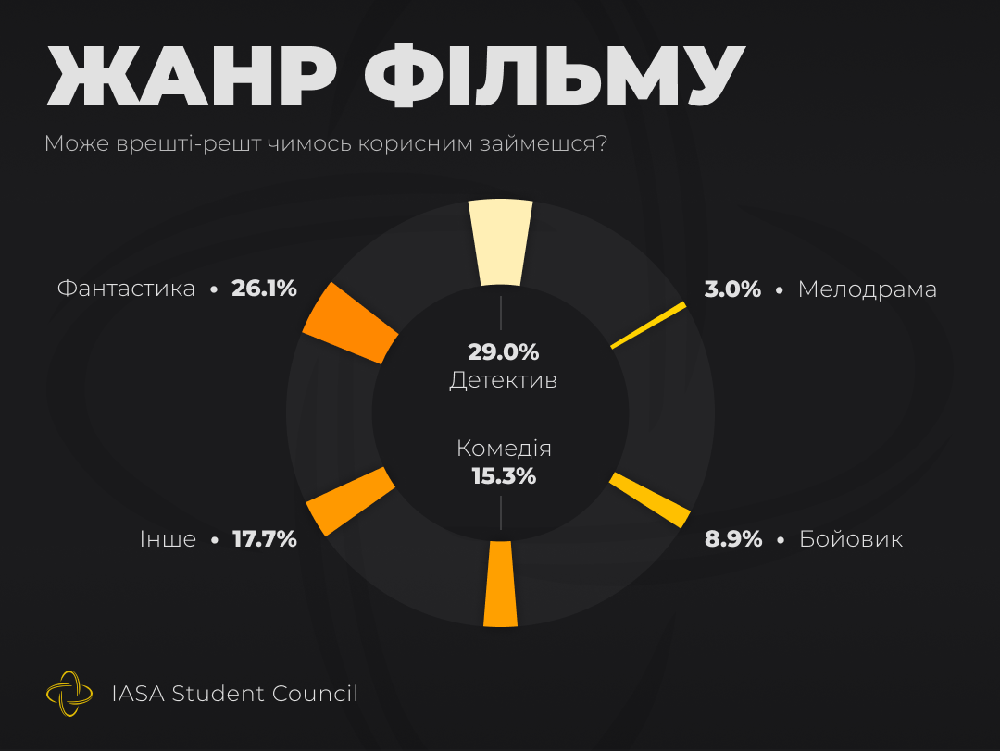

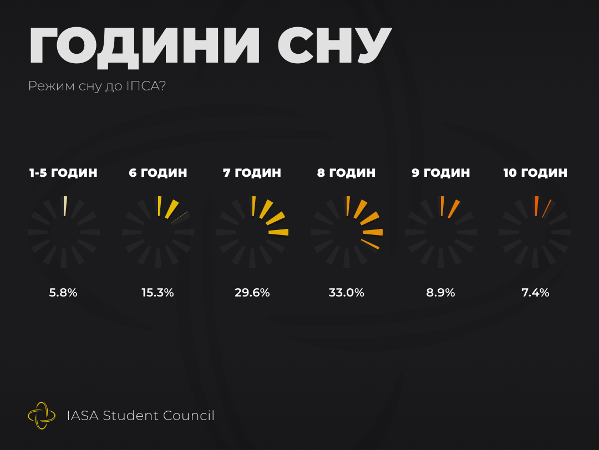

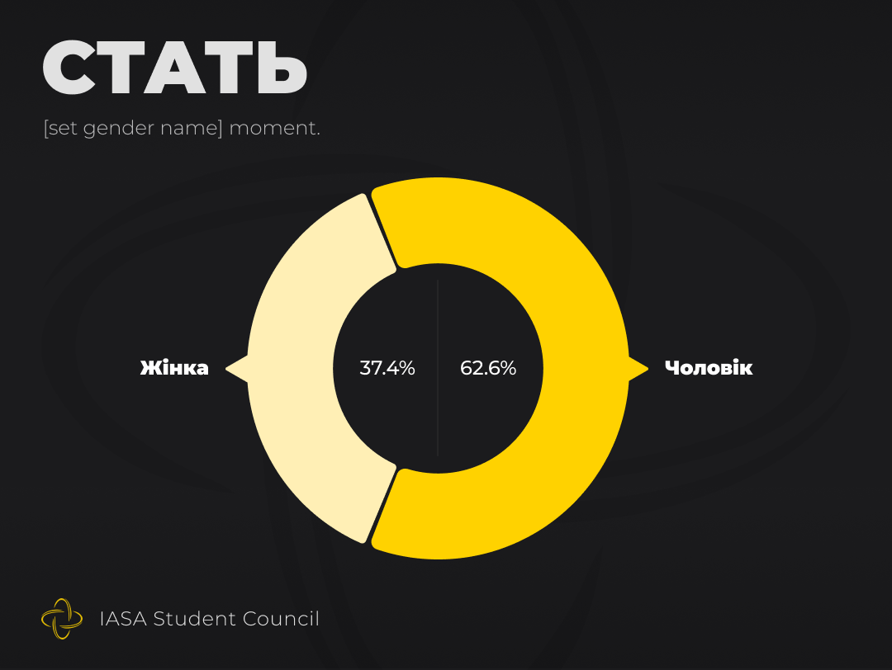

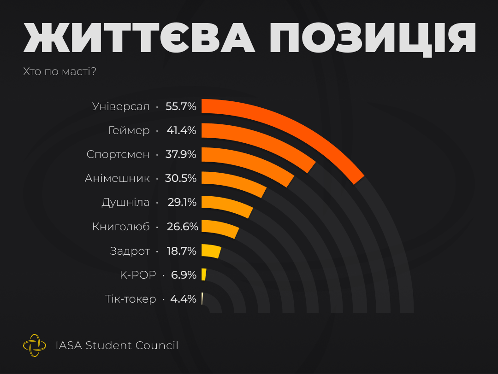

## Студкуратори

### КІ-31

- *Кузьмінська Віра, КІ-21*

— Як поводити себе в гуртожитку?

*— «Ми пишемо колективну пояснювальну записку щодо «розпиття алкогольних напоїв» у кімнаті (номер) в обʼємі 0,5 напливки й 1,5 л фраголіно.*

*У кімнаті були присутні 6 людей, 2 з яких вживали алкоголь: *прізвище* та Кузьмінська.*

_…_

_Претензій до чергових Департаменту безпеки не маємо._

_ (дата, підписи)». _

- *Овчарук Максим, КІ-23*

— Хто така Венздей Аддамс?

_— Я._

### КІ-32

- *Пелехань Єва, КІ-23*

– Як знайти чоловіка в ІПСА?

_– Щоб знайти мена в ІПСА, достатньо мати вигляд, як ТеПеха, та жартувати, як кращий кент. Також важливо регулярно ходити в бари, де тусуються ІПСАшники, та не випендрюватися. 70 % студентів тут — це XY-хромосомні самці, тому спонсора регулярного полового акту знайти зовсім не складно._

- *Мальгінова Марія, КІ-12*

— Чому, на твою думку, так впав цьогорічний прохідний бал?

_— Тому що перестали народжуватись такі генії, як я._

### КІ-33

- *Мамонов Іван, КІ-22*

– Що подарувати ІПСАшниці?

_– Якщо дівчина вступила в ІПСА, то вона точно віддала перевагу жорсткому *цензуровано* (когнітивному навантаженню — прим. ред.). Якщо ти *цензуровано* (вважаєш, що одного навчання буде недостатньо — прим. ред.), тоді точно треба здивувати красуню подарунком. Посібник із дискретної математики дуже гарний варіант. Якщо ж ти прихильник класики, то банальні *цензуровано* (видання курсу диференційного інтегрального обчислення Фігтенгольца — прим. ред.) теж непогана ідея. Коли ти вже досяг серця дівчини, то обов'язково потрібно радувати її ранковим букетом квітів та *цензуровано\_ (легкою розрахунковою роботою з алгебри — прим. ред.). А ввечері можна сходити в бар та провести час у приємній компанії спиртних напоїв, бо в ІПСА без алкоголю дуже складно. На цьому курс молодого пікапера добігає свого кінця, щасливих вам голодних ігор, і нехай удача завжди буде з вами. (Версію без цензури можна запитати в Івана Мамонова.)_

- *Ткаченко Марічка, КІ-13*

– Не думали зробити мерч ІПСА?

_– Не просто думали, а вдало втілили свої ідеї. Сьогодні мерч не просто фантазія, а практична реальність, що об'єднує ІПСАшників. До речі, лунають чутки, що кількість наліпок на ноутбуці безпосередньо впливає на легкість закриття сесії._

### КН-31

- *Василенко Валерія, ДА-21*

— Розумні жінки, факт чи міф?

_— Розумні жінки — це аксіома._

- *Алпашаєв Ільяс, ДА-11*

— Стартерпак молодого іпсашника. М?

_— Внутрівенна кавомашина, безмежна здатність відкладати сон на потім, плюшева іграшка для підтримки, термос для вживання «зігрівальних» напоїв. І найголовніше — це солодкий пупсик у ліжку._

### КН-32

- *Заступ Анастасія, ДА-12*

— 3 речі, без яких нереально уявити студента ІПСА?

_— Насамперед це ноутбук, бо ІПСАшники постійно зяйняті вирішенням різних «вопросіків» чи закриттям дедлайнів. Також важко уявити студентів без чашечки кави вранці або ж 0,5 пива після тяжкого робочого дня. Ну й останнє , що стосується скоріш студентів останніх курсів, — це пігулки для покращення емоційного стану, адже навчання в ІПСА з кожним роком все більше зʼїдає нервові клітини._

- *Ніколаєв Роман, ДА-12*

— Як вижити ІПСАшнику на Поляні?

_— Радити менше й відповідальніше пити не буду, навіщо тоді Поляна, як не для цього? Файно мати кєнтяру, котрий і відкачає, і бидло якесь віджене, і додому доведе в разі не дуже вдалого вечора. Мати гарний зір буде приємним бонусом, щоб завчасно спотити вартових галактики суспільного порядку й уникати штрафів за розпиття. А гарні соціальні навички допоможуть роздобути екстра пляшку пива й знижечку на шаву._

### КН-33

- *Долотова Андріана, ДА-22*

— Як визначитися зі своїм шляхом у житті?

_— Ніяк._

- *Музика Олександр, ДА-12*

— Коли ІПСАшник прокидається, що перше спадає йому на думку?

_— Як казав великий класик сучасності: «Я живииииий!»_

### КА-31

- *Марченко Дмитро, КА-22*

— Найкращі місця, у яких треба побувати справжньому ІПСАшнику.

_— ~~На допці~~ Парк КПІ — це місце бойового хрещення майбутніх первашів, яке відвідується відразу після 35-го корпусу й подачі документів. На Поляну ІПСАшники не ходять, ми вище цього😁. Не треба бувати на комісії або допці, це як рево — швидко й сильно, але зі шкодою для здоров'я. Обов'язково треба побувати на Фреші, Пущі й, по можливості, у турі. Перші два — це ваша посвята в першокурсники, таке буває раз у житті (не повторюйте помилки моїх одногрупників, які цей момент упустили). Тур — це відпочинок у максимально неформальній обстановці й тісній компанії, з екскурсіями й алкоголем (але тільки якщо ти в Студраді, або маєш друга звідти). Є ще шаурма в Big Mama від КПІшників для КПІшників поруч із кампусом і Дрінкері на Пушкінській (близ центру) (радимо на Олімпійській — прим. ред.). Флеш рояль — це мати друга з гуртожитку, який тебе туди проведе. Там основний двіж, драми й комедії, любов і ненависть, та інші плюшки на кардинально іншому рівні. І найважливіше: справжньому ІПСАшнику треба курсу з третього побувати (хоча б трохи) на роботі за спеціальністю (Business Analyst, Data Analyst, DS engineer, ML engineer і подібне), бо потім туди потрапити все важче й важче._

- *Гавлицький Іван, КА-12*

— Скільки коштує кохання?

_ — Один багатий батько. _

### КА-32

- *Харитонов Олександр, КА-12*

— Як почати розмову з одногрупниками?

_— Привіт, з якої ти групи?_

_ бажано на зборах групи, після двох тижнів очного навчання_

- *Ходаківський Артур, КА-12*

— Розкажи анекдот для знайомства з ІПСАшницями.

_— Дівчина, яка не прийшла на побачення, може зіпсувати вам лише настрій, а та, що прийшла, — все життя (збірник «Найсмішніші анекдоти»)._

- *Браткова Поліна, КА-23*

— На що витратити першу стипендію?

_— 1. Купити горішки для Спектра. _

_ 2. Взяти репетитора з матану._ 

_ 3. Задонатити ЗСУ._

_А взагалі витрачайте гроші так, як вважаєте за потрібне, і радійте, що у вас вони поки є (до першого екзамену з матану)._

### КА-33

- *Коваленко Олександра, КА-23.*

— З якою піснею в тебе асоціюється ІПСА?

_— Послухайте приспів Злого Репера Зеника «Іспанія». Думаю, ці рядки скажуть усе самі за себе._

- *Кулєшов Андрій, КА-12*

— Що б ти написав на своїй могильній плиті?

_— Жив, як міг. Помер, як вийшло._

### КА-34

- *Березкіна Анастасія, КА-13*

— Як не розчаруватися в ІПСАшних івентах?

_— Головне правило — не організовувати їх. Не треба ставити великі очікування й розраховувати, що кожен івент буде краще попереднього. Усі івенти різні, а отже й не факт, що тобі всі зайдуть. Не треба йти на шаховий турнір, якщо не граєш у шахи. Але якщо будеш розслаблятися, знайомитися з новими людьми й не перепивати, то впевнена, що після івенту залишиться лиш позитивне враження._

_А взагалі… Прийшов. Побачив. Не розчарувався._

- *Волошина Дарина, КА-21*

— Навіщо потрібні івенти, якщо є матан?

_— А навіщо сон, якщо є матан та івентики?_

### КА-35

- *Кузьмич Ірина, КА-24*

— Який він, раціон ІПСАшника?

_— Кава, сльози й матан._

- *Жигалов Олександр, КА-24*

— Як не вигоріти морально в ІПСА?

_— Навчання в ІПСА є доволі складним випробуванням. Ось декілька порад для збереження морального стану:_

_1. Тайм-менеджмент. Роби все вчасно та не відкладай на кінець. Адже потім буде дуже складно._

_2. Кооперація. Праця в колективі може сильно полегшити задачу._

_3. Відпочинок. Не намагайся працювати до повного виснаження. Зайві розлади особистості тобі не потрібні :)_

_4. Не сприймай близько до серця оцінки. У житті буває багато негараздів, тому перейматися через погану оцінку з якоїсь дисципліни не варто. Головне — усе проаналізувати та виправити в майбутньому. Бо ти автор свого життя, отже ти можеш це виправити._

_Успіху, малечо!_

## Корисні посилання

### Канали ІПСА:

- [IASA Student Council](https://t.me/IASA_Student_Council). Важливі оголошення про навчальний процес, усі версії розкладу й вакансії компаній.

* [IASAevent](https://t.me/iasa_event). Анонси та деталі найближчих розважальних заходів.

- ІПСАшний мерч: [Instagram](https://www.instagram.com/analyst.shop/), [Telegram](https://t.me/analyst_shop). Ресурси для придбання товарів із символікою нашого факультету на різний смак.

* [IASAedu](https://t.me/iasa_edu). Канал із цікавими матеріалами для саморозвитку.

- [Instagram СтудРади ІПСА](https://instagram.com/studrada_iasa). Інститутське життя у фото та відео.

* [IASA Analytics](https://t.me/iasa_analytics). Результати студентських опитувань щодо якості викладання.

- [Деканат ІПСА](https://t.me/dekanat_ipsa). Новини від адміністрації.

### Боти та чати ІПСА:

- [@IASAsuggestionBot](https://t.me/IASAsuggestionBot). Скарги / пропозиції для СР, можна подати на рекламу вакансії, якщо ви роботодавець.

- [@iasa_stud_support_bot](https://t.me/iasa_stud_support_bot). Сповістити про неналежну поведінку викладача, невиконання обов'язків і порушення прав студентів.

* [@ipsa_kpibot](https://t.me/ipsa_kpibot). Спілкування з деканатом.

- [IASA SBS](https://t.me/sbs_iasa). Місце, де підкажуть вирішення складних задач і допоможуть розібратися в темі.

* [IASAchat](https://t.me/+dG_yV0FxCEE0MDY6). Чат для спілкування ІПСАшників різних видів і мастей.

### Ресурси КПІ:

- [Студентство КПІ](https://t.me/sr_kpi). Дописи про актуальне від загальноуніверситетської СтудРади.

- Студмістечко КПІ: канали [адміністрації](https://t.me/studmisto) та [активу СтудРади](https://t.me/kpicampus). Головне джерело інформації для мешканців гуртожитків.

* [КПІ](https://t.me/presinfokpi). Офіційний Telegram-канал інституту.

- [ДНВР](https://t.me/dnvr_31). Важливі оновлення про навчання, поселення та працевлаштування.

* [Стипендія КПІ](https://t.me/kpischolarship). Інформація про стипендію.

- [Розклад КПІ](https://schedule.kpi.ua).
