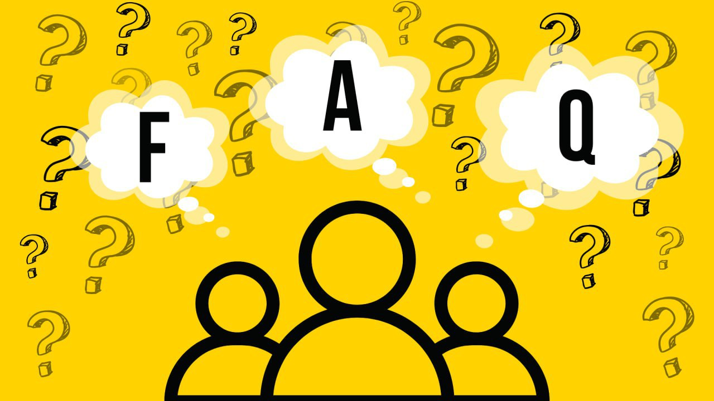
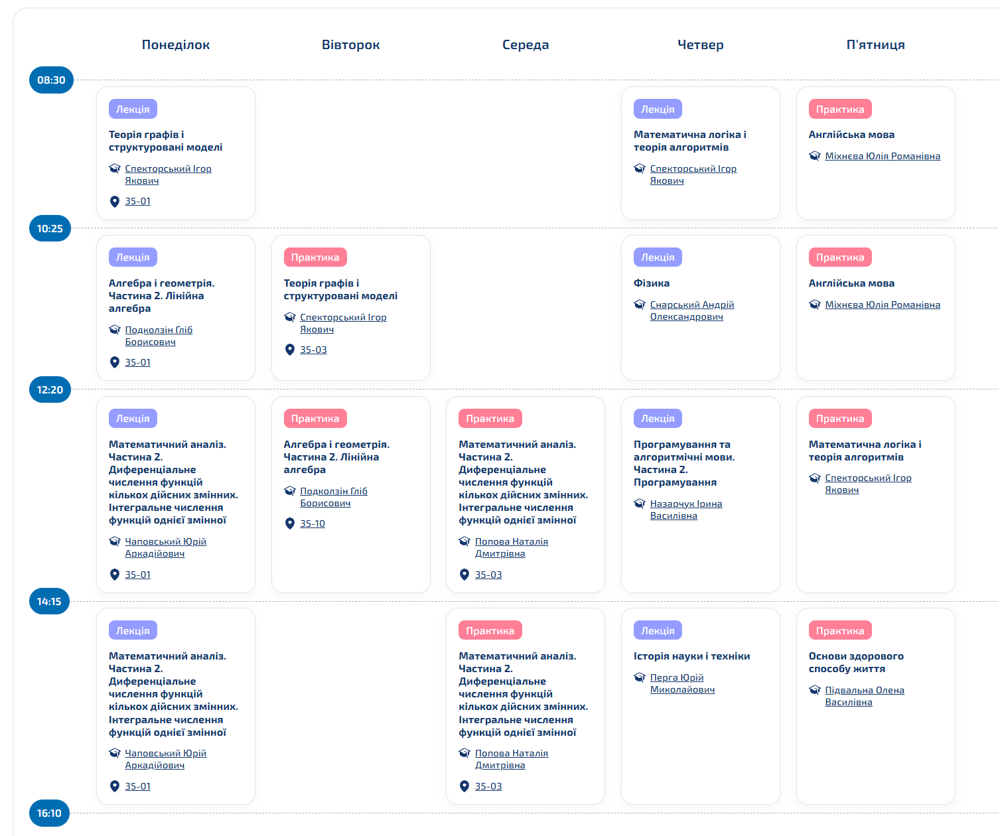

### Загальноуніверситетська духота

#### Що таке ІПСА? Які спеціальності я можу вибрати в ІПСА?

НН ІПСА — це навчально-науковий інститут прикладного системного аналізу. Тут готують фахівців двох спеціальностей: F3 — «Комп’ютерні науки» та F4 — «Системний аналіз та наука про дані». Перша дає вибір між двома освітніми програмами: «Системи і методи штучного інтелекту» (катедра ШІ) та «Інтелектуальні сервіс-орієнтовані розподілені обчислювання» (катедра СП). Натомість друга пропонує освітню програму «Системний аналіз і наука про дані» (катедра ММСА). 

<!--truncate-->

#### Що таке системний аналіз?

Системний аналіз — методологія, яка передбачає певний набір інструментів для розв'язання задач різних сфер досліджень. Він претендує на універсальність засобів, моделей і підходів. Також говорить про те, як працювати в умовах невизначених та / або суперечливих вхідних даних. Надає можливості прогнозування та передбачення поведінки системи. 

#### Чим відрізняються спеціальності F3 (122) та F4 (124)?

На спеціальності F4 вивчають науку про дані, а також формалізацію та побудову моделей із розумінням необхідності їхнього впровадження в комп'ютерне середовище. Наука про дані – це сфера, що займається збором, обробкою та аналізом масивів інформації для виявлення прихованих закономірностей і прогнозування. Тобто для побудови моделей і роботи з даними необхідна математика, а для розуміння того, як вони будуть реалізовуватися, потрібне володіння базовими навичками програмування.

На F3 вчать саме впровадженню цих моделей, тобто розробці програмного забезпечення. Фокус зміщений на архітектуру та написання коду, проте коректна реалізація вимагає розуміння того, як ці моделі працюють, тому певна математична база тут також є обов'язковою.

**P.S.** Детальніше про різницю освітніх програм можеш дізнатися в статтях: [F3 СП](https://iasastudentcouncil.github.io/iasa-sc-blog/blog/122СП/), [F3 ШІ](https://iasastudentcouncil.github.io/iasa-sc-blog/blog/AI/), [F4](https://iasastudentcouncil.github.io/iasa-sc-blog/blog/124/).

#### Яка відмінність між освітніми програмами СП та ШІ?

Обидві освітні програми належать до спеціальності F3 «Комп'ютерні науки» й дають міцну базу з алгоритмів, баз даних, архітектури обчислювальних систем, програмування та математики. Головна відмінність полягає у векторі спеціалізації, який найвиразніше проявляється на старших курсах.

Системне проєктування (СП) зосереджене на класичній і комплексній інженерії програмного забезпечення (Software Engineering). Програма готує розробників широкого профілю та архітекторів систем. Тут поглиблено вивчають вебтехнології, кросплатформну розробку, створення комп'ютерних ігор, а також проєктування цифрових систем на базі різноманітних апаратних рішень. Це ідеальний вибір для тих, хто хоче навчитися створювати масштабні програмні продукти, додатки та сервіси – від проєктування архітектури до кінцевої реалізації.

Системи і методи штучного інтелекту (ШІ) фокусується на Data Science та створенні розумних алгоритмів. Замість класичного вебу чи розробки ігор, студенти цієї програми вивчають машинне навчання, обробку природної мови (NLP), комп'ютерний зір і генеративні моделі. Цей напрям підійде тим, хто хоче не просто створити застосунок, а навчити його самостійно аналізувати великі обсяги даних, розпізнавати обличчя, працювати з текстами або функціонувати як автономний інтелектуальний агент.

#### Чи можна потім перевестися на іншу спеціальність чи освітню програму?

Так, переведення можливе. Проте варто пам'ятати: якщо охочих більше, ніж вільних місць, переводять на конкурсній основі відповідно до рейтингу успішності студента.

Сама процедура стає доступною починаючи з літньої сесії після першого курсу – раніше перевестися неможливо. Цей момент є найсприятливішим для зміни освітньої програми. Наприклад, при переході між катедрами СП та ШІ навчальні плани першого року є повністю ідентичними. Тому одразу після літньої сесії першого курсу академічної різниці не буде взагалі, і перехід відбудеться максимально безболісно.

При зміні ж спеціальності – наприклад, між F3 (122) та F4 (124) – або при переведенні з іншого університету неминуче виникає «академічна різниця» в програмах, що вимірюється в кредитах ЄКТС. Вона не може перевищувати 20 кредитів за кожен рік навчання та має бути обов'язково ліквідована у визначені терміни.

#### На скільки потрібно скласти НМТ, щоб до вас потрапити? (Як розрахувати свій конкурсний бал?)

Цього року вступники мають скласти три обов'язкових іспити: з математики, української мови та історії України. Четвертий предмет обирається із наступного переліку: фізика, іноземна мова, біологія, хімія, українська література або географія. Щоб розрахувати свій конкурсний бал, необхідно використати формулу:

(К1 × П1 + К2 × П2 + К3 × П3 + К4 × П4) / (К1 + К2 + К3 + (К4_макс + К4)/2)

де П1, П2, П3, П4 — оцінки з першого, другого, третього та четвертого предметів за шкалою 100-200 балів;

К1, К2, К3, К4 — [невід'ємні вагові коефіцієнти](https://osvita.ua/consultations/bachelor/10025/), що визначені для кожної спеціальності.

У таблиці нижче наведено прохідні бали на спеціальності за останні роки.

<table>
  <tr>
    <th>Код</th>
    <th>Спеціальність</th>
    <th>2023</th>
    <th>2024</th>
    <th>2025</th>
  </tr>
  <tr>
    <td>F3</td>
    <td>Комп'ютерні науки</td>
    <td>179.455</td>
    <td>174.231</td>
    <td>160.000</td>
  </tr>
  <tr>
    <td>F4</td>
    <td>Системний аналіз</td>
    <td>164.364</td>
    <td>158.833</td>
    <td>146.444</td>
  </tr>
</table>

#### Коли можна перевестися із контракту на бюджет?

Можливість перевестися з контрактної на бюджетну форму навчання зʼявляється після першого курсу. Надалі це можна зробити наприкінці кожного семестру. Враховуються результати двох останніх сесій та пільговий статус. Докладніше про процес можна прочитати за [посиланням](https://document.kpi.ua/files/2025_HOD-737a.pdf).

#### Чи є можливості навчатися за кордоном за програмою по обміну?

ІПСАшниці та ІПСАшники (!) мають можливість навчатися за програмами від Erasmus та іншими пропозиціями #Edu_abroad щодо обміну від університетів та урядів інших країн. Докладніше за [посиланням](https://mobilnist.kpi.ua/).

#### Яким буде формат навчання?

Формат навчання залежатиме від обраного рівня та форми здобуття освіти. Станом на червень 2026 року адміністрація університету розглядає можливість переведення студентів денної форми навчання бакалаврату на змішаний формат. Це передбачає проведення лекцій онлайн, а практичних занять – очно в авдиторіях. Водночас вступники в ІПСА 2024 і 2025 років мали інший розподіл: лекції та практики з профільних предметів проводилися очно, а решта дисциплін – повністю онлайн. При цьому всі форми контролю узгоджуються з форматом проведення пар.

Окрім традиційної денної форми, з цього року на бакалавраті запущена дистанційна форма за освітньою програмою «Системи і методи штучного інтелекту». У межах цієї форми  всі заняття та екзамени проходитимуть повністю онлайн. Навчальна програма тут нічим не відрізняється від денної, проте дистанційна форма є винятково контрактною.

Також цього року розширилися можливості для вступу: тепер можна здобути другу вищу освіту на основі вже наявного диплома бакалавра. Це скорочена трирічна програма, яка передбачає вечірній формат навчання й також доступна тільки за контрактом.

Оновлення торкнулися і магістратури. Цього року ІПСА вперше запроваджує заочну форму навчання для магістрів за програмою «Системи і методи штучного інтелекту». Набір на заочну магістратуру здійснюється на контрактній основі.

#### У якому корпусі навчаються студенти ІПСА?

Основним корпусом для навчання є 35, хоча заняття можуть відбуватись і в інших приміщеннях на території КПІ, залежно від викладачів з інших факультетів та інститутів. Однією з вагомих причин для переходу в інший корпус може бути певне обладнання, наприклад, для лабораторних робіт із фізики.

#### Чи надається іногороднім студентам гуртожиток та які там умови проживання?

Право на поселення до гуртожитків надається всім, хто має реєстрацію місця проживання поза радіусом 50 кілометрів від м. Києва. Пріоритет надається студентам з окупованих або особливо небезпечних територій. Студенти ІПСА проживають переважно у 7 гуртожитку коридорного типу. Кожен поверх містить по 2 санвузли, кухні та місця для вмивання з 4 умивальниками по обидва боки коридору. Душ знаходиться на цокольному поверсі та розділений на чоловічий і жіночий. Кімнати, площею 12-14 кв. м — чотиримісні. Основні умови залежать від попередніх власників, проте не заборонено робити ремонт.

Натомість, починаючи з 2025, вступники мають право обрати гуртожиток для поселення за пріоритетною системою, що бере до уваги рейтингові списки, пільгові категорії та щільність заселення.

Докладніше про гуртожитки можна прочитати [тут](https://iasastudentcouncil.github.io/iasa-sc-blog/blog/Dormitory/).

### Навчання та дотичні до нього запитання

#### Наскільки актуальні дисципліни?

Наші освітні програми постійно оновлюються й адаптуються до вимог ринку праці. Попри фундаментальність базових предметів, викладачі регулярно актуалізують матеріали, а профільні ІТ-дисципліни зазвичай читають фахівці-практики, спираючись на реальний робочий досвід.

Обсяг загальноосвітніх дисциплін оптимізовано, щоб студенти могли раніше зануритись у спеціальність. Вже з перших курсів починається активне вивчення програмування, баз даних та архітектури обчислювальних систем. На старших курсах вивчаються передові технології залежно від обраної програми. Це може бути глибоке навчання, аналіз великих даних і комп'ютерний зір або ж кросплатформна розробка, проєктування цифрових систем на базі інтегральних схем і вебтехнології.

Крім того, актуальність знань забезпечується великим блоком вибіркових дисциплін, який дозволяє гнучко налаштувати власну освітню траєкторію. Студенти мають широкий вибір курсів: від розробки комп'ютерних ігор і вебдизайну до генеративних моделей штучного інтелекту, біоінформатики й управління ІТ-проєктами.

#### Чи є викладачі, у яких неможливо здати предмет не заплативши?

Можемо гарантувати, що таких викладачів в ІПСА не існує, адже вони звикли брати плату лише витраченим часом на вивчення їхнього предмета.

#### Чи обов’язково писати конспект на лекціях? Чи надають викладачі короткі електронні конспекти?

У більшості викладачів є «Методичні матеріали» за якими вони й читають лекції. До того ж в Інтернеті можна знайти весь необхідний матеріал. Вести конспекти чи ні — суто твій вибір. Писати їх від руки чи робити записи за допомогою електронних пристроїв – the same. Якщо для тебе кількість написаного не впливає на якість знань, вистачить пасивного перегляду лекцій та вищеописаних матеріалів.

#### Скільки в середньому пар у день? Яку оптимальну кількість часу потрібно відводити на навчання в ІПСА?

Може бути як по 3 пари, так і коливання від 1 до 4 пар у день. Також потрібно враховувати деякі практики, які не є обов’язковими для відвідування, а використовуються лише для здачі лабораторних робіт чи надання консультацій. При цьому навчання не обмежується тільки парами. Важливою є самостійна робота студента над матеріалами, лабораторними роботами й іншими завданнями.

#### Навіщо мені стільки математики?

Багато математичних алгоритмів є основною для побудови, формалізації, розробки та впровадження певних моделей у складні інформаційні системи. Наприклад, знання з математичного аналізу чи статистики є необхідною базою для будь-якого аналітика, без лінійної алгебри не обійтися майбутньому гейм-девелоперу, а дискретна математика стане в нагоді більшості «прогерів».

Навіть у випадку «мамо, я стану фронтендером!», математика розвиває логіку, критичне та алгоритмічне мислення.

#### Наскільки шкільна математика відрізняється від університетської?

Дуже. Якщо ти в школі думав/ла, що розумієш математику, то тут можеш дійти висновку, що ти помилявся/лася.

Зрештою, хвилюватися не варто: усі в рівних умовах, шкільної бази має вистачити.

#### Мене навчать тут програмувати?

Ти отримаєш непогану базу як із програмування, так і з математичних дисциплін, що є дуже корисним і дасть тобі гарне розуміння щодо напряму, у якому плануєш розвиватися надалі.

#### Якщо я нуль у програмуванні, чи треба щось вчити до вступу та що саме?

Відсутність навичок — не смертний вирок. До того ж курс програмування почнеться з основ мови С, тому в тебе буде можливість розібратися. Розуміти, аналізувати та розробляти алгоритми тебе навчать на парах з АСД. Якщо ж вважаєш, що написаної програми в Scratch на інформатиці недостатньо, — цей [список літератури](https://iasastudentcouncil.github.io/iasa-sc-blog/blog/preparationforstudy/) створено для тебе.

#### Які мови програмування тут вивчають?

На обох спеціальностях на першому курсі вивчають C та C++. Далі ви самостійно обиратимете, якою мовою програмувати: Python, Java, C#, Rust, Go і так далі. 

#### Чи важка фізика? Мене виженуть, якщо я нуль?

Якщо ти маєш хоча б мінімальну базу з математики та фізики, то для того, щоб орієнтуватися в темах, достатньо лише уважно слухати лекції та не ловити ґав на практиках.

#### Наскільки важка англійська?

Якщо плануєш підняти свій рівень з В1-В2, маємо погані новини. Ти зможеш лише закріпити вже набуті знання, хоча акцентуватися увага буде на технічній термінології. Для учнів, які в школі вивчали німецьку чи французьку мови, є можливість обрати їх.

#### Як багато гуманітарних предметів вивчаються в ІПСА?

Щосеместру вивчається одна або дві гуманітарні дисципліни, окрім перманентної англійської та додаткових вибіркових предметів. Це ніяк не основна частина твого навчання, тому вимоги там відповідні.

#### Чи можливо відвідувати якісь однонаправлені секції (наприклад, плавання)?

Перший курс ІПСА побалує тебе теоретичними парами з основ здорового способу життя. Проте, для того, щоб розвивати свої спортивні здібності в певній дисципліні, КПІ надає можливість записатися до секції, де ти зможеш займатися улюбленою справою з обраним тренером безкоштовно.

#### Чи буде в мене вільний час? Та як правильно ним розпоряджатися, щоб усе встигати?

Буде, питання лише в кількості. Варто пам’ятати, що це залежить від твого ставлення до навчання. Хтось докладає максимум зусиль перші місяці та не вмирає ближче до сесії. Інші починають навчатися вже в період атестації або екзаменів (press F). Таким чином, дотримуючись певних правил організації свого часу, тебе, ~~можливо~~, не відрахують.

#### Коли можливо поєднувати навчання з роботою?

Питання залишається індивідуальним і залежить як від твоїх можливостей, так і від специфіки роботи. Здебільшого ж за спеціальністю ІПСАшники починають працювати з 3 курсу. Деякі студенти на 1-2 курсах підробляють репетиторами. Кількість працевлаштованих росте з підвищенням курсу разом із лояльністю викладачів до цієї зайнятості.

#### Чи співпрацює ІПСА з компаніями, і чи надають вони стажування?

Так, практична підготовка та зв'язок з ІТ-індустрією є невід’ємною частиною навчання.

Факультет співпрацює з провідними українськими та міжнародними ІТ-компаніями (серед яких Genesis, GlobalLogic, Huawei, EPAM, SoftServe тощо). Представники бізнесу регулярно залучаються до проведення відкритих зустрічей, профільних івентів і хакатонів, де студенти мають змогу особисто поспілкуватися з рекрутерами та технічними фахівцями. До того ж наші випускники часто повертаються з гостьовими лекціями та пропонують найактивнішим слухачам спрощені співбесіди (fast-track) у свої поточні команди.

Також навчальними планами (зокрема на четвертому курсі) офіційно передбачена переддипломна практика. Найчастіше її проходять у форматі реального стажування або інтернатури у компаніях-партнерах. Це дозволяє не лише закрити академічні вимоги, а й отримати перший комерційний досвід і повноцінний офер ще до отримання диплома бакалавра.

А для своєчасного інформування про актуальні співпраці та кар'єрні можливості деканат ІПСА активно веде інформаційний канал. Там регулярно публікуються гарячі вакансії, пропозиції стажувань та анонси воркшопів для студентів інституту.

#### Івенти… що?

ІПСАшники, аби підтвердити класифікацію «людина звичайна», вміють / люблять / потребують відпочивати. Для вирішення цієї проблеми Студрада влаштовує івенти, на яких ти можеш розширити коло друзів і просто на деякий час забути про навчання. З переліком заходів можна ознайомитися за [посиланням](https://iasastudentcouncil.github.io/iasa-sc-blog/blog/Event/).

### Трохи мотивації

#### Який відсоток відрахувань?

Існує стереотип, що шанси продовжити навчання після першої сесії прямують до нуля, що є менш актуальним через дистанційний формат навчання. Насправді ж вони обернено пропорційні вашим зусиллям.

#### В ІПСА всі такі генії, що мені тут робити?

Потрібно розуміти, що кожен студент колись був невпевненим абітурієнтом і що не тільки тебе «доля обділила» якісною середньою освітою. На ділі «геніальність» означає зацікавленість, яка, у свою чергу, корелює з кількістю зусиль та часу, що ти готовий віддати навчанню. Працюй, а геніальне оточення створить конкуренцію, що стане твоєю мотивацією для підкорення нових висот.

#### Я навчався в гуманітарному класі, чи буде для мене посильним навчання в ІПСА?

Якщо ти склав екзамен і потрапив до нас, то для тебе вже немає непосильних задач. Доведеться наполегливо працювати на початку, щоб покрити різницю в базових вимогах і вміннях. Але зазвичай розрив між більш та менш підготовленими студентами зникає за кілька місяців. Ти можеш займати топові місця в рейтингу зі стандартною загальноосвітньою математичною підготовкою 3 години на тиждень та без жодних умінь програмувати на початку. Усе залежить лише від тебе.

### Надважливе

#### Чи є в ІПСА заочна форма навчання?

На програмах бакалаврату заочної форми не передбачено.
