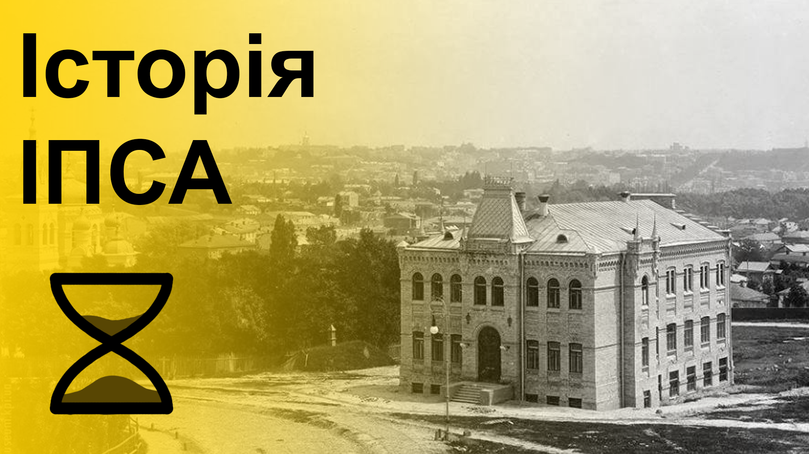
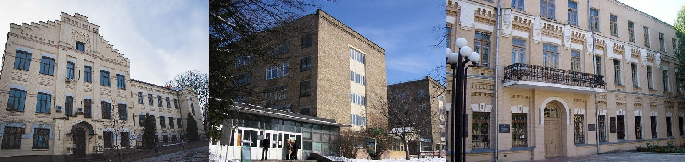
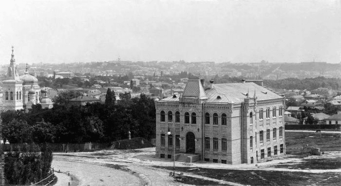

Історія ІПСА бере свій початок ще до його офіційного заснування, оскільки складники навчально-наукового інституту — катедри, були створені набагато раніше.

<!--truncate-->

import MobileTOC from "../../../src/components/MobileTOC/MobileTOC.jsx";

<MobileTOC sections={[  
    { heading: "Спочатку було слово…", subHeadings: []},
    { heading: "Спочатку була катедра СП…", subHeadings: []},
    { heading: "Утворилася земна твердь…", subHeadings: []},
    { heading: "Утворилася катедра ММСА…", subHeadings: []},
    { heading: "Як оцінити неоціненне?", subHeadings: []},
    { heading: "Потім з’явилася людина…", subHeadings: []},
    { heading: "Потім з’явилася катедра ШІ…", subHeadings: []},
    { heading: "І наповнюйте землю, оволодійте нею…", subHeadings: []},
    { heading: "Сучасні реалії…", subHeadings: []},
    { heading: "Рушій прогресу студентства", subHeadings: []},
    { heading: "Далі буде…", subHeadings: []}
]}/>

### **_Спочатку було слово…_**
### **_Спочатку була катедра СП…_**

У далекому **1962** році зародилась ідея створення катедри **_системного проєктування_**, коротко іменованої як СП. У 1972 задум був реалізований: на базі факультету радіоелектроніки в рамках спеціальності «Промислова електроніка» розпочалася підготовка спеціалістів відповідного напряму.  У **1985** році, за підтримки професора А.І. Петренка, з'явилася катедра **систем автоматичного проєктування** (САПР).

### **_Утворилася земна твердь…_**
### **_Утворилася катедра ММСА…_**

У **1988** році розпочинає своє існування катедра **_математичних методів системного аналізу_** (ММСА),  за участі Ю.Л. Далецького, М.З. Згуровського та В.С. Михалевича.

**1990 рік** — катедра ММСА стає підрозділом факультету прикладної математики, а на її базі створюється Науково-дослідний інститут (нині центр) міждисциплінарних досліджень.

**1995 рік** — в Україні запроваджено нові спеціальності: «Системний аналіз та управління», «Інтелектуальні системи прийняття рішень» та «Соціальна інформатика», які потребували створення відповідної структурної одиниці для їхнього вивчення.

**1997 рік** — на базі Науково-дослідного інституту прикладного системного аналізу НАН України та катедри ММСА створено

**ІПСА** — інститут прикладного системного аналізу. Підрозділ отримує четвертий рівень акредитації, що забезпечує можливість навчатися за освітньо-професійними програмами першого (бакалаврського) та другого (магістерського) рівня вищої освіти. У 2006 році до катедрату була приєднана вищезгадана САПР.

### **_Як оцінити неоціненне?_**

**2004 рік** — за сприяння Згуровського М.З., ректора КПІ, запроваджено Болонську систему оцінювання.

**Завдання реформи** — перехід на дворівневу освіту: бакалаврат і магістратуру, введення системи зіставлення дипломів і визнання їх у всіх країнах «Європейського простору вищої освіти».

### **_Потім з’явилася людина…_**
### **_Потім з’явилася катедра ШІ…_**

**До 2022** року катедра ММСА проводила підготовку студентів за двома спеціальностями: 124 «Системний аналіз» та 122 «Комп’ютерні науки» (освітня програма «Системи і методи штучного інтелекту»).

**2022 рік** — зміна устрою ЗВО. Відповідно до нових вимог, 122 спеціальність сепаровано від ММСА та створено катедру штучного інтелекту.

### **_І наповнюйте землю, оволодійте нею…_**

Корпуси, у яких проходить навчальний процес: 35, 14, 6. Усі будівлі розташовані на території кампуса КПІ.

Раніше катедра ММСА повністю розміщувалася в 14 корпусі, а наукові підрозділи були зосереджені в 35.

У **2012** році вона переїхала в 35 корпус, хоча деякі заняття й досі проходять у 14. Катедра СП розташовувалася в 26 корпусі, на Печерську, та в **2021** році змінила «місце проживання» на 14 корпус.

**2022** рік — катедра ШІ локалізується в 6 корпусі.

### **_Сучасні реалії…_**

Сьогодення. ІПСА — це насамперед складна математика та яскраве студентське життя. Але якщо перше — заслуга висококваліфікованого викладацького колективу, то над другою складовою працюють студенти.

### **_Рушій прогресу студентства_**

**1998 рік** — активіст  Артем Михайлюк започатковує Студентську Раду ІПСА, стає її першим головою та досягає права голосу у Вченій раді, чим встановлює зв’язок між здобувачами освіти й адміністрацією КПІ. Час минав, змінювалися люди та цілі організації, з’являлися нові амбітні та креативні студенти. На початку 2000 року СР ІПСА перемогла в єдиному в історії КПІ міжфакультетському конкурсі як найкраща студентська рада НТУУ «КПІ». Згодом, у **2009, була визнана найкращим органом студентського самоврядування України.**

**_Мета Студради:_** покращення навчання в ІПСА для сучасних та майбутніх поколінь студентів, вдосконалення інституту спільними зусиллями здобувачів освіти та викладачів, створення заходів для відчуття смаку того самого *«студентського життя»*.

### **_Далі буде…_**
