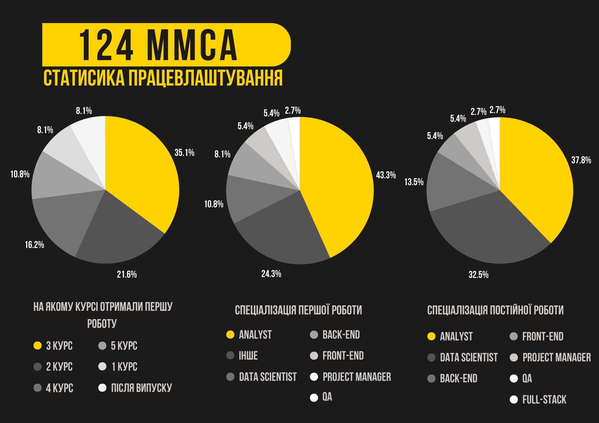
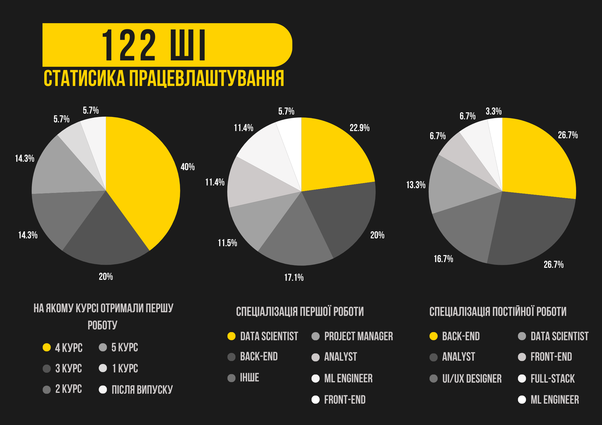
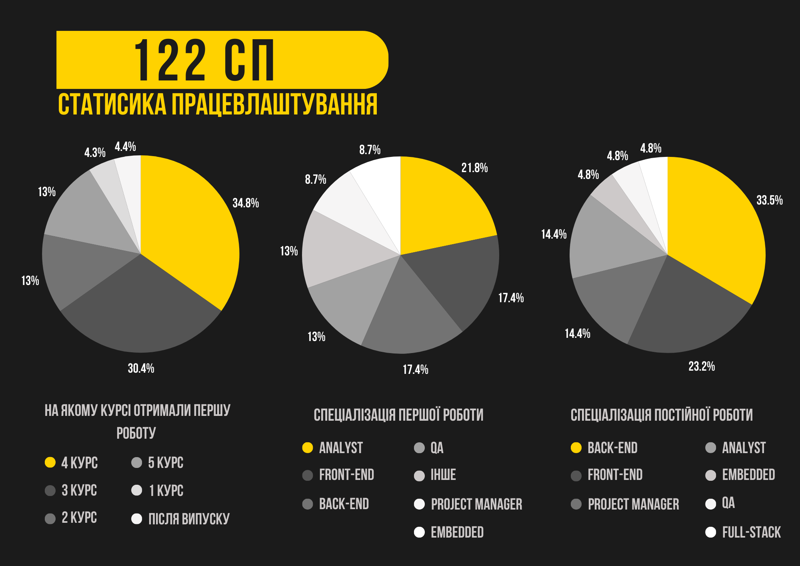

В умовах сучасності, швидкого зростання обсягів даних, зміни технологій та викликів перед суспільством, ринок потребує фахівців, які вміють аналізувати складні процеси, проєктувати ефективні рішення та працювати зі штучним інтелектом. ІПСА націлений на підготовку спеціалістів із цими навичками.

У цій статті ми привідкриваємо завісу майбутнього після вступу на прикладі наших студентів та випускників із реальним досвідом.
Ми розповімо, як деякі почали професійно реалізовуватися й отримувати досвід вже під час навчання: хтось у великих IT-компаніях, інші у перспективних стартапах, а дехто створив власні проєкти. Деякі обрали шлях науки, вступивши до аспірантури чи долучившись до дослідницьких груп.

<!--truncate-->

---

Що об'єднує всіх цих людей? Те, що фундамент для їхнього успіху було закладено саме тут — на парах, хакатонах та практичних заняттях.

Статистика працевлаштування студентів та випускників наших катедр:

## Перелік основних професій ІПСАшників

> *Примітка: заробітні плати, представлені нижче є дуже усередненим показником. Насправді заробітна плата залежить у певних межах залежно від досвіду, але цілком залежить від бюджету та рівня ЗП у компанії затверджений для цієї посади, а також від домовленості на етапі співбесіди та/або отримання оферу.*

### ML Engineer (Machine Learning Engineer)
Розробляє алгоритми машинного навчання, які дозволяють комп’ютерам самостійно виявляти закономірності в даних і робити прогнози. Займається побудовою моделей, їхнім тренуванням, оцінкою якості та інтеграцією в реальні продукти. Готує й аналізує великі обсяги даних, оптимізує моделі для швидкої роботи, стежить за точністю та узагальненням. Часто працює з обробкою зображень, текстів, голосу чи рекомендаційними системами.
- Медіанна заробітна плата Junior-спеціалістів (зазвичай від 6 місяців до 1.5 років досвіду): ***1000$***.
- Медіанна заробітна плата Middle-спеціалістів (зазвичай від 1 до 3 років досвіду): ***2800$***.
- Медіанна заробітна плата Senior/Lead-спеціалістів (зазвичай від 3 років досвіду): ***5000$***.

### Front-end Engineer

Розробляє інтерфейс користувача, тобто ту частину застосунку, яку бачать і з якою взаємодіють. Відповідає за верстку сторінок, інтерактивні елементи, адаптивність під різні пристрої та швидкість реакцій. Працює в тісній співпраці з дизайнерами, імплементує макети, підключає дані з бекенду через API, забезпечує зручний та інтуїтивний UX.
- Медіанна заробітна плата Junior-спеціалістів (зазвичай від 6 місяців до 2 років досвіду): ***950$***.
- Медіанна заробітна плата Middle-спеціалістів (зазвичай від 2 до 4–5 років досвіду): ***2350$***.
- Медіанна заробітна плата Senior/Lead-спеціалістів (зазвичай від 5 років досвіду): ***4500–5700$***.

### Back-end Engineer

Створює серверну частину веб- і мобільних застосунків, відповідальну за логіку, обробку запитів, безпеку та доступ до баз даних. Працює з API, реалізує бізнес-логіку, управляє хмарною інфраструктурою, контролює продуктивність і масштабованість системи. Забезпечує правильну взаємодію між фронтендом та базою даних, створює системи аутентифікації, логування та моніторингу.
- Медіанна заробітна плата Junior-спеціалістів (зазвичай від 6 місяців до 2 років досвіду): ***900$***.
- Медіанна заробітна плата Middle-спеціалістів (зазвичай від 2 до 4–5 років досвіду): ***2500$***.
- Медіанна заробітна плата Senior/Lead-спеціалістів (зазвичай від 5 років досвіду): ***4800–5800$***

### Full-stack Developer

Поєднує функції фронтенда та бекенда: створює як інтерфейс користувача, так і серверну логіку. Самостійно реалізує повноцінний застосунок — від взаємодії з базою даних до виведення даних у браузері. Часто працює з інтеграцією сторонніх сервісів, авторизацією, системами платежів, аналітикою. Має широкий технічний профіль і вміє швидко перемикатися між різними задачами.
- Медіанна заробітна плата Junior-спеціалістів (зазвичай від 6 місяців до 2 років досвіду): ***900$***.
- Медіанна заробітна плата Middle-спеціалістів (зазвичай від 2 до 4–5 років досвіду): ***2300$***.
- Медіанна заробітна плата Senior/Lead-спеціалістів (зазвичай від 5 років досвіду): ***4300$***.

### Data Engineer

Будує інфраструктуру для збору, обробки, зберігання і передачі даних. Очищає та трансформує їх, щоб інформація була придатна для подальшої аналітики. Працює з потоковими даними, базами даних, хмарними платформами, забезпечує стабільність і масштабованість систем обробки.
- Медіанна заробітна плата Junior-спеціалістів (зазвичай від 6 місяців до 1.5 років досвіду): ***1100$***.
- Медіанна заробітна плата Middle-спеціалістів (зазвичай від 1 до 3 років досвіду): ***2600$***.
- Медіанна заробітна плата Senior/Lead-спеціалістів (зазвичай від 3 років досвіду): ***5300$***.

### Data Scientist

Аналізує великі обсяги даних для виявлення прихованих закономірностей, створення моделей прогнозування та обґрунтування бізнес-рішень. Працює зі статистичними методами, машинним навчанням і візуалізацією результатів. Розробляє експерименти, проводить A/B тести, досліджує поведінку користувачів. Пояснює складні аналітичні висновки нетехнічній авдиторії та допомагає компанії ухвалювати рішення на основі даних.
- Медіанна заробітна плата Junior-спеціалістів (зазвичай від 6 місяців до 1.5 років досвіду): ***900$***.
- Медіанна заробітна плата Middle-спеціалістів (зазвичай від 1 до 3 років досвіду): ***2800$***.
- Медіанна заробітна плата Senior/Lead-спеціалістів (зазвичай від 3 років досвіду): ***5200$***.

### Data/Product/Business Analyst

Збирають, досліджують та інтерпретують дані для покращення бізнесу або продукту.

– **Data Analyst** створює звіти, дашборди, виявляє тенденції та дає рекомендації на основі історичних даних.
- Медіанна заробітна плата Junior-спеціалістів (зазвичай від 6 місяців до 1.5 років досвіду): ***900$***.
- Медіанна заробітна плата Middle-спеціалістів (зазвичай від 1 до 3 років досвіду): ***2000$***.
- Медіанна заробітна плата Senior/Lead-спеціалістів (зазвичай від 3 років досвіду): ***3000$***.

– **Product Analyst** аналізує поведінку користувачів, проводить A/B тести, допомагає пріоритизувати фічі.
- Медіанна заробітна плата Junior-спеціалістів (зазвичай від 6 місяців до 1.5 років досвіду): ***1250$***.
- Медіанна заробітна плата Middle-спеціалістів (зазвичай від 1 до 3 років досвіду): ***2200$***.
- Медіанна заробітна плата Senior/Lead-спеціалістів (зазвичай від 3 років досвіду): ***4200$***

– **Business Analyst** спілкується з клієнтами та командою, формує вимоги до продукту, описує бізнес-процеси, допомагає знаходити ефективні рішення.
- Медіанна заробітна плата Junior-спеціалістів (зазвичай від 6 місяців до 1.5 років досвіду): ***1000$***.
- Медіанна заробітна плата Middle-спеціалістів (зазвичай від 1 до 3 років досвіду): ***2200$***
- Медіанна заробітна плата Senior/Lead-спеціалістів (зазвичай від 3 років досвіду): ***3700$***.

### Embedded Engineer

Програмує мікроконтролери, сенсори, периферійні пристрої та інші апаратні компоненти, що використовуються у фізичних пристроях. Розробляє прошивки, працює з низькорівневим кодом, взаємодіє з електронною схемотехнікою. Забезпечує стабільність, реальну швидкодію та енергоефективність в умовах обмежених ресурсів.
- Медіанна заробітна плата Junior-спеціалістів (зазвичай від 6 місяців до 1.5 років досвіду): ***1000$***.
- Медіанна заробітна плата Middle-спеціалістів (зазвичай від 1 до 3 років досвіду): ***2500$***.
- Медіанна заробітна плата Senior/Lead-спеціалістів (зазвичай від 3 років досвіду): ***4500$***.

### UI/UX Designer

Проєктує зовнішній вигляд інтерфейсів (UI) та забезпечує їхню зручність і логіку використання (UX). Досліджує поведінку користувачів, проводить інтерв’ю, створює користувацькі сценарії, прототипи й макети. Тестує інтерфейси на реальних користувачах, враховує психологію сприйняття, кольори, типографіку та доступність. Тісно співпрацює з розробниками для реалізації дизайну в коді.
- Медіанна заробітна плата Junior-спеціалістів (зазвичай від 6 місяців до 1.5 років досвіду): ***800$***.
- Медіанна заробітна плата Middle-спеціалістів (зазвичай від 1 до 3 років досвіду): ***1500$***.
- Медіанна заробітна плата Senior/Lead-спеціалістів (зазвичай від 3 років досвіду): ***3200$***.

### Project Manager/Product Manager

– Позиція **Project Manager** частіше трапляється в аутсорс-компаніях. Цей спеціаліст координує весь процес розробки: розподіляє задачі, планує терміни, управляє ризиками, слідкує за прогресом, підтримує команду. Стежить, аби проєкт був завершений вчасно й у межах бюджету.
- Медіанна заробітна плата Junior-спеціалістів (зазвичай від 6 місяців до 1.5 років досвіду): ***1000$***.
- Медіанна заробітна плата Middle-спеціалістів (зазвичай від 1 до 3 років досвіду): ***2100$***.
- Медіанна заробітна плата Senior/Lead-спеціалістів (зазвичай від 3 років досвіду): ***3600$***.

– **Product Manager** визначає бачення продукту, досліджує ринок і конкурентів, аналізує реакцію авдиторії, формує дорожню карту. Визначає, які фічі потрібно реалізувати, коли й чому.
- Медіанна заробітна плата Junior-спеціалістів (зазвичай від 6 місяців до 1.5 років досвіду): ***1400$***.
- Медіанна заробітна плата Middle-спеціалістів (зазвичай від 1 до 3 років досвіду): ***2900$***.
- Медіанна заробітна плата Senior/Lead-спеціалістів (зазвичай від 3 років досвіду): ***4200$***.

### GameDev

Бере участь у створенні відеоігор: пише код для логіки гри, анімацій, фізики, графіки чи штучного інтелекту. Займається інтеграцією аудіо, балансуванням механік, створенням рівнів, оптимізацією продуктивності. Працює з ігровими рушіями (наприклад, Unity або Unreal Engine), 3D-графікою, мережевими протоколами, системами монетизації та збереженням даних гравця.
- Медіанна заробітна плата Junior-спеціалістів (зазвичай від 6 місяців до 1.5 років досвіду): ***800$***.
- Медіанна заробітна плата Middle-спеціалістів (зазвичай від 1 до 3 років досвіду): ***1800$***.
- Медіанна заробітна плата Senior/Lead-спеціалістів (зазвичай від 3 років досвіду): ***4500$***.

### QA (Quality Assurance)

Перевіряє якість програмного забезпечення, щоб виявити баги ще до того, як користувач їх помітить. Пише тест-кейси, проводить ручне або автоматизоване тестування, фіксує дефекти та слідкує за їх виправленням. Перевіряє як функціонал, так і навантаження, безпеку, зручність. Співпрацює з командою розробників, щоб гарантувати випуск стабільного, якісного продукту.
- Медіанна заробітна плата Junior-спеціалістів (зазвичай від 6 місяців до 2 років досвіду): ***800$***.
- Медіанна заробітна плата Middle-спеціалістів (зазвичай від 2 до 4–5 років досвіду): ***1800$***.
- Медіанна заробітна плата Senior/Lead-спеціалістів (зазвичай від 5 років досвіду): ***3400$***.

### Software Engineer

Розробляє програмне забезпечення: від простих застосунків до складних розподілених систем. Проєктує архітектуру, реалізує логіку, тестує і підтримує код. Володіє знаннями з алгоритмів, структур даних, шаблонів проєктування, принципів розробки. Вміє розв’язувати складні інженерні задачі, працює в команді та дотримується стандартів написання коду.
- Медіанна заробітна плата Junior-спеціалістів (зазвичай від 6 місяців до 1.5 років досвіду): ***900$***.
- Медіанна заробітна плата Middle-спеціалістів (зазвичай від 1 до 3 років досвіду): ***2450$***.
- Медіанна заробітна плата Senior/Lead-спеціалістів (зазвичай від 3 років досвіду): ***4500$***.

## Перелік компаній, у яких працюють ІПСАшники

- **EPAM Systems, Inc.** — американська компанія, яка спеціалізується на послугах із розробки програмного забезпечення і цифрових платформ, дизайні цифрових продуктів. Офіс EPAM в Україні є найбільшим за кількістю спеціалістів серед усіх ІТ-компаній у країні.
- **Genesis** — це українська кофаундингова ІТ-компанія, що будує глобальні технологічні бізнеси разом із найкращими підприємцями Центральної та Східної Європи.
- **SoftServe** — це українська ІТ-компанія, що займається консалтингом та надає послуги у сфері цифрових технологій.
- **Ajax** — українська технологічна компанія. Розробляє бездротові та дротові системи безпеки, має власне виробництво повного циклу.
- **GlobalLogic** — компанія з розробки програмного забезпечення. Займається розробкою програмних продуктів у таких сферах, як охорона здоров’я, автомобільна промисловість, телекомунікації, медіа, фінансові послуги, ритейл, безпека, будівництво, напівпровідники.
- **Sigma Software** — спеціалізується на розробці, тестуванні та підтримці програмного забезпечення. У 2018 році увійшла до 100 найкращих сервісних ІТ-компаній світу за версією International Association of Outsourcing Professionals (IAOP).
- **Uklon** — український райдхейлінг-сервіс. Працює у 27 містах, об’єднує десятки тисяч водіїв, які разом виконують більш ніж 2 млн поїздок на місяць.
- **MacPaw** — IT-компанія з розробки програмного забезпечення з головним офісом у Києві, що створює такі продукти: CleanMyMac X, Setapp, Gemini 2, The Unarchiver та інші.
- *Mantis Analytics** — український стартап, який розробляє платформу на основі штучного інтелекту для моніторингу інформаційного поля в реальному часі. Її метою є виявлення дезінформації та інформаційних загроз шляхом аналізу даних із медіа, соціальних мереж та інших джерел.​
- **Brainstack** — українська мультипродуктова IT-компанія, яка створює профітні бізнеси в нішах Parental Control, Wellness, AI, а також розвиває власний R&D-центр. У портфоліо компанії кросплатформні застосунки та сервіси, якими користуються мільйони людей по всьому світу.
- **Zvook** — компанія, яка займається розробкою сучасних акустичних датчиків. З 2022 року команда інженерів апаратного, програмного забезпечення та ML допомагає українським військам протиповітряної оборони протистояти ворожим ракетам і безпілотникам-камікадзе.

## Курси

У сучасному світі професійний розвиток не закінчується вступом до ЗВО чи отриманням диплома. Постійне навчання стало необхідністю, а не опцією: нові навички відчиняють двері до більших можливостей, допомагають залишатися конкурентоспроможним й адаптуватися до змін на ринку праці. Самоосвіта, курси та тренінги стають важливим інструментом для тих, хто прагне рухатися вперед. Нижче — добірка платформ і курсів, які допоможуть зробити перший крок або поглибити свої знання.

- [Kaggle](https://www.kaggle.com/learn) — одне з найбільших ML-ком’юніті у світі. Безкоштовні міні-курси, що представлені, призначені більше для базового ознайомлення з такими технологіями, як Python та SQL, здобуття перших навичок роботи з бібліотеками pandas і scikit-learn, або навіть занурення в питання етики ШІ. (Після цих курсів навіть на трейні претендувати рано). Тут можна знайти величезний перелік датасетів для навчання своїх моделей, позмагатися з іншими ентузіастами або ж зробити свої перші кроки у світ аналітики, Data Science та ML.
- [DataCamp](https://datacamp.com/) — крупна спільнота data спеціалістів для здобуття нових скілів і навіть пошуку роботи на міжнародному ринку. На відміну від попередньої, ця вже комерційна і працює за підписною моделлю. Можна пройти такі кар’єрні треки, як Data Analyst, Data Scientist, ML Engineer та Data Engineer і здобути скіли в Python та SQL, у галузі препроцесингу й обробки даних, проєктування, навчання, дебагінгу та деплою ML-моделей, MLOps та інші корисні навички для професійної взаємодії з інфраструктурою даних.
- [Genesis](https://academy.gen.tech/) — одна з компаній, що згадувалися вище, має свій L&D-центр — Genesis Academy, що проводить курси підвищення кваліфікації для спеціалістів різних tech- і non-tech- професійних напрямів із основним фокусом на продуктове IT. Щороку проводяться курси Genesis Product School (для початківців Product Manager-ів), Genesis Analytics Summer Camp, Genesis Front-end School, Genesis Software School, Genesis UI/UX School, Genesis QA School, Genesis DevOps School, більш загальну Genesis IT School для занурення в специфіку роботи продуктових компаній і навіть окремі школи для рекрутерів та маркетологів. Курси безкоштовні, але з досить серйозним відбором (до 55 людей на одне місце).
- Схожий [структурний підрозділ](https://career.softserveinc.com/uk-ua/learning-and-certification/formats-complete-program) є і у SoftServe. Він пропонує платні курси з QA, DevOps, розробки на JS, Python, NET і Java та більше націлений на трейні/джунів розробників та інженерів.
- [Sigma Software University](https://university.sigma.software/catalog/?type=courses&direction=all) зосереджений на спеціалістів із певним досвідом у своїй сфері та призначений для здобуття нових і покращення вже наявних скілів для Junior+ і Middle спеціалістів.
- [Coursera](https://www.coursera.org/) та [Udemy](https://www.udemy.com/?srsltid=AfmBOop0gCftE_GEueHNzUCLGzVU0hcfN9QN8IFXuBzmy9NZAkQR3G9m)  — це одні з найвідоміших платформ для здобуття нових навичок для спеціалістів абсолютно різного профілю — від робототехніків до Deep Learning Engineer.

## Коли варто йти на роботу?

Для студентів ІТ-спеціальностей питання «коли починати працювати?» є дуже важливим і часто визначальним у побудові майбутньої кар’єри. Відповідь на це питання залежить від рівня підготовки, мотивації, завантаженості навчанням та особистих цілей. Загалом, починати шукати роботу чи стажування вже з другого чи третього курсу — цілком реалістично та навіть бажано.

На 2 курсі багато студентів уже мають базові знання мов програмування (наприклад, Python, C++), а також знайомі з основами алгоритмів, структур даних. Якщо студент самостійно вивчає додаткові технології, бере участь у проєктах або створив хоча б кілька власних робіт, які можна показати на GitHub — це хороший момент спробувати свої сили на стажуванні або знайти першу роботу. Вона на цьому етапі зазвичай не є високооплачуваною, а іноді навіть неоплачуваною, проте дає досвід, який дуже цінується працедавцями надалі.

3 курс — це, мабуть, найкращий момент для початку активного пошуку роботи. До цього часу студент уже опановує більш складні концепції програмування, розуміє принципи роботи з базами даних, має уявлення про інженерію ПЗ, а також може працювати в команді. Багато компаній саме на цьому етапі активно набирають стажерів або молодших спеціалістів (junior), адже студент ще досить гнучкий і може поєднувати роботу з навчанням.

На 4 курсі ідеально вже мати певний досвід: проходження стажувань або хоча б участь у реальних проєктах. Це значно підвищує шанси на отримання повноцінної роботи одразу після закінчення університету. Часто студенти залишаються в тій самій компанії, де проходили стажування, але вже на повноцінній позиції. Також на цьому етапі багато хто поєднує написання дипломної роботи з практичною діяльністю в ІТ, що дозволяє створити дійсно актуальний і прикладний випускний проєкт.

Наші випускники поділилися своїм баченням щодо цього питання:

> Як людина, яка пішла на роботу після закінчення бакалаврату, вважаю свій вибір правильним: так, я міг би вже мати вищу позицію, кращий майновий стан і більше досвіду у сфері, зате встиг отримати купу знайомств, роздивитися та спробувати багато різних сфер ІТ, зайнятися цікавими проєктами для фану (Студрада, хакатони, стартапи).

> Йти на роботу на першому курсі я б не радив: досить багато чого цікавого можна знайти в ІПСА та варто приділити час цьому.
На другому — не бачу жодного мінусу (окрім очевидного, що не буде можливості лежати та нічого не робити, проте це не вихід).

> Варто (прим. ред. починати працювати якнайшвидше), для того, щоб зрозуміти, що насправді потрібно на ринку, навчитися застосовувати знання на практиці та швидше стати цінним спеціалістом.

> Шукати роботу потрібно тоді, коли самі захочете. Не треба гнатися за тим, аби знайти роботу до 3 чи 4 курсу і т. д. Навіщо вам робота, яку ви потім будете ненавидіти? Знайдіть спочатку те, що вас реально цікавить, а потім розвивайтеся в цьому напрямі у своєму темпі. А ще не порівнюйте себе з людьми навколо, або хоча б не робіть це постійно, бо так мозок починає плавитися (а чому він заробляє більше мене, а чому в неї вже рік досвіду попри молодший курс і т. д.).

## Відгуки студентів та випускників

Декілька відповідей наших студентів/ок і випускників/ць на важливі запитання:

Перший відгук:
> У якій компанії працюєш та яку посаду обіймаєш?
>
>> Працюю Machine Learning Engineer у компанії Mantis Analytics, наразі на позиції джуніора, але з великим ентузіазмом і бажанням рости. До цього мав досвід у різних ролях — від дата-аналітика до дата-сайентист, що дало мені змогу краще зрозуміти себе та сформувати власну траєкторію розвитку в IT.
>
> Як навчання в ІПСА допомогло тобі в кар’єрі?
>
>>Навчання в ІПСА справді суттєво вплинуло на мою кар’єру — не стільки через конкретні знання, скільки через оточення, викладачів і загальний підхід. Це місце, де тебе вчать думати, відповідати за себе й свою працю, тримати себе в рамках, коли треба, і водночас — виходити за межі, якщо це необхідно. Так, були моменти, коли хотілося все знецінити, але коли аналізуєш постфактум, розумієш — ІПСА дуже вплинуло й на мою професійну, і на особистісну зрілість. І так, попри критику, якби повернувся в 11 клас, вступив би сюди знову.
>
>Чому варто / не варто йти на роботу рано?
>
>>Щодо питання про те, чи варто йти працювати рано — тут усе залежить від мотивації. Якщо чітко розумієш, навіщо тобі робота (набути досвіду, спробувати щось конкретне), то це може бути цінним. Але якщо єдина причина — гроші чи «так усі роблять», краще почекати. Я пішов працювати рано та пройшов через кілька позицій, кожна з яких допомогла зрозуміти, чим я хочу займатися. Цей шлях не був прямим, але саме завдяки йому я зараз займаюся тим, що справді мені подобається. Ранній старт — це не про «добре чи погано», це про усвідомленість і готовність до компромісів.

Другий відгук:
>У якій компанії працюєш та яку посаду обіймаєш?
>
>>Працюю в TENTENS Tech, партнерській компанії SKELAR. Обіймаю посаду Product Analytics Lead. Керую командою продуктової аналітики з 8 людей.
>
>Як навчання в ІПСА допомогло тобі в кар’єрі?
>
>>Насамперед дав математичну базу, яка дуже потрібна для роботи аналітика. Математичний аналіз, лінійна алгебра, теорія ймовірностей, статистика, базові навички програмування. Це все не є напряму прикладним, проте формує певну грамотність, відчуття цифр та критичне мислення. Подальші дисципліни, які вивчалися на 3–4 курсах, не були прикладними. Розглядаю їх більше як тренування мізків, ніж як щось, що знадобиться. Також, звісно, навички тайм менеджменту та ком’юніті, від якого я, власне, і дізнався про Школу аналітики, завдяки якій потрапив туди, де працюю.
>
> Чому варто / не варто йти на роботу рано?
>
>>До 2 курсу не рекомендую. Треба опановувати базу. Після другого курсу — залежить від подальших планів людини. Якщо вона зацікавлена наукою, чимось дуже складним і математичним, то варто навчатися далі на 100 % і поглинати інформацію. Якщо подальший шлях — це IT, бізнес, то після 2 курсу треба вже починати шукати роботу. Бо лише практичний досвід зробить із вас цінного спеціаліста. Університет далі, імовірніше, радше є тренером для мізків, ніж сорсом корисної інформації.

Третій відгук:
> У якій компанії працюєш та яку посаду обіймаєш?
>
>>Нині я обіймаю посаду Lead ML Engineer у Dun & Bradstreet та поєдную з Head of Data Science позицією у Prog.AI. Крім того, викладаю в ІПСА курс з обробки природної мови з використанням глибоких нейронних мереж.
>
> Як навчання в ІПСА допомогло тобі в кар’єрі?
>
>>Досвід, здобутий під час навчання, допомагає мені швидко знаходити нестандартні та креативні рішення, навіть у стресових умовах. Також саме в інституті я зустрів багатьох однодумців і друзів, з якими тепер реалізуємо спільні проєкти. У професійному житті нетворкінг часто не менш важливий за «хардові» навички, а ІПСА створює можливості розвивати й те, й інше.
>
>Чому варто / не варто йти на роботу рано?
>
>>Я сам почав працювати на другому курсі та вважаю цей досвід вкрай позитивним. Ранній початок дає змогу одразу зануритися в актуальні технології й реальні завдання, тоді як університетські лабораторні часто є спрощеними «іграшковими» версіями. Наприклад, у сфері глибокого навчання лише на справжній роботі ви матимете доступ до потужного «заліза» і зможете тренувати справді великі моделі — те, що практично недоступно, маючи лише ресурс університету. Тож, на мою думку, не варто чекати завершення навчання і формального здобуття диплома, аби увійти в індустрію.

Четвертий відгук:
>У якій компанії працюєш та яку посаду обіймаєш?
>
>>Phd Student and Teaching Assistant at IASA, Senior Computer Vision Engineer in Better Medicine, Kaggle Competitions GrandMaster, Co-Founder of Zvook, Deep Learning Consultant at Mantis Analytics.
>
>Як навчання в ІПСА допомогло тобі в кар’єрі?
>
>>Загалом це фундаментальна математична підготовка: перші 2 курси та трохи третього. Тут я кажу саме за катедру ММСА, спеціальність Системний аналіз. Також це — оточення, було багато талановитих однокурсників, з якими працював і підтримую спілкування.
>
>Чому варто / не варто йти на роботу рано?
>
>>Формула дуже проста. Усі фундаментальні дисципліни 100 % на перше місце, бо потім будете карасиком сидіти в складніших задачах. Далі треба тверезо зважувати, де можна здобути більше знань (важливо саме знань, а не досвіду), якщо на роботі — то вперед. Якщо робота це галера, то краще далі вчитися.

П’ятий відгук:
>У якій компанії працюєш та яку посаду обіймаєш?
>
>>Працюю в компанії Universe Group на позиції Product Manager. Моя робота полягає в покращенні монетизації на вебпродукти через виявлення та задоволення потреб наших користувачів.
>
>Як навчання в ІПСА допомогло тобі в кар’єрі?
>
>>Навчання дало базу зі статистики, яка є необхідною для аналізу продуктових експериментів, розвинуло аналітичне та критичне мислення, що допомагає якісно валідувати ідеї, дало змогу працювати з великими об’ємами даних, чим я займаюся на щоденній основі. Проте найбільша цінність, яку я вбачаю саме в ІПСА — це сильні, розумні та вмотивовані люди, разом із якими ви можете швидко розвиватися. Нерідко трапляються кейси, коли студенти працевлаштовуються за рекомендацією одногрупників або разом починають працювати над спільним проєктом, який переростає в бізнес.
>
>Чому варто / не варто йти на роботу рано?
>
>>Відповідь на це запитання залежить від пріоритетів студента. Моєю метою було здобути релевантний комерційний досвід у великій компанії, навіть якби заради цього довелося поставити навчання на другий план. Про свій вибір піти працювати на третьому курсі не шкодую, бо саме перші 2 роки найбільш насичені важливими дисциплінами, а далі йде поглиблення, яке, на мою думку, знадобиться далеко не всім.

#### Висновок: у школі було краще…