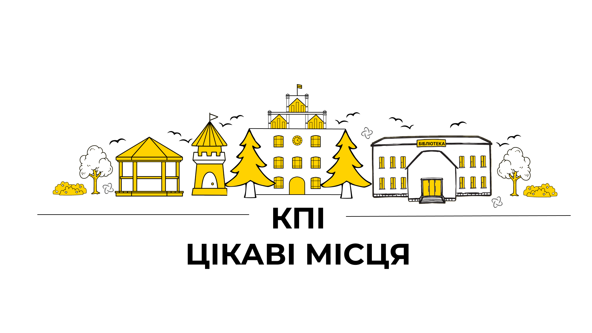
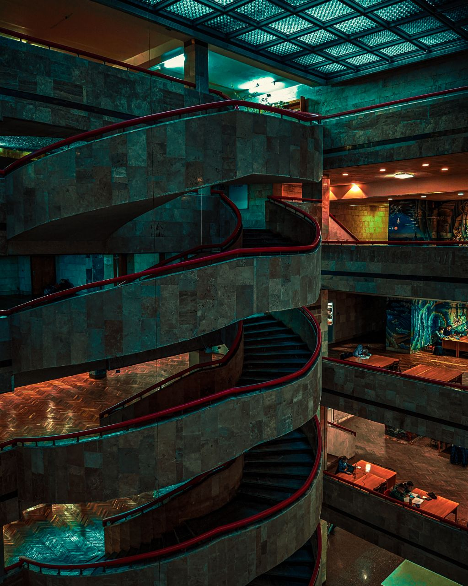
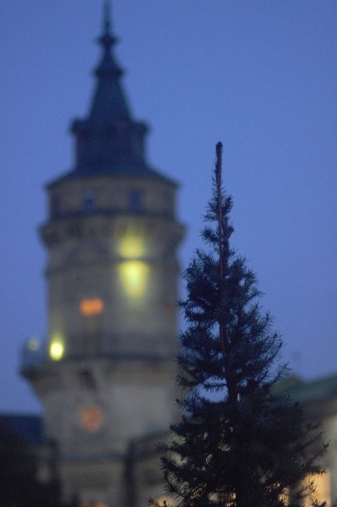
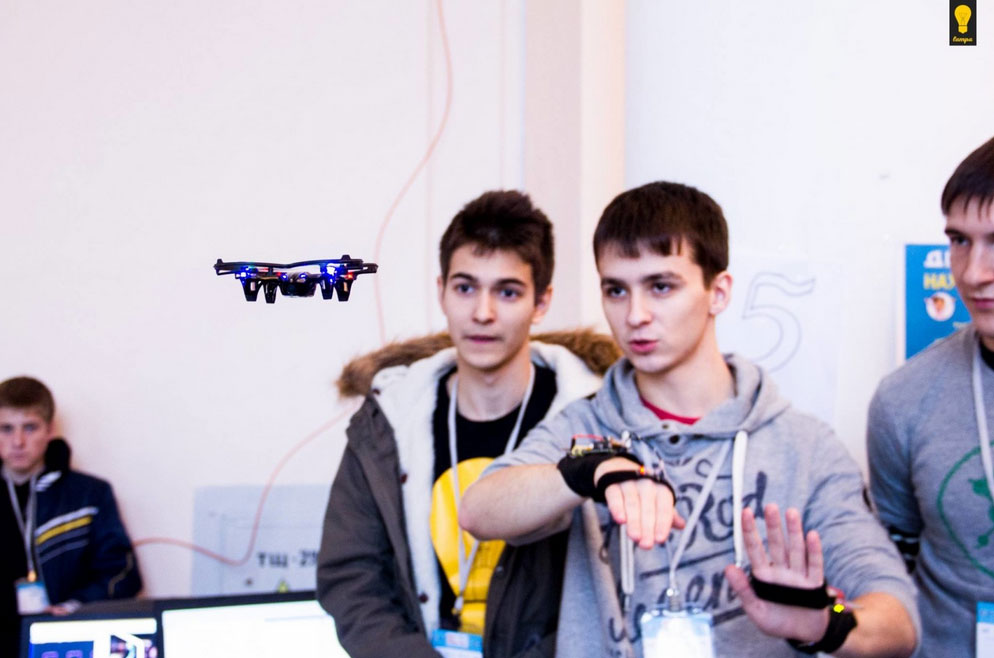
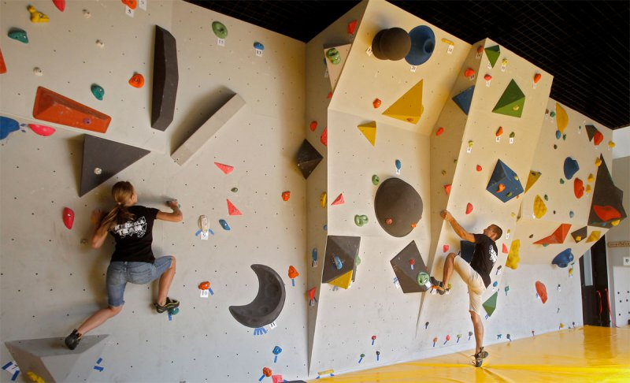
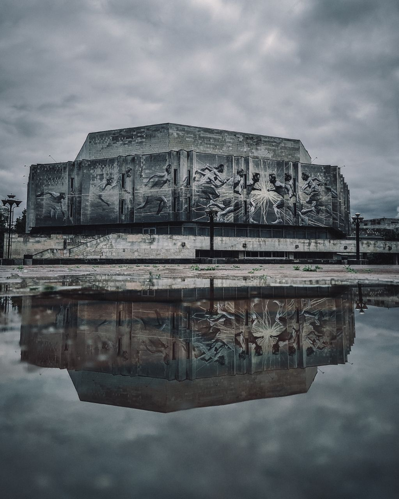
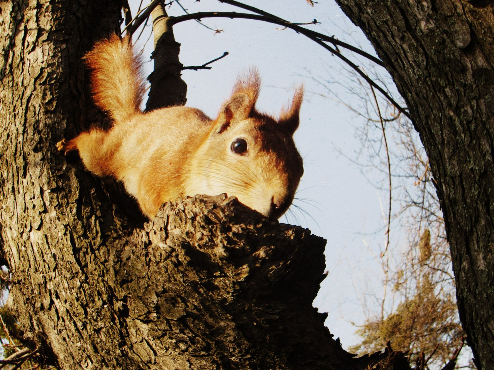
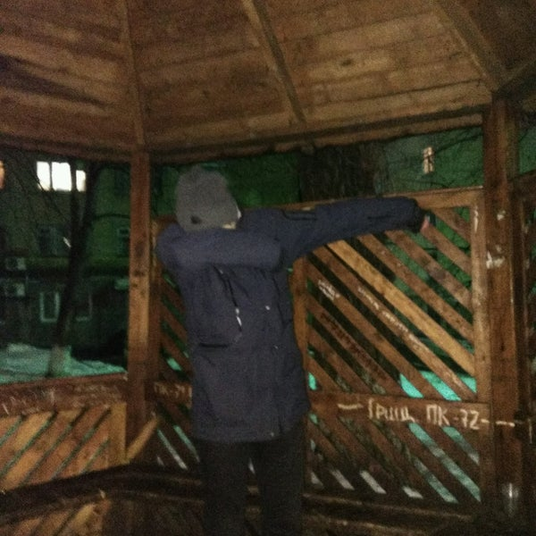
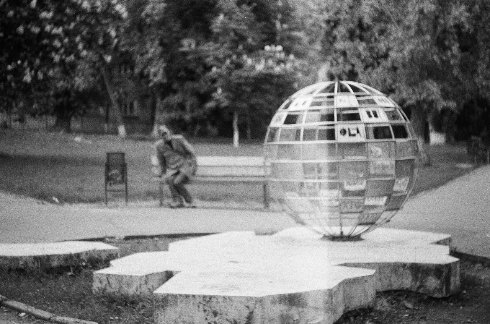

import MobileTOC from "../../../src/components/MobileTOC/MobileTOC.jsx";

<MobileTOC sections={[  
    { heading: "Бібліотека"},
    { heading: "Вежа"},
    { heading: "Lampa"},
    { heading: "КПІскала"},
    { heading: "Колізей"},
    { heading: "Смартукриття CLUST SPACE"},
    { heading: "Сквер «Сосновий»"},
    { heading: "Площа знань"},
    { heading: "Парк КПІ"},
    { heading: "Альтанки"},
    { heading: "Поляна"},
    { heading: "Мапа студмістечка КПІ"}
]}/>

Сусіди заважають робити лаби в гуртожитку?

Є грандіозний стартап, але ніде над ним працювати?

Хочеш відпочити душею та тілом?

На просторах КПІ є все й на всі випадки життя, тож тобі буде куди втекти.

<!--truncate-->

### Бібліотека

_Розташування: [просп. Перемоги 37](https://www.google.com/maps/place/Науково-технічна+бiблiотека+ім.+Г.І.+Денисенка/@50.4496039,30.4547019,17z/data=!4m5!3m4!1s0x40d4cc27dd6b8b6d:0xd1305aa5df55d493!8m2!3d50.4496039!4d30.4564391)._

Місце, де можна знайти не лише потрібну літературу, а й простір для роботи як в групі, так і наодинці. Відкритий Wi-Fi та доступні розетки допоможуть провести час у бібліотеці максимально продуктивно. А тиха атмосфера стане в пригоді під час підготовки до сесії.

*Телеграм-канал [бібліотеки](https://t.me/kpi_library).*

### Вежа

_Розташування: [просп. Берестейський, 37](https://www.google.com/maps/place/Арт-простір+%22Вежа+КПІ%22/@50.4492408,30.4606171,18z/data=!4m6!3m5!1s0x40d4ce82c46cd1e7:0xaa07357b8befecfb!8m2!3d50.4494553!4d30.4618667!16s%2Fg%2F1q5gkm7ng?entry=ttu) (вежа першого корпусу)._

Артпростір для всіх охочих. Тут проводять вечори акустичної музики, джеми, перегляди фільмів і організовують круті лекції.

*Телеграм-канал [Вежі](http://t.me/vezhakpi).*

### Lampa

_Розташування: [просп. Берестейський, 37](https://www.google.com/maps/place/Науково-технічна+бiблiотека+ім.+Г.І.+Денисенка/@50.4496039,30.4547019,17z/data=!4m6!3m5!1s0x40d4cc27dd6b8b6d:0xd1305aa5df55d493!8m2!3d50.4496233!4d30.456329!16s%2Fg%2F1ttq0mpr?entry=ttu) (Бібліотека КПІ)._

У цій відкритій лабораторії електроніки можна використовувати безоплатне обладнання, що надає поштовхи для навчання, досліджень і власних розробок.

*Телеграм-канал [Lampa](https://t.me/kpi_lampa).*

### КПІскала

_Розташування: [вул. Верхньоключова, 1/26](https://www.google.com/maps/place/Скалодром+КПИскала/@50.4428151,30.4491847,18z/data=!4m5!3m4!1s0x40d4cc20711d2759:0x2659456eaac75775!8m2!3d50.442562!4d30.4495418) (спорткомплекс КПІ)._

Для тих, хто хоче досягнути нових висот, на території університету є безкоштовний скалодром. Якщо ти новачок, не хвилюйся: завжди можна знайти тренера, який допоможе та підстрахує.

*Телеграм-чат [КПІскали](http://t.me/kpiclimbing_chat).*

### Колізей

_Розташування: [вул. Політехнічна, 35](https://www.google.com/maps/place/Колізей+КПІ/@50.4468914,30.4623081,18z/data=!4m6!3m5!1s0x40d4ce9cc2317e59:0x2aca04be7f6b8a99!8m2!3d50.4470257!4d30.4623913!16s%2Fg%2F11c61rt21w?entry=ttu)._

З Колізеєм асоціюються незабутні вечори кіно й аматорські концерти. Також тут є атмосферний музикальний майданчик просто неба.

*Телеграм-канал [Колізею](https://t.me/colosseum_kpi).*

### Смартукриття CLUST SPACE

_Розташування: [просп. Берестейський, 37](https://www.google.com/maps/place/Науково-технічна+бiблiотека+ім.+Г.І.+Денисенка/@50.4496039,30.4547019,17z/data=!4m6!3m5!1s0x40d4cc27dd6b8b6d:0xd1305aa5df55d493!8m2!3d50.4496233!4d30.456329!16s%2Fg%2F1ttq0mpr?entry=ttu) (Бібліотека КПІ)._

Унікальний проєкт, який поєднує в собі укриття та сучасний коворкінг. Забезпечує безперервний освітній процес під час війни, а також є платформою для зустрічей талановитої молоді з бізнесом.

Простір відкритий у години роботи бібліотеки: понеділок-пʼятниця, з 9:00 до 17:30.

### Сквер «Сосновий»

_Розташування: [просп. Перемоги 37](https://goo.gl/maps/kW7wfZfcV36Ph4PUA)._

З назви зрозуміло, що цей сквер відомий приємною свіжістю та ароматом сосон. А в їхніх тінях є багато лавок, де можна добре провести час навіть у спекотні літні дні.

### Площа знань

_Розташування: [просп. Перемоги 37](https://goo.gl/maps/kW7wfZfcV36Ph4PUA) (навпроти бібліотеки)._

Саме тут ти відчуєш енергію від нового етапу в житті на Дні першокурсника.

### Парк КПІ

_Розташування: [просп. Берестейський ](https://goo.gl/maps/xZ7EBjMUyM1QccnH8) (навпроти 1 корпусу)._

Величезна територія дозволяє відпочити від міського шуму й насолодитися прогулянками по затишних стежках та зелених галявинах. І не треба володіти неймовірною удачою, аби зустріти символів парку — білочок, що перебігають із дерева на дерево.

На відміну від Площі Знань, тут відбувається вже основна частина Дня першокурсника, де можна буде поспілкуватися зі своїми одногрупниками та ІПСАшниками в неформальній обстановці.

### Альтанки

_Розташування: [вул. Михайла Брайчевського, 3](https://goo.gl/maps/Kdr8311BPJru5UWV9) (за 7 гуртожитком)._

Це місце стало затишним куточком для розмов і дружніх зустрічей. Багато студентів навіть приносять гітари й створюють незабутню гармонію музики.

### Поляна

_Розташування: [Вул. Політехнічна](https://goo.gl/maps/5KGqbMRmBpg4ZkjbA)._

Нарешті дійшли до найцікавішого. Поляна («Сквер ім. Олени Теліги») — це особливе місце на території КПІ, що відоме не тільки постійними зустрічами студентів на вихідних, але й великою сферою посередині. Вона неодноразово відкріплявся від свого місця й хотіла втекти в невідомому напрямку, залишаючи студентів із цікавими здогадками про його місцезнаходження.

### Мапа студмістечка КПІ

До вашої уваги витвір дизайнерського мистецтва!

Ходять легенди, що якщо пройти весь маршрут від метро до поляни, то можна знайти скарб! Отож, скоріше виходь із сірої та депресивної домівки та відправляйся назустріч невідомому! (хоча ти прочитав статтю, тому ці місця не такі вже й невідомі)

