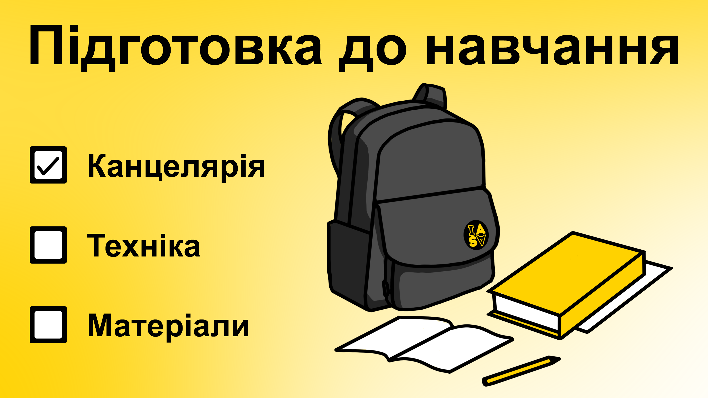
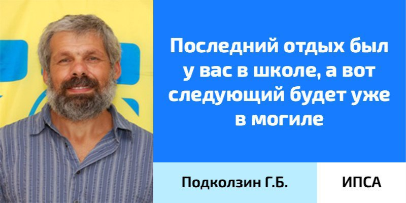

НМТ складено, спеціальність обрано – саме час подбати про майбутнє навчання. У цій статті ми зібрали все, що тобі варто мати з собою, аби перші дні на ІПСА розпочалися вдало.

<!--truncate-->

### Канцелярія

Перед початком навчального року слід запастися необхідною канцелярією та зошитами, щоб конспекти були не лише естетичними, а й зручними. В університеті все поділяється на лекції та практичні/лабораторні/семінари, тому радимо знайти для себе найкомфортніший спосіб вести записи, щоб він був швидким і зрозумілим саме тобі.

Надаємо умовний набір першачка:

+ 8 зошитів на 96 аркушів у клітинку (краще А4) для  математичного аналізу, лінійної алгебри та аналітичної геометрії, дискретної математики, фізики.

+ Зошит-чернетку для власних записів й аркушів, на яких ти будеш писати тести, самостійні та контрольні роботи (такі листочки завжди у дефіциті на парах).

+ Ручки, ручки, ручки. Багато ручок.

Більшість викладачів дозволяють ведення електронних конспектів, тому рекомендуємо такі програми для користувачів iPad і гаджетів інших компаній відповідно:

+ GoodNotes5, Pages, Penbook.

+ Samsung Notes, Penly, OneNote, Google Keep.

### Ноутбук

Оскільки під час навчання доведеться неодноразово захищати лабораторні та курсові роботи, бажано мати власний ноутбук. Звісно, можна ділити його з кимось, але в реальності досить складно буде використовувати один пристрій на декількох осіб.

Отже, якщо ухвалено рішення здійснити інвестицію в комфортне навчання, обирай виробника та модель на свій смак, але рекомендуємо звернути увагу на наші поради.

+ ROM: SSD або HDD 512+ GB.

+ RAM: 16+ GB DDR4.

+ Display: IPS або OLED.

+ CPU: коли вибираєш Intel — core i5 10 покоління й новіше, Ryzen — мінімум 5 4000 покоління. Додамо, що зазвичай процесори Intel є дещо менш енергоефективними.

+ OS

  + Windows / Linux подекуди виграє через наявність або можливість встановлення необхідного програмного забезпечення.

  + Якщо ти користувач MacOS, то проблеми можуть виникнути лише з окремими додатками, для яких завжди знайдеться альтернатива. Викладачі зазвичай ставляться із розумінням.

Наголошуємо, що навчатися та виконувати лабораторні роботи можна на менш потужному ноутбуці — наведені характеристики є лише рекомендаціями.

### Знання

Вже зараз ти можеш полегшити собі життя для майбутнього та провести час із користю і підготовкою до нового етапу разом з ІПСА.

#### Вчи, синку, матчастину:

- Таблицю множення.

- Комплексні числа.

- Вектори.

- Тригонометрію.

- Арифметичні дії з дійсними числами.

- Квадратні рівняння.

- Дільники та кратні. Розклад числа на прості множники.

- Комбінаторику.

- Похідні та первісні.

#### Перші кроки у світ програмування:

+ Розуміння загальних ідей — [Youtube](https://youtube.com/playlist?list=PLhQjrBD2T380F_inVRXMIHCqLaNUd7bN4), [Edx course](https://www.edx.org/course/introduction-computer-science-harvardx-cs50x).

+ Здобути скіл алгоритмічного мислення: [Grokking algorithms](https://edu.anarcho-copy.org/Algorithm/grokking-algorithms-illustrated-programmers-curious.pdf).

Вищеперерахованого задосить, аби спростити собі життя на старті. Для охочих якнайшвидше залізти в [цукрове](https://uk.wikipedia.org/wiki/%D0%A1%D0%B8%D0%BD%D1%82%D0%B0%D0%BA%D1%81%D0%B8%D1%87%D0%BD%D0%B8%D0%B9_%D1%86%D1%83%D0%BA%D0%BE%D1%80) пекло плюсів: 

+ [З чого почати?](https://code.visualstudio.com/docs/languages/cpp)

+ [C++ Tutorial for Beginners](https://www.youtube.com/watch?v=vLnPwxZdW4Y).

+ [C++ Full course for Beginners](https://www.youtube.com/watch?v=GQp1zzTwrIg) (10 годин).

+ [Курс на Coursera](https://www.coursera.org/programs/igor-sikorsky-kyiv-polytechnic-institute-on-coursera-1uynq/specializations/coding-for-everyone).

+ [FreeCodeCamp](https://www.freecodecamp.org/).

Навіть найкрутішому програмісту рано чи пізно доведеться зіштовхнутися з фінальним боссом: Microsoft Word (чи Google Документи). Усі протоколи та курсові, уся текстова частина пишеться у ньому, тому дуже радимо розібратися хоча б у базових налаштуваннях цього застосунку. Ці знання дуже допоможуть тобі у збереженні вільного часу та нервових клітин.

### Накопичуємо ману

Нішеві варіанти відпочинку!

+ Зробити огляд на свою родину в [IASA ABIT flood](https://t.me/abitiasa_flood).

+ На хвилі виходу «Одіссеї» подивитися всі фільми Крістофера Нолана. 

+ Загубитися в Рівному (класика – 100).

+ Поспати (наступного разу це вийде не скоро).

+ Але найважливіша порада — насолодися вільним життям та дитинством.

**Проведи останні місяці канікул із користю!**

