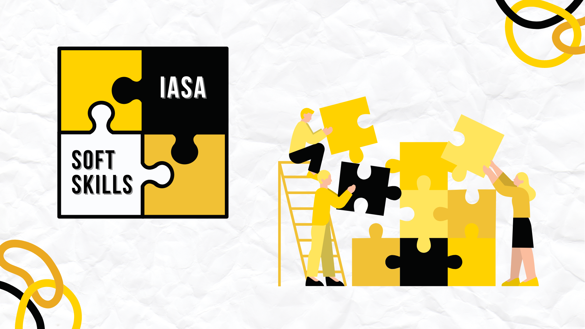
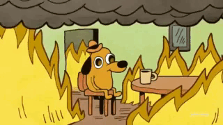
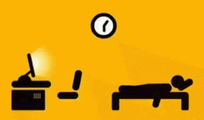
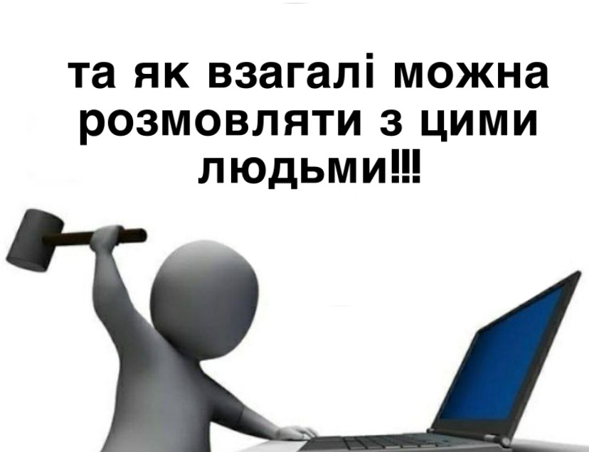
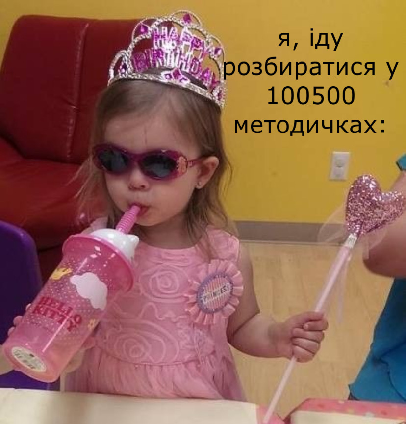
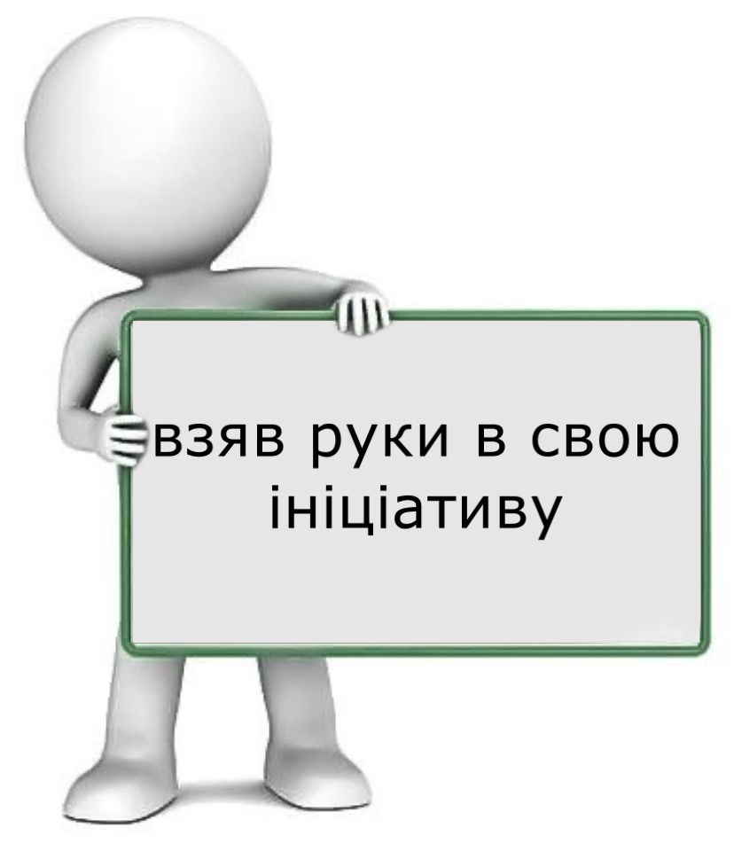

Розмовляючи з незнайомою людиною, відчуваєш неконтрольоване хвилювання і говориш незрозумілими обривками слів замість повноцінних речень? Кожного разу тривожність захоплює думки, коли доводиться виступати перед публікою? Маєш задатки лідера, але навіть не підозрюєш про це?

Маємо чудову новину! ІПСА допоможе подивитися на себе зі сторони та здолати невпевненість у своїх силах. Твоєю непохитною зброєю в боротьбі з розрахунковими й курсовими роботами, заліками та екзаменами стануть набуті з часом навички та знання.

<!--truncate-->

Встиг зрадіти? Що ж… Приємні відкриття не закінчилися! Ніхто не залишить тебе посеред моря, доки не навчишся вміло плавати. Занурення в студентське життя ІПСА відбувається поступово та з допомогою викладачів і студентів. Навіть якщо ти впевнений, що володієш усіма необхідними вміннями, практика все одно зайвою не буде.

### Стресостійкість

Нескінченна послідовність контрольних та лабораторних робіт, заліків й іспитів гартують студента. Ти отримуєш неоціненні досвід та навички, що стануть у пригоді в майбутньому. Саме так, ми маємо на увазі самоконтроль і здатність ухвалювати зважені рішення у випадках, що потребують швидких дій. Ці вміння стануть надійною опорою при подоланні викликів дорослого життя.

### Тайм-менеджмент

Після першого навчального тижня ти, можливо, і не поринеш на повну в шалений ритм студентського життя, але з плином часу будеш усе більше відчувати навантаження, поєднане зі спокусливим бажанням відкласти все на потім і відірватись як слід. Аж ось уже середина грудня, на твої плечі звалюється купа «хвостів», незахищених розрахункових та лабораторних робіт. Перспектива не дуже, еге ж? Щоб запобігти цьому, встигни набути навички тайм-менеджменту у вересні чи хоча би ближче до першої сесії (*прим. ред.* Редактуру статті було завершено після дедлайну о четвертій годині ранку).

### Спілкування, або вихід із зони комфорту

Зі вступом до університету в тебе починається новий етап у житті: ти потрапляєш у колоритну, зібрану з різних куточків України спільноту людей, де кожен має власні вподобання та бачення світу. Насамперед познайомишся з одногрупниками — тими, з ким провчишся незабутні 4 роки, складаючи пекельні іспити та насолоджуючись райським нектаром на Поляні. Ми, звісно ж, рекомендуємо підтримувати дружні взаємини з іншими студентами, бо це основний спосіб обмінюватися досвідом, ідеями, допомагати одне одному. Навіть якщо ти інтроверт, то не переймайся, соціалізація не пройде й повз тебе. Особливо враховуючи безліч крутих заходів, що проводить наша Студрада для підтримки дружньої атмосфери.

Окрім неформальних бесід, в ІПСА ти розвинеш навички ділового спілкування, що стануть у пригоді на кар’єрному шляху, поспілкуєшся з десятками талановитих людей і, може, разом з кимось із нових друзів запустиш успішний стартап.

### Робота в команді

Протягом навчання тобі часто доведеться працювати в команді: чи то під час роботи над груповими проєктами, чи то задля колективного вирішення контрольних. Дійсно, багато викладачів практикують розділення студентів на «бригади» для виконання об’ємних завдань, а в моменти пошуку палі та відповідей на тести зміцнення взаємин між одногрупниками гарантоване. Ці канонічні події розвивають вміння здобувачів освіти ефективно взаємодіяти одне з одним.

Ба більше, Студрада проводить багато різноманітних івентів для першокурсників, аби їхнє зближення проходило природно у веселих, неофіційних обставинах. 

### Самонавчання

Якщо пропустити лекцію чи практичне заняття, то доведеться, жертвуючи вільним часом, надолужувати вагомий обсяг матеріалу. Від нього, своєю чергою, може залежати правильність виконання домашніх завдань, розрахункових і лабораторних робіт.

Проте людей зі стовідсотковою відвідуваністю можна перелічити на пальцях однієї руки (особливо під час дистанційного навчання), а тому самонавчання буде однією з гарантій успіху в здобутті вищої освіти. 

Також варто зазначити, що ця навичка є корисною для пошуку роботи і перевагою в резюме: рекрутер/ка точно надасть плюсик у карму, якщо ти здатен швидко опановувати новітні технології.

### Лідерські якості

Завжди хотів стати босом, проявляти ініціативу, брати на себе відповідальність? Є кілька способів реалізувати свої амбіції. Наприклад, можеш податися на посаду старости та стати представником групи, захищати її інтереси, а також презентувати на весь інститут. Або ж можеш стати частиною серця ІПСА — Студради. Наша команда завжди рада новим людям, які мають мотивацію та бажання працювати. Про це можете докладніше дізнатися в інших статтях Абіт-відділу.

### Підіб’ємо підсумки

Зі вступом у ЗВО починається твій повноцінний вихід у суспільство, де немає «дорослих», які розвʼяжуть будь-яку проблему без твого втручання. Поступово дорослішаєш сам, набуваєш переваг у вигляді софт-скілів, і вчишся, як правильно поводитись у тій чи іншій ситуації, передбачаючи можливі наслідки. Не дарма більшість ІПСАшників відзначають, що основну роль у їхньому становленні відіграв саме період навчання в нашому інституті.

**Пам’ятай: сюди всі приходять рівними, а ось ким виходять — залежить лише від них самих. Учися, наважуйся й живи на повну!**