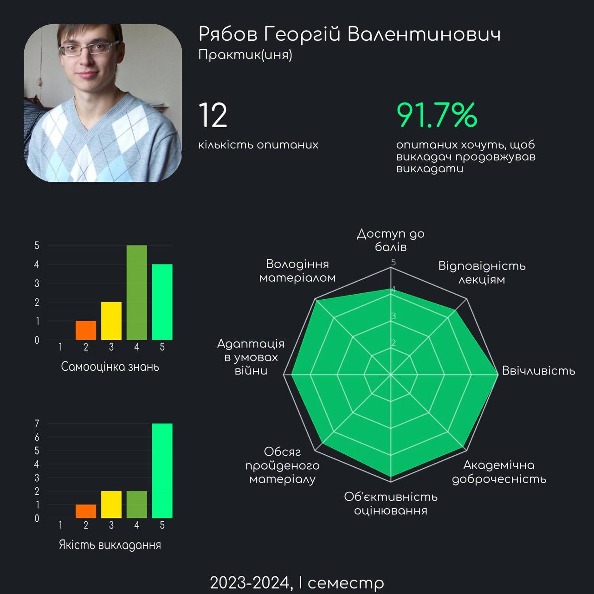
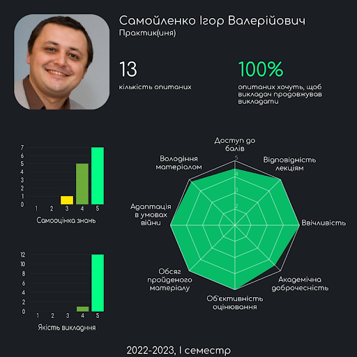
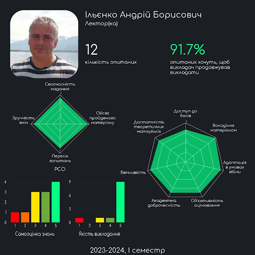
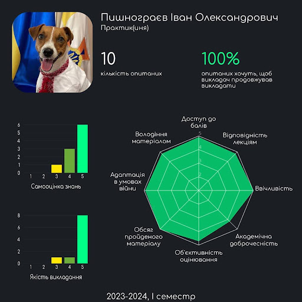

> _«Not the faculty but His Excellency the General can properly determine the sum of two and two»._

_Hermann Hesse_

<!--truncate-->

Дисклеймер №1: для кожної дисципліни вказано ймовірних викладачів, тому зважайте на можливі зміни їхнього розподілу на катедрах.

Дисклеймер №2: усі описи й інфографіки сформовані в результаті опитування студентів і випускників. Докладніше на [IASA Analytics](https://t.me/iasa_analytics).

Дисклеймер № 3: освітні програми актуалізовано, нововведені дисципліни позначено зірочкою.

Нотатки авторів: Нижче наведено road map освітніх програм (наполегливо рекомендуємо їх переглянути). Далі все як у людей: просто гортай вниз. Одразу після опису предмета ознайомся з ймовірними викладачами (конче треба, правда).

---

## Предмети, які є спільними для всіх катедр

## 1 курс

### Алгоритми та структури даних

**Викладачі:**

Традиційний стак:

+ ММСА: [Селін Ю.М.](#селін-юрій-миколайович), [Севастьянов В. В.](#севастьянов-володимир-володимирович)

+ ШІ: [Малишевський О.Г.](#малишевський-олексій-григорович), [Куб'юк Є.Ю.](#кубюк-євген-юрійович), [Касьянчук І.В.](#касьянчук-ігор-вячеславович)

+ СП: [Клещ К.О.](#клещ-кирило-олегович), [Яковчук О.К.](#яковчук-олег-костянтинович)

**Про що предмет:**

+ Ефективність і дизайн алгоритмів.

+ Розгляд найпростіших структур даних: стек, черга, зв'язні списки, дерева, купа, черга з пріоритетом і хеш-таблиця.

+ Алгоритми сортування: вставка, обмін, вибір, злиття, купа.

+ Алгоритми пошуку: лінійний, бінарний, тернарний, інтерполяція, золотий перетин.

+ Рекуренції, дерева пошуку. Динамічне програмування й алгоритми (жадібні, паралельні, на графах).

**Особливості викладання:** Найкращий курс АСД на катедрі СП. Попри низьку якість проведення пар на ШІ, матеріал усе ще на рівні. На 124, вважай, цього предмету не існує: він викладається цілий семестр, упродовж якого достатньо виконати 4 лабораторні.

**Приклади застосування:** Алгоритми та структури даних є основою розробки програмного забезпечення. Вони використовуються для розв'язання задач сортування, пошуку, оптимізації, обробки даних і створення графічного інтерфейсу користувача.

### Дискретна математика

**Викладачі:**

Цьогорічний стак:

+ ММСА: [Спекторський І.Я.](#спекторський-ігор-якович), [Статкевич В.М.](#статкевич-віталій-михайлович)

+ ШІ: [Стусь О.В.](#стусь-олександр-вікторович)

+ СП: [Статкевич В.М.](#статкевич-віталій-михайлович)

Можливий розвиток подій: [Моклячук О.М.](#моклячук-олександр-михайлович)

**Про що предмет:**

+ Алгебра висловлювань.

+ Множини, їхні властивості й операції над ними.

+ Графи: множини з'єднаних ребрами вершин.

+ Комбінаторика: перестановки, комбінації, розміщення, які виникають у задачах лічби та вибірки.

+ Відношення: зв'язок між елементами двох множин. Можуть бути представлені за допомогою множини пар, матриці або графа.

+ Групи та кільця: множини разом з операціями над ними. Для груп це додавання, для кілець — додавання та множення.

**Особливості викладання:** Мабуть, найпростіша з математичних дисциплін першого курсу. На 122 спеціальності її вивчають один семестр, а от на 124 вона має продовження в предметі "Теорія графів та структурованих моделей" задля більш поглибленого опрацювання деяких тем.

**Приклади застосування:** Дискретна математика є основою для розробки алгоритмів, структур даних і комп'ютерних систем. Також використовується для аналізу пропускної здатності, ефективності та безпеки мереж.

### Лінійна алгебра та аналітична геометрія

**Викладачі:**

Цьогорічний стак:

+ ММСА: [Подколзін Г.Б.](#подколзін-гліб-борисович), [Мальцев А.Ю.](#мальцев-антон-юрійович)

+ ШІ: [Сисак К.Я.](#сисак-катерина-ярославівна), [Мінарченко О.М.](#мінарченко-олександр-миколайович)

+ СП: [Бохонов Ю.Є.](#бохонов-юрій-євгенович), [Мінарченко О.М.](#мінарченко-олександр-миколайович)

**Про що предмет:**

+ Аналітична геометрія: представлення геометричних об'єктів (точок, ліній та фігур) за допомогою рівнянь і формул (опис залежностей координат), що дає змогу використовувати алгебраїчні методи для розв'язання геометричних задач.

+ Лінійні, унітарні й евклідові простори: множини будь-яких елементів та операцій, що є розширенням до вже відомих зі школи дій над векторами: додавання, множення на константу, скалярне множення (унітарні) та модуль (евклідові).

+ Матриці: таблиці / масиви чисел. Матриці лінійних операторів — функції над об'єктами вищеописаних просторів зі збереженням їхніх властивостей у множині значень.

**Особливості викладання:** «It is my experience that proofs involving matrices can be shortened by 50 if one throws the matrices out», — Еміль Артін. На обох спеціальностях предмет викладають упродовж першого курсу, завершується складанням іспиту в другому семестрі.

**Приклади застосування:** Лінійна алгебра є основою багатьох алгоритмів машинного навчання (робот-андроїд, штучний інтелект): лінійна регресія, метод головних компонент, метод опорних векторів та інші. Використовується для обчислення векторних операцій, знаходження оптимальних рішень і моделювання даних.

### Математичний аналіз

**Викладачі:**

Цьогорічний стак:

+ ММСА: [Чаповський Ю.А.](#чаповський-юрій-аркадійович), [Попова Н.Д.](#попова-наталія-дмитрівна), [Мальцев А.Ю.](#мальцев-антон-юрійович)

+ ШІ: [Рябов Г.В.](#рябов-георгій-валентинович), [Зеленська І.О.](#зеленська-ірина-олександрівна)

+ СП: [Бохонов Ю.Є.](#бохонов-юрій-євгенович), [Зеленська І.О.](#зеленська-ірина-олександрівна)

Можливий розвиток подій: [Денисьєвський М.О.](#денисьєвський-микола-олексійович), [Мінарченко О.М.](#мінарченко-олександр-миколайович), [Руденко О.В.](#руденко-олексій-володимирович), [Подколзін Г.Б.](#подколзін-гліб-борисович), [Юсипів Т.В.](#юсипів-тарас-васильович), [Номіровський Д.А.](#номіровський-дмитро-анатолійович), [Семенов В.В.](#семенов-володимир-вікторович)

Про що предмет:

+ Диференціальний аналіз: вивчення та застосування похідних.

+ Інтегральний аналіз: розгляд визначених, невизначених і інших варіацій інтегралів, їхнє застосування.

+ Послідовності: числові та функціональні, обчислення границь (лімітів).

+ Ряди: числові й функціональні нескінченні суми.

+ Диференціальні рівняння: звичайне рівняння, яке містить похідні та передбачає пошук функції, а не числа.

+ Комплексний аналіз: розгляд функцій комплексної змінної, де i^2 = -1.

**Особливості викладання:** Фундаментальність дисципліни передбачає відповідну вимогливість викладачів. Системні аналітики вивчають предмет упродовж чотирьох семестрів, спеціалісти 122 ШІ опрацьовують матеріал швидше, адже до нього додаються деякі теми функціонального аналізу, що на 124 є окремим предметом. Студенти 122 СП, зі свого боку, обмежуються трьома семестрами. На обох спеціальностях кожне півріччя навчання завершується складанням іспиту.

**Приклади застосування:** Диференціальне числення активно використовується в моделюванні фінансових ринків, управлінні ризиками й економічних процесах. Ряд Тейлора забезпечує обчислення ірраціональних виразів із будь-якою точністю. Перетворення Фур'є застосовується для аналізу й обробки зображень, надає змогу виявляти просторові частоти, фільтрувати шум, знаходити ребра та границі, виконувати компресію зображень і інші операції. Більше прикладів за [посиланням](https://www.google.com.ua).

### Математична логіка та теорія алгоритмів

**Викладачі:**

Традиційний стак:

+ ММСА: [Спекторський І.Я.](#спекторський-ігор-якович), [Статкевич В.М.](#статкевич-віталій-михайлович)

+ ШІ: [Стусь О.В.](#стусь-олександр-вікторович)

+ СП: [Статкевич В.М.](#статкевич-віталій-михайлович)

**Про що предмет:**

+ Абстрактні алгоритмічні машини: моделі теоретичних комп'ютерів, що не претендують на відповідність справжнім комп'ютерам або технічним реаліям, зосереджуються на моделюванні основних можливостей обчислень. Розглядаються машина Тюрінга, нормальний алгоритм Маркова та блок-схема Поста.

+ Рекурсивні функції: представлення будь-яких функцій за допомогою композиції та [рекурсії базових функцій](https://uk.wikipedia.org/wiki/%D0%A0%D0%B5%D0%BA%D1%83%D1%80%D1%81%D0%B8%D0%B2%D0%BD%D1%96_%D1%84%D1%83%D0%BD%D0%BA%D1%86%D1%96%D1%97).

+ Формальні граматики: математичний інструмент для опису структури мови. Визначає правила, за якими можна утворити коректні вирази, речення або текст із множини символів. Допомагають описувати мови програмування, обробки даних і інші мовні конструкції.

+ Абстрактні автомати: інструмент дуже схожий на алгоритмічні машини. Використовується для моделювання роботи програм у комп'ютерах, процесах у природних системах тощо. Допомагають вивчати як системи взаємодіють із навколишнім середовищем, як вони реагують на різні вхідні сигнали.

**Особливості викладання:** На обох спеціальностях предмет вивчають протягом одного семестру.

**Приклади застосування:** У математичній логіці розвиваються формальні методи для представлення знань, розв'язання проблем і прийняття рішень у штучному інтелекті. Застосовується для формалізації логічного мислення, побудови експертних систем, моделювання розумових процесів і розв'язання складних завдань машинного навчання.

### Програмування

**Викладачі:**

Традиційний стак:

+ ММСА: [Назарчук І.В.](#назарчук-ірина-василівна), [Просянкіна-Жарова Т.І.](#просянкіна-жарова-тетяна-іванівна), [Савченко І.О.](#савченко-ілля-олександрович), [Селін Ю. М.](#селін-юрій-миколайович), [Канцедал Г.О.](#канцедал-георгій-олегович)

+ ШІ: [Романов В.В.](#романов-валерій-володимирович), [Безносик О.В.](#безносик-олександр-юрійович), [Просянкіна-Жарова Т.І.](#просянкіна-жарова-тетяна-іванівна)

+ СП: [Романов В.В.](#романов-валерій-володимирович), [Безносик О.В.](#безносик-олександр-юрійович), [Просянкіна-Жарова Т.І.](#просянкіна-жарова-тетяна-іванівна)

**Про що предмет:**

+ Базові ідеї програмування.

+ Синтаксис мов С / С++ і основні конструкції: масиви, функції, вказівники, структури даних, робота з пам'яттю, рекурсія та графічні можливості.

+ Створення й використання бібліотек.

+ Введення в об'єктно-орієнтоване програмування.

**Особливості викладання:** На 124 програмування вивчається більш поверхнево в порівнянні зі 122. У першому семестрі системні аналітики пишуть екзамен із цього предмету (у Комп'ютерних наук — залік). У другому півріччі студенти складають залік і пишуть курсову роботу незалежно від спеціальності.

### Фізика

**Викладачі:**

Традиційний стак:

+ ММСА: [Снарський А.О.](#снарський-андрій-олександрович), [Федотов В.В.](#федотов-вячеслав-віталійович)

+ ШІ: [Калита В.М.](#калита-віктор-михайлович), [Гусєва Ю.І.](#гусєва-юлія-ігорівна), [Іванова І.М.](#іванова-ірина-михайлівна)

+ СП: [Калита В.М.](#калита-віктор-михайлович), [Іванова І.М.](#гусєва-юлія-ігорівна), [Гусєва Ю.І.](#іванова-ірина-михайлівна)

**Про що предмет:**

+ Основні закони руху і збереження в механіці.

+ Стаціонарний електричний струм, рівняння електромагнітного поля.

+ Механічні, електромагнітні коливання та хвилі.

**Особливості викладання:** Не основний предмет — вимоги викладачів відповідні. Уряди-годи важко закрити без докладання зусиль (привіт лабораторним на 122). У будь-якому разі хоронити себе за браком шкільної бази не варто: навчання починається майже з нуля.

## 2 курс

### Об'єктно-орієнтоване програмування

**Викладачі:**

Можливий розвиток подій:

+ ММСА: [Куєвда Ю.В.](#куєвда-юлія-валеріївна), [Древаль М.М.](#древаль-максим-михайлович)

+ ШІ: [Пишнограєв І.О.](#пишнограєв-іван-олександрович), [Бендюг В.І.](#бендюг-владислав-іванович)

+ СП: [Булах Б.В.](#булах-богдан-вікторович), [Мироненко С.С.](#мироненко-сергій-сергійович)

**Про що предмет:**

+ Базові принципи об'єктно-орієнтованого й узагальненого програмування, їхня реалізація засобами мови C++ або Java.

+ Розгляд основних аспектів розробки програмних застосунків.

**Особливості викладання:** Предмет вирізняється порівняно молодими викладачами, що зазвичай тягне за собою актуальні матеріали й адекватне ставлення до студентів. Завершивши вивчення, студенти катедри СП пишуть курсову роботу.

### Теорія ймовірностей і математична статистика

**Викладачі:**

Можливий розвиток подій:

+ ММСА: [Василик О.І.](#василик-ольга-іванівна), [Самойленко І.В.](#самойленко-ігор-валерійович), [Стусь О. В.](#стусь-олександр-вікторович), Ніщенко І.І., Навроцький Д.О., [Каніовська І.Ю.](#каніовська-ірина-юріївна),

+ ШІ: [Ільєнко А.Б.](#ільєнко-андрій-борисович), [Павленков В.В.](#павленков-володимир-володимирович), [Голіченко І.І.](#голіченко-ірина-ігорівна)

+ СП: [Боднарчук С.В.](#боднарчук-семен-володимирович)

**Про що предмет:**

+ Основи теорії ймовірностей: формалізація шкільних знань.

+ Випадкові величини (результати випадкових експериментів, значення та ймовірності їхніх результатів), вектори, функції від них.

+ Граничні теореми: закон великих чисел, центральна гранична теорема, збіжність послідовності випадкових величин, її види.

+ Точкові статистичні оцінки: приблизне числове значення невідомого параметра сукупності на основі вибірки.

+ Довірчі інтервали: те ж оцінювання, проте з урахуванням точності результату.

+ Перевірка статистичних гіпотез.

**Особливості викладання:** Базова дисципліна аналізу даних, проте годин на неї виділяють мало: на 124 і 122 ШІ два семестри в середньому по 3 год на тиждень, 122 СП балує одним семестром по 4 години. Будьте готові до додаткових пар і великої кількості домашнього завдання. Курс теорії ймовірностей для обох спеціальностей завершується складанням іспиту.

**Приклади застосування:** Математична статистика забезпечує розробку статистичних методів навчання: дерев рішень, лінійної та логістичної регресії. Дає змогу оцінити параметри моделі, провести перевірку гіпотез, виявити статистичну значущість та виконати вибір моделі.

## Предмети ММСА

## 1 курс

### Теорія графів і структуровані моделі

**Викладачі:** дисципліна нова, тому цьогорічний стак – справжній кіт у мішку.

**Про що предмет:**

+ Основи теорії графів: вершини, ребра, ізоморфізм графів, степені вершин.

+ Типи графів: орієнтовані й неорієнтовані, зважені та незважені, дерева, планарні графи.

+ Алгоритми на графах: пошук у глибину та ширину, знаходження найкоротших шляхів, побудова остовних дерев, максимальні потоки.

+ Структуровані моделі: способи представлення складних систем (схеми, блок-діаграми, мережеві моделі).

+ Використання графових і структурних моделей для аналізу, прогнозування та управління складними системами.

**Особливості викладання:** Курс належить до циклу професійної підготовки. Вивчається один семестр, підсумковий контроль — залік. Має практичну спрямованість: студенти працюватимуть із задачами на побудову графів, аналіз їхніх властивостей, розв’язання оптимізаційних задач, моделювання систем за допомогою структурованих моделей.

**Приклади застосування:** У транспорті та логістиці теорія графів дає змогу моделювати й оптимізувати маршрути перевезень і ланцюги постачання. Аналіз соціальних мереж як графових структур уможливлює виявлення центрів впливу та дослідження закономірностей поширення інформації. Стабільність глобального інтернету безпосередньо залежить від архітектури, яку проєктують і оптимізують за допомогою відповідних алгоритмів. У корпоративному управлінні цей математичний апарат застосовують для візуалізації й аналізу організаційних структур, ієрархічних зв’язків та бізнес-процесів.

## 2 курс

### Диференціальні рівняння

**Викладачі:** 

Можливий розвиток подій: 

+ [Капустян О. В.](#капустян-олексій-володимирович), [Юсипів Т.В.](#юсипів-тарас-васильович), [Зеленська І. О.](#зеленська-ірина-олександрівна)

**Про що предмет:**

+ Диференціальні рівняння першого (винятково перша похідна) та вищих порядків.

+ Вступ до систем диференціальних рівнянь.

**Приклади застосування:** Диференційні рівняння є фундаментальним інструментом для моделювання динамічних процесів у різних галузях. Так, в економіці вони слугують основою для фінансових моделей, що дають змогу прогнозувати зміну цін, динаміку інвестицій чи процентних ставок. В інженерії та ІТ їх застосовують для оптимізації систем керування, а також для передбачення руху робототехнічних комплексів й автономних пристроїв.

### Архітектура обчислювальних систем і операційні системи

**Викладачі:** дисципліна нова, тому цьогорічний стак - справжній кіт у мішку.

Можливий розвиток подій: 

+ [Артюхов В.Г.](#артюхов-віталій-григорович), [Гіоргізова-Гай В.Ш.](#гіоргізова-гай-вікторія-шалвівна), [Коваленко А.Є.](#коваленко-анатолій-єпіфанович)

**Про що предмет:**

+ Основи архітектури комп’ютерів: структура й організація апаратного забезпечення, принципи роботи процесорів, шин і контролерів.

+ Пам'ять: ієрархія пам'яті, кеш-пам'ять, оперативна пам'ять, зовнішня пам'ять.

+ Мережі й розподілені системи: базові принципи комп’ютерних мереж, розподілених обчислень, кластерних і хмарних технологій.

+ Принципи операційних систем: побудова й архітектура ОС, управління ресурсами комп’ютера, системне програмування.

+ Керування процесами: організація потоків, планування, розподіл та виконання завдань в обчислювальних системах.

### Чисельні методи (ММСА)

**Викладачі:**

Можливий розвиток подій: [Дмитрієва О.А.](#дмитрієва-ольга-анатоліївна)

**Про що предмет:**

+ Точні та наближені методи розв'язання систем лінійних і нелінійних алгебраїчних рівнянь.

+ Чисельне обчислення власних значень та векторів матриць.

+ Інтерполяція та наближення функцій.

+ Чисельне диференціювання, інтегрування і розв'язання диференціальних рівнянь.

**Особливості викладання:** Предмет супроводжується гаслом «Ми не на математичній спеціальності», тому зазвичай очікувати чітких теоретичних обґрунтувань не варто. Передбачено іспит.

**Приклади застосування:** Моделювання та симуляція фізичних явищ: рух планет, поведінка рідин і газів, електромагнітні поля та ін. З більш конкретного: [проєктне знесення вежі АЕС Філіпсбурга у 2020 році](https://www.youtube.com/watch?v=LUKRDE__uDE). Протягом 4 років вираховувалося місце закладання вибухівки заради уникнення жертв та додаткових витрат через неповне руйнування.

### Функціональний аналіз

**Викладачі:**

Можливий розвиток подій:

+ [Чаповський Ю.А.](#чаповський-юрій-аркадійович), [Мальцев А.Ю.](#мальцев-антон-юрійович)

**Про що предмет:**

+ Метричні простори: збіжність, неперервність, компактність, принцип стискаючого відображення.

+ Нормовані простори: норма, повнота, базові властивості.

+ Гільбертові простори: скалярний добуток, ортогональність, базиси, теорема Шмідта.

+ Лінійні функціонали та оператори: неперервність, ядро, норма, спряжені простори.

+ Ключові теореми функціонального аналізу (Гана–Банаха, Арцела–Асколі тощо).

**Особливості викладання:** Предмет викладають лише на катедрі ММСА з огляду на напрям спеціальності.

**Приклади застосування:** Функціональний аналіз застосовується у квантовій механіці, де стани системи представляють у гільбертовому просторі, він є ключовим інструментом математичної фізики для розв’язання складних інтегральних та диференціальних рівнянь. У світі інформаційних технологій його принципи лежать в основі деяких напрямів машинного навчання, зокрема методів ядер (kernel methods), та сигнальної обробки через використання перетворень Фур'є.
Крім того, функан застосовують в інженерії для теорії керування й аналізу стабільності систем, а також в економіці для моделювання та оптимізації динамічних процесів.

## Предмети СП

## 2 курс

### Проєктування та аналіз обчислювальних алгоритмів

**Викладачі:**

+ [Малишевський О.Г.](#малишевський-олексій-григорович), Ткачук А.В.

**Про що предмет:**

+ Алгоритми на графах: пошук найкоротшого шляху, топологічне сортування, мінімальні кістякові дерева, максимальні потоки.

+ Алгоритми пошуку оптимальних рішень і їхня оцінка за складністю й ефективністю.

+ Структури даних: системи неперетинних множин, Фібоначчієві купи та їх застосування.

+ Методи амортизаційного аналізу.

+ Основи обчислювальної геометрії: перетини відрізків, опукла оболонка, найближчі пари точок.

+ Багатопотокові алгоритми та принципи паралельного програмування.

**Особливості викладання:** Дисципліна охоплює методи й алгоритми проєктування та аналізу, схожі на ті, що вже розглядали на АСД. Рівень знань оцінюють лабораторними роботами на спеціальній платформі та контрольною роботою. Під кінець семестру кількість вільних слотів для захисту робіт зменшується, тому краще здавати завдання поступово.

**Приклади застосування:** Методи й алгоритми проєктування та аналізу використовуються для оптимізації обчислень у програмуванні, побудови ефективних структур даних, розробки алгоритмів пошуку й сортування, роботи з графами й мережами, багатопотокового програмування та обчислювальної геометрії. Вони дозволяють оцінювати ефективність алгоритмів, підвищувати швидкодію програм і розв’язувати складні прикладні задачі.

### Архітектура обчислювальних систем

**Викладачі:**

+ [Артюхов В.Г.](#артюхов-віталій-григорович), [Кирюша Б.А.](#кирюша-богдан-анатолійович)

**Про що предмет:**

+ Основи архітектури обчислювальних систем: структура та організація комп'ютерів.

+ Пам'ять: ієрархія пам'яті, кеш-пам'ять, оперативна пам'ять, зовнішня пам'ять.

+ Мережі та розподілені системи: основи мереж, розподілені обчислення, кластерні та хмарні обчислення.

**Особливості викладання:** Враження від дисципліни були двоякі, АОС читалась із мікрокапа, а лабораторні захищались по програмах, написаних в асемблері, часом навіть без перевірки на працездатність. Дисципліна відносно нелегка для розуміння, що в комбінації з не наймолодшими викладачами робить предмет не дуже доступним для вивчення.

### Комп'ютерна схемотехніка

**Викладачі:**

Можливий розвиток подій:

+ [Стіканов В.Ю.](#стіканов-валерій-юхимович), [Кирюша Б.А.](#кирюша-богдан-анатолійович), [Гіоргізова-Гай В.Ш.](#гіоргізова-гай-вікторія-шалвівна), [Тимошенко Ю.О.](#тимошенко-юрій-олександрович)

**Про що предмет:**

+ Принципи побудови сучасних, великих і надвеликих інтегральних схем (процесор у комп'ютері, схоже, великий).

+ Організація комп'ютерних процесорів, пристроїв введення-виведення та запам'ятовування.

+ Принципи роботи, структури й програмні засоби автоматизації проєктування схем.

**Особливості викладання:** Предмет вважається найскладнішим за весь час навчання на 122 СП (найімовірніше, це суто через викладача). На 122 ШІ дисципліна успішно виправдовує статус другорядної.

**Приклади застосування:** Проєктування та розробка інтегральних схем, як-от: мікропроцесори, мікросхеми пам'яті, логічні вентилі й інші електронні компоненти. Створення та оптимізація розміщення компонентів і трас з'єднання, моделювання та верифікація пристрою перед фабрикацією.

**P.S.** Почитай про архітектуру процесорів.

### Чисельні методи (СП)

**Викладачі:**

+ [Петренко А.І.](#петренко-анатолій-іванович), [Вербицький Є.В.](#вербицький-євген-володимирович), [Бритов О.А.](#бритов-олексій-анатолійович)

**Про що предмет:**

+ Точні та наближені методи розв'язання систем лінійних і нелінійних алгебраїчних рівнянь.

+ Чисельне обчислення власних значень та векторів матриць.

+ Інтерполяція та наближення функцій.

+ Чисельне диференціювання, інтегрування і розв'язання диференціальних рівнянь.

**Особливості викладання:** Предмет супроводжується гаслом «Ми не на математичній спеціальності», тому зазвичай очікувати чітких теоретичних обґрунтувань не варто. Передбачено іспит.

**Приклади застосування:** Моделювання та симуляція фізичних явищ: рух планет, поведінка рідин і газів, електромагнітні поля та ін. З більш конкретного: [проєктне знесення вежі АЕС Філіпсбурга у 2020 році](https://www.youtube.com/watch?v=LUKRDE__uDE). Протягом 4 років вираховувалося місце закладання вибухівки заради уникнення жертв та додаткових витрат через неповне руйнування.

### Вступ до інтелектуального аналізу даних

**Викладачі:** 

+ [Іщенко Г.В.](#іщенко-ганна-валеріївна), [Сергеєв-Горчинський О.О.](#сергеєв-горчинський-олексій-олександрович)

**Про що предмет:**

+ Основні поняття, задачі та стадії інтелектуального аналізу даних.

+ Сучасні способи зберігання даних.

+ Аналіз залежностей у даних: кластеризація, класифікація, регресія, секвенційний.

**Особливості викладання:** Розглядають лише основи основ, не більше. Лекції супроводжуються лабораторними роботами, що повільно, але впевнено актуалізують матеріал. Системним аналітикам пощастило трохи більше: предмет є вибірковим і зазвичай викладається набагато краще.

**Приклади застосування:** Створення систем, які пропонують персоналізовані рекомендації користувачам на основі їхніх попередніх дій, уподобань та характеристик. Аналіз текстових даних, включно з обробкою природної мови, систематизацією документів і виявленням емоцій. Опрацювання зображень та задачі комп'ютерного зору: розпізнавання образів, виявлення об'єктів, класифікація образів.

### Методи оптимізації

**Викладач:** [Чкалов О.В.](#чкалов-олексій-валерійович)

**Про що предмет:**

+ Елементи опуклого аналізу: розв'язання задач оптимізації через знаходження екстремумів функції з використанням властивості опуклості (це коли будь-яка пряма лінія, яка з'єднує дві точки в області, лежить повністю всередині цієї області).

+ Критерії оптимальності в задачах нелінійного програмування: та сама задача, проте з урахуванням певних обмежень.

+ Методи одновимірного пошуку екстремуму: знаходження найкращого значення функції за допомогою просування вздовж осі або на певному діапазоні.

+ Умовна та безумовна багатопараметричні оптимізації: на кшталт описаного вище, але для функцій декількох змінних.

**Особливості викладання:** У деякому розумінні продовження курсів обчислювальної математики й АСД зі збереженням усіх недоліків: предмет закривається написанням декількох лабораторних.

**Приклади застосування:** Еволюційні алгоритми, що є методом оптимізації, який імітує природний еволюційний процес для знаходження оптимального розв'язку. Містять використання генетичних алгоритмів, програмування та інших підходів.

### Операційні системи (СП)

**Викладачі:**

+ [Безносик О.Ю.](#безносик-олександр-юрійович), [Круш І.В.](#круш-ігор-володимирович)

**Про що предмет:**

+ Принципи побудови й архітектури операційних систем.

+ Керування ресурсами комп'ютера, системне програмування.

+ Організація процесів, планування, розподілення та виконання робіт в обчислювальних системах.

**Особливості викладання:** Дисципліна здебільшого про bash, що в комбінації з не наймолодшими викладачами робить предмет майже непотрібним (перекривається мінімальними курсами). Отримати 60+ можна, написавши декілька лабораторних і модульну контрольну.

## Предмети ШІ

## 2 курс

### Операційні системи (ШІ)

**Викладачі:**

+ [Коваленко А.Є.](#коваленко-анатолій-єпіфанович)

**Про що предмет:**

+ Принципи побудови й архітектури операційних систем.

+ Керування ресурсами комп'ютера, системне програмування.

+ Організація процесів, планування, розподілення та виконання робіт в обчислювальних системах.

**Особливості викладання:** Дисципліна здебільшого про bash, що в комбінації з не наймолодшими викладачами робить предмет майже непотрібним (перекривається мінімальними курсами). Отримати 60+ можна, написавши декілька лабораторних і модульну контрольну.

### Системи баз даних

_Прим. ред. Ця дисципліна викладається на СП і ММСА після другого курсу._

**Викладачі:**

Можливий розвиток подій: [Єфремов К.В.](#єфремов-костянтин-вікторович)

**Про що предмет:**

+ Реляційна алгебра та моделі даних: організація даних у таблиці, зв'язки між ними, нормалізація структур даних.

+ Проєктування баз даних: концептуальне, логічне та фізичне моделювання, ER-діаграми, оптимізація схем.

+ SQL і мови запитів: створення, модифікація й вилучення даних, складні запити, процедури та тригери.

+ Архітектура СУБД: індексування, транзакції, блокування, відновлення після збоїв.

**Особливості викладання:** Необхідний матеріал для професійної діяльності аналітика (вчити треба, будь ласка, реально). У контексті ІПСА це типовий предмет про виконання лабораторних робіт, що часто можна замінити деякими курсами.

**Приклади застосування:**

+ Розробка баз даних для вебзастосунків (наприклад, зберігання користувацьких даних в онлайн-магазинах).

+ Обробка великих наборів даних в хмарних сервісах для аналітики бізнесу.

+ Управління даними в корпоративних системах, як CRM або ERP, для оптимізації процесів.

### Комп'ютерні мережі

**Викладачі:**

Можливий розвиток подій: [Кухарєв С.О.](#кухарєв-сергій-олександрович)

**Про що предмет:** Предмет фокусується на принципах побудови комп'ютерних мереж, моделі OSI, базових протоколах різних рівнів. Ви дізнаєтеся про топології, методи доступу, кодування даних, модуляцію. Курс розвиває навички адміністрування мереж і реалізації клієнт-серверних моделей.

+ Принципи побудови комп'ютерних мереж, моделі OSI, базових протоколах різних рівнів.

+ Топологія, методи доступу, кодування даних, модуляція, інтерфейси тощо.

**Приклади застосування:** Проєктування корпоративних мереж, розгортання хмарних інфраструктур, забезпечення кібербезпеки організацій, розробка мережевих застосунків.

### Вступ до ШІ та інтелектуального аналізу даних

**Викладачі:**

Можливий розвиток подій: [Терентьєв О.М.](#терентьєв-олександр-миколайович)

**Про що предмет:** Курс вводить в інтелектуальний аналіз даних, методи машинного навчання, нейромережеву та нечітку обробку. Теми включають класифікацію, кластеризацію, регресію, асоціативні правила, генетичні алгоритми, візуалізацію, сховища даних.

+ Методи машинного навчання: кластеризація, регресія, асоціативні правила, генетичні алгоритми.

+ Нейромережева й нечітка обробка, візуалізація, сховища даних.

**Приклади застосування:** 

+ Аналіз клієнтських даних у маркетингу для прогнозування покупок (рекомендаційні системи як в Netflix).

+ Кластеризація медичних даних для виявлення груп ризику.

+ Обробка великих даних в бізнесі для візуалізації трендів і прийняття рішень (Tableau, Power BI).

### Основи системного аналізу

**Викладачі:**

Можливий розвиток подій: Данилов В.Я.

**Про що предмет:** Дисципліна охоплює системний аналіз складних проблем, моделі, розкриття невизначеностей (цілей, ситуацій, конфліктів), взаємодію коаліцій, інформаційний аналіз. Ви навчитеся формалізувати задачі, будувати моделі, оцінювати ризики та приймати обґрунтовані рішення в міждисциплінарних системах.

+ Інформаційний і системний аналіз складних проблем, побудова моделей.

+ Розкриття невизначеностей (цілей, ситуацій, конфліктів), оцінювання ризиків і обґрунтовані рішення в міждисциплінарних системах.

**Приклади застосування:** 

+ Аналіз бізнес-процесів для оптимізації (наприклад, логістика з урахуванням ризиків).

+ Моделювання соціально-економічних систем для прогнозування криз.

+ Розкриття невизначеностей у проєктах AI як оцінка ризиків в автономних системах.

### Дослідження операцій

**Викладачі:**

Можливий розвиток подій: [Зайченко О.Ю.](#зайченко-олена-юріївна)

**Про що предмет:**

+ Оптимізація задач (лінійне програмування: симплекс-метод, двоїстість; нелінійне: методи Лагранжа, Куна-Такера).

+ Теорія ігор, динамічне програмування, транспортні задачі, дискретне програмування (методи Гоморі, гілок і меж).

**Приклади застосування:** 

+ Оптимізація ресурсів в логістиці (розподіл вантажів для мінімальних витрат).

+ Планування виробництва в промисловості для максимізації прибутку з обмеженими ресурсами.

+ Аналіз чутливості в фінансах для оцінки ризиків інвестицій.

### Обчислювальна математика

**Викладачі:**

Можливий розвиток подій: [Дмитрієва О.А.](#дмитрієва-ольга-анатоліївна)

**Про що предмет:** Курс присвячений вивченню чисельних методів для розв'язання складних задач. Студенти навчаться оцінювати похибки обчислень, розв'язувати системи лінійних і нелінійних рівнянь та їхніх систем, інтерполяцію й наближення функцій, знаходження власних значень матриць, чисельне диференціювання та інтегрування, а також методи розв'язання звичайних диференціальних рівнянь і рівнянь з частинними похідними.

+ Розв'язання лінійних і нелінійних рівнянь та їхніх систем, знаходження власних значень матриць.

+ Методи роботи з похибками обчислень, інтерполяцією й наближенням функцій.

+ Чисельне диференціювання звичайних рівнянь і рівнянь із  частинними похідними.

**Особливості викладання:** Предмет супроводжується гаслом «Ми не на математичній спеціальності», тому зазвичай очікувати чітких теоретичних обґрунтувань не варто. Передбачено іспит.

**Приклади застосування:** 

+ Моделювання фізичних процесів (рух тіл, електромагнітні поля) в інженерії.

+ Оптимізація в машинному навчанні.

+ Симуляція біологічних систем (моделювання епідемій).

### Технології розподілених систем і паралельних обчислень

**Викладачі:**

Можливий розвиток подій:

+ [Кот А.Т.](#кот-анатолій-тарасович)

**Про що предмет:** 

+ Створення високопродуктивних обчислювальних систем через паралельну та розподілену обробку даних.

+ Теоретичні основи паралелізму, архітектури мультипроцесорних систем, засоби синхронізації процесів.

**Приклади застосування:** 

+ Розподілена обробка даних у Big Data 

+ Хмарні платформи (AWS, Google Cloud, Azure) для масштабування застосунків.

+ Стримінг сервіси як Netflix чи YouTube для обробки мільйонів запитів одночасно.

+ Паралельні обчислення в наукових симуляціях.

**P.S.** Наступні два роки навчання здебільшого складаються з вибіркових предметів. Докладніше за посиланнями:

+ 3 курс: [ММСА](https://iasastudentcouncil.github.io/iasa-sc-blog/blog/elected-mmsa-3-2025), [ШІ](https://iasastudentcouncil.github.io/iasa-sc-blog/blog/elected-ai-3-2025), [СП](https://iasastudentcouncil.github.io/iasa-sc-blog/blog/elected-sd-3-2025).

+ 4 курс: [ММСА](https://iasastudentcouncil.github.io/iasa-sc-blog/blog/elected-mmsa-4-2025), [ШІ](https://iasastudentcouncil.github.io/iasa-sc-blog/blog/elected-ai-4-2025), [СП](https://iasastudentcouncil.github.io/iasa-sc-blog/blog/elected-sd-4-2025).

## Викладачі:

### Бохонов Юрій Євгенович

***Дисципліни:*** [математичний аналіз](#математичний-аналіз), [лінійна алгебра та аналітична геометрія](#лінійна-алгебра-та-аналітична-геометрія).

***Нотатки виживших:***

> «Викладач дуже специфічний, якщо ти не можеш відповісти на всі питання правильно, то автоматично двієчник і «о боже, вас в школі взагалі не вчили?» Нас на перших лекціях спитав, чи не знаємо ми ще латинь?. В цілому, якщо ти добре володієш математикою й дійсно займаєшся поза парами, то його лекції будуть для тебе доступними, але якщо хочеш щось зрозуміти саме на лекціях, то будь готовий до дуже хаотичних пояснень і конспектів, періодичних скарг на тупість студентів на кшталт «ви нічого не розумієте» і взагалі, як ми зі школи випустилися з такими знаннями. Але в цілому він добрий смішний дід, який пояснить, якщо щось не зрозумів, але дуже розчарований в нових поколіннях загубленої молоді…».

> «Купа непотрібної теорії та принижень студентів, бо вони «нічого не знають». Викладати об'єктивно не вміє, може хвилин десять розписувати щось на своєму аркуші, а далі це все перечеркнути, сказавши, що «щось його не туди понесло й чому це ви (студенти) мене не зупинили». Напевно, з потраплянням на ІПСА була така сама історія».

> «Насправді добрий дідок. Може накричати на студента, якщо той щось не розуміє, але ніяких наслідків від цього не буде, він просто дуже хоче донести матеріал, який останніх не дуже цікавить. Часто погрожує відрахуванням, але насправді навіть щоб потрапити на допку треба взагалі нічого не робити».

> «Вимагає від студентів, які тільки закінчили школу, математику на рівні вищої. З першого дня навчання запитає те, чого в житті ніхто не чув, а потім назве всіх двієчниками (це, до речі, його улюблена образа). На парах слухати важко, багато кричить та допускає образи в сторону студентів, всіляко принижуючи гідність та честь того, хто не зміг відповісти на його запитання. Але людина лояльна та може поставитися з розумінням».

### Подколзін Гліб Борисович

***Дисципліни:*** [математичний аналіз](#математичний-аналіз), [лінійна алгебра та аналітична геометрія](#лінійна-алгебра-та-аналітична-геометрія).

***Нотатки виживших:***

> «Гліб Борисович надає чудовий конспект на лекціях, який потрібно встигнути переписати з дошки».

> «Якщо охарактеризувати його коротко — чоловік, що схиблений на теорії. За його уявленням недостатньо просто розуміти як щось працює, треба ще досконало знати, «як?», «навіщо?», «чому?», інакше ти «нічого не вартий».

> «Викладання матеріалу мені більше якийсь дайвінг нагадало. Викладач просто в якусь Маріанську западину того чи іншого поняття заглиблюється і ти не розумієш, це він вже щось нове пояснює, чи все ще намагається пояснити те, з чого ми почали 40 хвилин тому. Писав максимально швидко, незрозумілим почерком, а потім так само швидко все стирав. Я більше концентрувався не на тому, що він пояснював, а на тому, щоб якомога швидше переписати його каракулі, у яких ще іноді формули зустрічалися, бо «а якщо він зараз зітре?!?!
> 
> Було декілька позитивних моментів, але всі вони перекриваються написаним вище. Загалом, він мені з першого дня перебування тут не сподобався, хоча очікування, судячи з відгуків інших, були високі».

> «Один з найкращих викладачів ІПСА:) Якісно викладає матеріал і дійсно вимагає саме розуміння предмету. Не дивлячись на строгість до перевірки знань, намагається робити процес навчання доступним та йти на зустріч у різних ситуаціях. Завжди можна спокійно щось запитати або попросити пояснити знову. Контакт зі студентами чудовий як очно, так і через пошту, дуже приємно спілкуватися з ним та час від часу отримувати добрі жартівливі повідомлення. Загалом: чудовий викладач, і як людина він теж неймовірний!»

> «Дуже компетентний і хороший викладач, дуже якісно проводить лекції, практики та заходи з оцінювання, завжди йде на контакт, неодноразово погоджувався на додаткові консультації, де чітко, зрозуміло та дружелюбно пояснював незрозумілий матеріал, оперативно та чітко перевіряв роботи, надавав пояснення».

### Денисьєвський Микола Олексійович

***Дисципліни:*** [математичний аналіз](#математичний-аналіз).

***Нотатки виживших:***

> «Як лектор дуже спокійний викладач, який пише на листочку, паралельно коментуючи ультра спокійним голосом. Матеріал доступний і зрозумілий. На виході матимете потужний конспект. Як практик подобається менше. Оскільки дає, як на мене, надто малу кількість завдань (хоча це обґрунтовано його власноруч створеним навчальним планом) і не надто охоче пояснює. На парі зазвичай нікого не питає. Просто собі пише на листочку й усе. Дає домашні завдання з аналогічними задачами».

> «Нормальна швидкість викладення, яка влаштовує всіх. Є матеріали, як в електронному, так і письмовому варіантах, причому вони не ідентичні, є деякі власні доповнення та зауваження, ну й іноді а-ля лайфхаки».

> «Доволі довго перевіряв роботи й не виставляв бали в класрум. У кампусі бали були аж наприкінці семестру. Хоча це перекривається прекрасним викладанням і детальним поясненням матеріалу».

> «Гарний викладач, трохи пофігіст: він не збирається бігати за студентом, якщо той не прийшов на практику. Може та буде працювати як із повною авдиторією, так і з 2–5 людьми, проте треба проявляти активність. Тих, хто займається своїми справами, не чіпає взагалі. На початку кожної практики, за 5–7 хвилин, любить повторити коротко теоретичний матеріал, необхідний для сьогоднішнього заняття. На дистанційному постійно проводив практики в скайпі на камеру, використовуючи листок і ручку. Напевно, найбільш регулярні практики в онлайн форматі серед усіх дисциплін».

> «Завжди готовий відповісти на всі запитання і розібрати все декілька разів. Був випадок, коли він провів для нашої групи консультацію прямо під час екзамену для того, щоб допомогти із завданням, яке дав нам наш практик».

### Мальцев Антон Юрійович

***Дисципліни:*** [математичний аналіз](#математичний-аналіз), [функціональний аналіз](#функціональний-аналіз), [лінійна алгебра та аналітична геометрія](#лінійна-алгебра-та-аналітична-геометрія).

***Нотатки виживших:***

> «Сподобалось, що на парі була можливість самостійно спробувати розв'язати задачу перш, ніж викладач надавав пояснення. Вони були зрозумілі, на будь-які запитання було надано відповіді, викладач відкритий до запитань за темою.
> 
> Проте також були деякі проблеми. Наприклад, поза парою зв'язатися практично неможливо (тільки, якщо подзвонити, буде шанс 50/50).
> 
> У нас було три контрольні, перша була наприкінці жовтня, за тиждень до екзамену не було відомо ні однієї оцінки, потім почали надходити бали. У третій та другій роботі було чітко вказано де і за що зняті бали. У першій, яка надійшла останньою, такого не було, але й з'ясувати, за що зняті, я не намагалась».

> «Антон Юрійович є доволі цікавим викладачем. Практики були змістовними та викладач доклав максимум зусиль, щоб кожен зрозумів тему. Практик завжди надавав можливість поставити запитання, але на цьому моменті випливає перша проблема — ввічливість викладача. Увесь рік ми слухали культурні, але неприємні вислови. Також були проблеми з оцінюванням, ми не завжди отримували бали, які дійсно показували наші знання. Якщо підсумувати все вище сказане, Антон Юрійович надасть вам чітке розуміння теми, але доведеться прокачати свою стресостійкість».

> «Мальцевим лякали більше за все, та не дарма, половина групи на допці через його відмінне оцінювання робіт. Щоб знати свою приблизну картину по балах, треба було самому їх відстежувати. Пан Мальцев ставить додаткові бали за «правильні» запитання, але не любить «тупі». Якщо відповідати на практиках, бути активним, не конфліктувати з ним, то може і подаруночок зробити, тобто накинути балів. До реальних мінусів належить його темп проведення практик. Антон Юрійович — дуже різка людина. Коли пише на дошці, то мало не б’є по ній з усієї сили. Частенько дає на розвʼязок задач 3 хвилини, а потім каже «та ви що, мій друг з 7 класу це б вже зробив тричі й в одну дію». Але було й таке, що одну практику перед кр ми витратили на розвʼязок 2 (ДВОХ…) задач з домашнього завдання.
> 
> Короче, з ним треба погоджуватись і дружити, тоді буде щастя».

> «Якщо ви хочете пройти психологічний тест на витримку вашої нервової системи + побувати у веселій обстановці, яка плавно та без жодного натяку на грубість перетікає у гру не на життя, а на смерть, прошу на практику до Мальцева)».

### Попова Наталія Дмитрівна

***Дисципліни:*** [математичний аналіз](#математичний-аналіз).

***Нотатки виживших:***

> «Хороший викладач? Істина пізнається в порівнянні. Її ставлять практиком у деякі групи із сильним лектором, в інших групах практиком виступає лектор відповідно. У цілому, хороші пояснення та підготовка до занять, фундаментальний розбір прикладів, але в порівнянні з лектором на практиках — таке, відсутня віртуозність і бажання розв'язувати цікаві задачі з непередбачуваним фіналом. Варто зазначити, що практики НД доводиться відвідувати, але опісля треба зайти на практику до лектора (якщо це [Подколзін Гліб Борисович](#подколзін-гліб-борисович), то така можливість є), щоб закріпити матеріал та перейти на вищий рівень. Домашні завдання й контрольні складає лектор, тому так…».

> «Нормальна викладачка, навіть більше в бік хорошої. На практиках розглядає всі необхідні приклади й пояснює принципи / алгоритми розв'язання, проте складних задач вона не дає та іноді не знає, як зробити приклади з ДЗ, які дає лектор. Контрольні перевіряє лояльно».

> «Була практикинею з предмета математичний аналіз, абсолютній більшості студентів подобалася лояльним оцінюванням та неважким матеріалом. Також, що не мало важливо, уміє гарно пояснювати матеріал та дає «лайфхаки», щоб розвʼязувати математичні проблеми легше. Особисто в мене залишилося двояке відчуття, оскільки викладачка наче хороша, та й людина приємна, але не вистачало «жесті». Прикладів із практик було б недостатньо, щоб написати на відмінний бал екзамен у лектора, який якраз і відомий своєю любовʼю до якихось… «красивих та жорстоких» математичних задач. З цією викладачкою вам легко буде опанувати основу, та 80 % матеріалу потрібного для екзамену. Для чогось більш хай-левел необхідно буде працювати самостійно. Для мене, як людини емоційної, дистанційні практики були психологічним насиллям, оскільки це було повільно й монотонно. Знову ж, без «жесті». Але в записах на 1,75х — чудово. Можливо, це лише з мене ІПСА зробив математичного мазохіста, і тобі сподобається таке спокійне та просте викладення матеріалу. Але для екзамену лектора однозначно прийдеться готуватися трішки більше, ніж за практиками. Проте важливе уточнення: якщо самостійно виконувати всі домашнє завдання, якого немало, то цих навичок цілком вистачить, щоб заробити відмінний бал».

### Мінарченко Олександр Миколайович

***Дисципліни:*** [математичний аналіз](#математичний-аналіз), [лінійна алгебра та аналітична геометрія](#лінійна-алгебра-та-аналітична-геометрія).

***Нотатки виживших:***

> «Класний, добрий дідусь, який з розумінням до всього ставився. Єдине, що в кінці не виставив додаткові бали, які обіцяв практик. Мило сміється, пари мають великий мемний потенціал».

> «Наймиліший і найдобріший викладач, взагалі мій найулюбленіший. Настільки добрих та позитивних людей я давно не бачив. Що практики, що лекції проходять швидко, адже матеріал викладається досить цікаво. Не раз ставав на сторону студентів та допомагав вирішити проблеми. Перед контрольними роботами завжди надавалися теми. Мінарченко просто любімка і бусінка».

> «Пан Мінарченко посідає топ-1 серед студентів першого курсу точно. Коли йдеш в універ і згадуєш, що сьогодні пари у Мінарченка, то одразу підіймається настрій. Ще з початку семестру відчувалося, що він хоче нас чомусь навчити, часто ставився з розумінням. Якщо щось незрозуміло, то Олександр Миколайович завжди пояснить ще раз. Так, в нього дивна система оцінювання. Але що означають його «плюсики-мінусики» він люб’язно пояснить, після написання всіх кр дивиться на загальну картину й тоді ставить бал. Проводив консультації, дозволив одного разу групі переписати деяке завдання з кр1. На практиках дає свій дуже корисний конспект, за яким можна з легкістю готуватися до кр чи навіть іспиту. Викладав матан, і робив це дійсно добре. Можливо ми щось і пропускали, але здається не критично. Дуже сумно, що наступного семестру в моєї групи його забирають».

> «Олександр Миколайович є еталоном професіоналізму. Він може пояснити особисто, якщо студент не зрозумів матеріал. Завжди готовий до пари, має підготовлені конспекти з усією необхідною інформацією для розв'язування завдань, які відправляє на пошту групи. Не менш важливо, що викладач має почуття гумору й виглядає щасливою людиною, тому заряджає студентів позитивною енергією на цілий день».

### Рябов Георгій Валентинович

***Дисципліни:*** [математичний аналіз](#математичний-аналіз).

***Нотатки виживших:***

> «Крутий викладач».

> «Дає по максимуму матеріалу за години, які в нас є, відповідає на всі запитання, дуже ввічливий. Також веде гурток по мат. аналізу».

> «На жаль, Георгій Валентинович припинив проводити практики після 1 семестру, і рівень викладання сильно впав, бо новий практик почав давати тривіальні завдання. Загалом виправдав мої очікування від цієї дисципліни».

### Спекторський Ігор Якович

***Дисципліни:*** [дискретна математика](#дискретна-математика), [математична логіка](#математична-логіка-та-теорія-алгоритмів).

***Нотатки виживших:***

> «Як на мене трохи повільне викладання матеріалу (а може і не трохи). Ну і комбо: здача трьох розрахункових робіт буквально в останній тиждень перед екзаменами».

> «Пів семестру проходили матеріал минулого. Розрахункові роботи давалися за 5 днів до здачі, коли в інших групах з іншим викладачем давалися за місяць до здачі. Матеріал на практиках проводився дуже повільно. Пройшли цей семестр за останні декілька тижнів».

> «Пан Спекторський пів семестру викладав матеріал минулого півріччя з МЛіТА, а потім за тиждень до Нового року дав дві розрахункові. Також до кінця не було зрозуміло, скільки вони вартують балів та які тести робити. А так добрий викладач, який любить свій предмет (іноді занадто). Бажано не потрапляти на захисти РГР один на один з ним, якщо не хочете отримати психічну травму, краще добре робити тести та не знати цього горя».

> «Сенсу ходити на лекції немає, можна так само тільки швидше почитати методичку. Лекції йдуть на місяці вперед від практики. На практиках щось ледве робимо увесь семестр, а в останні тижні починаємо турбо режим, зокрема пишемо в останні дні всі рр».

> «SPECTRE strikes again! На жаль, другий семестр поспіль виникла не найкраща ситуація з ррками. Цього разу історія геть інша, але все одно трохи прикро: вийшло так, що всі три роботи, які приносять бали, виконувалися протягом останніх десяти-дванадцяти днів. Враховуючи «навали» з інших предметів, це було стресово. А взагалі, звісно, Спекторський хороший лектор і ще кращий практик».

### Стусь Олександр Вікторович

***Дисципліни:*** [дискретна математика](#дискретна-математика), [математична логіка](#математична-логіка-та-теорія-алгоритмів), [теорія ймовірностей](#теорія-ймовірностей-і-математична-статистика).

***Нотатки виживших:***

> «Лапочка, дуже хороший викладач».

> «Олександр Вікторович — це один з небагатьох викладачів, які реально хочуть вас навчити. В будь-який момент можна підійти й спитати якесь доведення чи те, що було не зрозуміло. Однозначно заслуговує на оцінку 5/5».

> «Дуже хороший викладач, ставиться до свого діла достойно, доволі доступно пояснює незрозумілі речі, часто ставиться з гумором до подачі матеріалу. Викладає не поспішаючи, що дуже добре на фоні інших. Говорить, щоправда, тихо, і часто його не дуже добре чути. Він робить записи і лекцій, і практик та підписує, що конкретно ми опрацьовуємо, це дуже зручно, коли хочеш догнати матеріал, який погано засвоїв. Стосовно оцінювання: Олександр Вікторович не скупий, якщо потрібно дотягнути до 60 балів, може видавлювати з тебе що-небудь годинами на екзамені, щоб поставити ті нещасні прохідні. Проте якщо студент претендує на вищу оцінку, то й рівень знань повинен бути значно більший. Це відчувається, коли гарно ріжуть оцінку за незначну помилку. Олександр Вікторович — відповідальний викладач, який створює комфортні умови для навчання, але висуває високі вимоги до тих, хто прагне здобути хороші оцінки».

> «Один з найкращих викладачів, контрольні роботи завжди відповідали задачам, які він розглядав на практиках. Дуже швидко перевіряє та й загалом проходить матеріал на практиках, розглядає багато різних типів завдань, завжди готовий відповісти на запитання щодо дз та провести консультації за потреби».

### Статкевич Віталій Михайлович

***Дисципліни:*** [дискретна математика](#дискретна-математика), [математична логіка](#математична-логіка-та-теорія-алгоритмів).

***Нотатки виживших:***

> «Віталій Михайлович — неймовірний викладач, дуже ввічливий та йде назустріч студентам. Одного разу зловив мене після навчального дня, аби додатково пояснити матеріал із лекції (і причому пояснити дуже гарно!). Єдина його проблема — це неможливість дізнатися свої бали. Впродовж семестру говорила з ним більше 10 разів щодо цього, але так і не отримала відповіді. Якщо цього не враховувати, то він доволі відповідальна людина, і дійсно розбирається у матеріалі, що викладає».

> «Про бали дізнатися НЕРЕАЛЬНО, у кращому випадку їх отримуєш за декілька годин до екзамену. Та й сама система оцінювання просто відсутня. Необхідний матеріал за семестр не пройдений, а на екзамені крутися як хочеш».

> «Як практик дуже гарний викладач, завжди відповідає на додаткові запитання  і пояснює, якщо щось не зрозуміло. Будьте готові до того, що бали за семестр ви можете дізнатися за декілька годин до іспиту або ж увечері перед ним. Контрольні роботи і рр також перевірялися буквально за декілька днів до іспиту, тому рекомендую не сподіватися на автомат з предмету, а готуватися в будь-якому разі, щоб спокійно поставитися до того, чи підете ви на екзамен, чи ні».

> «Віталій Михайлович дуже незвичайна людина, незвичайний викладач, загалом до нього питань немає, але виставлення балів і перевірка робіт... За семестр я не дізнався, як писав роботи, і не знаю жодного свого балу. Екзамен вже через два дні, а балів досі немає(... Достукатися до нього неможливо, на повідомлення не відповідає, на дзвінки також, тільки на останній парі він нікуди не зміг втекти від наших запитань і я зміг дізнатися, коли він перевірить роботи і повідомить бали. Він сказав, що постарається в перший тиждень січня, але дива не сталося».

> «Щодо самого викладання претензій немає — добре пояснює, наводить приклади з життя та відповідає на всі запитання. Але дізнатися свої бали просто неможливо! Результатів контрольної роботи ми чекали більше двох місяців, семестрові бали він надав за 10 годин до іспиту, оцінки за розрахункові дізналися взагалі в день іспиту. Крім того, ще довелося просити його перерахувати бали, адже декілька робіт не були враховані. Саму формулу розрахунку ми досі не знаємо, адже жоден з викладачів не ділиться цією «секретною» інформацією. Дивно, але у деяких студентів після перерахунку бали знизилися, але нічого вже не можна було зробити».

### Моклячук Олександр Михайлович

***Дисципліни:*** [дискретна математика](#дискретна-математика).

***Нотатки виживших:***

> «Дуже крутий і чуйний викладач. По-перше, задачки були цікаві, на практиках допомагав і підказував, якщо ми щось забували з лекцій. На його практиках ми самі розв'язували задачі, він лиш підштовхував.

> Розрахункові було дуже комфортно захищати. Він не ставив бали просто так, але й не валив, допомагав вийти на потрібну думку. Після початку війни ввійшов у положення, але не в тому сенсі, що забив, а в можливостях здавати роботи».

> «Вів практики з дискретної математики, де ми розв'язували завдання до розглянутих на лекціях тем і отримували додаткові бали. Заняття були цікавими та інформативними. Також мені подобалися захисти розрахункових, оскільки запитання на них були завжди за темою та допомагали повторити вивчене. Після відвідування його практик і здачі запланованих робіт залишитися без знань було неможливо, крім того, у разі незрозумілостей, викладач завжди йшов на контакт. Моя щира рекомендація».

> «Якщо виникали якісь проблеми, завжди йшов на контакт, було легко підтримувати з ним зв'язок щодо питань із навчання і організаційних моментів».

### Назарчук Ірина Василівна

***Дисципліни:*** [програмування та алгоритмічні мови](#програмування).

***Нотатки виживших:***

> «Назарчук бубочка)».

> «Дуже ввічлива й зрозуміло пояснює, якщо десь помилка, то спокійно розказує, як це можна виправити, вчитися з нею приємно».

> «Об'єктивна як лектор та як практик. Завжди можна з нею зв'язатися та пізніше здати якусь роботу, лабу або поставити запитання. Для неї головне, щоб ви розуміли пройдений матеріал та могли його пояснити. Не соромтеся поставити запитання з теми, яку не зрозуміли».

> «Ірина Василівна прекрасно веде пари. Під час лекцій розглядається багато прикладів, а не тільки суха теорія. Під час практик активно йде на контакт і дуже зацікавлена в знаннях студента. Також є можливість спілкування поза навчальним процесом, це є дуже важливою складовою, з урахуванням того, що курс програмування позиціонується як курс «з нуля».

> «Чудова викладачка. Гарно пояснює матеріал, лояльно ставиться до студентів та йде на зустріч. Завжди можна щось запитати або порадитися».

### Селін Юрій Миколайович

***Дисципліни:*** [алгоритми та структури даних](#алгоритми-та-структури-даних), [програмування та алгоритмічні мови](#програмування).

***Нотатки виживших:***

> «Дуже грубий та різкий чоловік. Не надає потрібних матеріалів для вивчення дисципліни, а потім дивується, чого погано вийшла лабораторна. У коді зовсім не розбирається, від чого й приймає лабораторні з програмування на «фіолетово».

> «Надані матеріали були незрозумілими, нечитабельними, зовсім переплутаними. Пошук інформації проводився виключно самостійно. Запитання при перевірці робіт були спонтанними й відповідь не можна було знайти навіть у лекції, не говорячи про час поза навчанням».

> «Теми практичних завдань не відповідали рівню наших знань, тому це викликало багато труднощів. Написати певні роботи, з урахуванням того факту, що програмування ми вивчаємо «з нуля» лише кілька місяців, було, щонайменше, дуже складно».

> «Незрозуміла система оцінювання та захист лабораторних. У разі не ідеальної відповіді міг перейти на особистості. До захисту такого не зустрічалося — був ввічливим. Неприємно здивував».

> «Головне вчасно все здавати, а не в останні дні чи тиждень, тоді все буде нормально».

### Канцедал Георгій Олегович

***Дисципліни:*** [програмування та алгоритмічні мови](#програмування).

**Примітка:** оскільки викладач буде вперше вести програмування на 1 курсі, то надано відгуки з таких предметів, які викладаються ним на постійній основі: мультипарадигменні мови програмування та конфліктно-керовані системи.

***Нотатки виживших:***

> «Лекцій не було, пайтон-бот бувало тупив та не спрацьовував».

> «Просто людина, яка не бачить сенсу викладати дефолтні речі, які гугляться за 5 хвилини, тому лекцій просто не буде. Певне викладач є достатньо корисним, якщо ви вже добре знайомі зі сферою DS і обираєте закривати предмет проектом, де Георгій Олегович виступить ментором. Але для інших просто ще один предмет, який закривається курсерами».

> «Все було максимально зручно для всіх: пари не проводилися, нам запропонували 2 варіанти заробітку балів: кілька курсів по мл на курсері, або груповий проект по прогнозуванню чогось там».

> «Молодий викладач дозволяв закрити предмет курсами з курсери або лабами або виконанням запропонованого ним проєкту. Була плутанина в балах в кінці семестру. Самі бали виставляв бот через юніт-тести, які перевіряли виконання зданих ботові робіт. Лекцій не було. Були цікаві додаткові завдання - кагл змагання та реверс інжиніринг бд бота
> 
> Підхід викладача - здобувай знання через практику. Саме РСО непогане. Проте бот неодноразово падав, викладач міг не відповідати на запитання одразу, плутати студентів тощо. Зрозуміло, що автоматизувати свою роботу викладача з допомогою телеграм-бота то крута ідея, однак хотілося б мати більш продуману навчальну програму, більше уваги до студентів та більш ретельно підібраних завдань в тих же лабах».

### Севастьянов Володимир Володимирович

***Дисципліни:*** [алгоритми та структури даних](#алгоритми-та-структури-даних).

***Нотатки виживших:***

> «Практики з АСД витягав Севастьянов В.В., який розповідав дійсно цікаво та зрозуміло, але, на жаль, був тільки на 60 % всіх практик».

> «Севастьянов був у нас як другий практик на АСД, але всі пари проводив винятково Селін. Володимир Володимирович тільки допомагав із перевіркою лабораторних робіт. Він робив це дуже ретельно        й прискіпливо, отримати 100 балів за лабу було складніше, ніж у лектора. Проте викладач завжди дозволяв її переробити та підвищити оцінку. Також у будь-який момент був готовий допомогти. Коли в частини нашої групи виникла проблема з темою, провів додаткове заняття. На моя думку, він хороший викладач, який просто хоче, щоб студенти справді добре тямили в предметі».

### Романов Валерій Володимирович

***Дисципліни:*** [алгоритмізація та програмування](#програмування).

***Нотатки виживших:***

> «Дуже хороший і милий. Як людина — лайк! Як лектор — не знаю, інформація не сприймається абсолютно, хоча лекції в нього інформативні й корисні».

> «Він непоганий, але матеріал дуже застарілий і неактуальний».

> «Хочу спати».

> «Трошки... нудно... Він хороший, але нудно».

### Просянкіна-Жарова Тетяна Іванівна

***Дисципліни:*** [алгоритмізація та програмування](#програмування).

***Нотатки виживших:***

> «Перевірка однієї лабораторної роботи у викладача може займати до години, що призводить до того, що майже всі студенти фізично не встигають здати свої роботи вчасно. Як наслідок, студенти змушені здавати роботи пізно ввечері або навіть у період новорічних свят.»

> «Тетяна Іванівна достатньо специфічна викладачка. Дуже жорстко оцінює помилки у протоколі, інколи час здачі залежить від настрою викладачки, можеш здавати 10-20 хвилин, а можеш годину або дві, і так і не захистити. Дуже довго оцінює протокол, що часто затримує студентів з інших груп, які можуть ломитися на пару іншої групи. Дає можливість виправити код прямо на здачі, якщо помилка незначна».

> «Тетяна Іванівна це людина, що турбується не стільки за знання і за правильність коду, а скільки за правильність оформлення протоколу і читабельність блок схеми. ЇЇ майже не хвилює те, як студент розбирається в програмуванні. Здебільшого вона може дуже довго розказувати про те, яким має бути звіт. Якщо студент допускає помилки в коді, то Тетяна Іванівна спокійно може хоч 5 разів відправити на перездачу лабораторної роботи. Але побудувати хороші стосунки з викладачем не складно».

> «Контроверсійна викладачка, що приймала лабораторні роботи дуже довго, витрачаючи на одну роботу по 40 хвилин, а й інколи по годині. На одну титулку йшла половина часу, що вже казати про сам код? Домовитись з нею про додаткові години захисту в силу такої ситуації на основній парі - майже неможливо. Але з часом її починаєш розуміти, своїми постійними зауваженнями вона виховує гарне розуміння матеріалу, змушує дивитися глибше, аніж ти дивився до цього».

> «Не можу співпрацювати з цим викладачем, та й багато хто погодиться з моїм зауваженням, неможливо домовитись про здачу робіт в інший «неробочий« час, як зауважала викладач, роботи приймає надто довго і дуже вражає те, що критерії оцінювання інших викладачів максимально відрізняються. Дякую за увагу, надіюсь моє зауваження сприймуть за належне».

### [Безносик Олександр Юрійович](https://iasastudentcouncil.github.io/iasa-sc-blog/blog/interview)

***Дисципліни:*** [алгоритмізація та програмування](#програмування), [операційні системи (сп)](#операційні-системи-сп).

***Нотатки виживших:***

> «Викладач, у якого ти не маєш права на прогалини в навчанні, за незнання його предмету можна отримати годину морального приниження у дусі «ви мене розчаровуєте», «що ви робите на ІПСА?», «ви самі відрахуєтеся, чи вам допомогти?» і т. д. У нього немає розуміння того, що не всі так можуть в моменті звикнути до темпу навчання, першу лабораторну захищав годину, до того в мене ніякого досвіду в програмуванні не було, склалося враження, що, аби захистися, треба знати не менше за викладача. Але якщо розуміти, що і до чого, розбиратися у своєму коді та час від часу відвідувати лекції, то великих проблем не буде».

> «Олександр Юрійович дозволяє собі «відраховувати» студентів ще на початку семестру за найменшу помилку, що, звичайно ж, відбиває бажання здавати в нього щось надалі. Не один студент та студентка чули від нього вислови в стилі «вас відрахувати чи ви самі заяву подасте?», «я думаю, вам варто змінити спеціальність». І це на першій лабораторній, де студент тільки потрапив в нове середовище і не завжди є «сеньйором» у програмуванні. Викладач пасивно-агресивно принижує студентів та вимагає від них надзвичайно високих знань з дисципліни й завченої лекції напам'ять, щоб могти відповісти на його запитання. Проте у деяких студентів з ним проблеми менші, він їх запам'ятовує й не так «душить». Але якщо, наприклад, захищати попередні лаби в іншого викладача й прийти до Олександра Юрійовича на якійсь з останніх, то моральне приниження гарантоване».

> «Викладач від Бога, який хоче, аби студенти й справді вміли щось, а не просто писали звіти».

> «Вчіть теорію, бо закидають палками. Приємний викладач, якщо правильно підходити до захисту лаби (вчити теорію), завжди все пояснить, може запропонувати своє бачення. Завжди йде на зустріч, можна захистити лабу за домовленістю майже в будь-який день. Не любить, коли не вчать теорію».

### Руденко Олексій Володимирович

***Дисципліни:*** [математичний аналіз](#математичний-аналіз).

***Нотатки виживших:***

> «Перший час було складно звикнути до його темпу викладання, без додаткових годин, проведених над дисципліною, вона буде даватися доволі складно. Завжди вчасно та оперативно перевіряє МКР, відповідає навіть на елементарні запитання, хоч і спочатку видає стандартне «це тривіально, очевидно». Якщо показувати інтерес на практиках, стане набагато добрішим і може накинути 1 чи максимум 2 бали в разі необхідності. Поза цим він дуже справедливий в оцінюванні».

> «Багато чув від інших студентів, що якщо у вас викладає Руденко — вам дуже не пощастило. Насправді Олексій Володимирович має один єдиний недолік — відсутність адекватного пояснення як вирішувати те чи інше завдання. Це людина дуже непересічного рівня інтелекту, яка володіє матеріалом не те що від і до, а значно, значно глибше. І це якраз корінь проблеми. Завдання, які для нього елементарні й вирішуються усно, для студентів першого курсу є доволі складними, що, на жаль, не може усвідомити викладач. Але в іншому жодних нарікань чи скарг немає. Відкрита до спілкування й дуже ввічлива людина. Людина, яка вміє визнавати й правильно реагувати на свої помилки (що нині для викладачів рідкість)».

> «Олексій Володимирович дуже ввічливий викладач, рівень володіння матеріалом дуже високий, але він має певні проблеми з поясненням. Якщо просити пояснити, то він пояснить, але при цьому скаже: «дякую, що запитали, просто для мене це очевидно».

### Номіровський Дмитро Анатолійович

 

***Дисципліни:*** [математичний аналіз](#математичний-аналіз).

***Нотатки виживших:***

> «Мабуть, найкращий лектор серед тих, що я бачив. Уміє дуже просто пояснити. Щодо практик: розглядалася недостатня кількість задач, домашнє давав не структуровано, через що слова «зробіть щось із цього блоку» стали приводом для загартовування самоорганізації. Завжди готовий відповісти на всі запитання щодо домашнього, через це практичні заняття більше схожі на індивідуальні з конкретним студентом».

> «Найбільш протирічний кадр. З одного боку — шикарні лекції, написані на графічному планшеті, ретельне пояснення кожного факту та теореми, вдало наведені ілюстрації тощо. Вчити матан було одне задоволення. Це без іронії чи сарказму. Проте хороше на цьому закінчується. Основна претензія — незрозуміле РСО (прим. ред. Рейтингова система оцінювання). Оцінки за кожну роботу виставлялися не в абсолютних балах, а відносно (навіть без пояснення шкали переведення). Роботи дає, увага, не у фіксований час, а тоді, коли йому заманеться, щоб це було для нас несподіванкою. Резюме: нудно точно не буде!».

> «Викладач не знає різниці між контрольними та розрахунковими роботами. Усі види його контролів були у тестовій формі, лише в синхронному режимі. По суті, писати за тебе ті тести може хто завгодно, у кого є світло в час написання кр. У кого немає — «нє судьба». (Викладач давав змогу переписувати роботи пізніше). Випросити в нього 60 балів набагато легше, аніж отримати нормальну систему оцінювання».

### Чаповський Юрій Аркадійович

 

***Дисципліни:*** [математичний аналіз](#математичний-аналіз), [функціональний аналіз](#функціональний-аналіз).

***Нотатки виживших:***

> «Юрій Аркадійович викладав уперше, та тим не менш залишив яскраве враження. Пропускати пари він не дасть, адже нам це в результаті вилізло боком у вигляді написання мкр першою парою 31 грудня. Найбільшим мінусом є довге очікування на результати робіт, які прилітали вночі за пару днів до початку написання наступних. Матеріал він знає свій сильно й легко відповість на запитання, але по кілька разів за методичкою на лекціях може доводити один і той самий приклад, який можна було адаптувати й скоротити до відповідної теми. Та тим не менш на 2-2.5х пари заходять».

> «Юрій Аркадійович — чудовий викладач і надає всі необхідні умови для опанування теми, але лекції є доволі обтяженими та нудними, тому треба мати неабияку силу волі, щоб їх слухати. Має чітку систему викладання та оцінювання, якщо її притримуватися, то жодних проблем не виникне. Також варто зазначити, що лектор відкритий до комунікації зі студентами й завжди максимально точно й зрозуміло відповідає на запитання студентів, як і стосовно матеріалу, так і стосовно організації навчального процесу».

> «Без сумнівів, Чаповський — гарний викладач, добре пояснює матеріал. Але в цьому семестрі його принциповість вражає: то він жаліється, що групи, які пізніше писали контрольні, списували в груп, які писали раніше, хоча завдання абсолютно різні, тому як можна було списати — незрозуміло. То він не ставить автомат тим, хто не надіслав лист на початку семестру, хоча, наскільки я памʼятаю, не попереджав, що це необхідно буде для автомату, хоча казав, що це потрібно буде зробити. Контрольні були перевірені аж перед консультацією, на пошті не відповідав на запитання стосовно іспиту, слухавку не брав теж, хоча це не всіх стосується, комусь усе ж відповідав. І ще декілька нюансів, через які складається враження, що йому байдуже на студентів, хоча в дечому він абсолютно правий, але ось такі нюанси трохи псують враження від дисципліни».

> «Чудовий викладач, але якщо слухати в записі на 2х — ще краще».

### Семенов Володимир Вікторович

***Дисципліни:*** [математичний аналіз](#математичний-аналіз).

***Нотатки виживших:***

> «Спокійний, не поспішає, можна поставити запитання та завжди отримати відповідь, навіть, якщо воно виявиться безглуздим. Лояльний, у складній ситуації з балами йде назустріч студентам. Матеріалом володіє чудово, складно ще щось сказати. Якби я був на його практиках, було б, можливо, більше вражень, але він лектор».

> «Хороша, позитивна людина, знає, як підлаштуватися до дистанційного навчання та до реалій війни. Викладач уміє зрозуміло донести матеріал до студентів. Об'єктивне оцінювання. На мою думку, один із найкращих викладачів в ІПСА. Єдине, що довго перевіряв наші модульні контрольні (першу — кілька місяців, а другу — уже кінець семестру піджимав, то й вийшло швидше), і не можна було глянути свої помилки, але враховуючи, що Семенов викладає ще й у Шеві, то, гадаю, можна пробачити».

> «Досить непоганий викладач, незважаючи на те, що він читав матеріал із презентації, пояснював його розписуванням прикладів. Докладно подавав теореми. Якщо постійно ходити на лекції, гарно входиш у курс справ, і на практиках стає на порядок легше працювати з матеріалом».

### Сисак Катерина Ярославівна

***Дисципліна:*** [лінійна алгебра та аналітична геометрія](#лінійна-алгебра-та-аналітична-геометрія).

***Нотатки виживших:***

> «Чудова викладачка, яка знаходить підхід до всіх студентів, знає свій предмет і легко може пояснити!»

> «Катерина Ярославівна чудовий практик. Спокійно відповідає на питання та пояснює матеріал зрозуміло. Величезна подяка за консультації, що вона проводить щодо розрахункових та контрольних, що дуже допомагає підготуватися або виконати розрахункову на достатньо високий бал. Оцінки виставляє в кампус, що дає змогу легко мати доступ до них. Але абсолютно нічого не зрозуміло щодо оцінювання семестру, адже у неї одна формула розрахунку, а у лектора інша, що плутає студентів. На питання щодо семестрових оцінок або заліку відповідала «не знаю«, «обговоримо це з лектором«, все вирішувалось в останній момент та створювало плутанину. Виявляється, що залік, тобто контрольна на добір балів, це не контрольна на добір балів. Бо лектор оцінює це по іншому.»

> «Ще одна викладачка від Бога. Єдиним мінусом було те, що вона й лектор часто не могли узгодити деякі питання, що призводило до неприємних наслідків(я втратив за семестр 11 балів, бо лектор вирішив, що бали за практики не враховуються, і не мав змоги скласти залік, бо лектор виставив бали вже після заліку, де я обрав отримати автомат).»

> «Добра і мила викладачка, гарно і доступно пояснює матеріал, за потреби організовує консультації. З розумінням ставиться до студентів та йде їм назустріч.»

> «Дуже приємний викладач, все завжди було зрозуміло та весь процес навчання проходив добре :). Можливо, хотілось би трохи більше розбору завдань, пов'язаних з теоремами та доказами, але в цілому жодних претензій немає, весь матеріал був пройдений і пояснений чудово!»

### Савченко Ілля Олександрович

***Дисципліна:*** [програмування та алгоритмічні мови](#програмування).

***Нотатки виживших:***

> «На практиках можна було показати недороблену роботу, якщо зайшов у глухий кут, і викладач допомагав із вирішеннями проблеми. Була достатньо велика проблема з балами, бо їх не можна було подивитися впродовж семестру».

> «Викладач молодший за колег зі своєї дисципліни, тому спілкування з ним у деяких моментах може бути простіше. Добре знає весь матеріал, який вимагається від студентів, та із задоволенням відповість на запитання. Лабораторні роботи оцінює прискіпливо: не відповівши на питання за кодом на зараховану роботу можна не розраховувати. Водночас одразу 0 балів не ставить, а дає можливість прийти наступного разу, хоча тоді оцінка може бути справедливо нижчою».

> «Савченко — людина, до якої я завжди був радий прийти на пару. Увічливий, намагається допомогти і просто хороша людина. Моїм одногрупникам він допомагав шукати помилки, зі мною, як із кентом, розраховувався за пару хвилин і відпускав пити каву. Матеріалом володіє, з учнів запитує достатньо, рекомендую всім».

> «Хороший чоловʼяга, треба буде колись із ним зустрітися й приємно посидіти».

### Малишевський Олексій Григорович

***Дисципліна:*** [алгоритми та структури даних](#алгоритми-та-структури-даних), [проєктування та аналіз обчислювальних алгоритмів](#проєктування-та-аналіз-обчислювальних-алгоритмів)

***Нотатки виживших:***

> «Абсолютно нічого поганого про цього викладача не можу сказати, завжди позитивний, енергійний та дуже любить використовувати англіцизми ^-^. Дуже сподобалося, що в разі проблеми викладач її вирішує, а не просто ігнорує, як було з контрольною роботою, яка в деяких не запускалася».

> «Він заруїнив нам усі лекції такого важливого предмету. Усі презентації були англійською, матеріал подавався складно, не був орієнтований на початківців, взагалі нічого не було зрозуміло, нецікаво, одна надія була на лаборантів, які власне й рятували на своїх консультаціях».

> «Особисто мені лекції протягом навчання абсолютно нічим не допомогли. На жаль, викладач проводить їх дуже нудно й дуже скоро зникає бажання взагалі на них з'являтися. На щастя, весь необхідний для закриття курсу матеріал можна легко знайти в інтернеті або в тих же лекційних матеріалах. Проте в оцінюванні та зворотному зв'язку все гуд: оцінки виставляє швидко та об'єктивно, з викладачем можна зв'язатися через телеграм. Тому, як лектор, він досить слабкий, але проблем із закриттям його курсу не має бути».

> «Викладач приємний, але лекції іноді були досить нудними. Добре, що матеріал (презентації) викладався в класрум, де можна було його переглянути. В інших аспектах викладач хороший. Дуже швидко перевіряє роботи».

### Куб'юк Євген Юрійович

***Дисципліна:*** [алгоритми та структури даних](#алгоритми-та-структури-даних).

***Нотатки виживших:***

> «Чудовий викладач. Дуже швидко і об'єктивно відповідає на додаткові запитання, швидко адаптувався до нових реалій. Завжди спокійний та з розумінням ставиться до помилок, навіть елементарних. Бажаю і надалі співпрацювати»

> «Дуже приємна людина, яка йде на контакт зі студентами, намагається знизити рівень нервування студента через захист лабораторної роботи.
> 
> Одне зауваження це час здачі лаб, можна було б додати один день в будні хоча б раз на два тижні, в суботу трохи незручно».

### Касьянчук Ігор В'ячеславович

***Дисципліна:*** [алгоритми та структури даних](#алгоритми-та-структури-даних).

***Нотатки виживших:***

> «За весь час лише 1 раз йому здавав лаби з АСД, проте можу сказати що він дуже адекватний. Робить акцент на розумінні написаного коду та теорії. Здача лаб відбувається за попереднім записом через Calendly, але якщо у вас були якісь обставини і ви не встигли записатися - поставиться із розумінням та дасть шанс домовитись на інший час».

> «Крутий викладач. Дуже зручно було йому здавати всі лабораторні. Оцінювання чесне. Якщо не встигаєш здати лаби, то є можливість домовитись на додаткові дні».

> «Дуже крутий викладач, було видно, що старався навчити матеріалу».

### Клещ Кирило Олегович

***Дисципліна:*** [алгоритми та структури даних](#алгоритми-та-структури-даних).

***Нотатки виживших:***

> «Кращий!!!»

> «Піде».

> «Супер, мені подобається».

> «Цікаві лекції, гарно викладає матеріал, пояснює круто! Мені подобається».

### Яковчук Олег Костянтинович

***Дисципліна:*** [алгоритми та структури даних](#алгоритми-та-структури-даних).

***Нотатки виживших:***

> «Насправді, викладач чудовий, але ще з початку грудня мене відправили на додаткову сесію, хоча була можливість здати виконані лабораторні. Я розумію, що роботи в них багато, але трохи неприємно вийшло, тому що було мінімум 3-4 тижні до початку заліків, але мені вже сказали, що мене не встигнуть прийняти, хоча така можливість наче була».

> «Супер!!!! Дуже цікаво викладає лекції. Лаби здавати також супееер».

> «Один з найкращих. Лекції веде цікаво, також можна задати будь-які запитання стосовно теми. Розповідає багато різних алгоритмів в деталях, рекомендує додаткові ресурси для вивчення матеріалу. Здача лаб також приємна. Оцінювання об'єктивне, можна спитати будь-що стосовно АСД. Викладач 10/10».

> «Я можу сказати лише одне: він добре володіє матеріалом і може його донести, але...
>
> Але на захисті він валить, бувало й таке, що трішки нагрубить, захищати в нього лабораторні було важко, особливо на початку семестру для тих, в кого не було достатньо досвіду в програмуванні».

> «Дуже гарний викладач, дуже добрий та вчить саме розуміння алгоритмів, а не простому завченню».

### Кот Анатолій Тарасович

***Дисципліна:*** [технології розподілених систем і паралельних обчислень](#технології-розподілених-систем-і-паралельних-обчислень).

***Нотатки виживших:***

> «Лояльний та професійний викладач, який чудово доносить матеріал та завжди готовий надати індивідуальну консультацію і допомогти».

> «Легенда».

> «Найкращий викладач в КПІ. Зосереджений на практичних знаннях. Викидує всю непотрібну інформацію (воду) з лекції і заміняє його, саме практичним, прикладом. (Нарешті, і для цього потрібно було стільки чекати! Сподіваюсь і на інших предметах викладачі зосередяться більше на практичних знаннях, все одно розуміння предмета приходить тільки коли робиш лаби, але не абстрактні.) Лекції та практики короткі, але дуже інформативні. Відвідувати його заняття - одна суцільна насолода».

> «Чи не найкращий викладач на ІПСА. Викладає актуальний матеріал, якісно, об’єктивно оцінює роботи і завжди радить як їх покращити».

> «Дуже хороший викладач, який має чітке рсо та актуальний матеріал, один з найкращих в семестрі. Одне, що не подобалося це чіткі дедлайни та те, що треба захищати дз тільки на конкретній парі, тобто конкретна пара — конкретне дз на захист».

### Федотов Вячеслав Віталійович

***Дисципліна:*** [фізика](#фізика).

***Нотатки виживших:***

> «Жодної пари не провів, рівно 0. Сказав, що надішле записи практики, не дочекалися».

> «Матеріал і свій предмет викладач знає чудово. Досить просто пояснює. Перед контрольними завжди розбирав аналогічне завдання. Але під кінець семестру виплив досить значний недолік з оцінюванням. У нього була якась своя система набору балів за кр, яку він не міг нормально нам пояснити, а силабусу ми навіть і не бачили».

> «Пан Федотов просто забив на практики і майже не виходив на зв'язок протягом усього семестру. Оцінки були виставлені, скоріше за все, за результатами минулого семестру. Я вважаю це неприпустимим».

> «Чудовий викладач, повністю задоволений роботою з ним, повернув мені любов до предмету».

### Калита Віктор Михайлович

***Дисципліна:*** [фізика](#фізика).

***Нотатки виживших:***

> «Віктор Михайлович не тільки дуже добре володіє матеріалом, гарно його пояснює й зацікавлює у вивченні фізики, але й чудово пов’язує теоретичні знання з реальним життям. Він наводить приклади з повсякденного досвіду, що допомагають краще розуміти, як фізика працює на практиці. Це дозволяє нам, як студентам, бачити зв'язок між наукою та реальними ситуаціями, що значно підвищує зацікавленість і мотивацію вивчати цей предмет. Також він часто звертає увагу на прикладні задачі, що важливі для програмістів, показуючи, як фізичні принципи можуть бути застосовані в сучасних технологіях».

> «Неможливо дізнатися бали за опитування до кінця семестру».

> «Віктор Михайлович неймовірно харизматичний викладач, що справді цікаво подає матеріал та вміє визнавати свої помилки. Коли його виправляє студент, то вибачається. Також лояльний до того, коли студент робить помилку, підштовхує до роздумів над нею. Часто ставиться з гумором, розуміє та поводиться ввічливо. Легко зв'язатися за допомогою пошти, дає чітку інформацію про опитування, перелік тем та задачі. Відкритий до діалогу. Але з оцінками трошки проблема, бо не зовсім розумієш, що буде виставлено, загалом оцінки в кінці семестру відповідають знанням, тому це не критично».

> «Шикарний, харизматичний викладач, який реально хоче зацікавити студентів своїм предметом. Мені дуже імпонує його готовність відповідати на будь-які запитання й те, як він різними способами намагається пояснити матеріал. Лекції та практики досить складні, проте його посібник дуже стає в нагоді, особливо під час опитувань протягом семестру. Відвідування лекцій, практик + вчасна здача лаб + хороша підготовка = класна оцінка та респект від викладача».

### Снарський Андрій Олександрович

***Дисципліни:*** [фізика](#фізика).

***Нотатки виживших:***

> «Прикольний викладач, ще б більш відповідально ставився до контенту, який поширює... (маю на увазі одне відео за темою, пройденою на лекції, яке було скинуто в чат, і на якому була маленька, але все ж помітна, плашка міністєрства образованія рф чи щось типу того)».

> «Пан Снарський дуже любить фізику, настільки, що хоче, аби вона стала невідʼємною частиною вашого життя. Кількість контрольних за семестр (та балів за них) визначається під час семестру кількістю пройденого матеріалу. Коли немає відключень світла, присутність на практиках обовʼязкова, якщо взагалі ігнорувати їх, то можна отримати контрольну з відʼємною кількістю балів, написавши яку, виходиш в нуль.
> 
> Найбільше зауваження є щодо системи оцінювання, яка має назву «Пан або пропав», одна помилка може вам не зарахувати всю контрольну. Роботи не є складними та перевіряються від слова зовсім не прискіпливо».

> «Викладач доступно пояснює таку складну, особисто для мене, фізику. Постійно рисує та проводить аналогії, щоб було зрозуміліше. На лекціях зовсім не хочеться спати, а це важливий показник. Загалом, приємний викладач, якого цікаво слухати».

> «Загалом, класний викладач, відчувається, що дуже добре знає свою тему, іноді можна навіть упіймати його вайб, але вимогливий до знань. Кому фізика цікава, тому буде з ним добре. Не дуже приємний факт — має «свою» систему оцінювання, яка вимагає від тебе перездати роботу, якщо не робиш усе, як треба, з першого разу».

### Гусєва Юлія Ігорівна

***Дисципліна:*** [фізика](#фізика).

***Нотатки виживших:***

> «Юлія Ігорівна чуйна та добра викладачка, що завжди вкаже на помилку студента й дасть змогу її виправити, з викладачем легко вибудувати хороші взаємини, якщо з повагою ставитися до неї та її часу, відкрита до діалогу та запитань. З викладачкою легко зв'язатися та домовитися, ввічлива, залишає коментарі, що конкретно вказують на проблему в роботі. Доступ до балів швидкий, справедливо оцінює та дає конструктивну критику. Дуже приємна в спілкуванні, ніколи не виникало проблем з нею».

> «Гарно пояснює».

> «Якщо у вас Юлія Ігорівна — життя прекрасне!»

### Іванова Ірина Михайлівна

***Дисципліни:*** [фізика](#фізика).

***Нотатки виживших:***

> «Весела викладачка».

> «Іванова Ірина Михайлівна дуже хороший викладач, вона завжди може піти на поступки, хоча на першій парі дала зрозуміти нам, що в неї є багато своїх вимог і може бути складно, але все було добре, вона завжди йшла нам на зустріч, швидко опитувала, майже відразу відповідала в особистих повідомленнях, давала якісь підказки для вирішення задач, і взагалі вона лапочка».

> «Вона не грубить, це в неї така фішка».

> «Перше враження оманливе, Ірина Михайлівна насправді досить приємна людина, та лояльно ставиться до студентів».

> «Чіл викладачка, спочатку може здатися злюкою, але потім зрозумієте, що просто багато писати прийдеться непотрібного, проте здати лаби чи дз лютий чіл після того, як виписали непотрібний матеріал про який писала вище, якщо ви хоч щось читає чи вчите, то проблем не буде. Головне звикнути до практика, а там вже і над її жартами сміятися будете. При здачі її коронне «Ок«, відчувається як перемога».

### Каніовська Ірина Юріївна

***Дисципліни:*** [теорія ймовірностей і математична статистика](#теорія-ймовірностей-і-математична-статистика).

***Нотатки виживших:***

> «Якість викладання чудова, але Ірина Юріївна весь семестр лякала нас екзаменом, відрахуванням тощо. Хоча наприкінці виявилось, що не дарма: іспит дійсно був доволі складним».

> «Так залякали нас КІЮ (прим. ред. Каніовська Ірина Юріївна), що було страшно ще до початку першої пари з нею. А фактично просто жінка, яка дуже схожа на вашу шкільну математичку, добре доносить матеріал і нормально оцінює. Знову ж таки, якщо вчити предмет, то проблем не має виникнути».

> «Ірина Юріївна чудесно й детально доносить матеріал, і відповідно суворо вимагає його розуміння. ТЙ (прим. ред. Теорія ймовірностей) потребує знань з аналізу та алгебри, без них багато тем будуть взагалі незрозумілими. Дисципліна дуже знадобиться надалі: без її засвоєння ти взагалі не підступишся до статистики. І при вивченні більш практичних предметів, пов'язаних із машинним навчанням, ймовірність допоможе краще розуміти, що ж у тих алгоритмах відбувається «під капотом» і як воно працює».

> «Викладачка вимагає досить багато знань з інших дисциплін, навіть якщо такі теми не були вивчені. Це незручно, адже матеріал і так важкий, а математичний апарат, який застосовується, ще складніший».

### Василик Ольга Іванівна

***Дисципліни:*** [теорія ймовірностей і математична статистика](#теорія-ймовірностей-і-математична-статистика).

***Нотатки виживших:***

> «Дуже хороша та ввічлива викладачка, зрозуміло пояснює матеріал. Відповідала на будь-які запитання на парах, проводила консультації. Перед іспитом надала весь перелік необхідної теорії (з посиланнями, в яких лекціях шукати запитання), що дуже допомогло при підготовці».

> «Приємний викладач, має гарні манери та відповідний матеріал. Ніяких конфліктів під час навчання і є відчуття, що розумієш теми. Лояльна до консультацій. Для деяких людей вона може бути душною, але ТЙ сама по собі доволі об'ємна, а викладачу треба розуміти, що ти знаєш матеріал, що поробиш. Єдиний мінус: роботи, зокрема КР, перевірялися ну дуже затяжно, хотілося б знати свої оцінки якомога раніше».

> «Мабуть найкращий викладач 3 семестру.
> 
> Гарна структура курсу, формат викладання. Дуже тішили коментарі, де це все використовується на практиці, як реалізувати в пайтоні та R, і просто приклади з життя.
> 
> Певним мінусом була відсутність автомату, але формат екзамену досить простий — 2 години пишемо роботу, потім вона питає по теорії, часу було вдосталь щоб підготуватися.
> 
> Ще складним завданням була розрахункова — виконати той об'єм роботи за поставлений час було досить важко, хоча методичка досить детальна. Викладачка відповідала на всі запитання та сприяла розумінню того, що там відбувається.
> 
> Загалом враження дуже позитивні».

### Самойленко Ігор Валерійович

***Дисципліни:*** [теорія ймовірностей і математична статистика](#теорія-ймовірностей-і-математична-статистика).

***Нотатки виживших:***

> «Класний викладач, добре володіє матеріалом, розв'язувати задачки на практиках було просто, швидко та цікаво, лояльний в оцінюванні, робота з ним завжди послідовна та результативна».

> «Крутий викладач. Якщо щось незрозуміло, то можна запитати: завжди розкладе по поличках що та як працює. Лояльний в оцінюванні, йде на поступки. При запізненні на декілька хвилин під час  відправлення КР (прим. ред. Контрольної роботи) не знижує бали. Пари завжди записує та викладає на гугл диск, щоб можна було пізніше переглянути».

> «Видно, що викладач зацікавлений у тому, аби студенти опанували дисципліну. Пояснення матеріалу дуже докладне та зрозуміле, йде назустріч студентам у розвʼязку питань різного характеру».

> «Дуже лояльний викладач, не намагався нікого завалити. Його величезний плюс був у тому, що Ігор Валерійович описував наші помилки та запобігав їхньому повторенню. У моменти жорстких обстрілів не ставив чітких дедлайнів, чим показував своє справжнє ставлення до студентів. Мотивував якісніше вивчати дисципліну та розглядати виняткові моменти».

> «Норм викладач, але іноді сам плутається в задачах».

### Ільєнко Андрій Борисович

***Дисципліни:*** [теорія ймовірностей і математична статистика](#теорія-ймовірностей-і-математична-статистика).

***Нотатки виживших:***

> «Прекрасний викладач. Якби всі були такими, навчання в ІПСА було б близьким до ідеалу. Увесь матеріал проілюстрований цікавими прикладами та проєктований на життєві ситуації, що давали поняття, для чого нам цей предмет. РСО (прим. ред. Рейтингова система оцінювання), якої повністю дотримувалися, чітка. Дякую за такий прекрасний курс».

> «Найкращий викладач математичних предметів, а, може, і взагалі в ІПСА, принаймні на цій дисципліні. Усе дуже послідовно та легко вивчається. Де треба — нагадував і допомагав зрозуміти математичний аналіз чи лінійну алгебру, необхідні для дисципліни. Усі ним дуже задоволені: при тому, що дає дуже змістовну інфу, ще й не задовбує занадто тих, кого не треба, розуміє життєві обставини».

> «Не подобається, що викладач дає дивитися лекції в ютубі, а не проводить їх повноцінно в реальному часі. Також неприємно, що максимально можна отримати 90 балів. Хотілося б, щоб викладач більше йшов назустріч»

> «Лекції ми дивилися самостійно, Андрій Борисович проводив замість них консультації, де докладніше пояснював матеріал та розв'язував практичні задачі».

> «Прекрасна людина: доносить матеріал зрозуміло, доступно та розжовано. Його лекції подекуди нудні, але якщо дивитися все на 2х, то ідеально, так що я на пару не заходила: усі записи дивилася й залишилася задоволеною».

> «Креативність, запал, тактовність — то все про нього. Ставлю 12/10».

### Голіченко Ірина Ігорівна

***Дисципліни:*** [теорія ймовірностей і математична статистика](#теорія-ймовірностей-і-математична-статистика).

***Нотатки виживших:***

> «Нормальна викладачка та приємна жінка. Домашнє завдання було складніше матеріалу, розглянутого на практичних заняттях, і в разі нерозуміння вона пояснювала все, що цікавило. Трохи прискіплива в перевірці контрольних та розрахункових робіт».

> «Ірина Ігорівна зрозуміло подавала матеріал практичних занять, хоч іноді й викликала занепокоєння через відмінність рівня складності домашнього завдання та розглянутого на парі, але в разі проблем викладачка пояснювала незрозуміле та розв'язувала задачі, що викликали труднощі. Щодо оцінювання контрольних робіт виникали питання за незначні зняття балу занадто дрібний почерк написаного або інші проблеми в оформленні. Не думаю, що доцільно зважати на таке, але дуже великої халепи зняті «копійки» не викликали, тому не вважаю це недоліком. Викладачка доволі лояльна, завжди йде назустріч студенту».

### Павленков Володимир Володимирович

***Дисципліни:*** [теорія ймовірностей і математична статистика](#теорія-ймовірностей-і-математична-статистика).

***Нотатки виживших:***

> «Через надмірно розмірений тон і спокійний голос пари здавалися нудними, хоча матеріал був у міру важким. Через це людей на його пари приходило замало. У нас було 2 контрольні та 1 розрахункова. Усі роботи та матеріали скидали, як ми, так і він, у чат телеграму, що дуже зручно. Перед КР робив розсилку матеріалів у особисті відкладеними повідомленнями. Щодо оцінювання: досить лояльний та у спілкуванні приємний».

> «Практики викликали питання. Спочатку розв'язувати 3 легкі задачі впродовж заняття, а потім задавати 15–20 значно складніших для виконання вдома. КР незбалансовані, оскільки можна було отримати як 3 задачі одного типу, де на кожну витратив би 5–10 хв, так і різних видів, з якими тільки розбиратися хвилин 20».

### Боднарчук Семен Володимирович

***Дисципліни:*** [теорія ймовірностей і математична статистика](#теорія-ймовірностей-і-математична-статистика).

***Нотатки виживших:***

> «Вимогливий, але водночас надає все необхідне. Пояснює дуже круто, хоча ми й вивчаємо трохи спрощену програму, порівняно з катедрами ММСА та ШІ (я на СП). Я навіть усі його пари подивився. Предмет доволі корисний буде, якщо хочеш кудись у Data Science / аналітику тощо».

> «Пояснює складні речі простою мовою, до того ж практики проходять цікаво та з гумором. Хороша перевірка на контрольних і навіть на розрахункових обмежує списування. А це зі свого боку спонукає докладати більше зусиль для тих, хто недостатньо вивчає важливий предмет».

> «Один із найкращих викладачів за 2 роки навчання: змістовні та цікаві практики, готовність йти на діалог (проводити консультації тощо), ідеальне знання свого предмета та навіть більше: куплена ліцензія зуму і створені чати в телеграмі. Жодних зауважень до викладача».

### Куєвда Юлія Валеріївна

***Дисципліни:*** [об'єктно-орієнтоване програмування](#обєктно-орієнтоване-програмування).

***Нотатки виживших:***

> «Прекрасний викладач, жодних нарікань».

> «Дуже приємна, ще й викладає добре. Знахідка для ІПСА».

> «З розумінням ставилася до всього, за потреби відповідала в телеграмі. Можна було вирішити різні ситуації, уточнити щось щодо балів, тощо. Здача лабораторних була нормальна, якщо щось було не так — пояснювала та дуже оцінку не знижувала. Контрольні роботи відповідали матеріалам лекцій».

> «Один з найкращих та найпростіших предметів.
> 
> Загалом було 6 лаб, остання не обов'язкова + 2 мкр (замість першої можна було пройти курси з Python / C++ / UML).
> 
> Викладачка дуже лояльна й толкова, завжди була на зв'язку, оперативно вирішувалися всі необхідні питання. Досить приємно було спілкуватися та захищати лаби, навіть якщо були якісь проблеми, вона спокійно пояснювала та перевіряла чи виправили в наступних лабах.
> 
> Деякі складнощі були з об'ємом лаб і їх порядок - по об'єму приблизно як курсова з першого курсу, але треба писати і на срр і на пайтоні; написання юніт-тестів, коли у нас вже є готова вилизана програма і т.п.
> 
> Однак викладачка відкрита до коментарів та зауважень до курсу, тому цілком можливо, що в майбутньому щось поміняється.
> 
> В іншому 10/10».

### Древаль Максим Михайлович

***Дисципліни:*** [об'єктно-орієнтоване програмування](#обєктно-орієнтоване-програмування).

***Нотатки виживших:***

> «Контрольні тести були швидкими й доволі жорсткими, особливо перший, проте вони точно непогано показували, хто готувався та вчив теми (або знайшов потрібну людину на допомогу), а хто ні (в умовах полегшення списування під час дистанційки). Іспит також відбувся в хорошому режимі, як із програмною частиною, так і з усною співбесідою: викладач дійсно зміг оцінити рівень знань після його лекцій. Також ідея, по суті, курсової роботи, яка називалася семестровою та була шансом отримати бали замість екзамену, теж виявилась дуже корисною для вивчення нових технологій і використання ООП. Тут він порадував принциповістю і тим, що вивів декількох людей із чужими роботами на чисту воду».

> «Прекрасний викладач! Здебільшого студенти сприймають його як наставника, людину на своїй хвилі. Проте відносини були в межах субординації, усе одно треба ретельно готуватися до захистів і мати на увазі те, що за знайдений плагіат роботу може бути анульовано. У лекціях здебільшого вже відома раніше інформація».

> «Потужний викладач, знає свій предмет. Дуже вимогливий, без знань не здасть ніхто. Хотілося би більше реальних кейсів у курсі, оскільки практичні заняття, по суті, це просто захист лаб, а якихось прикладних застосувань коду максимально мало. Тут лише гугл у допомогу».

> «Чудовий викладач, якого було дуже цікаво слухати. Приємна людина, завдяки його поясненням предмет був зрозумілим. Додає до презентацій картинки котиків. Загалом, найулюбленіший за семестр!»

### Пишнограєв Іван Олександрович

***Дисципліни:*** [об'єктно-орієнтоване програмування](#обєктно-орієнтоване-програмування).

***Нотатки виживших:***

> «Нормальний, приємний викладач. Трохи діставав на захистах, але все інше — ок. Лекції більш-менш. Чогось особливого сказати не можу, лаб було 7 + МКР (тестик). Хотілося б більше цікавого, але все ж не забуду розробку одного практичного рішення на багацько рядків коду».

> «Якщо коротко, то це справді чудовий викладач, мабуть, найкращий, що був на другому курсі. Лабораторні роботи оцінював лояльно, їх захист також. На захистах не тільки перевіряв знання теорії, а й сам розповідав такі собі лайфхаки та інші способи покращити програму. Активний у телеграмі, постійно з нами спілкувався і жартував. Лекції я відвідував тільки перші, далі перестав за сімейними обставинами. Але матеріалів його презентацій цілком вистачало для написання та захисту робіт».

> «Весь потік закохався в нього. У нас він вів ООП і був відповідальний за курсач із баз даних. ООП проводив регулярно, лише іноді пропускав пари, але матеріал, який вважав за потрібний, вичитав за місяць-півтора до закінчення семестру. Були лаби та 1 модульна контрольна робота у вигляді гугл-форми. Дуже ввічливий і приємний у спілкуванні та на здачі лаб викладач».

### Бендюг Владислав Іванович

***Дисципліни:*** [об'єктно-орієнтоване програмування](#обєктно-орієнтоване-програмування).

***Нотатки виживших:***

**Примітка:** відгуки надані з дисципліни розробка і тестування програм

> «Сама структура дисципліни дуже сильно розчарувала. Очікувала, що будуть лабораторні / практичні завдання / курси, однак не було ніяких інших робіт, окрім великої кількості тестів у гугл-формах. Лекції та практики проходили однаково, йшла зачистка матеріалу з презентацій. Хоча й матеріал був якісний та великий, дисципліна вийшла абсолютно нецікавою, та, особисто в мене, навіть бажання на її вивчення не зʼявилося.
> 
> Увесь навчальний матеріал дуже структуровано організований в гугл-класрумі.
> 
> Викладач ввічливий, адаптувався до відключень світла / пар у новий рік.
> 
> Якщо шукаєте дисципліну, яку легко закрити, й за бажанням вивчити самостійно, раджу».

### Булах Богдан Вікторович

***Дисципліни:*** [об'єктно-орієнтоване програмування](#обєктно-орієнтоване-програмування).

***Нотатки виживших:***

> «Чудовий і добрий викладач, який дуже поважає студентів. Його дисципліна єдина, що дійсно сподобалася мені за увесь семестр. Маю намір поглиблено вивчати матеріал».

> «Справжня гордість СП, навпроти визначення «чудовий викладач» мають бути його ініціали. Бажаю співпрацювати з ним і надалі!»

> «Богдану Вікторовичу респект за ідею роботи в групах по 2-3 людини. По факту всі лаби — етапи написання гри або іншої програми з використанням та поступовим інтегруванням ідей об'єктно-орієнтованого програмування, а вдосконалення коду з лабораторних витікає в курсову. На цьому предметі ви маєте використовувати GitHub (для багатьох людей це був перший досвід роботи в групах). Викладач сам по собі приємний, може підказати що і як покращити у вашому коді. Єдиний мінус — лекції мені здалися недостатньо цікавими, хоча й були доволі змістовними».

> «Залишилися позитивні емоції після семестру. Ідея з виконанням лабораторних робіт в команді дуже кльова, та організовано все було на чудовому рівні. Богдан Вікторович дуже класний, і як викладач, і як людина. На захистах приємно спілкуватися, можна вільно задати запитання й отримати розгорнуту зрозумілу відповідь. Оцінювання об'єктивне, жодних проявів агресії. Вважаю, що мені пощастило з ним:)».

> «Найкращий викладач 3 семестру, а можливо й усіх 4 курсів. Завжди із задоволенням заходив на захисти, розуміючи, що Богдан Вікторович не має на меті просто закрити тобі предмет, а хоче навчити тебе й підказати. Швидко відповідав на повідомлення».

### Мироненко Сергій Сергійович

***Дисципліни:*** [об'єктно-орієнтоване програмування](#обєктно-орієнтоване-програмування).

***Нотатки виживших:***

> «Цікавий практик, позитивний. Спочатку від нього не було ні слуху ні духу пів семестру, потім з'явився і кинув лабораторні. Загалом, Мироненко не створював проблеми в найважчий час і йшов назустріч студентам відразу після перших ударів по енергетичній інфраструктурі. Дякую!».

> «Я не розумію, як цей викладач працює. Зв'язатися з ним неможливо. Враження, ніби він взагалі не веде практики, а займається чимось іншим. Про досвід спілкування з ним: ми домовлялись про усну здачу роботи. Викладач її не провів і нічого про це не сказав. На останнє запитання, що я йому надіслав 13 грудня, не відповів досі. Комунікувати з цим практиком просто неможливо».

> «Класний викладач, який не лише добре володіє теорією з предмета, а й завжди надає актуальну інформацію з програмування та розробки програмного забезпечення».

### Дмитрієва Ольга Анатоліївна

***Дисципліни:*** [чисельні методи (ммса)](#чисельні-методи-ммса), [обчислювальна математика](#обчислювальна-математика).

***Нотатки виживших:***

> «Викладачка дуже ввічлива й завжди була відкрита до діалогу».

> «Ольга Анатоліївна добре знає свій матеріал і має практичний досвід. Але чи вам потрібні ці знання є великим питанням. СРОМ є продовженням ЧМ, де на виконання й захист лабораторних йде купа часу (суб'єктивно). Але бали ставляться високі, часом навіть за відсутності третини лаби. Попри можливі добрі оцінки, для мене була абсолютно не вартою кількість сил, яка пішла на предмет».

### Петренко Анатолій Іванович

***Дисципліни:*** [чисельні методи (сп)](#чисельні-методи-сп).

***Нотатки виживших:***

> «Застарілий викладач, вже він не потужний, можливо, через дистанційку».

> «Якщо чесно, викладачеві вже давно пора на пенсію. Таких нудних лекцій ще спробуй пошукати. Але, якщо не ходити на них, то проблем із закриттям предмета бути не повинно».

> «Нудні лекції, також викладач іноді плутається в програмах, може не знайти твою контрольну на пошті».

> «Замало часу на контрольні роботи, оформити файл у ворді й виконати усі розрахунки встигнути неможливо, також викладач не йшов на поступки за умов відключень світла. Таким чином, у студентів, які складали йому кр, було два виходи — або втрачати бали на оформленні згідно із завданням, або застосовувати методи, що порушують академічну доброчесніть»

### Вербицький Євген Володимирович

***Дисципліни:*** [чисельні методи (сп)](#чисельні-методи-сп).

***Нотатки виживших:***

> «Викладач одразу повідомив, як будуть проходити здачі лабораторних робіт, і не пропустив жодного заняття. Проводив практики та захист лаб у Скайпі. Дуже відповідально поставився до викладання на дистанційці».

> «Приємна людина, щоправда, залежить від настрою. Якщо він, так би мовити, «не дуже», то захистити роботу важче, бо можуть бути більш складні / дивні запитання. Якщо настрій у нормі, то все легко та швидко. Коли по відповідях бачить, що ти знаєш, навіть недосконало, то оцінка буде досить приємна. Погану ставить, лише якщо ти взагалі не розумієшся на темі. На практиках дає змогу зробити додаткові завдання, але зазвичай задачі ніхто не робить, бо балів і так вистачає».

> «У мене приймав лабораторні з чисельних методів. Цікавий викладач. Оцінка роботи залежить від настрою викладача, що є недоліком. Загалом, гарно розписаний час здачі лабораторних: на кожного студента виділялося 5 хвилин. Також ми самі обирали час, у який зручно захищати роботи. Вербицький проводить ще практичні заняття з чисельних методів, але більшу частину завдання виконують саме студенти, адже декілька людей готують їх до пари й потім розповідають про їхні розв'язки. У цілому, нормальний викладач, наприкінці семестру за лабораторні та практичні роботи всі отримали високі бали».

> «Суперлайтовий викладач, ну прямо дуже. Він такий собі лаборант, який приймає лаби у 1–15 варіантів групи. На захисті не потребує ні демонстрації екрана, ні вебки. Лабу не перевіряє, а просто ставить 3–4 запитання з контрольних. Якщо говориш йому, що не знаєш, то починає пояснювати, хоча воно тобі зовсім не потрібно».

### Бритов Олексій Анатолійович

***Дисципліни:*** [чисельні методи (сп)](#чисельні-методи-сп).

***Нотатки виживших:***

> «Приймав лабораторні роботи, загалом усе добре, проте об'єктивність оцінювання залежала від настрою. Тобто, якщо максимальний бал 10, може поставити одне легке запитання та й буде 10. Проте тоді були випадки, коли студент відповідав на всі запитання, а отримував 8».

> «Він приймав лише лаби з чисельних методів і архітектури систем та комп'ютерних мереж. Коли перевіряє роботи, трохи душить, але якщо нормально підготуватись і виглядати впевнено, то все буде окей. Коли й валить, то за роботу ставить мінімум половину оцінки, навіть, якщо ти не відповів на жодне запитання. Загалом класний, але багато дівчат чомусь казали, що бояться його…»

> «Спочатку на перевірку надсилається протокол, а потім проводиться захист із запитаннями за теорією з лабораторної. До початку повномасштабного вторгнення Бритов був лайтовішим, йому буквально було достатньо, коли я з протоколу читав те, що він просив. Навіть паль, що не працює, іноді приймав. Після повномасштабного в нас скасували захисти й він став набагато прискіпливіше дивитися на лаби та чіплятися буквально до всього».

### Коваленко Анатолій Єпіфанович

***Дисципліни:*** [архітектура обчислювальних систем](#архітектура-обчислювальних-систем), [операційні системи (ші)](#операційні-системи-ші).

***Нотатки виживших:***

> «Було б добре дізнатися про свої помилки в роботах і ще краще, коли можна було б їх виправити та підвищити свою оцінку. Бо так ти просто бачиш бал і в 95% випадків просто дивуєшся чому так, що неправильно виконано. Також, я досі не розумію як викладач дисципліни "Операційні системи", навіть після запитань студентів, не роз'яснив як встановлювати та користуватись віртуальними машинами. Не всі студенти страждали встановленням їх в підлітковому віці, особливо дівчата, яких доволі багато навчається на нашому факультеті, тому розраховувати на те, що "Ви і так знаєте" особисто я вважаю трохи некоректним з боку викладача».

> «Викладач оцінював роботи необ'єктивно. Не зрозуміло за що були зняті бали. Коли я зайшла на консультацію щоб запитати це він пройшовся по моїй роботи і виявилося, що він зняв бали за те що я не прикріплювала картинки і схеми при тому що ця умова не була ніде прописана».

> «Скажемо відверто викладачу час на пенсію. Питання в лабах це, літературно жах. Не рідкі випадки коли перше речення протирічить другому. Наприклад в першому реченні сказано, що значення змінної вводиться з клавіатури, а в наступному що вираховується з двох інших. Питання викладачу задавати сенсу не має бо замість чіткої відповіді ти отримуєш 10 хвилинний твір-роздум на тему із якого не ясно взагалі нічого. Свої помилки дізнатись не можливо. Тобі зняли 5 балів і єдиний метод просто дізнатись помилку - це іти захищати лабу очно, що не дуже бажаний варіант бо там балів знімуть ще більше».

> «Роботи не перевірялися, а оцінки були поставлені рандомно. За що знімалися бали викладач відповісти не міг».

### Тимошенко Юрій Олександрович

***Дисципліни:*** [комп'ютерна схемотехніка](#компютерна-схемотехніка).

***Нотатки виживших:***

**Примітка:** відгуки надані з дисциплін комп'ютерна схемотехніка та проектування та аналіз обчислювальних алгоритмів

> «Пана Юрія компетентним викладачем назвати дуже важко. На запитання про методичні матеріали та чому їх не було надано, сказав, що «предмет занадто швидко змінюється, щоб їх створювати». Більшість занять (якщо вони проводилися) складалися з абсолютно не дотичних до предмета тем і запитань, на які студенти повинні телепатично відчути відповідь. На певному етапі присутності на парі взагалі забуваєш, про що мав бути предмет, бо сказано було все, що можна, але й абсолютно нічого водночас, таке собі враження курсів якогось бізнес-гуру. Про відсутність студентів під час відключень світла казав, що це безвідповідально й треба готуватися до пари, знайти інтернет тощо. Але сам без проблем пропускав пари з цієї причини та систематично запізнювався. Як спеціаліст він має і знання, і досвід, але свою задачу, як викладач, не виконує, плюс у кінці семестру оцінки виставлені здебільшого на рандом».

> «Тимошенко — це викладач-легенда. Який рік не спитай, всі зможуть розповісти якусь історію.
> 
> Якщо просто, то «веде» два предмети: ПАОА, схемач.
> 
> Методичні матеріали відсутні. Вони йому не потрібні. Ввічливість? Не чули, ви завжди будете Машеньками, Катеньками і т.д. Може й прямі вислови в адресу окремих студентів допускати.
> 
> Систематичні запізнення на пари, 30-40 хвилин. Скасування без попередження. Проведені пари з ПАОА можна перераховувати на пальцях, бо зі студентів «уже людей зробив». На самих парах відбувається цирк. Ви слухайте про КДБ, про стройбати, про нафту. Нічого про теми за програмою.
> 
> У ті рідкісні моменти, коли якийсь матеріал з предмету таки є, він подається максимально неякісним чином. Все пройдене за семестр можна було б пояснити в 5-7 сторінках якісного пдф, який читається за 15 хвилин. Все з ПАОА — то неякісний, поверхневий, максимально обмежений дубль предмету ОМ.
> 
> Жодні бали не були відомі до 3-4 січня, ставилися вони виключно відповідно до особистого ставлення викладача до вас. Брали участь у розмовах про нафту та стройбати? Значить хороший бал.
> 
> Закрити дуже легко. Проблеми лише в тому, що потім відчуття, ніби вас обікрали. Обікрали на знання, бо їх 0. Відчуття, ніби з вас знущалися весь цей час. Особливо сумно за схемач, бо в  теорії міг би бути доволі непоганий предмет».

> «Силабус відсутній, як і план тем на вивчення, як з ПАОА, так і схемотехніки. Ніякої літератури для самостійного опрацювання матеріалу не було надано / рекомендовано, навіть, коли напряму просили, у відповідь почулася різка відмова. Тобто, вивчити самостійно матеріал, який виносить Тимошенко на кр — анріал. Вгадати, що буде розповідати за семестр — також. Як він казав: «я і сам не знаю, про що буду наступної лекції говорити. Для мене це теж загадка». Викладач-то чіловий морально, розказує якісь приколи зі світу й професії, але предметам своїм не навчає. Сумно, бо видно, що людина своє діло знає, а викладати не вміє».

> «Кращий викладач, котрого я мав. Поважно ставиться до студентів, об'єктивно ставить оцінки, все за силабусом. Самі предмети є актуальними, викладаються на високому рівні. До викладача немає жодної претензії».

> «Викладач не дотримується правил субординації на парах, крім того, прихильність до студентів варіюється залежно від статі. Силабус був наданий, але він не відповідав вимогам до оформлення й викладач не дуже слідував написаному там. На парах складалося враження, що Юрій Олександрович проводить їх, аби просто поговорити зі студентами про нафтодобування чи технічні компанії, з того, що дійсно стосувалося предмета, було 20-30% від усього часу пари».

### Стіканов Валерій Юхимович

***Дисципліни:*** [комп'ютерна схемотехніка](#компютерна-схемотехніка).

***Нотатки виживших:***

> «Загалом неприємні враження, на жаль».

> «Головна причина недосипу всіх студентів, що вчать його предмет. Ще з самого початку семестру ходили легенди про цього викладача, звичайно, не з найкращим контекстом, які потім, на жаль, виявилися правдою. У Стіканова присутня якась манія «професійності», говорить, що на захистах хоче спілкуватися не зі студентами, а з професіоналами й до кожної твоєї помилки ставиться дуже негативно й сприймає як ознаку «певної непрофесійності». Також викладач ігнорував постійні негаразди з відсутністю світла та постійними вильотами з каденсу й говорив, що це наші проблеми і що все можна встигнути. На жаль, залишилися суто негативні емоції».

> «Нічний кошмар та головна причина недосипу студентів другого курсу. Абсолютно неввічливий та агресивний викладач. Вимагає досконалого знання його предмету, не жаліє відправляти студентів на перездачі та допки. Всі проблеми зі світлом та програмою ніяк не впливали на освітній процес та повністю були проблемами студентів (викладач казав це прямим текстом). Раджу не затягувати зі здачею робіт та здавати схемотехніку однією з перших».

> «Занадто потужний викладач для цього світу».

### Артюхов Віталій Григорович

***Дисципліни:*** [архітектура обчислювальних систем і операційні системи](#архітектура-обчислювальних-систем-і-операційні-системи), [архітектура обчислювальних систем](#архітектура-обчислювальних-систем), [схемотехніка](#схемотехніка).

***Нотатки виживших:***

> «Особисто для мене його предмет був досить цікавим, проте це було викликано точно не його лекціями. Хоч матеріал і був якісним та повністю відповідав темам лабораторних, але викладання було нудним. Як на мене, легше було самому прочитати за пів години те, що повільно розповідалося протягом пари. Ще картину погіршувала якість мікрофона лектора. Іноді було дуже важко розібрати, що він говорив. А от здача РГР проходить без якихось проблем. Якщо знати теорію й добре орієнтуватися в роботі, то проблем не виникне. Якщо Артюхов захоче, щоб ти щось переробив, то конкретно вкаже, що саме й у якому місці, за що також можна поставити плюсик».

> «Викладач вів лекції не дуже якісно, хоча матеріал та пояснення до нього були доволі доступними. Можливо, це через постійний шум на фоні, через що викладача часто було дуже погано чутно. А так розрахункову закрити не складно, контрольна була 10 запитаннями, які ти міг виконати будь-коли протягом семестру. Дозволяв використовувати ШІ для виконання робіт».

> «Загалом непоганий викладач, але вичитка монотонна, лекції відстають від матеріалу на лабах, що трохи псує картину».

### Кирюша Богдан Анатолійович

***Дисципліни:*** [архітектура обчислювальних систем](#архітектура-обчислювальних-систем), [комп'ютерна схемотехніка](#компютерна-схемотехніка).

***Нотатки виживших:***

> ««Дуже добре знається у своїх предметах, добре пояснює, якщо не розумієш, людина, яку потрібно поважати!»

> «Суперський викладач. Дуже добре пояснював теорію до лабораторних робіт, тому з їх виконанням проблем не було. Вимогливий, але по факту. Якщо нормально знаєш теорію та відповідаєш на запитання, можна й своїми словами, то поставить максимальну оцінку. Якщо ж ти прийшов з пустою головою, то просто скаже, що оцінка відповідає рівню твоїх знань. Великий респект викладачу за те, що майже не знижував бали за дедлайни, якщо добре відповідаєш на захисті. Також робив багато додаткових здач лаб, навіть у вечірній час, тому жодних проблем із цим не було. Дуже приємно спілкуватися. Єдина проблема в тому, що може не завжди відповідати в телеграмі».

> «Персонально мені викладач сподобався. На захистах лаб вимагає реальних знань, та при цьому не сильно завалює запитаннями. Перед кожною новою лабою витрачав 30-60 хв для пояснень, у які входили необхідна теорія та, власне, розбір завдання. Виділяв багато часу під додатковий захист лаб. Поза парою іноді було важко зв'язатися з викладачем».

> «Кирюша — викладач то нормальний, але лекції проводить дуже нудно, чим раніше ви здаєте лабу, тим більше оцінка у вас буде, точніше, здати в кінці семестру на максимум можна, але він буде просто душити теорією, яку раніше ні в кого не питав. Видно, що йому не цікаво вести цей предмет, лекції — це читання з якогось доісторичного посібника, які майже не відповідають лабам».

### Гіоргізова-Гай Вікторія Шалвівна

***Дисципліни:*** [архітектура обчислювальних систем і операційні системи](#архітектура-обчислювальних-систем-і-операційні-системи), [комп'ютерна схемотехніка](#компютерна-схемотехніка)

***Нотатки виживших:***

> «Викладачка незрозуміло яким чином відмічала присутність, відповідь на це запитання — секрет за 7 замками, який «не повинен нас турбувати». Все було б добре, але ця «геніальна» техніка багаторазово давала збій та н-ки отримували учні, які всю практику були присутні в конференції, деякі з них навіть відповідали на оцінку. При перевірці контрольних робіт не було пояснення щодо зниження балів. Під час практичних занять, викладачка відверто визнала, що максимальні оцінки за відповіді на заняттях зможуть отримати не всі, бо на всіх не вистачить часу. Було б значно краще, якщо оцінювання й таблиця присутності були б більш прозорі, а РСО на практичні заняття було оптимізовано таким чином, щоб кожен студент, який розібрався в темі, отримував заслужені бали».

> «Чесно кажучи, не сказав би, що все погано, просто важко сприймався матеріал, поданий викладачем. Також спілкування в деяких випадках було не зовсім приємним. У висновку, не найгірший викладач, але свої моменти є».

### Круш Ігор Володимирович

***Дисципліни:*** [операційні системи (сп)](#операційні-системи-сп).

***Нотатки виживших:***

> «Найкайфовіший викладач, приймав курсову й проводив лекції з ООП, завжди має влучні поради в коді та аншлаги на парах, бо файно все розповідає».

> «Узагалі викладач класний: у телеграмі побалакати може на інші теми, щодо того ж коду — не булить. Молодий аспірант — це завжди приємно. На пари з ПАОА (прим. ред. Проєктування та аналіз обчислювальних алгоритмів) знову ж таки ніхто не ходив — писали 2–3 задачки на літкоді й захищалися. Теж пояснить, допоможе. Може сказати дописати, але бали знімає нормально так за косяки. Ще є проблемка в тому, що з'являється цей пан у випадку ПАОА десь у середині семестру, а у випадку ОС (прим. ред. Операційні системи) — наприкінці. Тим, кому сильно все одно, чи хто не встигає, дозволяє записувати захисти у вигляді відео на 3–10 хвилин, заливати в ютуб і кидати лінк у телеграм. Якщо там усе нормально — ставить бал, якщо є запитання — може викликати в зум поспілкуватися, хоча такого наче ні з ким не було».

### Кухарєв Сергій Олександрович

***Дисципліни:*** [комп'ютерні мережі](#компютерні-мережі).

***Нотатки виживших:***

> «Важко сказати щось конкретне про викладача, адже закрила 2 його предмети курсами з coursera. Ну він точно пофігіст)».

> «Чудові матеріали для самоосвіти, можливість закривати предмет і лабками, позитивний викладач — нічого більше сказати не можу».

### Зеленська Ірина Олександрівна

***Дисципліни:*** [математичний аналіз](#математичний-аналіз), [диференціальні рівняння](#диференціальні-рівняння).

***Нотатки виживших:***

**Примітка:** оскільки викладач буде вперше вести математичний аналіз на 1 курсі, то надано відгуки тільки з диференціальних рівнянь

> «Комфортне спілкування з викладачем, доступне та цікаве пояснення матеріалу.
> 
> P.S. Обожнюю small talk на початку пари».

> «До викладача є деякі запитання:
> 
> Бали за семестр ми дізналися за тиждень до екзамену.
>  
> Якщо задати викладачу запитання не по конкретному прикладу з практики, який ми розбирали, то складалося враження, що вона трошки сама в цьому губиться.
> 
> Були певні складнощі в комунікації, певні непорозуміння.
> 
> З цікавого й приємного — перед і після пари були милі картинки, за допомогою яких ми оцінювали свій настрій та рівень розуміння матеріалу.
> 
> В іншому наче ок».

> «Викладач привітний, часто піднімає настрій, є консультації, матеріал нормальний, але... По відчуттях, матеріал знає так собі. Оцінювання теж якесь нестабільне. Часто міняє час початку практик (нап. не 8:30, а 8:50) за 10 хв до початку. Помітно, що не може вільно відповісти на запитання по прикладу й відкладає пояснення на наступний раз. Буває, що йдеш разом із викладачем у клубок незрозумілості. Пару раз було таке, що підготовки зі сторони викладача до практики наче і не було — щось робимо, плутаємося, виправляємо. Не можу сказати, що не знаю матеріал, але особисто мені хотілося більшої компетентності».

### Капустян Олексій Володимирович

***Дисципліни:*** [диференціальні рівняння](#диференціальні-рівняння).

***Нотатки виживших:***

> «Крутезний лектор, не те, що асистент...»

> «Повністю адекватний, добре знає свій матеріал, відповідає на запитання. Ні більше не менше».

### Юсипів Тарас Васильович

***Дисципліни:*** [математичний аналіз](#математичний-аналіз), [диференціальні рівняння](#диференціальні-рівняння).

***Нотатки виживших:***

> «Дуже крутий викладач. Бажаю йому й надалі бути таким».

> «Найкращі практики матану!»

> Чудовий викладач!!! Дуже ввічливий, ставиться з розумінням, коли людина не розуміє матеріал. Може повернутися назад і пояснити детальніше, що робить навчання комфортним. Він гарний і як людина теж. Краще викладача на ІПСА я не бачив».

> «Робить купу помилок, повертається й каже «інколи треба читати теорію». Відчуття, що ми дифури знаємо краще, ніж він. Оцінки ставить усім на максимум, не перевіряючи загалом».

> «Чіл ґай».

### Іщенко Ганна Валеріївна

***Дисципліни:*** [вступ до інтелектуального аналізу даних](#вступ-до-інтелектуального-аналізу-даних).

***Нотатки виживших:***

> «Дуже чуйна викладачка, коли вимикали світло йшла назустріч студентам. Здавати практики й лаби — одне задоволення».

> «Чудова викладачка, захищати лабораторні роботи й практичні завдання не було важко, якщо підготуєшся. Приємна в спілкуванні».

> «Максимально приємна здача практик. Постійно говорить, що ти молодець. У цілому респект, нічого поганого сказати не можу».

> «Приємна викладачка, ніколи не принижує студентів. Захист практик був доволі легким, а самі практики робляться за допомогою прикладів розв'язання, які нам надавали».

> «Добра, лаби здаються легко, можна з нею побалакати, щось обговорити, життя ніяк не псує».

> «Чудова викладачка, яка повністю розуміє матеріал, який викладає, веде цікаві лекції і з розумінням ставиться до студентів».

### Сергеєв-Горчинський Олексій Олександрович

***Дисципліни:*** [вступ до інтелектуального аналізу даних](#вступ-до-інтелектуального-аналізу-даних).

***Нотатки виживших:***

> «Це якийсь прикол. Перші пари проходили так: усі студенти та він у муті. Ну й у чаті в гугл-міті теж було заборонено писати. Сидить, пихтить, не може встановити щось на убунту. Така тиша була десь третину-половину пари. Для розуміння: ніякого передслова по типу «Зараз я ставлю докер, докер це…» не було. Ні, він просто сидів мовчки із самого початку пари з демкою екрану й щось ставив через термінал.
>
> Лекції — це ще більший мем. Він просто гортає презентацію і час від часу щось говорить. Суть така:
>
> 1. Новий слайд.
> 
> 2. Студенти, читати.
> 
> 3. Див. п. 1.
>
> Ось так усе й проходило. Коли його запитали, чому він мовчить, відповів, що так важко сприймати інформацію, коли текст на екрані читає оповідач. І, не повірите, це справді так, але є одне АЛЕ… Деякі викладачі чомусь думають, що це крутезна ідея вліпити текст на весь слайд. Можливо, це варіант, якщо буде використовуватися просто як література. Проте якщо ви все ж хочете ПРЕЗЕНТУВАТИ лекцію, то слайди мають складатися з ілюстрацій речей, про які ви говорите, ну й мінімуму слів (не більше речення).
>
> На початку пари дають запитання, і протягом дня на них треба знайти відповіді. Презентація з'являється на гугл-диску далеко не відразу після пари. Зазвичай, уже ввечері.
>
> У викладача є унікальний дар ставити так запитання, що конкретне значення не може зрозуміти вся група. Не хочу здатися грубим, але це дійсно так. Контрольні завдання зі СБД перетворюються у філософію, і сидиш-гадаєш, що малося на увазі.
>
> Протоколи дійсно гарні. Дуже непогано складені. Достатньо теоретичної та практичної частини для виконання та захисту.
>
> Ви маєте самі здогадатися, що у вашому протоколі повинні бути виконані не тільки пункти, які потрібно, але й усі операції з теоретичної частини. Ніби нічого страшного, але краще все ж речення про це десь написати.
>
> Захисти лаб теж зазвичай проходять на високому рівні. Спочатку вас поганяють по теорії, потім ви запускаєте програму, у якій реалізували застосування БД за допомогою якоїсь мови програмування. Також може попросити написати якийсь запит до БД. Якщо щось незначне не знаєте, то підказує, як до цього дійти логічними висновками, або, якщо це якийсь факт про БД, то разом перевіряєте його.
>
> На захистах він зазвичай крутий, але якщо, не дай Боже, у нього щось до вас не виходило, то пишіть «пропало», буде дуже детально й багато запитувати, але при цьому, якщо на все правильно відповісти, то бали не зніме.
>
> Для звʼязку використовувалися чати в гугл-спейсах. Їх було стільки, скільки всесвітів у Марвел. Науменко він не визнавав і роботу з нею не організовував. Не скажу, що прям її фанат, але все ж треба хоч для студентів робити видимість адекватної взаємодії. Олексій Олександрович не надавав їй навіть доступ до відомості. Ну це ж дитячий садок.
>
> Усе ж варто визнати, що викладач перспективний. Як лаборант прям норм. Як лектору ще варто відточити багато моментів, було б у нього бажання. Олексія Олександровича є за що похвалити, справді, проте треба бути відкритим і до критики. Якщо Ви це читаєте, то дякую за семестр СБД, він пройшов недарма».

### Терентьєв Олександр Миколайович

***Дисципліни:*** [Вступ до ШІ та інтелектуального аналізу даних](#вступ-до-ші-та-інтелектуального-аналізу-даних).

***Нотатки виживших:***

> «Найкращий викладач КПІ».

> «Цікава подача, гране почуття гумору».

### Єфремов Костянтин Вікторович

***Дисципліни:*** [системи баз даних](#системи-баз-даних).

***Нотатки виживших:***

> «Викладач уперше вів бази даних, цим можна було б і виправдати брак чіткого РСО, плану навчання чи взагалі його ідеї, але цього всього ми не дізнались і до самого кінця року. На пари запізнювався… Завжди — це в кращому випадку, у гіршому (35 %) — не приходив на них. Наче й людина приємна, але толку від нього немає. Якщо він обіцяє скинути щось «завтра», «через тиждень», «такого числа», то ви цього ніколи не побачите.
>
> Про особливості викладання написати важко, коли нормально воно й не відбувалося. Лекції — це максимум 30 хвилин начитки якоїсь інформації шкільного рівня з документа або презентації. До речі, якщо вам цікаво, то на парі з БД абревіатура СУБД (прим. ред Системи управління базами даних) зʼявилась уперше за 1 місяць до закінчення навчання. Інтерфейс будь-якої СУБД нам так і не показали. Памʼятаєте про відсутність хорошого РСО? Воно вам не знадобиться, бо ніяких видів контролю, у тому числі лабораторних чи практичних ви не отримаєте, проте будете нагодовані сніданками.
>
> Якщо коротко, то навіщо цей предмет був в ІП — мені не зрозуміло, нічого нового нас не навчили. Ні, не так. Просто не залишилося жодних знань. Викладач несерйозно ставився до своєї роботи, лабораторних ми не отримували. Це далеко не рівень ІПСА, це навіть не 10 клас інформатики.
>
> Висновок: предмет закрився, і на тому дякую. Чи ніс цей викладач якусь користь у цей світ під час наших пар? Можливо, лише тоді, коли його там не було».

### Чкалов Олексій Валерійович

***Дисципліни:*** [методи оптимізації](#методи-оптимізації).

***Нотатки виживших:***

> «Приємний викладач, у якого можна легко закрити предмет. Лояльний до студентів, надає доступ до всіх необхідних матеріалів і виставляє оцінки своєчасно».

> «Він «вів» у нас методи оптимізації, бо насправді за пів року було, напевно, лекції дві, на які ніхто не ходив. Усього треба зробити 5 лаб, і предмет закритий. Вони робляться не складно, тим паче є паль.
>
> Після того, як ти зробив усі лаби, ти вільний, за них він усім ставить максимум, захищати їх не треба, просто відправляєш на диск.
>
> Наприкінці семестру кидає табличку, де ти пишеш бал, який ти хочеш собі, я обнаглів трохи й написав 100, але оскільки я здав усі лаби, він поставив).
>
> Більшість писали 90–95, у всіх усе було, єдине, що, якщо ти не здав жодної лаби, то він не поставить багато, максимум 60, тобто чим більше робіт ти скинув, тим більша оцінка.
>
> Ще один прикол був, що насправді він не дивиться лаби, він просто дивиться, чи завантажив ти їх на диск або чи створив папку.
>
> Так один хлопець створив папку з лабораторною, вона була пуста, а він поставив за неї максимум».

> «Один із найлайтовіших викладачів на СП. Швидко виходить на зв'язок, якщо потрібно. Також при складнощах із предметом обов'язково на лекції все пояснить. Досить сучасний, пари веде за допомогою графічного планшета й ноутбуку. З практичних завдань задає лабораторні, які потрібно виконати за семестр.
>
> Плюси: веселий викладач, добре пояснює матеріал, наприкінці ставить усім досить високі бали.
>
> Недоліки: іноді не проводив лекції та забував попередити студентів».

### Зайченко Олена Юріївна

***Дисципліни:*** [дослідження операцій](#дослідження-операцій).

***Нотатки виживших:***

> «Чудовий викладач».

> «Викладачка дуже любить увагу, щоб її попросили, дуже образлива».

> «Олені Юріївні слід бути трохи мʼякшою в ставленні до студентів. Звісно, викладач хоче, щоб навчалися лише сильні та цілеспрямовані студенти, але іноді вони можуть не зрозуміти тему, або ж допустити помилку на практичному занятті, а пояснення отримати в грубій формі. + Невідповідність контрольних робіт кількості часу, що відведено на їх виконання. Звичайні кр з однією задачею давали на 1 годину (на такий самий час давали іспит, але вже з 4 завданням), а модульну контрольну на ~20-25 завдань писали 1.5 години. Суто фізично це неможливо, на написання такої кр йшло 3-4 години».

> «Викладач гарний, все ок».
