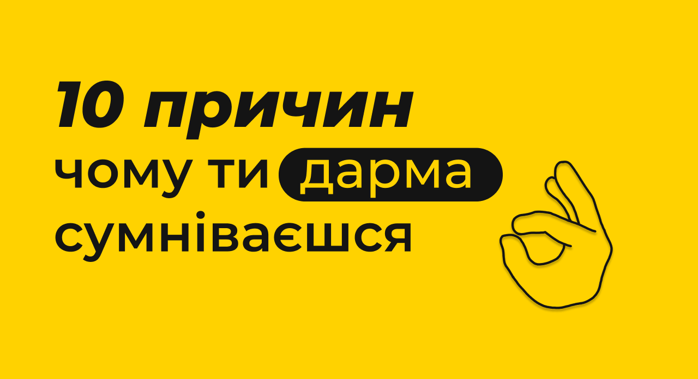

import MobileTOC from "../../../src/components/MobileTOC/MobileTOC.jsx";

<MobileTOC sections={[  
    { heading: "1. Перенасичення розумними людьми."},
    { heading: "2. Сильна математична база."},
    { heading: "3. Тобі завжди допоможуть."},
    { heading: "4. Моторошне слово дедлайн."},
    { heading: "5. Викладачі прагнуть дати знання."},
    { heading: "6. Різносторонні люди та активна СтудРада."},
    { heading: "7. Робота."},
    { heading: "8. Відсутність корупції."},
    { heading: "9. Перший курс зробить тебе універсальним."},
    { heading: "10. Безліч можливостей для різнобічного розвитку!"}
]}/>

<!--truncate-->

### **1. Перенасичення розумними людьми.**

В осередку особистостей існує здорова конкуренція. Ймовірно, що в тебе виникне бажання працювати, бо захочеться відзначитись успіхами із групи/потоку. _Якщо раптово з’явиться жага до роботи, сядь і заспокойся — вона зникне самостійно._ До того ж, краще бути пересічним серед найкращих, аніж найкращим серед найгірших.

### **2. Сильна математична база.**

Університет зробить із тебе професіонала. Матимеш змогу отримати базу, а це — найголовніше. Із нею буде легше поринути в цікаву для тебе сферу. Слушно відмітити, що величезна кількість математики розвиває пам'ять, логіку та вміння навчатись.

### **3. Тобі завжди допоможуть.**

Із перших днів навчання кожну групу будуть супроводжувати два-три куратори, які допомагатимуть протягом усього студентського життя. У разі виникнення складнощів старші товариші з радістю готові відповісти на будь-які запитання. ІПСА — це місце, де ти можеш звертатися до першого пересічного, адже допоможе кожен.

### **4. Моторошне слово дедлайн.**

В ІПСА нудьгувати не доведеться точно, адже іноді дедлайни приходять зненацька. Зазвичай, студенти в повній мірі усвідомлюють це поняття під час першого календарного контролю. Саме в цей час викладачі проводять контрольні та видають розрахункові роботи, які здобувачі освіти, як завжди, виконують в останній день.
Урешті-решт, навичка «робити все вчасно» допомагає, насамперед, у подальшій кар’єрі.

### **5. Викладачі прагнуть дати знання.**

Кожен із них досконало знає свій предмет. У когось навчатися простіше, а хтось створює славнозвісну «пекельно складну» репутацію ІПСА. Але зрештою ти зрозумієш, що безсонні ночі за конспектами не були марними після отриманої відмітки за тяжку працю.

### **6. Різносторонні люди та активна СтудРада.**

Ймовірніше за все, запал постійно навчатися почне згасати — це нормально. До того ж, майже всі проводять вільний час далеко не за математикою чи програмуванням. Більшість ІПСАшників — веселі люди. Це одна величезна сім'я, де приймають усіх: від гуманітаріїв і танцівників до вискочок та інтровертів. Завдяки великій концентрації таких різносторонніх особистостей у нас існує активна СтудРада, яка організовує приголомшливі заходи, де ти забуваєш про всі нездані лабораторні роботи та просто відпочиваєш.

### **7. Робота.**

Саме заради працевлаштування люди вступають у заклади вищої освіти. Якщо ти візьмеш усе можливе від навчання тут, то ймовірність побудувати успішну кар’єру буде високою. Одним із головних привілеїв ІПСА є тісний взаємозв'язок між студентами. Більшість наших випускників створюють стартапи разом зі своїми однокурсниками чи просто товаришами. Також поширеним є явище, коли викладачі допомагають у пошуку роботи або ж запрошують працювати до себе в компанію.

### **8. Відсутність корупції.**

Викладачі ІПСА беруть хабарі лише недоспаними за вивченням матеріалу ночами. Можемо гарантувати, що з даним поняттям у буквальному сенсі студенти нашого інституту не стикаються.

### **9. Перший курс зробить тебе універсальним.**

Здобудеш вміння швидко орієнтуватися та навчатися новому в найкоротші терміни, що допоможе вирішувати будь-які життєві труднощі. Загалом, це дуже важливо в командній роботі.

### **10. Безліч можливостей для різнобічного розвитку!**

Насамкінець, тобі відкриваються нові горизонти — розширення світогляду та самовдосконалення. КПІ дає студентам змогу проходити безкоштовно низку курсів на розмаїтних платформах, різнонапрямленими гуртками та освітніми заходами: лекціями, відмінними від навчальних за тематикою, конференціями, міжфакультетськими іграми розуму тощо. ІПСАшники також покращують свої вміння, працюючи на благо СтудРади, що знайде завдання для кожного. Також ми беремо участь у створених студентством подіях, що часто мають не тільки розважальний, а й розвивальний характер.
