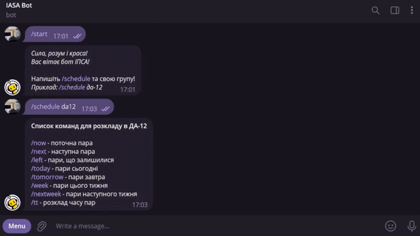
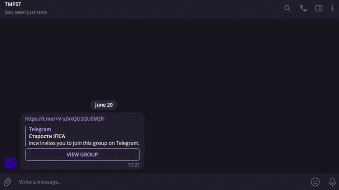
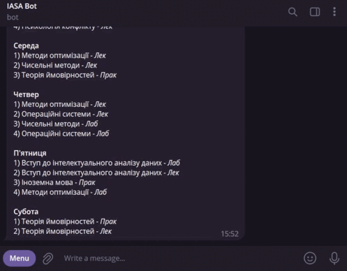

<!--truncate-->

Цей бот має декілька цілей: українізувати виправлення ІПСА від старого бота, зробити розклад гнучким, доступним в один 
клік і зручним в умовах дистанційного навчання, надати можливість менеджити дедлайни, домашні завдання, контрольні тощо.

## Команди розкладу 🗓

*Основні команди, що доступні кожному ІПСАшнику*

- **/schedule {група}** - поставити групу для розкладу;
- **/now** - поточна пара;
- **/next** - наступна пара;
- **/left** - пари, що залишилися на сьогодні;
- **/today** - розклад на сьогодні;
- **/tomorrow** - розклад на завтра;
- **/week** - розклад на цей тиждень;
- **/nextweek** - розклад на наступний тиждень;
- **/tt** - розклад з часом;

_
Встановлення групи для розкладу
_

_
Базові команди
_

## Функціонал старости 💪😎

*Староста – опора групи, вона бере на себе тягар своїх одногрупників і займається розкладом, посиланнями та дедлайнами.*

Перше, що потрібно зробити старості при вході до чату з іншими старостами – зареєструвати себе як старосту групи в боті.
Ось як це виглядає від першої особи.

_
Додавання старости
_

Але якщо староста вже є в групі, або випадково обрав не свою групу – не біда! Він може скористатися командою **/reset**, 
як показано нижче.

_
Перевизначення групи старости
_

Як не дивно, але старости теж, гм, *~~старіють))~~* змінюються. До чого це ми? Іноді виникають ситуації, коли староста 
більше не виконує свої обов'язки. Як бути із роллю старости в боті? Скласти повноваження старості допоможе команда 
*/self_remove*.

_
Складання повноважень старости
_

Далі новоствореному старості потрібно додати чат своєї групи. Для цього йому треба додати бота до групи, бажано дати 
йому права адміністратора, та написати команду **/bind**. Після цього чат буде зареєстровано і розклад в цьому чаті буде
налаштовано саме для групи старости.

_
Зв'язування чату з групою
_

Які можливості отримує староста? Їх одразу декілька, почнему із заміни пар за допомогою **/edit**. Усі зміни будуть 
відображені в розкладі.

_
Процес редагування розкладу
_

Далі за списком ідуть посилання на пари, які можна додавати за допомогою **/set_link**. До назв пар на обрані типи, 
що мають посилання, воно буде прикріплене в розкладі. Отримати список всіх посилань можна через **/links**.

_
Встановлення посилання
_

Обидва рішення – зміна пари та прикріплення посилання, можна скасувати, використавши **/delete** та **/delete_link** 
відповідно. При цьому зміни у розкладі, привнесені заміною чи посиланням, видаляться.

_
Видалення редагування розкладу та посилання
_

Поглянемо на дедлайни. Їх додавання виконується командою **/set_deadline**. Для дедлайну можна обрати предмет, 
дату та назву. Після цього бот нагадає про них у чаті групи. Перегляд поточних дедлайнів доступний за **/deadlines**, 
архівні дедлайни – за **/old_deadlines**. Видалення ж дедлайнів виконується командою **/delete_deadline**.

_
Додавання дедлайну та список дедлайнів
_

Також староста може керувати налаштуваннями бота в чаті своєї групи, наприклад видаленням повідомлень бота та 
нагадуванням про дедлайн чи початок пари. Все це доступно за **/settings**.

_
Налаштування бота в чаті групи
_

## Додатковий функціонал 🛠

Будь-який користувач може запропонувати розробникам варіанти покращень чи просто пожалітися на роботу бота. 
Зворотний зв'язок упроваджений за допомогою **/report**.

_
Скарга на бота
_

Також передбачена можливість пропонувати кастомну фразу на відмінювання ІПСА, якою бот буде лякати порушників режиму 
невідмінювання назви нашого улюбленого та ненависного інституту. Зробити це можна через **/reaction**.

_
Запропонувати фразу
_

## Заключення 🕊

Від імені ІТ-відділу СтудРади ІПСА, ми сподіваємось, що цей [бот](https://t.me/iasa_mate_bot) стане гарним помічником, і зробить ваше повсякденне 
студентське життя хоча б трохи простішим і цікавішим.

З любов'ю,
Ваш ІТ-відділ 🤍

### Credits and Grattitudes ⭐️

Команда ІТ-відділу 👩‍💻

- **Андрій Шевцов** – _екс-голова Освітнього відділу, менторська підтримка проєкту_ 
- [**Софія Шапошнікова**](https://t.me/tea_sotea) – _голова ІТ-відділу, менеджерка проєкту_
- [**Дмитро Іваненко**](https://t.me/dimaple) – _тімлід, головний розробник_
- [**Нікіта Рябін**](https://t.me/akaspeh) – _другий тімлід, розробник_
- **Анастасія Кіндзерська** – _розробниця_
- **Олександа Шийко** – _розробниця на ранній стадії проекту_
- **Ростислав Костюк** – _розробник на ранній стадії проекту_

Особлива подяка **Інформ відділу**, які допомогали із редактурою текстів, зокрема цього гайду, та розповсюдженням, а 
також **Дизайн відділу**, які розробили логотип та загальне оформлення. Без вас фінальний продукт і 
_<ins>близько не був би</ins>_ настільки неперевершеним 💗
