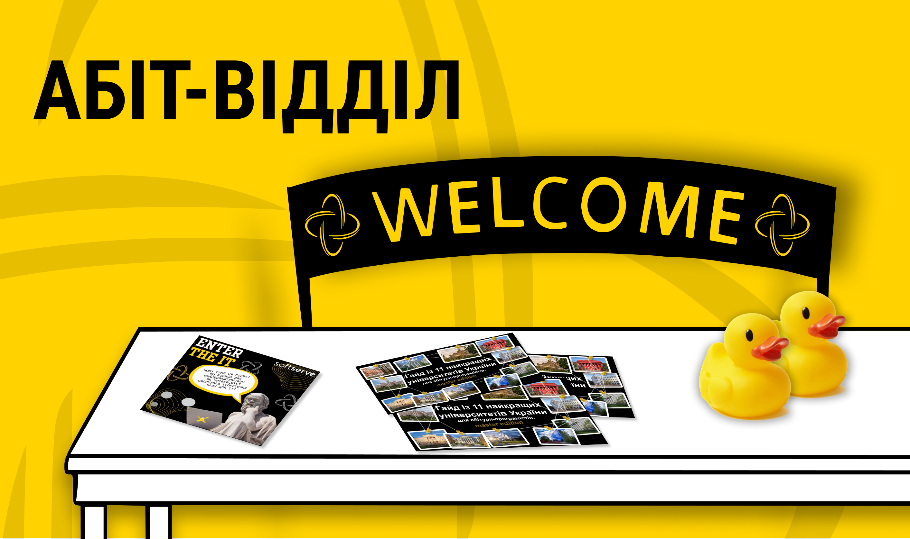
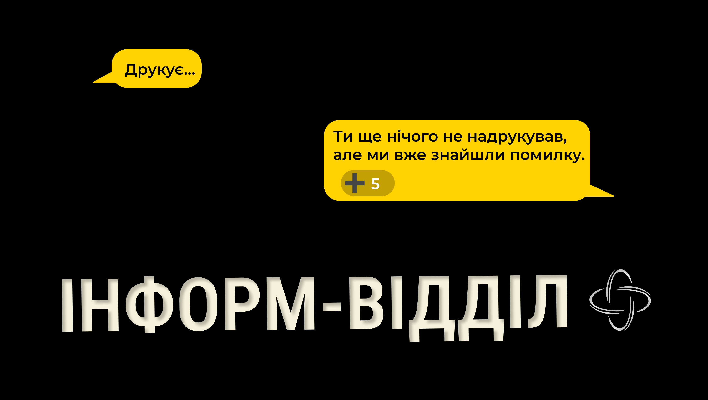
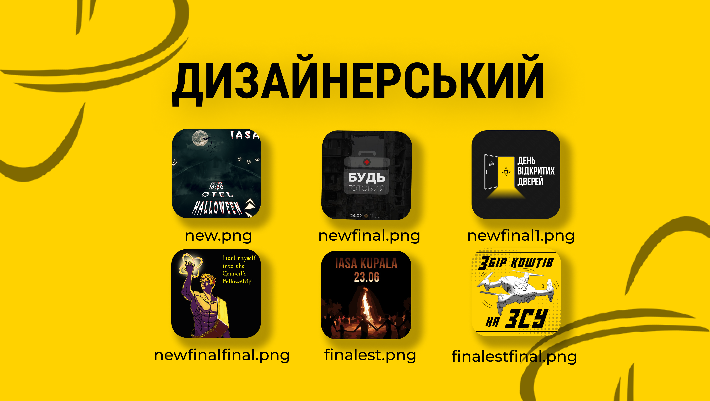
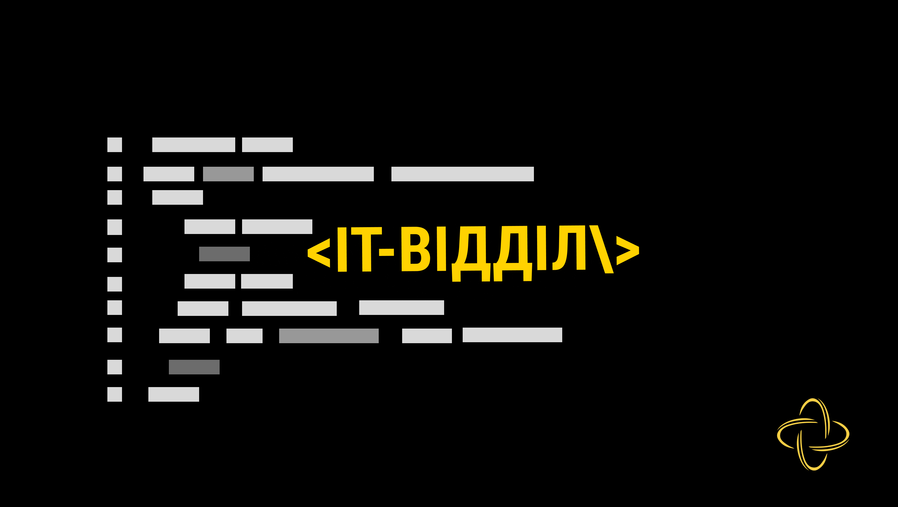
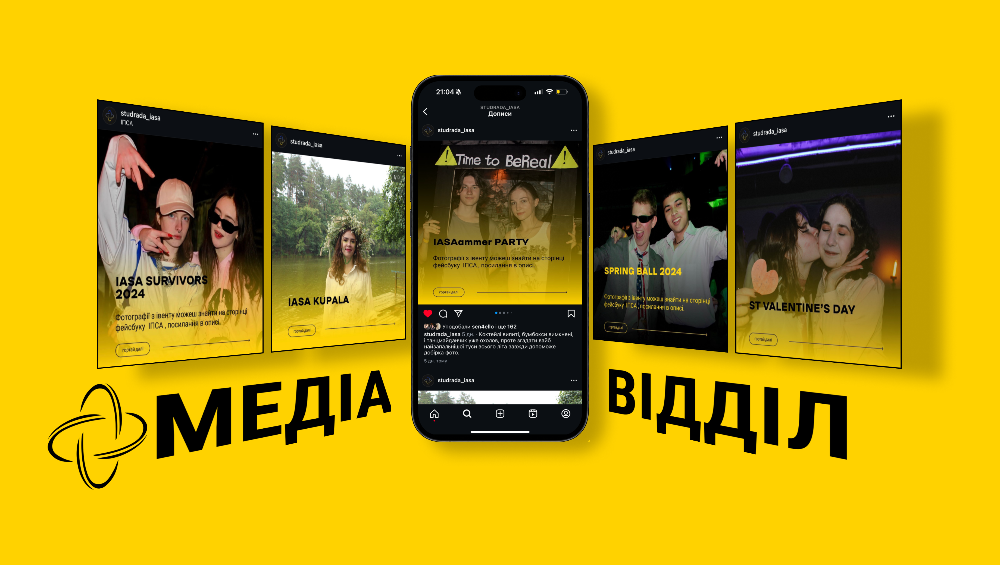
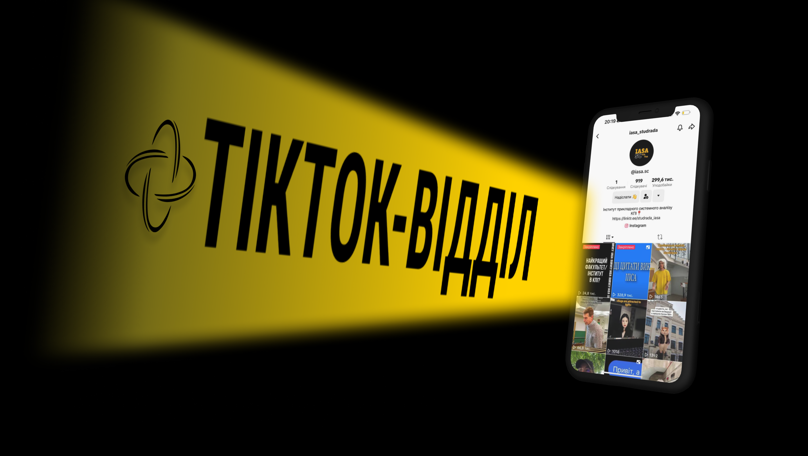

Мафія. Тіньова влада ІПСА. Вони покращують студентське життя, а ти цього навіть не помічаєш. Ця стаття — можливість зазирнути за лаштунки великої гри, що відбувається прямо перед носом.

<!--truncate-->

Ти побачиш, як невидима рука Інформу коригує кожен текст, дизайнери створюють візуальні шедеври, команда ІТ тримає всю систему на плаву, а Проєктний організовує заходи, що збирають сотні людей. 
Дізнаєшся, як Освітній допомагає студентам розвиватися академічно, Абіт зустрічає нових вступників, Мерч дарує стильний одяг, а Медіа та Тікток-відділи роблять життя яскравішим в [соцмережах](https://linktr.ee/iasa_sc).

---

## Абіт-відділ
Перший відділ, з яким зіштовхуються абітурієнт і майбутній студент ІПСА. Його члени займаються профорієнтацією абітурієнтів, зацікавлених у здобутті вищої освіти, зокрема в ІПСА. 
Робота команди припадає на вступну кампанію, що триває щороку з лютого по вересень. 

- Чотири рази організували  «IASA Open Day» — захід, під час якого вступники знайомляться з аспектами навчання в ІПСА: [20 лютого](https://t.me/abitiasa/14), [26 квітня](https://t.me/abitiasa/28), [19 червня](https://t.me/abitiasa/43) та [15 липня](https://t.me/abitiasa/55) 2024 року.
- Разом із компанією [SoftServe](https://www.softserveinc.com/) двічі провели «Enter the IT» — захід, для знайомства абітурієнтів з ІТ-сферою ([27 грудня](https://t.me/abitiasa/7) й [6 квітня](https://t.me/abitiasa/19) 2024 року).
- Допомогли з організацією 2 абіт-івентів: [День відкритих дверей КПІАбітFest](https://t.me/abitiasa/34) та [День вступника КПІ](https://t.me/abitiasa/47).
- Були гостем на [інтерв’ю](https://youtu.be/YvpQllEvYn0?si=kzY45KqfSu_Rs5JL) в [КПІмедіа](https://www.youtube.com/@kpiua/videos), присвяченому Інституту прикладного системного аналізу в КПІ, а саме: вступу й освіті. Також приєдналися до  [КПІАбітTalks](https://www.instagram.com/reel/C3Df9FGth2I/?igsh=anN0NjFmbG5jcA==).
- Записали [промовідео](https://youtu.be/5q0de0irqhI), щоб нарешті всім розповісти про життя ІПСАшника.
- Актуалізували [21 статтю](https://iasastudentcouncil.github.io/iasa-sc-blog/blog/) задля допомоги абітурієнтам під час усієї вступної кампанії. Окремо хотілося б відзначити гайд із 12Х та 113 спеціальностей для [бакалаврату](https://iasastudentcouncil.github.io/iasa-sc-blog/blog/bakalavr_gaid_2024) й [магістратури](https://iasastudentcouncil.github.io/iasa-sc-blog/blog/master_gaid_2024).
- Інформували абітурієнтів у таких телеграм каналах і чатах, як: [IASA ABIT 2024](https://t.me/abitiasa), [IASA ABIT chat 2024](https://t.me/abitiasa_chat), [IASA ABIT flood 2024](https://t.me/abitiasa_flood) та [Вступник КПІ](https://t.me/vstup_kpi).
- Встановили зв'язок з адміністрацією ІПСА щодо допомоги з підготовкою матеріалів до заходів.
- Відновили спілкування з іншими головами Абіт-відділів факультетів й інститутів КПІ.

## Освітній відділ
Кожен студент прагне здобути якісну освіту та цікавий навчальний процес, чого не завжди можна досягнути повною мірою під час дистанційного навчання й війни. 
Освітня команда не покладає рук, аби створювати якісні дописи, поширювати навчальні матеріали та проводити офлайн лекції. На їхніх заходах на відміну від пар не буває нудно.

- Організували масштабний хакатон [IASA Champ '24](http://champ.iasa.kpi.ua/) та серію 3-денних лекцій зі спікерами під час нього від провідних українських компаній: [Lifecell](https://www.lifecell.ua/uk/), [Solidgate](https://solidgate.com/), [MacPaw](https://macpaw.com/) і [SoftServe](https://www.softserveinc.com/).
- Разом із [Futura Group](https://futurragroup.com/ua/) провели [освітній івент](https://t.me/IASA_Student_Council/2078), присвячений кар'єрним можливостям у продуктовому IT.
- Допомогли не одному студенту розв'язувати проблеми й оновили роботу [окремого бота](https://t.me/iasa_stud_support_bot) для оптимізації обробки запитів.
- Провели весняну та літню «[IASA Analytics](https://t.me/iasa_analytics)», проаналізували тисячі відповідей і створили рейтинги викладачів.
- Актуалізували [статті про вибіркові дисципліни](https://iasastudentcouncil.github.io/iasa-sc-blog/blog/tags/%D0%B2%D0%B8%D0%B1%D1%96%D1%80%D0%BA%D0%BE%D0%B2%D1%96) 3 та 4 курсів.
- В рамках власних ініціатив продовжуємо писати дописи для рубрик [#Edu_preparation](https://t.me/iasa_edu/330) і [#Edu_quiz](https://t.me/iasa_edu/156). Крім цього відновили [#Edu_Academic](https://t.me/iasa_edu/685). 
- Підготували матеріали для майбутнього вебкаталогу для студентів ІПСА «IASAteka». 

## Проєктний відділ
Діяльність цього відділу завжди є світлом у кінці тунелю серед мільйонів інтегралів і рядків коду. 
То погляньмо ж, за які [досягнення](https://iasastudentcouncil.github.io/iasa-sc-blog/blog/Event) слава про [івенти Студради](https://t.me/iasa_event) ходить за морями (а про лекції з матаналізу — ні). 

- На івентах минулого року можна було потанцювати під Брітні, пограти в покер, сфоткатися з персонажем улюбленого мему й навіть повальсувати в елегантному образі. Напевно, твої пальці не згиналися в спробах порахувати кількість заходів, але наші — так. І, зрештою, перемогли в блекджек, зібравши аж 21!
- Окрім вищесказаного, два івенти стали зльотом рекордної кількості качок і їхніх друзів із початку повномасштабного вторгнення: [Fresh](https://photos.app.goo.gl/XJyGAm2Z2tMAAAke8) об'єднав 265 душ, [IASA Halloween](https://photos.app.goo.gl/gSVsW6nU9z3wyqCb8) — 250.
- Світло софітів, запах любовної інтриги в повітрі, шелест суконь та джентльмени в елегантних костюмах, Мала опера… Так, цей пункт присвячено [IASA Spring Ball](https://photos.app.goo.gl/M9Am65LTJVcVYK5i6)! Класична атмосфера нового івенту точно не оминула захвату його відвідувачів. 
- Безпека — передусім, тому було проведено [медичний тренінг](https://t.me/iasa_event/1053) для охочих, аби всі знали, як підвʼязати крило, якщо випадеш із гнізда.
- Де мої гроши? У донатах на ЗСУ! Цього року більше 50 тис. гривень, зібраних із квитків на івенти, зборів та навіть аукціону було конвертовано в допомогу нашій армії. Чудовий момент нагадати: донать і ходи на наші заходи!

## Інформ-відділ
Ти не почуєш, що вони влаштовують вечірки, створюють сайти, знімають тіктоки, але вони — одні з найактивніших та найважливіших. Інформівці — завзяті борці проти зайвих ком і лексичних помилок. 
Саме ці трудяги повідомляють про чергову вакансію, івент, підписують публікації для інстаграму, редагують статті й ледве стримуються, аби не написати тут, що є найкращим відділом Студради. 
Але ми ж системні аналітики, тому нумо дивитися на цифри:

- Цього року члени відділу стали батьками як мінімум 350 дописів, серед яких: 181 для телеграм-каналу [IASA Student Council](https://t.me/IASA_Student_Council), 103 для [IASAevent](https://t.me/iasa_event), 57 для [IASA ABIT 2024](https://t.me/abitiasa). 
- Поняньчили (aka відредагували) 615 сторінок [статей](https://iasastudentcouncil.github.io/iasa-sc-blog/blog): 541 із них є дітьми Абіт-відділу, 74 — Освітнього. 
- Окремим пунктом винесемо 12 годин редактури поспіль. А як іще, коли дедлайн уже завтра?
- Інформівці начаклували з букв 107 017 повідомлень, де здебільшого ~~булили~~ виправляли одне одного за помилкове чергування і / й / та або обговорювали Ізмаїл, Рівне, Павлоград, Запоріжжя… Загалом, від духоти постраждали 22 члени відділу, і протрималися до кінця не всі.
- Закритий стікерпак із, очевидно, мовою ворожнечі одне до одного, налічує 120 стікерів, і ми не плануємо зупинятися.

**Спойлер:** _очікуй цього семестру дві нові (а все нове — давно забуте старе) рубрики від Інформу. Одна замінить затишне чаювання з викладачами, інша — розповість більше про гостру суспільно-політичну тему._

## Дизайнерський відділ
Бачиш основний допис для івенту й думаєш не тільки про те, як одягнутися за дрес-кодом, а і як же доля занесла цих талановитих митців на технічну спеціальність. 

- Ян Вермер за своє життя намалював 34 картини, а ці роботяги створили понад 80 різноманітних постерів та ілюстрацій усього за рік.
- Розширили зону відповідальності й почали співпрацю з Мерч-відділом задля маскоту та з Освітнім відділом заради розробки візуальних елементів для хакатону.
- ІТ-відділ вони також не обійшли стороною, тому дуже скоро ти зможеш побачити результат їхніх зусиль, які поєдналися в макети дизайну сайту СР ІПСА.
- З внутрішніх новин: було запущено брендбук задля підтримки та запобіганню порушень айдентики ІПСА й легшої впізнаваності навіть без логотипів.

## ІТ-відділ
Два роки тому з'явилося гостре питання: чому в Студради технічного інституту немає профільного відділу? Звідти й бере початок найбільш цифровізована гілка усього СР ІПСА. 
Він дав життя багатьом проєктам та кожен день підтримує усю систему на плаву. Після затяжної паузи, за останні півроку було подолано чимало викликів.

- Були здійснений тюнінг [сайту статей](https://iasastudentcouncil.github.io/iasa-sc-blog/blog). Покращена SEO-оптимізація. Всі баги виправлені, а посилання у футері актуалізовані. Додано категоризацію, пошук за словами та тегами.
- Головний вебсайт Студради ІПСА був перестворений та зараз знаходиться на фінальних стадіях розробки й тестування. 
- Приведена до ладу [GitHub сторінка](https://github.com/IASAStudentCouncil).
- У співпраці з Освітнім відділом були проведені 2 аналітичні дослідження викладачів «[IASA Analytics](https://t.me/iasa_analytics)», зі збором даних за допомогою [IASA Bot](https://t.me/iasa_mate_bot). Автоматизована розсилка форм для опитувань.
- Покращена робота [IASA Bot](https://t.me/iasa_mate_bot) і виправлені баги: розклад стало можливо дивитися не тільки у чатах груп / особистих повідомленнях. 
- Жодна ідея для тіктоків не була упущена, завдяки створенню [IASA TikTok Bot](https://t.me/iasa_tiktok_bot).
- Почалася робота над Analyst Shop Bot, який покликаний зробити просту та зручну взаємодію між покупцями й [Мерч-відділом](https://t.me/analyst_shop).
- Нарешті реанімували [LinkedIn](https://www.linkedin.com/company/iasa-sc).
- Почали працювати над новим ботом-пінгувалкою.

## Мерч-відділ
Цього року неспокійно було й у вулику під назвою «Мерч-відділ», плодом чого стали безліч нових дизайнів та продуктів. Тутешні бджілки константно працювали, навіть протягом сесії. 
Якщо прислухатися уважніше до гудіння всередині, досі можна почути, як хтось приймає замовлення та комунікує з клієнтами, хтось підганяє принти під вимоги, а хтось — упаковує цікавинки та відправляє їх. 

- Як фенікс постав із попелу, [інстаграм Мерч-відділу](https://www.instagram.com/analyst.shop/) повернувся з просторів забуття. А ще було налагоджено співпрацю з Медіавідділом щодо вмісту сторінки.
- Тепер наліпки із символікою та духом інституту можна обрати на будь-який смак: поряд із виходом першого [прозорого стікерпаку](https://www.instagram.com/p/C1zF4C7tvef/?igsh=MWJlcWR0c3Q4NWRqbg==) було відновлено випуск [класичного](https://www.instagram.com/p/C9Mn2OMtVo0/), на паперовій основі.
- Обмеженому колу щасливчиків вдалося заволодіти колекцією мерчу із вишитим логотипом Студради.
- Записник, якому долею судилося стати твоїм конспектом із матана, тепер обирати ще легше, адже Мерч запустив серію блокнотів із новими дизайнами. 
-  Якщо дочитавши до цього пункту ти досі не йдеш купувати, то ну, так не можна. До решти питань немає: ловіть цьогоріч розроблений каталог (прим. ред. Він буде доступний у новому боті замовлень) зі всіма результатами праці відділу.
- Повернемося до співпраці з ІТ: незабаром ти зможеш замовити новий мерч через окремого бота.
- Позбулися від усього російського: роздали російськомовний мерч за донат на ЗСУ.

**P.S.** Можеш уже відкладати зі своєї стипендії чи зарплати на новенький… Ні, поки не мерс, а мерч Студради, що промовлятиме всьому світу: «Мене носить ІПСАшник», адже відділ активно працював над новим товаром, вихід якого заплановано вже цього року. 

## Медіавідділ
Музика, посмішки, поцілунки в камеру… Групове фото, куди ти не потрапив, світлини, які ти не пам'ятаєш, і ті, які можна показати мамі… Хто, як не цей відділ, може змусити людей зайти у [фейсбук](https://www.facebook.com/studrada.iasa).

- Ховалися за об'єктивами й створювали [компромат](https://photos.app.goo.gl/x8VYVTeTaoNxXEic8)… тобто фото- й відеозвіти, щоб кожен івент залишався не тільки в пам’яті.
- Псували тобі статистику перебування в соцмережах, бо пропускати їхні історії в інстаграмі з удосконаленою візуальною складовою неймовірно важко.
- Як справжні режисери, займались анонсами для деяких заходів Проєктного, а також провели фотосесії для учасників [IASA Spring Ball](https://photos.app.goo.gl/M9Am65LTJVcVYK5i6).
- Допомагають Мерч-відділу демонструвати вироби найкращим чином у їхньому [інстаграмі](https://www.instagram.com/analyst.shop/) та на зйомках.
- Обіцяють, що в майбутньому захоплять ще й [ютуб](https://www.youtube.com/c/IASAChannel/videos).

## Тікток-відділ
Наймолодіший відділ, ~~як і їхня цільова авдиторія~~. Щоб не давати нам шансів бути ейджистами, зосередили свій контент на ІПСАшниках, а не тільки абітурієнтах. 

- Досягли позначки у 863 підписники, зібрали десятки тисяч переглядів, але ще не зловили зіркову хворобу.
- Стали викладати по два тіктоки на день і вижили.
- Також поширюють мерч на своїй платформі, щоб жоден студент не оминув спокуси оновити гардероб.
- Провели 100 500 опитувань на івентах (виходить навіть більше, ніж усього було івентів).
- Поповнили команду й це наразі ти можеш [спостерігати](https://www.tiktok.com/@iasa.sc) удвічі більше гарних людей.

---

Можливо, тебе наш список зробленого не вразив (особисто ми вважаємо себе крутими). 
Головне, що кожен день Студрада невпинно працювала: придумавала нові рубрики й івенти, шукала натхнення навіть у безнадії, 
використовувала всі свої навички на 111% заради якісного результату й допомагала студенству вирішувати всі проблеми. 
І це триватиме й надалі, аби ніхто не втратив ритм ІПСА.

P.S. Не забувай [стежити](https://linktr.ee/studrada_iasa) за нашими новинами та заходами.

---

<blockquote>
    

        <b><i>
            «Запам'ятайте: на ІПСА має відбуватись інтелектуальне зростання».
        </i></b> 
    
 
    

        Калита Віктор Михайлович, травень 2024. 
    
 
</blockquote>