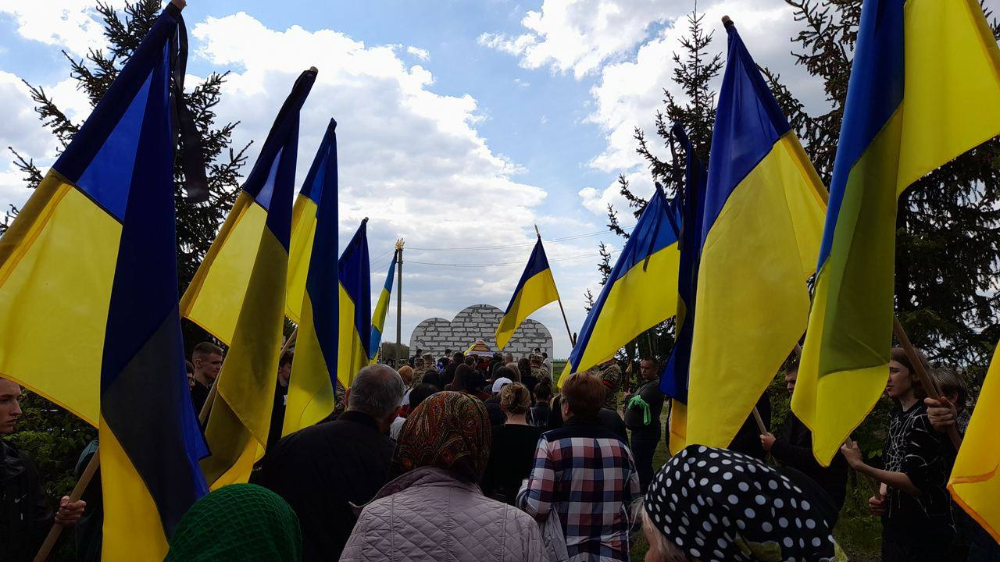

import RedirectButton from "../../../src/js/RedirectButton";

<RedirectButton to="/iasa-sc-blog/blog/en/bozhena">Read in English</RedirectButton>

Багатьом здається, що війна звучить як вибухи, сигнали тривоги чи автоматна черга. 
Ми додамо: вона має мелодію телефонного дзвінка, заставки новинного ютуб-каналу й навіть тиші. 
Про це розповіла наша головна героїня Божена, дівчинка, що втратила найдорожчу людину на війні й більше не зможе сказати їй найважливіші слова ще раз.

<!-- truncate -->

---

> #### *Представся нашим читачам: хто ти, чим захоплюєшся, як проводиш вільний час?*
> 
> Мене звати Божена, мені 17. Зараз я студентка 1 курсу підрозділу КПІ — ІПСА. Живу, як і мріяла, у Києві з подругами. Навчаюся, читаю, гуляю, кулінарю. Усе здавалося б ідеальним, якби не ціна, яку я заплатила за відносну безпеку.

 

> #### *Як і чому ти стала студенткою ІПСА?*
> 
> Мій тато мріяв, щоб я навчалася в провідному ЗВО України, тому з дитинства готувалася до вступу в КПІ. У 15 років, із метою ідеально скласти екзамени, спеціально перейшла у фізико-математичний ліцей. Класний керівник порекомендував ІПСА, і після успішних результатів НМТ мені все вдалося.

 

> #### *Розкажи про своє дитинство. Які найяскравіші спогади маєш із татом?*
> 
> Я одна з тих небагатьох дітей, хто на запитання «мама чи тато?» завжди вибирала «тато». Не кожен має такого дбайливого, люблячого й доброго батька. Попри фінансові труднощі на той момент він робив усе, щоб у мене було забезпечене дитинство: не лише матеріально, але і психологічно. 
> Найкращим спогадом є, напевно, наша поїздка до найбільшого тоді в Україні аквапарку :) Завжди каталися на машині в ліс, на ставок, на пасіку. На відміну від нього, у мене були повноцінні ранні роки й усього вистачало.

 

> #### *Яким було дитинство твого тата?*
> 
> Мій тато народився на Далекому Сході 23 травня 1976 року в місті Свободний, за 8500 км від нас. 
> Він був старшим із шести дітей у класичній радянській сім'ї того часу: усі жили в маленькій темній квартирі. Його виховувала бабуся, віддавала йому останні кошти. 
> Тато не розказував про своє дитинство, бо це не найприємніші спогади. Проте й так зрозуміло, що умови були жахливі: не завжди було що їсти, обов'язки лягали на нього як старшого брата, про відпочинок в іншому місті можна було й не мріяти.

 

> #### *Що таке Зелений Клин, та як родина твого тата потрапила туди?*
> 
> Зелений Клин — історична українська назва південної частини Далекого Сходу, що сформувалася внаслідок поступової еміграції великої кількості українського населення. 
> Родину мого тата під час репресій силоміць вивезли туди, тому декільком поколінням моїх предків довелося починати все спочатку. Тато завжди зі злістю про це згадував. По суті забрали все й не дали нічого.

Зелений Клин — це земля, розташована на півдні Далекого Сходу, яка отримала свою назву завдяки буйній рослинності та географічному розташуванню, що нагадувало клин. 
У 1925–1928 роках комісія УРСР, БРСР і РРФСР щодо перерозподілу кордонів прийняла рішення депортувати на Зелений, Малиновий та Сірий Клини сотні тисяч українців. 
Метою було руйнування опору, із яким вони зустрічали радянську владу. Однак на нових місцях люди об’єднувалися в громади, створювали школи, своїм поселенням давали назви українських міст і зберігали традиції. 

Під час повномасштабної війни українців із тимчасово окупованих територій, як і сотню років тому, відправляють у [віддалені регіони](https://svidomi.in.ua/page/yak-rosiia-deportuie-ukraintsiv-zvit-pravozakhysnykiv) рф: на Далекий Схід, у Північний Кавказ. 
росія вигадує закони, якими легітимізує свої злочинні дії, «захищаючи» місцеве населення. Насправді ж, політики країни-агресора намагаються асимілювати українців у своїй культурі.

 

> #### *Якою була татова юність, та як він повернувся на історичну Батьківщину?*
> 
> Тато перебрався до Криму десь у 20 років, де й познайомився з моєю мамою, студенткою родом з Оратова. 
> Мені часто доводилося слухати розповіді про їхні побачення на набережній. Тато обіцяв звозити нас в український Крим. Але вже ніколи не зможе.

<figcaption>Батьки Божени у 2022 році</figcaption>

 

> #### *Розкажи про період життя тата в Криму. Чим цей час був особливим для нього?*
> 
> Він із гордістю казав, що щасливий, бо «молодість провів у Криму». На жаль, моє покоління недооцінює цей ласий шматочок карти, бо звик до його фактичної відсутності в складі України. 
> Насправді ж Крим — рай на Землі, як і вся Україна за розповідями мого тата. Було все, чого нам зараз так не вистачає: море, гори, клімат, їжа, розваги.

<figcaption>Батьки в Криму, сімейний архів</figcaption>

 

Окупація та анексія Криму — насильницьке захоплення збройними силами рф території Кримського півострова у 2014 році, що триває донині, здійснене з грубим порушенням українського та міжнародного права, численними посяганнями на свободи людини. 

Росіяни не вперше псують життя на півострові. У 1944 році відбулася трагедія кримськотатарського народу: депортація з рідних земель у віддалені регіони Радянського Союзу, від північного Передуралля до республік Середньої Азії. 
У 1954 році Крим, спорожнілий і абсолютно не схожий на той, яким він був до 1944 року, було доєднано до складу УРСР.

У 2010 між Україною та росією було укладено «Харківські угоди», згідно з якими в Криму продовжував перебувати Чорноморський флот рф. Це стало бомбою сповільненої дії. 
У лютому 2014 року росіяни перетнули державний кордон між країнами в Керченській протоці та зімітували масове невдоволення жителів Сімферополя «київською владою». 
Проте потужний мітинг проукраїнських сил, включно з кримськими татарами, зіпсував плани загарбників видати окупацію за волевиявлення мешканців півострова. 
Тоді війська рф захопили будівлі Ради міністрів і Верховної ради Автономної Республіки Крим, а депутати останньої «ухвалили» рішення про проведення так званого «референдуму», що відбувся 16 березня за великої кількості озброєних російських військовослужбовців.

 

> #### *Куди після Криму переїхала твоя родина? Які зміни відбулися в той час?*
> 
> Після весілля тато влаштувався на роботу в Києві, мама займалася мною, тому й перебралися у Вінницьку область до маминих батьків. 
> Було важко: збирали на житло, усі зусилля були вкладені в мою освіту. Тато працював 24/7, часто до крові на руках.

 

> #### *Розкажи, які у твого тата були захоплення.*
> 
> Я завжди дивувалася його вмінню прокидатися кожного ранку і працювати до пізньої ночі. Він був професійним столяром, отже, праця була фізичною. 
> Він завжди хотів зробити більше, викластися на всі 100. Зараз я помічаю, що ця риса розвивається в мене.
> 
> Тато займався пасікою та кожен сезон виготовляв десятки літрів вина. Він обожнював свою сім'ю і дім, знаючи, що не кожен у житті може це мати.

<figcaption>Божена з батьками у 2014 році</figcaption>

 

> #### *У 2013–14 роках, коли відбувався Майдан і, пізніше, окупація українських територій, ти була ще дитиною, однак, можливо, це закарбувалося у твоїй пам’яті. Розкажи про свої спогади, думки, реакцію рідних на тогочасні події.*
> 
> Мої батьки завжди виховували мене з виразною патріотичністю. На той час мені було 6 років, але я вже розуміла, наскільки все погано, і як це впливає на моє повсякденне життя. Тато вечорами заставляв мене слухати про всі події, що зазвичай закінчувалося моїми слізьми. Зараз у подібному дусі виховується моя сестра, але вже мною. У 5 років війна забрала в неї батька, що дуже погано відобразилося на її психологічному стані, але вона дуже свідома на свої роки й теж розуміє, що це було необхідним.

У 2004 Україна вже пережила масштабні протести проти результатів фальсифікованих виборів. Ці події отримали назву Помаранчева революція. 
11 років тому уряд призупинив підготовку до підписання угоди про асоціацію України з Європейським Союзом, через що ввечері 21 листопада 2013 року кількасот людей вийшли на столичний Майдан Незалежності. 
Від самого початку Євромайдан мав мирний характер, зокрема завдяки участі студентів і молоді, які вимагали демократичних реформ. Однак у ніч на 30 листопада силові структури жорстоко розігнали протестувальників, що лише підштовхнуло до більш масштабних акцій протесту. 
Це призвело до ескалації конфлікту, що отримав назву Революція гідності.

Події досягли свого апогею в лютому 2014 року, коли відбулися масові обстріли протестувальників силовими органами. Революція завершилася зміною політичного курсу країни, поваленням влади та втечею тодішнього президента Віктора Януковича. 
Євромайдан став символом боротьби українського народу за демократичні цінності й незалежність від зовнішнього впливу. 

 

> #### *Розкажи про участь тата в Майдані.*
> 
> І в 2004, й у 2014 він був на Майдані, як і моя сім'я. Ми переконані, що кожна родина повинна починати із себе й робити свій внесок. 
> На жаль, я не встигла свідомо поговорити з ним: мені було 15, коли він загинув. Мамі дуже складно відкривати будь-які спогади, тому її теж не турбую.

<figcaption>Тато на Майдані, 2014 рік</figcaption>

 

> #### *Яким було ваше життя після цих подій і до повномасштабного вторгнення?*
> 
> Мої батьки й надалі працювали, згодом у мене народилася сестра, через що тато частіше й надовше приїжджав із Києва. 
> Ми планували переїхати до нього й разом жити в Києві, але 24 лютого 2022 змінило все.

<figcaption>Тато з молодшою сестрою</figcaption>

 

> #### *Як ти зустріла 24 лютого 2022 року?*
> 
> Мене готували до можливого розвитку воєнних дій, тому я просто вичікувала. Мама розбудила зранку, як тільки дізналася сама. 
> Я зателефонувала татові: він саме працював як зазвичай у Києві й нічого не підозрював.

24 лютого 2022 року розпочався новий етап війни — [вторгнення](https://uinp.gov.ua/istorychnyy-kalendar/lyutyy/24/2022-pochatok-povnomasshtabnogo-vtorgnennya-rf-v-ukrayinu), про яке почув кожен у світі. 
Росіяни вдерлися на територію України з півночі, намагаючись захопити столицю, півдня, заблокувавши вихід до Чорного моря та зі сходу, використовуючи раніше захоплені території. 
Особливо гучними були бої під Києвом — у Бучі, Ірпені, Гостомелі й Ворзелі. На півдні країни окупанти захопили місто Херсон, адміністративний центр Херсонської області, та на південному сході влаштували бої за Маріуполь. 
План терористів захопити Україну швидко провалився, і «Київ за три дні» триває вже 3 роки, за які відбуваються все нові злочини, змінюється карта боїв.

Нині Херсон звільнено, росіян давно немає на околицях Києва, а найжорстокішим напрямком фронту є Покровський у Донецькій області, де ворог намагається всякою ціною просунутися вглиб країни. 
Що залишається незмінним — ракетні атаки. Окупанти не гребують залишати українців без електроенергії, обстрілюючи об’єкти електроінфраструктури. 
Щодня без винятку можна почути про нові прильоти в цивільні будинки. Краплиною в океані російських злочинів є [обстріл костелу](https://life.pravda.com.ua/culture/raketniy-udar-po-kiyevu-poshkodiv-kostel-svyatogo-mikolaya-foto-305480/) в столиці, [урядового кварталу](https://www.bbc.com/ukrainian/articles/c4glyng954wo) в новорічну ніч та вбивства по кількадесят мирних дорослих та дітей просто на вулицях і дитячих майданчиках [Сум](https://www.bbc.com/ukrainian/articles/cjdx2rkp0lyo), [Кривого Рогу](http://bbc.com/ukrainian/articles/ckgrze5xdy3o), [Запоріжжя](https://www.bbc.com/ukrainian/articles/c5ydy7r25p5o) та [інших українських міст](https://www.pravda.com.ua/news/2025/04/23/7508888/).

 

> #### *Як вплинуло повномасштабне вторгнення на вашу родину?*
> 
> З його початку ми прихистили в себе вдома родину зі Сходу, допомагали як могли, навіть 63-річний на той час дідусь пішов у військкомат декілька разів із метою стати на облік.

 

> #### *Розкажи про те, як тато вступив до лав ЗСУ та його досвід там. Якою була реакція твоєї родини та твої власні почуття?*
> 
> Він планував вступити до лав ЗСУ з 2022 року, так, як відчував власну відповідальність через своє часткове походження, але маленькі діти все-таки зупиняли.
> 
> Після отримання повістки через тиждень уже був на навчанні, а через місяць на передовій. У мене було погане передчуття, але я розуміла, що краще не втручатися. 
> Мамі це не подобалося, вона навіть не розмовляла на цю тему.

 

> #### *Яким було ваше спілкування з татом після того, як він опинився на фронті?*
> 
> З часом до мене доходило усвідомлення розвитку подій, тому я намагалася кожен раз сказати все, як в останнє, що, напевно, і допомагає мені зараз.
> 
> Останні слова, які я йому сказала, були: «Я тебе люблю». За два тижні до цього він зателефонував і запитав: «Ти ж розумієш, що я можу не повернутися?» Я відповіла «Так» після 5 секунд мовчання, про що шкодую досі.

 

> #### *Розкажи, як ти дізналася про смерть тата.*
> 
> 17 квітня 2023 року збувся найбільший страх мого життя. Тато загинув під час виконання бойового завдання в селі Богданівка Донецької області в ніч на Пасху: травма голови несумісна із життям. 
> Дізналися ми через знайомого військового, якого тато попросив у випадку своєї загибелі повідомити про це нам. Мамі зателефонували, я прокинулася від її криків і одразу зрозуміла, що сталося. 
> Увесь жах і шок був як у фільмах. Я побігла до меншої сестри. Вона сказала, що все зрозуміла: «Я знаю, що більше ніколи не побачу папу». 
> 
> Ми не знаємо деталей, усе завуальовано, мама пробувала дізнаватися щось, але версії різні. Він був снайпером, можливо, просто не встиг добігти.
> 
> Моя сім’я самостійно займалася пошуком тіла. Похорон був 12 травня, майже через місяць.

    

    

    

    

    
    <figcaption>Похорон</figcaption>

 

> #### *Як змінилося ваше життя?*
> 
> Найгірше це, звісно, відсутність батька й чоловіка в нашій сім‘ї. 
> Найважче мамі: вони завжди були опорою одне для одного. Перший рік їй було дуже складно. 
> Таке відчуття, що вона й досі відмовляється приймати реальність.

 

> #### *Як тато вплинув на твій світогляд?*
> 
> За останній рік я зрозуміла, що без його загибелі була б взагалі іншою. 
> Він сформував у мені політичне бачення і національну свідомість, які природним шляхом формуються роками. 
> Моя головна ціль у житті — зробити татову смерть недаремною. Тато заклав основу, моє завдання — продовжити його справу.

 

> #### *Що, на твою думку, найважливіше передав тато тобі та родині?*
> 
> Уміння добиватися свого і втілювати СВОЮ ідею СВОЇМИ руками. 
> Він ніколи не покладався на інших, не очікував допомоги й не чекав, склавши руки. 
> Усе, що від нього по суті залишилося, це я з сестрою і його столярські вироби. Але цього достатньо.

 

> #### *Що допомагає твоїй сім’ї впоратися з втратою?*
> 
> Напевно, час. Проходять роки: навчаєшся жити без нього, самостійно, не шукаєш підтримки в інших, покладаєшся на себе. 
> Біль штучно приглушується, але сам не втихає. Найважче, напевно, мамі. Тато для неї був усім.

 

> #### *Як ваша родина зараз зберігає пам’ять про тата?*
> 
> Перший рік після втрати ми просто відходили, не вірили до кінця. Похорон був із закритою труною, тому дуже важко було усвідомити, що це саме він. 
> 
> Пам'ять про тата та інших загиблих захисників підтримується на селищному й обласному рівнях. Насправді кожна сім'я намагається пронести свою історію, зокрема через соціальні мережі. 
> 
> Проте зрозуміло, що з часом люди забувають й імена, і навіть кількість. Потрібно усвідомлювати, що кожне втрачене життя — це чиясь незавершена історія. Вони розуміли, на що йдуть і чим жертвують. 
> Сотні, якщо не тисячі, тіл досі залишаються безіменними та, напевно, ніколи не зможуть бути належним чином поховані. Тому ми мусимо пам'ятати як окремі імена, так і кількість. Я дуже сподіваюся, що найближче оточення зможе пронести пам'ять про тата. 
> Особисто я так і старатимуся робити.

 

> #### *Як війна змінила твоє бачення світу?*
> 
> Ще з дитинства я цікавилась історією, що в підліткові роки перейшло в захоплення політологією. З її погляду війна — це канонічна подія. Рано чи пізно вона знову приходить, але ніколи не знаєш, чи конкретно у твою сім’ю. 
> Скільки б фільмів чи книжок із подібним розвитком подій не існувало, завжди думаєш, що тебе це обмине.
> 
> Тож я була спокійна із самого початку. Але після татової загибелі ти як його продовження стаєш відповідальною теж. 
> Саме тому я обрала технічний напрямок освіти: з розрахунку на майбутню користь державі. Війна — це система, вкорінене правило природи, гра. Ми просто не навчилися в неї грати.

 

> #### *Що б хотіла сказати читачам наостанок?*
> 
> Багато кому важко зрозуміти втрату: хтось виховувався без батька або вітчимом, у когось просто з ним погані стосунки. Люди звикли до смертей і думають, що співчуття достатньо.
> 
> Мій тато теж міг донатити чи волонтерити. Він хотів побачити, як підростуть його діти. Він мав право на життя. Але, знаючи його, я не здивована, що вибрав фронт — місце, де історія пишеться тут і зараз, де не потрібно чекати, де все залежить від тебе.
> 
> Мій тато з дитинства виховував у мені стрижень політичного бачення. Він завжди казав, що Україна — це рай. І за цей рай він поплатився життям.
> 
> Зараз гинуть найкращі громадяни нашої держави. Але ми — їхнє продовження. Їхня смерть — це наш стимул. Їхня ідея — наша ідея. 
> І ми мусимо зробити тисячі втрачених життів вартими того. А для цього кожен повинен розпочати із себе. Ми повинні усвідомити, що сила в єдності. 
> Інакшого шляху немає. Ми мали б уже навчитися на своїх помилках, але все ще вчимося. І я вірю, що з правильним підходом ми поборемо все. І ніщо не зіб’є нас зі шляху.

---

Божена — одна з тисяч молодих українців. 
Це незвичайне покоління: вони мало пам'ятають життя в Україні до війни, їхній ранній підлітковий вік припав на кризу через пандемію, а старша школа, замість американських серіалів про крутих дівчат та поганих хлопців, більш схожа на екранізацію воєнної драми, головними героями якої не хоче ставати ніхто. 
Можливо, вони виглядають, як звичайна молодь, поводяться, як звичайна молодь, живуть, як звичайна молодь. 
Але за простими юними обличчями ховаються серйозні історії, і ми хочемо, аби світ почув про це. 

### Пам'ятаємо, що завжди можна допомогти українській армії донатом 

- [**Збір**](https://send.monobank.ua/jar/9PV7EC2oJe) від Факультету маркетингу та менеджменту на дрон для 1 ОШБ імені Дмитра Коцюбайла «ДаВінчі». 
- [**Збір**](https://send.monobank.ua/jar/5fmAxXGXGa?fbclid=PAZXh0bgNhZW0CMTEAAaf3Ove0XaulzG-xjyjUjgnAZOi-TQcY_lZFa5gyHsjC0IHiy3gk2S1LptO1Aw_aem_iAsGf7tOiejr_M8t8H4BEQ) на переобладнання мобільної майстерні для бойових підрозділів Оперативного командування «Захід».
- [**Збір**](https://send.monobank.ua/jar/9Tio4nYqZF) на залізного монстра для 3 ОШБр.