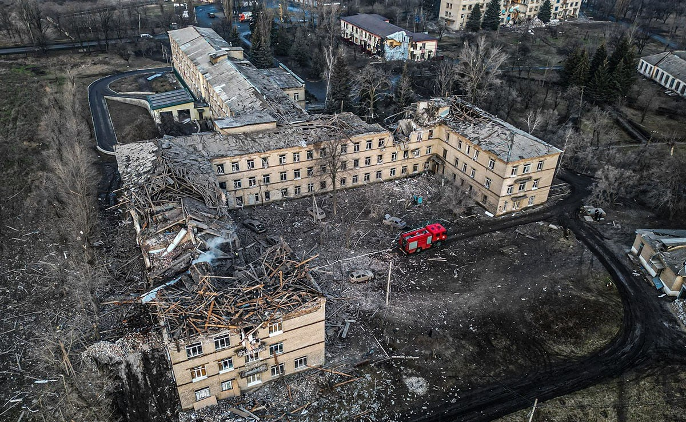

import RedirectButton from "../../../src/js/RedirectButton";

<RedirectButton to="/iasa-sc-blog/blog/en/selydove">Read in English</RedirectButton>

[Селидове](https://uk.wikipedia.org/wiki/%D0%A1%D0%B5%D0%BB%D0%B8%D0%B4%D0%BE%D0%B2%D0%B5) — місто в Донецькій області, розташоване на березі річки Солона, за 40 км на захід від обласного центру та за 20 км від Покровська, що нині є одним із найактивніших напрямків фронту. 
Раніше тут проживало орієнтовно 20 тисяч людей. Станом на зараз ситуація в Покровському районі суттєво погіршилася. Російська армія просунулася біля довколишніх населених пунктів: Маринівки та Українську. 
Містечко вже тривалий час штурмують загарбники. Наступальні дії ведуться одночасно з кількох боків, однак українські військові тримають оборону. 

<!-- truncate -->

---

> Деяка інформація, наведена в статті, може бути застарілою. Будь ласка, звертайте увагу на дати в джерелах і використовуйте альтернативні новинні ресурси. 

---

<figcaption>Прапор і герб <a href="https://selidovorada.gov.ua/">міста</a></figcaption>

## Колись давно…

У 1770-1773 роках козаки, які прямували із Запоріжжя на Кубань, заснували поселення. [За легендою](https://hive.blog/hive-160799/@chornogorsky/donecka-oblast-selidove-donetsk-region-selidov), при переправі через річку Солону в них зламався віз, тож вони були змушені залишитися на ночівлю. Назва містечка походить від прізвиська отамана — Селид. 
Частина козаків залишилася й почала вести на цьому місці осілий спосіб життя, займатися господарством.

<figcaption>Пам’ятник козакам-засновникам та монумент «Козак у дозорі»</figcaption>

 

Протягом подальших років після заснування воно [активно заселялося](http://www.kozatstvo.org.ua/ua/publications/uk_r.php?d=a&i=775). Із середини 19 століття на довколишніх територіях розвинувся видобуток кам’яного вугілля, особливий поштовх він отримав після спорудження залізниці поблизу у 1880-х роках. 
Більшість шахт у долині річки Солоної були [кустарними](https://uk.wikipedia.org/wiki/%D0%97%D0%B0%D0%BA%D1%80%D0%B8%D1%82%D1%96_%D1%88%D0%B0%D1%85%D1%82%D0%B8_%D0%A1%D0%B5%D0%BB%D0%B8%D0%B4%D0%BE%D0%B2%D0%BE%D0%B3%D0%BE), і їх залишки досі збереглися біля містечка. 

Події 1914-1921 років спричиняли зміни влади та настроїв у регіоні, але, зрештою, тут [закріпився більшовизм](https://ukrssr.com.ua/donetska/selidove-donetska-oblast), і розпочалася колективізація. Під час Другої світової в місті було зруйновано багато об’єктів, у тому числі [лікарню](https://selydivska.cml.org.ua/istorychnyj-shliakh/). 
Статус міста та нову назву «Селидове» (До того – село Селидівка) отримало в 1956 році. Зрештою, воно стало типовим шахтарським містечком.

<figcaption><a href="https://www.bbc.com/ukrainian/features-58360575">Закинута шахта</a> ім. Коротченка та терикони, Селидове</figcaption>

 

Лінія фронту 2014-2022 років знаходилася відносно далеко, однак бойові дії позначилися проблемами з водо- та електропостачанням. 
У період замороження конфлікту, перед лютим 2022 року, місто активно покращувалося: розбудовувалася школа та розвивалася лікарня, було відкрито [басейн](https://ddk.dn.ua/news/article/173951/), стадіон. 

<figcaption>Відремонтований басейн</figcaption>

 

Після початку повномасштабного вторгнення Селидове зазнало жахливих руйнувань. Нині околицями міста проходить [лінія фронту](https://suspilne.media/donbas/835945-voroga-ne-dopuseno-recnik-15-brigadi-pro-situaciu-navkolo-mista-selidove/). 
Нещодавно російські військові [скинули](https://www.ukrinform.ua/rubric-ato/3878022-vijska-rf-znovu-skinuli-aviabombi-na-selidove-patero-poranenih.html) дві керовані авіабомби, унаслідок атаки щонайменше п’ять людей загинули й вісім були поранені. 
Пошкодження [отримали](https://www.pravda.com.ua/news/2024/07/5/7464344/) близько 15 приватних будинків. За останні два роки було [зруйновано](https://24tv.ua/rosiya-zavdala-aviuadaru-po-selidovomu-donetskoyi-oblasti-ye_n2583758) сотні житлових споруд, підприємств та об’єктів критичної інфраструктури міста, пошкоджено більшість навчальних закладів. 
Зважаючи на це, значна частина населення евакуювалася. Зокрема, покинути рідний дім довелося нашій студентці другого курсу, Саші.

<figcaption>Адміністративна будівля в центрі міста після ворожих <a href="https://t.me/selidyvskamva/13611">ударів</a></figcaption>

 

<figcaption><a href="https://t.me/dsns_telegram/23032">Обстріл</a> багатоповерхівки</figcaption>

 

<figcaption><a href="https://t.me/dsns_telegram/26899">Обстріл</a> багатоповерхівки</figcaption>

 

<figcaption>Міська лікарня після <a href="https://t.me/UA_National_Police/18902">ракетного удару</a></figcaption>

 

<figcaption>Наслідок <a href="https://novosti.dn.ua/news/378647-obstril-mista-selydove-dvi-lyudyny-zagynuly-11-poraneno">обстрілу</a> в центрі міста</figcaption>

## Історія однієї дівчини

> #### Розкажи трохи про себе, з чим тебе їдять?
> Я Саша, мені 18. Народилась у Донецьку, але зростала та жила до 16 років у невеличкому містечку за 40 км від обласного центру — Селидовому. Наразі проживаю в Києві, де й навчаюсь.

<figcaption>Саша</figcaption>

 

> #### При згадці рідного міста що перше спадає на думку?
> І хороше, і погане. Усе разом. Складно розділити теплі спогади й новини про руйнування знайомих куточків населеного пункту. Але, певно, у першу чергу на думку спадають мама, моя кімната, останні шкільні роки, прогулянки містом, прикрашена площа на свята й те, як усе колись було цілим… 
> Зазвичай певні моменти з минулого згадуються, коли бачу дописи про черговий обстріл. Тоді ж позитив у цих спогадах і замінюється сумом. 

<figcaption>Саша в рідному місті</figcaption>

 

> #### Які місця в Селидовому вважаєш особливими?
> Особливі для мене ті місця, з якими пов'язано найбільше спогадів: наша квартира, школа, музична школа, затишні дворики мого району, парк і так далі... 
> Адже це все асоціюється як із дитинством, так і з підлітковим віком. Там я гуляла з батьками після дитсадку, з друзями після школи, бігала між навчальними закладами через незручний розклад, знаходила котів у кущах і несла додому, каталася на санчатах під час зимових канікул... 
> Містечко невелике, тож у пам'яті зберігаються моменти майже з кожного куточка Селидового.

    

    

    
    <figcaption>Шкільні фото Саші</figcaption>

 

    
    <figcaption>Школа після <a href="https://t.me/selidyvskamva/17599">обстрілу</a> 23 серпня 2024</figcaption>

 

> #### Про які ще місця хотіла б розповісти? 
> Мар’їнка. Раніше це було зелене, спокійне передмістя Донецька. Одні з моїх найяскравіших дитячих спогадів пов’язані з хатою прабабусі там. У Мар’їнці мене вчили таблиці множення, кататися на роликах, збирати малину та аґрус. 
> Тут востаннє збиралася ледь не вся родина, і, поки дорослі поралися на городі, я гралась із собакою. Після 2014 ці території перетворилися на зону бойових дій, тож навідувалися ми з батьками туди вкрай рідко. А під час повномасштабного вторгнення Мар’їнка стала містом-привидом, де майже все зруйновано до фундаменту, і немає жодної живої душі.

    
    <figcaption>Саша з прабабусею в Мар'їнці</figcaption>

 

    

    

    
    <figcaption>Донецьк</figcaption>

 

> #### Чому з рідного Селидового ти так і не знайшла заміну / альтернативу в Києві?
> Дому. Коли заходжу до житла, немає відчуття чогось рідного, знайомого.

> #### Якою була твоя реакція на початок бойових дій у 2014, 2022 роках, нині? Як знайомі та родичі реагували?
> У 2014 мені було 7-8 років, тож на моє сприйняття здебільшого впливали батьки. А вони, своєю чергою, зробили так, аби я не відчувала приходу війни до нашого дому. До 2022 я не чула жодного вибуху, адже моє місто знаходилося не дуже близько до небезпечних територій. 
> До того ж під час найзапекліших боїв на Донеччині батьки відвозили мене до родичів у Запорізькій області. Для мене це просто була цікава зміна обставин та певна пригода. 
> 24 лютого 2022 я прокинулась о 6 ранку, аби підготуватися до контрольної з історії. А коли мені сказали, що почалося повномасштабне вторгнення, то не повірила в серйозність, не вірила що нас якось це зачепить, тож просто продовжила збиратися до школи. 
> Наступні дні постійно перевіряла новинні ресурси, адже не могла усвідомити, що все так погано, що це насправді відбувається.

> #### Розкажи, як ти покинула дім, і як складається твоє життя після цього.
> Із Селидового я поїхала 26 серпня 2022 року, більше я вдома не була. Дізналася про від’їзд десь за тиждень. Прямувала до родичів я самостійно. Останні дні в місті провела, збираючи всі речі, гуляючи з друзями. Також встигла востаннє навідатися до школи. Тоді там було відносно спокійно. 
> Останні два роки живу сама в орендованому житлі. Можу сказати, що в 16 років я не була готова до таких кардинальних змін. Але мене відправляли в безпечніше місце.

> #### Що допомагає тобі впоратися з поточними подіями? 
> Відчуття, що додому я більше не повернуся, було вже за пів року до того, як росіяни підійшли до міста. Можливо, на моє ставлення впливає час, який я провела вдалині звідти, а, може, це друзі з дому, з якими можна це все обговорити. 
> Головне — вміти відволікатись і не акцентувати свою увагу повністю на поганих новинах, адже вони просто з’їдають твоє життя та бажання робити хоч щось. Ситуація з моральним станом значно покращилась, коли я вступила до вишу, адже в моєму житті з’явилося багато нових знайомств, довелося приділяти багато часу навчанню.

> #### Як загалом йдуть справи з навчанням? Роботою в СР?
> Непогано. Бувають складнощі, проте мені це цікаво, тож я не проти докладати зусиль для розв'язання проблем, що виникають. Робота в Студраді відволікає й від навантаження під час навчання, і від негативу загалом.

<figcaption>Саша знала про своє покликання ще з дитинства</figcaption>

 

> #### Чи думала ти про повернення до рідного міста після закінчення бойових дій?
> Я не впевнена, що хотіла б бачили рідне місто зруйнованим. З одного боку, є сильне бажання побути вдома, з іншого, думаю, що це мене тільки розчарує. Нехай у моїх спогадах Селидове буде таким самим, як і до війни.

> #### Що б хотіла сказати читачам наостанок?
> Не варто все пропускати через себе: старайтеся відволікатися від поганих новин та жити далі. І водночас не забувати, чого вартує спокій у буденному житті. Кожен топонім цієї війни — чийсь дім.

#### Нагадуємо, що будь-хто може долучитися до допомоги Україні у війні:
- За [цим посиланням](https://savelife.in.ua/donate/) ви маєте змогу задонатити фонду «Повернись живим» на потреби армії. 
- [Тут](https://uanimals.org/links/) можна закинути певну суму благодійникам, що піклуються про евакуйованих із небезпечних територій тварин.