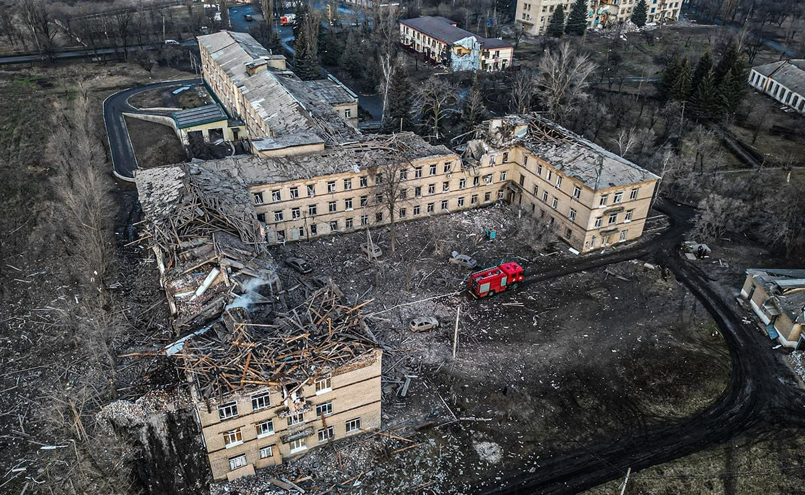

import RedirectButton from "../../../src/js/RedirectButton";

<RedirectButton to="/iasa-sc-blog/blog/selydove">Читати українською</RedirectButton>

[Selydove](https://en.wikipedia.org/wiki/Selydove) is a town in the Donetsk region located on the river Solona, 40 kilometres west of the regional centre and 20 kilometres from Pokrovsk, which is currently one of the most active areas of the frontline. 
Around 20 thousand people lived here before. Now, the situation in its district has significantly deteriorated. Russian troops have pushed forward close to the nearby settlements: Marynivka and Ukrains’k. 
Invaders have been long storming the town. They are leading offensive operations simultaneously from several sides, but the Ukrainian military is holding the line. 

<!-- truncate -->

---

> Some of the information in the article may not be relevant. Please pay attention to the dates in the sources and use alternative media to find out the current state of affairs.

---

<figcaption>Symbols of the <a href="https://selidovorada.gov.ua/">town</a></figcaption>

## Once upon a time…

In 1770–1773 Cossacks who were moving from Zaporizhia to Kuban founded a settlement. 
According to the [legend](https://hive.blog/hive-160799/@chornogorsky/donecka-oblast-selidove-donetsk-region-selidov), their cart broke down while crossing the Solona River, so they were forced to stay overnight. 
Their Otaman's name was «Selyd», and the village was named after him. Part of the Cossacks stayed and started living in this place, undertaking farming.

<figcaption>Monument to the Cossacks-founders and the monument «Cossack on guard»</figcaption>

 

It was actively [populated](http://www.kozatstvo.org.ua/ua/publications/uk_r.php?d=a&i=775) in the years following its foundation. 
Since the mid-19th century, hard coal mining has been developing in the surrounding areas, and it received a special boost after the construction of the nearby railroad in the 1980s. 
Many of the mines in the Solona River valley were [artisanal](https://uk.wikipedia.org/wiki/%D0%97%D0%B0%D0%BA%D1%80%D0%B8%D1%82%D1%96_%D1%88%D0%B0%D1%85%D1%82%D0%B8_%D0%A1%D0%B5%D0%BB%D0%B8%D0%B4%D0%BE%D0%B2%D0%BE%D0%B3%D0%BE), and their remains can still be seen near the town.

The 1914–1921 events led to power and sentiment changes in the region, eventually, [Bolshevism](https://ukrssr.com.ua/donetska/selidove-donetska-oblast) took hold and collectivization began. 
It is documented that many facilities there, including the hospital, were [destroyed](https://selydivska.cml.org.ua/istorychnyj-shliakh/) during World War II. 
In 1956, the village of Selydivka received the city status and the new name — «Selydove». After all, it became a typical mining town.

<figcaption><a href="https://www.bbc.com/ukrainian/features-58360575">Abandoned mine</a> named after Korotchenko and slagheaps, Selydove</figcaption>

 

The frontline in 2014-2022 was relatively far from the outskirts, but the hostilities caused problems with water and electricity supply. 
Selydove was actively developing during the military conflict freezing period, before February 2022, there were reconstruction of a school and hospitals, opening a [swimming pool](https://ddk.dn.ua/news/article/173951/) and building a stadium.

<figcaption>Renovated swimming pool</figcaption>

 

During the full-scale invasion, Selydove suffered terrible destruction. 
Today, the [front line](https://suspilne.media/donbas/835945-voroga-ne-dopuseno-recnik-15-brigadi-pro-situaciu-navkolo-mista-selidove/) runs through the outskirts. 
Recently, russians dropped two guided [aerial bombs](https://www.ukrinform.ua/rubric-ato/3878022-vijska-rf-znovu-skinuli-aviabombi-na-selidove-patero-poranenih.html), killing at least five people and wounding eight more. 
About 15 private houses were [damaged](https://www.pravda.com.ua/news/2024/07/5/7464344/). 
Over the past two years, hundreds of residential buildings, businesses, and critical infrastructure in the city have been [destroyed](https://24tv.ua/rosiya-zavdala-aviuadaru-po-selidovomu-donetskoyi-oblasti-ye_n2583758). 
Most educational institutions were damaged. Given this, a significant part of the population evacuated. 
In particular, our second-year student, Sasha, had to leave her home.

<figcaption>Administrative building in the town center after enemy <a href="https://t.me/selidyvskamva/13611">strikes</a></figcaption>

 

<figcaption>Shelling of a residential <a href="https://t.me/dsns_telegram/23032">building</a></figcaption>

 

<figcaption>Shelling of a residential <a href="https://t.me/dsns_telegram/26899">building</a></figcaption>

 

<figcaption>The <a href="https://t.me/UA_National_Police/18902">town hospital</a> after a missile attack</figcaption>

 

<figcaption>Consequence of <a href="https://novosti.dn.ua/news/378647-obstril-mista-selydove-dvi-lyudyny-zagynuly-11-poraneno">shelling</a> in the city cente</figcaption>

## There was a girl…

> #### Tell us your story and what you're all about.
> I'm Sasha, and I’m 18 years old. I was born in Donetsk but grew up and spent the first 16 years of my life in a small town 40 km from there — Selydove. Now I live and study in Kyiv.

<figcaption>Sasha</figcaption>

 

> #### What first comes to mind when you think of your hometown?
> Both good and bad things, all at once. It's hard to separate the warm memories from the news about the destruction of familiar places. 
> But probably, the first things that come to mind are my mum, my room, my last school years, hikes around the town, the decorated square on holidays, and how everything was safe and intact... 
> I usually recall moments from the past when I see posts about recent shellings, and the sadness starts replacing the positive feelings.

<figcaption>Sasha in her hometown</figcaption>

 

> #### What places in Selydove do you consider special?
> The most special places for me are tied to the memories: our flat, the school, the music academy, the cosy courtyards in my neighbourhood, the park, and so on. 
> They all remind me of my childhood and teenage years, as I used to walk with my parents after kindergarten, hang out with friends after lessons, overcome overlapping schedules by rushing between different classes, find cats in the bushes and bring them home, sledge during winter holidays too... 
> It's a small town, so I got memories from almost every corner of Selydove.

    

    

    
    <figcaption>Sasha's school photos</figcaption>

 

    
    <figcaption>The school after the <a href="https://t.me/selidyvskamva/17599">attack</a> on August 23, 2024</figcaption>

 

> #### Any other places you'd like to talk about?
> Marinka. It used to be a green, quiet Donetsk suburb. Some of my brightest childhood memories belong to my great-grandmother's house there. 
> In Marinka, I learned the multiplication table, rollerblading, was picking raspberries and gooseberries. This is the place where the whole family gathered last time, and while the adults were working in the garden, I was playing with the dog. After 2014, those areas became a part of the warzone, so we rarely paid visits. 
> During the full-scale invasion, Marinka became a literal ghost town, with almost everything burned to the ground, and no living soul left.

    
    <figcaption>Sasha with her great-grandmother in Marinka</figcaption>

 

    

    

    
    <figcaption>Donetsk</figcaption>

 

> #### What thing from Selydove haven't you been able to replace here, in Kyiv?
> The feeling of home. When I walk into my apartment, it doesn't feel familiar or homely.

> #### What was your reaction to the start of the war in 2014, 2022, and now? How did your friends and family react?
> In 2014, I was 7 and 8 years old, so my parents mostly influenced my perception. 
> They made sure I didn't feel the war come close to our home. Until 2022, I hadn't heard a single explosion because my town wasn’t too close to the dangerous areas. 
> During the fiercest battles in Donetsk, my parents took me to relatives in the Zaporizhzhia region, so for me, it was just an interesting change of scenery, a bit of an adventure.
> On February 24, 2022, I woke up at 6 a.m. to prepare for a history test. When I was told that a full-scale invasion had begun, I didn’t believe it would affect us, so I continued getting ready for school. In the following days, I constantly checked the news since I couldn't believe how bad things were and that this was happening.

> #### Tell us how you left home and how your life has been since.
> I left Selydove on August 26, 2022, and haven’t been back since. I found out I'm going to leave only about a week before. 
> Furthermore, I was passing alone, heading to relatives. I spent my last days in the town packing up, walking with friends, and visiting my school one last time. It was still relatively calm there. 
> For the past two years, I’ve been living alone in rented housing. At 16, I for sure wasn't ready for such drastic changes, but I was sent to a safer place.

> #### What helps you cope with current events?
> The understanding that I wouldn’t be able to come back home anymore came half a year before russian troops approached the town. Maybe the time I’ve spent away from there influences my attitude, or maybe it’s the friends from my hometown with whom I can discuss it. 
> The main thing is to know how to distract yourself and not focus entirely on bad news because it can eat away at your life and motivation. My mental state significantly improved when I enrolled in the university, met many new people, and studies started taking up a lot of my time.

> #### How’s your schoolwork going? How’s your work with the Student Council?
> It’s going well. There are challenges, but I find it interesting, so I don’t mind putting in the effort to solve problems. Working in the Student Council helps me to distract from both academic pressures and negativity in general.

<figcaption>Sasha knew who she was from a very early age</figcaption>

 

> #### Have you thought about returning to your hometown after the war?
> I’m not sure if I would want to see my hometown in ruins. On the one hand, I’d love to be at home, but on the other, I think it would just disappoint me. Let Selydove remain in my memories as it was before the war.

> #### Any final words for the readers?
> Don’t take everything to heart. Try to distract yourself from bad news and keep living. At the same time, don’t forget how much peace in daily life is worth. Remember: every spot on the map of this war is someone’s home.

#### We remind you that anyone can join in helping Ukraine in the war:
- Using [this link](https://savelife.in.ua/donate/), you can donate to the «Come Back Alive» fund for the needs of the army. 
- [Here](https://uanimals.org/links/) you can transfer money to volunteers who take care of animals evacuated from dangerous areas.