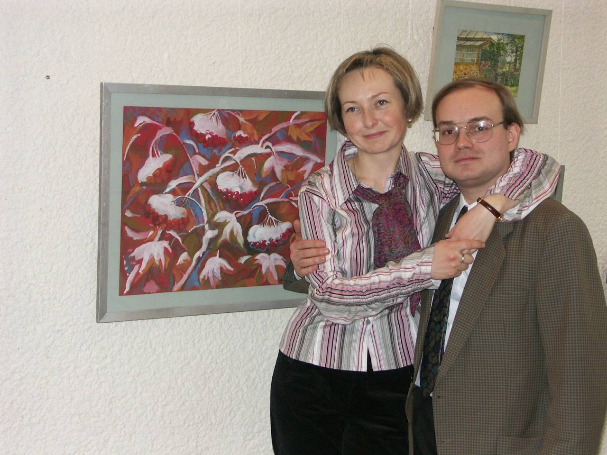

Безносик Олександр Юрійович

**_Дата та місце народження:_** 15.12.1973, м. Київ.

**_Освіта:_** Національний технічний університет України «Київський політехнічний інститут»;
факультет електронної техніки (зараз – факультет електроніки);

**Cпеціальність:** Комп’ютерні системи проектування.

## **_Передбачення розпаду СРСР та інші теплі дитячі спогади юного Олександра Юрійовича_**

**Можете розказати, які у Вас були захоплення в дитинстві?**

Мої захоплення, я б сказав, залишилися з дитинства й дотепер. Саме як хобі, наприклад, перше — це футбол, друге — колекціонування моделей автомобілів.

**В акаунті на фейсбуці зазначено, що Ви навчалися в 31 школі м. Києва. Згадуєте ці часи з приємною ностальгією або навпаки, з полегшенням, що це все закінчилося?**

У моєму фейсбук-акаунті якось дуже мало інформації. Може, у цьому сенсі я не дуже сучасний \*_сміється_\*. Не знаю чому, але не дуже полюбляю користуватися соціальними мережами.
Коли треба щось комусь написати, то я використовую. Але як постійний осередок перебування, активні переписки чи дописи, то ні.

Щодо запитання: та ні, чому ж. У принципі, з ностальгією. Навчався нормально, та взагалі клас хороший був, і вчителі.
У школі ми після уроків до вечора грали у футбол. Тому в цьому сенсі я про неї нічого поганого сказати не можу, все було дуже добре.
Після школи я вже у футбол не грав, і в інституті серед друзів не було тих, хто дуже захоплювався.

**А були у Вас такі викладачі, про яких досі пам'ятаєте й згадуєте з теплом?**

Була вчителька в перших трьох класах. Ви знаєте, напевно, цю систему: перші чотири класи — це молодша школа, а тоді їх було три.
Можу також згадати вчителя фізики Столярова Юрія Олександровича. Крім точних наук, я завжди захоплювався історією.
У нас був чудовий вчитель, Добко Олег Іванович. Коли Литва першою з радянських республік оголосила про вихід зі складу СРСР, він нас привітав з цією подією,
із початком розпаду Радянського Союзу. Але що цікаво — у нашій школі було два вчителі історії, вони навіть товаришували між собою,
але в другого були геть інші погляди — він був затятим сталіністом. І в тих випадках, коли він на уроці в нашому класі підміняв Олега Івановича,
ми могли чути зовсім інший погляд на історію. А в цілому – було багато гарних вчителів.

**Ви були слухняною дитиною та сумлінним учнем або, навпаки, завдавали клопоту своєю поведінкою?**

Ні, я завжди тихий був, не бешкетував. Бувало, ми спільно з товаришами уроки прогулювали за компанію, але так, особисто я нічого такого не творив.

**Можете розказати, як Ви проводили свої літні канікули в шкільні роки?**

В основному в літній час я подорожував Україною, бував і в інших місцях Радянського Союзу, за кордон тоді ще не їздили.
Взагалі, ми жили в одній квартирі з бабусею, дідусем та батьками. Вони працювали, тому, в основному, дитинство з бабусею пройшло, яка, до речі, довго прожила — 97 років.
А дідусь — 99 років, тому з ними в мене пройшло не тільки дитинство. Влітку їздили на різні курорти, бази відпочинку, на море. Пам’ятаю Крим, Одеську область...

Тобто, літо переважно проходило не в Києві. Раніше полюбляв і зараз люблю мандрувати. З батьком багато взагалі подорожували Україною.
Від нього з’явилась зацікавленість архітектурою, в першу чергу — церквами, монастирями. Об'їздили західну і центральну Україну.
Наші родичі жили в Таллінні, тому я там теж бував декілька разів десь у вісімдесятих, дуже мені подобається це місто.
Мабуть, друге моє улюблене після Києва. Але вже після розпаду Радянського Союзу я там не бував, якось не довелося.
Мені до вподоби кудись їздити, дивитися нові міста. У дитинстві багато бував на морі. Але зараз мені такий відпочинок, пляжний, не дуже цікавий.
Більше подобається бачити щось нове, відвідувати різні міста та країни по можливості. Уже як коронавірус і війна почалися, то, звісно, такої можливості не було.
Але раніше я при нагоді намагався кудись їздити.

**Яким було дитинство в ті часи?**

Про дитинство я нічого такого не можу поганого сказати. Нормально жилося, як для дитини, то мені було нормально.
Хоч зараз Радянський Союз уже не дуже прийнято згадувати в нормальному контексті, але для дитини, то були нормальні часи.
Єдине, що я можу згадати, це листопад 1986 року, я був із батьком на футболі. Матч Динамо — Селтік, було холодно, і я тоді сильно захворів, мав запалення легенів.
Я хворів доволі часто, але це єдиний раз у житті, коли опинився в лікарні. Тоді ж не було мобільних телефонів, а батьків до лікарні не пускали, тому отримував передачі й листами обмінювалися.
І я тоді з лікарні написав таку записку: «Якщо в нас такі лікарні в країні, то куди ми йдемо?». Так воно й вийшло. Через п'ять років розвалився Радянський Союз.
Тобто я по лікарні зрозумів, що тут «кіна не буде» \*_сміється_\*.

**Це було Ваше пророцтво. Можете розказати трохи про ваших батьків, які спогади, які взаємини були у Вас із ними?**

Батько працював у КПІ. Може, це спадково, що я теж викладачем став. На жаль, він помер минулого року від раку.
Він усе життя вчився й працював на іншому факультеті. Мама живе зараз у Німеччині, а раніше працювала в інституті автоматики: не знаю, чи існує він зараз хоч у якомусь стані.
Батьки розлучилися в другій половині вісімдесятих, проте нормальні стосунки завжди були між ними та між нами. Проблем не було в цьому сенсі.

**Розкажіть про останні роки школи. Як готувалися до екзаменів, як склали?**

Вчився я добре, але у звичайній, не спеціалізованій школі. До вступу потрібна була ще додаткова допомога, тому я займався з вчителями.
Раніше було три екзамени замість ЗНО: математика, фізика та мова.
Я закінчив школу зі срібною медаллю, тому складав тільки один іспит — з математики. Він містив п’ять завдань, останнє — найскладніше.
Я ніяк не міг зрозуміти, з чого потрібно почати, щоб розв’язати його. У мого сусіда також виникли проблеми з цим завданням.
Дивлюсь: у нього помилка чисто технічна, а ідея правильна. Я допоміг йому, він — мені, таким чином я й склав.
А фізику я завжди знав гірше математики та і не дуже любив її, але попри це одного разу зайняв третє місце на районній олімпіаді.

## **_Прогули пар, списування, юність у колгоспі та початок шляху в КПІ_**

  Юний Олександр Безносик та присяга на військовій катедрі, 1995 рік.

**У який момент Ви остаточно вирішили вступати саме в КПІ?**

Як я вже згадував, батько працював тут, а дідусь закінчував його ще перед війною, тому не було таких питань: КПІ чи ні.
Тим паче, раніше не було такого, що подаєш п’ять заяв у різні університети. Куди саме вступати вирішувалось спонтанно.
Думав про ФІОТ, але через складність туди потрапити вирішив, що САПР, (стара назва спеціальності — прим. ред.), підходить ідеально.
Зараз я ні про що не шкодую, усе добре.

**Які предмети Вам подобалися за часи навчання?**

Можу сказати, що мені більше всього не подобалось, — філософія. Фізику не дуже любив, вивчив на «чотири», мені було достатньо. А ось математику перескладав тричі, щоб отримати п’ятірку.
З програмування було мало предметів, більше пов’язаних із електронікою, моделюванням. Усе-таки орієнтація (катедри — прим. ред.) змінилась.

**Чи завжди Ви були максималістом у навчанні?**

У принципі, так. Червоний диплом я все ж таки отримав, але раніше допускалася якась кількість четвірок.

**Які у Вас були взаємини з групою? Ви можете назвати себе компанійською людиною?**

Я скоріше «домашня» людина. Брати участь в усіляких сумнівних заходах мені не хотілося, але й на самоті бувати не люблю.
На першому курсі сформувалась вузька група з чотирьох людей, так ми потім і збиралися разом, наприклад, щоб зробити розрахункові.
Я вступив у 90-му році, останньому, коли студентів відправляли в колгосп для збору врожаю. Плюсом КПІ було те, що вони відправляли своїх студентів у Крим, біля міста Саки.
Мені здається, збирати помідори було легше, ніж якщо б ми збирали картоплю. Там ми дуже здружилися з групою: купалися, грали в карти вечорами.

У колгоспі, 1990 рік.

**А було таке, що пропускали пари, щоб поспати довше чи банального випити пива з друзями?**

Заради сну точно ні. Я на Дарниці живу, а це більше години до КПІ. Взагалі, якоїсь вагомої причини, щоб прогулювати, не було.
Може окремі такі випадки були, але зараз і не пригадаю. Уже пізніше, коли став викладачем,
кафедра певний час знаходилася на Печерську, туди мені набагато зручніше було добиратися...

**До речі, під час захисту лабораторних робіт Ви частенько звинувачуєте студентів у порушеннях правил та норм академічної доброчесності.
А коли Ви були студентом, чи не було у Вас таких грішків?**

У принципі, я робив усе майже самостійно. Раніше часто практикувалися колективні завдання та лабораторні роботи, тому іноді я міг робити менше, ніж інші.
Я завжди кажу своїм студентам, що вони можуть щось списати, але повинні розуміти, що там написано.
Тому навіть у таких ситуаціях я знав, що там написано, й розумів, що і як працює.

## **_Викладання в ІПСА та відносини зі студентами_**

**Чи замислювалися Ви під час навчання в КПІ, що станете викладати тут чи у Вас були інші амбіції та плани? Не жалкуєте про свій вибір?**

Можливо, це було через мого батька, який працював викладачем у КПІ протягом усього життя,
але я відразу ж орієнтувався на те, що стану викладачем і піду на аспірантуру. Я не знаю, чи було це правильним рішенням на той момент,
і чи не краще було б працювати в якійсь компанії, щоб заробляти більше грошей, але зараз я не жалкую про свій вибір.

**При пошуку інформації для інтервʼю ми дізналися з сайту катедри, що кількість Ваших наукових робіт сягає більше тридцяти одиниць.
Розкажіть, якою була Ваша мотивація створювати їх.**

Насправді, це зовсім небагато. Зараз ця кількість, напевно, сягає близько шістдесяти…
Наприклад, при підготовці до захисту дисертації обов'язково потрібно опублікувати декілька робіт — чим не мотивація? \*_сміється_\*. Зараз КПІ стимулює викладачів до активності, тож, хочеш-не-хочеш, а доводиться писати \*_сміється_\*.

Молодіжна конференція у Веймарі, ФРН, 1998 рік.

**Що Вам подобається в роботі зі студентами?**

Подобається, коли студенти хочуть чомусь навчитися та все вчасно роблять, але це не завжди виходить. Є викладачі, які хочуть донести все навіть до двієчника, але я так не вмію і не знаю, чи так взагалі потрібно робити. Моє основне завдання — допомогти тим, хто справді цього бажає. Але хотілося б, щоб студентів, які справді в цьому зацікавлені, було трохи більше. Мені не дуже подобається ставити двійки та відраховувати когось, тим більше в наш складний час.
Але, якщо людина хоч мінімально щось знає та хоче навчитись, то я завжди готовий допомогти.

**А чи є певні моменти, які навпаки дратують у роботі зі студентами?**

Звісно, трохи дратує, коли студенти не роблять усе вчасно і здають в останні дні, але я вже звик до цього, адже, на жаль, так побудована студентська психологія, і багато хто працює в цьому режимі. Буває так, що деякі поводять себе трохи нахабно. Наприклад, коли хтось списав курсову роботу слово в слово, лише змінивши прізвище та імʼя в протоколі, й каже, що все сам зробив.

**Чи були у Вас конфліктні ситуації? Деякі студенти плакали після ваших захистів. Як Ви реагували, коли таке траплялося?**

Я намагаюся ніколи не доводити до такого, серйозних конфліктів наче й не було.
Були випадки, коли дівчата якось близько сприймали мої слова та починали плакати, й мені доводилося їх заспокоювати,
але я стараюся вирішувати такі ситуації спокійно.

**Чи є якісь труднощі, з якими Ви часто стикаєтеся на роботі, та що мотивує Вас не опускати руки?**

Найбільші труднощі викликає нестабільність, пов'язана з постійними змінами та різними факторами.
Це особливо відчувається через мою відповідальність за організаційні питання. Проте загалом усе гаразд: мені подобається колектив, і я дуже поважаю багатьох викладачів,
у яких колись навчався. З точки зору атмосфери мені дуже подобається.
У вашому привітанні на честь 13-річчя ІПСА Ви сказали, що бажаєте, аби кількість та якість студентів, у тоді ще молодому інституті, тільки зростала.
Чи сталося це, на Вашу думку? Чи прислухаються студенти до Вашої постанови пам’ятати, де вони навчаються і що мають ставитися до факультету відповідним чином?
В основному я з першим курсом працюю, трохи з третім, був раніше і пʼятий, але з першим курсом цікавіше в тому сенсі,
що вони більше чогось хочуть та все ж таки ще налаштовані вчитися. Але по спілкуванню з ними мені здається, що середній рівень студентів,
які вступають, потроху падає, через купу об’єктивних факторів, особливо останнім часом.
Звісно, кожен рік є супер талановиті студенти. Проте роботу знаходять навіть ті, хто не дуже добре навчався.
Такі студенти просто знають лише свій профіль. Вони не дуже вчили інші предмети, але в результаті можуть заробляти навіть більше, ніж викладачі, і це нормальний процес.

> ## **_«У житті є дві речі, до яких я байдужий: це музика та образотворче мистецтво. Але так сталося, що моя дружина — художник, а син — музикант»_**

**Час переходити від любові до вашої роботи до справжнього кохання. Можете розповісти про свою першу закоханість, яку Ви пам’ятаєте?**

Ми навчалися з нею разом до 6 класу, потім уже перейшла в іншу школу. Вона завжди мені подобалась, але ми були тільки друзями.
Ця дівчина мене знайшла на фейсбуці, тож ми й досі спілкуємося. У неї своя сім’я, у мене своя, але в школі вона мені дійсно дуже-дуже подобалась.
Вона вийшла заміж раніше, ніж я одружився, так сталося. Настпуне кохання — моя дружина, і все, у принципі.

**А як Ви познайомилися з дружиною? Чим вона Вас зацікавила?**

Річ у тім, що в житті є дві речі, до яких я дуже спокійно або навіть байдуже ставлюся: це музика та образотворче мистецтво.
Але так сталося, що моя дружина — художник, а син — музикант \*_сміється_\*. Моя тітка та мати моєї майбутньої нареченої працювали на заводі «Арсенал» разом.
Нас познайомили, тому що їй треба була допомога з комп’ютером. Вона тоді навчалася в Національній академії образотворчого мистецтва і архітектури,
у неї була персональна виставка в бібліотеці КПІ, куди я заходив. Одружилися ми за 4 роки після того.

**Вона Вам розповідала, яке Ви справили на неї перше враження?**

Вона охарактеризувала мене як «обстоятельный» (розсудливий, розважливий — прим. ред.), не знаю як українською сказати. Потім вже багато років пройшло, а я тоді зробив щось не те, і вона мені згадала: «Вот мне показалось, что ты такой обстоятельный» — а я тоді несерйозний виявився у якомусь питанні. Так і запам’ятав її перше враження.

**До речі, а в якому стилі вона малює?**

За спеціальністю вона художник-графік, проте більшість її робіт — це дитяча література, скажімо, журнал «Малятко», а також ілюстрації до дитячих книжок. Окрім цього, пише творчі роботи та бере участь у виставках.

**Ви сказали, що у професійному плані трішки розбіжні. А які маєте тоді спільні точки дотику з дружиною, хобі, інтереси? Що вас об’єднує?**

Ми дійсно маємо дуже різні погляди, але може, це й добре. Футбол вона не любить, наприклад \*_сміється_\*.
Я навіть жодного разу не зміг умовити її на нього сходити. Разом ми, звісно, мандрували по Європі, коли була можливість,
але думаю, що це всім подобається. Якщо говорити про щось спільне, то дуже мало такого, але нам це не заважає.
Хоч я і не дуже розуміюся в мистецтві, але приєднуюся до дружини, коли вона відвідує музеї.
Можливо, об'єднує ще те, що домашні такі, спокійні. Ми не любимо, знаєте, тусовки всілякі, щось галасливе.

**А що ще Ви в ній цінуєте? Які якості Вам подобаються?**

Турбота, яка проявляється в різних питаннях. Про сім’ю, скажімо.

У парку палацу Німфенбург, Мюнхен, 2019 рік.

**У Вас є син 2001 року народження. Чи виникав у Вас конфлікт поколінь під час його виховання і, можливо,
саме робота зі студентами допомогла Вам здобути досвід у спілкуванні з дітьми такого віку?**

Із сином ми мало схожі характером, тому що зовсім не домашній, на відміну від мене.
Він завжди десь гуляє з друзями і так далі. Добре, що комендантська година — повинен об одинадцятій повернутися,
інакше і о першій ночі, і о другій — то було нормально. Тому син у цьому сенсі більш самостійний для свого віку, нас,
батьків, уже мало слухається. Але як таких конфліктів, мабуть, не було. Інколи я можу бути чимось незадоволений, його поглядами на щось.

**Де він навчається та працює?**

Він навчається в Київській муніципальній академії музики ім. Р.М. Глієра на другому курсі бакалаврату.
Працює вже і в оркестрі , і в Дитячо-юнацькому центрі Дарницького району (ДЮЦ). У дитячому садочку вчительці музики здалося, що в нього є здібності,
і вона порекомендувала його прослухати. Я дуже здивований був. У нас у сім’ї взагалі ніколи нікого близького до музики не було.
Він грає на кларнеті в оркестрі Українського Радіо, навчає цього маленьких дітей. Гроші вже сам заробляє, тому він у цьому сенсі більш самостійний.
Після початку війни, син з Київським симфонічним оркестром (тоді він там працював) були в Німеччині — давали концерти та заробляли гроші для країни.

**Ніколи у Вас не було думок щодо продовження сином вашої сімейної традиції — вступу до КПІ?
Можливо, Ви б хотіли, щоб він займався програмуванням чи чимось іншим?**

Він навчався спочатку у звичайній початковій школі, а з 5 класу у фізико-математичному ліцеї, але успіхи були так собі, середні.
Тобто чим старший ставав, тим трішки гірше було в навчанні, і я зрозумів, що йому не було це цікаво. Музикою він з шести років займався, це його зацікавило, мабуть, більше, ніж математика з фізикою та програмуванням. До 9 класу провчився у ліцеї, потім вже в музичному коледжі. Більш-менш нормально закінчив школу, але я зрозумів, що програмування й таке інше — це не його.

**Що об’єднує вас як родину, що згуртовує? Як ви проводите вільний час разом? Можливо, є певні сімейні традиції чи активності?**

Якщо є можливість, ми з сином можемо сходити на футбол, але дружину ж туди не затягнеш.
Я готовий новим містом гуляти хоч зранку до ночі, а вони — ні, не такі фанати в цьому сенсі.
Основні пам’ятки, музеї, щось цікаве подивитись — і на цьому все, а я можу лазити по місту довго.
Я якось особливо не замислювався раніше в такому сенсі, але дійсно — ми, троє,
доволі різні за характерами, поглядами, вподобаннями... але нам це не заважає \*_сміється_\*.

Дінан, Бельгія, 2019 рік.

Сади Анневуа, Бельгія, 2019 рік.

## **_«Обстоятельный» бліц_**

**Дистанційне чи очне навчання?**

Якщо обирати прямо зараз, я б сказав дистанційка.

**Яка Ваша улюблена страва?**

Бефстроганов. З продуктів люблю сир.

Брюссель, 2016 рік.

**Лекція чи прийом лабораторних?**

Лабораторні — це якось живіше, мені здається.

**Ваша найкраща та найгірша риса характеру?**

Не знаю, чи можна сказати, що доброта — це найкраща, але так воно і є, можливо, навіть занадто.
Найгірша — занудливість. Бувають такі ситуації.

**Планування чи спонтанність?**

Планування. Зі спонтанністю ми зовсім різні.

**Країна, яку хочете відвідати?**

Я був у материковій Європі в різних країнах, але хотів би ще побувати в Англії.

**Що хочете там побачити?**

Якщо виділяти окреме місце, то можна згадати Бейкер-стріт. Мені дуже подобається Конан-Дойль і в цілому детективна література.
А взагалі, мені цікаві музеї та пам’ятки архітектури — як відомі, так і менш відомі.

**Улюблена мова програмування?**

Традиційно, С, тому що я більше з нею працюю. С — база для всього іншого.

**Ваша улюблена марка машини?**

Напевно, це Volvo.

**Ваше припущення, чому всі корпуси СП розвалюються?**

Тому що на кафедрі випромінюється багато енергії, яка й розвалює корпуси.

**Яку б книгу з програмування обрали? Прата чи Поляков?**

З цих двох — Прата.

**Перше, що Ви зробите після перемоги?**

У мене є дуже гарний старий коньяк, який я б відкоркував. Після цього поїхав би в Крим.

**Найкращий спосіб відпочити?**

Подорожі різними містами та країнами.

**Фільм, який Ви б рекомендували подивитися кожному.**

Я не люблю серйозне кіно та драми, тому що в житті і так багато складного. Люблю французькі комедії з Луї де Фюнесом 60-70-х років. Також хотів би виділити серіал «Шерлок».

**Можете описати себе однією фразою?**

Для мене це складно. Як я вже казав, я дуже «обстоятельный», та й взагалі не дуже люблю себе описувати.

**Попередній гість хотів би, щоб на його могильній плиті було написано «Принаймні, я намагався». А який напис хотіли б Ви?**

Для мене далекі філософські моменти. Я практичний і зовсім не люблю такі абстрактні речі.
Навіть дружина каже, що я зовсім не романтик. І це правда, у мені дуже мало романтики.
Там, внизу, буде все одно, що написано на плиті. Головне, щоб не було чогось поганого та люди нормально пам’ятали.

**Працювати в деканаті чи викладати?**

Викладати.

**Ваші улюблені виконавці?**

Можу виділити «The Beatles», а також з дитинства запам'яталась приємна музика шведської групи «ABBA».
І ще те, що дуже мені подобається — це творчість Висоцького, Окуджави, Галича...
Можна було б назвати й Розенбаума, але дивлячись на його сучасне ставлення до війни, не дуже хочеться згадувати.

**Прокидатися рано та робити все вдень, чи спати до останнього та робити все ввечері?**

Другий варіант. Коли треба, то я прокидаюсь вранці та роблю все, але я сова, не жайворонок.

**Колега, з яким/-ою Вам найкомфортніше працювати?**

Якщо брати з нинішнього складу кафедри, то Богдан Булах.

**Принципи, яких Ви намагаєтесь дотримуватись по життю? (Окрім SOLID)**

Намагаюсь бути чесним і завжди до всіх ставитися толерантно та з розумінням. Завжди хочеться, щоб у інших залишилось позитивне враження.
Нічого не робити такого, щоб комусь нашкодити.

**Чому Ви навчилися від студентів?**

Я став більш витриманим, у якомусь сенсі. Навчився терпіти навіть не дуже толерантних студентів.

**Ви схильні пробувати, але помилятись, чи бездіяти?**

Ні, я не йду на ризик. Можливо, це недолік. Бувають різні обставини, але краще все спланувати.

**Ваше улюблене місце в Києві?**

Поділ, Андріївський узвіз.

## **_Про футбол, гроші та кохання._**

**Ваш колега, Олександр Стусь, як відомо всім ІПСАшникам, щирий фанат футболу. Знаємо, що Ви розділяєте його високі почуття до цього спорту.
Чи хотіли б разом відвідати якийсь футбольний матч?**

Так, це було б цікаво. Було таке, що ми випадково зустрілися у 2012 році в потязі до Донецька.
Ми обидва прямували на чемпіонат з футболу, який тоді проходив в Україні. А так, звісно, можна було б на якийсь матч сходити разом,
коли вже дозволять це робити. Хоча можна було б і в Києві сходити, коли вже дозволять відвідувати матчі.
Я думаю, що він більший фанат, ніж я, принаймні останнім часом

Донбас Арена, Донецьк, 2012 рік.

**Студенти помітили, що під час захисту лабораторних робіт у Вас грає класична музика, хоча Ви не дуже запеклий фанат. Це через сина чи Ваша ініціатива?**

Насправді кілька разів син репетирував на кларнеті, але не голосно, можливо, ви мали змогу почути це.
Навіть якби я дуже любив музику, на парах не вмикав би.

**Уявімо, що гроші в цьому світі не мають значення. Чим би Ви займалися по життю, який фах обрали чи залишили би все без змін?**

Напевно, залишив би все без змін. Футболом трошки б займався, але особливого хисту до нього ніколи не було.
Я просто любив грати та дивитися. Тому, думаю, що нічого не змінював би, принаймні направлення лишив би те ж — комп’ютери.

**Яку можете дати пораду самому собі в минулому?**

Бути більш наполегливим у питаннях, де мені чогось не вистачило, та більш впевненим у собі.

**Ваша мрія або мета на найближчий час?**

Ви знаєте, що в нас на кафедрі проходить акредитація. Останні пів року це найбільша мрія для нас всіх.

**А Ваша особиста, яка не стосується роботи?**

Про подорожі я казав. Якщо все-таки брати реальність сьогоднішнього дня, то це закінчення війни нашою перемогою. А коли це станеться, то всі наші мрії стануть трошки реальнішими, бо зараз вони дещо обмежені. Потрібна перемога.

**І останнє на сьогодні — скільки коштує кохання?**

Воно ніскільки не коштує. Його так не можна оцінити. Кохання або є, або його немає. Хоча, знову ж таки, я — людина не дуже романтична, я більш такий практичний. Навіть коли якийсь подарунок треба, то я розмірковую, щоб він був практичний, а не просто якась прикраса, умовно кажучи. Але кохання дійсно не вийде оцінити. Воно — безцінне. Навіть важко пояснити, звідки воно береться. Коли ти когось кохаєш, можеш навіть не розуміти чому так сталося. Між людьми просто виникає така хімія, яку важко пояснити. Подобається людина та й все.

**Кохання — це хімія, а ми математики.**
